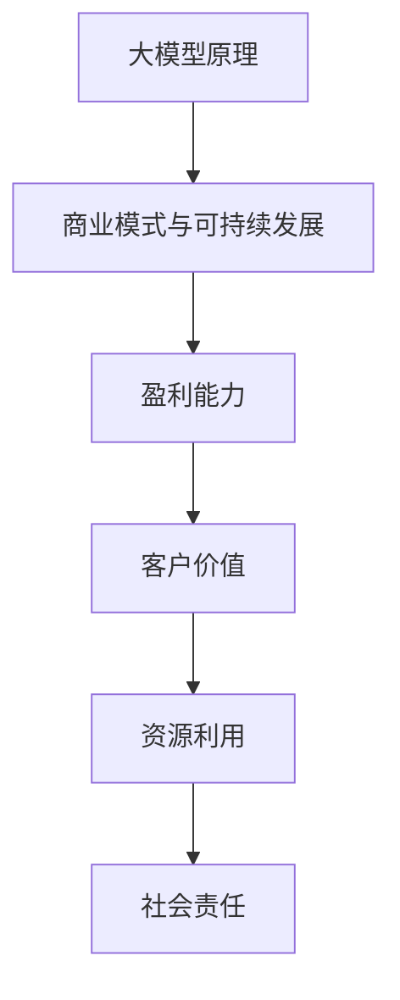

                 

关键词：人工智能大模型，创业，商业模式，可持续发展，技术创新。

> 摘要：随着人工智能技术的飞速发展，大模型已成为行业热点。本文将探讨AI大模型创业的可行性，分析构建可持续商业模式的策略和路径，以及未来发展趋势和面临的挑战。

## 1. 背景介绍

人工智能（AI）作为计算机科学的前沿领域，正逐渐改变着我们的生活和工作方式。近年来，深度学习技术的发展使得人工智能大模型（如GPT、BERT等）取得了显著的进展。这些大模型不仅具备强大的数据处理和分析能力，还能够进行自然语言理解、图像识别、语音识别等多模态任务。

随着AI大模型的技术成熟，越来越多的创业者将其应用于各个行业，探索创新商业模式。然而，AI大模型创业并非一帆风顺，如何在竞争激烈的市场中脱颖而出，构建可持续的商业模式，成为许多创业者面临的难题。

## 2. 核心概念与联系

### 2.1. 大模型原理

大模型是指通过深度学习技术训练出的具有亿级参数的神经网络模型。其核心原理包括：

- **多层感知器（MLP）**：多层感知器是神经网络的基础单元，通过多层非线性变换实现输入到输出的映射。

- **反向传播算法（BP）**：反向传播算法是一种用于训练神经网络的优化方法，通过不断调整网络权重，使输出结果更接近真实值。

- **批量归一化（Batch Normalization）**：批量归一化技术能够加速模型训练过程，提高训练效果。

### 2.2. 商业模式与可持续发展

商业模式是指企业通过提供产品或服务实现价值创造和利润分配的方式。一个可持续的商业模式应具备以下特征：

- **盈利能力**：企业能够在长期内保持盈利，实现可持续发展。

- **客户价值**：产品或服务能够满足客户需求，提供价值。

- **资源利用**：企业能够合理利用资源，降低成本。

- **社会责任**：企业承担社会责任，关注环境保护和员工福利。

### 2.3. Mermaid 流程图



## 3. 核心算法原理 & 具体操作步骤

### 3.1. 算法原理概述

大模型算法主要基于深度学习技术，通过多层神经网络结构进行模型训练和优化。具体包括以下步骤：

1. **数据预处理**：对原始数据进行清洗、归一化等处理，确保数据质量。

2. **模型构建**：设计神经网络结构，包括输入层、隐藏层和输出层。

3. **模型训练**：通过反向传播算法不断调整网络权重，使模型输出更接近真实值。

4. **模型评估**：使用验证集对模型进行评估，调整模型参数以优化性能。

5. **模型部署**：将训练好的模型部署到实际应用场景中，实现业务功能。

### 3.2. 算法步骤详解

1. **数据预处理**

   - 数据清洗：去除缺失值、重复值和异常值。

   - 数据归一化：将数据缩放到统一范围，如[0, 1]。

   - 数据分词：将文本数据切分成词语或字符。

   - 词向量化：将词语映射为向量表示。

2. **模型构建**

   - 输入层：接收预处理后的数据。

   - 隐藏层：通过多层非线性变换实现特征提取。

   - 输出层：输出预测结果或分类结果。

3. **模型训练**

   - 初始化模型参数。

   - 前向传播：计算输入到输出层的中间值。

   - 反向传播：计算梯度并更新模型参数。

   - 调整学习率：根据训练效果调整学习率。

4. **模型评估**

   - 验证集评估：使用验证集评估模型性能。

   - 调整模型参数：根据评估结果调整模型参数。

5. **模型部署**

   - 部署模型：将训练好的模型部署到实际应用场景中。

   - 接收输入：接收用户输入数据。

   - 输出预测结果：根据模型输出预测结果。

### 3.3. 算法优缺点

**优点**：

- **强大的数据处理能力**：大模型能够处理海量数据，提取有效特征。

- **高精度预测**：通过多层神经网络结构，大模型能够实现高精度的预测。

- **自适应学习**：大模型能够根据数据自动调整模型参数，实现自适应学习。

**缺点**：

- **计算资源需求高**：大模型训练和推理过程需要大量计算资源。

- **训练时间较长**：大模型训练时间较长，需要耐心等待。

- **数据质量要求高**：大模型对数据质量要求较高，需要处理缺失值、异常值等问题。

### 3.4. 算法应用领域

- **自然语言处理（NLP）**：文本分类、情感分析、机器翻译等。

- **计算机视觉（CV）**：图像识别、目标检测、图像生成等。

- **语音识别**：语音合成、语音识别、语音识别率提升等。

- **推荐系统**：个性化推荐、商品推荐、内容推荐等。

## 4. 数学模型和公式 & 详细讲解 & 举例说明

### 4.1. 数学模型构建

大模型的数学模型主要基于多层感知器（MLP）和反向传播算法（BP）。具体包括以下部分：

1. **输入层**：输入层接收预处理后的数据，每个节点表示一个特征。

2. **隐藏层**：隐藏层通过多层非线性变换实现特征提取，每个节点表示一个特征组合。

3. **输出层**：输出层输出预测结果或分类结果，每个节点表示一个类别。

4. **损失函数**：损失函数用于衡量预测结果与真实值之间的差距，常用的损失函数包括均方误差（MSE）和交叉熵（CE）。

### 4.2. 公式推导过程

假设输入层有 \( n \) 个特征，隐藏层有 \( m \) 个节点，输出层有 \( k \) 个节点。设输入向量为 \( X \)，隐藏层输出向量为 \( H \)，输出层输出向量为 \( Y \)。

1. **前向传播**

   \[ H = \sigma(W_1X + b_1) \]
   
   \[ Y = \sigma(W_2H + b_2) \]

   其中，\( \sigma \) 表示非线性激活函数，通常使用 \( \text{ReLU} \) 函数；\( W_1 \)、\( b_1 \)、\( W_2 \)、\( b_2 \) 分别表示权重和偏置。

2. **反向传播**

   \[ \delta_L = (Y - T) \odot \sigma'(Y) \]
   
   \[ \delta_H = (W_2^T \delta_L) \odot \sigma'(H) \]
   
   \[ \frac{\partial L}{\partial W_2} = H^T \delta_L \]
   
   \[ \frac{\partial L}{\partial W_1} = X^T \delta_H \]
   
   其中，\( \delta_L \) 表示损失函数的梯度，\( T \) 表示真实值，\( \odot \) 表示逐元素相乘；\( \sigma' \) 表示激活函数的导数。

### 4.3. 案例分析与讲解

假设我们要构建一个简单的文本分类模型，使用 \( \text{GloVe} \) 词向量作为输入特征，隐藏层使用 \( \text{ReLU} \) 激活函数，输出层使用 \( \text{Softmax} \) 函数。

1. **数据预处理**

   - 清洗文本数据，去除标点符号、停用词等。

   - 将文本转换为词向量表示。

   - 切分文本数据为训练集和测试集。

2. **模型构建**

   - 输入层：接收 \( \text{GloVe} \) 词向量。

   - 隐藏层：使用 \( \text{ReLU} \) 激活函数，层数为 2。

   - 输出层：使用 \( \text{Softmax} \) 函数，类别数为 10。

3. **模型训练**

   - 初始化模型参数。

   - 前向传播：计算输入到输出层的中间值。

   - 反向传播：计算梯度并更新模型参数。

   - 调整学习率。

4. **模型评估**

   - 使用测试集评估模型性能。

   - 调整模型参数。

5. **模型部署**

   - 将训练好的模型部署到实际应用场景中。

   - 接收用户输入文本，输出预测结果。

## 5. 项目实践：代码实例和详细解释说明

### 5.1. 开发环境搭建

- **Python环境**：Python 3.8及以上版本。

- **依赖库**：NumPy、TensorFlow、PyTorch等。

### 5.2. 源代码详细实现

```python
import tensorflow as tf
from tensorflow.keras.layers import Embedding, LSTM, Dense, Activation
from tensorflow.keras.models import Model

# 设置超参数
vocab_size = 10000
embedding_dim = 128
max_sequence_length = 100
hidden_units = 128
learning_rate = 0.001

# 构建模型
input_sequence = tf.keras.layers.Input(shape=(max_sequence_length,))
embedding = Embedding(vocab_size, embedding_dim)(input_sequence)
lstm = LSTM(hidden_units, activation='relu')(embedding)
output = Dense(1, activation='sigmoid')(lstm)
model = Model(inputs=input_sequence, outputs=output)

# 编译模型
model.compile(optimizer=tf.keras.optimizers.Adam(learning_rate), loss='binary_crossentropy', metrics=['accuracy'])

# 训练模型
model.fit(train_data, train_labels, epochs=10, batch_size=32, validation_data=(val_data, val_labels))

# 评估模型
test_loss, test_acc = model.evaluate(test_data, test_labels)
print('Test accuracy:', test_acc)
```

### 5.3. 代码解读与分析

1. **导入依赖库**：导入 TensorFlow 等依赖库。

2. **设置超参数**：定义词汇表大小、嵌入维度、最大序列长度、隐藏单元数和学习率等超参数。

3. **构建模型**：使用 TensorFlow 的 Keras API 构建序列模型，包括嵌入层、LSTM 层和输出层。

4. **编译模型**：设置优化器、损失函数和评估指标。

5. **训练模型**：使用训练数据训练模型，调整超参数以优化模型性能。

6. **评估模型**：使用测试数据评估模型性能，计算准确率。

7. **模型部署**：将训练好的模型部署到实际应用场景中。

## 6. 实际应用场景

### 6.1. 文本分类

文本分类是AI大模型应用的重要场景之一，如新闻分类、情感分析、垃圾邮件过滤等。通过大模型技术，可以实现对海量文本数据的快速分类，提高分类准确率。

### 6.2. 自然语言处理

自然语言处理（NLP）是AI大模型的重要应用领域，包括机器翻译、文本生成、问答系统等。通过大模型技术，可以实现对自然语言的深入理解和生成，提高 NLP 系统的性能。

### 6.3. 计算机视觉

计算机视觉是AI大模型应用的另一个重要领域，包括图像识别、目标检测、图像生成等。通过大模型技术，可以实现对图像的准确识别和生成，推动计算机视觉领域的发展。

### 6.4. 未来应用展望

未来，AI大模型将在更多领域得到应用，如自动驾驶、智能医疗、金融科技等。随着技术的不断进步，大模型将更加智能化、自适应化，为各行各业带来巨大变革。

## 7. 工具和资源推荐

### 7.1. 学习资源推荐

- 《深度学习》（Goodfellow et al.）：全面介绍深度学习理论和技术。

- 《动手学深度学习》（Zhalek et al.）：通过实战案例学习深度学习。

- 《Python深度学习》（Rasbt）：深入讲解深度学习在 Python 中的应用。

### 7.2. 开发工具推荐

- TensorFlow：一款流行的深度学习框架。

- PyTorch：一款高效的深度学习框架。

- Keras：一款易于使用的深度学习库。

### 7.3. 相关论文推荐

- "A Theoretically Grounded Application of Dropout in Recurrent Neural Networks"（2017）

- "Attention Is All You Need"（2017）

- "Transformers: State-of-the-Art Natural Language Processing"（2018）

## 8. 总结：未来发展趋势与挑战

### 8.1. 研究成果总结

近年来，AI大模型技术在理论、算法和应用方面取得了显著进展。深度学习技术的发展使得大模型具有更强的数据处理和分析能力，成为各行各业的重要工具。

### 8.2. 未来发展趋势

未来，AI大模型将继续向更高效、更智能、更自适应的方向发展。随着计算资源和数据量的不断增加，大模型的应用领域将更加广泛，推动人工智能技术的进步。

### 8.3. 面临的挑战

- **计算资源需求**：大模型训练和推理过程需要大量计算资源，对硬件设施要求较高。

- **数据质量**：大模型对数据质量要求较高，需要处理缺失值、异常值等问题。

- **模型可解释性**：大模型的黑箱特性使得模型可解释性成为挑战，需要开发更透明、更易理解的大模型。

- **隐私保护**：大模型在处理个人数据时，需要关注隐私保护问题。

### 8.4. 研究展望

未来，AI大模型研究将继续探索更高效、更智能的训练方法，提高模型性能。同时，研究重点将逐步转向模型的可解释性、隐私保护和安全等方面，为人工智能技术提供更全面的支持。

## 9. 附录：常见问题与解答

### 9.1. 如何选择合适的大模型算法？

- 根据应用场景和任务需求选择合适的算法，如 NLP 任务可以选择 GPT、BERT 等。

- 考虑算法的复杂度、性能、可解释性等因素。

### 9.2. 如何优化大模型训练过程？

- 使用更高效的计算设备和优化算法，如 GPU、TPU 等。

- 调整学习率、批次大小等超参数，优化模型性能。

- 使用数据增强、正则化等技术，提高模型泛化能力。

### 9.3. 如何处理大模型训练过程中出现的数据问题？

- 使用数据清洗、归一化等技术，提高数据质量。

- 分析数据分布，处理缺失值、异常值等问题。

- 使用数据增强技术，提高模型鲁棒性。

---

作者：禅与计算机程序设计艺术 / Zen and the Art of Computer Programming

