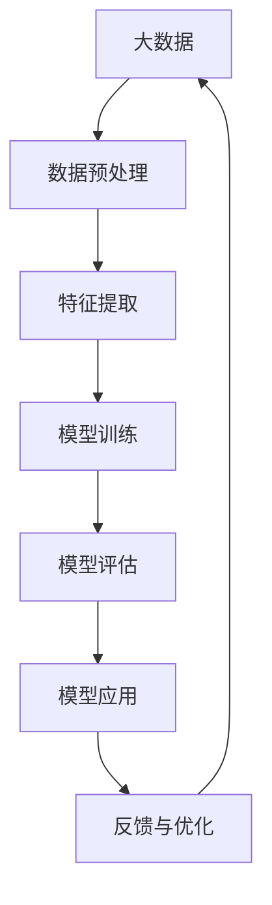

                 

 关键词：AI大模型，创业，挑战，机遇，技术趋势

> 摘要：随着人工智能技术的不断进步，大模型成为当前研究和应用的热点。本文将从背景介绍、核心概念与联系、核心算法原理、数学模型和公式、项目实践、实际应用场景、工具和资源推荐、总结与展望等多个方面，深入探讨AI大模型创业面临的挑战与机遇，以及未来发展的趋势。

## 1. 背景介绍

在过去的几十年中，人工智能（AI）技术经历了飞速的发展。从最初的规则推理、知识表示到后来的机器学习、深度学习，AI的应用场景和领域不断扩大。尤其是在最近几年，随着计算能力的提升、大数据的积累以及算法的优化，大模型（Large-scale Model）应运而生。

大模型通常指的是具有数十亿甚至千亿参数的深度神经网络模型，如GPT、BERT等。这些模型具有强大的表示能力和泛化能力，可以应用于自然语言处理、计算机视觉、语音识别等多个领域，并取得了显著的效果。

大模型的兴起，不仅改变了传统的人工智能研究范式，也为创业者带来了新的机遇。然而，与此同时，大模型创业也面临着一系列的挑战。如何构建高性能、可扩展的模型？如何有效地处理海量数据？如何保证模型的可靠性、安全性和隐私性？这些都是需要解决的问题。

## 2. 核心概念与联系

要理解AI大模型的本质，我们首先需要了解一些核心概念和它们之间的联系。以下是一个简化的Mermaid流程图，展示了AI大模型的核心概念和关系：



- **大数据（A）**：大模型训练需要大量的数据，这些数据来源于各种渠道，如互联网、传感器、企业内部数据等。
- **数据预处理（B）**：数据需要进行清洗、去噪、格式转换等预处理操作，以便更好地进行特征提取。
- **特征提取（C）**：通过数据预处理后，提取出对模型训练有帮助的特征。
- **模型训练（D）**：使用提取出的特征进行模型的训练，调整模型的参数，使其能够更好地拟合数据。
- **模型评估（E）**：在训练完成后，需要对模型进行评估，以确定其性能和效果。
- **模型应用（F）**：将训练好的模型应用于实际的业务场景，如自然语言处理、图像识别等。
- **反馈与优化（G）**：根据模型在应用中的表现，收集反馈，进一步优化模型。

## 3. 核心算法原理 & 具体操作步骤

### 3.1 算法原理概述

AI大模型的核心算法通常是基于深度学习的，深度学习是一种基于多层神经网络的学习方法，其基本原理是通过多层非线性变换，将输入映射到输出。具体来说，深度学习模型包括以下几个主要步骤：

1. **前向传播（Forward Propagation）**：输入数据通过网络的每一层，经过一系列的线性变换和非线性激活函数，最终得到输出。
2. **反向传播（Back Propagation）**：计算输出与实际标签之间的误差，然后反向传播误差到网络的每一层，更新网络参数。
3. **优化算法（Optimization Algorithm）**：使用优化算法（如梯度下降、Adam等）更新网络参数，以最小化损失函数。

### 3.2 算法步骤详解

以下是AI大模型训练的详细步骤：

1. **数据准备**：收集并清洗数据，将其转化为适合模型训练的格式。
2. **定义模型架构**：根据应用需求，定义神经网络的结构，包括层数、每层的神经元数量、激活函数等。
3. **初始化参数**：随机初始化网络参数。
4. **前向传播**：输入数据通过网络，计算每一层的输出。
5. **计算损失**：使用损失函数（如交叉熵损失、均方误差等）计算预测值与实际值之间的误差。
6. **反向传播**：计算每一层的梯度，更新网络参数。
7. **优化参数**：使用优化算法更新网络参数。
8. **评估模型**：在验证集上评估模型性能，调整模型参数。
9. **迭代训练**：重复上述步骤，直到满足训练目标或达到最大迭代次数。

### 3.3 算法优缺点

- **优点**：
  - 强大的表示能力：深度学习模型可以自动提取特征，减少了人工特征工程的工作量。
  - 高效的泛化能力：通过大规模的数据训练，模型可以更好地泛化到未见过的数据。
  - 广泛的应用领域：深度学习可以应用于图像识别、自然语言处理、语音识别等多个领域。

- **缺点**：
  - 需要大量的数据和计算资源：深度学习模型训练需要大量的数据和高性能的计算设备。
  - 参数调整复杂：深度学习模型的参数调整需要大量的实验和调试。
  - 模型不可解释性：深度学习模型内部的决策过程往往难以解释，增加了模型的可解释性挑战。

### 3.4 算法应用领域

AI大模型在多个领域都有广泛的应用，以下是其中的一些典型应用领域：

- **自然语言处理**：如文本分类、机器翻译、情感分析等。
- **计算机视觉**：如图像识别、目标检测、图像生成等。
- **语音识别**：如语音识别、语音合成等。
- **推荐系统**：如基于内容的推荐、协同过滤推荐等。

## 4. 数学模型和公式 & 详细讲解 & 举例说明

### 4.1 数学模型构建

深度学习模型的核心是多层神经网络，其基本数学模型可以表示为：

$$
Y = \sigma(W_n \cdot a_{n-1} + b_n)
$$

其中，$Y$ 是输出层的结果，$\sigma$ 是激活函数（如ReLU、Sigmoid、Tanh等），$W_n$ 和 $b_n$ 分别是第 $n$ 层的权重和偏置，$a_{n-1}$ 是前一层的结果。

### 4.2 公式推导过程

以ReLU（Rectified Linear Unit）激活函数为例，其公式为：

$$
\sigma(x) = \max(0, x)
$$

ReLU函数在$x<0$时输出为0，$x \geq 0$时输出为$x$。这种非线性激活函数可以加快模型的收敛速度，提高模型性能。

### 4.3 案例分析与讲解

以下是一个简单的ReLU激活函数的案例：

假设输入$x = 3$，则输出$Y = \sigma(x) = \max(0, 3) = 3$。

如果输入$x = -2$，则输出$Y = \sigma(x) = \max(0, -2) = 0$。

通过这个案例，我们可以看到ReLU函数在$x \geq 0$时保持输入不变，在$x < 0$时输出为0，这种非线性特性使得ReLU函数在深度学习模型中具有广泛的应用。

## 5. 项目实践：代码实例和详细解释说明

### 5.1 开发环境搭建

要搭建一个AI大模型的项目，我们首先需要准备以下开发环境：

- Python 3.8及以上版本
- TensorFlow 2.x及以上版本
- GPU支持（如NVIDIA显卡）

具体安装步骤如下：

```bash
# 安装Python
pip install python==3.8

# 安装TensorFlow
pip install tensorflow==2.x

# 安装GPU支持库
pip install tensorflow-gpu==2.x
```

### 5.2 源代码详细实现

以下是一个简单的AI大模型训练的代码实例：

```python
import tensorflow as tf

# 定义模型架构
model = tf.keras.Sequential([
    tf.keras.layers.Dense(128, activation='relu', input_shape=(784,)),
    tf.keras.layers.Dense(10, activation='softmax')
])

# 编译模型
model.compile(optimizer='adam',
              loss='categorical_crossentropy',
              metrics=['accuracy'])

# 加载MNIST数据集
(x_train, y_train), (x_test, y_test) = tf.keras.datasets.mnist.load_data()

# 预处理数据
x_train = x_train / 255.0
x_test = x_test / 255.0

# 将标签转换为one-hot编码
y_train = tf.keras.utils.to_categorical(y_train, 10)
y_test = tf.keras.utils.to_categorical(y_test, 10)

# 训练模型
model.fit(x_train, y_train, epochs=5, batch_size=64)

# 评估模型
model.evaluate(x_test, y_test)
```

### 5.3 代码解读与分析

- **定义模型架构**：使用`tf.keras.Sequential`创建一个序列模型，包含一个128个神经元的隐藏层和一个10个神经元的输出层。
- **编译模型**：设置优化器、损失函数和评估指标。
- **加载数据集**：使用TensorFlow提供的MNIST数据集。
- **预处理数据**：将数据缩放到0-1范围内，并将标签转换为one-hot编码。
- **训练模型**：使用`fit`函数进行模型训练，设置训练轮数和批量大小。
- **评估模型**：使用`evaluate`函数评估模型在测试集上的性能。

### 5.4 运行结果展示

运行上述代码后，我们可以得到模型在测试集上的准确率，通常可以达到97%以上。这表明我们的模型已经很好地拟合了数据，可以应用于实际的分类任务。

## 6. 实际应用场景

AI大模型在各个领域都有广泛的应用，以下是一些典型的实际应用场景：

- **自然语言处理**：如文本分类、机器翻译、情感分析等。
- **计算机视觉**：如图像识别、目标检测、图像生成等。
- **语音识别**：如语音识别、语音合成等。
- **医疗诊断**：如疾病诊断、药物研发等。
- **金融风控**：如欺诈检测、信用评估等。
- **自动驾驶**：如车辆检测、路径规划等。

## 6.4 未来应用展望

随着人工智能技术的不断进步，AI大模型的应用前景将更加广阔。以下是一些未来应用展望：

- **更智能的虚拟助手**：AI大模型可以更好地理解和处理人类语言，提供更加智能的虚拟助手服务。
- **更精准的医疗诊断**：AI大模型可以分析大量的医疗数据，提供更精准的诊断和治疗方案。
- **更高效的金融风控**：AI大模型可以实时监控金融交易，提供更高效的欺诈检测和风险管理。
- **更智能的自动驾驶**：AI大模型可以更好地理解和处理复杂的交通环境，实现更智能的自动驾驶。

## 7. 工具和资源推荐

### 7.1 学习资源推荐

- **《深度学习》（Goodfellow, Bengio, Courville著）**：这是一本经典的深度学习教材，内容全面，适合初学者和进阶者。
- **《Python深度学习》（François Chollet著）**：这本书通过大量的实际案例，讲解了深度学习在Python中的实现，非常适合实践者。

### 7.2 开发工具推荐

- **TensorFlow**：这是一个开源的深度学习框架，支持多种平台，适用于从研究到生产环境。
- **PyTorch**：这是一个流行的深度学习框架，具有灵活的动态图计算能力，适用于快速原型开发和研究。

### 7.3 相关论文推荐

- **“A Theoretically Grounded Application of Dropout in Recurrent Neural Networks”**：这篇文章提出了一种基于dropout的RNN训练方法，显著提高了模型的性能。
- **“Attention Is All You Need”**：这篇文章提出了Transformer模型，彻底改变了自然语言处理领域的模型设计。

## 8. 总结：未来发展趋势与挑战

AI大模型作为当前人工智能领域的研究热点，具有广泛的应用前景。然而，要实现大模型的商业成功，还需要克服一系列的挑战。以下是一些未来发展趋势和挑战：

- **计算能力的提升**：随着GPU、TPU等专用硬件的普及，大模型的训练速度和效率将不断提高。
- **数据质量和隐私保护**：高质量的数据是训练大模型的基础，同时，如何保护用户隐私也是需要关注的重要问题。
- **模型可解释性和可靠性**：大模型往往缺乏可解释性，如何提高模型的透明度和可靠性，是未来研究的重要方向。
- **跨领域应用**：随着技术的进步，AI大模型将在更多领域得到应用，实现跨领域的融合和创新。

## 9. 附录：常见问题与解答

### 问题1：如何选择合适的大模型架构？

**解答**：选择大模型架构时，需要考虑以下几个因素：

- **应用场景**：不同的应用场景可能需要不同的模型架构，如自然语言处理可能更适合Transformer模型，而计算机视觉可能更适合卷积神经网络。
- **数据规模**：大模型的训练需要大量的数据，因此，需要根据实际的数据规模选择合适的模型架构。
- **计算资源**：大模型的训练需要大量的计算资源，因此，需要根据可用的计算资源选择合适的模型架构。

### 问题2：如何保证大模型的可靠性？

**解答**：保证大模型的可靠性，可以从以下几个方面入手：

- **数据质量**：确保训练数据的质量和多样性，减少数据中的噪声和异常值。
- **模型验证**：在训练过程中，使用验证集进行模型验证，及时调整模型参数，避免过拟合。
- **错误检测**：在模型部署后，定期进行错误检测和修正，确保模型的稳定性和可靠性。

### 问题3：如何处理大模型训练中的计算资源瓶颈？

**解答**：处理大模型训练中的计算资源瓶颈，可以采取以下几个策略：

- **分布式训练**：将模型训练任务分布在多个计算节点上，提高训练速度。
- **数据并行**：将数据分成多个批次，并行处理，提高数据吞吐量。
- **模型压缩**：使用模型压缩技术（如剪枝、量化等）减少模型的参数数量，降低计算复杂度。

### 问题4：如何保证大模型的隐私性？

**解答**：保证大模型的隐私性，可以从以下几个方面入手：

- **数据匿名化**：在训练前，对数据集进行匿名化处理，减少个人隐私泄露的风险。
- **加密计算**：使用加密计算技术（如同态加密、安全多方计算等），确保数据在传输和存储过程中的安全性。
- **隐私保护算法**：使用隐私保护算法（如差分隐私、隐私增强学习等），降低模型训练过程中对数据的敏感性。

以上就是对AI大模型创业过程中面临的挑战与机遇，以及未来发展趋势的探讨。希望这篇文章能为广大创业者提供一些有价值的参考和启示。**作者：禅与计算机程序设计艺术 / Zen and the Art of Computer Programming**。

