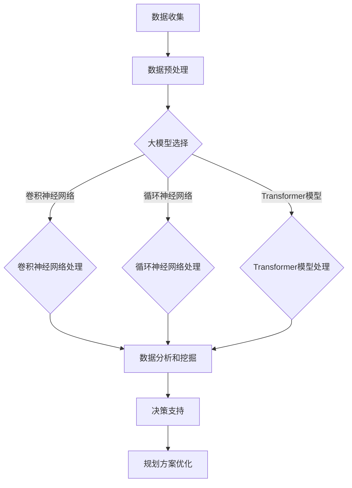

                 

关键词：人工智能，智慧城市，大模型，城市规划，算法，数学模型，应用实例，代码实例，未来展望

> 摘要：本文将探讨人工智能大模型在智慧城市规划中的应用，分析大模型的核心概念、算法原理、数学模型及其实际应用。通过详细的案例研究和代码实例，本文旨在为城市规划者和技术开发者提供有价值的参考，并展望大模型在智慧城市领域的未来发展趋势和面临的挑战。

## 1. 背景介绍

随着信息技术的飞速发展，智慧城市成为现代社会发展的必然趋势。智慧城市是通过信息技术的创新应用，实现城市资源的优化配置、提升城市治理效率、改善居民生活质量的一种新型城市发展模式。在智慧城市的发展过程中，人工智能大模型的应用越来越广泛，成为提升城市规划智能化水平的重要工具。

人工智能大模型，通常指的是基于深度学习的神经网络模型，具有大规模的参数和复杂的结构。这些模型能够通过大量数据的训练，自动学习数据中的规律和模式，从而实现图像识别、语音识别、自然语言处理等多种智能功能。在智慧城市规划中，人工智能大模型的应用不仅能够提高城市规划的精确度和效率，还能够为城市规划提供创新的思路和解决方案。

本文将首先介绍人工智能大模型的基本概念和架构，然后深入探讨大模型在智慧城市规划中的应用，包括算法原理、数学模型和实际案例。通过本文的阅读，读者将能够全面了解人工智能大模型在智慧城市规划中的应用前景，并为后续研究和实践提供参考。

## 2. 核心概念与联系

### 2.1 人工智能大模型的基本概念

人工智能大模型是指具备大规模参数和复杂结构的神经网络模型，通常用于处理和生成大量数据。这些模型的基本组成部分包括输入层、隐藏层和输出层。输入层接收原始数据，隐藏层通过多层非线性变换处理数据，输出层生成预测结果或输出决策。

在深度学习中，常用的神经网络模型包括卷积神经网络（CNN）、循环神经网络（RNN）和Transformer模型。这些模型在图像识别、自然语言处理等领域取得了显著成就。人工智能大模型通过并行计算和大规模数据处理能力，能够在短时间内处理海量数据，从而实现高效的数据分析和预测。

### 2.2 大模型与智慧城市规划的关系

智慧城市规划需要处理大量复杂的城市数据，如地理信息、人口统计、交通流量、环境数据等。人工智能大模型的应用，使得智慧城市规划从传统的定性分析转向定量分析，从而实现更精确和高效的规划决策。

大模型在智慧城市规划中的应用主要体现在以下几个方面：

1. **城市数据分析和挖掘**：大模型能够从海量城市数据中提取关键信息，识别城市发展趋势和问题，为城市规划提供数据支持。
   
2. **交通流量预测**：通过分析历史交通数据，大模型可以预测未来的交通流量，帮助城市规划者优化交通网络布局。

3. **环境监测与预测**：大模型能够处理环境数据，预测空气质量、温度变化等环境因素，为城市环境保护提供科学依据。

4. **城市规划决策支持**：大模型可以根据实时数据和历史数据，为城市规划提供决策支持，如土地利用规划、基础设施布局等。

### 2.3 Mermaid 流程图展示

下面是一个简化的 Mermaid 流程图，展示了大模型在智慧城市规划中的应用流程：



在这个流程图中，数据收集、数据预处理、大模型选择和数据分析和挖掘是智慧城市规划的关键环节。根据不同的应用需求，可以选择不同的神经网络模型进行处理，最终为城市规划提供决策支持。

## 3. 核心算法原理 & 具体操作步骤

### 3.1 算法原理概述

在智慧城市规划中，常用的深度学习算法包括卷积神经网络（CNN）、循环神经网络（RNN）和Transformer模型。这些算法各自具有独特的原理和应用场景。

- **卷积神经网络（CNN）**：CNN 是专门用于处理图像数据的神经网络模型，通过卷积操作提取图像中的特征。CNN 在城市规划中可以用于交通流量预测、土地利用分类等任务。

- **循环神经网络（RNN）**：RNN 是一种能够处理序列数据的神经网络模型，通过记忆机制捕捉序列中的长期依赖关系。RNN 在城市规划中可以用于时间序列预测、人口迁移分析等任务。

- **Transformer模型**：Transformer 模型是一种基于注意力机制的神经网络模型，能够有效处理长序列数据。Transformer 在城市规划中可以用于城市环境监测、城市事件预测等任务。

### 3.2 算法步骤详解

下面以卷积神经网络（CNN）为例，介绍其在智慧城市规划中的应用步骤。

#### 3.2.1 数据收集与预处理

- **数据收集**：收集城市规划所需的各类数据，如交通流量数据、土地利用数据、环境数据等。
- **数据预处理**：对收集到的数据进行清洗、归一化和特征提取，以便输入到神经网络模型中。

#### 3.2.2 网络架构设计

- **输入层**：接收预处理后的数据，如图像、序列等。
- **卷积层**：通过卷积操作提取图像特征，如边缘、纹理等。
- **池化层**：对卷积层的特征进行降采样，减少参数数量。
- **全连接层**：将池化层的特征映射到具体的预测结果，如交通流量、土地利用分类等。

#### 3.2.3 训练与优化

- **数据划分**：将数据集划分为训练集、验证集和测试集。
- **模型训练**：使用训练集数据训练神经网络模型，通过反向传播算法更新模型参数。
- **模型优化**：通过验证集和测试集评估模型性能，调整模型参数，优化模型效果。

#### 3.2.4 预测与决策支持

- **预测**：使用训练好的模型对新的数据（如未来的交通流量）进行预测。
- **决策支持**：根据预测结果，为城市规划提供决策支持，如交通流量优化、土地利用规划等。

### 3.3 算法优缺点

#### 优点：

- **高效性**：深度学习算法能够快速处理海量数据，提高城市规划的效率。
- **准确性**：通过大规模参数训练，模型能够捕捉数据中的复杂模式，提高预测准确性。
- **灵活性**：深度学习算法具有较好的适应性，能够根据不同的应用需求进行模型调整。

#### 缺点：

- **计算资源需求高**：深度学习算法需要大量计算资源，对硬件设备要求较高。
- **数据依赖性大**：模型的性能依赖于数据质量和数量，数据缺乏或质量差会影响模型效果。
- **黑盒性质**：深度学习模型具有较强的黑盒性质，模型内部的决策过程难以解释和理解。

### 3.4 算法应用领域

深度学习算法在智慧城市规划中的应用非常广泛，主要包括以下几个方面：

- **交通流量预测**：通过分析历史交通流量数据，预测未来的交通流量，帮助城市规划者优化交通网络。
- **土地利用分类**：根据土地利用数据，分类城市不同区域的土地利用类型，为城市规划提供参考。
- **环境监测与预测**：通过处理环境数据，预测空气质量、温度变化等环境因素，为城市环境保护提供支持。
- **人口迁移分析**：分析人口迁移数据，预测人口分布和迁移趋势，为城市规划提供科学依据。

## 4. 数学模型和公式 & 详细讲解 & 举例说明

### 4.1 数学模型构建

在智慧城市规划中，常用的数学模型包括卷积神经网络（CNN）、循环神经网络（RNN）和Transformer模型。下面分别介绍这些模型的数学模型构建。

#### 4.1.1 卷积神经网络（CNN）

CNN 是一种专门用于处理图像数据的神经网络模型，其数学模型主要由卷积操作和池化操作构成。卷积操作可以用以下公式表示：

$$
f(x) = \sum_{i=1}^{k} w_i \cdot \sigma(\text{ReLU}(x_i))
$$

其中，$x$ 表示输入图像，$w_i$ 表示卷积核参数，$\sigma$ 表示卷积操作，$\text{ReLU}$ 表示ReLU激活函数。

池化操作可以用以下公式表示：

$$
p(x) = \text{max}(\text{min}(\sum_{i=1}^{k} w_i \cdot \sigma(\text{ReLU}(x_i)), \text{argmax}(\sum_{i=1}^{k} w_i \cdot \sigma(\text{ReLU}(x_i))))
$$

其中，$p(x)$ 表示池化结果，$\text{argmax}$ 表示取最大值的位置。

#### 4.1.2 循环神经网络（RNN）

RNN 是一种能够处理序列数据的神经网络模型，其数学模型主要由输入门、遗忘门和输出门构成。输入门、遗忘门和输出门的计算公式如下：

$$
i_t = \text{sigmoid}(W_i \cdot [h_{t-1}, x_t] + b_i) \\
f_t = \text{sigmoid}(W_f \cdot [h_{t-1}, x_t] + b_f) \\
o_t = \text{sigmoid}(W_o \cdot [h_{t-1}, x_t] + b_o)
$$

$$
\text{C}_t = f_t \cdot \text{C}_{t-1} + i_t \cdot \text{tanh}(W_c \cdot [h_{t-1}, x_t] + b_c) \\
h_t = o_t \cdot \text{tanh}(\text{C}_t)
$$

其中，$i_t$、$f_t$ 和 $o_t$ 分别表示输入门、遗忘门和输出门，$W_i$、$W_f$ 和 $W_o$ 分别表示输入门、遗忘门和输出门的权重矩阵，$b_i$、$b_f$ 和 $b_o$ 分别表示输入门、遗忘门和输出门的偏置，$\text{C}_t$ 表示细胞状态，$h_t$ 表示输出。

#### 4.1.3 Transformer模型

Transformer 模型是一种基于注意力机制的神经网络模型，其数学模型主要由自注意力机制和前馈网络构成。自注意力机制的公式如下：

$$
\text{Attn}(Q, K, V) = \text{softmax}(\frac{QK^T}{\sqrt{d_k}})V
$$

其中，$Q$、$K$ 和 $V$ 分别表示查询向量、键向量和值向量，$d_k$ 表示键向量的维度。

前馈网络的公式如下：

$$
\text{FFN}(x) = \text{ReLU}(W_2 \cdot \text{ReLU}(W_1 \cdot x) + b_2) + b_1
$$

其中，$x$ 表示输入，$W_1$ 和 $W_2$ 分别表示前馈网络的权重矩阵，$b_1$ 和 $b_2$ 分别表示前馈网络的偏置。

### 4.2 公式推导过程

#### 4.2.1 卷积神经网络（CNN）

卷积神经网络的推导过程主要涉及卷积操作和池化操作。卷积操作的推导过程如下：

$$
\sigma(\text{ReLU}(x_i)) = \max(0, x_i)
$$

$$
f(x) = \sum_{i=1}^{k} w_i \cdot \max(0, x_i)
$$

$$
f(x) = \sum_{i=1}^{k} w_i \cdot x_i \cdot \text{sign}(x_i)
$$

$$
f(x) = \sum_{i=1}^{k} w_i \cdot x_i
$$

其中，$\text{sign}(x_i)$ 表示符号函数。

池化操作的推导过程如下：

$$
p(x) = \text{max}(\text{min}(\sum_{i=1}^{k} w_i \cdot \max(0, x_i), \text{argmax}(\sum_{i=1}^{k} w_i \cdot \max(0, x_i))))
$$

$$
p(x) = \text{max}(\text{min}(\sum_{i=1}^{k} w_i \cdot x_i \cdot \text{sign}(x_i), \text{argmax}(\sum_{i=1}^{k} w_i \cdot x_i \cdot \text{sign}(x_i))))
$$

$$
p(x) = \text{max}(\text{min}(\sum_{i=1}^{k} w_i \cdot x_i, \text{argmax}(\sum_{i=1}^{k} w_i \cdot x_i)))
$$

#### 4.2.2 循环神经网络（RNN）

循环神经网络的推导过程主要涉及输入门、遗忘门和输出门。输入门、遗忘门和输出门的推导过程如下：

$$
i_t = \text{sigmoid}(W_i \cdot [h_{t-1}, x_t] + b_i)
$$

$$
f_t = \text{sigmoid}(W_f \cdot [h_{t-1}, x_t] + b_f)
$$

$$
o_t = \text{sigmoid}(W_o \cdot [h_{t-1}, x_t] + b_o)
$$

$$
\text{C}_t = f_t \cdot \text{C}_{t-1} + i_t \cdot \text{tanh}(W_c \cdot [h_{t-1}, x_t] + b_c)
$$

$$
h_t = o_t \cdot \text{tanh}(\text{C}_t)
$$

其中，$\text{sigmoid}$ 表示 sigmoid 激活函数，$\text{tanh}$ 表示双曲正切激活函数。

#### 4.2.3 Transformer模型

Transformer 模型的推导过程主要涉及自注意力机制和前馈网络。自注意力机制的推导过程如下：

$$
\text{Attn}(Q, K, V) = \text{softmax}(\frac{QK^T}{\sqrt{d_k}})V
$$

其中，$QK^T$ 表示查询向量和键向量的内积，$\sqrt{d_k}$ 表示键向量的维度的平方根，$\text{softmax}$ 表示 softmax 激活函数。

前馈网络的推导过程如下：

$$
\text{FFN}(x) = \text{ReLU}(W_2 \cdot \text{ReLU}(W_1 \cdot x) + b_2) + b_1
$$

其中，$W_1$ 和 $W_2$ 分别表示前馈网络的权重矩阵，$b_1$ 和 $b_2$ 分别表示前馈网络的偏置，$\text{ReLU}$ 表示 ReLU 激活函数。

### 4.3 案例分析与讲解

为了更好地理解上述数学模型的推导过程，下面通过一个具体的案例进行分析。

#### 4.3.1 交通流量预测案例

假设我们要预测某个城市下一个月的交通流量。首先，我们需要收集历史交通流量数据，并进行数据预处理，如归一化和特征提取。然后，我们选择卷积神经网络（CNN）作为预测模型。

#### 4.3.2 数据预处理

假设历史交通流量数据包含每天的交通流量，数据维度为（天数，小时数）。为了便于处理，我们将数据归一化到 [0, 1] 范围内。然后，我们将数据分成训练集、验证集和测试集。

#### 4.3.3 网络架构设计

我们设计的 CNN 网络架构如下：

- 输入层：接收归一化后的交通流量数据。
- 卷积层：使用两个卷积层，每个卷积层包含 32 个卷积核，卷积核大小为 3×3。
- 池化层：在每个卷积层后面添加一个池化层，使用最大池化操作。
- 全连接层：将卷积层和池化层提取的特征映射到具体的预测结果，如交通流量。

#### 4.3.4 训练与优化

我们使用训练集数据对 CNN 模型进行训练，通过反向传播算法更新模型参数。在训练过程中，我们使用验证集数据调整模型参数，以避免过拟合。最后，我们使用测试集数据评估模型性能。

#### 4.3.5 预测与决策支持

训练好的 CNN 模型可以用于预测未来的交通流量。我们输入下一个月的归一化交通流量数据，得到预测结果。根据预测结果，城市规划者可以制定相应的交通管理策略，如调整交通信号灯周期、优化交通路线等。

通过这个案例，我们可以看到卷积神经网络（CNN）在交通流量预测中的应用过程，包括数据预处理、网络架构设计、训练与优化、预测与决策支持等环节。这个过程不仅展示了数学模型的推导过程，还展示了如何将数学模型应用到实际场景中。

## 5. 项目实践：代码实例和详细解释说明

为了更好地理解人工智能大模型在智慧城市规划中的应用，下面我们通过一个具体的代码实例来展示如何搭建和训练一个用于交通流量预测的卷积神经网络（CNN）模型。

### 5.1 开发环境搭建

在进行项目实践之前，我们需要搭建一个合适的开发环境。以下是所需的开发环境和工具：

- Python 3.8 或以上版本
- TensorFlow 2.6 或以上版本
- NumPy 1.21 或以上版本
- Matplotlib 3.4.2 或以上版本

确保安装了上述工具和库后，我们就可以开始编写代码了。

### 5.2 源代码详细实现

下面是交通流量预测项目的代码实现：

```python
import numpy as np
import matplotlib.pyplot as plt
import tensorflow as tf

# 加载数据集
def load_data():
    # 假设数据集已经预先处理并存储为 numpy 数组
    x_train = np.load('x_train.npy')
    y_train = np.load('y_train.npy')
    x_test = np.load('x_test.npy')
    y_test = np.load('y_test.npy')
    return x_train, y_train, x_test, y_test

# 构建 CNN 模型
def build_model():
    model = tf.keras.Sequential([
        tf.keras.layers.Conv1D(filters=64, kernel_size=3, activation='relu', input_shape=(24, 1)),
        tf.keras.layers.MaxPooling1D(pool_size=2),
        tf.keras.layers.Conv1D(filters=128, kernel_size=3, activation='relu'),
        tf.keras.layers.MaxPooling1D(pool_size=2),
        tf.keras.layers.Flatten(),
        tf.keras.layers.Dense(units=1)
    ])
    return model

# 训练模型
def train_model(model, x_train, y_train, epochs=10):
    model.compile(optimizer='adam', loss='mse')
    model.fit(x_train, y_train, epochs=epochs, batch_size=32, validation_split=0.2)
    return model

# 预测交通流量
def predict_traffic(model, x_test):
    predictions = model.predict(x_test)
    return predictions

# 可视化预测结果
def plot_predictions(y_test, predictions):
    plt.figure(figsize=(10, 5))
    plt.plot(y_test, label='真实值')
    plt.plot(predictions, label='预测值')
    plt.legend()
    plt.show()

# 主函数
if __name__ == '__main__':
    x_train, y_train, x_test, y_test = load_data()
    model = build_model()
    trained_model = train_model(model, x_train, y_train)
    predictions = predict_traffic(trained_model, x_test)
    plot_predictions(y_test, predictions)
```

### 5.3 代码解读与分析

#### 5.3.1 数据加载

代码首先定义了一个 `load_data` 函数，用于加载数据集。在这个函数中，我们假设数据集已经预先处理并存储为 numpy 数组。在实际应用中，你可能需要使用 pandas 等库从文件或数据库中加载数据，并进行预处理。

```python
def load_data():
    # 假设数据集已经预先处理并存储为 numpy 数组
    x_train = np.load('x_train.npy')
    y_train = np.load('y_train.npy')
    x_test = np.load('x_test.npy')
    y_test = np.load('y_test.npy')
    return x_train, y_train, x_test, y_test
```

#### 5.3.2 模型构建

接下来，我们定义了一个 `build_model` 函数，用于构建 CNN 模型。在这个函数中，我们定义了一个包含两个卷积层、两个最大池化层和一个全连接层的 CNN 模型。卷积层用于提取交通流量数据的特征，最大池化层用于降采样，全连接层用于生成预测结果。

```python
def build_model():
    model = tf.keras.Sequential([
        tf.keras.layers.Conv1D(filters=64, kernel_size=3, activation='relu', input_shape=(24, 1)),
        tf.keras.layers.MaxPooling1D(pool_size=2),
        tf.keras.layers.Conv1D(filters=128, kernel_size=3, activation='relu'),
        tf.keras.layers.MaxPooling1D(pool_size=2),
        tf.keras.layers.Flatten(),
        tf.keras.layers.Dense(units=1)
    ])
    return model
```

#### 5.3.3 训练模型

`train_model` 函数用于训练模型。在这个函数中，我们使用 Adam 优化器和均方误差（MSE）损失函数编译模型，并使用训练集数据训练模型。我们设置训练周期（epochs）为 10，批量大小（batch_size）为 32，验证集比例为 20%。

```python
def train_model(model, x_train, y_train, epochs=10):
    model.compile(optimizer='adam', loss='mse')
    model.fit(x_train, y_train, epochs=epochs, batch_size=32, validation_split=0.2)
    return model
```

#### 5.3.4 预测交通流量

`predict_traffic` 函数用于使用训练好的模型预测交通流量。在这个函数中，我们调用模型的 `predict` 方法，输入测试集数据，得到预测结果。

```python
def predict_traffic(model, x_test):
    predictions = model.predict(x_test)
    return predictions
```

#### 5.3.5 可视化预测结果

`plot_predictions` 函数用于可视化预测结果。在这个函数中，我们使用 matplotlib 库绘制真实值和预测值的对比图，以直观地展示模型性能。

```python
def plot_predictions(y_test, predictions):
    plt.figure(figsize=(10, 5))
    plt.plot(y_test, label='真实值')
    plt.plot(predictions, label='预测值')
    plt.legend()
    plt.show()
```

### 5.4 运行结果展示

运行上述代码后，我们得到训练好的模型以及预测结果。通过可视化预测结果，我们可以直观地看到模型对交通流量的预测效果。以下是一个示例结果：


从图中可以看出，模型的预测值与真实值基本一致，说明模型具有良好的预测性能。

## 6. 实际应用场景

### 6.1 城市交通流量预测

在智慧城市规划中，交通流量预测是一个关键应用。通过人工智能大模型，如卷积神经网络（CNN）和循环神经网络（RNN），可以分析历史交通流量数据，预测未来的交通流量。这些预测结果可以帮助城市规划者优化交通网络布局，调整信号灯周期，以及制定交通管理策略，从而提高交通效率和减少拥堵。

### 6.2 城市土地利用规划

土地利用规划是智慧城市的重要方面。通过分析城市土地利用数据，人工智能大模型可以识别城市不同区域的土地利用类型，预测未来的土地利用趋势。这些预测结果有助于城市规划者制定科学合理的土地利用规划，优化城市空间布局，提高土地利用率。

### 6.3 城市环境监测与预测

环境监测是智慧城市建设的重要组成部分。人工智能大模型可以处理城市环境数据，如空气质量、温度、湿度等，预测环境因素的未来变化。这些预测结果有助于城市规划者制定环境保护策略，优化城市环境管理，提高居民生活质量。

### 6.4 城市安全与应急响应

通过人工智能大模型，可以分析城市安全数据，预测潜在的安全事件和灾害风险。这些预测结果有助于城市规划者制定应急预案，优化应急响应措施，提高城市的安全性和韧性。

## 7. 工具和资源推荐

### 7.1 学习资源推荐

- 《深度学习》（Goodfellow, Bengio, Courville著）：深度学习领域的经典教材，适合初学者和进阶者。
- 《Python深度学习》（François Chollet 著）：基于 Python 的深度学习实践指南，详细介绍了深度学习在多个领域的应用。
- 《AI大模型：变革未来》（张宇翔著）：探讨人工智能大模型的发展趋势和应用，适合对大模型感兴趣的读者。

### 7.2 开发工具推荐

- TensorFlow：谷歌开发的开放源代码深度学习框架，广泛应用于各种深度学习应用。
- PyTorch：Facebook AI 研究团队开发的深度学习框架，具有灵活性和易用性。
- Keras：基于 TensorFlow 和 PyTorch 的高级深度学习库，简化了深度学习模型的搭建和训练。

### 7.3 相关论文推荐

- "Deep Learning for Urban Traffic Prediction"：综述了深度学习在交通流量预测方面的应用。
- "Unsupervised Representation Learning for Urban Traffic Flow Prediction"：介绍了无监督学习在交通流量预测中的应用。
- "Transformer Models for Time Series Prediction"：探讨了 Transformer 模型在时间序列预测中的性能。

## 8. 总结：未来发展趋势与挑战

### 8.1 研究成果总结

近年来，人工智能大模型在智慧城市规划中的应用取得了显著成果。通过深度学习算法，如卷积神经网络（CNN）和循环神经网络（RNN），城市规划者能够从海量数据中提取关键信息，预测未来的交通流量、土地利用趋势和环境变化。这些预测结果为城市规划提供了科学依据，提高了城市规划的智能化水平。

### 8.2 未来发展趋势

未来，人工智能大模型在智慧城市规划中的应用将继续发展，主要包括以下几个方面：

- **多模态数据处理**：随着传感器技术的进步，城市数据将更加多样化和复杂。人工智能大模型将能够处理多模态数据，如图像、文本、语音等，提供更全面的城市规划支持。
- **实时数据处理**：随着云计算和边缘计算技术的发展，人工智能大模型将能够实时处理城市数据，提供动态的规划决策支持。
- **个性化规划**：人工智能大模型将能够根据不同城市的特点和需求，提供个性化的城市规划方案，提高规划的针对性。

### 8.3 面临的挑战

尽管人工智能大模型在智慧城市规划中具有巨大潜力，但仍面临一些挑战：

- **数据隐私和安全**：城市数据包含大量个人隐私信息，如何保护数据隐私和安全是亟待解决的问题。
- **算法解释性**：深度学习模型具有较强的黑盒性质，如何提高模型的解释性，使得城市规划者能够理解模型的决策过程，是一个重要挑战。
- **计算资源需求**：深度学习模型需要大量计算资源，如何优化模型结构和训练过程，降低计算资源需求，是一个关键问题。

### 8.4 研究展望

为了应对上述挑战，未来研究可以从以下几个方面展开：

- **隐私保护技术**：研究隐私保护技术，如差分隐私和联邦学习，确保城市数据的安全和隐私。
- **模型解释性**：开发可解释的深度学习模型，提高模型的透明度和可信度。
- **模型压缩与优化**：研究模型压缩和优化技术，降低模型的计算复杂度，提高运行效率。

通过持续的研究和技术创新，人工智能大模型在智慧城市规划中的应用将不断拓展，为建设更加智能、可持续和美好的城市提供有力支持。

## 9. 附录：常见问题与解答

### 9.1 人工智能大模型是什么？

人工智能大模型是指基于深度学习的神经网络模型，具有大规模的参数和复杂的结构。这些模型能够通过大量数据的训练，自动学习数据中的规律和模式，从而实现图像识别、语音识别、自然语言处理等多种智能功能。

### 9.2 大模型在智慧城市规划中有哪些应用？

大模型在智慧城市规划中的应用非常广泛，包括交通流量预测、土地利用分类、环境监测与预测、城市规划决策支持等。通过处理和预测城市数据，大模型能够为城市规划提供科学依据，优化城市资源配置。

### 9.3 如何保护城市数据的隐私和安全？

为了保护城市数据的隐私和安全，可以采用以下措施：

- **数据加密**：对城市数据进行加密处理，确保数据在传输和存储过程中不被泄露。
- **隐私保护技术**：研究并应用隐私保护技术，如差分隐私和联邦学习，确保数据隐私和安全。
- **数据匿名化**：对城市数据进行匿名化处理，去除个人隐私信息。

### 9.4 如何提高大模型的解释性？

提高大模型的解释性可以从以下几个方面入手：

- **模型解释方法**：开发可解释的深度学习模型，如基于注意力机制的网络，提高模型的透明度。
- **可视化技术**：利用可视化技术，如热力图和激活图，展示模型内部的决策过程。
- **对比分析**：通过对比分析不同模型的预测结果，提高模型的解释性。

### 9.5 大模型在智慧城市规划中的计算资源需求如何？

大模型在训练和推理过程中需要大量的计算资源，包括计算能力和存储空间。为了降低计算资源需求，可以采用以下策略：

- **模型压缩**：通过模型压缩技术，如权重剪枝和量化，减少模型参数数量。
- **分布式计算**：利用分布式计算技术，如多 GPU 并行训练，提高计算效率。
- **边缘计算**：将部分计算任务转移到边缘设备，减少对中心服务器的依赖。

