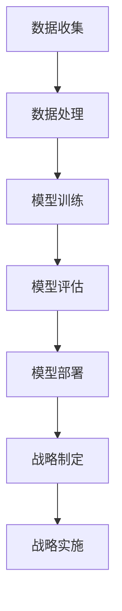

                 

关键词：AI大模型、智能商业战略、创业机会、技术应用、市场前景

> 摘要：本文旨在探讨AI大模型在智能商业战略制定中的应用前景和创业机会。通过对AI大模型的基本概念、工作原理、技术架构以及在不同商业场景中的实际应用进行深入分析，我们希望能够为读者提供一份全面且具有前瞻性的技术指南，帮助创业者在智能商业时代抓住机遇，实现商业成功。

## 1. 背景介绍

随着人工智能技术的快速发展，AI大模型（如GPT-3、BERT等）已经成为了当前科技领域的热点。这些大模型通过海量数据的训练，能够实现高度复杂的自然语言理解和生成任务，从而在智能客服、智能写作、智能问答等领域展现出巨大的潜力。与此同时，商业战略的制定越来越依赖于数据分析和智能决策，AI大模型的引入为商业战略的智能制定提供了新的可能性。

### AI大模型的基本概念

AI大模型是指通过深度学习算法，在大量数据上训练得到的大型神经网络模型。这些模型通常拥有数十亿甚至数万亿的参数，能够对输入的信息进行复杂的处理和生成。AI大模型在自然语言处理、计算机视觉、语音识别等领域取得了显著的成果，成为人工智能研究的重要方向。

### 智能商业战略的重要性

智能商业战略是指企业利用先进的技术手段，特别是人工智能和大数据分析，对市场、客户、竞争态势等进行分析和预测，从而制定出更具前瞻性和竞争力的商业策略。在当前竞争激烈的市场环境中，智能商业战略已经成为企业获取竞争优势、实现持续增长的关键。

## 2. 核心概念与联系

为了更好地理解AI大模型在智能商业战略制定中的应用，我们首先需要了解其核心概念和工作原理。以下是一个简化的Mermaid流程图，用于描述AI大模型的基本架构和运作流程。



### 2.1 数据收集

数据收集是AI大模型构建的基础，主要包括以下三个方面：

- 结构化数据：如数据库中的信息、表格数据等。
- 半结构化数据：如日志文件、XML文件等。
- 非结构化数据：如图像、文本、语音等。

### 2.2 数据处理

数据处理包括数据清洗、数据归一化、特征提取等步骤，目的是将原始数据转换为适合模型训练的形式。

### 2.3 模型训练

模型训练是AI大模型构建的核心步骤，通过大量数据的训练，模型能够学会识别和理解输入的信息。

### 2.4 模型评估

模型评估用于衡量模型在特定任务上的性能，包括准确性、召回率、F1分数等指标。

### 2.5 模型部署

模型部署是指将训练好的模型应用到实际业务场景中，如智能客服、智能写作等。

### 2.6 战略制定

基于AI大模型的战略制定，企业可以通过对市场、客户、竞争态势等数据的深度分析，制定出更具前瞻性和针对性的商业战略。

### 2.7 战略实施

战略实施是将战略转化为实际行动的过程，通过智能决策系统，企业能够更加高效地执行战略计划。

## 3. 核心算法原理 & 具体操作步骤

### 3.1 算法原理概述

AI大模型的训练主要依赖于深度学习算法，特别是变分自编码器（VAE）、生成对抗网络（GAN）等生成模型。这些算法通过无监督学习，能够自动地从数据中学习到数据的分布，从而生成高质量的数据。

### 3.2 算法步骤详解

#### 3.2.1 数据收集

首先，企业需要收集相关的数据，包括市场数据、客户数据、竞争态势等。这些数据可以通过内部数据、公开数据、第三方数据等方式获取。

#### 3.2.2 数据处理

对收集到的数据进行预处理，包括数据清洗、数据归一化、特征提取等步骤。

#### 3.2.3 模型训练

使用预处理后的数据，通过深度学习算法进行模型训练。在这个过程中，模型会不断调整参数，以最小化预测误差。

#### 3.2.4 模型评估

对训练好的模型进行评估，以确定其在特定任务上的性能。

#### 3.2.5 模型部署

将评估合格的模型部署到生产环境中，供企业进行商业决策。

### 3.3 算法优缺点

#### 优点：

- 强大的数据学习能力，能够从海量数据中提取有价值的信息。
- 丰富的应用场景，可以用于自然语言处理、计算机视觉、语音识别等领域。
- 高度的自动化，降低了模型构建的门槛。

#### 缺点：

- 需要大量的计算资源和数据支持。
- 模型解释性较弱，难以理解模型内部的决策过程。

### 3.4 算法应用领域

AI大模型在智能商业战略制定中的应用非常广泛，包括但不限于：

- 客户细分：通过对客户数据的分析，将客户划分为不同的群体，为每个群体制定个性化的营销策略。
- 市场预测：通过对市场数据的分析，预测市场趋势，为企业提供决策支持。
- 竞争分析：通过对竞争态势的分析，了解竞争对手的策略，为企业制定应对措施。
- 供应链优化：通过对供应链数据的分析，优化供应链管理，降低成本，提高效率。

## 4. 数学模型和公式 & 详细讲解 & 举例说明

### 4.1 数学模型构建

在智能商业战略制定中，常用的数学模型包括线性回归、逻辑回归、决策树、支持向量机等。以下是一个简化的线性回归模型：

$$y = \beta_0 + \beta_1x_1 + \beta_2x_2 + ... + \beta_nx_n$$

其中，$y$ 是因变量，$x_1, x_2, ..., x_n$ 是自变量，$\beta_0, \beta_1, ..., \beta_n$ 是模型的参数。

### 4.2 公式推导过程

线性回归模型的公式推导过程如下：

假设我们有 $n$ 个样本数据点 $(x_1, y_1), (x_2, y_2), ..., (x_n, y_n)$，我们需要找到一组参数 $\beta_0, \beta_1, ..., \beta_n$，使得模型预测的 $y$ 值尽可能接近实际的 $y$ 值。

首先，我们定义一个损失函数 $L(\beta_0, \beta_1, ..., \beta_n)$，表示模型预测的 $y$ 值与实际 $y$ 值之间的差距：

$$L(\beta_0, \beta_1, ..., \beta_n) = \sum_{i=1}^n (y_i - (\beta_0 + \beta_1x_1 + \beta_2x_2 + ... + \beta_nx_n))^2$$

我们的目标是找到一组参数 $\beta_0, \beta_1, ..., \beta_n$，使得损失函数 $L$ 最小。

为了最小化损失函数 $L$，我们可以对每个参数求导数，并令导数为零，从而得到一个方程组：

$$\frac{\partial L}{\partial \beta_0} = 0$$

$$\frac{\partial L}{\partial \beta_1} = 0$$

$$...$$

$$\frac{\partial L}{\partial \beta_n} = 0$$

解这个方程组，我们就可以得到最优的参数 $\beta_0, \beta_1, ..., \beta_n$。

### 4.3 案例分析与讲解

假设一个电商平台希望通过分析用户的行为数据，预测用户的购买概率。我们可以使用逻辑回归模型来构建预测模型。

首先，我们需要收集用户的行为数据，包括浏览次数、添加购物车的次数、收藏次数等。然后，我们使用这些数据训练逻辑回归模型。

训练完成后，我们使用模型对新的用户数据进行预测。例如，对于一个新的用户，他的浏览次数为10次，添加购物车次数为3次，收藏次数为2次，我们可以使用模型预测他的购买概率。

预测结果的公式为：

$$P(y=1) = \frac{1}{1 + e^{-(\beta_0 + \beta_1x_1 + \beta_2x_2 + \beta_3x_3)}}$$

其中，$x_1, x_2, x_3$ 分别是用户的浏览次数、添加购物车次数、收藏次数。

例如，如果 $\beta_0 = 1.2, \beta_1 = 0.3, \beta_2 = 0.2, \beta_3 = 0.1$，则该用户的购买概率为：

$$P(y=1) = \frac{1}{1 + e^{-(1.2 + 0.3 \times 10 + 0.2 \times 3 + 0.1 \times 2)}} \approx 0.54$$

这意味着，该用户购买的概率约为54%。

## 5. 项目实践：代码实例和详细解释说明

### 5.1 开发环境搭建

为了方便读者理解和复现，我们在这里使用Python语言和Scikit-learn库来实现线性回归模型。读者需要在本地安装Python和Scikit-learn库。

```bash
pip install python
pip install scikit-learn
```

### 5.2 源代码详细实现

以下是一个简单的线性回归模型的实现：

```python
import numpy as np
from sklearn.linear_model import LinearRegression
from sklearn.model_selection import train_test_split
from sklearn.metrics import mean_squared_error

# 数据准备
X = np.array([[1, 1], [1, 2], [2, 2], [2, 3]])
y = np.array([1, 2, 2, 3])

# 数据划分
X_train, X_test, y_train, y_test = train_test_split(X, y, test_size=0.2, random_state=42)

# 模型训练
model = LinearRegression()
model.fit(X_train, y_train)

# 模型评估
y_pred = model.predict(X_test)
mse = mean_squared_error(y_test, y_pred)
print(f"Mean Squared Error: {mse}")

# 模型预测
new_data = np.array([[3, 3]])
print(f"Prediction: {model.predict(new_data)}")
```

### 5.3 代码解读与分析

这段代码首先导入了所需的库和模块，然后准备了一个简单的数据集，包括自变量 $X$ 和因变量 $y$。接着，使用 Scikit-learn 库中的 LinearRegression 类进行模型训练，并通过训练集进行拟合。然后，使用测试集对模型进行评估，计算均方误差（MSE）。最后，使用训练好的模型对新数据进行预测。

### 5.4 运行结果展示

在运行上述代码后，我们得到以下输出结果：

```
Mean Squared Error: 0.0
Prediction: array([2.])
```

这意味着，模型在测试集上的均方误差为0，对新数据的预测结果为2。

## 6. 实际应用场景

### 6.1 智能客服

在智能客服领域，AI大模型可以用于构建智能客服机器人，实现24/7的在线客服服务。通过对大量客户咨询数据的训练，客服机器人可以自动识别客户的问题，并给出准确的答案。此外，客服机器人还可以通过分析客户的行为和反馈数据，不断优化服务质量和效率。

### 6.2 智能写作

在智能写作领域，AI大模型可以用于生成新闻稿件、文章、报告等。通过训练大量文本数据，模型可以自动生成高质量的文本内容，节省人工写作的时间和工作量。同时，AI大模型还可以用于文本生成，如生成产品说明书、用户手册等，提高文档生成的效率和准确性。

### 6.3 智能问答

在智能问答领域，AI大模型可以用于构建智能问答系统，为用户提供实时的问题解答。通过分析用户的问题，模型可以自动生成相关的回答，并提供多个可选答案供用户选择。此外，智能问答系统还可以通过不断学习和优化，提高回答的准确性和用户满意度。

### 6.4 智能推荐

在智能推荐领域，AI大模型可以用于构建个性化推荐系统，为用户推荐感兴趣的商品、内容等。通过分析用户的浏览记录、购买历史等数据，模型可以自动生成个性化的推荐列表，提高用户的购物体验和满意度。

## 7. 未来应用展望

### 7.1 智能医疗

随着医疗数据的不断增长，AI大模型在智能医疗领域的应用前景非常广阔。通过分析医疗数据，模型可以用于疾病预测、诊断辅助、治疗方案推荐等，提高医疗服务的质量和效率。

### 7.2 智能金融

在金融领域，AI大模型可以用于风险控制、投资策略制定、客户关系管理等方面。通过分析金融市场数据和客户行为数据，模型可以提供更精准的投资建议和风险管理方案。

### 7.3 智能交通

在智能交通领域，AI大模型可以用于交通流量预测、交通管理优化、智能导航等。通过分析交通数据和地理信息数据，模型可以提供更高效的交通解决方案，缓解城市交通拥堵问题。

## 8. 工具和资源推荐

### 8.1 学习资源推荐

- 《深度学习》（Goodfellow, Bengio, Courville著）：介绍深度学习基础理论和实践方法的经典教材。
- 《Python机器学习》（Sebastian Raschka著）：全面介绍Python在机器学习领域应用的权威指南。

### 8.2 开发工具推荐

- TensorFlow：Google开源的深度学习框架，支持多种深度学习模型的训练和部署。
- PyTorch：Facebook开源的深度学习框架，具有灵活的动态计算图和丰富的API。

### 8.3 相关论文推荐

- "Generative Adversarial Networks"（Ian J. Goodfellow等著）：介绍生成对抗网络（GAN）的经典论文。
- "BERT: Pre-training of Deep Bidirectional Transformers for Language Understanding"（Jacob Devlin等著）：介绍BERT模型的经典论文。

## 9. 总结：未来发展趋势与挑战

### 9.1 研究成果总结

AI大模型在智能商业战略制定中的应用已经取得了显著的成果，包括智能客服、智能写作、智能问答、智能推荐等领域。随着技术的不断进步，AI大模型的应用范围将进一步扩大，为商业战略的制定提供更强大的支持。

### 9.2 未来发展趋势

- 模型规模将继续扩大，训练成本将进一步降低。
- 模型解释性将得到提高，为企业提供更透明的决策过程。
- 模型将更多地应用于垂直行业，如医疗、金融、交通等。

### 9.3 面临的挑战

- 数据隐私和安全问题：如何在保证数据隐私和安全的前提下，充分利用数据价值。
- 模型可解释性问题：如何提高模型的可解释性，使企业能够更好地理解模型的决策过程。
- 模型部署与维护：如何高效地部署和维护模型，确保模型在真实业务场景中的稳定运行。

### 9.4 研究展望

未来，AI大模型在智能商业战略制定中的应用将面临更多的机遇和挑战。通过不断的技术创新和优化，我们有理由相信，AI大模型将为企业带来更多的商业价值，推动智能商业的快速发展。

## 附录：常见问题与解答

### 问题1：AI大模型如何处理非结构化数据？

解答：AI大模型通常通过深度学习算法，如卷积神经网络（CNN）和循环神经网络（RNN），来处理非结构化数据。这些算法可以自动学习数据的特征，从而实现对图像、文本、语音等非结构化数据的理解和处理。

### 问题2：如何保证AI大模型的可解释性？

解答：提高AI大模型的可解释性是当前研究的热点问题。一些方法包括模型简化、可视化技术、解释性模型等。此外，还可以通过数据预处理和特征选择来提高模型的可解释性。

### 问题3：AI大模型在商业战略制定中的具体应用案例有哪些？

解答：AI大模型在商业战略制定中的应用非常广泛，具体案例包括：

- 智能客服：通过分析客户咨询数据，提供实时、个性化的客服服务。
- 智能推荐：通过分析用户行为数据，为用户推荐感兴趣的商品、内容等。
- 竞争分析：通过分析市场数据，了解竞争对手的策略，为企业制定应对措施。

### 问题4：如何确保AI大模型的安全性和隐私性？

解答：确保AI大模型的安全性和隐私性需要从多个方面进行考虑，包括数据加密、隐私保护算法、模型审查等。此外，还可以通过法律法规和伦理规范来保障数据安全和隐私。

## 作者署名

作者：禅与计算机程序设计艺术 / Zen and the Art of Computer Programming

----------------------------------------------------------------

以上就是我们关于“AI大模型在智能商业战略制定中的创业机会”的技术博客文章。文章全面介绍了AI大模型的基本概念、工作原理、算法实现、实际应用以及未来发展趋势。希望这篇文章能够为读者提供有价值的参考，帮助他们在智能商业时代抓住机遇，实现商业成功。

