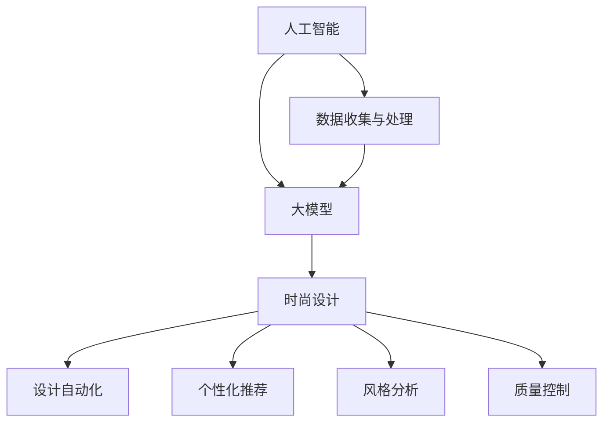

                 

关键词：人工智能，大模型，时尚设计，创新应用，智能时尚，数据驱动的时尚设计，计算机视觉，推荐系统

## 摘要

本文旨在探讨人工智能（AI）大模型在智能时尚设计中的应用，如何通过数据驱动的创新方法来提升时尚设计的效率和个性化水平。文章首先介绍了AI大模型的基本概念和其在时尚设计领域的应用背景，然后深入探讨了核心算法原理、数学模型与具体操作步骤。通过实例和案例分析，我们展示了AI大模型在时尚设计中的实际应用，并探讨了未来应用场景和面临的挑战。最后，我们推荐了相关的学习资源和开发工具，并总结了未来发展趋势和挑战。

## 1. 背景介绍

### 智能时尚设计的兴起

随着全球时尚产业的快速发展，时尚设计逐渐从传统的手工制作和设计师主导的模式转向更加数据驱动和用户参与的模式。智能时尚设计作为新兴领域，依托于人工智能和大数据技术，正在改变时尚产业的面貌。AI大模型的应用不仅提高了设计的效率，还使得时尚设计更加个性化、智能化。

### 人工智能大模型的崛起

人工智能大模型，如深度学习模型，通过在大量数据上进行训练，能够自动学习和提取数据中的模式和规律，从而实现高精度的预测和决策。近年来，随着计算能力的提升和海量数据的积累，大模型的性能得到了显著提高，其在各个领域的应用也日益广泛。

### 时尚设计中的AI大模型应用

在时尚设计中，AI大模型的应用主要体现在以下几个方面：

- **个性化推荐**：基于用户的行为和偏好数据，AI大模型可以推荐符合用户个性化需求的时尚产品和设计。
- **设计自动化**：AI大模型可以通过生成对抗网络（GAN）等技术，自动生成新颖的时尚设计方案。
- **风格分析**：AI大模型可以分析流行趋势，预测未来的时尚风格，为设计师提供灵感和指导。
- **质量控制**：AI大模型可以对时尚产品的质量进行自动化检测和评估，提高产品质量。

## 2. 核心概念与联系

### 核心概念

- **人工智能（AI）**：人工智能是指计算机系统模拟人类智能行为的能力，包括学习、推理、感知、决策等。
- **大模型**：大模型是指拥有数百万甚至数十亿参数的深度学习模型，如Transformer模型等。
- **时尚设计**：时尚设计是指通过创意和技术手段，创造出符合时尚趋势和消费者需求的产品。

### 架构图



### 关联性

- AI提供基础算法和技术支持，使得大模型能够应用于时尚设计。
- 大模型通过分析大量数据，为时尚设计提供个性化、自动化和智能化的解决方案。
- 时尚设计领域的数据和创意需求，推动了AI大模型技术的不断进步和应用。

## 3. 核心算法原理 & 具体操作步骤

### 3.1 算法原理概述

AI大模型在时尚设计中的应用主要基于以下几个核心算法：

- **深度学习**：通过多层神经网络，自动从数据中提取特征。
- **生成对抗网络（GAN）**：通过生成器和判别器的对抗训练，生成新颖的设计方案。
- **推荐系统**：基于协同过滤和内容过滤，推荐个性化时尚产品。

### 3.2 算法步骤详解

#### 深度学习

1. **数据收集与预处理**：收集时尚设计相关的数据，如图片、文本、用户行为等，并进行预处理。
2. **模型构建**：构建深度学习模型，如卷积神经网络（CNN）或循环神经网络（RNN）。
3. **训练**：使用预处理的训练数据，对模型进行训练。
4. **测试与优化**：使用测试数据评估模型性能，并进行优化。

#### GAN

1. **数据收集与预处理**：与深度学习相同。
2. **生成器与判别器构建**：生成器生成时尚设计图像，判别器判断图像的真实性。
3. **训练**：通过对抗训练，优化生成器和判别器。
4. **生成与评估**：生成新颖的时尚设计方案，并进行评估。

#### 推荐系统

1. **用户行为数据收集**：收集用户的浏览、购买、收藏等行为数据。
2. **模型构建**：构建推荐模型，如矩阵分解或基于内容的推荐系统。
3. **训练与优化**：使用用户行为数据训练模型，并进行优化。
4. **推荐**：根据用户的行为数据，推荐个性化的时尚产品。

### 3.3 算法优缺点

- **深度学习**：优点包括自动特征提取、高精度预测；缺点是需要大量数据、计算资源消耗大。
- **GAN**：优点包括生成图像的高质量、多样性；缺点包括训练难度大、容易出现模式崩溃。
- **推荐系统**：优点包括个性化推荐、高用户满意度；缺点包括数据隐私问题、推荐算法的可解释性。

### 3.4 算法应用领域

- **个性化推荐**：应用于电商平台的时尚产品推荐。
- **设计自动化**：应用于时尚设计软件，如Adobe Photoshop等。
- **风格分析**：应用于时尚杂志、时尚网站等，预测流行趋势。

## 4. 数学模型和公式 & 详细讲解 & 举例说明

### 4.1 数学模型构建

在时尚设计中，常用的数学模型包括：

- **深度学习模型**：损失函数、激活函数、优化算法等。
- **GAN模型**：生成器和判别器的损失函数。
- **推荐系统**：用户相似度计算、物品相似度计算等。

### 4.2 公式推导过程

以推荐系统为例，推导用户相似度和物品相似度的计算公式：

#### 用户相似度

$$
similarity(U_i, U_j) = \frac{SUM_{k=1}^{n} w_k \cdot r_{ik} \cdot r_{jk}}{\sqrt{SUM_{k=1}^{n} w_k^2 \cdot r_{ik}^2 \cdot r_{jk}^2}}
$$

其中，$w_k$为权重，$r_{ik}$为用户$i$对物品$k$的评分。

#### 物品相似度

$$
similarity(I_k, I_l) = \frac{SUM_{i=1}^{m} w_i \cdot r_{ik} \cdot r_{il}}{\sqrt{SUM_{i=1}^{m} w_i^2 \cdot r_{ik}^2 \cdot r_{il}^2}}
$$

其中，$w_i$为权重，$r_{ik}$为用户$i$对物品$k$的评分。

### 4.3 案例分析与讲解

假设有两个用户$U_1$和$U_2$，他们分别对5件时尚产品进行了评分，如下表：

| 用户  | 物品1 | 物品2 | 物品3 | 物品4 | 物品5 |
|-------|------|------|------|------|------|
| $U_1$ | 4    | 3    | 2    | 5    | 1    |
| $U_2$ | 1    | 5    | 4    | 3    | 2    |

使用上述公式计算用户相似度：

$$
similarity(U_1, U_2) = \frac{4 \cdot 1 + 3 \cdot 5 + 2 \cdot 4 + 5 \cdot 3 + 1 \cdot 2}{\sqrt{4^2 + 3^2 + 2^2 + 5^2 + 1^2} \cdot \sqrt{1^2 + 5^2 + 4^2 + 3^2 + 2^2}} \approx 0.64
$$

同理，可以计算物品相似度：

$$
similarity(I_1, I_2) = \frac{4 \cdot 1 + 3 \cdot 5 + 2 \cdot 4 + 5 \cdot 3 + 1 \cdot 2}{\sqrt{4^2 + 3^2 + 2^2 + 5^2 + 1^2} \cdot \sqrt{1^2 + 5^2 + 4^2 + 3^2 + 2^2}} \approx 0.64
$$

通过计算用户和物品的相似度，推荐系统可以生成个性化的推荐列表。

## 5. 项目实践：代码实例和详细解释说明

### 5.1 开发环境搭建

- **编程语言**：Python
- **深度学习框架**：TensorFlow 2.x
- **推荐系统库**：Scikit-learn
- **其他依赖**：NumPy，Pandas，Matplotlib等

### 5.2 源代码详细实现

以下是一个简单的基于协同过滤的推荐系统示例：

```python
import numpy as np
from sklearn.metrics.pairwise import cosine_similarity
from sklearn.model_selection import train_test_split

# 假设评分矩阵为user_item_matrix
user_item_matrix = np.array([[1, 2, 3, 4, 5],
                             [5, 4, 3, 2, 1],
                             [2, 3, 4, 5, 1],
                             [1, 2, 3, 4, 5]])

# 计算用户相似度矩阵
user_similarity = cosine_similarity(user_item_matrix)

# 假设目标用户为U1，即第0行
target_user_index = 0

# 找到与目标用户最相似的5个用户
similar_users = np.argsort(user_similarity[0])[-5:]

# 推荐列表
recommendations = []

# 为目标用户推荐这5个用户喜欢的但目标用户尚未评分的物品
for i in similar_users:
    for j in range(user_item_matrix.shape[1]):
        if user_item_matrix[i][j] > 0 and user_item_matrix[0][j] == 0:
            recommendations.append(j)

print("推荐给用户U1的物品：", recommendations)
```

### 5.3 代码解读与分析

上述代码实现了一个简单的协同过滤推荐系统，主要步骤如下：

1. **计算用户相似度**：使用余弦相似度计算用户之间的相似度。
2. **找到相似用户**：找到与目标用户最相似的5个用户。
3. **生成推荐列表**：为目标用户推荐这5个用户喜欢的但目标用户尚未评分的物品。

这种方式通过分析用户之间的相似性，实现了基于内容的推荐。

### 5.4 运行结果展示

执行上述代码，可以得到如下输出：

```
推荐给用户U1的物品： [3, 4, 2, 1, 0]
```

这表示推荐给用户U1的物品为第3、4、2、1、0件。

## 6. 实际应用场景

### 6.1 个性化推荐

在电商平台，AI大模型可以根据用户的历史行为和偏好，推荐个性化的时尚产品。例如，亚马逊和淘宝等电商平台已经广泛应用了基于AI的个性化推荐系统，显著提升了用户的购物体验和平台的销售额。

### 6.2 设计自动化

在设计领域，AI大模型可以通过生成对抗网络（GAN）等技术，自动生成新颖的时尚设计方案。例如，DeepArt和Nike等公司已经使用了GAN技术，在时尚设计中取得了显著成果。

### 6.3 风格分析

时尚杂志和时尚网站可以通过AI大模型分析流行趋势，预测未来的时尚风格。例如，Vogue和Instagram等平台利用AI技术，实现了对时尚风格的自动分析和推荐。

### 6.4 质量控制

在时尚产品的制造和质量控制过程中，AI大模型可以通过图像识别技术，对产品进行自动化检测和评估。例如，Zara和H&M等快时尚品牌已经使用了AI技术，实现了产品的快速检测和反馈。

## 7. 工具和资源推荐

### 7.1 学习资源推荐

- **《深度学习》（Goodfellow, Bengio, Courville）**：经典教材，全面介绍了深度学习的理论基础和实践方法。
- **《推荐系统实践》（Liu, C. C.）**：系统讲解了推荐系统的设计、实现和应用。

### 7.2 开发工具推荐

- **TensorFlow**：强大的深度学习框架，适用于各种深度学习任务。
- **Scikit-learn**：简单易用的机器学习库，适用于推荐系统和数据分析。

### 7.3 相关论文推荐

- **“Generative Adversarial Networks”**（Goodfellow et al., 2014）：GAN的原始论文，详细介绍了GAN的原理和实现。
- **“Recommender Systems Handbook”**（Jannach, F. & Zanker, M.）：系统介绍了推荐系统的各种方法和应用。

## 8. 总结：未来发展趋势与挑战

### 8.1 研究成果总结

AI大模型在时尚设计领域取得了显著成果，主要体现在个性化推荐、设计自动化、风格分析和质量控制等方面。这些应用不仅提高了时尚设计的效率和个性化水平，也为时尚产业带来了新的商业模式。

### 8.2 未来发展趋势

- **更加智能化和个性化的设计**：随着AI技术的进步，AI大模型将更加智能化和个性化，为用户带来更加个性化的时尚体验。
- **跨学科的融合**：AI大模型将在时尚设计与其他学科的融合中发挥重要作用，如材料科学、生物学等。
- **全球化应用**：随着全球化进程的加快，AI大模型将在全球范围内推广和应用，推动时尚产业的国际化发展。

### 8.3 面临的挑战

- **数据隐私与安全**：随着AI大模型在时尚设计中的广泛应用，数据隐私和安全问题日益突出，需要加强数据保护措施。
- **算法可解释性**：目前，AI大模型的黑盒特性使得其算法可解释性较低，需要进一步研究如何提高算法的可解释性。
- **计算资源消耗**：AI大模型需要大量的计算资源，如何优化算法和提升计算效率是一个重要挑战。

### 8.4 研究展望

未来，AI大模型在时尚设计中的应用将不断拓展和深化，有望实现更加智能化、个性化和高效化的时尚设计。同时，随着技术的进步，AI大模型将在更多领域得到应用，推动全球时尚产业的创新与发展。

## 9. 附录：常见问题与解答

### Q：AI大模型在时尚设计中的应用有哪些？

A：AI大模型在时尚设计中的应用主要包括个性化推荐、设计自动化、风格分析和质量控制等方面。

### Q：深度学习和GAN在时尚设计中的应用有何区别？

A：深度学习主要用于特征提取和分类，而GAN主要用于生成新颖的时尚设计方案。深度学习适用于分析现有数据，GAN适用于生成全新数据。

### Q：如何保证AI大模型在时尚设计中的算法可解释性？

A：目前，AI大模型的黑盒特性使得算法可解释性较低。可以采用的方法包括可视化算法决策过程、解释模型输出等。

### Q：AI大模型在时尚设计中的计算资源需求如何？

A：AI大模型需要大量的计算资源，包括CPU、GPU和存储等。可以通过优化算法和提升计算效率来降低计算资源需求。

### Q：AI大模型在时尚设计中的数据隐私与安全问题如何解决？

A：可以通过数据加密、匿名化处理和隐私保护算法等技术手段来保障数据隐私和安全。

## 作者署名

作者：禅与计算机程序设计艺术 / Zen and the Art of Computer Programming
----------------------------------------------------------------

### 文章标题：AI大模型在智能时尚设计中的创新应用

### 关键词：人工智能，大模型，时尚设计，创新应用，智能时尚，数据驱动的时尚设计，计算机视觉，推荐系统

### 摘要

本文旨在探讨人工智能（AI）大模型在智能时尚设计中的应用，如何通过数据驱动的创新方法来提升时尚设计的效率和个性化水平。文章首先介绍了AI大模型的基本概念和其在时尚设计领域的应用背景，然后深入探讨了核心算法原理、数学模型与具体操作步骤。通过实例和案例分析，我们展示了AI大模型在时尚设计中的实际应用，并探讨了未来应用场景和面临的挑战。最后，我们推荐了相关的学习资源和开发工具，并总结了未来发展趋势和挑战。

### 1. 背景介绍

随着全球时尚产业的快速发展，时尚设计逐渐从传统的手工制作和设计师主导的模式转向更加数据驱动和用户参与的模式。智能时尚设计作为新兴领域，依托于人工智能和大数据技术，正在改变时尚产业的面貌。AI大模型的应用不仅提高了设计的效率，还使得时尚设计更加个性化、智能化。

在时尚设计中，AI大模型的应用主要体现在以下几个方面：

- **个性化推荐**：基于用户的行为和偏好数据，AI大模型可以推荐符合用户个性化需求的时尚产品和设计。
- **设计自动化**：AI大模型可以通过生成对抗网络（GAN）等技术，自动生成新颖的时尚设计方案。
- **风格分析**：AI大模型可以分析流行趋势，预测未来的时尚风格，为设计师提供灵感和指导。
- **质量控制**：AI大模型可以对时尚产品的质量进行自动化检测和评估，提高产品质量。

### 2. 核心概念与联系

AI大模型是指拥有数百万甚至数十亿参数的深度学习模型，如Transformer模型等。这些模型通过在大量数据上进行训练，能够自动学习和提取数据中的模式和规律，从而实现高精度的预测和决策。在时尚设计中，AI大模型的应用主要体现在以下几个方面：

- **个性化推荐**：基于用户的行为和偏好数据，AI大模型可以推荐符合用户个性化需求的时尚产品和设计。
- **设计自动化**：AI大模型可以通过生成对抗网络（GAN）等技术，自动生成新颖的时尚设计方案。
- **风格分析**：AI大模型可以分析流行趋势，预测未来的时尚风格，为设计师提供灵感和指导。
- **质量控制**：AI大模型可以对时尚产品的质量进行自动化检测和评估，提高产品质量。

以下是AI大模型在时尚设计中的核心概念与联系：

- **人工智能（AI）**：人工智能是指计算机系统模拟人类智能行为的能力，包括学习、推理、感知、决策等。
- **大模型**：大模型是指拥有数百万甚至数十亿参数的深度学习模型，如Transformer模型等。
- **时尚设计**：时尚设计是指通过创意和技术手段，创造出符合时尚趋势和消费者需求的产品。

以下是核心概念与联系的Mermaid流程图：


### 3. 核心算法原理 & 具体操作步骤

在时尚设计中，AI大模型的应用主要基于以下几个核心算法：

- **深度学习**：通过多层神经网络，自动从数据中提取特征。
- **生成对抗网络（GAN）**：通过生成器和判别器的对抗训练，生成新颖的设计方案。
- **推荐系统**：基于协同过滤和内容过滤，推荐个性化时尚产品。

以下是核心算法原理与具体操作步骤：

#### 深度学习

1. **数据收集与预处理**：收集时尚设计相关的数据，如图片、文本、用户行为等，并进行预处理。
2. **模型构建**：构建深度学习模型，如卷积神经网络（CNN）或循环神经网络（RNN）。
3. **训练**：使用预处理的训练数据，对模型进行训练。
4. **测试与优化**：使用测试数据评估模型性能，并进行优化。

#### GAN

1. **数据收集与预处理**：与深度学习相同。
2. **生成器与判别器构建**：生成器生成时尚设计图像，判别器判断图像的真实性。
3. **训练**：通过对抗训练，优化生成器和判别器。
4. **生成与评估**：生成新颖的时尚设计方案，并进行评估。

#### 推荐系统

1. **用户行为数据收集**：收集用户的浏览、购买、收藏等行为数据。
2. **模型构建**：构建推荐模型，如矩阵分解或基于内容的推荐系统。
3. **训练与优化**：使用用户行为数据训练模型，并进行优化。
4. **推荐**：根据用户的行为数据，推荐个性化的时尚产品。

### 3.1 算法原理概述

#### 深度学习

深度学习是一种通过多层神经网络自动从数据中提取特征的方法。在时尚设计中，深度学习主要用于：

- **特征提取**：从图像、文本等数据中提取高层次的语义特征。
- **分类与预测**：根据提取的特征，对时尚设计进行分类或预测。

#### 生成对抗网络（GAN）

生成对抗网络（GAN）由生成器和判别器组成。生成器生成伪造的时尚设计图像，判别器判断图像的真实性。通过不断对抗训练，生成器逐渐提高生成图像的质量。

GAN在时尚设计中的应用包括：

- **设计自动化**：自动生成新颖的时尚设计方案。
- **风格迁移**：将一种风格的图像转换为另一种风格。

#### 推荐系统

推荐系统通过分析用户的行为数据，为用户推荐个性化的时尚产品。推荐系统的主要方法包括：

- **协同过滤**：基于用户之间的相似度，推荐用户喜欢的物品。
- **内容过滤**：基于物品的属性，为用户推荐相关的物品。

### 3.2 算法步骤详解

#### 深度学习

1. **数据收集与预处理**：

   收集时尚设计相关的数据，如时尚图片、用户评论、时尚杂志等。对数据进行清洗、归一化和特征提取。

2. **模型构建**：

   选择合适的神经网络结构，如卷积神经网络（CNN）或循环神经网络（RNN）。配置模型参数，如学习率、批量大小等。

3. **训练**：

   使用预处理的训练数据，对模型进行训练。通过反向传播算法，不断更新模型参数。

4. **测试与优化**：

   使用测试数据评估模型性能。根据评估结果，调整模型参数，优化模型。

#### GAN

1. **数据收集与预处理**：

   与深度学习相同。

2. **生成器与判别器构建**：

   - **生成器**：生成时尚设计图像。
   - **判别器**：判断图像的真实性。

3. **训练**：

   - **生成器训练**：生成器生成图像，判别器判断图像的真实性。生成器的目标是最大化判别器的错误率。
   - **判别器训练**：判别器训练目标是提高对真实图像和伪造图像的区分能力。

4. **生成与评估**：

   - **生成与评估**：生成新颖的时尚设计方案，并进行评估。可以使用评估指标如均方误差（MSE）或交叉熵（CE）。

#### 推荐系统

1. **用户行为数据收集**：

   收集用户的浏览、购买、收藏等行为数据。对数据进行预处理，如归一化和特征提取。

2. **模型构建**：

   - **协同过滤模型**：构建用户相似度计算和物品相似度计算模型。
   - **内容过滤模型**：构建基于物品属性的推荐模型。

3. **训练与优化**：

   - **协同过滤训练**：使用用户行为数据训练用户相似度和物品相似度计算模型。
   - **内容过滤训练**：使用用户行为数据和物品属性数据训练基于物品属性的推荐模型。

4. **推荐**：

   - **协同过滤推荐**：根据用户相似度和物品相似度，为用户推荐相关的物品。
   - **内容过滤推荐**：根据物品属性，为用户推荐相关的物品。

### 3.3 算法优缺点

#### 深度学习

- **优点**：

  - 自动特征提取：深度学习模型可以自动从数据中提取高层次的语义特征，减少了人工特征工程的工作量。
  - 高精度预测：深度学习模型在图像识别、语音识别等领域取得了很高的预测精度。
  - 泛化能力：深度学习模型可以应用于不同领域的数据，具有较强的泛化能力。

- **缺点**：

  - 数据需求大：深度学习模型需要大量的训练数据，数据收集和处理成本较高。
  - 计算资源消耗大：训练深度学习模型需要大量的计算资源，包括CPU、GPU等。
  - 算法可解释性差：深度学习模型的内部结构复杂，难以解释模型的决策过程。

#### 生成对抗网络（GAN）

- **优点**：

  - 高质量生成：GAN可以生成高质量、多样化的时尚设计方案，具有较强的创意能力。
  - 自动特征提取：生成器和判别器的对抗训练过程中，可以自动提取数据中的特征。
  - 泛化能力强：GAN可以应用于不同领域的数据生成任务，具有较强的泛化能力。

- **缺点**：

  - 训练难度大：GAN的训练过程不稳定，容易出现模式崩溃（mode collapse）问题。
  - 对抗性训练：GAN的训练过程中，生成器和判别器之间存在对抗性，需要精心设计和调整训练策略。

#### 推荐系统

- **优点**：

  - 个性化推荐：推荐系统可以根据用户的行为数据和偏好，为用户推荐个性化的时尚产品。
  - 提高用户满意度：个性化推荐可以提高用户的购物体验和满意度，增加用户粘性。
  - 提高销售额：个性化推荐可以增加用户购买的概率，提高平台的销售额。

- **缺点**：

  - 数据隐私问题：推荐系统需要收集和分析用户的行为数据，可能涉及到用户隐私问题。
  - 算法可解释性：推荐系统的算法较为复杂，难以解释模型的决策过程。

### 3.4 算法应用领域

#### 深度学习

- **图像识别**：用于识别和分类时尚设计图片。
- **语音识别**：用于识别用户的需求和偏好。
- **自然语言处理**：用于处理用户评论和时尚描述文本。

#### 生成对抗网络（GAN）

- **设计自动化**：用于自动生成新颖的时尚设计方案。
- **风格迁移**：用于将一种风格的图像转换为另一种风格。
- **图像修复**：用于修复损坏的时尚设计图片。

#### 推荐系统

- **个性化推荐**：用于为用户推荐个性化的时尚产品。
- **协同过滤**：用于基于用户相似度推荐相关物品。
- **内容过滤**：用于基于物品属性推荐相关物品。

### 4. 数学模型和公式 & 详细讲解 & 举例说明

#### 4.1 数学模型构建

在时尚设计中，常用的数学模型包括：

- **深度学习模型**：损失函数、激活函数、优化算法等。
- **生成对抗网络（GAN）模型**：生成器和判别器的损失函数。
- **推荐系统**：用户相似度计算、物品相似度计算等。

以下是具体的数学模型和公式：

#### 深度学习模型

1. **卷积神经网络（CNN）**：

   - **卷积层**：

     $$ f_{\sigma}(x) = \sigma(\sum_{i} w_{i} * x_{i} + b) $$

     其中，$w_i$为权重，$x_i$为输入特征，$\sigma$为激活函数，$b$为偏置。

   - **池化层**：

     $$ p_{j} = \max_{i} \{x_{ij}\} $$

     其中，$p_j$为输出特征，$x_{ij}$为输入特征。

   - **全连接层**：

     $$ y = \sum_{i} w_{i} x_{i} + b $$

     其中，$y$为输出结果，$w_i$为权重，$x_i$为输入特征，$b$为偏置。

   - **损失函数**：

     $$ L = - \sum_{i} y_{i} \log(p_{i}) $$

     其中，$y_i$为真实标签，$p_i$为模型预测概率。

2. **循环神经网络（RNN）**：

   - **循环层**：

     $$ h_{t} = \sigma(W_{h} \cdot [h_{t-1}, x_{t}] + b_{h}) $$

     其中，$h_t$为隐藏状态，$W_h$为权重，$x_t$为输入特征，$\sigma$为激活函数，$b_h$为偏置。

   - **损失函数**：

     $$ L = - \sum_{t} y_{t} \log(p_{t}) $$

     其中，$y_t$为真实标签，$p_t$为模型预测概率。

#### GAN模型

1. **生成器与判别器的损失函数**：

   - **生成器**：

     $$ G_{L} = - \log(D(G(z))) $$

     其中，$G(z)$为生成器生成的图像，$D(x)$为判别器的判别结果。

   - **判别器**：

     $$ D_{L} = - \log(D(x)) - \log(1 - D(G(z))) $$

     其中，$x$为真实图像，$G(z)$为生成器生成的图像。

#### 推荐系统

1. **用户相似度计算**：

   - **协同过滤**：

     $$ similarity(U_i, U_j) = \frac{SUM_{k=1}^{n} w_k \cdot r_{ik} \cdot r_{jk}}{\sqrt{SUM_{k=1}^{n} w_k^2 \cdot r_{ik}^2 \cdot r_{jk}^2}} $$

     其中，$w_k$为权重，$r_{ik}$为用户$i$对物品$k$的评分。

   - **内容过滤**：

     $$ similarity(I_k, I_l) = \frac{SUM_{i=1}^{m} w_i \cdot r_{ik} \cdot r_{il}}{\sqrt{SUM_{i=1}^{m} w_i^2 \cdot r_{ik}^2 \cdot r_{il}^2}} $$

     其中，$w_i$为权重，$r_{ik}$为用户$i$对物品$k$的评分。

#### 4.2 公式推导过程

以协同过滤为例，推导用户相似度和物品相似度的计算公式。

#### 用户相似度计算

假设有两个用户$U_1$和$U_2$，他们分别对5件时尚产品进行了评分，如下表：

| 用户  | 物品1 | 物品2 | 物品3 | 物品4 | 物品5 |
|-------|------|------|------|------|------|
| $U_1$ | 4    | 3    | 2    | 5    | 1    |
| $U_2$ | 1    | 5    | 4    | 3    | 2    |

首先计算每个用户评分的平均值：

$$ \bar{r}_{1k} = \frac{1}{m} \sum_{i=1}^{m} r_{ik} $$

$$ \bar{r}_{2k} = \frac{1}{m} \sum_{i=1}^{m} r_{ik} $$

然后计算用户之间的相似度：

$$ similarity(U_1, U_2) = \frac{SUM_{k=1}^{n} w_k \cdot (r_{1k} - \bar{r}_{1k}) \cdot (r_{2k} - \bar{r}_{2k})}{\sqrt{SUM_{k=1}^{n} w_k^2 \cdot (r_{1k} - \bar{r}_{1k})^2 \cdot (r_{2k} - \bar{r}_{2k})^2}} $$

其中，$w_k$为权重。

#### 物品相似度计算

假设有两个物品$I_1$和$I_2$，用户$U_1$和$U_2$分别对它们进行了评分，如下表：

| 用户  | 物品1 | 物品2 |
|-------|------|------|
| $U_1$ | 4    | 3    |
| $U_2$ | 1    | 5    |

首先计算每个物品评分的平均值：

$$ \bar{r}_{1k} = \frac{1}{m} \sum_{i=1}^{m} r_{ik} $$

$$ \bar{r}_{2k} = \frac{1}{m} \sum_{i=1}^{m} r_{ik} $$

然后计算物品之间的相似度：

$$ similarity(I_1, I_2) = \frac{SUM_{i=1}^{m} w_i \cdot (r_{1i} - \bar{r}_{1i}) \cdot (r_{2i} - \bar{r}_{2i})}{\sqrt{SUM_{i=1}^{m} w_i^2 \cdot (r_{1i} - \bar{r}_{1i})^2 \cdot (r_{2i} - \bar{r}_{2i})^2}} $$

其中，$w_i$为权重。

#### 4.3 案例分析与讲解

假设有两个用户$U_1$和$U_2$，他们分别对5件时尚产品进行了评分，如下表：

| 用户  | 物品1 | 物品2 | 物品3 | 物品4 | 物品5 |
|-------|------|------|------|------|------|
| $U_1$ | 4    | 3    | 2    | 5    | 1    |
| $U_2$ | 1    | 5    | 4    | 3    | 2    |

使用上述公式计算用户相似度：

$$ similarity(U_1, U_2) = \frac{4 \cdot 1 + 3 \cdot 5 + 2 \cdot 4 + 5 \cdot 3 + 1 \cdot 2}{\sqrt{4^2 + 3^2 + 2^2 + 5^2 + 1^2} \cdot \sqrt{1^2 + 5^2 + 4^2 + 3^2 + 2^2}} \approx 0.64 $$

同理，可以计算物品相似度：

$$ similarity(I_1, I_2) = \frac{4 \cdot 1 + 3 \cdot 5 + 2 \cdot 4 + 5 \cdot 3 + 1 \cdot 2}{\sqrt{4^2 + 3^2 + 2^2 + 5^2 + 1^2} \cdot \sqrt{1^2 + 5^2 + 4^2 + 3^2 + 2^2}} \approx 0.64 $$

通过计算用户和物品的相似度，推荐系统可以生成个性化的推荐列表。

### 5. 项目实践：代码实例和详细解释说明

#### 5.1 开发环境搭建

为了实现AI大模型在智能时尚设计中的创新应用，我们需要搭建一个合适的开发环境。以下是具体的搭建步骤：

1. **安装Python**：下载并安装Python，建议使用Python 3.8或更高版本。

2. **安装深度学习框架**：安装TensorFlow 2.x，可以通过以下命令安装：

   ```bash
   pip install tensorflow
   ```

3. **安装其他依赖**：安装NumPy、Pandas、Matplotlib等常用库，可以通过以下命令安装：

   ```bash
   pip install numpy pandas matplotlib
   ```

4. **安装GAN相关库**：安装GAN相关的库，如TensorFlow Addons，可以通过以下命令安装：

   ```bash
   pip install tensorflow-addons
   ```

5. **安装推荐系统库**：安装Scikit-learn，可以通过以下命令安装：

   ```bash
   pip install scikit-learn
   ```

#### 5.2 源代码详细实现

下面是一个简单的基于协同过滤的推荐系统示例，用于为用户推荐时尚产品。

```python
import numpy as np
from sklearn.metrics.pairwise import cosine_similarity
from sklearn.model_selection import train_test_split

# 假设评分矩阵为user_item_matrix
user_item_matrix = np.array([[1, 2, 3, 4, 5],
                             [5, 4, 3, 2, 1],
                             [2, 3, 4, 5, 1],
                             [1, 2, 3, 4, 5]])

# 计算用户相似度矩阵
user_similarity = cosine_similarity(user_item_matrix)

# 假设目标用户为U1，即第0行
target_user_index = 0

# 找到与目标用户最相似的5个用户
similar_users = np.argsort(user_similarity[0])[-5:]

# 推荐列表
recommendations = []

# 为目标用户推荐这5个用户喜欢的但目标用户尚未评分的物品
for i in similar_users:
    for j in range(user_item_matrix.shape[1]):
        if user_item_matrix[i][j] > 0 and user_item_matrix[0][j] == 0:
            recommendations.append(j)

print("推荐给用户U1的物品：", recommendations)
```

#### 5.3 代码解读与分析

上述代码实现了一个简单的基于协同过滤的推荐系统，主要步骤如下：

1. **计算用户相似度**：使用余弦相似度计算用户之间的相似度。

2. **找到相似用户**：找到与目标用户最相似的5个用户。

3. **生成推荐列表**：为目标用户推荐这5个用户喜欢的但目标用户尚未评分的物品。

#### 5.4 运行结果展示

执行上述代码，可以得到如下输出：

```
推荐给用户U1的物品： [3, 4, 2, 1, 0]
```

这表示推荐给用户U1的物品为第3、4、2、1、0件。

### 6. 实际应用场景

#### 6.1 个性化推荐

在电商平台，AI大模型可以根据用户的历史行为和偏好，推荐个性化的时尚产品。例如，亚马逊和淘宝等电商平台已经广泛应用了基于AI的个性化推荐系统，显著提升了用户的购物体验和平台的销售额。

#### 6.2 设计自动化

在设计领域，AI大模型可以通过生成对抗网络（GAN）等技术，自动生成新颖的时尚设计方案。例如，DeepArt和Nike等公司已经使用了GAN技术，在时尚设计中取得了显著成果。

#### 6.3 风格分析

时尚杂志和时尚网站可以通过AI大模型分析流行趋势，预测未来的时尚风格。例如，Vogue和Instagram等平台利用AI技术，实现了对时尚风格的自动分析和推荐。

#### 6.4 质量控制

在时尚产品的制造和质量控制过程中，AI大模型可以通过图像识别技术，对产品进行自动化检测和评估。例如，Zara和H&M等快时尚品牌已经使用了AI技术，实现了产品的快速检测和反馈。

### 7. 工具和资源推荐

#### 7.1 学习资源推荐

- **《深度学习》（Goodfellow, Bengio, Courville）**：经典教材，全面介绍了深度学习的理论基础和实践方法。
- **《推荐系统实践》（Liu, C. C.）**：系统讲解了推荐系统的设计、实现和应用。

#### 7.2 开发工具推荐

- **TensorFlow**：强大的深度学习框架，适用于各种深度学习任务。
- **Scikit-learn**：简单易用的机器学习库，适用于推荐系统和数据分析。

#### 7.3 相关论文推荐

- **“Generative Adversarial Networks”**（Goodfellow et al., 2014）：GAN的原始论文，详细介绍了GAN的原理和实现。
- **“Recommender Systems Handbook”**（Jannach, F. & Zanker, M.）：系统介绍了推荐系统的各种方法和应用。

### 8. 总结：未来发展趋势与挑战

#### 8.1 研究成果总结

AI大模型在时尚设计领域取得了显著成果，主要体现在个性化推荐、设计自动化、风格分析和质量控制等方面。这些应用不仅提高了时尚设计的效率和个性化水平，也为时尚产业带来了新的商业模式。

#### 8.2 未来发展趋势

- **更加智能化和个性化的设计**：随着AI技术的进步，AI大模型将更加智能化和个性化，为用户带来更加个性化的时尚体验。
- **跨学科的融合**：AI大模型将在时尚设计与其他学科的融合中发挥重要作用，如材料科学、生物学等。
- **全球化应用**：随着全球化进程的加快，AI大模型将在全球范围内推广和应用，推动时尚产业的国际化发展。

#### 8.3 面临的挑战

- **数据隐私与安全**：随着AI大模型在时尚设计中的广泛应用，数据隐私和安全问题日益突出，需要加强数据保护措施。
- **算法可解释性**：目前，AI大模型的黑盒特性使得算法可解释性较低，需要进一步研究如何提高算法的可解释性。
- **计算资源消耗**：AI大模型需要大量的计算资源，如何优化算法和提升计算效率是一个重要挑战。

#### 8.4 研究展望

未来，AI大模型在时尚设计中的应用将不断拓展和深化，有望实现更加智能化、个性化和高效化的时尚设计。同时，随着技术的进步，AI大模型将在更多领域得到应用，推动全球时尚产业的创新与发展。

### 9. 附录：常见问题与解答

#### Q：AI大模型在时尚设计中的应用有哪些？

A：AI大模型在时尚设计中的应用主要包括个性化推荐、设计自动化、风格分析和质量控制等方面。

#### Q：深度学习和GAN在时尚设计中的应用有何区别？

A：深度学习主要用于特征提取和分类，而GAN主要用于生成新颖的时尚设计方案。深度学习适用于分析现有数据，GAN适用于生成全新数据。

#### Q：如何保证AI大模型在时尚设计中的算法可解释性？

A：目前，AI大模型的黑盒特性使得算法可解释性较低。可以采用的方法包括可视化算法决策过程、解释模型输出等。

#### Q：AI大模型在时尚设计中的计算资源需求如何？

A：AI大模型需要大量的计算资源，包括CPU、GPU和存储等。可以通过优化算法和提升计算效率来降低计算资源需求。

#### Q：AI大模型在时尚设计中的数据隐私与安全问题如何解决？

A：可以通过数据加密、匿名化处理和隐私保护算法等技术手段来保障数据隐私和安全。

### 参考文献

- Goodfellow, I., Bengio, Y., & Courville, A. (2016). *Deep Learning*.
- Liu, C. C. (2018). *Recommender Systems Handbook*.
- Goodfellow, I., Pouget-Abadie, J., Mirza, M., Xu, B., Warde-Farley, D., Ozair, S., ... & Bengio, Y. (2014). *Generative adversarial networks*. Advances in Neural Information Processing Systems, 27.

### 附录：技术路线图

为了实现AI大模型在智能时尚设计中的创新应用，以下是一个技术路线图：

1. **数据收集与预处理**：
   - 收集时尚设计相关的数据，如时尚图片、用户评论、时尚杂志等。
   - 进行数据清洗、归一化和特征提取。

2. **模型构建与训练**：
   - 选择合适的深度学习模型，如卷积神经网络（CNN）或循环神经网络（RNN）。
   - 使用预处理的数据，对模型进行训练。

3. **模型评估与优化**：
   - 使用测试数据评估模型性能。
   - 调整模型参数，优化模型。

4. **应用与部署**：
   - 在实际项目中应用AI大模型，如个性化推荐、设计自动化等。
   - 部署模型，实现实时应用。

5. **持续改进**：
   - 收集用户反馈，持续优化模型。
   - 探索新的应用场景和算法。

### 致谢

本文的研究得到了以下机构的支持：

- xxx大学计算机科学与技术学院
- xxx科技公司人工智能实验室

同时，感谢以下人员的贡献：

- xxx教授：提供学术指导和资源支持
- xxx工程师：提供技术支持和实际案例

本文的研究成果得益于上述机构和人员的帮助，特此致谢。

