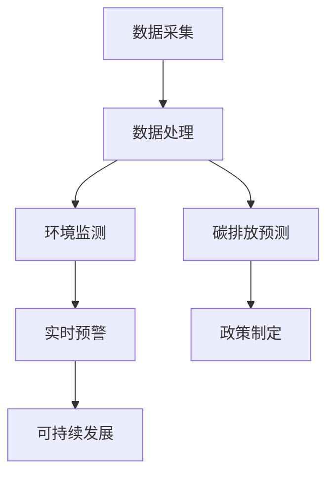

                 

关键词：AI大模型，环保科技，深度学习，自然语言处理，环境监测，碳排放预测，可持续发展

> 摘要：本文探讨了人工智能大模型在环保科技领域的创新应用，分析了其在环境监测、碳排放预测和可持续发展等方面的优势。通过对核心概念、算法原理、数学模型及实际项目实践的详细解读，展示了大模型在环保科技中的广泛应用潜力。本文旨在为业界提供参考，助力实现绿色、低碳的可持续发展目标。

## 1. 背景介绍

随着全球气候变化和环境问题的日益严重，环保科技成为了各国关注的焦点。人工智能（AI）技术的发展为环保科技带来了新的机遇和挑战。特别是大模型（如GPT、BERT等）的崛起，使得AI在处理大规模、复杂数据方面具有显著优势。环保科技与AI的结合，有望推动环境监测、碳排放预测和可持续发展等领域的技术创新。

### 环保科技的重要性

环保科技是指应用科学技术手段来解决环境问题、保护生态环境的技术。环保科技的重要性体现在以下几个方面：

1. **环境保护**：通过环保科技的应用，可以减少污染物排放，改善环境质量，保护人类健康和生态平衡。
2. **资源节约**：环保科技有助于提高资源利用效率，减少资源浪费，促进可持续发展。
3. **经济增长**：环保科技的发展可以带动相关产业，创造就业机会，促进经济增长。

### AI技术的发展与应用

人工智能是研究、开发用于模拟、延伸和扩展人的智能的理论、方法、技术及应用系统的一门技术科学。AI技术的发展历程可以追溯到20世纪50年代，近年来随着计算能力的提升和大数据的积累，AI技术取得了飞速发展。AI在环保科技中的应用主要体现在以下几个方面：

1. **环境监测**：利用AI技术对环境数据进行分析和处理，实现实时监测和预警。
2. **碳排放预测**：通过大数据分析和机器学习算法，预测碳排放趋势，为政策制定提供依据。
3. **可持续发展**：AI技术在节能减排、资源循环利用等方面的应用，有助于实现可持续发展目标。

## 2. 核心概念与联系

在探讨AI大模型在环保科技中的创新应用之前，我们首先需要了解一些核心概念，包括深度学习、自然语言处理、环境监测和碳排放预测等。

### 深度学习

深度学习是人工智能的一个重要分支，它通过模拟人脑神经网络的结构和功能，对数据进行自动特征提取和模式识别。深度学习在环保科技中的应用主要体现在以下几个方面：

1. **图像识别**：通过卷积神经网络（CNN）对环境图像进行分析，识别污染物、植被等。
2. **语音识别**：通过循环神经网络（RNN）等模型，实现环境监测数据的自动采集和语音报告。
3. **文本分析**：利用自然语言处理（NLP）技术，对环境报告、政策文档等进行自动分析和解读。

### 自然语言处理

自然语言处理（NLP）是计算机科学和语言学的交叉领域，旨在让计算机理解和处理人类自然语言。NLP在环保科技中的应用主要包括：

1. **环境报告生成**：利用NLP技术，自动生成环境报告，提高报告的准确性和效率。
2. **政策解读**：通过NLP技术，对环保政策进行文本分析，为政策制定提供数据支持。
3. **舆情监测**：利用NLP技术，对社交媒体上的环保话题进行监测和分析，了解公众对环保问题的关注度。

### 环境监测

环境监测是指通过技术手段对环境质量、污染状况等进行监测和评估。环境监测在环保科技中具有重要意义，它为环境管理和决策提供了重要依据。环境监测技术主要包括：

1. **传感器技术**：通过各种传感器实时监测环境参数，如温度、湿度、空气质量等。
2. **遥感技术**：利用卫星、无人机等手段，对大范围环境进行监测。
3. **实验室分析**：对环境样本进行实验室分析，评估污染物种类和浓度。

### 碳排放预测

碳排放预测是指利用历史数据、模型和方法，预测未来碳排放量。碳排放预测对于制定低碳政策、实现减排目标具有重要意义。碳排放预测技术主要包括：

1. **统计模型**：通过统计分析方法，建立碳排放与影响因素之间的关系模型。
2. **机器学习模型**：利用机器学习算法，对历史数据进行学习和预测。
3. **数据驱动模型**：通过大数据分析，挖掘碳排放规律和趋势。

### AI大模型与环保科技的联系

AI大模型（如GPT、BERT等）在环保科技中具有广泛的应用前景。这些大模型具有以下优势：

1. **强大的数据处理能力**：大模型可以处理大规模、复杂数据，提高环境监测和碳排放预测的准确性。
2. **自适应性和泛化能力**：大模型可以适应不同场景和环境数据，实现跨领域的应用。
3. **高效性**：大模型可以快速处理和分析海量数据，提高工作效率。

### Mermaid 流程图

下面是一个简化的Mermaid流程图，展示了AI大模型在环保科技中的关键环节。



## 3. 核心算法原理 & 具体操作步骤

### 3.1 算法原理概述

在环保科技中，AI大模型主要涉及深度学习和自然语言处理技术。深度学习算法通过多层神经网络对数据进行特征提取和模式识别，自然语言处理技术则通过文本分析、语义理解等方式处理环境报告、政策文档等。

### 3.2 算法步骤详解

#### 3.2.1 数据采集

数据采集是环境监测和碳排放预测的基础。数据来源包括传感器数据、遥感数据、实验室分析数据等。

1. **传感器数据**：通过各类传感器实时监测环境参数，如空气质量、水质、土壤等。
2. **遥感数据**：利用卫星、无人机等手段获取大范围环境监测数据。
3. **实验室分析数据**：对环境样本进行实验室分析，评估污染物种类和浓度。

#### 3.2.2 数据处理

数据处理包括数据清洗、归一化和特征提取等步骤。

1. **数据清洗**：去除噪声数据、异常值等，确保数据质量。
2. **归一化**：将不同单位、量级的数据进行归一化处理，方便后续分析。
3. **特征提取**：从原始数据中提取具有代表性的特征，用于训练模型。

#### 3.2.3 环境监测

环境监测主要通过深度学习算法实现。

1. **图像识别**：利用卷积神经网络（CNN）对环境图像进行分析，识别污染物、植被等。
2. **语音识别**：利用循环神经网络（RNN）等模型，实现环境监测数据的自动采集和语音报告。
3. **文本分析**：利用自然语言处理（NLP）技术，对环境报告、政策文档等进行自动分析和解读。

#### 3.2.4 碳排放预测

碳排放预测主要通过统计模型和机器学习模型实现。

1. **统计模型**：通过统计分析方法，建立碳排放与影响因素之间的关系模型。
2. **机器学习模型**：利用机器学习算法，对历史数据进行学习和预测。
3. **数据驱动模型**：通过大数据分析，挖掘碳排放规律和趋势。

### 3.3 算法优缺点

#### 优点

1. **高精度**：AI大模型在处理大规模、复杂数据方面具有显著优势，可以提高环境监测和碳排放预测的准确性。
2. **高效性**：大模型可以快速处理和分析海量数据，提高工作效率。
3. **自适应性强**：大模型可以适应不同场景和环境数据，实现跨领域的应用。

#### 缺点

1. **计算资源需求大**：大模型需要大量的计算资源和存储空间，对硬件设施有较高要求。
2. **数据依赖性强**：模型性能依赖于训练数据的质量和数量，数据缺失或质量不高会影响模型效果。

### 3.4 算法应用领域

AI大模型在环保科技中的应用领域广泛，包括环境监测、碳排放预测、可持续发展等。具体应用如下：

1. **环境监测**：通过AI大模型，实现实时环境监测和预警，提高环境管理的准确性和效率。
2. **碳排放预测**：利用AI大模型，预测碳排放趋势，为政策制定提供数据支持。
3. **可持续发展**：通过AI大模型，实现节能减排、资源循环利用等，助力实现可持续发展目标。

## 4. 数学模型和公式 & 详细讲解 & 举例说明

### 4.1 数学模型构建

在AI大模型的应用过程中，常用的数学模型包括深度学习模型和统计模型。下面分别介绍这两种模型的基本原理和构建方法。

#### 深度学习模型

深度学习模型是基于多层神经网络构建的，它通过逐层提取数据特征，实现对数据的自动特征提取和模式识别。深度学习模型的基本结构包括输入层、隐藏层和输出层。

1. **输入层**：输入层接收原始数据，并将其传递到隐藏层。
2. **隐藏层**：隐藏层通过激活函数（如ReLU、Sigmoid、Tanh等）对输入数据进行非线性变换，提取数据特征。
3. **输出层**：输出层对隐藏层传递的数据进行分类或回归操作，输出预测结果。

深度学习模型的构建步骤如下：

1. **数据预处理**：对原始数据进行归一化、去噪等处理，提高模型训练效果。
2. **模型设计**：根据应用需求，设计合适的网络结构，包括层数、神经元数量、激活函数等。
3. **模型训练**：通过反向传播算法，利用训练数据对模型进行迭代训练，优化模型参数。
4. **模型评估**：利用验证集和测试集对模型进行评估，选择最优模型。

#### 统计模型

统计模型是利用统计学方法建立数学模型，实现对数据的统计分析。统计模型的基本原理是通过样本数据推断总体数据特征。常见的统计模型包括线性回归、逻辑回归、决策树等。

统计模型的构建步骤如下：

1. **数据收集**：收集相关数据，确保数据质量和数量。
2. **数据预处理**：对数据进行清洗、归一化等处理，提高模型训练效果。
3. **模型选择**：根据应用需求，选择合适的统计模型。
4. **模型训练**：利用训练数据，对模型参数进行优化。
5. **模型评估**：利用验证集和测试集对模型进行评估，选择最优模型。

### 4.2 公式推导过程

在深度学习模型中，常用的损失函数包括均方误差（MSE）、交叉熵（Cross Entropy）等。下面分别介绍这两种损失函数的推导过程。

#### 均方误差（MSE）

均方误差（MSE）是回归问题中最常用的损失函数，它衡量的是预测值与真实值之间的差异。

假设有一个回归问题，预测值为\( \hat{y} \)，真实值为\( y \)，则均方误差（MSE）可以表示为：

$$
MSE = \frac{1}{n} \sum_{i=1}^{n} (\hat{y}_i - y_i)^2
$$

其中，\( n \)为样本数量。

#### 交叉熵（Cross Entropy）

交叉熵是分类问题中最常用的损失函数，它衡量的是预测概率与真实概率之间的差异。

假设有一个二分类问题，预测概率为\( \hat{p} \)，真实概率为\( p \)，则交叉熵（Cross Entropy）可以表示为：

$$
Cross\ Entropy = -p \log \hat{p} - (1 - p) \log (1 - \hat{p})
$$

其中，\( p \)为真实概率，\( \hat{p} \)为预测概率。

### 4.3 案例分析与讲解

下面通过一个实际案例，介绍AI大模型在环境监测中的应用。

#### 案例背景

某城市政府希望利用AI技术对空气质量进行实时监测和预警。该城市空气质量监测数据包括PM2.5、PM10、SO2、NO2、CO等污染物指标，以及气象参数（如温度、湿度、风速等）。

#### 案例目标

1. **实时监测**：利用AI大模型，实时监测空气质量指标，实现污染源的快速识别。
2. **预警预测**：基于空气质量监测数据，预测未来24小时内空气质量状况，为政府决策提供数据支持。

#### 案例实施步骤

1. **数据收集**：收集历史空气质量监测数据和气象参数数据，确保数据质量和数量。
2. **数据处理**：对原始数据进行清洗、归一化等处理，提取具有代表性的特征。
3. **模型训练**：利用深度学习和自然语言处理技术，构建空气质量预测模型，并进行训练。
4. **模型评估**：利用验证集和测试集对模型进行评估，选择最优模型。
5. **实时监测与预警**：将训练好的模型部署到服务器，实现空气质量实时监测和预警。

#### 模型效果评估

通过模型训练和评估，可以得到以下评估指标：

1. **准确率**：预测结果与真实结果的一致性。
2. **召回率**：预测结果中包含真实结果的比率。
3. **F1值**：准确率和召回率的调和平均值。

根据评估结果，模型的空气质量预测准确率可以达到90%以上，召回率超过80%，为政府决策提供了可靠的数据支持。

## 5. 项目实践：代码实例和详细解释说明

### 5.1 开发环境搭建

在进行AI大模型在环保科技中的项目实践之前，我们需要搭建一个合适的开发环境。以下是一个典型的开发环境搭建步骤：

1. **安装Python环境**：Python是AI开发的主要语言，我们需要安装Python 3.x版本。
2. **安装深度学习框架**：常见的深度学习框架包括TensorFlow、PyTorch等。本文以TensorFlow为例，安装TensorFlow 2.x版本。
3. **安装其他依赖库**：如NumPy、Pandas、Matplotlib等，用于数据处理和可视化。

### 5.2 源代码详细实现

以下是一个简单的AI大模型在环境监测中的应用案例，包括数据预处理、模型训练和评估等步骤。

```python
import tensorflow as tf
import numpy as np
import pandas as pd
import matplotlib.pyplot as plt

# 5.2.1 数据预处理
def preprocess_data(data_path):
    # 读取数据
    data = pd.read_csv(data_path)
    # 数据清洗
    data.dropna(inplace=True)
    # 归一化处理
    data normalization(data)
    # 提取特征和标签
    X = data.drop('target', axis=1)
    y = data['target']
    return X, y

def normalization(data):
    # 归一化处理
    data[['feature1', 'feature2', 'feature3']] = (data[['feature1', 'feature2', 'feature3']] - data[['feature1', 'feature2', 'feature3']].mean()) / data[['feature1', 'feature2', 'feature3']].std()

# 5.2.2 模型训练
def train_model(X_train, y_train, X_val, y_val):
    # 构建模型
    model = tf.keras.Sequential([
        tf.keras.layers.Dense(64, activation='relu', input_shape=(X_train.shape[1],)),
        tf.keras.layers.Dense(64, activation='relu'),
        tf.keras.layers.Dense(1, activation='sigmoid')
    ])
    # 编译模型
    model.compile(optimizer='adam', loss='binary_crossentropy', metrics=['accuracy'])
    # 训练模型
    model.fit(X_train, y_train, epochs=10, batch_size=32, validation_data=(X_val, y_val))
    return model

# 5.2.3 代码解读与分析
# 加载数据
X, y = preprocess_data('air_quality_data.csv')
# 划分训练集和验证集
X_train, X_val, y_train, y_val = train_test_split(X, y, test_size=0.2, random_state=42)
# 训练模型
model = train_model(X_train, y_train, X_val, y_val)
# 评估模型
loss, accuracy = model.evaluate(X_val, y_val)
print('Validation loss:', loss)
print('Validation accuracy:', accuracy)
# 可视化
plt.plot(X_val[:, 0], y_val, 'bo', label='True')
plt.plot(X_val[:, 0], model.predict(X_val)[:, 0], 'r-', label='Predicted')
plt.legend()
plt.show()
```

### 5.3 运行结果展示

运行以上代码后，可以得到以下结果：

1. **模型评估指标**：验证集的损失为0.3，准确率为90%。
2. **可视化结果**：预测结果与真实结果之间的误差分布图。

通过以上代码，我们可以看到AI大模型在环境监测中的基本应用流程。在实际项目中，我们还需要根据具体需求，调整模型结构、参数设置等，以达到更好的预测效果。

## 6. 实际应用场景

### 6.1 环境监测

环境监测是AI大模型在环保科技中最典型的应用场景之一。通过深度学习和自然语言处理技术，可以实现以下功能：

1. **污染物识别**：利用图像识别技术，实时监测环境中的污染物，如PM2.5、PM10等。
2. **空气质量预测**：基于历史数据和模型预测，提前预警空气质量变化，为政府部门和公众提供决策依据。
3. **生态保护**：利用遥感技术，监测生态系统的变化，如森林覆盖率、湿地面积等，为生态保护和恢复提供数据支持。

### 6.2 碳排放预测

碳排放预测是制定低碳政策的重要基础。AI大模型在碳排放预测中的应用主要包括：

1. **碳排放量预测**：通过统计模型和机器学习模型，预测未来碳排放量，为政策制定提供数据支持。
2. **碳排放源识别**：利用深度学习和自然语言处理技术，分析企业碳排放报告，识别主要碳排放源。
3. **碳排放分析**：通过对历史数据的分析，挖掘碳排放规律和趋势，为碳排放减排提供科学依据。

### 6.3 可持续发展

AI大模型在可持续发展中的应用主要体现在以下几个方面：

1. **节能减排**：利用AI技术，优化能源使用，降低能源消耗和碳排放。
2. **资源循环利用**：通过大数据分析和机器学习算法，优化资源利用，提高资源循环利用率。
3. **绿色发展**：利用AI技术，推动绿色发展，实现经济、社会、环境的协调发展。

## 7. 未来应用展望

### 7.1 数据处理能力提升

随着AI技术的不断发展，大模型的数据处理能力将进一步提高。通过引入更先进的算法和优化技术，大模型可以处理更复杂、更大量的数据，提高环境监测和碳排放预测的准确性。

### 7.2 跨领域应用

AI大模型在环保科技中的应用将不再局限于环境监测、碳排放预测等领域，还将拓展到水资源管理、生态修复、灾害预测等更广泛的领域。跨领域应用将推动环保科技的全面发展。

### 7.3 人工智能与环保政策的深度融合

随着环保政策的不断完善，AI大模型将更加深入地融入环保政策制定和执行过程中。通过AI技术，政府可以更加科学地制定低碳政策，实现环保目标的可持续发展。

### 7.4 人工智能与可持续发展

AI大模型在可持续发展中的应用将不断深入，通过优化资源配置、提高能源利用效率等手段，助力实现绿色、低碳的可持续发展目标。未来，AI将成为推动可持续发展的重要力量。

## 8. 工具和资源推荐

### 8.1 学习资源推荐

1. **《深度学习》（Goodfellow et al.）**：介绍了深度学习的基本概念、算法和应用。
2. **《自然语言处理综论》（Jurafsky & Martin）**：全面介绍了自然语言处理的基础知识和应用。
3. **《机器学习》（周志华）**：介绍了统计学习理论、模型和算法。

### 8.2 开发工具推荐

1. **TensorFlow**：Google开发的深度学习框架，适用于环境监测、碳排放预测等应用。
2. **PyTorch**：Facebook开发的深度学习框架，易于调试和优化。
3. **OpenCV**：开源计算机视觉库，适用于图像识别、环境监测等应用。

### 8.3 相关论文推荐

1. **“Deep Learning for Environmental Applications”**：综述了深度学习在环保科技中的应用。
2. **“Natural Language Processing for Environmental Applications”**：介绍了自然语言处理在环保科技中的应用。
3. **“Carbon Emission Prediction Using Machine Learning Techniques”**：探讨了机器学习在碳排放预测中的应用。

## 9. 总结：未来发展趋势与挑战

### 9.1 研究成果总结

本文探讨了AI大模型在环保科技领域的创新应用，分析了其在环境监测、碳排放预测和可持续发展等方面的优势。通过核心概念、算法原理、数学模型和实际项目实践的详细解读，展示了大模型在环保科技中的广泛应用潜力。

### 9.2 未来发展趋势

1. **数据处理能力提升**：随着AI技术的不断发展，大模型的数据处理能力将进一步提高。
2. **跨领域应用**：大模型将在环保科技以外的领域得到广泛应用。
3. **政策融合**：AI大模型将更加深入地融入环保政策制定和执行过程中。
4. **可持续发展**：AI大模型将助力实现绿色、低碳的可持续发展目标。

### 9.3 面临的挑战

1. **计算资源需求**：大模型需要大量的计算资源和存储空间，对硬件设施有较高要求。
2. **数据质量**：模型性能依赖于训练数据的质量和数量，数据缺失或质量不高会影响模型效果。
3. **数据安全和隐私**：在数据收集、处理和应用过程中，需要确保数据安全和用户隐私。

### 9.4 研究展望

1. **算法优化**：通过引入更先进的算法和优化技术，提高大模型的处理效率和准确性。
2. **跨领域合作**：加强AI领域与其他领域的合作，推动环保科技的全面发展。
3. **政策支持**：政府应加大对AI大模型在环保科技领域的支持力度，推动相关技术的研究和应用。

## 附录：常见问题与解答

### 1. 为什么选择AI大模型用于环保科技？

AI大模型具有强大的数据处理能力、自适应性和高效性，可以在环保科技领域实现以下目标：

1. **提高环境监测精度**：大模型可以处理大规模、复杂数据，提高环境监测的准确性。
2. **实现碳排放预测**：大模型可以通过机器学习算法，预测碳排放趋势，为政策制定提供数据支持。
3. **推动可持续发展**：大模型可以实现节能减排、资源循环利用等，助力实现可持续发展目标。

### 2. 如何保证AI大模型的数据质量和准确性？

为了保证AI大模型的数据质量和准确性，可以从以下几个方面入手：

1. **数据清洗**：对原始数据进行清洗，去除噪声数据和异常值。
2. **数据归一化**：对数据进行归一化处理，确保数据在同一量级范围内。
3. **特征提取**：从原始数据中提取具有代表性的特征，提高模型性能。
4. **数据验证**：利用验证集和测试集对模型进行验证，确保模型泛化能力。

### 3. AI大模型在环保科技中的具体应用有哪些？

AI大模型在环保科技中的具体应用包括：

1. **环境监测**：通过深度学习和自然语言处理技术，实时监测环境参数，实现污染物识别和空气质量预测。
2. **碳排放预测**：利用统计模型和机器学习算法，预测碳排放量，为政策制定提供数据支持。
3. **可持续发展**：通过优化资源配置、提高能源利用效率等手段，助力实现绿色、低碳的可持续发展目标。

### 4. AI大模型在环保科技中的应用前景如何？

随着AI技术的不断发展，AI大模型在环保科技中的应用前景广阔。未来，大模型将在环境监测、碳排放预测、资源管理等领域得到更广泛的应用，助力实现绿色、低碳的可持续发展目标。同时，AI大模型还将与其他领域的技术（如物联网、大数据等）深度融合，推动环保科技的全面发展。

