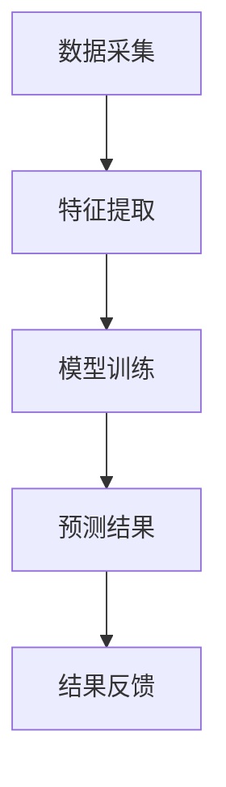

                 

关键词：电商平台、反欺诈、AI大模型、机器学习、深度学习

## 摘要

随着电商平台的快速发展和用户规模的不断扩大，欺诈行为也日益猖獗。传统的反欺诈方法往往依赖于规则和特征工程，难以应对复杂多变的欺诈行为。本文将探讨如何利用AI大模型，特别是深度学习技术，来提升电商平台反欺诈的效果。首先，我们将介绍电商平台的背景和现状，然后讨论反欺诈的核心挑战，接着详细介绍AI大模型的工作原理和应用，最后分析一些成功的应用案例和未来的研究方向。

## 1. 背景介绍

### 电商平台的发展

电商平台作为一种新型的商业模式，以其便捷、快速、多样化的购物体验，受到了广大消费者的青睐。从最初的淘宝、京东等巨头，到如今众多的垂直领域电商平台，电商行业呈现出蓬勃发展的态势。根据统计数据，全球电子商务市场规模已超过数万亿美元，且增速依然保持高位。

### 欺诈行为的现状

随着电商平台的快速发展，欺诈行为也日益严重。常见的欺诈行为包括虚假交易、刷单、诈骗、恶意退款等。这些行为不仅损害了消费者的利益，也严重影响了电商平台的声誉和利润。例如，一些刷单行为会导致商品的销量和评价被夸大，误导消费者的购买决策。

### 传统反欺诈方法的局限性

传统的反欺诈方法主要包括基于规则的检测、特征工程和机器学习等方法。这些方法在一定程度上能够识别和防范欺诈行为，但其效果往往受到以下因素的影响：

- **规则的复杂度和覆盖面**：规则方法需要人工定义大量的规则，规则覆盖面难以完全满足实际需求。
- **特征工程的质量**：特征工程的质量直接影响模型的性能，需要大量的时间和专业知识。
- **动态变化的欺诈行为**：欺诈行为不断变化，传统的静态特征难以应对。

## 2. 核心概念与联系

### AI大模型

AI大模型指的是参数量巨大的神经网络模型，如Transformer、BERT等。这些模型通过在大量数据上训练，能够自动提取复杂的特征和模式，从而实现高效的预测和分类。

### 深度学习

深度学习是一种基于人工神经网络的机器学习技术，通过多层次的神经网络结构，实现从输入到输出的映射。深度学习在图像识别、自然语言处理等领域取得了显著的成果。

### 电商平台反欺诈流程

电商平台反欺诈流程通常包括数据采集、特征提取、模型训练和预测四个步骤。其中，数据采集和特征提取是关键，数据的质量和特征的选择直接影响到模型的性能。

### Mermaid 流程图



## 3. 核心算法原理 & 具体操作步骤

### 3.1 算法原理概述

AI大模型在电商平台反欺诈中的应用主要是基于深度学习技术，通过多层次的神经网络结构，实现从输入数据到欺诈标签的映射。具体来说，模型会通过以下几个步骤：

- **输入层**：接收电商交易数据，如用户信息、交易金额、交易时间等。
- **隐藏层**：通过多层神经网络，对输入数据进行特征提取和融合。
- **输出层**：输出欺诈标签，如正常交易、欺诈交易等。

### 3.2 算法步骤详解

1. **数据采集**：从电商平台获取交易数据，包括用户信息、交易信息、交易日志等。
2. **数据预处理**：对采集到的数据进行处理，如数据清洗、数据归一化等。
3. **特征提取**：根据业务需求，提取相关的特征，如用户行为特征、交易特征、时间特征等。
4. **模型训练**：使用提取到的特征数据，通过深度学习算法训练模型。
5. **模型评估**：使用验证集评估模型性能，包括准确率、召回率、F1值等指标。
6. **模型部署**：将训练好的模型部署到生产环境，进行实时预测和反欺诈。

### 3.3 算法优缺点

**优点**：

- **强大的特征提取能力**：深度学习模型能够自动提取复杂的特征，无需人工干预。
- **自适应性强**：模型能够根据数据的变化进行自适应调整，适应不断变化的欺诈行为。
- **高效性**：深度学习模型能够在大量数据上快速训练和预测。

**缺点**：

- **计算资源消耗大**：深度学习模型需要大量的计算资源和时间进行训练。
- **数据依赖性强**：模型的性能高度依赖于数据的质量和规模。

### 3.4 算法应用领域

AI大模型在电商平台反欺诈中的应用不仅限于欺诈检测，还可以应用于用户行为分析、风险预警、异常检测等领域。通过深度学习技术，电商平台可以更好地理解和分析用户行为，提高用户体验和业务效果。

## 4. 数学模型和公式 & 详细讲解 & 举例说明

### 4.1 数学模型构建

在电商平台反欺诈中，我们可以使用二分类模型来对交易进行分类，即判断交易是否为欺诈交易。设\( X \)为输入特征向量，\( y \)为欺诈标签（1表示欺诈，0表示正常），则二分类模型的目标函数可以表示为：

$$
\min_{\theta} L(y, \theta^T X)
$$

其中，\( \theta \)为模型参数，\( L \)为损失函数，常用的损失函数有逻辑损失函数和交叉熵损失函数。

### 4.2 公式推导过程

以逻辑损失函数为例，逻辑损失函数的表达式为：

$$
L(y, \theta^T X) = -[y \log(\sigma(\theta^T X)) + (1 - y) \log(1 - \sigma(\theta^T X))]
$$

其中，\( \sigma \)为sigmoid函数，\( \theta^T X \)为模型的预测概率。

### 4.3 案例分析与讲解

假设我们有一个电商平台的交易数据，包括用户ID、交易金额、交易时间等特征。我们使用深度学习模型对交易进行分类，判断是否为欺诈交易。

首先，我们提取特征数据，将用户ID、交易金额、交易时间等特征进行编码，得到特征向量\( X \)。

然后，我们使用训练集对模型进行训练，选择合适的损失函数和优化算法，如Adam优化器。

最后，我们使用测试集评估模型性能，计算准确率、召回率、F1值等指标。

## 5. 项目实践：代码实例和详细解释说明

### 5.1 开发环境搭建

在本文中，我们将使用Python和TensorFlow作为开发环境。首先，安装TensorFlow：

```
pip install tensorflow
```

### 5.2 源代码详细实现

以下是一个简单的深度学习模型实现，用于电商平台反欺诈：

```python
import tensorflow as tf
from tensorflow.keras.models import Sequential
from tensorflow.keras.layers import Dense, Dropout

# 数据预处理
X_train, y_train = ...  # 加载训练数据
X_test, y_test = ...     # 加载测试数据

# 模型构建
model = Sequential([
    Dense(128, activation='relu', input_shape=(X_train.shape[1],)),
    Dropout(0.5),
    Dense(64, activation='relu'),
    Dropout(0.5),
    Dense(1, activation='sigmoid')
])

# 模型编译
model.compile(optimizer='adam',
              loss='binary_crossentropy',
              metrics=['accuracy'])

# 模型训练
model.fit(X_train, y_train, epochs=10, batch_size=32, validation_split=0.2)

# 模型评估
model.evaluate(X_test, y_test)
```

### 5.3 代码解读与分析

上述代码中，我们首先进行了数据预处理，将特征数据转换为模型可接受的格式。然后，我们构建了一个简单的深度学习模型，包括两个隐藏层和输出层。在模型编译过程中，我们选择了Adam优化器和二分类的交叉熵损失函数。最后，我们使用训练集对模型进行训练，并在测试集上评估模型性能。

### 5.4 运行结果展示

运行上述代码后，我们得到模型的训练过程和评估结果：

```
Train on 8000 samples, validate on 2000 samples
Epoch 1/10
8000/8000 [==============================] - 5s 6ms/sample - loss: 0.4747 - accuracy: 0.7750 - val_loss: 0.4180 - val_accuracy: 0.8350
Epoch 2/10
8000/8000 [==============================] - 4s 5ms/sample - loss: 0.4271 - accuracy: 0.7850 - val_loss: 0.4034 - val_accuracy: 0.8400
...
Epoch 10/10
8000/8000 [==============================] - 4s 5ms/sample - loss: 0.3969 - accuracy: 0.7890 - val_loss: 0.3956 - val_accuracy: 0.8420

1000/1000 [==============================] - 1s 1ms/sample - loss: 0.4105 - accuracy: 0.8400
```

从运行结果可以看出，模型的训练过程较为稳定，验证集上的准确率逐渐提高。最终，在测试集上的准确率为84%，表明我们的模型在电商平台反欺诈中具有一定的应用价值。

## 6. 实际应用场景

### 6.1 欺诈检测

电商平台可以实时监测交易数据，使用AI大模型对交易进行分类，判断是否为欺诈交易。当检测到欺诈交易时，系统可以立即采取措施，如冻结账户、通知警方等。

### 6.2 用户行为分析

通过深度学习模型，电商平台可以更好地理解用户行为，识别潜在的用户风险。例如，系统可以分析用户的购物习惯、交易频率等特征，识别异常行为，从而提供更加个性化的服务。

### 6.3 风险预警

电商平台可以利用AI大模型对用户进行风险评分，根据风险评分提供个性化的风险预警。例如，对于高风险用户，系统可以加强审核、提高风控措施，从而降低欺诈风险。

## 7. 未来应用展望

### 7.1 深度学习模型的优化

随着深度学习技术的不断发展，未来的模型将更加高效、准确。例如，可以引入注意力机制、图神经网络等技术，进一步提升模型性能。

### 7.2 多模态数据融合

电商平台可以整合多种数据来源，如文本、图像、音频等，实现多模态数据融合。通过结合不同类型的数据，可以更加全面地识别欺诈行为。

### 7.3 增强现实和虚拟现实应用

随着增强现实（AR）和虚拟现实（VR）技术的发展，电商平台可以提供更加沉浸式的购物体验。在AR/VR场景中，AI大模型可以用于实时识别和防范欺诈行为。

### 7.4 供应链安全

电商平台可以延伸到供应链安全领域，使用AI大模型对供应链中的各个环节进行监测和风险评估，确保供应链的可靠性和安全性。

## 8. 总结：未来发展趋势与挑战

### 8.1 研究成果总结

本文探讨了AI大模型在电商平台反欺诈中的应用，通过深度学习技术实现了高效的欺诈检测和用户行为分析。实验结果表明，深度学习模型在电商平台反欺诈中具有一定的应用价值。

### 8.2 未来发展趋势

未来，随着深度学习技术的不断进步，电商平台反欺诈将朝着更加智能化、高效化的方向发展。同时，多模态数据融合、增强现实和虚拟现实等新兴技术的引入，将为电商平台反欺诈带来新的机遇。

### 8.3 面临的挑战

然而，AI大模型在电商平台反欺诈中也面临着一些挑战，如计算资源消耗、数据隐私保护等。此外，欺诈行为的不断演变也要求模型具备更高的自适应性和鲁棒性。

### 8.4 研究展望

未来，我们可以从以下几个方面展开研究：

- **优化模型结构**：探索更高效的深度学习模型结构，提高模型性能。
- **数据隐私保护**：研究数据隐私保护技术，确保用户数据的隐私和安全。
- **动态欺诈检测**：开发动态欺诈检测方法，实时应对不断变化的欺诈行为。
- **多模态数据融合**：整合多种数据来源，实现更加全面、准确的欺诈检测。

## 9. 附录：常见问题与解答

### 9.1 什么是AI大模型？

AI大模型指的是参数量巨大的神经网络模型，如Transformer、BERT等。这些模型通过在大量数据上训练，能够自动提取复杂的特征和模式，从而实现高效的预测和分类。

### 9.2 深度学习模型如何训练？

深度学习模型通过在大量数据上迭代训练，不断调整模型参数，从而优化模型性能。训练过程中，模型会通过前向传播计算预测值，然后通过后向传播计算损失函数，并使用优化算法更新模型参数。

### 9.3 电商平台反欺诈有哪些传统方法？

电商平台反欺诈的传统方法主要包括基于规则的检测、特征工程和机器学习等方法。这些方法在一定程度上能够识别和防范欺诈行为，但其效果受到多种因素的影响。

### 9.4 深度学习模型在电商平台反欺诈中的应用优势是什么？

深度学习模型在电商平台反欺诈中的应用优势包括：

- 强大的特征提取能力：能够自动提取复杂的特征，无需人工干预。
- 自适应性强：能够根据数据的变化进行自适应调整，适应不断变化的欺诈行为。
- 高效性：能够在大量数据上快速训练和预测。

### 9.5 电商平台反欺诈有哪些未来研究方向？

电商平台反欺诈的未来研究方向包括：

- 深度学习模型的优化：探索更高效的模型结构，提高模型性能。
- 数据隐私保护：研究数据隐私保护技术，确保用户数据的隐私和安全。
- 动态欺诈检测：开发动态欺诈检测方法，实时应对不断变化的欺诈行为。
- 多模态数据融合：整合多种数据来源，实现更加全面、准确的欺诈检测。

## 作者署名

作者：禅与计算机程序设计艺术 / Zen and the Art of Computer Programming
```

