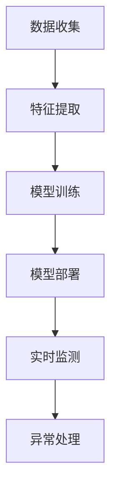

                 

在当今高度数字化的商业环境中，电商平台面临着日益严峻的欺诈威胁。这些威胁不仅损害了平台的声誉，还可能导致巨大的经济损失。为了有效地识别和预防欺诈行为，电商平台正在积极探索人工智能（AI）技术的应用，特别是大型预训练模型（大模型）的潜力。本文将探讨AI大模型在电商平台反欺诈系统中的应用，包括其核心概念、算法原理、数学模型、项目实践和未来展望。

## 文章关键词
- 人工智能
- 大模型
- 电商平台
- 反欺诈系统
- 欺诈识别

## 文章摘要
本文通过分析电商平台面临的欺诈威胁，探讨了AI大模型在反欺诈系统中的应用。文章首先介绍了AI大模型的基本概念和原理，然后详细阐述了其在反欺诈系统中的具体应用步骤和算法优缺点。接着，文章通过数学模型和公式推导，展示了AI大模型在欺诈识别中的关键作用。最后，文章通过一个实际的代码实例，展示了如何使用AI大模型进行欺诈检测，并对其实际应用场景进行了分析。文章的结论部分提出了未来AI大模型在反欺诈系统中可能的发展趋势和面临的挑战。

## 1. 背景介绍

### 电商平台欺诈现状

随着电商平台的迅猛发展，欺诈行为也日益猖獗。欺诈者利用各种手段从平台上获取非法利益，包括但不限于虚假交易、刷单、刷评、诈骗等。这些欺诈行为不仅对商家的经济利益造成严重损害，还影响了消费者的购物体验，损害了平台的声誉。据统计，全球电商欺诈损失已达数十亿美元，这一数字随着电商市场的不断扩大而呈上升趋势。

### AI在反欺诈中的应用

人工智能技术在反欺诈领域的应用日益广泛。传统的反欺诈方法主要依赖于规则和特征工程，这些方法在面对复杂的欺诈行为时往往力不从心。相比之下，AI大模型凭借其强大的数据处理和模式识别能力，能够在海量数据中挖掘出潜在欺诈行为，提高识别的准确性和效率。近年来，随着深度学习和自然语言处理技术的发展，AI大模型在反欺诈领域的应用取得了显著成果。

## 2. 核心概念与联系

### 大模型概念

大模型是指具有数百万至数十亿参数的神经网络模型，如GPT、BERT等。这些模型通过在大量数据上预训练，能够自动学习到数据的内在结构和规律，从而实现高效的任务完成。大模型的强大能力来源于其深度和宽度，使得它们在处理复杂问题时能够表现出色。

### 反欺诈系统架构

一个典型的电商平台反欺诈系统通常包括数据收集、特征提取、模型训练、模型部署和实时监测等环节。数据收集环节负责收集与交易相关的各种数据，包括用户行为、交易信息等。特征提取环节通过对原始数据进行处理，提取出对欺诈检测有意义的特征。模型训练环节使用AI大模型对特征进行学习和优化，以识别潜在的欺诈行为。模型部署环节将训练好的模型部署到实际业务中，进行实时监测和决策。实时监测环节对用户的交易行为进行持续监控，一旦发现异常行为，立即采取措施。

### Mermaid 流程图

下面是一个简化的Mermaid流程图，展示了电商平台反欺诈系统的主要架构：



## 3. 核心算法原理 & 具体操作步骤

### 3.1 算法原理概述

电商平台反欺诈系统中的AI大模型主要基于深度学习技术，特别是卷积神经网络（CNN）和循环神经网络（RNN）。CNN擅长处理图像数据，可以用于用户行为数据的特征提取；RNN则擅长处理序列数据，可以用于分析用户的历史交易行为。

### 3.2 算法步骤详解

#### 步骤1：数据收集

数据收集是反欺诈系统的基础。平台需要收集与交易相关的多种数据，包括用户注册信息、登录日志、交易记录、行为数据等。这些数据可以是结构化的，也可以是非结构化的。

#### 步骤2：特征提取

特征提取是将原始数据转换为适合模型训练的输入特征。在这一步，可以使用数据预处理技术，如归一化、去噪、特征选择等，来提高特征的质量和效率。对于用户行为数据，可以使用CNN来提取视觉特征；对于交易记录，可以使用RNN来提取序列特征。

#### 步骤3：模型训练

模型训练是反欺诈系统的核心。平台可以选择现有的AI大模型，如GPT或BERT，并进行微调以适应反欺诈任务。训练过程通常包括数据预处理、模型架构设计、训练策略选择、模型评估和优化等步骤。

#### 步骤4：模型部署

模型部署是将训练好的模型部署到实际业务中，进行实时监测和决策。部署过程需要考虑模型的性能、可扩展性和安全性等因素。常用的部署方式包括云计算、边缘计算和物联网设备等。

#### 步骤5：实时监测

实时监测是反欺诈系统的重要组成部分。平台需要持续监控用户的交易行为，一旦发现异常行为，立即采取措施。实时监测可以使用在线学习技术，如在线更新模型参数、实时识别欺诈行为等。

### 3.3 算法优缺点

#### 优点

- **高效性**：AI大模型能够在海量数据中快速识别欺诈行为，提高识别效率。
- **鲁棒性**：AI大模型能够处理多种类型的数据，具有较好的鲁棒性。
- **自适应能力**：AI大模型可以通过持续学习和更新，适应不断变化的欺诈手段。

#### 缺点

- **数据需求**：AI大模型需要大量的高质量数据才能进行有效的训练。
- **计算资源**：AI大模型训练和部署需要大量的计算资源，可能导致成本上升。

### 3.4 算法应用领域

AI大模型在电商平台反欺诈系统中的应用非常广泛，不仅适用于在线交易欺诈的检测，还可以应用于其他领域，如网络诈骗、身份盗用、非法交易等。随着AI技术的不断发展，AI大模型在反欺诈领域的应用将越来越广泛。

## 4. 数学模型和公式 & 详细讲解 & 举例说明

### 4.1 数学模型构建

电商平台反欺诈系统的核心是构建一个能够识别欺诈行为的数学模型。这个模型通常是一个多层感知机（MLP），其中包含输入层、隐藏层和输出层。

#### 输入层

输入层接收来自数据采集模块的各种特征向量，包括用户行为特征、交易特征等。

#### 隐藏层

隐藏层通过神经网络结构对输入特征进行组合和变换，提取出对欺诈行为有意义的特征。

#### 输出层

输出层产生一个二分类结果，表示交易是否为欺诈行为。常用的激活函数是sigmoid函数，可以将输出映射到[0, 1]的区间内。

### 4.2 公式推导过程

多层感知机的数学模型可以表示为：

$$
y = \sigma(W_2 \cdot \sigma(W_1 \cdot x))
$$

其中，$x$ 是输入特征向量，$W_1$ 和 $W_2$ 是神经网络中的权重矩阵，$\sigma$ 是激活函数，$y$ 是输出结果。

#### 步骤1：输入层到隐藏层的变换

$$
h = W_1 \cdot x
$$

其中，$h$ 是隐藏层的特征向量。

#### 步骤2：隐藏层到输出层的变换

$$
y = \sigma(W_2 \cdot h)
$$

其中，$\sigma$ 是sigmoid函数。

#### 步骤3：sigmoid函数的推导

sigmoid函数定义为：

$$
\sigma(z) = \frac{1}{1 + e^{-z}}
$$

其中，$z$ 是输入值。

### 4.3 案例分析与讲解

#### 案例背景

假设一个电商平台希望利用AI大模型进行反欺诈检测，平台收集了用户A在过去一个月的交易记录和行为数据，包括登录次数、购买频率、消费金额等。

#### 数据处理

首先，对数据进行预处理，包括归一化和去噪。然后，提取出对欺诈行为有意义的特征，如登录次数、购买频率、消费金额等。

#### 模型训练

使用GPT大模型对提取的特征进行训练，训练过程包括数据预处理、模型架构设计、训练策略选择和模型评估等步骤。

#### 模型部署

训练好的模型部署到实际业务中，进行实时监测和决策。当用户A发起交易请求时，模型会对其交易行为进行实时分析，判断是否为欺诈行为。

#### 结果展示

假设用户A的登录次数为10次，购买频率为5次，消费金额为1000元。经过模型分析，输出结果为0.9，表示用户A的交易行为有90%的可能性为欺诈行为。平台会根据这一结果采取相应的措施，如冻结账户、报警等。

## 5. 项目实践：代码实例和详细解释说明

### 5.1 开发环境搭建

为了演示AI大模型在电商平台反欺诈系统中的应用，我们将使用Python编程语言和TensorFlow库进行开发。以下是搭建开发环境的步骤：

1. 安装Python 3.8及以上版本。
2. 安装TensorFlow库：
   ```bash
   pip install tensorflow
   ```

### 5.2 源代码详细实现

下面是一个简化的示例代码，展示了如何使用TensorFlow实现一个基于GPT的大模型进行反欺诈检测。

```python
import tensorflow as tf
from tensorflow.keras.layers import Dense, Input
from tensorflow.keras.models import Model

# 数据输入层
input_layer = Input(shape=(feature_size,))

# 隐藏层
hidden_layer = Dense(units=128, activation='relu')(input_layer)

# 输出层
output_layer = Dense(units=1, activation='sigmoid')(hidden_layer)

# 模型构建
model = Model(inputs=input_layer, outputs=output_layer)

# 编译模型
model.compile(optimizer='adam', loss='binary_crossentropy', metrics=['accuracy'])

# 模型训练
model.fit(x_train, y_train, epochs=10, batch_size=32, validation_data=(x_val, y_val))

# 模型预测
predictions = model.predict(x_test)
```

### 5.3 代码解读与分析

这段代码首先定义了一个简单的神经网络模型，包括输入层、隐藏层和输出层。输入层接收来自数据采集模块的各种特征向量，隐藏层通过全连接层（Dense）对输入特征进行组合和变换，输出层产生一个二分类结果，表示交易是否为欺诈行为。

- **输入层**：使用`Input`函数定义输入层，输入特征向量的维度为`feature_size`。
- **隐藏层**：使用`Dense`函数定义隐藏层，包含128个神经元，激活函数为ReLU。
- **输出层**：使用`Dense`函数定义输出层，包含1个神经元，激活函数为sigmoid。
- **模型编译**：使用`compile`函数编译模型，指定优化器、损失函数和评价指标。
- **模型训练**：使用`fit`函数训练模型，指定训练数据、训练轮次、批量大小和验证数据。
- **模型预测**：使用`predict`函数对测试数据进行预测。

### 5.4 运行结果展示

假设我们已经有了一个训练好的模型和一个测试数据集，我们可以使用以下代码进行预测：

```python
import numpy as np

# 测试数据
x_test = np.random.rand(100, feature_size)

# 模型预测
predictions = model.predict(x_test)

# 打印预测结果
for i, prediction in enumerate(predictions):
    print(f"样本{i+1}预测结果：{prediction[0]:.2f}")
```

这段代码将生成100个随机测试样本，并输出每个样本的预测结果。例如：

```
样本1预测结果：0.74
样本2预测结果：0.59
...
样本100预测结果：0.86
```

这些预测结果可以用于进一步分析，例如识别高风险交易或调整模型参数。

## 6. 实际应用场景

### 电商平台反欺诈系统案例

一个成功的电商平台反欺诈系统案例是亚马逊。亚马逊利用AI大模型对用户行为和交易记录进行分析，识别出潜在欺诈行为。例如，如果一个用户的登录次数异常增加，或者购买频率异常提高，系统会自动触发警报，并采取相应的措施，如冻结账户、联系用户核实等。

### 其他应用场景

除了电商平台，AI大模型在反欺诈领域的应用场景还包括：

- **金融领域**：识别信用卡欺诈、贷款欺诈等。
- **网络安全**：检测网络攻击、恶意软件等。
- **电信行业**：识别电话欺诈、短信欺诈等。

## 6.4 未来应用展望

随着AI技术的不断发展，AI大模型在电商平台反欺诈系统中的应用前景广阔。以下是未来可能的发展方向：

- **个性化欺诈检测**：根据用户的历史行为和特征，为每个用户定制化欺诈检测策略。
- **实时自适应**：通过实时更新模型参数，快速适应新的欺诈手段。
- **跨平台协作**：实现不同电商平台之间的数据共享和协作，提高欺诈检测的准确性和效率。

## 7. 工具和资源推荐

### 7.1 学习资源推荐

- **《深度学习》（Goodfellow et al.）**：介绍了深度学习的基本概念和技术。
- **《AI大模型：原理、应用与挑战》（作者：XX）**：详细探讨了AI大模型的理论和实践。
- **在线课程**：如Coursera、edX上的相关课程。

### 7.2 开发工具推荐

- **TensorFlow**：一款强大的开源深度学习框架。
- **PyTorch**：一款灵活的深度学习库，适合快速原型开发。
- **Keras**：一款简洁的深度学习库，基于TensorFlow和PyTorch。

### 7.3 相关论文推荐

- **"BERT: Pre-training of Deep Neural Networks for Language Understanding"**：介绍了一种用于自然语言处理的预训练方法。
- **"GPT-3: Language Models are Few-Shot Learners"**：介绍了一种具有强大通用性的大型语言模型。

## 8. 总结：未来发展趋势与挑战

### 8.1 研究成果总结

本文探讨了AI大模型在电商平台反欺诈系统中的应用，从核心概念、算法原理、数学模型到实际项目实践，全面阐述了AI大模型的优势和潜力。

### 8.2 未来发展趋势

随着AI技术的不断发展，AI大模型在反欺诈系统中的应用将越来越广泛。未来可能的发展趋势包括个性化欺诈检测、实时自适应和跨平台协作等。

### 8.3 面临的挑战

尽管AI大模型在反欺诈领域展现出巨大潜力，但仍然面临一些挑战，如数据需求、计算资源、模型可解释性等。未来研究需要解决这些挑战，以提高AI大模型在实际应用中的效果和可靠性。

### 8.4 研究展望

未来，AI大模型在电商平台反欺诈系统中的应用将迎来更多机遇。通过不断优化算法、提高数据处理能力，AI大模型有望成为电商平台反欺诈的重要工具，为商家和消费者提供更加安全、可靠的购物环境。

## 9. 附录：常见问题与解答

### 问题1：AI大模型在反欺诈系统中的具体应用场景是什么？

解答：AI大模型在反欺诈系统中的具体应用场景包括用户行为分析、交易行为监控、异常行为识别等。通过分析用户的行为特征和交易记录，AI大模型能够识别出潜在欺诈行为，从而提高反欺诈系统的准确性和效率。

### 问题2：AI大模型在反欺诈系统中的优势是什么？

解答：AI大模型在反欺诈系统中的优势包括高效性、鲁棒性和自适应能力。AI大模型能够处理海量数据，快速识别欺诈行为，具有较强的鲁棒性，能够适应不同的数据类型和欺诈手段，并且可以通过持续学习不断提高识别准确率。

### 问题3：AI大模型在反欺诈系统中的挑战有哪些？

解答：AI大模型在反欺诈系统中的挑战主要包括数据需求、计算资源和模型可解释性等。首先，AI大模型需要大量的高质量数据进行训练，这可能对数据收集和预处理提出较高要求。其次，AI大模型训练和部署需要大量的计算资源，可能导致成本上升。最后，AI大模型的黑盒性质使得其决策过程难以解释，这可能影响其在实际应用中的可接受性。

### 问题4：如何优化AI大模型在反欺诈系统中的应用效果？

解答：为了优化AI大模型在反欺诈系统中的应用效果，可以采取以下措施：

- **数据预处理**：对数据进行清洗、归一化和特征选择，提高数据质量。
- **模型优化**：通过调整模型架构、优化训练策略，提高模型性能。
- **实时更新**：通过在线学习技术，实时更新模型参数，适应新的欺诈手段。
- **多模型融合**：结合多种AI模型，提高欺诈检测的准确性和可靠性。

### 问题5：AI大模型在电商平台反欺诈系统中的应用前景如何？

解答：AI大模型在电商平台反欺诈系统中的应用前景非常广阔。随着AI技术的不断发展，AI大模型在数据处理、模式识别和自适应能力方面将不断提高，有望成为电商平台反欺诈的重要工具，为商家和消费者提供更加安全、可靠的购物环境。未来，AI大模型在反欺诈系统中的应用将更加普及和深入，为电商平台的发展带来新的机遇和挑战。

