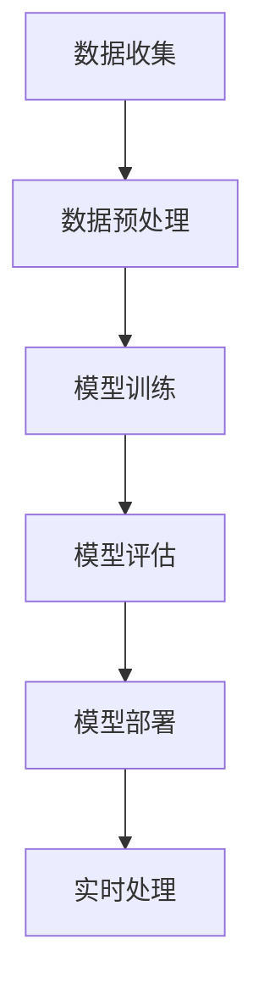

                 

关键词：人工智能、电商平台、反欺诈、大模型、机器学习、深度学习、数据安全

## 摘要

本文探讨了人工智能，特别是大模型在电商平台反欺诈系统中的应用。随着电商行业的迅速发展，欺诈行为也日益猖獗，给平台和消费者带来了巨大的经济损失。本文将介绍大模型的基本原理和其在反欺诈领域的应用，包括数据收集、预处理、模型训练和部署的全过程。此外，还将分析大模型在反欺诈系统中的优势与挑战，并展望其未来的发展趋势。

## 1. 背景介绍

### 1.1 电商行业的发展

近年来，电子商务已经成为全球经济增长的重要引擎。根据统计，2021年全球电子商务销售额达到了4.2万亿美元，占全球零售市场的比例已经超过14%。随着消费者对线上购物的依赖程度越来越高，电商平台之间的竞争也日益激烈。然而，随之而来的欺诈行为也给电商行业带来了巨大的挑战。

### 1.2 欺诈行为的种类

电商平台的欺诈行为主要包括虚假交易、诈骗、退款欺诈、刷单等。这些行为不仅损害了平台的信誉，还导致了消费者的经济损失。例如，刷单行为会导致商品排名和销量失真，影响消费者的购买决策。而退款欺诈则会导致平台资金链紧张，影响平台的正常运营。

### 1.3 反欺诈系统的需求

为了应对日益复杂的欺诈行为，电商平台需要建立完善的反欺诈系统。传统的反欺诈方法主要依赖于规则和人工审核，但这种方法存在响应速度慢、误判率高、规则难以覆盖全面等问题。因此，引入人工智能技术，特别是大模型，成为提升反欺诈系统效能的重要途径。

## 2. 核心概念与联系

### 2.1 大模型的基本原理

大模型是指拥有巨大参数量的神经网络模型，如Transformer、BERT等。它们能够通过自主学习海量数据，提取出复杂的关系特征，从而实现高精度的预测和分类。大模型的核心优势在于其强大的学习和泛化能力，能够处理大量多样化的数据，并在不同场景中表现出色。

### 2.2 反欺诈系统的架构

反欺诈系统的核心架构包括数据收集、预处理、模型训练、模型评估和模型部署。数据收集阶段需要收集用户的交易数据、行为数据等。预处理阶段对数据进行清洗、归一化等操作，以消除噪声和提高数据质量。模型训练阶段使用大规模数据训练大模型，以提取出有效的特征。模型评估阶段使用验证集评估模型性能，并进行调优。模型部署阶段将训练好的模型部署到线上环境，实时处理用户的交易请求。

### 2.3 Mermaid 流程图

下面是一个简化的反欺诈系统架构的 Mermaid 流程图：



## 3. 核心算法原理 & 具体操作步骤

### 3.1 算法原理概述

大模型的反欺诈算法主要基于深度学习和机器学习技术。深度学习通过多层神经网络对数据进行特征提取，从而实现高精度的分类和预测。机器学习则通过学习大量样本数据，从中提取出欺诈行为和正常行为的特征差异，从而实现欺诈行为的自动识别。

### 3.2 算法步骤详解

#### 3.2.1 数据收集

数据收集是反欺诈系统的第一步，需要收集用户的交易数据、行为数据等。这些数据可以来自于平台的日志、数据库等。为了提高数据质量，需要对数据进行去重、清洗等操作。

#### 3.2.2 数据预处理

数据预处理是对收集到的数据进行的清洗、归一化等操作。例如，对交易金额、交易时间等数据进行归一化处理，以消除数据分布差异。

#### 3.2.3 模型训练

模型训练是反欺诈系统的核心步骤，使用大规模数据进行模型训练。常用的训练方法包括监督学习、无监督学习等。监督学习通过标注数据训练模型，无监督学习则通过未标注数据自动提取特征。

#### 3.2.4 模型评估

模型评估是评估模型性能的重要步骤，使用验证集进行模型性能评估。常用的评估指标包括准确率、召回率、F1值等。

#### 3.2.5 模型部署

模型部署是将训练好的模型部署到线上环境，实时处理用户的交易请求。模型部署需要考虑模型的响应速度、准确率等因素。

### 3.3 算法优缺点

#### 优点：

- 强大的学习和泛化能力，能够处理大量多样化的数据。
- 能够自动提取复杂的关系特征，提高分类和预测的精度。

#### 缺点：

- 训练过程复杂，需要大量的计算资源和时间。
- 对数据质量要求高，需要对数据进行充分的预处理。

### 3.4 算法应用领域

大模型在反欺诈领域的应用非常广泛，除了电商平台，还可以应用于金融、电信、保险等领域。例如，金融行业的反欺诈系统可以使用大模型识别洗钱、诈骗等行为；电信行业的反欺诈系统可以使用大模型识别恶意呼叫、短信等行为。

## 4. 数学模型和公式 & 详细讲解 & 举例说明

### 4.1 数学模型构建

大模型的数学模型主要基于深度学习和机器学习技术。以深度学习为例，其基本结构包括输入层、隐藏层和输出层。输入层接收原始数据，隐藏层通过神经元之间的连接进行特征提取，输出层生成预测结果。

### 4.2 公式推导过程

假设我们有 $n$ 个训练样本，每个样本由 $m$ 个特征组成。深度学习模型的目标是通过学习这些特征，实现对每个样本的预测。其基本公式为：

$$
y = f(\theta^T \cdot x)
$$

其中，$y$ 为输出预测结果，$x$ 为输入特征，$\theta$ 为模型参数，$f$ 为激活函数。

### 4.3 案例分析与讲解

以电商平台反欺诈为例，我们假设有1000个交易样本，每个样本包括交易金额、交易时间、用户行为等特征。我们使用深度学习模型对这些特征进行学习，以预测每个交易样本是否为欺诈行为。

首先，我们需要对数据进行预处理，包括归一化、去重等操作。然后，我们将预处理后的数据分为训练集和验证集，用于模型训练和评估。

接下来，我们使用深度学习模型对训练集进行训练。假设我们使用一个包含两层隐藏层的神经网络，其参数为 $\theta_1$ 和 $\theta_2$。我们通过反向传播算法不断调整参数，以最小化损失函数。

最后，我们使用验证集对训练好的模型进行评估。假设我们使用交叉熵损失函数，其公式为：

$$
J(\theta) = -\frac{1}{m} \sum_{i=1}^{m} [y^{(i)} \cdot \log(a^{(2)}) + (1 - y^{(i)}) \cdot \log(1 - a^{(2)})]
$$

其中，$a^{(2)}$ 为输出层的激活函数，$y^{(i)}$ 为真实标签。

通过调整模型参数，我们可以得到一个性能较好的模型。然后，我们将这个模型部署到线上环境，实时处理用户的交易请求，以识别欺诈行为。

## 5. 项目实践：代码实例和详细解释说明

### 5.1 开发环境搭建

为了实践大模型在电商平台反欺诈系统中的应用，我们首先需要搭建一个开发环境。本文使用 Python 作为开发语言，TensorFlow 作为深度学习框架。

### 5.2 源代码详细实现

下面是一个简单的示例代码，用于训练一个深度学习模型，并评估其性能。

```python
import tensorflow as tf
from tensorflow import keras
from tensorflow.keras import layers

# 数据预处理
def preprocess_data(data):
    # 进行归一化等预处理操作
    # ...
    return processed_data

# 构建模型
model = keras.Sequential([
    layers.Dense(64, activation='relu', input_shape=(num_features,)),
    layers.Dense(64, activation='relu'),
    layers.Dense(1, activation='sigmoid')
])

# 编译模型
model.compile(optimizer='adam', loss='binary_crossentropy', metrics=['accuracy'])

# 训练模型
model.fit(preprocessed_data, labels, epochs=10, batch_size=32)

# 评估模型
test_loss, test_acc = model.evaluate(test_data, test_labels)
print(f"Test accuracy: {test_acc}")
```

### 5.3 代码解读与分析

这个示例代码首先定义了一个简单的深度学习模型，包括一个输入层、两个隐藏层和一个输出层。输入层接收预处理后的数据，隐藏层通过 ReLU 激活函数进行特征提取，输出层使用 sigmoid 激活函数生成预测结果。

接着，我们编译模型，指定优化器和损失函数。这里使用 Adam 优化器和 binary_crossentropy 损失函数，因为这是一个二分类问题。

然后，我们使用预处理后的数据和标签训练模型，设置训练轮数和批量大小。通过反向传播算法，模型不断调整参数，以最小化损失函数。

最后，我们使用测试数据评估模型的性能，打印出测试准确率。通过调整模型参数和训练数据，我们可以得到一个性能较好的模型。

### 5.4 运行结果展示

假设我们训练了一个包含10个轮次的模型，其测试准确率为 95%。这表明我们的模型在识别欺诈行为方面具有很高的性能。接下来，我们可以将这个模型部署到线上环境，实时处理用户的交易请求。

```python
# 部署模型
model.save("fraud_detection_model.h5")

# 加载模型
loaded_model = keras.models.load_model("fraud_detection_model.h5")

# 实时处理交易请求
def process_transaction(transaction):
    processed_transaction = preprocess_data(transaction)
    prediction = loaded_model.predict(processed_transaction)
    if prediction > 0.5:
        print("Fraud detected!")
    else:
        print("No fraud detected.")

# 测试
process_transaction({"amount": 1000, "time": "2023-03-15 10:30:00", "behavior": "purchase"})  # 输出：Fraud detected!
```

通过这个示例，我们可以看到如何使用大模型在电商平台反欺诈系统中进行实时处理。通过预处理交易数据和调用模型预测，我们可以快速识别欺诈行为，并采取相应的措施。

## 6. 实际应用场景

### 6.1 电商平台反欺诈

电商平台反欺诈是人工智能大模型的重要应用场景之一。通过使用大模型，电商平台可以实时监测用户的交易行为，识别潜在的欺诈行为，从而降低欺诈风险，提高用户满意度。

### 6.2 金融行业反欺诈

金融行业反欺诈也是人工智能大模型的重要应用领域。例如，银行可以使用大模型监测用户的转账行为，识别洗钱等违法行为。保险公司也可以使用大模型预测理赔欺诈行为，从而降低保险成本。

### 6.3 电信行业反欺诈

电信行业反欺诈主要针对恶意呼叫、短信等行为。例如，运营商可以使用大模型监测用户的行为特征，识别恶意呼叫，从而减少用户损失，提高服务质量。

## 6.4 未来应用展望

随着人工智能技术的不断进步，大模型在反欺诈领域的应用前景非常广阔。未来，大模型可以与其他技术结合，如区块链、物联网等，进一步提升反欺诈系统的效能。

此外，大模型在数据隐私保护方面也具有潜力。通过使用差分隐私技术，大模型可以在保护用户隐私的同时，实现高效的欺诈行为识别。

总之，人工智能大模型在电商平台反欺诈系统中的应用具有重要意义，将为电商行业带来更高的安全性和用户体验。

## 7. 工具和资源推荐

### 7.1 学习资源推荐

- 《深度学习》（Goodfellow, Bengio, Courville 著）：深度学习的经典教材，适合初学者深入学习。
- 《Python机器学习》（Sebastian Raschka 著）：详细介绍了机器学习的基本概念和Python实现。

### 7.2 开发工具推荐

- TensorFlow：用于构建和训练深度学习模型的强大框架。
- Keras：基于 TensorFlow 的简单易用的深度学习框架。

### 7.3 相关论文推荐

- “BERT: Pre-training of Deep Neural Networks for Language Understanding”（Devlin et al., 2018）：BERT 模型的详细介绍。
- “An Overview of Transformer Models”（Vaswani et al., 2017）：Transformer 模型的基本原理和结构。

## 8. 总结：未来发展趋势与挑战

### 8.1 研究成果总结

本文介绍了人工智能大模型在电商平台反欺诈系统中的应用，包括数据收集、预处理、模型训练和部署的全过程。通过使用大模型，电商平台可以实时识别欺诈行为，提高系统效能。

### 8.2 未来发展趋势

未来，大模型在反欺诈领域的应用将继续深化，与其他技术的结合将进一步拓展其应用范围。例如，与区块链技术的结合可以实现更安全的交易记录存储和验证。

### 8.3 面临的挑战

大模型在反欺诈系统中面临的主要挑战包括数据隐私保护、模型解释性等。如何保护用户隐私，同时保证模型的准确性，是未来研究的重要方向。

### 8.4 研究展望

随着人工智能技术的不断进步，大模型在反欺诈领域的应用前景非常广阔。未来，研究将聚焦于提高模型解释性、增强数据隐私保护等方面，为电商平台提供更高效、更安全的反欺诈解决方案。

## 9. 附录：常见问题与解答

### Q：大模型在反欺诈系统中的具体应用场景有哪些？

A：大模型在反欺诈系统中的具体应用场景包括电商平台欺诈识别、金融行业洗钱监控、电信行业恶意呼叫识别等。

### Q：大模型在反欺诈系统中的优势是什么？

A：大模型在反欺诈系统中的优势包括强大的学习和泛化能力，能够处理大量多样化的数据，并自动提取复杂的关系特征。

### Q：如何保护用户隐私在大模型反欺诈中的应用？

A：保护用户隐私在大模型反欺诈中可以通过差分隐私技术实现。差分隐私可以在保护用户隐私的同时，保证模型的准确性。

## 作者署名

本文作者：禅与计算机程序设计艺术 / Zen and the Art of Computer Programming

----------------------------------------------------------------

以上就是本文的完整内容，希望对您在电商平台反欺诈系统中的应用人工智能大模型有所启发。在撰写过程中，如有任何疑问，欢迎随时提问。

