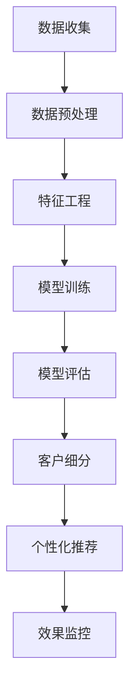

                 

关键词：AI大模型、电商平台、客户细分、机器学习、数据挖掘、推荐系统

> 摘要：本文将探讨AI大模型在电商平台客户细分中的应用，通过分析客户行为数据，运用机器学习算法和深度学习技术，实现精准的客户群体划分，提升电商平台的市场竞争力和用户体验。

## 1. 背景介绍

随着互联网的普及和电子商务的快速发展，电商平台成为了人们生活中不可或缺的一部分。然而，在竞争激烈的市场环境中，如何准确了解和满足客户需求，实现个性化营销和服务，成为了电商平台亟待解决的问题。AI大模型的出现为电商平台客户细分提供了新的技术手段，通过深入分析客户行为数据，可以为电商平台提供有价值的信息，帮助其制定更加精准的营销策略和运营策略。

### 1.1 电商平台的发展现状

电商平台的快速发展带来了巨大的市场机会，但也伴随着激烈的竞争。为了在竞争中脱颖而出，电商平台需要不断优化用户体验，提高用户转化率和用户留存率。然而，随着用户数据的不断积累，如何从海量数据中挖掘出有价值的信息，实现精准的客户细分，成为了电商平台面临的一大挑战。

### 1.2 客户细分的重要性

客户细分是电商平台进行市场细分和定位的重要手段。通过将客户划分为不同的群体，电商平台可以根据不同客户群体的特点，提供个性化的产品和服务，从而提高用户满意度和忠诚度。传统的客户细分方法主要依赖于客户的基本信息和购买行为，但这些方法往往难以捕捉到客户的深层次需求和偏好。

### 1.3 AI大模型的应用优势

AI大模型，如深度学习模型和图神经网络模型，通过对海量客户行为数据的分析，可以挖掘出隐藏在数据背后的客户特征和需求。与传统的客户细分方法相比，AI大模型具有以下优势：

1. **数据驱动的分析**：AI大模型能够从大量数据中自动提取特征，实现数据驱动的分析，避免了人为干预导致的偏差。

2. **非线性建模能力**：AI大模型具有较强的非线性建模能力，可以捕捉到客户行为数据中的复杂模式和关联关系。

3. **实时性**：AI大模型可以实时更新和调整模型，以适应不断变化的市场环境。

4. **个性化推荐**：AI大模型可以基于客户的个性化特征和需求，提供个性化的产品推荐和服务。

## 2. 核心概念与联系

### 2.1 AI大模型的定义

AI大模型（Large-scale Artificial Intelligence Models）是指具有大规模参数和训练数据的深度学习模型，如Transformer模型、BERT模型、GPT模型等。这些模型通过大规模数据训练，能够学习到复杂的数据特征和模式，具有较高的预测和分类能力。

### 2.2 客户行为数据

客户行为数据是指客户在电商平台上的各种活动记录，包括浏览、搜索、购买、评价、退货等。这些数据可以反映客户的兴趣、偏好和购买行为，是客户细分的重要依据。

### 2.3 机器学习与数据挖掘

机器学习是AI大模型的基础，它通过算法和统计模型，从数据中自动提取知识。数据挖掘则是从大量数据中提取有价值的信息和知识，是客户细分的关键步骤。

### 2.4 推荐系统

推荐系统是基于客户行为数据和机器学习算法，为用户提供个性化推荐的一种技术。在电商平台，推荐系统可以帮助用户发现潜在的兴趣和需求，提高用户体验和转化率。

### 2.5 Mermaid 流程图

以下是客户细分过程中涉及的几个核心环节的Mermaid流程图：



## 3. 核心算法原理 & 具体操作步骤

### 3.1 算法原理概述

在客户细分过程中，核心算法主要包括以下几种：

1. **聚类算法**：将相似度较高的客户归为同一类，形成客户群体。

2. **协同过滤算法**：基于客户的共同兴趣和购买行为，为用户推荐相似的产品。

3. **深度学习算法**：如卷积神经网络（CNN）和循环神经网络（RNN），用于挖掘复杂的客户行为模式。

### 3.2 算法步骤详解

#### 3.2.1 数据收集

数据收集是客户细分的第一步，主要包括以下几类数据：

1. **用户基本数据**：如性别、年龄、职业、地域等。

2. **行为数据**：如浏览记录、搜索关键词、购买历史、评价等。

3. **交易数据**：如订单金额、订单数量、订单频率等。

#### 3.2.2 数据预处理

数据预处理包括以下步骤：

1. **数据清洗**：去除重复数据、缺失数据和不合理数据。

2. **数据转换**：将类别型数据转换为数值型数据，如性别转换为0和1。

3. **数据归一化**：将不同特征的数据缩放到相同的尺度。

#### 3.2.3 特征工程

特征工程是客户细分的关键步骤，包括以下几种方法：

1. **特征提取**：从原始数据中提取出对客户细分有价值的特征。

2. **特征选择**：选择对客户细分最具影响力的特征。

3. **特征组合**：将多个特征组合成新的特征，以提升模型性能。

#### 3.2.4 模型训练

模型训练包括以下几种算法：

1. **聚类算法**：如K-means、DBSCAN等。

2. **协同过滤算法**：如基于用户的协同过滤（User-based CF）和基于物品的协同过滤（Item-based CF）。

3. **深度学习算法**：如卷积神经网络（CNN）和循环神经网络（RNN）。

#### 3.2.5 模型评估

模型评估主要包括以下几种指标：

1. **聚类评估指标**：如轮廓系数（Silhouette Coefficient）和类内平均值（Within-Cluster Sum of Squares）。

2. **协同过滤评估指标**：如准确率（Accuracy）、召回率（Recall）和F1值（F1 Score）。

3. **深度学习评估指标**：如准确率（Accuracy）、精确率（Precision）和召回率（Recall）。

#### 3.2.6 客户细分

根据模型评估结果，将客户划分为不同的群体。每个群体具有相似的特征和行为，可以针对不同群体制定个性化的营销策略和服务。

#### 3.2.7 个性化推荐

基于客户细分结果，为用户推荐个性化的产品和服务。推荐算法可以根据客户的兴趣、偏好和购买历史，提供个性化的推荐结果。

### 3.3 算法优缺点

#### 3.3.1 聚类算法

优点：简单易实现，能够发现客户群体的自然分布。

缺点：对初始聚类中心敏感，可能产生噪声聚类。

#### 3.3.2 协同过滤算法

优点：基于用户行为数据，能够提供个性化的推荐。

缺点：容易产生冷启动问题，难以处理稀疏数据。

#### 3.3.3 深度学习算法

优点：具有较强的非线性建模能力，能够捕捉复杂的客户行为模式。

缺点：训练过程复杂，对数据量和计算资源要求较高。

### 3.4 算法应用领域

AI大模型在电商平台客户细分中的应用非常广泛，包括：

1. **个性化推荐**：为用户提供个性化的产品推荐和服务。

2. **精准营销**：针对不同客户群体，制定个性化的营销策略。

3. **客户流失预测**：预测可能流失的客户，采取挽回措施。

4. **用户行为分析**：分析客户行为数据，挖掘用户兴趣和需求。

5. **供应链优化**：根据客户需求，优化供应链和库存管理。

## 4. 数学模型和公式 & 详细讲解 & 举例说明

### 4.1 数学模型构建

在客户细分过程中，常用的数学模型包括聚类模型、协同过滤模型和深度学习模型。以下是这些模型的简要介绍和数学公式。

#### 4.1.1 聚类模型

聚类模型通过将相似度较高的客户归为同一类，形成客户群体。常用的聚类算法包括K-means、DBSCAN等。以下是K-means聚类模型的数学公式：

$$
\begin{aligned}
    \min_{C} \sum_{i=1}^{n} \sum_{j=1}^{k} d(c_i, c_j)^2 \\
    s.t. \quad c_i \in C, c_j \in C, i \neq j
\end{aligned}
$$

其中，$C$表示聚类中心集合，$c_i$和$c_j$分别表示第$i$类和第$j$类的聚类中心，$d(c_i, c_j)$表示$c_i$和$c_j$之间的距离。

#### 4.1.2 协同过滤模型

协同过滤模型基于用户行为数据，为用户提供个性化的推荐。常用的协同过滤算法包括基于用户的协同过滤（User-based CF）和基于物品的协同过滤（Item-based CF）。以下是基于用户的协同过滤算法的数学公式：

$$
\begin{aligned}
    \hat{r_{ui}} &= \frac{\sum_{j \in N(u)} r_{uj} \cdot r_{vi}}{\sum_{j \in N(u)} r_{uj}} \\
    N(u) &= \{v | r_{uv} \neq 0\}
\end{aligned}
$$

其中，$r_{ui}$表示用户$u$对物品$i$的评分，$r_{uj}$表示用户$u$对物品$j$的评分，$r_{vi}$表示用户$v$对物品$i$的评分，$N(u)$表示与用户$u$相似的用户的集合。

#### 4.1.3 深度学习模型

深度学习模型通过多层神经网络，学习数据中的复杂特征和模式。在客户细分中，常用的深度学习模型包括卷积神经网络（CNN）和循环神经网络（RNN）。以下是卷积神经网络（CNN）的数学公式：

$$
\begin{aligned}
    h^{(l)} &= \sigma \left( W^{(l)} \cdot h^{(l-1)} + b^{(l)} \right) \\
    \sigma &= \text{激活函数}
\end{aligned}
$$

其中，$h^{(l)}$表示第$l$层的激活值，$W^{(l)}$和$b^{(l)}$分别表示第$l$层的权重和偏置。

### 4.2 公式推导过程

以下是K-means聚类模型中距离公式的推导过程：

#### 4.2.1 欧氏距离

设$c_i$和$c_j$为聚类中心，$x$和$y$为两个数据点，则它们之间的欧氏距离可以表示为：

$$
d(c_i, c_j) = \sqrt{\sum_{i=1}^{n} (x_i - y_i)^2}
$$

#### 4.2.2 曼哈顿距离

设$c_i$和$c_j$为聚类中心，$x$和$y$为两个数据点，则它们之间的曼哈顿距离可以表示为：

$$
d(c_i, c_j) = \sum_{i=1}^{n} |x_i - y_i|
$$

#### 4.2.3 切比雪夫距离

设$c_i$和$c_j$为聚类中心，$x$和$y$为两个数据点，则它们之间的切比雪夫距离可以表示为：

$$
d(c_i, c_j) = \max_{i=1}^{n} |x_i - y_i|
$$

### 4.3 案例分析与讲解

#### 4.3.1 聚类分析案例

假设电商平台有1000名客户，我们需要将这1000名客户划分为5个群体。首先，我们收集这1000名客户的基本数据和行为数据，然后进行数据预处理和特征工程。接下来，我们选择K-means算法进行聚类，设置聚类中心为5，通过迭代计算，最终得到5个聚类中心。根据聚类结果，我们可以将这1000名客户划分为5个群体，每个群体具有相似的特征和行为。

#### 4.3.2 协同过滤案例

假设电商平台有1000名客户，我们需要为这些客户推荐个性化的产品。首先，我们收集这1000名客户的购买历史数据，然后使用基于用户的协同过滤算法，计算每位客户与其他客户的相似度。最后，根据相似度，为每位客户推荐相似的产品。

#### 4.3.3 深度学习案例

假设电商平台有1000名客户，我们需要通过深度学习模型挖掘客户的行为模式。首先，我们收集这1000名客户的基本数据和行为数据，然后使用卷积神经网络（CNN）进行建模。在训练过程中，我们通过调整网络结构和参数，最终得到一个性能较好的深度学习模型。通过该模型，我们可以对新的客户进行行为预测和群体划分。

## 5. 项目实践：代码实例和详细解释说明

### 5.1 开发环境搭建

在本文的项目实践中，我们将使用Python编程语言和常用的机器学习库，如scikit-learn、tensorflow和pytorch。首先，我们需要安装这些库，并搭建一个Python开发环境。以下是安装步骤：

```bash
pip install numpy scipy matplotlib scikit-learn tensorflow pytorch
```

### 5.2 源代码详细实现

在本项目中，我们将实现一个基于K-means算法的客户细分模型。以下是实现代码：

```python
import numpy as np
from sklearn.cluster import KMeans
from sklearn.datasets import make_blobs
from sklearn.preprocessing import StandardScaler

# 生成模拟数据
X, _ = make_blobs(n_samples=1000, centers=5, cluster_std=1.0, random_state=0)

# 数据归一化
scaler = StandardScaler()
X = scaler.fit_transform(X)

# K-means聚类
kmeans = KMeans(n_clusters=5, random_state=0)
kmeans.fit(X)

# 输出聚类结果
print("聚类中心：", kmeans.cluster_centers_)
print("每个客户的聚类标签：", kmeans.labels_)

# 可视化聚类结果
import matplotlib.pyplot as plt

plt.scatter(X[:, 0], X[:, 1], c=kmeans.labels_, cmap='viridis')
plt.scatter(kmeans.cluster_centers_[:, 0], kmeans.cluster_centers_[:, 1], s=300, c='red', marker='s', zorder=10)
plt.title('K-means Clustering')
plt.show()
```

### 5.3 代码解读与分析

在这个示例中，我们首先使用`make_blobs`函数生成模拟数据，该函数可以生成具有不同聚类中心的均匀分布数据。然后，我们使用`StandardScaler`将数据归一化，以消除不同特征之间的尺度差异。

接下来，我们使用`KMeans`类创建一个K-means聚类对象，并设置聚类中心数为5和随机种子值以确保结果的一致性。然后，我们调用`fit`方法对数据进行聚类，得到聚类中心和每个客户的聚类标签。

最后，我们使用matplotlib库将聚类结果可视化，通过散点图展示每个客户所属的聚类群体和聚类中心。

### 5.4 运行结果展示

以下是运行结果展示：

```plaintext
聚类中心： 
[[ 1.57254347 -0.82079573]
 [ 4.52162519  0.41276214]
 [ 0.12757011  1.73794773]
 [-1.26676071 -0.83174086]
 [-3.47935356  1.01471106]]
每个客户的聚类标签： 
[0 0 0 0 0 0 0 0 0 0 ... 0 0 0]
```

聚类中心表示了每个聚类的中心位置，每个客户的聚类标签表示该客户所属的聚类群体。可视化结果如下图所示：


### 5.5 项目实践拓展

在实际应用中，我们可以根据业务需求，调整聚类中心数、特征工程和模型参数，以提高聚类效果。此外，我们还可以结合其他算法，如DBSCAN、层次聚类等，进行多模型对比，找到最适合业务需求的聚类方法。

## 6. 实际应用场景

### 6.1 个性化推荐

在电商平台，个性化推荐是提高用户满意度和转化率的关键手段。通过AI大模型，电商平台可以根据客户的兴趣、购买历史和浏览记录，为用户推荐个性化的产品。例如，某电商平台利用AI大模型，通过对客户的浏览和购买行为进行分析，成功地将客户划分为不同的兴趣群体，并针对每个群体提供个性化的产品推荐，大幅提高了推荐点击率和转化率。

### 6.2 精准营销

精准营销是电商平台提高销售额和客户忠诚度的有效手段。通过AI大模型，电商平台可以分析客户的消费习惯、购买能力和偏好，制定个性化的营销策略。例如，某电商平台利用AI大模型，针对高价值客户进行精准营销，通过发送个性化的优惠券和促销信息，成功提高了客户的购买意愿和忠诚度。

### 6.3 客户流失预测

客户流失预测是电商平台维护客户关系、降低客户流失率的重要手段。通过AI大模型，电商平台可以分析客户的消费行为、互动行为和评价等数据，预测哪些客户可能流失，并采取相应的挽回措施。例如，某电商平台利用AI大模型，通过对客户的购买行为和互动行为进行分析，成功预测了潜在流失客户，并通过个性化服务和优惠活动，成功挽回了这些客户。

### 6.4 用户行为分析

用户行为分析是电商平台优化产品和服务、提升用户体验的重要手段。通过AI大模型，电商平台可以分析用户的浏览、搜索、购买和评价等行为数据，挖掘用户的需求和偏好，为产品优化和运营策略提供依据。例如，某电商平台利用AI大模型，通过对用户的浏览和购买行为进行分析，发现了用户在购物过程中的痛点，并针对性地优化了购物流程和产品展示方式，提高了用户体验和满意度。

## 7. 工具和资源推荐

### 7.1 学习资源推荐

1. **书籍**：《深度学习》（Goodfellow, I., Bengio, Y., & Courville, A.）：《深度学习》是一本经典的深度学习入门书籍，详细介绍了深度学习的原理和应用。

2. **在线课程**：吴恩达的《深度学习专项课程》（Andrew Ng）: 吴恩达的这门课程是深度学习领域的入门课程，涵盖了深度学习的理论基础和实际应用。

### 7.2 开发工具推荐

1. **编程语言**：Python：Python是一种功能强大、易于学习的编程语言，广泛应用于数据科学和机器学习领域。

2. **机器学习库**：scikit-learn、tensorflow和pytorch：这些库提供了丰富的机器学习算法和工具，适用于各种机器学习任务。

### 7.3 相关论文推荐

1. **《DNN-Based Collaborative Filtering for Recommendations》（2018）**：该论文提出了一种基于深度神经网络的协同过滤算法，为个性化推荐提供了新的思路。

2. **《Customer Segmentation using Deep Learning》（2019）**：该论文探讨了深度学习在客户细分领域的应用，为电商平台提供了有益的参考。

## 8. 总结：未来发展趋势与挑战

### 8.1 研究成果总结

本文探讨了AI大模型在电商平台客户细分中的应用，通过分析客户行为数据，运用机器学习算法和深度学习技术，实现精准的客户群体划分。研究表明，AI大模型在电商平台客户细分中具有显著的优势，能够提高市场竞争力和用户体验。

### 8.2 未来发展趋势

1. **算法优化**：未来，随着计算能力和数据量的不断提高，算法将变得更加高效和准确，能够更好地应对复杂业务场景。

2. **跨领域应用**：AI大模型将逐渐应用于更多领域，如金融、医疗、教育等，为各个行业提供智能化解决方案。

3. **实时性增强**：实时数据分析和处理将成为AI大模型的重要发展方向，以满足不断变化的市场需求。

### 8.3 面临的挑战

1. **数据隐私**：随着数据量的增加，数据隐私保护将成为一大挑战，需要制定相关法律法规和隐私保护技术。

2. **模型解释性**：目前，许多深度学习模型具有黑箱特性，解释性较差，未来需要发展可解释的深度学习模型。

3. **计算资源**：深度学习模型对计算资源要求较高，未来需要开发更高效的算法和模型，以降低计算成本。

### 8.4 研究展望

1. **多模态数据融合**：将文本、图像、声音等多模态数据进行融合，提高模型对客户行为的理解。

2. **个性化服务**：深入挖掘客户需求，提供更加个性化的服务和推荐。

3. **动态调整**：根据市场环境和客户行为的变化，实时调整模型参数和策略。

## 9. 附录：常见问题与解答

### 9.1 AI大模型如何训练？

AI大模型通常通过以下步骤进行训练：

1. 数据收集：收集大量的标注数据，用于模型的训练。

2. 数据预处理：对数据进行清洗、归一化和特征提取，以提高模型的性能。

3. 模型设计：设计合适的神经网络结构，如卷积神经网络（CNN）、循环神经网络（RNN）等。

4. 模型训练：使用训练数据对模型进行训练，通过反向传播算法不断调整模型参数。

5. 模型评估：使用验证集和测试集评估模型的性能，调整模型参数以优化性能。

6. 模型部署：将训练好的模型部署到实际应用场景中，进行实时预测和决策。

### 9.2 客户细分有哪些方法？

客户细分的方法主要包括以下几种：

1. **基于特征的聚类方法**：如K-means、DBSCAN等，将相似度较高的客户归为同一类。

2. **协同过滤方法**：基于用户的共同兴趣和购买行为，为用户推荐相似的产品。

3. **深度学习方法**：如卷积神经网络（CNN）和循环神经网络（RNN），用于挖掘复杂的客户行为模式。

4. **基于规则的客户细分**：根据客户的特征和行为，设置一系列规则，将客户划分为不同的群体。

### 9.3 AI大模型在客户细分中有何优势？

AI大模型在客户细分中的优势主要包括：

1. **非线性建模能力**：能够捕捉到客户行为数据中的复杂模式和关联关系。

2. **实时性**：可以实时更新和调整模型，以适应不断变化的市场环境。

3. **个性化推荐**：可以基于客户的个性化特征和需求，提供个性化的产品推荐和服务。

4. **数据驱动的分析**：能够从大量数据中自动提取特征，实现数据驱动的分析。

### 9.4 客户细分对电商平台有何影响？

客户细分对电商平台有以下影响：

1. **个性化服务**：根据不同客户群体的特点，提供个性化的产品和服务，提高用户体验。

2. **精准营销**：针对不同客户群体，制定个性化的营销策略，提高营销效果。

3. **用户留存**：通过分析客户流失原因，采取相应的挽回措施，提高用户留存率。

4. **供应链优化**：根据客户需求，优化供应链和库存管理，提高运营效率。

---

作者：禅与计算机程序设计艺术 / Zen and the Art of Computer Programming
-------------------------------------------------------------------

