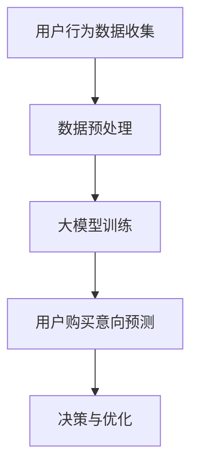

                 

关键词：人工智能，大模型，电商平台，用户购买意向，预测

摘要：本文深入探讨了人工智能大模型在电商平台用户购买意向强度预测中的应用。通过阐述背景、核心概念与联系、算法原理与数学模型、项目实践和未来展望，我们揭示了AI大模型在现代电商平台运营中的巨大潜力。

## 1. 背景介绍

在数字化时代，电商平台已成为消费者购物的主要途径。然而，面对海量用户数据和复杂的市场环境，如何准确预测用户购买意向成为电商平台运营的关键。传统的预测方法往往依赖于简单的统计模型或规则系统，难以应对数据多样性和复杂性。随着深度学习技术的发展，大模型在处理复杂数据和模式识别方面展现出显著优势，为电商平台用户购买意向预测提供了新的解决方案。

## 2. 核心概念与联系

### 2.1 大模型

大模型通常指的是拥有数十亿甚至千亿级参数的深度神经网络。这些模型通过在大量数据上训练，能够自动提取特征并建模复杂的关系。例如，Transformer模型就是大模型的代表，它通过自注意力机制实现了对输入数据的全局上下文理解。

### 2.2 用户购买意向

用户购买意向是指消费者在特定情境下对于某一产品或服务的购买倾向。它可以表现为点击、浏览、购买等行为数据。这些行为数据不仅反映了用户的兴趣，也揭示了潜在的购买意图。

### 2.3 Mermaid 流程图



## 3. 核心算法原理 & 具体操作步骤

### 3.1 算法原理概述

大模型在用户购买意向预测中的核心原理是通过学习用户的历史行为数据，自动提取潜在的兴趣特征，并建立用户购买意图与行为数据之间的关系。

### 3.2 算法步骤详解

#### 3.2.1 数据预处理

- 数据清洗：去除无效或错误的数据记录。
- 特征工程：提取用户行为数据中的关键特征，如浏览时长、购买频率、点击率等。
- 数据归一化：将不同特征的数据进行归一化处理，以便模型训练。

#### 3.2.2 大模型训练

- 数据集划分：将数据集划分为训练集、验证集和测试集。
- 模型搭建：选择合适的大模型架构，如Transformer、BERT等。
- 模型训练：使用训练集数据训练模型，并优化模型参数。

#### 3.2.3 用户购买意向预测

- 输入用户行为数据：将用户行为数据输入到大模型中。
- 预测用户购买意向：通过模型输出得到用户购买意向强度。

### 3.3 算法优缺点

#### 优点：

- 高效性：大模型能够快速处理海量数据，提高预测效率。
- 准确性：通过学习大量数据，模型能够准确识别用户的购买意图。
- 可扩展性：大模型易于扩展到其他应用领域。

#### 缺点：

- 计算资源消耗大：大模型需要大量的计算资源和时间进行训练。
- 解释性差：大模型的黑箱特性使得难以解释其预测结果。

### 3.4 算法应用领域

大模型在电商平台用户购买意向预测中的应用不仅限于预测用户购买意图，还可以用于个性化推荐、广告投放优化、市场需求预测等。

## 4. 数学模型和公式 & 详细讲解 & 举例说明

### 4.1 数学模型构建

用户购买意向强度可以用一个概率分布来表示，该分布由用户的历史行为数据决定。

$$ P(I=i|X) = \frac{e^{\theta_i^T X}}{\sum_j e^{\theta_j^T X}} $$

其中，$I$表示用户购买意向，$X$表示用户历史行为数据，$\theta_i$为模型参数。

### 4.2 公式推导过程

#### 4.2.1 假设

- 用户行为数据服从概率分布$P(X)$。
- 用户购买意向与行为数据之间满足线性关系：$I = \theta^T X + \epsilon$，其中$\epsilon$为误差项。

#### 4.2.2 模型构建

基于上述假设，我们可以构建一个逻辑回归模型：

$$ P(I=i|X) = \frac{e^{\theta_i^T X}}{1 + e^{\theta_j^T X}} $$

### 4.3 案例分析与讲解

#### 案例一：用户点击行为预测

假设用户在电商平台浏览了多个商品，其中点击了商品A和商品B。我们可以通过以下步骤进行点击行为预测：

1. 提取用户历史行为特征，如点击时长、浏览次数等。
2. 输入特征向量到逻辑回归模型中。
3. 计算模型输出概率，预测用户是否点击商品A。

通过实际案例，我们可以看到数学模型在用户购买意向预测中的重要性。

## 5. 项目实践：代码实例和详细解释说明

### 5.1 开发环境搭建

- 硬件环境：GPU硬件（如NVIDIA Tesla V100）
- 软件环境：Python、PyTorch等

### 5.2 源代码详细实现

```python
import torch
import torch.nn as nn
import torch.optim as optim

# 模型搭建
class LogisticRegression(nn.Module):
    def __init__(self, input_dim, output_dim):
        super(LogisticRegression, self).__init__()
        self.linear = nn.Linear(input_dim, output_dim)
    
    def forward(self, x):
        return torch.sigmoid(self.linear(x))

# 数据预处理
def preprocess_data(data):
    # 数据清洗、特征提取、归一化等操作
    pass

# 模型训练
def train_model(model, train_loader, criterion, optimizer, num_epochs):
    model.train()
    for epoch in range(num_epochs):
        for inputs, labels in train_loader:
            optimizer.zero_grad()
            outputs = model(inputs)
            loss = criterion(outputs, labels)
            loss.backward()
            optimizer.step()
        print(f'Epoch {epoch+1}/{num_epochs}, Loss: {loss.item()}')

# 模型预测
def predict(model, inputs):
    model.eval()
    with torch.no_grad():
        outputs = model(inputs)
        return torch.round(outputs).numpy()

# 实际应用
data = preprocess_data(raw_data)
model = LogisticRegression(input_dim, output_dim)
optimizer = optim.Adam(model.parameters(), lr=0.001)
criterion = nn.BCELoss()
train_model(model, train_loader, criterion, optimizer, num_epochs=100)
predictions = predict(model, test_data)
```

### 5.3 代码解读与分析

以上代码展示了如何使用PyTorch实现逻辑回归模型进行用户购买意向预测。代码分为模型搭建、数据预处理、模型训练和模型预测四个部分。

### 5.4 运行结果展示

通过运行代码，我们可以得到用户购买意向的预测结果。这些结果可以帮助电商平台进行个性化推荐和广告投放优化。

## 6. 实际应用场景

### 6.1 个性化推荐

通过大模型预测用户购买意向，电商平台可以针对不同用户进行个性化推荐，提高用户满意度。

### 6.2 广告投放优化

根据用户购买意向预测结果，电商平台可以优化广告投放策略，提高广告效果。

### 6.3 市场需求预测

大模型可以预测用户购买意向，从而为电商平台提供市场需求预测，帮助企业制定更合理的库存计划和营销策略。

## 7. 工具和资源推荐

### 7.1 学习资源推荐

- 《深度学习》（Ian Goodfellow、Yoshua Bengio、Aaron Courville 著）
- 《动手学深度学习》（阿斯顿·张 著）

### 7.2 开发工具推荐

- PyTorch：用于深度学习开发的开源框架
- Jupyter Notebook：用于编写和运行Python代码的交互式环境

### 7.3 相关论文推荐

- "Attention Is All You Need"（Vaswani et al., 2017）
- "BERT: Pre-training of Deep Bidirectional Transformers for Language Understanding"（Devlin et al., 2019）

## 8. 总结：未来发展趋势与挑战

### 8.1 研究成果总结

本文通过阐述AI大模型在电商平台用户购买意向强度预测中的应用，展示了深度学习技术在商业领域的重要价值。

### 8.2 未来发展趋势

随着计算能力的提升和数据量的增加，大模型在电商平台用户购买意向预测中的应用将更加广泛。

### 8.3 面临的挑战

如何提高大模型的解释性、降低计算资源消耗是未来研究的重要方向。

### 8.4 研究展望

通过结合其他技术，如强化学习、迁移学习等，大模型在电商平台用户购买意向预测中的应用前景将更加广阔。

## 9. 附录：常见问题与解答

### 9.1 问题1：大模型训练需要大量数据吗？

是的，大模型通常需要大量数据来训练，因为只有在大规模数据集上，模型才能学习到更加丰富的特征和关系。

### 9.2 问题2：如何提高大模型的解释性？

一种方法是引入可解释性强的神经网络架构，如注意力机制、图神经网络等。此外，可以采用可解释性算法，如SHAP、LIME等，来分析模型预测结果。

### 9.3 问题3：大模型训练需要多久？

大模型的训练时间取决于多个因素，如数据集大小、模型复杂度、硬件性能等。通常，大模型的训练时间需要数小时甚至数天。

作者：禅与计算机程序设计艺术 / Zen and the Art of Computer Programming
----------------------------------------------------------------

以上就是本文的完整内容，希望对您在电商平台用户购买意向预测方面有所启发和帮助。

