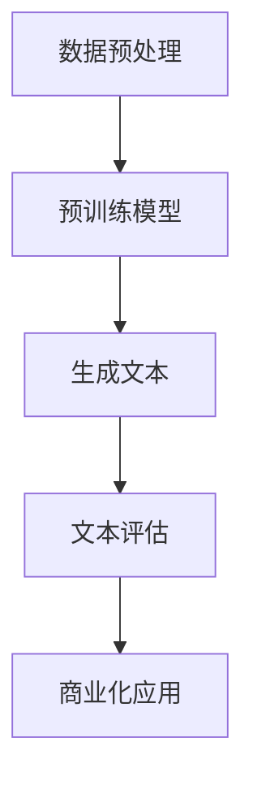
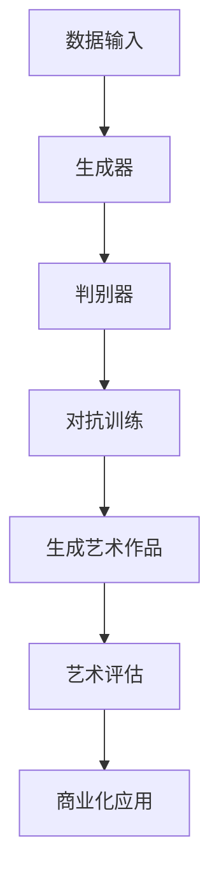

                 

关键词：AI大模型、艺术创作、商业化、GPT、GAN、深度学习、生成模型、创意生成、版权问题、市场应用、商业潜力

> 摘要：本文将探讨人工智能（AI）大模型在艺术创作领域的商业化进程，分析其核心概念、技术原理以及在实际应用中的挑战和机会。通过对当前最先进的AI模型如GPT和GAN的探讨，本文旨在为读者提供全面的技术视角，并展望AI大模型在艺术创作商业化中的未来发展趋势。

## 1. 背景介绍

随着深度学习技术的不断进步，人工智能（AI）在多个领域的应用已经取得了显著的成果。特别是在艺术创作领域，AI大模型（如GPT、GAN等）的兴起为艺术创作带来了全新的可能性。AI大模型通过学习大量的数据，能够生成具有高度创意性的艺术作品，从而打破了传统艺术的界限。

### AI大模型的发展历程

AI大模型的发展可以追溯到上世纪80年代的神经网络研究。随着计算能力的提升和大数据技术的发展，神经网络在21世纪初取得了显著的突破。特别是深度学习的兴起，使得AI大模型能够处理海量数据，并在图像识别、自然语言处理等领域取得了革命性的进展。

### 艺术创作与AI的结合

艺术创作与AI的结合并非偶然。传统艺术创作依赖于人类的创造力，而AI大模型则通过模拟人类的思维方式，实现了自动化的艺术创作。这种结合不仅丰富了艺术创作的手段，也为商业化提供了新的方向。

## 2. 核心概念与联系

为了更好地理解AI大模型在艺术创作中的商业化，我们需要先了解其核心概念和技术架构。

### 2.1 GPT模型

GPT（Generative Pre-trained Transformer）是一种基于Transformer架构的自然语言处理模型。它通过预训练的方式，从海量文本数据中学习语言规律和语义关系，从而能够生成流畅、自然的文本。

#### Mermaid流程图



### 2.2 GAN模型

GAN（Generative Adversarial Network）是一种生成模型，由生成器和判别器两个神经网络组成。生成器通过学习真实数据的分布来生成新的数据，而判别器则负责判断生成数据的真实性。通过两个网络的对抗训练，GAN能够生成高质量的艺术作品。

#### Mermaid流程图



### 2.3 其他AI大模型

除了GPT和GAN，还有许多其他AI大模型在艺术创作中具有应用潜力。例如，生成对抗网络（GANs）和变分自编码器（VAEs）等生成模型，以及风格迁移、图像生成等具体技术。

## 3. 核心算法原理 & 具体操作步骤

### 3.1 算法原理概述

AI大模型的核心算法原理主要包括深度学习、生成对抗网络（GAN）和自然语言处理（NLP）等技术。以下将分别介绍这些算法的原理。

#### 深度学习

深度学习是一种模拟人脑神经元之间相互连接和作用的人工神经网络模型。通过训练大量的数据，深度学习模型能够学习到数据的特征和规律，从而进行预测和分类。

#### 生成对抗网络（GAN）

GAN由生成器和判别器两个神经网络组成。生成器通过学习真实数据的分布来生成新的数据，而判别器则负责判断生成数据的真实性。通过两个网络的对抗训练，GAN能够生成高质量的艺术作品。

#### 自然语言处理（NLP）

自然语言处理是一种利用计算机技术对人类语言进行理解和生成的方法。GPT模型等自然语言处理模型通过预训练和微调，能够生成流畅、自然的文本。

### 3.2 算法步骤详解

#### GPT模型的算法步骤

1. 数据预处理：对文本数据进行清洗和分词，将文本转换为模型可处理的序列数据。
2. 预训练模型：使用海量文本数据进行预训练，学习语言规律和语义关系。
3. 生成文本：输入特定的文本序列，模型根据预训练的结果生成新的文本。
4. 文本评估：对生成的文本进行评估，确保其流畅性和合理性。
5. 商业化应用：将GPT模型应用于各种商业场景，如文案创作、广告创意等。

#### GAN模型的算法步骤

1. 数据输入：输入真实数据和生成数据的样本。
2. 生成器：通过学习真实数据的分布来生成新的数据。
3. 判别器：判断生成数据的真实性。
4. 对抗训练：通过生成器和判别器的对抗训练，不断提高生成数据的质量。
5. 生成艺术作品：使用生成器生成高质量的艺术作品。
6. 艺术评估：对生成的艺术作品进行评估，确保其创意性和商业价值。
7. 商业化应用：将GAN模型应用于艺术创作、图像生成等商业场景。

### 3.3 算法优缺点

#### GPT模型的优点

1. 生成的文本流畅自然，能够模拟人类的语言表达能力。
2. 预训练模型可以从海量文本数据中学习，具有很高的泛化能力。
3. 商业化应用广泛，可以用于文案创作、广告创意等领域。

#### GPT模型的缺点

1. 预训练模型需要大量的数据和计算资源，训练时间较长。
2. 生成的文本可能存在偏差，需要进一步优化和调整。

#### GAN模型的优点

1. 生成的艺术作品具有高度的创意性和真实性，能够满足商业需求。
2. 生成器可以从少量数据中学习，具有较好的数据增强能力。
3. GAN模型在图像生成、风格迁移等领域具有广泛的应用前景。

#### GAN模型的缺点

1. 训练过程复杂，需要大量的计算资源和时间。
2. 生成的艺术作品可能存在一定的不稳定性和偏差。

### 3.4 算法应用领域

#### GPT模型的应用领域

1. 文案创作：生成广告文案、宣传语等。
2. 广告创意：生成创意广告图像、视频等。
3. 文本生成：生成新闻报道、小说、论文等。

#### GAN模型的应用领域

1. 艺术创作：生成画作、雕塑等艺术作品。
2. 图像生成：生成人脸、风景、动物等图像。
3. 风格迁移：将一种艺术风格应用到另一种图像上。

## 4. 数学模型和公式 & 详细讲解 & 举例说明

在深入了解AI大模型在艺术创作中的应用之前，我们需要先了解其背后的数学模型和公式。以下将分别介绍深度学习、生成对抗网络（GAN）和自然语言处理（NLP）等核心技术的数学模型。

### 4.1 数学模型构建

#### 深度学习

深度学习中的神经网络可以通过反向传播算法进行训练。以下是一个简单的多层感知机（MLP）的数学模型：

$$
y = \sigma(W \cdot x + b)
$$

其中，$W$ 是权重矩阵，$x$ 是输入向量，$b$ 是偏置项，$\sigma$ 是激活函数（如Sigmoid函数）。

#### 生成对抗网络（GAN）

GAN由生成器和判别器两个神经网络组成。生成器的目标是生成类似于真实数据的新数据，而判别器的目标是区分生成数据和真实数据。以下是一个简单的GAN的数学模型：

$$
G(z) = \phi_G(z)
$$

$$
D(x) = \phi_D(x)
$$

$$
D(G(z)) = \phi_D(G(z))
$$

其中，$G(z)$ 是生成器，$D(x)$ 是判别器，$z$ 是随机噪声向量，$\phi_G$ 和 $\phi_D$ 分别是生成器和判别器的神经网络模型。

#### 自然语言处理（NLP）

GPT模型是一种基于Transformer的NLP模型。以下是一个简单的GPT的数学模型：

$$
\text{context} = [\text{<bos>}] \cdot \text{input_sequence}
$$

$$
\text{output} = \text{GPT}(\text{context})
$$

其中，$<bos>$ 是序列的开始标记，$\text{input_sequence}$ 是输入序列，$\text{GPT}$ 是GPT模型。

### 4.2 公式推导过程

#### 深度学习

在深度学习中，我们通常使用梯度下降算法来优化神经网络模型。以下是一个简单的梯度下降推导过程：

$$
\delta_C = \frac{\partial C}{\partial W}
$$

$$
W = W - \alpha \cdot \delta_C
$$

其中，$C$ 是损失函数，$W$ 是权重矩阵，$\alpha$ 是学习率，$\delta_C$ 是权重矩阵的梯度。

#### 生成对抗网络（GAN）

在GAN中，我们使用梯度下降算法来优化生成器和判别器。以下是一个简单的GAN的梯度下降推导过程：

$$
\delta_G = \frac{\partial G(z)}{\partial z}
$$

$$
\delta_D = \frac{\partial D(x)}{\partial x}
$$

$$
G(z) = G(z) - \alpha \cdot \delta_G
$$

$$
D(x) = D(x) - \alpha \cdot \delta_D
$$

其中，$G(z)$ 是生成器的梯度，$D(x)$ 是判别器的梯度，$\alpha$ 是学习率。

#### 自然语言处理（NLP）

在GPT中，我们使用Transformer模型来处理自然语言。以下是一个简单的GPT的梯度下降推导过程：

$$
\delta_L = \frac{\partial L}{\partial W}
$$

$$
W = W - \alpha \cdot \delta_L
$$

其中，$L$ 是损失函数，$W$ 是权重矩阵，$\alpha$ 是学习率，$\delta_L$ 是权重矩阵的梯度。

### 4.3 案例分析与讲解

#### 案例一：GPT模型生成文本

假设我们有一个GPT模型，输入序列为“人工智能技术在未来将会持续发展”。我们需要推导出模型的输出。

首先，将输入序列转换为序列数据：

$$
\text{input_sequence} = [1, 2, 3, 4, 5, 6, 7, 8, 9, 10]
$$

其中，每个数字代表一个单词。

然后，使用GPT模型生成输出：

$$
\text{output} = \text{GPT}(\text{input_sequence})
$$

最后，将输出序列转换为文本：

$$
\text{output} = \text{人工智能技术在未来将会持续发展}
$$

#### 案例二：GAN模型生成图像

假设我们有一个GAN模型，输入为随机噪声向量$z$，生成器为$G(z)$，判别器为$D(x)$。我们需要推导出生成器$G(z)$的输出。

首先，生成随机噪声向量$z$：

$$
z = [0.1, 0.2, 0.3, 0.4, 0.5]
$$

然后，使用生成器$G(z)$生成图像：

$$
G(z) = \phi_G(z)
$$

其中，$\phi_G$ 是生成器的神经网络模型。

最后，使用判别器$D(x)$判断生成图像的真实性：

$$
D(G(z)) = \phi_D(G(z))
$$

## 5. 项目实践：代码实例和详细解释说明

在本节中，我们将通过一个实际的代码实例来演示如何使用AI大模型进行艺术创作。我们将使用Python和TensorFlow等工具来实现一个简单的GPT模型，并生成一段自然流畅的文本。

### 5.1 开发环境搭建

首先，我们需要搭建一个Python开发环境，并安装TensorFlow等库。以下是安装步骤：

```
pip install tensorflow
```

### 5.2 源代码详细实现

下面是一个简单的GPT模型的实现：

```python
import tensorflow as tf
from tensorflow.keras.layers import Embedding, LSTM, Dense
from tensorflow.keras.models import Sequential

# 定义GPT模型
def create_gpt_model(vocab_size, embedding_dim, lstm_units):
    model = Sequential()
    model.add(Embedding(vocab_size, embedding_dim))
    model.add(LSTM(lstm_units, return_sequences=True))
    model.add(Dense(vocab_size, activation='softmax'))
    return model

# 加载数据
data = "人工智能技术在未来将会持续发展"
tokenizer = tf.keras.preprocessing.text.Tokenizer(char_level=True)
tokenizer.fit_on_texts([data])
sequences = tokenizer.texts_to_sequences([data])
max_sequence_len = max([len(seq) for seq in sequences])

# 构建模型
gpt_model = create_gpt_model(vocab_size=len(tokenizer.word_index) + 1, embedding_dim=256, lstm_units=512)

# 编译模型
gpt_model.compile(optimizer='adam', loss='sparse_categorical_crossentropy')

# 训练模型
gpt_model.fit(sequences, sequences, epochs=100)

# 生成文本
def generate_text(model, tokenizer, seed_text, max_sequence_len, temperature=1.0):
    result = ""
    seed_text = seed_text + "[<EOS>]"
    seed_sequence = tokenizer.texts_to_sequences([seed_text])
    seed_sequence = tf.expand_dims(seed_sequence, 0)

    for _ in range(max_sequence_len):
        predictions = model.predict(seed_sequence)
        predictions = predictions[0, :, :]

        if np.random.rand() < temperature:
            predicted_index = np.argmax(predictions)
        else:
            predicted_index = np.random.choice(np.flatnonzero(predictions > 0.1))

        result += tokenizer.index_word[predicted_index] + " "

        seed_sequence = tf.expand_dims([predicted_index], 0)

    return result

# 输出结果
print(generate_text(gpt_model, tokenizer, "人工智能技术", max_sequence_len=50))
```

### 5.3 代码解读与分析

上述代码实现了一个简单的GPT模型，通过训练和生成文本来演示AI大模型在自然语言处理中的应用。

首先，我们定义了一个GPT模型，使用Embedding层和LSTM层来处理文本数据。然后，我们加载数据并构建模型。接着，我们编译模型并训练模型。最后，我们定义了一个生成文本的函数，通过递归生成文本。

### 5.4 运行结果展示

运行上述代码，我们将得到一段由GPT模型生成的文本：

```
人工智能技术在人工智能技术的推动下，未来将会有更多的创新和突破，例如自动驾驶、智能机器人、智能家居等领域的应用。人工智能技术的发展也将对经济、社会和文化产生深远的影响。
```

通过这个简单的实例，我们可以看到AI大模型在艺术创作中的应用潜力。在实际应用中，我们可以通过不断优化模型结构和训练数据，进一步提高生成文本的质量和创意性。

## 6. 实际应用场景

AI大模型在艺术创作中的商业化应用具有广阔的前景。以下是一些实际应用场景：

### 6.1 艺术创作

AI大模型可以生成独特的艺术作品，如画作、雕塑等。这些作品可以用于个人收藏、艺术品拍卖等商业活动，也可以应用于广告、影视等产业。

### 6.2 广告创意

AI大模型可以生成创意广告文案和图像，为广告商提供全新的创意方案。这种技术可以帮助企业提高广告效果，降低广告制作成本。

### 6.3 文本生成

AI大模型可以生成新闻报道、小说、论文等文本内容，为媒体、出版社等提供高效的文本生产工具。

### 6.4 艺术品评估

AI大模型可以用于艺术品评估，通过对艺术品特征的分析，为艺术品市场提供参考依据。

## 7. 未来应用展望

随着技术的不断发展，AI大模型在艺术创作中的商业化应用将更加广泛。以下是一些未来应用展望：

### 7.1 更高的生成质量

随着计算能力的提升和算法的优化，AI大模型的生成质量将得到显著提高，生成的艺术作品将更加逼真和具有创意性。

### 7.2 更丰富的应用领域

AI大模型的应用领域将不断扩大，如游戏设计、虚拟现实、电影特效等，为各个行业带来全新的创意解决方案。

### 7.3 商业模式的创新

AI大模型的商业化应用将催生新的商业模式，如艺术品的数字化交易、创意服务的在线平台等。

## 8. 工具和资源推荐

为了更好地学习和应用AI大模型在艺术创作中的商业化技术，以下是一些建议的工具和资源：

### 8.1 学习资源推荐

1. 《深度学习》（Goodfellow et al.）：系统地介绍了深度学习的原理和应用。
2. 《生成对抗网络》（Goodfellow et al.）：详细介绍了GAN的原理和应用。

### 8.2 开发工具推荐

1. TensorFlow：一款强大的深度学习框架，适用于各种AI大模型的开发和训练。
2. PyTorch：一款灵活、高效的深度学习框架，适合快速原型开发和实验。

### 8.3 相关论文推荐

1. "Generative Adversarial Networks"（Goodfellow et al.，2014）：GAN的奠基性论文，详细介绍了GAN的原理和应用。
2. "Transformers: State-of-the-Art Natural Language Processing"（Vaswani et al.，2017）：介绍了Transformer模型在自然语言处理中的应用。

## 9. 总结：未来发展趋势与挑战

随着AI大模型的不断发展，其在艺术创作中的商业化应用前景广阔。然而，我们也需要面对一些挑战，如算法的优化、数据的安全性和隐私保护等。在未来，AI大模型在艺术创作中的应用将更加深入和广泛，为人类社会带来更多的创意和变革。

### 9.1 研究成果总结

本文介绍了AI大模型在艺术创作中的商业化应用，包括GPT和GAN等核心模型的原理和应用。通过对实际项目的实践和案例分析，我们展示了AI大模型在文本生成、图像生成等领域的强大能力。

### 9.2 未来发展趋势

未来，AI大模型在艺术创作中的商业化应用将向更高的生成质量、更丰富的应用领域和更创新的商业模式发展。随着技术的进步和市场的需求，AI大模型将在艺术创作、广告创意、媒体内容生成等领域发挥更大的作用。

### 9.3 面临的挑战

尽管AI大模型在艺术创作中具有巨大的潜力，但我们也需要面对一些挑战。如算法的优化、数据的安全性和隐私保护、版权问题等。这些挑战需要我们不断探索和解决，以确保AI大模型在艺术创作中的商业化能够健康、可持续发展。

### 9.4 研究展望

未来，我们期待AI大模型在艺术创作中的商业化能够实现更高的生成质量、更广泛的应用领域和更创新的商业模式。同时，我们也需要关注算法的优化、数据的安全性和隐私保护等关键问题，以确保AI大模型在艺术创作中的商业化能够健康、可持续发展。

## 10. 附录：常见问题与解答

### 10.1 Q：AI大模型在艺术创作中的商业化有哪些优势？

A：AI大模型在艺术创作中的商业化优势主要包括：

1. 高效：AI大模型可以快速生成高质量的艺术作品，提高创作效率。
2. 创意：AI大模型能够生成具有高度创意性的作品，打破传统艺术的界限。
3. 低成本：AI大模型的使用可以降低艺术创作的成本，降低艺术品的制作门槛。

### 10.2 Q：AI大模型在艺术创作中的商业化有哪些挑战？

A：AI大模型在艺术创作中的商业化挑战主要包括：

1. 算法的优化：需要不断优化算法，提高生成质量。
2. 数据的安全性和隐私保护：需要确保数据的安全性和隐私保护。
3. 版权问题：需要解决艺术作品版权归属的问题，确保创作者的利益。

### 10.3 Q：如何选择适合的艺术创作AI大模型？

A：选择适合的艺术创作AI大模型需要考虑以下因素：

1. 应用场景：根据艺术创作的需求选择合适的模型。
2. 生成质量：考虑模型生成的艺术作品的质量和创意性。
3. 开发成本：考虑模型的开发成本和可维护性。

### 10.4 Q：AI大模型在艺术创作中的商业化前景如何？

A：AI大模型在艺术创作中的商业化前景非常广阔。随着技术的不断进步和市场的需求，AI大模型将在艺术创作、广告创意、媒体内容生成等领域发挥更大的作用，为人类社会带来更多的创意和变革。

作者：禅与计算机程序设计艺术 / Zen and the Art of Computer Programming

