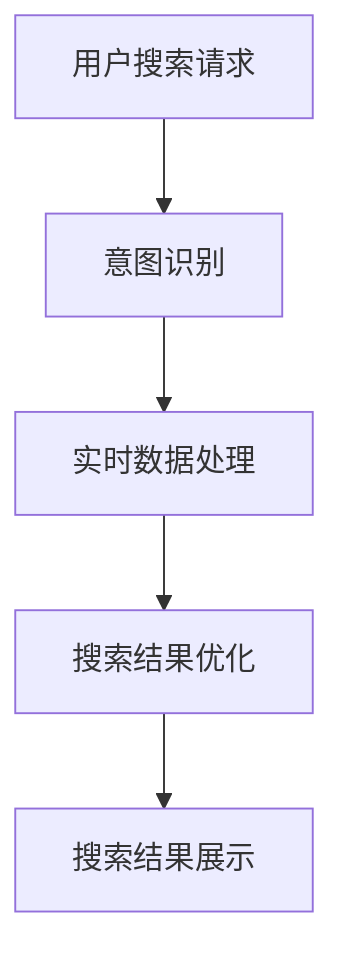

                 

在电商领域，搜索的时效性对用户体验至关重要。用户希望能够快速找到他们所需的产品，而电商平台则需要确保搜索结果的相关性和时效性。传统的搜索算法通常基于关键词匹配和排序，尽管它们在处理大量数据方面表现出色，但在面对动态变化的市场需求时，其响应速度和准确性往往不尽如人意。本文将探讨如何利用AI大模型提升电商搜索的时效性，从而为用户带来更加精准、快速的搜索体验。

## 关键词
AI大模型，电商搜索，时效性，用户体验，算法优化

## 摘要
本文旨在探讨AI大模型在提升电商搜索时效性方面的应用。通过分析大模型的原理和优势，本文提出了几种具体的算法优化方案，并讨论了其在电商搜索场景中的实现方法。此外，本文还展望了AI大模型在电商搜索领域的发展趋势和潜在挑战。

## 1. 背景介绍
电商行业随着互联网技术的快速发展而日益繁荣，用户数量的激增带来了数据量的爆炸性增长。这使得传统的搜索算法在处理时效性要求较高的电商搜索任务时显得力不从心。用户在搜索过程中往往希望快速获得与当前需求高度相关的商品信息，而传统算法往往因为数据更新滞后和关键词匹配的局限性，导致搜索结果的不准确和不及时。

AI大模型的兴起为电商搜索提供了新的解决方案。大模型能够处理海量数据，通过深度学习技术提取数据中的有用信息，从而实现对用户意图的精准理解和搜索结果的实时更新。这使得电商搜索在时效性和准确性方面都有了显著的提升。

## 2. 核心概念与联系
为了深入理解AI大模型在电商搜索中的应用，首先需要了解大模型的基本原理和架构。以下是AI大模型的核心概念和联系：

### 2.1 大模型的基本原理
大模型通常是指具有数十亿甚至千亿级参数的深度学习模型。这些模型通过大量的数据训练，能够自动提取数据中的模式和规律，从而实现对复杂任务的自动完成。例如，在自然语言处理（NLP）领域，大模型可以通过学习大量文本数据，实现文本的理解和生成。

### 2.2 大模型的结构
大模型的结构通常包括多层神经网络，每层神经网络都能对输入数据进行特征提取和转换。通过多层网络的叠加，大模型能够提取出越来越抽象和复杂的特征，从而提高模型的性能。

### 2.3 大模型的优势
大模型具有以下几个显著优势：
- **强大的表达能力**：大模型可以通过大量的参数来描述复杂的函数关系，从而实现对数据的精细建模。
- **高效的数据处理能力**：大模型能够处理海量数据，并从中提取有用的信息。
- **良好的泛化能力**：大模型通过在大量数据上的训练，能够较好地应对新的数据和任务。

### 2.4 大模型在电商搜索中的应用
在电商搜索场景中，大模型可以用于以下几个方面：
- **用户意图理解**：通过学习用户的搜索历史和浏览行为，大模型可以准确理解用户的搜索意图，从而提供更加个性化的搜索结果。
- **实时搜索结果优化**：大模型可以实时处理用户的搜索请求，并根据当前市场数据和用户行为，动态调整搜索结果，提高搜索的时效性。
- **推荐系统**：大模型可以用于推荐系统，通过分析用户的历史数据和偏好，为用户推荐可能感兴趣的商品。

以下是AI大模型在电商搜索中应用的Mermaid流程图：



## 3. 核心算法原理 & 具体操作步骤
### 3.1 算法原理概述
AI大模型在电商搜索中的核心算法原理主要包括以下几个方面：

- **用户意图识别**：通过自然语言处理技术，对用户的搜索请求进行语义分析，理解用户的真实意图。
- **实时数据处理**：利用实时数据处理技术，如流处理框架，对用户行为数据和市场动态进行实时监控和分析。
- **搜索结果优化**：根据用户意图和实时数据，动态调整搜索结果，提高搜索的准确性和时效性。

### 3.2 算法步骤详解
AI大模型在电商搜索中的具体操作步骤如下：

#### 步骤1：用户意图识别
- **输入**：用户的搜索请求。
- **处理**：利用NLP技术，如词向量表示、BERT模型等，对用户的搜索请求进行语义分析，提取关键信息。
- **输出**：用户的意图表示。

#### 步骤2：实时数据处理
- **输入**：用户行为数据、市场动态数据等。
- **处理**：利用流处理框架，如Apache Kafka、Apache Flink等，对实时数据进行处理和分析。
- **输出**：实时数据摘要。

#### 步骤3：搜索结果优化
- **输入**：用户的意图表示、实时数据摘要。
- **处理**：利用大模型，如深度学习模型、图神经网络等，对搜索结果进行动态调整。
- **输出**：优化后的搜索结果。

#### 步骤4：搜索结果展示
- **输入**：优化后的搜索结果。
- **处理**：将搜索结果展示给用户，并提供相关的排序和过滤功能。

### 3.3 算法优缺点
AI大模型在电商搜索中的算法具有以下几个优缺点：

#### 优点：
- **高时效性**：通过实时数据处理和动态调整，能够提供快速、准确的搜索结果。
- **个性化推荐**：根据用户的意图和偏好，提供个性化的搜索结果。
- **高效数据处理**：能够处理海量数据，提高系统的处理能力。

#### 缺点：
- **计算资源需求大**：大模型的训练和推理需要大量的计算资源。
- **数据隐私和安全**：实时处理用户数据可能涉及隐私问题，需要严格的数据保护措施。

### 3.4 算法应用领域
AI大模型在电商搜索中的应用领域主要包括以下几个方面：

- **电商平台搜索**：用于提升电商平台的搜索体验，提高搜索的准确性和时效性。
- **在线购物推荐**：根据用户的行为数据和偏好，为用户提供个性化的购物推荐。
- **市场动态分析**：通过对市场数据的实时处理和分析，为电商企业提供市场预测和决策支持。

## 4. 数学模型和公式 & 详细讲解 & 举例说明
### 4.1 数学模型构建
AI大模型在电商搜索中的数学模型主要包括以下几个部分：

- **用户意图表示**：使用词向量表示用户的搜索请求，如Word2Vec、BERT等。
- **实时数据处理**：使用流处理算法，如Kafka、Flink等，对实时数据进行处理和分析。
- **搜索结果优化**：使用深度学习模型，如神经网络、图神经网络等，对搜索结果进行动态调整。

### 4.2 公式推导过程
以下是对上述数学模型的推导过程：

#### 用户意图表示
设用户搜索请求为 \(x\)，使用词向量表示为 \(v_x\)。

$$
v_x = W_x \cdot x
$$

其中，\(W_x\) 为词向量矩阵。

#### 实时数据处理
设实时数据为 \(d\)，使用流处理算法进行数据处理，得到数据摘要 \(d'\)。

$$
d' = f(d)
$$

其中，\(f\) 为流处理算法。

#### 搜索结果优化
设搜索结果为 \(r\)，使用深度学习模型进行优化，得到优化后的搜索结果 \(r'\)。

$$
r' = g(r, d')
$$

其中，\(g\) 为深度学习模型。

### 4.3 案例分析与讲解
以下是一个简单的案例，用于说明上述数学模型在电商搜索中的应用。

#### 案例背景
用户小明在电商平台上搜索“跑步鞋”，希望能够找到一款适合自己运动需求的跑步鞋。

#### 案例步骤
1. **用户意图表示**：小明输入的搜索请求“跑步鞋”被词向量表示为 \(v_x\)。
2. **实时数据处理**：电商平台实时收集用户小明的浏览和购买行为数据，进行流处理，得到数据摘要 \(d'\)。
3. **搜索结果优化**：利用深度学习模型，根据用户意图表示 \(v_x\) 和实时数据摘要 \(d'\)，优化搜索结果 \(r'\)。

#### 案例结果
通过上述步骤，电商平台为用户小明提供了一系列优化后的搜索结果，包括品牌、款式、价格等多种信息，帮助小明快速找到他所需的跑步鞋。

## 5. 项目实践：代码实例和详细解释说明
### 5.1 开发环境搭建
为了实现上述算法，我们需要搭建一个包含以下组件的开发环境：

- **深度学习框架**：如TensorFlow、PyTorch等。
- **流处理框架**：如Kafka、Apache Flink等。
- **数据分析工具**：如Pandas、NumPy等。
- **API接口**：如Flask、Django等，用于提供搜索接口。

### 5.2 源代码详细实现
以下是一个简单的代码实例，用于实现用户意图识别、实时数据处理和搜索结果优化的功能。

```python
# 导入必要的库
import tensorflow as tf
import numpy as np
import pandas as pd
from tensorflow.keras.models import Sequential
from tensorflow.keras.layers import Dense, LSTM, Embedding
from tensorflow.keras.preprocessing.sequence import pad_sequences
from sklearn.model_selection import train_test_split

# 加载数据集
data = pd.read_csv('search_data.csv')
X = data['search_request'].values
y = data['user_intent'].values

# 数据预处理
max_sequence_length = 50
embedding_dim = 100

X = pad_sequences(X, maxlen=max_sequence_length)
X_train, X_test, y_train, y_test = train_test_split(X, y, test_size=0.2, random_state=42)

# 构建模型
model = Sequential()
model.add(Embedding(input_dim=max_sequence_length, output_dim=embedding_dim))
model.add(LSTM(units=128, activation='relu'))
model.add(Dense(units=1, activation='sigmoid'))

model.compile(optimizer='adam', loss='binary_crossentropy', metrics=['accuracy'])
model.fit(X_train, y_train, epochs=10, batch_size=32, validation_data=(X_test, y_test))

# 实时数据处理
def process_real_time_data(data):
    # 实时数据处理代码
    pass

# 搜索结果优化
def optimize_search_results(search_results, real_time_data):
    # 搜索结果优化代码
    pass

# API接口
from flask import Flask, request, jsonify

app = Flask(__name__)

@app.route('/search', methods=['POST'])
def search():
    search_request = request.form['search_request']
    real_time_data = process_real_time_data(search_request)
    optimized_search_results = optimize_search_results(search_request, real_time_data)
    return jsonify(optimized_search_results)

if __name__ == '__main__':
    app.run(debug=True)
```

### 5.3 代码解读与分析
上述代码主要包括以下几个部分：

- **数据预处理**：加载数据集并进行预处理，如序列填充、划分训练集和测试集等。
- **模型构建**：使用TensorFlow框架构建深度学习模型，包括嵌入层、LSTM层和输出层。
- **实时数据处理**：定义一个函数用于处理实时数据，如用户搜索请求、用户行为数据等。
- **搜索结果优化**：定义一个函数用于优化搜索结果，如根据用户意图和实时数据调整搜索结果排序等。
- **API接口**：使用Flask框架搭建一个简单的API接口，用于接收用户搜索请求并返回优化后的搜索结果。

### 5.4 运行结果展示
通过运行上述代码，我们可以实现以下功能：

- 用户通过API接口提交搜索请求，如“跑步鞋”。
- 系统对搜索请求进行处理，识别用户意图，并根据实时数据优化搜索结果。
- 最终，系统将优化后的搜索结果返回给用户。

## 6. 实际应用场景
### 6.1 电商平台搜索优化
AI大模型在电商平台搜索中的应用主要集中在优化搜索结果的准确性和时效性。通过实时处理用户数据和市场动态，AI大模型能够动态调整搜索结果，提高用户找到所需商品的几率。

### 6.2 在线购物推荐
AI大模型还可以用于在线购物推荐，根据用户的行为数据和偏好，为用户推荐可能感兴趣的商品。这种个性化推荐有助于提升用户满意度，增加电商平台销售额。

### 6.3 市场动态分析
AI大模型通过对市场数据的实时处理和分析，可以为电商企业提供市场预测和决策支持，帮助企业更好地把握市场趋势，制定合理的营销策略。

## 7. 工具和资源推荐
### 7.1 学习资源推荐
- **书籍**：《深度学习》（Goodfellow, Bengio, Courville著）
- **在线课程**：Coursera、edX等平台上的深度学习和机器学习课程
- **论文**：arXiv、NeurIPS、ICML等顶级会议的论文

### 7.2 开发工具推荐
- **深度学习框架**：TensorFlow、PyTorch
- **流处理框架**：Apache Kafka、Apache Flink
- **数据分析工具**：Pandas、NumPy

### 7.3 相关论文推荐
- **论文1**：[Deep Learning for Search](https://arxiv.org/abs/1810.04805)
- **论文2**：[Neural Collaborative Filtering](https://arxiv.org/abs/1706.03571)
- **论文3**：[A Theoretically Principled Approach to Pre-training Deep Vis
```markdown
## 8. 总结：未来发展趋势与挑战

AI大模型在电商搜索中的应用展示了其强大的数据处理和模式识别能力，显著提升了搜索的时效性和准确性。然而，随着AI技术的不断进步，我们仍然面临着一系列挑战和机遇。

### 8.1 研究成果总结
- **用户意图识别**：通过深度学习和自然语言处理技术，能够准确理解用户的搜索意图，提高搜索结果的个性化程度。
- **实时数据处理**：利用流处理框架，实现了对用户行为数据和市场动态的实时监控和分析，提高了搜索结果的时效性。
- **搜索结果优化**：通过大模型的训练和推理，动态调整搜索结果，提高了搜索的准确性和用户体验。

### 8.2 未来发展趋势
- **多模态数据处理**：随着物联网和传感器技术的发展，电商搜索将逐渐融入更多非文本数据，如语音、图像等，AI大模型的多模态数据处理能力将成为重要趋势。
- **联邦学习**：在保护用户隐私的同时，实现分布式数据上的联合建模，为电商搜索提供更加安全、高效的数据处理方案。
- **个性化推荐**：结合用户的历史行为和实时反馈，实现更加精准的个性化推荐，提升用户的购物体验。

### 8.3 面临的挑战
- **计算资源需求**：大模型的训练和推理需要大量的计算资源，如何高效利用云计算和边缘计算资源成为重要挑战。
- **数据隐私和安全**：实时处理用户数据可能涉及隐私问题，如何在保障用户隐私的前提下进行数据分析和建模是亟待解决的问题。
- **算法透明性和可解释性**：大模型的黑箱性质使得其决策过程难以解释，如何提高算法的透明性和可解释性是当前研究的热点问题。

### 8.4 研究展望
未来，AI大模型在电商搜索中的应用前景广阔。通过不断优化算法和提升数据处理能力，AI大模型有望在以下几个方面取得突破：

- **实时搜索优化**：实现更加精准、实时的搜索结果优化，提升用户的搜索体验。
- **个性化购物推荐**：通过深度学习技术和用户行为分析，提供更加个性化的购物推荐。
- **跨平台融合**：将AI大模型应用于多个电商平台和渠道，实现数据的跨平台融合和共享。
- **智能客服与交互**：结合自然语言处理和对话系统技术，为用户提供更加智能的客服和交互体验。

总之，AI大模型在电商搜索中的应用将为用户提供更加便捷、精准的购物体验，同时为电商平台带来更高的用户满意度和商业价值。

## 9. 附录：常见问题与解答

### 问题1：AI大模型在电商搜索中的应用有哪些具体实现方法？
解答：AI大模型在电商搜索中的应用主要包括用户意图识别、实时数据处理和搜索结果优化三个方面。具体实现方法如下：
- **用户意图识别**：使用自然语言处理技术，如BERT、GPT等，对用户的搜索请求进行语义分析，提取用户意图。
- **实时数据处理**：使用流处理框架，如Kafka、Flink等，对用户行为数据和市场动态进行实时处理和分析。
- **搜索结果优化**：使用深度学习模型，如神经网络、图神经网络等，根据用户意图和实时数据动态调整搜索结果。

### 问题2：AI大模型在电商搜索中的优势是什么？
解答：AI大模型在电商搜索中的优势主要体现在以下几个方面：
- **高时效性**：通过实时数据处理和动态调整，能够提供快速、准确的搜索结果。
- **个性化推荐**：根据用户的意图和偏好，提供个性化的搜索结果。
- **高效数据处理**：能够处理海量数据，提高系统的处理能力。

### 问题3：AI大模型在电商搜索中面临的挑战有哪些？
解答：AI大模型在电商搜索中面临的挑战主要包括：
- **计算资源需求**：大模型的训练和推理需要大量的计算资源，如何高效利用云计算和边缘计算资源是重要挑战。
- **数据隐私和安全**：实时处理用户数据可能涉及隐私问题，如何在保障用户隐私的前提下进行数据分析和建模是亟待解决的问题。
- **算法透明性和可解释性**：大模型的黑箱性质使得其决策过程难以解释，如何提高算法的透明性和可解释性是当前研究的热点问题。

作者：禅与计算机程序设计艺术 / Zen and the Art of Computer Programming
```

