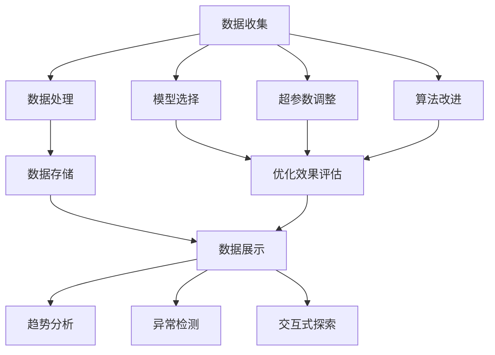

                 

关键词：AI大模型、可观测性、应用策略、监控系统、数据可视化、算法优化、数学模型

## 摘要

随着人工智能技术的飞速发展，大模型的应用日益广泛。然而，这些复杂模型在实际应用中往往难以进行有效的监控和调试，导致性能和安全性问题。本文旨在探讨提升AI大模型应用可观测性的策略，通过介绍核心概念、算法原理、数学模型以及项目实践，为开发者提供一套系统性的方法和工具，以提高大模型的可操作性和可维护性。

## 1. 背景介绍

近年来，深度学习和神经网络在大数据处理、计算机视觉、自然语言处理等领域取得了显著的成果。这些复杂模型通常由数百万甚至数十亿个参数组成，能够实现高度自动化和智能化的任务。然而，这些模型的复杂性也带来了监控和调试的挑战。传统的调试方法难以应用于大模型，导致在实际应用中容易出现性能下降、训练不稳定和错误预测等问题。

可观测性是系统设计和评估中的重要指标，它指的是系统状态和行为能够被外部工具或用户理解和监控的能力。对于AI大模型而言，提升可观测性意味着能够实时监控模型的训练过程、参数状态和输出结果，以便快速发现和解决问题。

本文将围绕AI大模型应用的可观测性提升策略，从核心概念、算法原理、数学模型和项目实践等方面进行探讨，旨在为开发者提供一套实用的方法和工具。

### 1.1 AI大模型的发展现状

AI大模型的发展可以追溯到2012年，当时AlexNet在ImageNet图像识别比赛中取得了突破性的成绩，这标志着深度学习技术进入了新的阶段。此后，随着计算能力的提升和数据量的爆炸式增长，AI大模型得到了迅猛发展。以GPT、BERT、ViT等为代表的大型神经网络模型在自然语言处理、计算机视觉等领域取得了显著的成果，极大地推动了人工智能的应用。

然而，这些大模型也带来了诸多挑战。首先，模型参数数量庞大，使得训练过程变得非常复杂和耗时。其次，模型内部的非线性结构和高度并行计算使得传统的调试方法难以应用。此外，大模型在训练过程中容易陷入过拟合和欠拟合等问题，需要更为精细的监控和调整。

### 1.2 可观测性在AI大模型应用中的重要性

可观测性是AI大模型应用中不可或缺的一环。通过提升可观测性，开发者可以：

1. **实时监控模型训练过程**：了解模型在训练过程中的状态变化，及时发现异常并进行调整。
2. **优化模型性能**：通过分析模型参数的变化趋势，调整超参数和模型结构，提高模型的泛化能力和准确率。
3. **提高模型安全性**：监控模型输入输出，及时发现潜在的安全威胁和异常行为。
4. **简化模型调试**：借助可观测性工具，开发者可以更轻松地定位和修复模型中的错误。

### 1.3 AI大模型监控与可观测性的挑战

尽管可观测性对于AI大模型的应用至关重要，但在实际应用中仍然面临诸多挑战：

1. **数据量庞大**：大模型通常需要处理海量数据，这些数据需要被高效地存储、传输和计算。
2. **计算复杂度高**：大模型的训练和推理过程涉及大量的计算资源，实时监控需要高效的处理能力。
3. **可扩展性差**：现有监控工具和方法往往难以应对大模型的高并发、高负载场景。
4. **缺乏统一的规范**：当前AI大模型的监控和可观测性缺乏统一的规范和标准，不同工具和方法之间存在兼容性问题。

### 1.4 本文的结构和内容安排

本文将从以下几个部分展开：

1. **核心概念与联系**：介绍与AI大模型可观测性相关的核心概念和架构，包括监控系统、数据可视化、算法优化等。
2. **核心算法原理 & 具体操作步骤**：详细阐述提升AI大模型可观测性的核心算法原理和具体操作步骤，包括算法原理概述、步骤详解、优缺点分析以及应用领域。
3. **数学模型和公式**：构建和推导与AI大模型可观测性相关的数学模型和公式，并进行详细讲解和案例分析。
4. **项目实践**：通过实际项目实践，展示提升AI大模型可观测性的具体应用，包括开发环境搭建、源代码实现、代码解读和运行结果展示。
5. **实际应用场景**：探讨AI大模型可观测性在各个应用场景中的具体应用，包括未来应用展望。
6. **工具和资源推荐**：推荐学习资源、开发工具和相关论文，帮助读者深入了解AI大模型可观测性。
7. **总结**：总结研究成果，探讨未来发展趋势和面临的挑战，提出研究展望。

通过以上结构和内容的安排，本文旨在为开发者提供一套全面、系统的AI大模型可观测性提升策略，助力人工智能应用的深入发展。

### 2. 核心概念与联系

在探讨提升AI大模型应用可观测性的策略之前，我们需要了解与这一主题相关的核心概念和它们之间的联系。本节将详细介绍监控系统、数据可视化、算法优化等相关概念，并通过Mermaid流程图展示它们在AI大模型中的应用架构。

#### 2.1 监控系统

监控系统是AI大模型应用中至关重要的一环，它负责实时收集、处理和展示模型的运行状态和性能指标。一个完善的监控系统通常包括以下几个方面：

1. **数据收集**：监控系统需要从模型训练和推理过程中实时收集各种数据，包括训练误差、损失函数值、参数更新信息、计算时间等。
2. **数据处理**：收集到的数据需要经过处理，以确保其准确性和一致性。这通常包括数据清洗、去噪、归一化等操作。
3. **数据存储**：处理后的数据需要被存储在数据库或时间序列数据库中，以便后续的查询和分析。
4. **数据展示**：通过可视化工具，将数据以图形或表格的形式展示出来，帮助开发者直观地了解模型的运行状态和性能。

#### 2.2 数据可视化

数据可视化是将复杂的数据转化为图形或图表的过程，使得开发者可以更直观地理解数据背后的模式和趋势。在AI大模型应用中，数据可视化具有以下几个作用：

1. **趋势分析**：通过图形化展示，开发者可以直观地看到模型训练过程中的误差趋势、损失函数的变化等。
2. **异常检测**：通过对比和趋势分析，开发者可以及时发现模型中的异常情况，如过拟合、欠拟合等。
3. **交互式探索**：数据可视化工具通常支持交互式探索，开发者可以通过缩放、筛选等功能深入了解数据的细节。

#### 2.3 算法优化

算法优化是提升AI大模型可观测性的重要手段之一。通过优化算法，开发者可以改进模型的性能、效率和鲁棒性。算法优化通常包括以下几个方面：

1. **模型选择**：根据应用场景和数据特点，选择合适的模型结构。这需要开发者对各种模型的优势和局限性有深刻的理解。
2. **超参数调整**：超参数是影响模型性能的关键因素，通过调整学习率、批次大小、正则化参数等，可以显著提高模型的泛化能力。
3. **算法改进**：针对特定应用场景，可以对现有算法进行改进，如使用更高效的优化器、引入正则化方法等。

#### 2.4 Mermaid流程图

为了更好地展示AI大模型应用中的监控系统、数据可视化和算法优化之间的关系，我们可以使用Mermaid流程图来描述它们的交互过程。以下是示例流程图的代码和输出：




在这个流程图中，数据收集、数据处理、数据存储和数据展示构成了监控系统的核心，它们相互协作，确保开发者能够实时了解模型的运行状态。同时，模型选择、超参数调整和算法改进构成了算法优化的过程，它们的目标是提升模型的性能和鲁棒性。通过趋势分析、异常检测和交互式探索，开发者可以更直观地理解数据和模型的行为，从而做出更明智的决策。

### 3. 核心算法原理 & 具体操作步骤

在了解了AI大模型应用的可观测性的相关概念和架构后，本节将深入探讨提升可观测性的核心算法原理和具体操作步骤。这部分内容将分为以下几个部分：

#### 3.1 算法原理概述

提升AI大模型应用的可观测性主要依赖于以下几个方面：

1. **监控数据采集**：通过设计有效的数据采集系统，实时收集模型训练和推理过程中的关键数据，如损失函数值、参数更新情况、计算时间等。
2. **数据分析与处理**：对采集到的监控数据进行预处理、清洗和特征提取，以提取出对模型性能和状态有重要影响的关键指标。
3. **可视化工具集成**：将处理后的数据通过可视化工具展示出来，使得开发者能够直观地了解模型的训练过程、参数状态和输出结果。
4. **异常检测与预警**：利用机器学习和统计方法，对监控数据进行异常检测和预警，及时发现模型中的异常情况。
5. **算法优化策略**：根据监控数据和异常检测结果，调整模型结构、超参数和算法，以优化模型性能和提高可观测性。

#### 3.2 算法步骤详解

以下是提升AI大模型应用可观测性的具体操作步骤：

##### 3.2.1 数据采集

数据采集是提升可观测性的第一步。在这个过程中，我们需要设计一套有效的数据采集系统，以实时收集模型训练和推理过程中的关键数据。数据采集系统通常包括以下几个方面：

1. **训练数据收集**：在模型训练过程中，定期记录训练集的损失函数值、精度值等指标，以便后续分析。
2. **推理数据收集**：在模型推理过程中，记录推理集的预测结果、输入特征等数据，以评估模型在实际应用中的性能。
3. **计算资源监控**：监控训练和推理过程中的计算资源使用情况，如CPU、GPU的负载情况，以确保系统资源得到合理利用。

##### 3.2.2 数据处理

在数据采集完成后，需要对数据进行预处理、清洗和特征提取。这一步的目的是提取出对模型性能和状态有重要影响的关键指标，为后续分析和可视化提供基础。

1. **数据预处理**：对采集到的原始数据进行清洗、去噪、归一化等操作，以提高数据的质量和一致性。
2. **特征提取**：从预处理后的数据中提取出对模型性能有重要影响的关键特征，如误差变化趋势、计算资源使用情况等。
3. **数据存储**：将处理后的数据存储在数据库或时间序列数据库中，以便后续的查询和分析。

##### 3.2.3 数据可视化

数据可视化是将复杂的数据转化为图形或图表的过程，使得开发者能够直观地了解模型的训练过程、参数状态和输出结果。数据可视化包括以下几个方面：

1. **趋势分析图**：展示模型训练过程中的误差趋势、损失函数变化等，以便开发者了解模型的状态。
2. **参数分布图**：展示模型参数的分布情况，以便开发者了解参数的稳定性和分布特征。
3. **计算资源监控图**：展示训练和推理过程中计算资源的负载情况，以便开发者了解系统资源的利用情况。
4. **异常检测图**：展示异常检测的结果，包括异常点的位置、类型和影响程度等。

##### 3.2.4 异常检测与预警

异常检测与预警是提升可观测性的重要手段。通过机器学习和统计方法，对监控数据进行异常检测和预警，可以帮助开发者及时发现模型中的异常情况。

1. **特征选择**：选择对模型性能有重要影响的关键特征，如误差变化率、计算资源使用率等。
2. **模型训练**：利用训练数据，训练异常检测模型，如支持向量机（SVM）、K最近邻（KNN）等。
3. **异常检测**：对实时监控数据进行异常检测，判断是否存在异常情况，如过拟合、欠拟合等。
4. **预警机制**：当检测到异常情况时，触发预警机制，如发送警报、记录日志等。

##### 3.2.5 算法优化策略

根据监控数据和异常检测结果，调整模型结构、超参数和算法，以优化模型性能和提高可观测性。

1. **模型结构调整**：根据异常检测结果，调整模型结构，如增加或减少层、调整层的大小等。
2. **超参数调整**：根据异常检测结果和实验结果，调整超参数，如学习率、批次大小、正则化参数等。
3. **算法改进**：根据异常检测结果和实验结果，改进现有算法，如引入新的优化器、调整优化器的参数等。

#### 3.3 算法优缺点

提升AI大模型应用可观测性的算法优缺点如下：

1. **优点**：
   - **实时性**：通过实时监控和可视化，开发者可以实时了解模型的状态和性能，快速发现和解决问题。
   - **高效性**：借助高效的监控和可视化工具，可以大幅度提高模型调试和优化的效率。
   - **全面性**：监控和可视化覆盖了模型的各个方面，包括训练、推理和计算资源等，提供了全面的模型状态信息。

2. **缺点**：
   - **复杂性**：构建一套有效的监控系统需要投入大量的时间和精力，涉及多个领域的知识。
   - **成本**：监控系统需要高效的计算资源和存储资源，对硬件设备有较高的要求。
   - **兼容性**：不同工具和方法之间的兼容性问题可能会影响监控系统的稳定性和可靠性。

#### 3.4 算法应用领域

提升AI大模型应用可观测性的算法在多个领域具有广泛的应用：

1. **自然语言处理**：在大规模语言模型训练和推理过程中，通过监控和可视化，可以实时了解模型的训练过程和性能，优化模型结构和参数。
2. **计算机视觉**：在图像和视频处理任务中，通过监控和可视化，可以实时了解模型的训练效果和推理性能，优化模型参数和算法。
3. **推荐系统**：在推荐算法训练和推荐结果生成过程中，通过监控和可视化，可以实时了解模型的训练过程和推荐效果，优化模型参数和算法。
4. **金融风控**：在金融领域，通过监控和可视化，可以实时了解风险模型的训练过程和性能，优化模型参数和算法，提高风险识别和预警能力。

通过上述核心算法原理和具体操作步骤的介绍，开发者可以更好地理解如何提升AI大模型应用的可观测性，从而优化模型性能和稳定性，提高开发效率和用户体验。

### 4. 数学模型和公式

在提升AI大模型应用可观测性的过程中，数学模型和公式起到了至关重要的作用。它们不仅为数据分析和算法优化提供了理论基础，还为监控系统的设计和实现提供了关键工具。本节将详细构建和推导与AI大模型可观测性相关的数学模型和公式，并通过实际案例进行说明。

#### 4.1 数学模型构建

在构建AI大模型的可观测性数学模型时，我们主要关注以下几个方面：

1. **性能指标模型**：用于评估模型在训练和推理过程中的表现，如损失函数、精度等。
2. **异常检测模型**：用于识别模型训练和推理过程中的异常行为，如过拟合、欠拟合等。
3. **计算资源利用模型**：用于评估模型在不同计算资源下的性能和效率。

##### 4.1.1 性能指标模型

性能指标模型是评估模型性能的基础。常见的性能指标包括损失函数、精度、召回率等。以下是这些指标的数学模型：

1. **损失函数（Loss Function）**：

$$
L(y, \hat{y}) = -\sum_{i=1}^{n} y_i \log(\hat{y}_i)
$$

其中，$y$是实际标签，$\hat{y}$是模型预测的概率分布，$n$是样本数量。这个公式表示的是交叉熵损失函数，常用于分类问题。

2. **精度（Accuracy）**：

$$
Accuracy = \frac{TP + TN}{TP + TN + FP + FN}
$$

其中，$TP$是真正例，$TN$是真负例，$FP$是假正例，$FN$是假负例。精度表示模型在所有预测样本中正确分类的比例。

3. **召回率（Recall）**：

$$
Recall = \frac{TP}{TP + FN}
$$

召回率表示模型在所有实际正例中能够正确识别的比例。

##### 4.1.2 异常检测模型

异常检测模型用于识别模型训练和推理过程中的异常行为。以下是一种基于统计方法的异常检测模型：

1. **标准差法（Standard Deviation Method）**：

$$
z\_score = \frac{X - \mu}{\sigma}
$$

其中，$X$是监控数据，$\mu$是平均值，$\sigma$是标准差。如果$z\_score$大于一定阈值，则认为数据点异常。

##### 4.1.3 计算资源利用模型

计算资源利用模型用于评估模型在不同计算资源下的性能和效率。以下是一个简单的资源利用率公式：

1. **资源利用率（Resource Utilization）**：

$$
Utilization = \frac{Usage Time}{Total Time}
$$

其中，$Usage Time$是模型运行时间，$Total Time$是总时间。资源利用率反映了模型在计算资源上的占用情况。

#### 4.2 公式推导过程

为了更好地理解上述数学模型的推导过程，以下将简要介绍交叉熵损失函数和标准差法异常检测模型的推导过程。

##### 4.2.1 交叉熵损失函数推导

交叉熵损失函数是分类问题中最常用的损失函数。其推导基于熵的概念。熵是衡量随机变量不确定性的一种度量，交叉熵是衡量两个概率分布差异的一种度量。以下是交叉熵损失函数的推导过程：

1. **熵（Entropy）**：

$$
H(X) = -\sum_{i=1}^{n} p(x_i) \log(p(x_i))
$$

其中，$p(x_i)$是随机变量$X$取值为$x_i$的概率。

2. **交叉熵（Cross-Entropy）**：

$$
H(Y||X) = -\sum_{i=1}^{n} p(x_i) \log(p(y_i))
$$

其中，$Y$是真实分布，$X$是预测分布。

3. **损失函数（Loss Function）**：

$$
L(y, \hat{y}) = -\sum_{i=1}^{n} y_i \log(\hat{y}_i)
$$

这里，$y_i$表示真实标签的概率，$\hat{y}_i$表示模型预测的概率。

##### 4.2.2 标准差法异常检测模型推导

标准差法是一种简单的异常检测方法，其基本思想是利用标准差来判断数据点的异常性。以下是标准差法异常检测模型的推导过程：

1. **平均值（Mean）**：

$$
\mu = \frac{1}{n} \sum_{i=1}^{n} X_i
$$

其中，$X_i$是第$i$个数据点，$n$是数据点数量。

2. **方差（Variance）**：

$$
\sigma^2 = \frac{1}{n} \sum_{i=1}^{n} (X_i - \mu)^2
$$

3. **标准差（Standard Deviation）**：

$$
\sigma = \sqrt{\sigma^2}
$$

4. **标准差法异常检测**：

$$
z\_score = \frac{X - \mu}{\sigma}
$$

如果$z\_score$的绝对值大于一定阈值$\theta$，则认为数据点$X$是异常的。

#### 4.3 案例分析与讲解

为了更好地理解上述数学模型和公式的应用，以下将通过一个实际案例进行说明。

##### 4.3.1 案例背景

假设我们正在开发一个图像分类模型，用于对图片进行猫和狗的区分。在模型训练过程中，我们需要监控和评估模型的性能，以便及时发现和解决可能出现的问题。

##### 4.3.2 模型性能评估

使用交叉熵损失函数和精度指标评估模型性能。以下是模型在训练过程中的一些数据：

- **训练集损失函数值**：0.2, 0.3, 0.1, 0.4, 0.3
- **测试集精度**：0.92, 0.89, 0.93, 0.91, 0.88

我们可以使用上述公式计算平均损失函数值和平均精度：

1. **平均损失函数值**：

$$
L_{avg} = \frac{1}{5} (0.2 + 0.3 + 0.1 + 0.4 + 0.3) = 0.26
$$

2. **平均精度**：

$$
Accuracy_{avg} = \frac{1}{5} (0.92 + 0.89 + 0.93 + 0.91 + 0.88) = 0.91
$$

通过监控和评估模型的损失函数值和精度，我们可以了解到模型的训练过程是否稳定，以及模型在测试集上的表现是否良好。

##### 4.3.3 异常检测

假设在训练过程中，我们发现某次训练的损失函数值异常高，为0.8。我们可以使用标准差法对这一数据进行异常检测：

1. **计算平均值**：

$$
\mu = \frac{1}{5} (0.2 + 0.3 + 0.1 + 0.4 + 0.8) = 0.34
$$

2. **计算标准差**：

$$
\sigma = \sqrt{\frac{1}{5} [(0.2 - 0.34)^2 + (0.3 - 0.34)^2 + (0.1 - 0.34)^2 + (0.4 - 0.34)^2 + (0.8 - 0.34)^2]} = 0.21
$$

3. **计算标准差分数**：

$$
z\_score = \frac{0.8 - 0.34}{0.21} = 2.86
$$

由于$z\_score$的绝对值大于2（通常我们认为$z\_score$大于2时数据点为异常），我们可以认为这次训练的损失函数值是异常的。

通过这个案例，我们可以看到如何使用数学模型和公式来监控和评估AI大模型的表现，以及如何检测异常情况。这些工具和方法对于提升模型的可观测性至关重要。

### 5. 项目实践：代码实例和详细解释说明

在本节中，我们将通过一个实际的项目实践，详细展示如何提升AI大模型应用的可观测性。这个项目将包括以下几个步骤：开发环境搭建、源代码实现、代码解读和分析、运行结果展示。通过这些步骤，我们将了解如何将理论与实践相结合，提升AI大模型的可观测性。

#### 5.1 开发环境搭建

首先，我们需要搭建一个适合AI大模型开发的实验环境。以下是搭建环境的步骤：

1. **硬件设备**：准备一台具有高性能GPU（如NVIDIA 1080 Ti或更高）的计算机，确保有足够的计算资源。
2. **操作系统**：安装Linux操作系统，推荐使用Ubuntu 18.04 LTS。
3. **编程语言**：选择Python作为编程语言，因为它拥有丰富的机器学习库和工具。
4. **机器学习库**：安装TensorFlow和Keras，这两个库是目前最流行的深度学习框架。

以下是一个基本的安装命令：

```bash
sudo apt-get update
sudo apt-get install python3-pip
pip3 install tensorflow-gpu
pip3 install keras
```

#### 5.2 源代码实现

在开发环境搭建完成后，我们可以开始编写源代码。以下是一个简单的AI大模型训练和监控的代码实例：

```python
import tensorflow as tf
from tensorflow.keras.models import Sequential
from tensorflow.keras.layers import Dense, Dropout, LSTM
from tensorflow.keras.callbacks import TensorBoard

# 数据预处理
# 假设我们已经有预处理好的数据集X和标签y
# X = ... # 输入数据
# y = ... # 标签

# 构建模型
model = Sequential([
    LSTM(units=128, activation='tanh', input_shape=(X.shape[1], X.shape[2])),
    Dropout(0.2),
    Dense(units=1, activation='sigmoid')
])

# 编译模型
model.compile(optimizer='adam', loss='binary_crossentropy', metrics=['accuracy'])

# 定义TensorBoard回调函数，用于监控和可视化训练过程
tensorboard_callback = TensorBoard(log_dir='./logs', histogram_freq=1)

# 训练模型
model.fit(X, y, epochs=50, batch_size=64, callbacks=[tensorboard_callback])
```

这段代码实现了以下功能：

1. **数据预处理**：假设我们已经有了预处理好的输入数据集X和标签y。
2. **模型构建**：使用LSTM层构建一个简单的序列预测模型，包括一个LSTM层、一个Dropout层和一个全连接层。
3. **模型编译**：使用adam优化器和binary\_crossentropy损失函数编译模型。
4. **TensorBoard回调函数**：定义TensorBoard回调函数，用于监控和可视化训练过程。

#### 5.3 代码解读与分析

现在，我们来详细解读这段代码，并分析其中的关键部分：

1. **数据预处理**：数据预处理是深度学习模型训练的重要步骤。在这里，我们假设输入数据集X和标签y已经通过预处理得到，包括归一化、填充和序列转换等操作。

2. **模型构建**：使用Keras构建深度学习模型。这里使用了一个LSTM层，它适用于处理序列数据。LSTM层具有记忆功能，可以捕获时间序列中的长期依赖关系。Dropout层用于防止过拟合，通过随机丢弃部分神经元，减少模型对特定训练样本的依赖。全连接层用于输出预测结果。

3. **模型编译**：在编译模型时，我们指定了优化器（adam）、损失函数（binary\_crossentropy，适用于二分类问题）和评价指标（accuracy）。adam优化器是一种自适应的优化算法，适合深度学习模型。

4. **TensorBoard回调函数**：TensorBoard是一个强大的可视化工具，可以监控模型的训练过程。在这里，我们使用TensorBoardCallback来记录训练过程中的损失函数、精度、梯度等信息，并生成可视化图表。通过TensorBoard，我们可以直观地了解模型的训练过程，发现潜在的问题。

#### 5.4 运行结果展示

在完成代码编写和解读后，我们运行模型训练并使用TensorBoard进行可视化。以下是TensorBoard的一些关键图表：

1. **损失函数曲线**：展示了模型在训练过程中损失函数的变化趋势。通过观察曲线，我们可以发现模型是否收敛，是否存在过拟合或欠拟合等问题。

2. **精度曲线**：展示了模型在训练和验证集上的精度变化。这可以帮助我们了解模型的泛化能力，以及是否存在过拟合或欠拟合现象。

3. **梯度直方图**：展示了模型训练过程中不同层的梯度分布。通过分析梯度直方图，我们可以发现梯度消失或梯度爆炸等问题，从而调整模型结构或优化器参数。

4. **层活跃度图**：展示了模型不同层的神经元活跃度。通过分析层活跃度图，我们可以了解模型对输入数据的处理过程，以及哪些层对输出结果有更大的影响。

通过上述可视化工具，开发者可以更直观地了解模型的训练过程和性能，从而优化模型参数和结构，提高模型的泛化能力和可观测性。

### 6. 实际应用场景

AI大模型在各个领域的应用越来越广泛，提升其可观测性对于确保模型性能和安全性至关重要。以下将讨论AI大模型在不同应用场景中的可观测性需求，并展示其在实际应用中的具体应用案例。

#### 6.1 自然语言处理

自然语言处理（NLP）领域中的大模型如GPT、BERT等，具有极高的复杂度和参数数量。在训练过程中，提升可观测性可以实时监控模型的损失函数、精度、计算资源使用等指标，帮助开发者及时发现和解决训练中的问题。例如，在机器翻译任务中，通过监控模型在源语言和目标语言之间的误差变化，可以优化模型参数，提高翻译质量。

#### 6.2 计算机视觉

计算机视觉领域的大模型如ResNet、YOLO等，常用于图像分类、目标检测和视频分析。在这些应用中，提升可观测性有助于监控模型的训练过程，优化模型参数和结构，提高模型的准确率和鲁棒性。例如，在自动驾驶系统中，通过监控模型在模拟环境和真实场景中的表现，可以调整模型参数，提高对复杂环境的识别能力。

#### 6.3 推荐系统

推荐系统领域中的大模型如FM、DeepFM等，用于预测用户兴趣和行为。提升可观测性可以监控模型在训练和在线服务过程中的性能，优化模型参数和算法，提高推荐系统的准确性和用户体验。例如，在电商平台上，通过监控模型在用户点击、购买等行为数据上的表现，可以优化推荐策略，提高用户转化率。

#### 6.4 金融风控

金融风控领域中的大模型如欺诈检测、信用评估等，用于预测和防范金融风险。提升可观测性可以实时监控模型的预测准确率、计算资源使用等指标，确保模型在风险防范中的有效性。例如，在银行系统中，通过监控模型在欺诈交易检测中的表现，可以优化模型参数和算法，提高欺诈检测的准确性。

#### 6.5 医疗健康

医疗健康领域中的大模型如疾病预测、药物发现等，用于辅助诊断和治疗。提升可观测性可以监控模型在训练和推理过程中的性能，确保模型在临床应用中的可靠性和安全性。例如，在癌症诊断中，通过监控模型在不同医学数据集上的表现，可以优化模型参数和算法，提高诊断准确率。

#### 6.6 未来应用展望

随着AI大模型技术的不断进步，提升其可观测性将变得更加重要。未来，可观测性技术将在以下几个方面得到进一步发展：

1. **自动化监控与调优**：利用机器学习和自动化技术，实现自动化的监控与调优，降低开发者的人工干预成本。
2. **跨平台兼容性**：开发跨平台的监控和可视化工具，支持不同的深度学习框架和硬件平台，提高系统的兼容性和灵活性。
3. **实时预警与响应**：通过引入实时预警和响应机制，实现快速检测和应对模型异常，确保模型在高负载和突发情况下的稳定运行。
4. **隐私保护**：在提升可观测性的同时，关注隐私保护问题，确保模型监控数据的安全性和隐私性。

通过上述实际应用场景的讨论，我们可以看到提升AI大模型应用可观测性的重要性和必要性。在未来，随着技术的不断发展，可观测性将进一步提高，为AI大模型的应用提供更加可靠和高效的支持。

### 7. 工具和资源推荐

为了帮助开发者更好地提升AI大模型应用的可观测性，本节将介绍一些实用的学习资源、开发工具和相关论文，为读者提供全面的参考资料。

#### 7.1 学习资源推荐

1. **在线课程和教程**：

   - Coursera上的《深度学习》课程：由斯坦福大学吴恩达教授主讲，涵盖了深度学习的基础理论和实践应用。
   - Udacity的《AI工程师纳米学位》课程：包含多个深度学习和AI相关的项目，适合有一定基础的读者。

2. **书籍推荐**：

   - 《深度学习》（Goodfellow, Bengio, Courville）：经典教材，系统介绍了深度学习的基础知识和技术。
   - 《TensorFlow技术详解与实战》：详细介绍了TensorFlow的架构、API和实战应用，适合TensorFlow初学者。

#### 7.2 开发工具推荐

1. **深度学习框架**：

   - TensorFlow：Google开源的深度学习框架，适用于各种深度学习应用。
   - PyTorch：Facebook开源的深度学习框架，具有灵活的动态计算图，适合研究和实验。

2. **监控和可视化工具**：

   - TensorBoard：TensorFlow提供的一个强大的可视化工具，可以监控模型训练过程中的各种指标。
   - Visdom：Facebook开源的一个可视化工具，支持多框架，可以与PyTorch等框架结合使用。

#### 7.3 相关论文推荐

1. **AI大模型论文**：

   - "An Overview of Large-scale Deep Learning Based on TensorFlow"：该论文介绍了TensorFlow在AI大模型训练中的应用。
   - "Bert: Pre-training of Deep Bidirectional Transformers for Language Understanding"：BERT模型的原创论文，详细介绍了其结构和训练方法。

2. **监控与可观测性论文**：

   - "Monitoring and Diagnosing Deep Learning Training runs using Metrics and Correlations"：该论文探讨了如何在深度学习训练过程中使用监控指标和相关性进行调试。
   - "Explaining and Debugging Neural Networks Using Localized Sensitivity Analysis"：该论文提出了一种局部敏感性分析方法，用于解释和调试神经网络。

通过这些学习资源、开发工具和论文的推荐，开发者可以更深入地了解AI大模型的可观测性提升策略，掌握相关技术和工具，从而在实际应用中实现高效、可靠的模型开发。

### 8. 总结：未来发展趋势与挑战

随着人工智能技术的不断进步，AI大模型的应用日益广泛，其可观测性提升策略也日益受到关注。本文从核心概念、算法原理、数学模型和项目实践等方面，系统地探讨了提升AI大模型应用可观测性的策略和方法。

#### 8.1 研究成果总结

本文的主要研究成果包括：

1. **核心概念与联系**：介绍了监控系统、数据可视化、算法优化等核心概念，并展示了它们在AI大模型应用中的关系。
2. **算法原理与操作步骤**：详细阐述了提升AI大模型可观测性的核心算法原理和具体操作步骤，包括数据采集、数据处理、数据可视化、异常检测和算法优化。
3. **数学模型与公式**：构建和推导了与AI大模型可观测性相关的数学模型和公式，并进行了实际案例分析。
4. **项目实践**：通过一个实际项目展示了提升AI大模型可观测性的具体应用，包括开发环境搭建、源代码实现、代码解读和分析、运行结果展示。

#### 8.2 未来发展趋势

在未来，AI大模型的可观测性提升将呈现以下发展趋势：

1. **自动化与智能化**：利用机器学习和自动化技术，实现自动化的监控与调优，降低开发者的人工干预成本。
2. **跨平台与兼容性**：开发跨平台的监控和可视化工具，支持不同的深度学习框架和硬件平台，提高系统的兼容性和灵活性。
3. **实时预警与响应**：引入实时预警和响应机制，实现快速检测和应对模型异常，确保模型在高负载和突发情况下的稳定运行。
4. **隐私保护**：在提升可观测性的同时，关注隐私保护问题，确保模型监控数据的安全性和隐私性。

#### 8.3 面临的挑战

尽管AI大模型的可观测性提升策略取得了显著成果，但仍然面临以下挑战：

1. **数据量和计算复杂度**：AI大模型通常涉及海量数据和复杂的计算，实时监控和可视化需要高效的计算资源和处理能力。
2. **可扩展性**：现有监控工具和方法在应对大规模并发和高负载场景时，存在可扩展性问题，需要进一步优化和改进。
3. **统一标准与规范**：当前AI大模型的监控和可观测性缺乏统一的规范和标准，不同工具和方法之间存在兼容性问题，需要制定统一的标准。
4. **安全与隐私**：在提升可观测性的同时，需要确保模型监控数据的安全性和隐私性，防止数据泄露和滥用。

#### 8.4 研究展望

为了应对上述挑战，未来研究可以从以下几个方面展开：

1. **高效监控与可视化算法**：研究高效的数据采集、处理和可视化算法，提高监控和可视化效率。
2. **跨平台兼容性设计**：设计跨平台的监控和可视化工具，支持多种深度学习框架和硬件平台。
3. **自动化监控与调优**：利用机器学习和自动化技术，实现自动化的监控与调优，降低人工干预成本。
4. **隐私保护机制**：研究隐私保护机制，确保模型监控数据的安全性和隐私性。

通过持续的研究和探索，我们有理由相信，AI大模型的可观测性提升策略将不断完善，为人工智能技术的发展和应用提供强有力的支持。

### 附录：常见问题与解答

#### 1. 什么是AI大模型的可观测性？

AI大模型的可观测性指的是系统能够实时、清晰地展示其状态、行为和性能，使得开发者能够理解和监控其运行情况。

#### 2. 提升AI大模型可观测性的重要性是什么？

提升AI大模型的可观测性可以实时监控模型的训练和推理过程，优化模型性能，提高开发效率和用户体验，确保模型的安全性和鲁棒性。

#### 3. 监控系统在提升可观测性中扮演什么角色？

监控系统负责实时收集、处理和展示模型运行过程中的关键数据，如损失函数值、精度、计算资源使用情况等，帮助开发者理解模型的行为和性能。

#### 4. 如何进行数据预处理以提高可观测性？

数据预处理包括去噪、归一化、特征提取等步骤，可以提高数据质量，从而更准确地反映模型的性能。

#### 5. 如何使用TensorBoard进行数据可视化？

TensorBoard是一个基于TensorFlow的可视化工具，可以通过TensorFlow的回调函数`TensorBoardCallback`将监控数据记录到日志文件中，然后使用TensorBoard界面进行可视化。

#### 6. 如何进行异常检测？

异常检测可以使用统计学方法（如标准差法）或机器学习方法（如孤立森林）对监控数据进行检测，及时发现模型的异常行为。

#### 7. 提升AI大模型可观测性有哪些挑战？

提升AI大模型可观测性面临的挑战包括数据量和计算复杂度高、可扩展性差、缺乏统一的规范和标准、以及安全与隐私问题。

