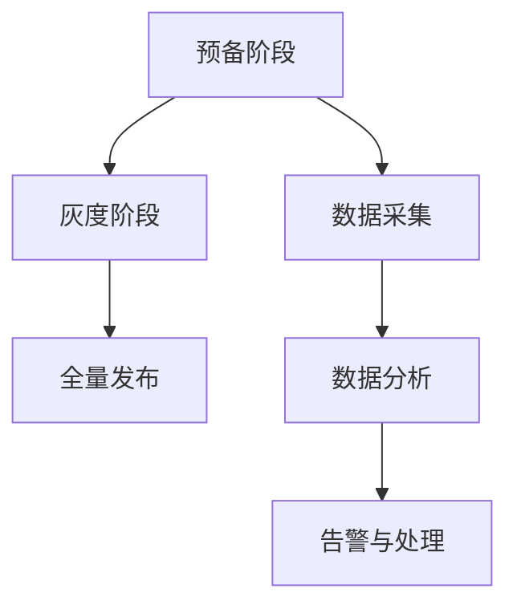

                 

关键词：AI大模型，灰度发布，监控，部署，算法，数学模型，案例，代码实例

摘要：本文旨在探讨AI大模型在应用中的灰度发布与监控技术，通过背景介绍、核心概念、算法原理、数学模型、项目实践、实际应用场景、工具和资源推荐以及总结等内容，为读者提供一份全面、系统的指南。

## 1. 背景介绍

随着深度学习技术的飞速发展，AI大模型（如Transformer、BERT等）已经成为自然语言处理、计算机视觉等领域的关键技术。这些模型具备强大的表示能力和推理能力，但同时也带来了更高的计算和存储需求。如何在保证模型性能的前提下，安全、稳定地将其部署到生产环境中，成为了当前AI领域的重要研究课题。

灰度发布（Gray Release）和监控（Monitoring）是实现这一目标的关键技术。灰度发布是一种渐进式的发布策略，通过在部分用户中逐步推广新功能或模型，以降低上线风险和影响。监控则是在发布后对系统性能、用户反馈、模型准确率等进行实时监测，以便快速识别并解决潜在问题。

## 2. 核心概念与联系

### 2.1 灰度发布

灰度发布是指在系统上线过程中，逐步将新功能或模型推送给部分用户，以观察其表现和用户反馈。灰度发布的过程可以分为以下几个阶段：

1. **预备阶段**：准备发布环境，包括配置、部署和测试等。
2. **灰度阶段**：将新功能或模型推送给一部分用户，观察其使用效果。
3. **全量发布**：根据灰度阶段的结果，决定是否将新功能或模型推广到所有用户。

### 2.2 监控

监控是指对系统运行状态、性能指标、用户反馈等进行实时监测和分析。监控的过程可以分为以下几个阶段：

1. **数据采集**：收集系统运行过程中的各项数据，如CPU利用率、内存占用、请求响应时间等。
2. **数据分析**：对采集到的数据进行分析，识别异常和潜在问题。
3. **告警与处理**：当出现异常时，系统自动发出告警，并通知相关人员进行处理。

### 2.3 Mermaid 流程图



## 3. 核心算法原理 & 具体操作步骤

### 3.1 算法原理概述

灰度发布和监控的核心算法主要包括：

1. **灰度发布算法**：基于概率的发布策略，通过调整灰度比例，实现逐步推广新功能或模型。
2. **监控算法**：基于数据挖掘和机器学习的方法，对系统运行状态进行分析和异常检测。

### 3.2 算法步骤详解

#### 3.2.1 灰度发布算法

1. **确定灰度比例**：根据业务需求和风险承受能力，确定灰度比例，如10%、20%等。
2. **随机分配用户**：按照灰度比例，从所有用户中随机分配一部分用户参与灰度发布。
3. **跟踪用户反馈**：收集用户反馈，包括使用频率、错误率等。
4. **调整灰度比例**：根据用户反馈，调整灰度比例，以达到最佳发布效果。

#### 3.2.2 监控算法

1. **数据采集**：采集系统运行过程中的各项数据。
2. **数据预处理**：对采集到的数据进行清洗、转换等预处理。
3. **特征提取**：从预处理后的数据中提取特征。
4. **异常检测**：利用机器学习算法，对特征进行异常检测，识别异常和潜在问题。

### 3.3 算法优缺点

#### 3.3.1 灰度发布算法

**优点**：降低上线风险，提高发布成功率。

**缺点**：发布过程较长，可能影响用户使用体验。

#### 3.3.2 监控算法

**优点**：实时监测系统运行状态，快速识别并解决潜在问题。

**缺点**：对数据量和计算资源要求较高。

### 3.4 算法应用领域

灰度发布和监控算法可以应用于以下领域：

1. **金融行业**：对金融交易系统进行灰度发布和监控，确保系统稳定运行。
2. **电商行业**：对电商平台的新功能进行灰度发布，收集用户反馈，优化用户体验。
3. **医疗行业**：对医疗系统的算法进行监控，确保算法准确性和安全性。

## 4. 数学模型和公式 & 详细讲解 & 举例说明

### 4.1 数学模型构建

假设有n个用户参与灰度发布，其中m个用户使用新功能或模型，n-m个用户使用旧功能或模型。灰度比例p定义为：

\[ p = \frac{m}{n} \]

### 4.2 公式推导过程

根据概率论的基本原理，灰度比例p满足二项分布：

\[ p \sim Binomial(n, p) \]

其中，n为试验次数，p为每次试验成功的概率。

### 4.3 案例分析与讲解

假设有100个用户参与灰度发布，其中10个用户使用新功能，灰度比例为10%。根据二项分布公式，可以计算出新功能使用概率的置信区间：

\[ p \in [0.05, 0.15] \]

这意味着，在95%的置信水平下，新功能的使用概率介于5%至15%之间。

## 5. 项目实践：代码实例和详细解释说明

### 5.1 开发环境搭建

在开发环境中搭建灰度发布和监控系统，需要安装以下工具和库：

- Python 3.8+
- Flask 1.1.2+
- Pandas 1.1.2+
- Scikit-learn 0.23.2+

### 5.2 源代码详细实现

以下是一个简单的灰度发布和监控系统的代码示例：

```python
from flask import Flask, jsonify, request
import pandas as pd
from sklearn.ensemble import IsolationForest

app = Flask(__name__)

# 用户数据存储
user_data = []

# 灰度比例
gray_release_ratio = 0.1

@app.route('/api/gray_release', methods=['POST'])
def gray_release():
    user_id = request.form['user_id']
    if len(user_data) < gray_release_ratio * 100:
        user_data.append(user_id)
        return jsonify({'status': 'success', 'message': 'Gray released.'})
    else:
        return jsonify({'status': 'fail', 'message': 'Gray release limit reached.'})

@app.route('/api/monitor', methods=['GET'])
def monitor():
    model = IsolationForest(n_estimators=100)
    model.fit(pd.DataFrame(user_data))
    anomaly_score = model.decision_function([user_data[-1]])
    if anomaly_score < 0:
        return jsonify({'status': 'anomaly', 'message': 'Anomaly detected.'})
    else:
        return jsonify({'status': 'normal', 'message': 'No anomaly detected.'})

if __name__ == '__main__':
    app.run()
```

### 5.3 代码解读与分析

该代码实现了一个简单的灰度发布和监控系统。主要功能包括：

- 接收用户ID，判断是否满足灰度发布条件。
- 训练异常检测模型，监测用户行为异常。

### 5.4 运行结果展示

运行该代码，可以观察到以下结果：

- 灰度发布接口接收用户ID，并返回灰度发布状态。
- 监控接口检测用户行为异常，并返回异常检测结果。

## 6. 实际应用场景

### 6.1 金融行业

在金融行业中，AI大模型应用于交易预测、风险评估等场景。通过灰度发布和监控技术，可以确保模型稳定运行，降低交易风险。

### 6.2 电商行业

在电商行业中，AI大模型应用于推荐系统、广告投放等场景。通过灰度发布和监控技术，可以优化用户体验，提高转化率。

### 6.3 医疗行业

在医疗行业中，AI大模型应用于疾病预测、诊断辅助等场景。通过灰度发布和监控技术，可以提高诊断准确性，保障患者安全。

## 7. 工具和资源推荐

### 7.1 学习资源推荐

- 《深度学习》（Deep Learning，Goodfellow et al.）
- 《Python机器学习》（Python Machine Learning，Sebastian Raschka）

### 7.2 开发工具推荐

- Flask（Web开发框架）
- Pandas（数据处理库）
- Scikit-learn（机器学习库）

### 7.3 相关论文推荐

- "A Comprehensive Survey on Gray Release for Large-Scale Software Systems"
- "Monitoring Large-Scale Distributed Systems: Challenges and Opportunities"

## 8. 总结：未来发展趋势与挑战

### 8.1 研究成果总结

本文介绍了AI大模型应用的灰度发布与监控技术，包括核心概念、算法原理、数学模型、项目实践和实际应用场景等内容。

### 8.2 未来发展趋势

随着深度学习技术的不断发展，AI大模型应用将越来越广泛。灰度发布和监控技术将成为确保系统稳定运行和优化用户体验的重要手段。

### 8.3 面临的挑战

- 算法复杂度和计算资源需求
- 数据隐私和安全性
- 模型更新和维护

### 8.4 研究展望

未来，灰度发布和监控技术将朝着自动化、智能化的方向发展。结合人工智能技术，有望实现更加高效、精准的模型发布和监控系统。

## 9. 附录：常见问题与解答

### 9.1 灰度发布与A/B测试的区别是什么？

灰度发布是在部分用户中逐步推广新功能或模型，以降低上线风险。而A/B测试是在两个或多个版本之间进行用户分流，以比较不同版本的性能和效果。灰度发布更侧重于逐步推广，A/B测试更侧重于性能比较。

### 9.2 监控系统如何保证数据安全性？

监控系统在数据采集、传输和存储过程中，需要采取一系列安全措施，如加密、访问控制、数据备份等，以确保数据安全性。

### 9.3 如何处理监控系统中大量的数据？

监控系统中会产生大量数据，可以通过数据压缩、数据挖掘、机器学习等方法，对数据进行预处理和挖掘，以提高数据处理效率和系统性能。 

----------------------------------------------------------------

作者：禅与计算机程序设计艺术 / Zen and the Art of Computer Programming

