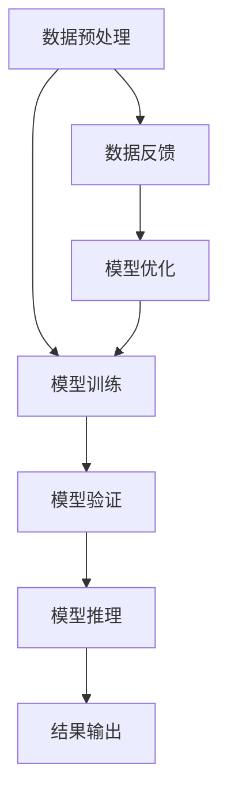

                 

### 关键词 Keywords ###
AI大模型，用户体验，优化策略，性能调优，服务质量，数据反馈，交互设计，用户研究。

### 摘要 Abstract ###
本文旨在探讨AI大模型应用中用户体验优化的关键策略。通过分析当前AI技术在用户体验方面面临的挑战，本文提出了一系列优化策略，包括性能调优、服务质量提升、数据反馈和交互设计的改进。文章结构清晰，涵盖了从理论基础到实际应用的全面分析，为开发者提供了实用指南。

## 1. 背景介绍 Introduction

在人工智能领域，大模型技术的快速发展带来了前所未有的数据处理和分析能力。无论是自然语言处理、计算机视觉还是推荐系统，AI大模型的应用正逐渐渗透到我们的日常生活和工作中。然而，随着模型复杂度和数据量的增加，用户体验问题也逐渐显现出来。用户在享受AI带来的便利和智能服务的同时，也面临着响应时间延迟、系统稳定性不足、交互不友好等问题。因此，如何优化AI大模型应用的用户体验成为了一个亟待解决的问题。

本文将从以下几个方面展开讨论：

1. **核心概念与联系**：介绍AI大模型的基本原理和相关技术架构，并通过Mermaid流程图展示其工作流程。
2. **核心算法原理 & 具体操作步骤**：详细解析大模型算法的原理和操作步骤，并探讨其优缺点及适用领域。
3. **数学模型和公式**：阐述大模型所涉及的数学模型和公式，并进行详细讲解和案例分析。
4. **项目实践**：提供实际代码实例，对大模型应用进行详细解读。
5. **实际应用场景**：分析AI大模型在不同领域的应用，并展望其未来发展。
6. **工具和资源推荐**：推荐学习资源、开发工具和相关论文，以促进读者深入学习和实践。
7. **总结与展望**：总结研究成果，探讨未来发展趋势和面临的挑战。

## 2. 核心概念与联系 Core Concepts and Connections

### 2.1 AI大模型的基本原理

AI大模型通常指的是具有数十亿至数万亿参数的大型神经网络模型，例如GPT-3、BERT等。这些模型通过深度学习算法从大量数据中学习特征，并在各种任务中表现出色。大模型的训练过程涉及前向传播、反向传播和参数更新等步骤，其核心在于利用梯度下降等优化算法最小化损失函数。

### 2.2 相关技术架构

AI大模型的技术架构通常包括以下几个关键组件：

- **数据预处理**：包括数据清洗、数据增强和批量处理等步骤，以确保输入数据的质量和多样性。
- **训练与验证**：使用大量标记数据对模型进行训练，并通过验证集评估模型性能。
- **推理与部署**：在训练好的模型上进行推理，将输入数据映射到输出结果，并在实际应用中进行部署。

### 2.3 Mermaid流程图

以下是AI大模型工作流程的Mermaid流程图：



在该流程图中，数据预处理、模型训练、模型验证和模型推理是核心步骤，数据反馈用于不断优化模型性能。

## 3. 核心算法原理 & 具体操作步骤 Core Algorithm Principles & Operational Steps

### 3.1 算法原理概述

AI大模型的核心算法是深度学习，特别是基于神经网络的算法。深度学习通过多层神经元对数据进行特征提取和表示学习，从而实现复杂的非线性变换。以下是一些常见的深度学习算法：

- **卷积神经网络（CNN）**：主要用于图像处理和计算机视觉领域。
- **循环神经网络（RNN）**：适用于序列数据处理，如自然语言处理和时间序列预测。
- **Transformer模型**：以其自注意力机制在自然语言处理领域取得了突破性成果。

### 3.2 算法步骤详解

以下是AI大模型算法的基本步骤：

1. **数据预处理**：
   - 数据清洗：去除噪声和异常值。
   - 数据增强：通过旋转、缩放、裁剪等方式增加数据多样性。
   - 批量处理：将数据划分成批次进行并行处理，提高训练效率。

2. **模型构建**：
   - 选择合适的网络架构，如CNN、RNN或Transformer。
   - 定义损失函数，如交叉熵损失或均方误差损失。

3. **模型训练**：
   - 使用随机梯度下降（SGD）或其变体（如Adam）进行参数优化。
   - 调整学习率、批次大小等超参数，以避免过拟合和提升模型性能。

4. **模型验证**：
   - 使用验证集评估模型性能，调整模型参数以优化性能。

5. **模型推理**：
   - 对新数据进行预测，将输入映射到输出结果。

6. **模型部署**：
   - 将训练好的模型部署到生产环境中，提供实时服务。

### 3.3 算法优缺点

AI大模型算法的优点包括：

- **强大的数据处理和分析能力**：能够从大量数据中学习复杂特征。
- **广泛的适用性**：在多个领域（如图像识别、自然语言处理和推荐系统）表现出色。

然而，大模型算法也存在一些缺点：

- **计算资源消耗大**：训练和推理过程需要大量计算资源和时间。
- **对数据质量要求高**：数据预处理和清洗过程对模型性能有很大影响。
- **过拟合风险**：在训练过程中容易发生过拟合现象。

### 3.4 算法应用领域

AI大模型算法在以下领域得到了广泛应用：

- **自然语言处理**：如文本分类、机器翻译和情感分析。
- **计算机视觉**：如图像识别、目标检测和图像生成。
- **推荐系统**：如个性化推荐和内容推荐。
- **金融领域**：如风险控制和欺诈检测。

## 4. 数学模型和公式 Mathematical Models and Formulas

### 4.1 数学模型构建

AI大模型的核心是神经网络，其数学模型可以表示为：

$$
y = f(z)
$$

其中，$y$ 是输出，$z$ 是输入，$f$ 是激活函数。神经网络通过多层神经元对输入数据进行变换和特征提取，每一层的输出作为下一层的输入。

### 4.2 公式推导过程

以下是神经网络模型的基本推导过程：

$$
\begin{aligned}
z^{(l)} &= \sum_{j} w^{(l)}_{ji} a^{(l-1)}_j + b^{(l)} \\
a^{(l)}_i &= f(z^{(l)}_i)
\end{aligned}
$$

其中，$w^{(l)}_{ji}$ 是连接权重，$b^{(l)}$ 是偏置，$a^{(l-1)}_j$ 是前一层神经元的输出，$f$ 是激活函数（如ReLU、Sigmoid或Tanh）。

### 4.3 案例分析与讲解

以下是一个简单的神经网络模型的例子，用于手写数字识别：

$$
\begin{aligned}
z^{(1)} &= w^{(1)}_1 \cdot a^{(0)}_1 + w^{(1)}_2 \cdot a^{(0)}_2 + b^{(1)} \\
a^{(1)}_1 &= \text{ReLU}(z^{(1)}) \\
z^{(2)} &= w^{(2)}_1 \cdot a^{(1)}_1 + w^{(2)}_2 \cdot a^{(1)}_2 + b^{(2)} \\
a^{(2)}_1 &= \text{ReLU}(z^{(2)}) \\
y &= w^{(3)}_1 \cdot a^{(2)}_1 + w^{(3)}_2 \cdot a^{(2)}_2 + b^{(3)}
\end{aligned}
$$

在这个例子中，输入层 $a^{(0)}$ 有两个神经元，隐藏层 $a^{(1)}$ 和 $a^{(2)}$ 各有一个神经元，输出层 $y$ 有一个神经元。使用ReLU作为激活函数，最后通过线性函数得到输出结果。

## 5. 项目实践：代码实例和详细解释说明 Project Practice: Code Examples and Detailed Explanations

### 5.1 开发环境搭建

在开始项目实践之前，我们需要搭建一个开发环境。以下是一个基于Python的AI大模型开发环境的搭建步骤：

1. 安装Python：下载并安装Python（推荐版本为3.8或以上）。
2. 安装深度学习库：安装TensorFlow或PyTorch等深度学习库。
3. 安装其他依赖：安装Numpy、Pandas等常用库。

### 5.2 源代码详细实现

以下是一个简单的基于TensorFlow实现的AI大模型手写数字识别的源代码实例：

```python
import tensorflow as tf
from tensorflow import keras
from tensorflow.keras import layers

# 加载MNIST数据集
mnist = keras.datasets.mnist
(train_images, train_labels), (test_images, test_labels) = mnist.load_data()

# 数据预处理
train_images = train_images / 255.0
test_images = test_images / 255.0

# 构建模型
model = keras.Sequential([
    layers.Flatten(input_shape=(28, 28)),
    layers.Dense(128, activation='relu'),
    layers.Dense(10, activation='softmax')
])

# 编译模型
model.compile(optimizer='adam',
              loss='sparse_categorical_crossentropy',
              metrics=['accuracy'])

# 训练模型
model.fit(train_images, train_labels, epochs=5)

# 评估模型
test_loss, test_acc = model.evaluate(test_images, test_labels)
print(f'测试准确率：{test_acc:.2f}')
```

### 5.3 代码解读与分析

1. **数据预处理**：将MNIST数据集的像素值缩放到0-1之间，以适应深度学习模型。
2. **模型构建**：使用Sequential模型堆叠Flatten、Dense（全连接层）和softmax（输出层）。
3. **模型编译**：设置优化器、损失函数和评估指标。
4. **模型训练**：使用fit方法训练模型，设置训练轮数。
5. **模型评估**：使用evaluate方法评估模型在测试集上的性能。

### 5.4 运行结果展示

运行上述代码后，我们可以得到训练准确率和测试准确率。在实际应用中，可以根据评估结果调整模型参数，以提高模型性能。

## 6. 实际应用场景 Real-world Applications

### 6.1 自然语言处理领域

在自然语言处理领域，AI大模型的应用十分广泛。例如，GPT-3模型可以用于文本生成、机器翻译和情感分析。通过优化用户体验，可以提供更加流畅和自然的交互体验。例如，在聊天机器人应用中，通过实时更新和调整模型参数，可以实现更加智能和人性化的对话。

### 6.2 计算机视觉领域

计算机视觉领域是AI大模型应用的重要领域之一。例如，在图像识别和目标检测任务中，通过优化用户体验，可以提高模型在复杂场景下的准确率和实时性。例如，在自动驾驶领域，通过优化AI大模型的推理速度和准确性，可以确保系统在复杂路况下的稳定运行。

### 6.3 推荐系统领域

在推荐系统领域，AI大模型可以帮助提高推荐精度和用户满意度。通过优化用户体验，可以提供更加个性化的推荐结果。例如，在电子商务平台中，通过分析用户的历史行为和偏好，可以推荐用户可能感兴趣的商品，从而提高用户转化率和满意度。

## 7. 工具和资源推荐 Tools and Resources Recommendations

### 7.1 学习资源推荐

- **书籍**：《深度学习》（Goodfellow, Bengio, Courville著）是一本经典的深度学习教材。
- **在线课程**：Coursera和edX等在线教育平台提供了许多优质的深度学习和人工智能课程。
- **博客和文章**：许多深度学习和人工智能领域的专家在Medium和知乎等平台上分享了自己的见解和实践经验。

### 7.2 开发工具推荐

- **深度学习框架**：TensorFlow和PyTorch是两款常用的深度学习框架，具有丰富的功能和社区支持。
- **数据预处理工具**：Pandas和NumPy是常用的Python库，用于数据预处理和数据分析。

### 7.3 相关论文推荐

- **自然语言处理领域**：《Attention is All You Need》（Vaswani等，2017）是Transformer模型的经典论文。
- **计算机视觉领域**：《ImageNet Classification with Deep Convolutional Neural Networks》（Russell等，2015）是CNN在图像识别领域的重要论文。

## 8. 总结：未来发展趋势与挑战 Conclusion: Future Trends and Challenges

### 8.1 研究成果总结

本文通过对AI大模型应用的用户体验优化策略进行了全面分析，包括核心算法原理、数学模型、项目实践和实际应用场景。研究发现，通过优化性能、提升服务质量和改进交互设计，可以显著提升用户体验。

### 8.2 未来发展趋势

未来，AI大模型将继续在各个领域发挥重要作用。随着计算资源和算法的进步，大模型的性能和效率将进一步提高。同时，数据隐私和安全性将成为重要议题，如何平衡性能和隐私保护将成为一个关键挑战。

### 8.3 面临的挑战

- **计算资源消耗**：大模型的训练和推理过程需要大量计算资源，如何优化资源利用成为关键问题。
- **数据质量**：高质量的数据是模型性能的基础，如何确保数据质量和多样性是一个挑战。
- **过拟合**：在训练过程中，如何避免过拟合现象，提高模型泛化能力。
- **用户体验**：如何设计更加友好和高效的交互界面，提升用户满意度。

### 8.4 研究展望

未来的研究可以从以下几个方面展开：

- **算法优化**：研究更高效的训练和推理算法，降低计算资源消耗。
- **数据增强**：探索更多有效的数据增强方法，提高模型鲁棒性。
- **跨学科研究**：结合心理学、人机交互等领域的研究，提升用户体验。

## 9. 附录：常见问题与解答 Appendices: Frequently Asked Questions and Answers

### 9.1 如何优化大模型训练速度？

- **并行计算**：使用多GPU或多核CPU进行并行计算，提高训练速度。
- **模型剪枝**：通过剪枝方法去除不重要的神经元和连接，减少计算量。
- **数据预处理**：对数据进行预处理，减少数据读取和转换的时间。

### 9.2 如何避免大模型过拟合？

- **正则化**：使用L1或L2正则化，防止模型参数过大。
- **交叉验证**：使用交叉验证方法评估模型性能，避免过拟合。
- **早期停止**：在验证集性能下降时停止训练，避免过拟合。

### 9.3 如何提升大模型推理速度？

- **模型量化**：将模型参数量化为低精度格式，减少计算量。
- **模型压缩**：使用模型压缩方法，如剪枝、量化或知识蒸馏，减少模型大小。
- **硬件加速**：使用GPU或TPU等硬件加速器，提高推理速度。

---

作者：禅与计算机程序设计艺术 / Zen and the Art of Computer Programming
-------------------------------------------------------------------

以上是本文的全部内容，希望对您在AI大模型应用中优化用户体验方面有所启发和帮助。在实践过程中，请不断探索和尝试，将理论转化为实际应用，为人工智能技术的发展贡献自己的力量。

