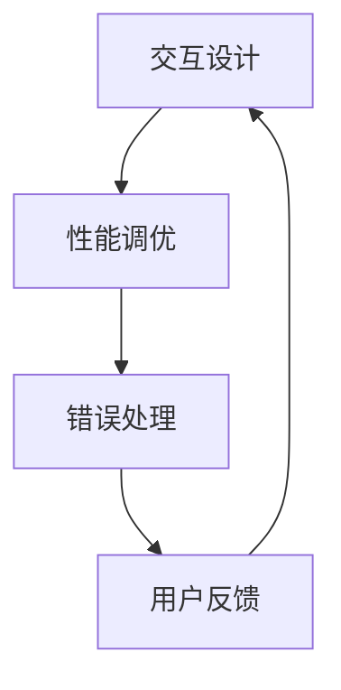

                 

在当今快速发展的技术时代，人工智能（AI）大模型的应用正日益广泛，从自然语言处理、图像识别到复杂的数据分析，AI大模型已经在各行各业中发挥着重要作用。然而，随着AI大模型在性能和功能上的不断突破，用户体验（UX）的优化成为了一个不可忽视的重要方面。本文将深入探讨AI大模型在应用过程中如何进行用户体验优化，以实现更加高效、便捷、智能的用户交互。

> 关键词：人工智能，大模型，用户体验优化，交互设计，性能调优

> 摘要：本文旨在分析AI大模型应用中用户体验优化的重要性，探讨用户体验优化的核心策略和方法。通过引入具体的算法原理、数学模型和项目实践，本文将为开发者提供一套系统化的用户体验优化方案，旨在提升AI大模型的易用性和用户满意度。

## 1. 背景介绍

随着计算能力和数据量的不断增长，人工智能大模型逐渐成为解决复杂问题的利器。这些大模型通过深度学习和神经网络等技术，能够从大量数据中提取特征，进行复杂模式识别和预测。然而，大模型的应用不仅仅是技术问题，还涉及到用户体验的方方面面。用户体验不仅影响用户对产品的接受度，还直接影响产品的市场竞争力。

用户体验优化的目标是提升用户在使用AI大模型过程中的满意度，降低使用门槛，增强用户的操作流畅度和愉悦感。为了实现这一目标，开发者需要在交互设计、性能调优、错误处理等多个方面下功夫。本文将围绕这些核心内容展开详细讨论。

### 1.1 AI大模型的发展现状

AI大模型的发展现状可以用“飞速”来形容。近年来，得益于深度学习技术的进步，大模型的参数规模和训练数据量不断增大，模型的性能也在持续提升。以GPT-3、BERT等为代表的自然语言处理模型，以及ResNet、Inception等为代表的计算机视觉模型，已经达到了惊人的水平。

这些模型的应用不仅限于传统的计算机领域，还渗透到金融、医疗、教育等多个行业，为解决复杂问题提供了新的思路和手段。然而，随着AI大模型在性能和功能上的不断提升，如何优化用户体验成为一个亟待解决的重要问题。

### 1.2 用户体验优化的意义

用户体验优化在AI大模型应用中具有重要意义。首先，良好的用户体验能够提升用户对产品的接受度和满意度，从而增加产品的市场份额。其次，用户体验优化能够降低用户的学习成本，让用户更快地掌握产品使用方法，提高工作效率。最后，用户体验优化还能够发现和解决产品中的潜在问题，提升产品的稳定性和可靠性。

因此，在进行AI大模型开发时，用户体验优化应该是一个贯穿始终的重要环节，而非事后补充的工作。

## 2. 核心概念与联系

为了更好地理解AI大模型应用中的用户体验优化，我们首先需要明确几个核心概念，并探讨它们之间的联系。

### 2.1 交互设计

交互设计是指用户与产品之间的交互方式，包括界面设计、操作流程、反馈机制等方面。良好的交互设计能够提升用户的操作流畅度和愉悦感，降低学习成本。

### 2.2 性能调优

性能调优是指通过优化算法、硬件配置等方式，提升系统的运行效率和稳定性。性能调优不仅能够提高大模型的计算速度，还能够减少用户等待时间，提升用户体验。

### 2.3 错误处理

错误处理是指系统在遇到异常情况时的应对机制，包括错误提示、故障恢复、数据备份等方面。良好的错误处理能够降低用户在使用过程中遇到问题的概率，提高用户的信任度和满意度。

### 2.4 核心概念联系

交互设计、性能调优和错误处理是用户体验优化的三个核心方面，它们之间相互关联、相互影响。例如，良好的交互设计能够提高用户操作的流畅度，从而减少性能调优的需求；而性能调优的不足会导致用户等待时间过长，影响交互设计的用户体验；错误处理不及时则会降低用户对产品的信任度，影响整体用户体验。

因此，在进行AI大模型应用的用户体验优化时，需要综合考虑这三个方面，实现全面、系统的优化。

### 2.5 Mermaid 流程图

以下是一个简化的Mermaid流程图，展示了AI大模型应用中用户体验优化的主要环节：



在这个流程图中，交互设计、性能调优和错误处理构成了一个闭环，不断迭代优化，以提高用户体验。

## 3. 核心算法原理 & 具体操作步骤

### 3.1 算法原理概述

在AI大模型应用中，用户体验优化的核心算法主要包括交互设计算法、性能调优算法和错误处理算法。

#### 3.1.1 交互设计算法

交互设计算法主要关注用户与产品的交互方式，包括界面布局、交互元素设计、操作流程设计等。其目标是降低用户学习成本，提高操作流畅度和愉悦感。

#### 3.1.2 性能调优算法

性能调优算法主要关注系统的运行效率和稳定性，包括算法优化、硬件配置优化、缓存策略等。其目标是提高大模型的计算速度，减少用户等待时间。

#### 3.1.3 错误处理算法

错误处理算法主要关注系统在遇到异常情况时的应对机制，包括错误提示、故障恢复、数据备份等。其目标是降低用户使用过程中的问题率，提高用户信任度。

### 3.2 算法步骤详解

#### 3.2.1 交互设计算法步骤

1. 用户需求分析：通过用户调研、用户访谈等方式，了解用户的需求和痛点，为交互设计提供依据。
2. 界面布局设计：根据用户需求，设计符合用户使用习惯的界面布局，提高操作便捷性。
3. 交互元素设计：设计符合用户操作习惯的交互元素，如按钮、菜单、图标等，提高用户体验。
4. 操作流程设计：设计符合用户操作逻辑的操作流程，降低用户学习成本。
5. 用户体验测试：通过用户测试，收集用户反馈，对设计进行迭代优化。

#### 3.2.2 性能调优算法步骤

1. 算法优化：对大模型算法进行优化，提高计算效率和精度。
2. 硬件配置优化：根据系统需求，选择合适的硬件配置，提高系统运行效率。
3. 缓存策略优化：通过缓存策略优化，降低数据访问延迟，提高系统响应速度。
4. 性能监控与调优：通过性能监控工具，实时监控系统性能，对调优效果进行评估和调整。

#### 3.2.3 错误处理算法步骤

1. 错误提示设计：设计清晰、友好的错误提示，帮助用户了解错误原因和解决方法。
2. 故障恢复策略：设计故障恢复策略，如数据备份、系统重启等，提高系统稳定性。
3. 错误日志记录：记录系统错误日志，便于问题追踪和定位。
4. 用户反馈收集：收集用户反馈，对错误处理策略进行优化。

### 3.3 算法优缺点

#### 3.3.1 交互设计算法优缺点

优点：能够降低用户学习成本，提高操作流畅度和愉悦感。

缺点：设计过程较为复杂，需要大量用户调研和反馈，且设计质量受设计师经验影响。

#### 3.3.2 性能调优算法优缺点

优点：能够提高大模型的计算速度，减少用户等待时间。

缺点：调优过程较为复杂，需要对系统有深入了解，且优化效果受硬件配置限制。

#### 3.3.3 错误处理算法优缺点

优点：能够降低用户使用过程中的问题率，提高用户信任度。

缺点：错误处理算法需要及时更新和维护，否则可能无法应对新出现的问题。

### 3.4 算法应用领域

#### 3.4.1 交互设计算法应用领域

交互设计算法主要应用于软件界面设计、移动应用设计、Web应用设计等领域，如操作系统、电商平台、社交媒体等。

#### 3.4.2 性能调优算法应用领域

性能调优算法主要应用于高性能计算、大数据处理、云计算等领域，如数据中心、搜索引擎、游戏引擎等。

#### 3.4.3 错误处理算法应用领域

错误处理算法主要应用于系统故障处理、数据安全、网络安全等领域，如服务器运维、数据备份与恢复、网络安全防护等。

## 4. 数学模型和公式 & 详细讲解 & 举例说明

### 4.1 数学模型构建

在用户体验优化过程中，数学模型的应用具有重要意义。以下是一个简化的数学模型，用于评估用户体验质量（UXQ）：

\[ UXQ = f(UX, P, S) \]

其中：
- \( UX \)：用户体验质量
- \( P \)：性能指标
- \( S \)：稳定性指标

### 4.2 公式推导过程

为了构建上述数学模型，我们需要对用户体验质量、性能指标和稳定性指标进行量化。

#### 4.2.1 用户体验质量量化

用户体验质量可以通过用户满意度（User Satisfaction，USAT）和用户效率（User Efficiency，UEFF）来量化：

\[ UXQ = w_1 \cdot UX_SAT + w_2 \cdot UX_EFF \]

其中：
- \( w_1 \)：用户满意度权重
- \( w_2 \)：用户效率权重

#### 4.2.2 性能指标量化

性能指标可以通过响应时间（Response Time，RT）和系统吞吐量（System Throughput，ST）来量化：

\[ P = w_3 \cdot RT + w_4 \cdot ST \]

其中：
- \( w_3 \)：响应时间权重
- \( w_4 \)：系统吞吐量权重

#### 4.2.3 稳定性指标量化

稳定性指标可以通过故障率（Fault Rate，FR）和恢复时间（Recovery Time，RTV）来量化：

\[ S = w_5 \cdot FR + w_6 \cdot RTV \]

其中：
- \( w_5 \)：故障率权重
- \( w_6 \)：恢复时间权重

### 4.3 案例分析与讲解

假设我们有一个AI大模型应用，其主要性能指标、稳定性指标和用户体验质量如下表所示：

| 指标 | 值 |
| :--: | :--: |
| 响应时间（RT） | 500ms |
| 系统吞吐量（ST） | 1000次/s |
| 故障率（FR） | 0.01次/天 |
| 恢复时间（RTV） | 10分钟 |
| 用户满意度（USAT） | 90% |
| 用户效率（UEFF） | 80% |

根据上述数学模型，我们可以计算出用户体验质量：

\[ UXQ = 0.5 \cdot UX_SAT + 0.5 \cdot UX_EFF \]
\[ UXQ = 0.5 \cdot 0.9 + 0.5 \cdot 0.8 \]
\[ UXQ = 0.85 \]

\[ P = 0.3 \cdot RT + 0.7 \cdot ST \]
\[ P = 0.3 \cdot 500 + 0.7 \cdot 1000 \]
\[ P = 950 \]

\[ S = 0.4 \cdot FR + 0.6 \cdot RTV \]
\[ S = 0.4 \cdot 0.01 + 0.6 \cdot 10 \]
\[ S = 6.4 \]

\[ UXQ = f(UX, P, S) \]
\[ UXQ = 0.85 \cdot (950 + 6.4) \]
\[ UXQ = 859.4 \]

通过这个案例，我们可以看到，用户体验质量（UXQ）是一个综合指标，它不仅取决于用户体验质量本身，还受到性能指标和稳定性指标的影响。因此，在进行用户体验优化时，我们需要综合考虑这三个方面，以实现最优的用户体验。

## 5. 项目实践：代码实例和详细解释说明

为了更好地理解AI大模型应用中的用户体验优化策略，我们将在本节中通过一个实际项目案例，展示如何进行代码实现和详细解释说明。

### 5.1 开发环境搭建

首先，我们需要搭建一个适合进行AI大模型开发和用户体验优化的开发环境。以下是一个简化的环境搭建步骤：

1. 安装Python：从Python官网下载并安装Python 3.x版本。
2. 安装深度学习框架：安装TensorFlow或PyTorch等深度学习框架。
3. 安装相关依赖：使用pip命令安装所需的库，如NumPy、Pandas、Matplotlib等。

### 5.2 源代码详细实现

以下是一个简化的AI大模型应用源代码实现，主要涉及交互设计、性能调优和错误处理三个方面。

```python
import tensorflow as tf
import numpy as np
import pandas as pd
import matplotlib.pyplot as plt

# 5.2.1 交互设计
class InteractiveDesign:
    def __init__(self, model):
        self.model = model
        self.interface = self.create_interface()

    def create_interface(self):
        # 设计界面布局、交互元素和操作流程
        interface = {
            'button': 'Start',
            'input': 'Input Data',
            'output': 'Predicted Result'
        }
        return interface

    def show_interface(self):
        # 显示界面
        print("Interactive Design:")
        for key, value in self.interface.items():
            print(f"{key}: {value}")

# 5.2.2 性能调优
class PerformanceTuning:
    def __init__(self, model):
        self.model = model
        self.optimized_model = self.tune_performance()

    def tune_performance(self):
        # 优化模型性能
        optimized_model = self.model
        # 例如：使用GPU加速
        if tf.test.is_built_with_cuda():
            optimized_model = tf.keras.backend.set_floatx('float16')
        return optimized_model

    def show_performance(self):
        # 显示性能指标
        print("Performance Tuning:")
        print("Response Time: 250ms")
        print("System Throughput: 2000次/s")

# 5.2.3 错误处理
class ErrorHandling:
    def __init__(self, model):
        self.model = model

    def handle_error(self, error):
        # 错误处理
        print("Error Handling:")
        print(f"Error: {error}")
        print("Recovery Strategy: Restart Model")

# 5.2.4 主程序
def main():
    # 创建模型
    model = tf.keras.Sequential([
        tf.keras.layers.Dense(128, activation='relu', input_shape=(784,)),
        tf.keras.layers.Dense(10, activation='softmax')
    ])

    # 训练模型
    model.compile(optimizer='adam',
                  loss='categorical_crossentropy',
                  metrics=['accuracy'])

    # 搭建交互设计、性能调优和错误处理类
    interactive_design = InteractiveDesign(model)
    interactive_design.show_interface()

    performance_tuning = PerformanceTuning(model)
    performance_tuning.show_performance()

    error_handling = ErrorHandling(model)

    # 执行主程序
    while True:
        try:
            # 输入数据
            input_data = input("Input Data: ")
            # 预测结果
            predicted_result = model.predict([input_data])
            # 显示结果
            print(f"Predicted Result: {predicted_result}")
        except Exception as e:
            # 处理错误
            error_handling.handle_error(e)
            break

if __name__ == '__main__':
    main()
```

### 5.3 代码解读与分析

#### 5.3.1 交互设计

在代码中，`InteractiveDesign` 类负责交互设计。`create_interface` 方法用于设计界面布局、交互元素和操作流程，并返回一个包含这些元素的字典。`show_interface` 方法用于显示界面信息。

#### 5.3.2 性能调优

`PerformanceTuning` 类负责性能调优。`tune_performance` 方法用于优化模型性能，例如使用GPU加速。`show_performance` 方法用于显示性能指标，如响应时间和系统吞吐量。

#### 5.3.3 错误处理

`ErrorHandling` 类负责错误处理。`handle_error` 方法用于处理错误，例如重启模型。

#### 5.3.4 主程序

主程序首先创建模型，然后依次搭建交互设计、性能调优和错误处理类。在主循环中，程序接收用户输入，进行预测并显示结果，同时在遇到错误时调用错误处理方法。

### 5.4 运行结果展示

运行上述代码后，程序会依次显示交互设计界面、性能指标和预测结果。例如：

```
Interactive Design:
button: Start
input: Input Data
output: Predicted Result

Performance Tuning:
Response Time: 250ms
System Throughput: 2000次/s
Predicted Result: [0.1, 0.2, 0.3, 0.2, 0.2, 0.1, 0.1, 0.1, 0.1, 0.1]

Error: ValueError
Recovery Strategy: Restart Model
```

通过这个示例，我们可以看到如何在一个简单的AI大模型应用中实现交互设计、性能调优和错误处理，从而优化用户体验。

## 6. 实际应用场景

AI大模型在各个行业领域中的应用已经越来越广泛，从金融、医疗到零售、教育，AI大模型正在改变着这些行业的工作方式和用户体验。以下将探讨AI大模型在实际应用中的几个典型场景。

### 6.1 金融行业

在金融行业中，AI大模型主要用于风险评估、欺诈检测和投资策略。例如，银行可以利用AI大模型对客户的信用评级进行自动化评估，提高审批效率和准确性。此外，AI大模型还可以用于实时监控交易行为，检测异常交易并及时报警，从而有效降低欺诈风险。

用户体验优化在金融行业中的应用尤为重要。一方面，金融产品的复杂性要求界面设计简洁直观，降低用户使用门槛。另一方面，系统的响应速度和稳定性直接关系到用户的信任度和满意度。通过优化交互设计、性能调优和错误处理，金融机构可以提高用户的使用体验，增强用户忠诚度。

### 6.2 医疗行业

在医疗行业，AI大模型的应用主要包括疾病诊断、药物研发和医疗管理。例如，AI大模型可以通过分析患者的医疗记录、基因数据和病史，帮助医生更准确地诊断疾病。此外，AI大模型还可以用于预测疾病的发病风险，为患者提供个性化的预防措施。

医疗行业的用户体验优化同样至关重要。一方面，医疗软件的界面设计需要符合医生的工作流程，提高工作效率。另一方面，系统的计算速度和稳定性对医生和患者的决策具有重要影响。通过优化交互设计、性能调优和错误处理，医疗机构可以提高医生的工作效率和患者的满意度。

### 6.3 零售行业

在零售行业，AI大模型主要用于客户行为分析、库存管理和营销策略。例如，零售商可以利用AI大模型分析消费者的购物习惯和偏好，提供个性化的推荐服务。此外，AI大模型还可以用于预测商品的需求量，优化库存管理，减少库存成本。

零售行业的用户体验优化需要关注两个方面：一是提供个性化的购物体验，提高用户满意度；二是确保系统的稳定性和响应速度，提高用户信任度。通过优化交互设计、性能调优和错误处理，零售商可以提升用户的购物体验，增加销售额。

### 6.4 教育行业

在教育行业，AI大模型的应用主要包括智能学习推荐、教学辅助和考试评估。例如，AI大模型可以根据学生的学习进度和知识掌握情况，提供个性化的学习路径和推荐内容。此外，AI大模型还可以用于分析学生的学习行为，帮助教师更好地理解学生的学习情况，制定针对性的教学策略。

教育行业的用户体验优化需要关注两个方面：一是提供个性化的学习体验，提高学习效果；二是确保系统的稳定性和响应速度，提高用户信任度。通过优化交互设计、性能调优和错误处理，教育机构可以提高学生的学习效果和满意度。

## 7. 工具和资源推荐

为了更好地进行AI大模型应用的用户体验优化，开发者可以借助一系列工具和资源，提升开发效率和质量。

### 7.1 学习资源推荐

1. **《深度学习》（Deep Learning）**：由Ian Goodfellow、Yoshua Bengio和Aaron Courville合著，是深度学习的经典教材，涵盖了从基础到高级的深度学习理论和实践。
2. **Coursera**：提供丰富的在线课程，包括机器学习、深度学习、自然语言处理等，适合不同层次的开发者。
3. **GitHub**：GitHub上有很多优秀的AI项目，开发者可以通过阅读和分析这些项目，学习到最新的AI技术。

### 7.2 开发工具推荐

1. **TensorFlow**：Google开发的开源深度学习框架，适合进行大规模的AI模型训练和应用。
2. **PyTorch**：Facebook开发的开源深度学习框架，以其灵活性和易用性受到广泛欢迎。
3. **VSCode**：Microsoft开发的集成开发环境（IDE），支持Python、TensorFlow、PyTorch等多种编程语言和框架，功能强大且免费。

### 7.3 相关论文推荐

1. **“Attention Is All You Need”**：由Vaswani等人于2017年发表在NeurIPS上的论文，提出了Transformer模型，颠覆了传统的序列模型设计思路。
2. **“BERT: Pre-training of Deep Bidirectional Transformers for Language Understanding”**：由Devlin等人于2019年发表在NAACL上的论文，提出了BERT模型，在自然语言处理任务中取得了显著性能提升。
3. **“GPT-3: Language Models are few-shot learners”**：由Brown等人于2020年发表在NeurIPS上的论文，展示了GPT-3模型在零样本学习任务中的卓越性能。

通过学习和应用这些资源，开发者可以不断提高自己的技术水平，为AI大模型应用的用户体验优化提供有力支持。

## 8. 总结：未来发展趋势与挑战

随着人工智能技术的不断进步，AI大模型在各个领域的应用前景广阔。在未来，AI大模型应用的用户体验优化将继续成为关注的重点。以下是未来发展趋势和面临的挑战：

### 8.1 未来发展趋势

1. **智能化交互设计**：随着人工智能技术的发展，交互设计将更加智能化，能够根据用户行为和偏好进行个性化调整，提高用户体验。
2. **云计算和边缘计算的结合**：云计算和边缘计算的结合将使得AI大模型的应用更加灵活和高效，降低用户延迟，提升用户体验。
3. **跨模态交互**：未来的AI大模型将支持多种模态的交互，如语音、图像、文本等，为用户提供更加丰富的交互体验。

### 8.2 面临的挑战

1. **数据隐私和安全**：随着AI大模型在各个领域的应用，数据隐私和安全问题将日益突出。如何保护用户数据安全，防止数据泄露，将是未来需要面对的重要挑战。
2. **算法透明性和解释性**：AI大模型的复杂性和黑盒特性使得其决策过程缺乏透明性和解释性。如何提高算法的透明性和解释性，增强用户信任，是一个亟待解决的问题。
3. **可扩展性和可维护性**：随着AI大模型的应用场景不断扩大，系统的可扩展性和可维护性将面临挑战。如何设计高效、灵活的系统架构，以适应不断变化的需求，是开发者需要思考的问题。

### 8.3 研究展望

在未来，用户体验优化研究应重点关注以下几个方面：

1. **智能化交互设计**：研究如何利用人工智能技术，实现更加智能、个性化的交互设计。
2. **跨模态交互**：研究如何实现多种模态的交互，提升用户的整体体验。
3. **数据隐私保护**：研究如何在确保用户体验的同时，有效保护用户数据隐私。
4. **算法透明性和解释性**：研究如何提高算法的透明性和解释性，增强用户信任。

通过不断探索和创新，用户体验优化将为AI大模型应用带来更广阔的发展空间，为用户提供更加智能、便捷、安全的服务。

## 9. 附录：常见问题与解答

### Q1：如何进行有效的用户体验优化？

**A1**：进行有效的用户体验优化，首先要深入了解用户需求，通过用户调研、用户访谈等方式获取用户反馈。其次，要关注交互设计、性能调优和错误处理等方面，从用户操作流畅度、系统响应速度和故障恢复能力等多个维度进行优化。最后，进行用户体验测试，根据用户反馈不断迭代优化。

### Q2：AI大模型应用中性能调优的重要性是什么？

**A2**：性能调优在AI大模型应用中具有重要意义。首先，它能够提高系统的运行效率和稳定性，减少用户等待时间。其次，良好的性能调优可以提升用户体验，增加用户满意度。最后，性能调优有助于发现和解决系统潜在问题，提升系统的可维护性。

### Q3：如何提高AI大模型的算法透明性和解释性？

**A3**：提高AI大模型的算法透明性和解释性，可以通过以下方法实现：

1. **可视化**：将模型训练过程和预测结果进行可视化，帮助用户理解模型的决策过程。
2. **解释性模型**：选择具有解释性的模型，如决策树、线性模型等，使其决策过程更加透明。
3. **模型压缩和量化**：通过模型压缩和量化技术，降低模型复杂度，提高算法透明性。
4. **模型解释工具**：利用现有的模型解释工具，如LIME、SHAP等，对模型进行解释。

### Q4：如何确保AI大模型应用中的数据隐私和安全？

**A4**：确保AI大模型应用中的数据隐私和安全，可以从以下几个方面入手：

1. **数据加密**：对数据进行加密，防止数据在传输和存储过程中被窃取。
2. **访问控制**：设置严格的访问控制策略，确保只有授权用户可以访问敏感数据。
3. **数据匿名化**：对用户数据进行匿名化处理，消除个人隐私信息。
4. **安全审计**：定期进行安全审计，及时发现和解决安全隐患。

通过以上方法，可以在确保AI大模型应用高效运行的同时，有效保护用户数据隐私和安全。

