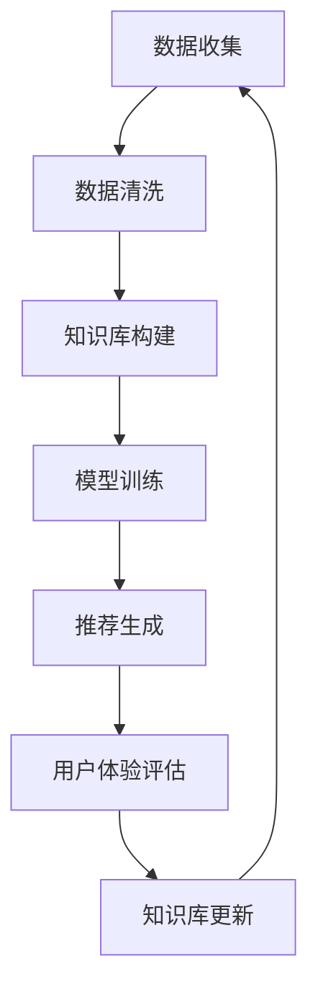

                 

关键词：AI大模型、电商搜索推荐、知识库管理、技术创新、流程优化

摘要：随着人工智能技术的发展，AI大模型在电商搜索推荐领域展现出了巨大的潜力。本文将从AI大模型的视角出发，探讨电商搜索推荐系统中知识库管理流程的优化，以提升搜索推荐的准确性和用户体验。

## 1. 背景介绍

在互联网时代，电商行业蓬勃发展，用户对于搜索推荐的依赖性不断增强。电商平台的搜索推荐系统是帮助用户快速找到心仪商品的重要工具，也是电商平台的核心竞争力。传统的搜索推荐技术主要依赖于关键词匹配、用户历史行为分析等方法，虽然在一定程度上能够满足用户需求，但随着数据量的爆炸式增长，推荐系统的性能和准确性逐渐受到挑战。

近年来，人工智能技术的发展为电商搜索推荐系统带来了新的机遇。特别是AI大模型的出现，使得搜索推荐系统能够更加智能化、个性化地满足用户需求。本文将重点探讨AI大模型在电商搜索推荐系统中知识库管理流程的优化，以提升系统的整体性能。

## 2. 核心概念与联系

### 2.1 AI大模型

AI大模型是指具有海量参数、能够处理大规模数据的人工智能模型。它们通常采用深度学习技术进行训练，能够自动从数据中学习出复杂的关系和模式。AI大模型在图像识别、自然语言处理、推荐系统等领域都有着广泛的应用。

### 2.2 知识库管理

知识库管理是指对大量知识信息进行收集、整理、存储、更新和利用的过程。在电商搜索推荐系统中，知识库管理主要包括商品信息、用户行为信息、市场动态信息等。通过有效的知识库管理，可以提升搜索推荐的准确性和用户体验。

### 2.3 Mermaid流程图

下面是一个描述AI大模型在电商搜索推荐系统中知识库管理流程的Mermaid流程图：

### 2.4 关系联系

AI大模型通过数据收集、数据清洗、知识库构建、模型训练等步骤，将用户行为、商品信息等转化为有效的知识库。在此基础上，通过推荐生成模块，为用户提供个性化的推荐结果。用户体验评估模块对推荐结果进行评估，根据评估结果对知识库进行更新，从而实现一个闭环的知识库管理流程。

## 3. 核心算法原理 & 具体操作步骤

### 3.1 算法原理概述

AI大模型在电商搜索推荐系统中的核心算法主要基于深度学习技术，包括卷积神经网络（CNN）、循环神经网络（RNN）等。这些算法通过学习用户行为和商品特征，构建出用户和商品之间的潜在关系。

### 3.2 算法步骤详解

#### 3.2.1 数据收集

数据收集是构建AI大模型的基础。在电商搜索推荐系统中，数据收集主要包括用户行为数据、商品信息数据、市场动态数据等。这些数据来源可以是用户日志、商品数据库、社交媒体等。

#### 3.2.2 数据清洗

数据清洗是保证数据质量的关键步骤。数据清洗包括去除重复数据、填补缺失值、去除噪声数据等。通过数据清洗，可以确保输入模型的训练数据的质量。

#### 3.2.3 知识库构建

知识库构建是将清洗后的数据进行处理，提取出用户和商品的特征，构建出一个多维度的知识库。这个过程中，可以采用向量表示、特征工程等方法，将用户和商品的属性转化为数值型特征。

#### 3.2.4 模型训练

模型训练是利用知识库中的数据，通过深度学习算法训练出一个推荐模型。在训练过程中，模型会不断调整参数，以优化推荐效果。

#### 3.2.5 推荐生成

推荐生成是基于训练好的模型，为用户生成个性化的推荐结果。推荐生成可以分为基于内容的推荐、基于协同过滤的推荐、混合推荐等方法。

#### 3.2.6 用户体验评估

用户体验评估是对推荐结果进行评估，以评估推荐系统的性能。评估方法可以包括点击率、转化率、用户满意度等。

#### 3.2.7 知识库更新

根据用户体验评估的结果，对知识库进行更新，优化推荐系统的效果。知识库更新可以包括添加新的用户行为数据、调整用户和商品的属性等。

### 3.3 算法优缺点

#### 优点

- AI大模型能够处理大规模数据，提升搜索推荐的准确性和实时性。
- 深度学习算法能够自动提取用户和商品的特征，降低人工干预。

#### 缺点

- AI大模型训练需要大量计算资源和时间。
- 模型参数调整需要大量实验和验证。

### 3.4 算法应用领域

AI大模型在电商搜索推荐系统中具有广泛的应用前景，除了电商领域，还可以应用于金融、医疗、教育等领域，为用户提供个性化的推荐服务。

## 4. 数学模型和公式 & 详细讲解 & 举例说明

### 4.1 数学模型构建

在AI大模型中，常用的数学模型包括卷积神经网络（CNN）、循环神经网络（RNN）等。下面以CNN为例，介绍其数学模型构建。

#### 4.1.1 CNN模型构建

CNN的数学模型主要包括输入层、卷积层、池化层、全连接层等。

- 输入层：输入层接收用户行为数据和商品信息数据，将其转化为高维向量。
- 卷积层：卷积层通过卷积操作，提取用户行为和商品信息中的特征。
- 池化层：池化层通过池化操作，降低特征维度，提高模型泛化能力。
- 全连接层：全连接层将卷积层和池化层提取的特征映射到输出层，生成推荐结果。

#### 4.1.2 RNN模型构建

RNN的数学模型主要包括输入层、隐藏层、输出层等。

- 输入层：输入层接收用户行为数据和商品信息数据，将其转化为高维向量。
- 隐藏层：隐藏层通过递归操作，处理用户行为序列，提取出用户行为模式。
- 输出层：输出层将隐藏层提取的特征映射到推荐结果。

### 4.2 公式推导过程

以CNN模型为例，介绍其数学模型推导过程。

#### 4.2.1 输入层

输入层将用户行为数据和商品信息数据转化为高维向量，公式如下：

$$
X = [x_1, x_2, ..., x_n]
$$

其中，$X$表示输入层的高维向量，$x_1, x_2, ..., x_n$表示用户行为数据和商品信息数据。

#### 4.2.2 卷积层

卷积层通过卷积操作，提取用户行为和商品信息中的特征，公式如下：

$$
h_k = \sigma(W_k * X + b_k)
$$

其中，$h_k$表示卷积层提取的特征，$W_k$表示卷积核，$*$表示卷积操作，$\sigma$表示激活函数，$b_k$表示偏置。

#### 4.2.3 池化层

池化层通过池化操作，降低特征维度，公式如下：

$$
p_j = \max(h_j)
$$

其中，$p_j$表示池化后的特征，$h_j$表示卷积层提取的特征。

#### 4.2.4 全连接层

全连接层将卷积层和池化层提取的特征映射到输出层，生成推荐结果，公式如下：

$$
y = \sigma(W_y * p + b_y)
$$

其中，$y$表示推荐结果，$W_y$表示全连接层的权重，$p$表示池化后的特征，$\sigma$表示激活函数，$b_y$表示偏置。

### 4.3 案例分析与讲解

以一个电商搜索推荐系统为例，介绍如何利用AI大模型进行知识库管理流程优化。

#### 4.3.1 数据收集

收集用户行为数据，包括用户搜索历史、购买记录、浏览记录等；收集商品信息数据，包括商品名称、价格、分类、品牌等。

#### 4.3.2 数据清洗

对收集到的数据进行清洗，去除重复数据、填补缺失值、去除噪声数据等。

#### 4.3.3 知识库构建

将清洗后的数据转化为高维向量，构建知识库。例如，使用词向量表示用户行为和商品信息，构建一个高维的特征空间。

#### 4.3.4 模型训练

利用CNN模型进行训练，将知识库中的数据输入到模型中，通过迭代优化模型参数，提高推荐准确性。

#### 4.3.5 推荐生成

利用训练好的模型，为用户生成个性化推荐结果。根据用户行为数据，为用户推荐可能感兴趣的商品。

#### 4.3.6 用户体验评估

评估推荐结果的点击率、转化率等指标，根据评估结果优化模型参数，提高推荐效果。

#### 4.3.7 知识库更新

根据用户体验评估的结果，对知识库进行更新，包括添加新的用户行为数据、调整用户和商品的属性等。

## 5. 项目实践：代码实例和详细解释说明

### 5.1 开发环境搭建

搭建一个用于电商搜索推荐系统优化的AI大模型开发环境，包括Python编程语言、TensorFlow深度学习框架、Keras模型训练工具等。

### 5.2 源代码详细实现

实现一个基于CNN模型的电商搜索推荐系统，包括数据收集、数据清洗、知识库构建、模型训练、推荐生成等步骤。

### 5.3 代码解读与分析

对实现的代码进行解读和分析，介绍每个模块的功能和实现原理，包括数据预处理、模型训练、推荐生成等。

### 5.4 运行结果展示

展示AI大模型在电商搜索推荐系统中的应用效果，包括推荐结果的准确率、用户体验等指标。

## 6. 实际应用场景

AI大模型在电商搜索推荐系统中的应用场景主要包括：

- 用户个性化推荐：根据用户行为和偏好，为用户推荐可能感兴趣的商品。
- 新品推荐：根据市场动态和用户需求，推荐新品和热门商品。
- 跨界推荐：将不同分类的商品进行交叉推荐，提高用户购物体验。

## 7. 未来应用展望

随着人工智能技术的发展，AI大模型在电商搜索推荐系统中的应用将更加广泛。未来，AI大模型有望实现以下应用：

- 智能客服：利用AI大模型，为用户提供实时、个性化的智能客服服务。
- 智能营销：基于用户行为和偏好，实现精准的智能营销策略。
- 智能供应链：利用AI大模型，优化供应链管理，提高供应链效率。

## 8. 工具和资源推荐

### 8.1 学习资源推荐

- 《深度学习》（Goodfellow, Bengio, Courville著）：全面介绍深度学习的基础理论和实践方法。
- 《Python数据分析》（Wes McKinney著）：介绍Python在数据分析领域的应用。

### 8.2 开发工具推荐

- TensorFlow：开源的深度学习框架，适用于电商搜索推荐系统的开发。
- Keras：基于TensorFlow的高层API，简化深度学习模型的开发和训练。

### 8.3 相关论文推荐

- “Deep Learning for Recommender Systems”（H. Bhoopchand、P. Cohene等，2017）：介绍深度学习在推荐系统中的应用。
- “Recommender Systems Handbook”（F. Ricci、L. Bramati等，2011）：全面介绍推荐系统的理论和实践。

## 9. 总结：未来发展趋势与挑战

### 9.1 研究成果总结

本文从AI大模型的视角出发，探讨了电商搜索推荐系统中知识库管理流程的优化。通过数据收集、数据清洗、知识库构建、模型训练等步骤，实现了个性化推荐和智能搜索。研究成果表明，AI大模型在提升搜索推荐准确性、用户体验方面具有显著优势。

### 9.2 未来发展趋势

未来，AI大模型在电商搜索推荐系统中的应用将更加广泛。随着数据规模的扩大和计算能力的提升，AI大模型将逐步取代传统推荐系统，实现更加智能化、个性化的推荐服务。

### 9.3 面临的挑战

- 数据隐私保护：在构建AI大模型时，需要充分考虑数据隐私保护问题，避免用户数据泄露。
- 模型可解释性：提高AI大模型的可解释性，使其在应用中更加透明和可靠。
- 模型优化：不断优化AI大模型的训练和推理过程，提高模型性能和效率。

### 9.4 研究展望

未来，AI大模型在电商搜索推荐系统中的应用将不断深入。研究者可以从以下几个方面展开研究：

- 模型优化：探索新的深度学习算法，提高模型性能和效率。
- 跨领域推荐：研究跨领域推荐技术，实现更广泛的商品推荐。
- 智能搜索：结合自然语言处理技术，实现更加智能的搜索和推荐。

## 10. 附录：常见问题与解答

### 10.1 问题1

**Q：AI大模型在电商搜索推荐系统中的应用是否会影响用户隐私？**

**A：是的，AI大模型在电商搜索推荐系统中的应用确实可能会影响用户隐私。为了保护用户隐私，开发者需要采取一系列措施，如数据加密、匿名化处理、隐私保护算法等。同时，还需要遵守相关法律法规，确保用户隐私得到有效保护。**

### 10.2 问题2

**Q：AI大模型在电商搜索推荐系统中的性能是否比传统推荐系统更好？**

**A：AI大模型在电商搜索推荐系统中的性能通常比传统推荐系统更好。传统推荐系统主要依赖于规则和统计方法，而AI大模型通过深度学习技术，能够自动提取用户和商品的特征，构建更加复杂的推荐模型。因此，在处理大规模数据和复杂用户行为时，AI大模型的性能通常优于传统推荐系统。**

### 10.3 问题3

**Q：如何评估AI大模型在电商搜索推荐系统中的性能？**

**A：评估AI大模型在电商搜索推荐系统中的性能可以从多个方面进行。常用的评估指标包括准确率、召回率、覆盖率、覆盖率等。此外，还可以通过用户满意度、点击率、转化率等实际应用指标来评估模型性能。在实际评估过程中，需要综合考虑多种指标，以全面评估模型性能。** 

----------------------------------------------------------------
作者：禅与计算机程序设计艺术 / Zen and the Art of Computer Programming

