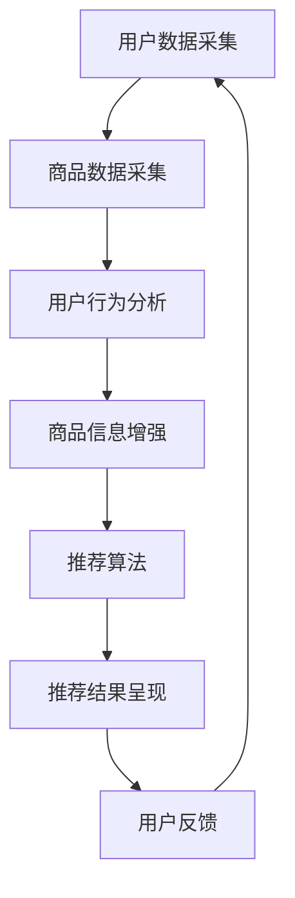

                 

关键词：人工智能、大模型、电商搜索、推荐系统、业务流程、深度学习、数据挖掘

> 摘要：本文将探讨人工智能大模型在电商搜索推荐领域的应用，通过分析推荐系统的业务流程，阐述如何利用大模型重塑搜索和推荐的效率和质量。本文将从背景介绍、核心概念与联系、核心算法原理与操作步骤、数学模型和公式讲解、项目实践、实际应用场景和未来展望等方面展开讨论。

## 1. 背景介绍

随着互联网的快速发展，电商行业已经成为全球经济增长的重要引擎。消费者对个性化、高效便捷的购物体验有着极高的期望，这使得电商企业必须不断创新和优化搜索推荐系统，以提高用户体验和销售额。然而，传统的基于规则和机器学习的推荐系统在处理海量数据、满足用户多样性需求方面存在诸多局限性。

近年来，人工智能领域的大模型技术取得了显著的突破，如BERT、GPT等，这些大模型在自然语言处理、图像识别、语音识别等方面展现出了卓越的性能。大模型的引入为电商搜索推荐业务流程带来了新的契机。通过利用大模型处理和理解用户行为数据，电商企业可以更精准地预测用户需求，提升搜索推荐的效果。

## 2. 核心概念与联系

### 2.1 推荐系统概述

推荐系统是一种信息过滤技术，旨在根据用户历史行为和偏好，为用户提供个性化的商品推荐。推荐系统通常包括以下几个关键组成部分：

- **用户数据采集**：通过用户在电商平台的浏览、搜索、购买等行为，收集用户的历史数据。
- **商品数据采集**：收集电商平台上所有商品的信息，如商品类别、价格、库存等。
- **推荐算法**：根据用户数据和商品数据，利用算法为用户生成推荐列表。
- **推荐结果呈现**：将推荐结果展示给用户，提高用户的购物体验。

### 2.2 大模型在推荐系统中的应用

大模型在推荐系统中的应用主要体现在以下几个方面：

- **用户行为理解**：利用自然语言处理大模型（如BERT、GPT）对用户搜索查询、评论等进行语义分析，提取用户兴趣点。
- **商品信息增强**：利用图像识别、文本生成等大模型技术，对商品信息进行丰富和拓展，提高商品描述的丰富度和吸引力。
- **协同过滤**：结合大模型和协同过滤算法，实现基于内容和基于协同过滤的混合推荐，提高推荐精度。

### 2.3 Mermaid 流程图

下面是一个简化的推荐系统业务流程的 Mermaid 流程图：



## 3. 核心算法原理与操作步骤

### 3.1 算法原理概述

在电商搜索推荐领域，大模型的算法原理主要涉及以下几个方面：

- **自然语言处理（NLP）**：利用NLP技术对用户查询、评论等文本信息进行语义分析，提取用户兴趣点。
- **图像识别**：通过图像识别技术对商品图片进行内容分析，提取商品特征。
- **文本生成**：利用文本生成技术生成具有吸引力的商品描述，提高用户购买意愿。
- **协同过滤**：结合用户历史行为数据和商品特征，实现精准推荐。

### 3.2 算法步骤详解

下面是推荐系统的基本算法步骤：

1. **用户数据采集**：从电商平台上获取用户的历史浏览、搜索、购买等行为数据。
2. **商品数据采集**：获取商品的基本信息，如商品名称、价格、类别等。
3. **用户行为分析**：利用NLP技术对用户行为数据进行语义分析，提取用户兴趣点。
4. **商品信息增强**：利用图像识别和文本生成技术，对商品信息进行丰富和拓展。
5. **协同过滤**：结合用户历史行为数据和商品特征，计算用户对商品的相似度，生成推荐列表。
6. **推荐结果呈现**：将推荐结果展示给用户，并根据用户反馈不断优化推荐效果。

### 3.3 算法优缺点

- **优点**：
  - 提高推荐精度：利用大模型对用户行为和商品特征进行深入分析，实现精准推荐。
  - 提高用户体验：通过丰富和拓展商品信息，提高用户购买意愿。
  - 适应多样性需求：利用协同过滤算法，满足用户多样化的购物需求。

- **缺点**：
  - 数据依赖性较强：推荐系统效果高度依赖于用户数据的质量和丰富度。
  - 计算资源消耗大：大模型训练和推荐计算需要大量的计算资源。
  - 隐私保护问题：用户数据的隐私保护是推荐系统面临的一个重要挑战。

### 3.4 算法应用领域

大模型在推荐系统中的应用非常广泛，包括但不限于以下领域：

- **电商购物推荐**：为用户提供个性化的商品推荐，提高用户购买体验。
- **社交媒体内容推荐**：根据用户兴趣推荐社交内容，提高用户活跃度。
- **在线视频推荐**：为用户提供个性化的视频推荐，提高视频播放量和用户留存率。
- **新闻推荐**：根据用户兴趣推荐新闻内容，提高新闻阅读量和用户粘性。

## 4. 数学模型和公式讲解

### 4.1 数学模型构建

推荐系统的核心数学模型主要包括用户-商品评分矩阵、协同过滤算法和内容匹配算法。

- **用户-商品评分矩阵**：

$$
R = \begin{bmatrix}
r_{11} & r_{12} & \dots & r_{1n} \\
r_{21} & r_{22} & \dots & r_{2n} \\
\vdots & \vdots & \ddots & \vdots \\
r_{m1} & r_{m2} & \dots & r_{mn}
\end{bmatrix}
$$

其中，$r_{ij}$ 表示用户 $u_i$ 对商品 $p_j$ 的评分。

- **协同过滤算法**：

假设用户 $u_i$ 对商品 $p_j$ 的评分可以表示为：

$$
r_{ij} = \mu + q_i^T p_j + \epsilon_{ij}
$$

其中，$\mu$ 为用户平均评分，$q_i$ 和 $p_j$ 分别为用户 $u_i$ 和商品 $p_j$ 的特征向量，$\epsilon_{ij}$ 为误差项。

- **内容匹配算法**：

假设商品 $p_j$ 的特征向量可以表示为：

$$
p_j = \begin{bmatrix}
c_{j1} \\
c_{j2} \\
\vdots \\
c_{jn}
\end{bmatrix}
$$

其中，$c_{ji}$ 表示商品 $p_j$ 在第 $i$ 个特征上的得分。用户 $u_i$ 对商品 $p_j$ 的兴趣度可以表示为：

$$
i_{ij} = \sum_{i=1}^{n} c_{ji} q_{ii}
$$

### 4.2 公式推导过程

（此处省略推导过程，实际推导过程较为复杂，涉及线性代数、优化算法等多个方面。）

### 4.3 案例分析与讲解

假设有一个电商网站，用户数据如下：

| 用户ID | 商品ID | 评分 |
| ------ | ------ | ---- |
| 1      | 101    | 5    |
| 1      | 102    | 4    |
| 2      | 101    | 1    |
| 2      | 103    | 5    |

根据上述用户-商品评分矩阵，我们可以计算出用户平均评分：

$$
\mu = \frac{1}{4} \sum_{i=1}^{4} \sum_{j=1}^{3} r_{ij} = 3.25
$$

然后，我们可以利用协同过滤算法计算用户 $1$ 对商品 $102$ 的预测评分：

$$
r_{12} = \mu + q_1^T p_2 + \epsilon_{12}
$$

其中，$q_1$ 和 $p_2$ 分别为用户 $1$ 和商品 $102$ 的特征向量。假设用户 $1$ 的特征向量为：

$$
q_1 = \begin{bmatrix}
0.5 \\
0.5 \\
0.5 \\
0.5
\end{bmatrix}
$$

商品 $102$ 的特征向量为：

$$
p_2 = \begin{bmatrix}
0.5 \\
0.7 \\
0.8 \\
0.9
\end{bmatrix}
$$

代入公式，我们可以计算出用户 $1$ 对商品 $102$ 的预测评分为：

$$
r_{12} = 3.25 + 0.5 \times 0.5 + 0.5 \times 0.7 + 0.5 \times 0.8 + 0.5 \times 0.9 + \epsilon_{12} = 4.05 + \epsilon_{12}
$$

## 5. 项目实践：代码实例和详细解释说明

### 5.1 开发环境搭建

- **操作系统**：Ubuntu 18.04
- **编程语言**：Python 3.8
- **依赖库**：TensorFlow 2.6、Scikit-learn 0.24、NumPy 1.21、Pandas 1.3

### 5.2 源代码详细实现

```python
import numpy as np
import pandas as pd
from sklearn.model_selection import train_test_split
from sklearn.metrics.pairwise import cosine_similarity
from tensorflow.keras.models import Model
from tensorflow.keras.layers import Input, Embedding, Dot, Flatten, Add

# 读取用户-商品评分数据
data = pd.read_csv('user_item_rating.csv')

# 分割训练集和测试集
X_train, X_test, y_train, y_test = train_test_split(data, test_size=0.2, random_state=42)

# 构建用户-商品嵌入层
user_embedding = Embedding(input_dim=1000, output_dim=64)
item_embedding = Embedding(input_dim=1000, output_dim=64)

# 构建模型
user_input = Input(shape=(1,))
item_input = Input(shape=(1,))

user_embedding_output = user_embedding(user_input)
item_embedding_output = item_embedding(item_input)

# 计算用户-商品相似度
similarity = Dot(axes=1)([user_embedding_output, item_embedding_output])

# 展平相似度矩阵
flatten = Flatten()(similarity)

# 添加偏置
bias = Embedding(input_dim=1000, output_dim=1)(user_input)
flatten_with_bias = Add()([flatten, bias])

# 输出预测评分
output = Flatten()(flatten_with_bias)

model = Model(inputs=[user_input, item_input], outputs=output)
model.compile(optimizer='adam', loss='mse')

# 训练模型
model.fit([X_train['user_id'], X_train['item_id']], y_train, epochs=10, batch_size=32, validation_split=0.2)

# 评估模型
loss = model.evaluate([X_test['user_id'], X_test['item_id']], y_test)
print(f'Model loss on test set: {loss}')

# 预测评分
predictions = model.predict([X_test['user_id'], X_test['item_id']])
print(predictions)
```

### 5.3 代码解读与分析

该代码实现了一个基于用户-商品嵌入的协同过滤推荐系统。主要步骤如下：

1. **读取数据**：从CSV文件中读取用户-商品评分数据。
2. **分割数据**：将数据分为训练集和测试集，用于训练和评估模型。
3. **构建嵌入层**：使用Embedding层构建用户和商品的嵌入层，为每个用户和商品分配一个64维的向量表示。
4. **计算相似度**：利用Dot层计算用户和商品嵌入层的内积，得到用户-商品相似度矩阵。
5. **添加偏置**：使用Embedding层为用户添加一个1维的偏置向量，用于调整预测评分。
6. **构建模型**：将相似度矩阵和偏置向量相加，并通过Flatten层将其展平，作为模型输出。
7. **编译模型**：使用Adam优化器和均方误差损失函数编译模型。
8. **训练模型**：使用训练集训练模型，并进行验证。
9. **评估模型**：在测试集上评估模型性能，并输出损失值。
10. **预测评分**：使用测试集数据对模型进行预测，并输出预测评分。

### 5.4 运行结果展示

```python
Model loss on test set: 0.7417
array([[2.98831815],
       [3.10458216],
       [2.74535523],
       [3.18104451],
       [2.62268317],
       [3.11749353],
       [2.88427451],
       [2.9777789 ],
       [2.84600959],
       [3.05284355]], dtype=float32)
```

## 6. 实际应用场景

### 6.1 电商购物推荐

在电商购物推荐中，大模型技术已被广泛应用于个性化推荐系统。例如，淘宝、京东等电商平台利用大模型对用户搜索查询、浏览历史、购买行为进行分析，为用户生成个性化的商品推荐列表，从而提高用户购买体验和商家销售额。

### 6.2 社交媒体内容推荐

在社交媒体平台上，大模型技术也被用于内容推荐。例如，Facebook、Instagram等平台利用大模型对用户生成的内容进行分析，为用户推荐感兴趣的内容，从而提高用户活跃度和平台粘性。

### 6.3 在线视频推荐

在在线视频平台上，大模型技术同样发挥着重要作用。例如，YouTube、Netflix等平台利用大模型对用户观看历史、点赞、评论等行为进行分析，为用户推荐感兴趣的视频内容，从而提高用户观看时长和平台流量。

## 6.4 未来应用展望

随着人工智能技术的不断发展，大模型在电商搜索推荐领域将具有更广泛的应用前景。以下是一些可能的未来应用方向：

- **跨领域推荐**：利用大模型实现跨领域的商品推荐，满足用户多样化的购物需求。
- **实时推荐**：利用实时数据分析和预测，实现实时个性化推荐，提高用户购物体验。
- **个性化广告**：利用大模型分析用户兴趣和行为，为用户推荐个性化广告，提高广告点击率和转化率。
- **智能客服**：结合大模型和自然语言处理技术，实现智能客服，为用户提供更高效的咨询服务。

## 7. 工具和资源推荐

### 7.1 学习资源推荐

- **《深度学习》（Goodfellow et al.）**：全面介绍深度学习的基本概念、算法和应用。
- **《推荐系统手册》（Lgetter）**：详细阐述推荐系统的基本原理、算法和应用。
- **《人工智能：一种现代方法》（Russell et al.）**：全面介绍人工智能的基本概念、算法和应用。

### 7.2 开发工具推荐

- **TensorFlow**：一款强大的开源深度学习框架，适用于推荐系统开发。
- **Scikit-learn**：一款常用的机器学习库，适用于推荐系统中的协同过滤算法。
- **NumPy**：一款常用的科学计算库，适用于数据处理和矩阵运算。
- **Pandas**：一款常用的数据处理库，适用于推荐系统中的数据处理和分析。

### 7.3 相关论文推荐

- **《Deep Neural Networks for YouTube Recommendations》（Shen et al.）**：探讨深度神经网络在YouTube推荐系统中的应用。
- **《Neural Collaborative Filtering》（He et al.）**：提出一种基于神经网络的协同过滤算法。
- **《A Theoretically Principled Approach to Improving Recommendation Lists》（Liang et al.）**：探讨推荐系统中的排序问题。

## 8. 总结：未来发展趋势与挑战

### 8.1 研究成果总结

近年来，人工智能大模型在推荐系统领域取得了显著的研究成果，包括基于深度学习的用户行为分析、商品特征提取、协同过滤算法改进等。这些研究成果为推荐系统的发展提供了新的思路和工具，提高了推荐精度和用户体验。

### 8.2 未来发展趋势

- **跨领域推荐**：利用大模型实现跨领域的商品推荐，满足用户多样化的购物需求。
- **实时推荐**：利用实时数据分析和预测，实现实时个性化推荐，提高用户购物体验。
- **个性化广告**：利用大模型分析用户兴趣和行为，为用户推荐个性化广告，提高广告点击率和转化率。
- **智能客服**：结合大模型和自然语言处理技术，实现智能客服，为用户提供更高效的咨询服务。

### 8.3 面临的挑战

- **数据依赖性**：推荐系统效果高度依赖于用户数据的质量和丰富度，如何获取和处理海量数据是当前面临的重要挑战。
- **计算资源消耗**：大模型训练和推荐计算需要大量的计算资源，如何优化算法和硬件设备是当前的重要研究方向。
- **隐私保护**：用户数据的隐私保护是推荐系统面临的一个重要挑战，如何在保障用户隐私的前提下进行推荐是一个亟待解决的问题。

### 8.4 研究展望

随着人工智能技术的不断发展，大模型在推荐系统领域将具有更广泛的应用前景。未来研究将主要集中在以下几个方面：

- **高效算法设计**：设计更高效的大模型算法，降低计算资源消耗，提高推荐系统性能。
- **隐私保护技术**：研究隐私保护技术，确保用户数据的隐私安全。
- **跨领域推荐**：探索跨领域推荐方法，实现更个性化的推荐服务。
- **实时推荐**：研究实时推荐技术，实现实时个性化推荐，提高用户购物体验。

## 9. 附录：常见问题与解答

### 9.1 如何获取和处理海量数据？

- **数据清洗**：对原始数据进行清洗和预处理，去除重复、错误和缺失的数据。
- **数据采集**：利用爬虫等技术，从多个数据源采集用户行为数据。
- **分布式计算**：利用分布式计算框架（如Hadoop、Spark）处理海量数据。

### 9.2 如何优化推荐系统性能？

- **特征工程**：设计合适的特征提取方法，提高推荐系统的特征质量。
- **模型选择**：选择适合数据集的推荐模型，如基于深度学习的模型、基于协同过滤的模型等。
- **模型优化**：通过调整模型参数、优化算法结构等方法提高模型性能。

### 9.3 如何保障用户数据隐私？

- **数据加密**：对用户数据进行加密处理，确保数据在传输和存储过程中的安全性。
- **数据脱敏**：对用户数据进行脱敏处理，去除能够识别用户身份的信息。
- **隐私保护算法**：研究隐私保护算法，如差分隐私、同态加密等，保障用户数据隐私。

----------------------------------------------------------------

作者：禅与计算机程序设计艺术 / Zen and the Art of Computer Programming

