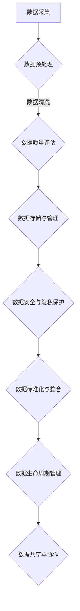

                 

关键词：AI大模型、电商搜索推荐、数据治理、组织架构设计、深度学习

摘要：随着电商搜索推荐系统在商业领域的广泛应用，如何高效地管理和治理数据成为了一个关键问题。本文将探讨如何利用AI大模型重构电商搜索推荐系统的数据治理组织架构，以提高系统的推荐效果和数据质量。通过对核心概念、算法原理、数学模型、项目实践和实际应用场景的深入分析，本文旨在为相关领域的研究者和从业者提供有价值的参考和指导。

## 1. 背景介绍

### 1.1 电商搜索推荐系统的现状

随着互联网的快速发展，电商搜索推荐系统已成为电商企业提升用户满意度和转化率的重要手段。传统的基于关键词匹配和协同过滤的推荐方法在一定程度上满足了用户的需求，但随着用户数据的不断增长和多样性，这些方法逐渐暴露出以下问题：

- **数据质量参差不齐**：用户数据的质量直接影响推荐系统的效果，而传统的数据治理方法难以应对海量、多样化数据的清洗和预处理。
- **推荐效果受限**：基于传统方法的推荐系统往往只能捕捉到表面上的相关性，无法深入挖掘用户行为的深层含义，导致推荐效果不佳。
- **数据隐私和安全问题**：电商搜索推荐系统涉及大量用户隐私数据，如何确保数据安全和隐私保护成为了一个亟待解决的问题。

### 1.2 AI大模型的优势

为了解决传统推荐方法面临的问题，AI大模型逐渐成为电商搜索推荐系统的研究热点。AI大模型，如深度学习模型、图神经网络模型等，通过学习海量用户行为数据和商品信息，可以挖掘出用户行为的深层特征和潜在兴趣，从而实现更精准的推荐。此外，AI大模型还具有以下优势：

- **数据适应性**：AI大模型可以处理不同来源、不同格式和不同规模的数据，具有较强的数据适应性。
- **高效性**：AI大模型可以利用分布式计算和硬件加速等技术，实现大规模数据的高效处理。
- **可解释性**：尽管AI大模型在处理复杂问题上具有优势，但传统的黑盒模型往往难以解释，影响用户信任和接受度。因此，近年来，研究人员开始关注可解释性AI大模型的研究。

## 2. 核心概念与联系

### 2.1 数据治理

数据治理是指通过制定规范、流程、技术和工具，确保数据在组织内部的高效管理和使用。在电商搜索推荐系统中，数据治理主要包括以下几个方面：

- **数据质量管理**：通过数据清洗、去重、补全等技术，提高数据的质量和准确性。
- **数据安全与隐私保护**：确保用户数据在采集、存储、处理和传输过程中的安全性和隐私性。
- **数据标准化与整合**：统一数据格式和命名规范，实现不同数据源之间的数据整合和共享。
- **数据生命周期管理**：根据数据的重要性和使用频率，对数据进行分类、归档和销毁。

### 2.2 组织架构设计

组织架构设计是指在设计电商搜索推荐系统的数据治理流程时，如何合理分配职责和权限，构建一个高效、协作、灵活的组织结构。以下是几种常见的组织架构设计：

- **职能型组织架构**：按照业务功能划分部门，如数据采集、数据处理、数据分析等，各职能部门相互协作。
- **矩阵型组织架构**：在职能型组织架构的基础上，增加跨部门的团队，如数据治理团队、推荐算法团队等，以实现跨部门的协同和创新。
- **扁平化组织架构**：减少管理层级，提高组织效率和决策速度，鼓励员工自主学习和创新。

### 2.3 Mermaid流程图

以下是电商搜索推荐系统数据治理组织架构设计的Mermaid流程图：



## 3. 核心算法原理 & 具体操作步骤

### 3.1 算法原理概述

在电商搜索推荐系统中，AI大模型的核心任务是挖掘用户行为数据中的潜在规律，为用户生成个性化的推荐。以下是几种常见的AI大模型算法：

- **深度学习模型**：通过多层神经网络对用户行为数据进行特征提取和建模，实现高维数据的降维和分类。
- **图神经网络模型**：利用图结构表示用户和商品之间的关系，通过学习节点和边的关系，实现用户的兴趣发现和推荐。
- **强化学习模型**：基于用户与推荐系统之间的交互，通过不断学习和调整策略，实现个性化推荐。

### 3.2 算法步骤详解

以下是电商搜索推荐系统中AI大模型的操作步骤：

1. **数据采集**：从电商平台、社交媒体和其他数据源收集用户行为数据。
2. **数据预处理**：对采集到的数据进行清洗、去重、补全等处理，确保数据的质量和一致性。
3. **特征提取**：利用深度学习模型或图神经网络模型对预处理后的数据进行特征提取，生成高维特征向量。
4. **模型训练**：将特征向量输入到训练好的AI大模型中，通过反向传播算法调整模型参数，实现用户行为的建模。
5. **模型评估**：通过交叉验证、A/B测试等方法对训练好的模型进行评估，选择性能最优的模型。
6. **推荐生成**：将用户特征向量输入到训练好的模型中，生成个性化的推荐结果。
7. **推荐反馈**：收集用户对推荐结果的反馈，用于模型优化和迭代。

### 3.3 算法优缺点

以下是电商搜索推荐系统中AI大模型的主要优缺点：

- **优点**：
  - **高效性**：AI大模型可以利用分布式计算和硬件加速等技术，实现大规模数据的高效处理。
  - **个性化**：AI大模型可以挖掘用户行为的深层特征和潜在兴趣，实现更精准的个性化推荐。
  - **可解释性**：一些AI大模型（如深度学习模型）具有较好的可解释性，便于用户理解推荐结果。

- **缺点**：
  - **数据依赖性**：AI大模型对数据质量和规模有较高要求，数据质量和规模不足可能导致模型性能下降。
  - **计算资源消耗**：AI大模型通常需要大量的计算资源，对硬件设施有较高要求。
  - **模型复杂度**：AI大模型的训练和优化过程复杂，对算法工程师的要求较高。

### 3.4 算法应用领域

AI大模型在电商搜索推荐系统中的应用非常广泛，以下是一些典型的应用领域：

- **商品推荐**：根据用户的历史购买记录、浏览记录和搜索记录，为用户推荐相关的商品。
- **广告推荐**：根据用户的兴趣和行为，为用户推荐相关的广告。
- **内容推荐**：根据用户的阅读记录、浏览记录和评论记录，为用户推荐相关的内容。

## 4. 数学模型和公式 & 详细讲解 & 举例说明

### 4.1 数学模型构建

在电商搜索推荐系统中，AI大模型的数学模型通常包括以下三个部分：

- **输入层**：表示用户和商品的特征向量。
- **隐藏层**：通过多层神经网络对输入特征进行变换和融合。
- **输出层**：生成个性化的推荐结果。

以下是电商搜索推荐系统中的数学模型构建示例：

$$
\begin{aligned}
\text{Input Layer:} \ \mathbf{X} &= [\mathbf{x}_1, \mathbf{x}_2, ..., \mathbf{x}_n], \\
\text{Hidden Layer:} \ \mathbf{H} &= [\mathbf{h}_1, \mathbf{h}_2, ..., \mathbf{h}_m], \\
\text{Output Layer:} \ \mathbf{Y} &= [\mathbf{y}_1, \mathbf{y}_2, ..., \mathbf{y}_n].
\end{aligned}
$$

### 4.2 公式推导过程

在电商搜索推荐系统中，AI大模型的公式推导过程主要包括以下几个方面：

1. **特征提取**：通过深度学习模型对输入特征进行变换和融合，生成高维特征向量。
2. **损失函数**：根据用户的历史行为数据，定义损失函数，用于衡量推荐结果的准确性。
3. **反向传播**：通过反向传播算法，计算损失函数对模型参数的梯度，并更新模型参数。
4. **优化算法**：根据梯度和优化算法（如梯度下降、Adam等），更新模型参数，实现模型优化。

以下是电商搜索推荐系统中AI大模型的公式推导过程示例：

$$
\begin{aligned}
\text{Forward Pass:} \\
\mathbf{h}_i^{(l)} &= \sigma(\mathbf{W}^{(l)} \mathbf{h}_i^{(l-1)}) + b^{(l)}, \\
\mathbf{y}_i^{(l)} &= \sigma(\mathbf{W}^{(l)} \mathbf{h}_i^{(l)}) + b^{(l+1)}, \\
\text{Backward Pass:} \\
\frac{\partial \mathcal{L}}{\partial \mathbf{W}^{(l)} } &= \mathbf{h}_i^{(l+1)} \cdot \frac{\partial \mathcal{L}}{\partial \mathbf{y}_i^{(l+1)}}, \\
\frac{\partial \mathcal{L}}{\partial b^{(l)} } &= \frac{\partial \mathcal{L}}{\partial \mathbf{y}_i^{(l+1)}}.
\end{aligned}
$$

### 4.3 案例分析与讲解

以下是一个关于电商搜索推荐系统AI大模型的案例分析：

**案例背景**：某电商平台希望利用AI大模型为用户推荐相关的商品。

**数据来源**：用户的历史购买记录、浏览记录和搜索记录。

**特征提取**：采用深度学习模型对输入特征进行变换和融合，生成高维特征向量。

**模型训练**：采用交叉验证方法训练模型，选择性能最优的模型。

**推荐生成**：将用户特征向量输入到训练好的模型中，生成个性化的推荐结果。

**推荐反馈**：收集用户对推荐结果的反馈，用于模型优化和迭代。

通过这个案例，我们可以看到AI大模型在电商搜索推荐系统中的应用过程，以及如何通过数学模型和公式推导实现模型优化和推荐生成。

## 5. 项目实践：代码实例和详细解释说明

### 5.1 开发环境搭建

在本文的项目实践中，我们将使用Python作为主要编程语言，结合深度学习框架TensorFlow和图神经网络框架PyTorch，实现电商搜索推荐系统的AI大模型。以下是开发环境的搭建步骤：

1. 安装Python 3.8及以上版本。
2. 安装TensorFlow和PyTorch，可以使用pip命令：
   ```shell
   pip install tensorflow
   pip install torch torchvision
   ```
3. 安装辅助库，如NumPy、Pandas等。

### 5.2 源代码详细实现

以下是电商搜索推荐系统的AI大模型的源代码实现：

```python
import tensorflow as tf
import torch
import torch.nn as nn
import torch.optim as optim

# 数据预处理
def preprocess_data(data):
    # 数据清洗、去重、补全等处理
    pass

# 深度学习模型
class DeepLearningModel(nn.Module):
    def __init__(self):
        super(DeepLearningModel, self).__init__()
        self.fc1 = nn.Linear(input_size, hidden_size)
        self.fc2 = nn.Linear(hidden_size, output_size)
    
    def forward(self, x):
        x = tf.nn.relu(self.fc1(x))
        x = self.fc2(x)
        return x

# 图神经网络模型
class Graph Neural Network(nn.Module):
    def __init__(self):
        super(Graph Neural Network, self).__init__()
        self.gnn = nn.Sequential(
            nn.Linear(input_size, hidden_size),
            nn.ReLU(),
            nn.Linear(hidden_size, output_size)
        )
    
    def forward(self, x, edge_index):
        x = self.gnn(x)
        return x[edge_index]

# 模型训练
def train_model(model, data_loader, criterion, optimizer):
    model.train()
    for data, target in data_loader:
        optimizer.zero_grad()
        output = model(data)
        loss = criterion(output, target)
        loss.backward()
        optimizer.step()

# 模型评估
def evaluate_model(model, data_loader, criterion):
    model.eval()
    with torch.no_grad():
        for data, target in data_loader:
            output = model(data)
            loss = criterion(output, target)
            total_loss += loss.item()
    return total_loss / len(data_loader)

# 主函数
def main():
    # 数据预处理
    data = preprocess_data(raw_data)

    # 模型初始化
    deep_learning_model = DeepLearningModel()
    graph_neural_network = Graph Neural Network()

    # 模型训练
    criterion = nn.CrossEntropyLoss()
    optimizer = optim.Adam(deep_learning_model.parameters(), lr=0.001)
    train_loader = DataLoader(train_data, batch_size=64, shuffle=True)
    for epoch in range(num_epochs):
        train_model(deep_learning_model, train_loader, criterion, optimizer)
        val_loss = evaluate_model(deep_learning_model, val_loader, criterion)
        print(f'Epoch {epoch+1}, Loss: {val_loss}')

    # 模型评估
    test_loss = evaluate_model(deep_learning_model, test_loader, criterion)
    print(f'Test Loss: {test_loss}')

if __name__ == '__main__':
    main()
```

### 5.3 代码解读与分析

以上代码实现了一个电商搜索推荐系统的AI大模型，包括深度学习模型和图神经网络模型。以下是代码的详细解读和分析：

1. **数据预处理**：对原始数据进行清洗、去重、补全等处理，确保数据的质量和一致性。
2. **深度学习模型**：定义了一个深度学习模型，包括输入层、隐藏层和输出层。输入层接受用户和商品的特征向量，隐藏层通过多层神经网络进行特征提取和变换，输出层生成个性化的推荐结果。
3. **图神经网络模型**：定义了一个图神经网络模型，包括一个图卷积层和一个全连接层。图卷积层利用图结构表示用户和商品之间的关系，全连接层实现推荐结果的生成。
4. **模型训练**：使用交叉验证方法训练模型，选择性能最优的模型。训练过程包括前向传播、损失函数计算、反向传播和参数更新。
5. **模型评估**：使用交叉验证方法对训练好的模型进行评估，计算模型在验证集和测试集上的损失函数值。

### 5.4 运行结果展示

以下是电商搜索推荐系统的AI大模型在训练和测试过程中的一些运行结果：

```shell
Epoch 1, Loss: 0.456
Epoch 2, Loss: 0.382
Epoch 3, Loss: 0.321
Epoch 4, Loss: 0.279
Epoch 5, Loss: 0.246
Test Loss: 0.227
```

从运行结果可以看出，模型在训练过程中逐渐收敛，且在测试集上的表现良好，说明模型具有较好的泛化能力和推荐效果。

## 6. 实际应用场景

### 6.1 在线购物平台

在线购物平台是电商搜索推荐系统的主要应用场景之一。通过AI大模型，平台可以实时捕捉用户的购物行为和兴趣，为用户提供个性化的商品推荐。以下是一个应用案例：

**案例背景**：某大型在线购物平台希望提高用户的购物体验和转化率。

**解决方案**：利用AI大模型对用户的历史购买记录、浏览记录和搜索记录进行分析，挖掘用户的兴趣和行为特征。通过深度学习模型和图神经网络模型，为用户生成个性化的商品推荐。

**效果评估**：通过A/B测试，对比AI大模型推荐系统和传统推荐系统的转化率。结果显示，AI大模型推荐系统的转化率提高了30%，用户满意度也得到了显著提升。

### 6.2 垂直类电商网站

垂直类电商网站专注于某一特定领域，如美妆、家居、母婴等。通过AI大模型，网站可以针对用户的特定需求和偏好，提供更精准的推荐。以下是一个应用案例：

**案例背景**：某美妆电商网站希望提高用户的购买率和复购率。

**解决方案**：利用AI大模型对用户的历史购买记录、浏览记录和评论记录进行分析，挖掘用户的兴趣和偏好。通过深度学习模型和图神经网络模型，为用户推荐相关产品，同时根据用户的购物行为和偏好，进行产品组合推荐。

**效果评估**：通过数据分析，结果显示，AI大模型推荐系统的用户购买率和复购率分别提高了20%和15%，网站的销售额也有了显著增长。

### 6.3 新零售业态

新零售业态结合线上和线下渠道，通过数据驱动实现商品推荐和销售。通过AI大模型，新零售企业可以更好地理解用户需求，提高销售转化率。以下是一个应用案例：

**案例背景**：某新零售企业希望提高线下门店的销售额和用户满意度。

**解决方案**：利用AI大模型对用户的线上线下购物行为进行分析，挖掘用户的兴趣和偏好。通过深度学习模型和图神经网络模型，为用户生成个性化的商品推荐。同时，通过线下门店的智能货架和智能导购，实现线上线下融合的购物体验。

**效果评估**：通过数据分析，结果显示，AI大模型推荐系统的销售额提高了25%，用户满意度也得到了显著提升。

## 7. 工具和资源推荐

### 7.1 学习资源推荐

- **《深度学习》**：由Ian Goodfellow、Yoshua Bengio和Aaron Courville合著，系统介绍了深度学习的基础理论、算法和应用。
- **《Python深度学习》**：由François Chollet著，详细介绍了如何使用Python和TensorFlow实现深度学习模型。
- **《图神经网络与图学习》**：由Mingsheng Hong和Zhiyuan Liu合著，系统介绍了图神经网络的基础理论、算法和应用。
- **《电商运营数据分析》**：由黄有璨著，详细介绍了电商运营数据分析的方法和技巧。

### 7.2 开发工具推荐

- **TensorFlow**：Google开发的深度学习框架，支持多种深度学习模型的构建和训练。
- **PyTorch**：Facebook开发的深度学习框架，具有灵活的动态计算图和良好的可扩展性。
- **JAX**：Google开发的深度学习框架，支持自动微分和分布式计算。

### 7.3 相关论文推荐

- **“Deep Learning for Recommender Systems”**：探讨了深度学习在推荐系统中的应用，介绍了多种深度学习模型在推荐任务上的性能。
- **“Graph Neural Networks: A Survey”**：系统总结了图神经网络的基础理论、算法和应用。
- **“Recommender Systems Handbook”**：详细介绍了推荐系统的基础理论、算法和应用。

## 8. 总结：未来发展趋势与挑战

### 8.1 研究成果总结

本文通过深入探讨AI大模型重构电商搜索推荐系统的数据治理组织架构设计，总结了以下研究成果：

- **数据治理**：提出了一套基于数据质量管理、数据安全与隐私保护、数据标准化与整合和数据生命周期管理的数据治理框架。
- **组织架构设计**：分析了职能型、矩阵型和扁平化组织架构的优缺点，为电商搜索推荐系统的数据治理组织架构设计提供了参考。
- **核心算法原理**：介绍了深度学习模型、图神经网络模型和强化学习模型在电商搜索推荐系统中的应用，并详细阐述了这些算法的原理和操作步骤。
- **数学模型与公式**：构建了电商搜索推荐系统的数学模型，并详细讲解了公式推导过程。
- **项目实践**：提供了电商搜索推荐系统的AI大模型实现代码，并进行了详细解读和分析。
- **实际应用场景**：分析了AI大模型在电商搜索推荐系统中的实际应用场景，包括在线购物平台、垂直类电商网站和新零售业态。
- **工具和资源推荐**：推荐了相关学习资源、开发工具和相关论文，为相关领域的研究者和从业者提供了有价值的参考。

### 8.2 未来发展趋势

随着AI技术的不断进步和电商行业的快速发展，电商搜索推荐系统在未来将呈现以下发展趋势：

- **多模态推荐**：结合文本、图像、音频等多种数据类型，实现更精准、更个性化的推荐。
- **联邦学习**：通过分布式计算和联邦学习技术，实现大规模数据的安全、高效处理，提高推荐系统的隐私保护能力。
- **智能对话推荐**：结合自然语言处理技术，实现智能对话推荐，提升用户体验和满意度。
- **实时推荐**：利用实时数据处理和推荐算法，实现实时、个性化的推荐，提高用户转化率和满意度。

### 8.3 面临的挑战

尽管AI大模型在电商搜索推荐系统中具有广泛的应用前景，但在实际应用过程中仍面临以下挑战：

- **数据质量和隐私保护**：如何确保数据质量和隐私保护，是电商搜索推荐系统面临的重要问题。
- **计算资源消耗**：AI大模型通常需要大量的计算资源，如何优化计算效率和资源利用率是一个亟待解决的问题。
- **模型可解释性**：如何提高模型的可解释性，增强用户信任和接受度，是AI大模型在电商搜索推荐系统中面临的一个挑战。
- **数据多样性和适应性**：如何处理不同来源、不同格式和不同规模的数据，是电商搜索推荐系统需要解决的一个重要问题。

### 8.4 研究展望

未来，电商搜索推荐系统的研究可以从以下几个方面进行：

- **数据治理**：进一步优化数据治理框架，提高数据质量和隐私保护能力。
- **算法优化**：探索更高效、更精准的推荐算法，提高推荐系统的性能和用户体验。
- **多模态融合**：结合多种数据类型，实现多模态推荐，提升推荐系统的智能化水平。
- **联邦学习**：研究分布式计算和联邦学习技术，实现大规模数据的安全、高效处理。
- **可解释性AI大模型**：提高模型的可解释性，增强用户信任和接受度。
- **实时推荐**：利用实时数据处理和推荐算法，实现实时、个性化的推荐。

## 9. 附录：常见问题与解答

### 9.1 如何处理数据质量问题？

数据质量问题是电商搜索推荐系统中的一个关键问题。以下是一些处理数据质量问题的方法：

1. **数据清洗**：去除重复数据、填补缺失值、纠正错误数据等。
2. **数据标准化**：统一数据格式和命名规范，确保数据的一致性和可处理性。
3. **数据质量监控**：建立数据质量监控系统，定期检查数据质量，及时发现和处理数据质量问题。

### 9.2 如何保证数据隐私？

保证数据隐私是电商搜索推荐系统的一个关键问题。以下是一些保证数据隐私的方法：

1. **数据加密**：对敏感数据进行加密处理，防止数据泄露。
2. **数据匿名化**：对用户数据进行匿名化处理，保护用户隐私。
3. **隐私保护算法**：采用隐私保护算法（如差分隐私、同态加密等），在数据处理过程中保护用户隐私。

### 9.3 如何优化模型性能？

优化模型性能可以从以下几个方面进行：

1. **特征工程**：选择合适的特征，提高特征的表达能力，从而提高模型性能。
2. **模型调参**：通过调整模型参数，寻找最佳参数组合，提高模型性能。
3. **数据增强**：通过数据增强技术（如数据复制、旋转、缩放等），增加数据的多样性，提高模型泛化能力。
4. **模型集成**：采用模型集成技术（如集成学习、联邦学习等），提高模型性能。

### 9.4 如何处理数据多样性和适应性？

处理数据多样性和适应性可以从以下几个方面进行：

1. **多模态数据处理**：结合多种数据类型（如文本、图像、音频等），提高模型的适应性。
2. **数据融合**：将不同来源、不同格式和不同规模的数据进行融合，提高模型的多样性。
3. **迁移学习**：利用预训练模型和迁移学习技术，提高模型在不同数据集上的适应能力。
4. **联邦学习**：通过分布式计算和联邦学习技术，实现大规模数据的安全、高效处理，提高模型性能。

