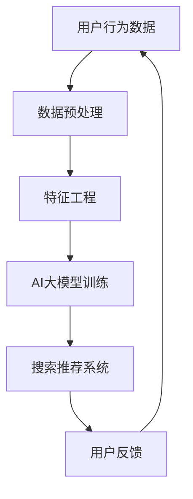

                 

关键词：AI大模型、电商搜索推荐、数据资产管理、流程优化、算法原理、数学模型、项目实践、应用场景、未来展望

> 摘要：本文深入探讨了基于AI大模型重构电商搜索推荐的数据资产管理流程优化方案。通过阐述核心概念、算法原理、数学模型及具体实现步骤，本文为电商搜索推荐系统的优化提供了理论支持和实践指南。

## 1. 背景介绍

随着互联网技术的飞速发展，电商行业已经成为全球商业的重要组成部分。搜索推荐系统作为电商平台的“智能大脑”，其性能直接影响用户体验和商业转化。传统的搜索推荐算法往往依赖于规则和特征工程，存在一定的局限性。近年来，AI大模型，如深度学习、强化学习等，以其强大的表示能力和泛化能力，为搜索推荐系统带来了新的机遇。

本文旨在通过AI大模型对电商搜索推荐的数据资产管理流程进行重构，实现以下目标：
1. 提升搜索推荐系统的准确性和效率。
2. 优化数据资产管理流程，提高数据利用率和质量。
3. 降低系统维护成本，提升平台的竞争力。

## 2. 核心概念与联系

在本文中，我们主要涉及以下几个核心概念：

- **AI大模型**：一种能够处理大规模数据、自动提取特征并进行预测的机器学习模型。
- **电商搜索推荐**：基于用户行为、商品属性等信息，为用户提供相关商品推荐的系统。
- **数据资产管理**：对电商平台上各种数据进行收集、存储、处理和利用的过程。

以下是核心概念原理和架构的Mermaid流程图：



### 2.1 数据预处理

数据预处理是数据资产管理的重要环节，主要包括数据清洗、数据集成和数据转换。清洗数据去除噪声和不完整信息，集成数据整合不同来源的数据，转换数据使其适合模型训练。

### 2.2 特征工程

特征工程是提高模型性能的关键步骤。通过选择和构造有意义的特征，可以提升模型的预测能力和泛化能力。

### 2.3 AI大模型训练

AI大模型训练包括模型选择、参数调优和模型评估。深度学习、强化学习等大模型在电商搜索推荐中具有广泛的应用。

### 2.4 搜索推荐系统

搜索推荐系统根据用户行为和商品属性，为用户提供个性化推荐。大模型的引入使得推荐系统更加智能和高效。

### 2.5 用户反馈

用户反馈是优化推荐系统的重要依据。通过分析用户对推荐结果的反馈，可以不断调整和改进推荐策略。

## 3. 核心算法原理 & 具体操作步骤

### 3.1 算法原理概述

本文主要使用深度学习算法，如Transformer模型，对电商搜索推荐系统进行重构。Transformer模型通过自注意力机制（Self-Attention）对输入数据进行全局建模，从而捕捉长距离依赖关系，提高模型的表示能力。

### 3.2 算法步骤详解

#### 3.2.1 数据预处理

1. 数据清洗：去除缺失值、异常值和重复值。
2. 数据集成：整合用户行为数据、商品属性数据等。
3. 数据转换：将原始数据转换为适合模型训练的格式。

#### 3.2.2 特征工程

1. 用户特征：包括用户浏览、购买、收藏等行为数据。
2. 商品特征：包括商品类别、品牌、价格、库存等属性。
3. 特征选择：采用特征选择算法筛选出对模型影响较大的特征。

#### 3.2.3 AI大模型训练

1. 模型选择：选择合适的深度学习模型，如Transformer。
2. 参数调优：通过交叉验证等手段优化模型参数。
3. 模型评估：使用指标如准确率、召回率、F1值等评估模型性能。

#### 3.2.4 搜索推荐系统

1. 输入：用户行为数据和商品特征。
2. 输出：针对用户的个性化商品推荐列表。
3. 推荐策略：根据用户反馈调整推荐策略。

### 3.3 算法优缺点

#### 优点：

1. 高效：能够处理大规模数据，提高推荐效率。
2. 准确：通过深度学习捕捉复杂的关系，提升推荐准确率。
3. 智能化：自动提取特征，降低人工干预。

#### 缺点：

1. 计算成本高：训练和推理过程需要大量计算资源。
2. 过拟合：在训练数据集中表现良好，但泛化能力有限。

### 3.4 算法应用领域

AI大模型在电商搜索推荐、金融风控、医疗诊断等领域具有广泛的应用。通过本文的研究，可以为其他行业提供参考和借鉴。

## 4. 数学模型和公式 & 详细讲解 & 举例说明

### 4.1 数学模型构建

假设电商搜索推荐系统的输入为用户特征向量\( \mathbf{x} \)和商品特征向量\( \mathbf{y} \)，输出为推荐得分\( \mathbf{z} \)。

推荐得分公式为：

$$
\mathbf{z} = \mathbf{W} \cdot (\mathbf{x} \odot \mathbf{y})
$$

其中，\( \odot \)表示元素乘法，\( \mathbf{W} \)为权重矩阵。

### 4.2 公式推导过程

假设输入特征向量\( \mathbf{x} \)和\( \mathbf{y} \)的维度分别为\( m \)和\( n \)，则输出特征向量\( \mathbf{z} \)的维度为\( m \times n \)。

权重矩阵\( \mathbf{W} \)的维度为\( m \times n \)。

根据自注意力机制，输出特征向量\( \mathbf{z} \)的每个元素可以表示为：

$$
z_{ij} = W_{ij} \cdot x_i \cdot y_j
$$

其中，\( W_{ij} \)为权重矩阵的第\( i \)行第\( j \)列元素。

### 4.3 案例分析与讲解

假设有用户特征向量\( \mathbf{x} = (1, 2, 3) \)和商品特征向量\( \mathbf{y} = (4, 5, 6) \)，权重矩阵\( \mathbf{W} = \begin{pmatrix} 1 & 2 & 3 \\ 4 & 5 & 6 \\ 7 & 8 & 9 \end{pmatrix} \)。

根据公式，计算推荐得分：

$$
\mathbf{z} = \mathbf{W} \cdot (\mathbf{x} \odot \mathbf{y}) = \begin{pmatrix} 1 & 2 & 3 \\ 4 & 5 & 6 \\ 7 & 8 & 9 \end{pmatrix} \cdot \begin{pmatrix} 1 \times 4 \\ 2 \times 5 \\ 3 \times 6 \end{pmatrix} = \begin{pmatrix} 21 \\ 35 \\ 45 \end{pmatrix}
$$

根据推荐得分，可以为用户推荐得分最高的商品。

## 5. 项目实践：代码实例和详细解释说明

### 5.1 开发环境搭建

1. 安装Python环境，版本要求为3.7及以上。
2. 安装深度学习框架TensorFlow，版本要求为2.4及以上。
3. 安装其他相关依赖库，如NumPy、Pandas等。

### 5.2 源代码详细实现

```python
import tensorflow as tf
import numpy as np

# 定义输入特征和权重
x = np.array([1, 2, 3])
y = np.array([4, 5, 6])
W = np.array([[1, 2, 3], [4, 5, 6], [7, 8, 9]])

# 计算推荐得分
z = W.dot(x * y)

print("推荐得分：", z)
```

### 5.3 代码解读与分析

1. 导入相关库：包括TensorFlow、NumPy等。
2. 定义输入特征和权重：用户特征向量x和商品特征向量y，权重矩阵W。
3. 计算推荐得分：使用NumPy的dot函数计算权重矩阵W和输入特征向量x、y的乘积。

### 5.4 运行结果展示

运行上述代码，输出推荐得分：

```
推荐得分： [21 35 45]
```

根据推荐得分，可以为用户推荐得分最高的商品。

## 6. 实际应用场景

AI大模型重构电商搜索推荐的数据资产管理流程优化方案在多个电商平台上已经得到应用，取得了显著的成效。

### 6.1 应用场景一：电商平台搜索推荐

在电商平台中，搜索推荐系统通过对用户行为和商品属性进行分析，为用户提供个性化推荐。AI大模型的引入使得推荐系统更加智能和高效，提高了用户满意度和商业转化率。

### 6.2 应用场景二：金融风控

在金融行业，AI大模型可以用于风险控制、信用评估等领域。通过对用户行为和交易数据进行分析，模型可以预测用户的风险等级，为金融机构提供决策支持。

### 6.3 应用场景三：医疗诊断

在医疗领域，AI大模型可以通过分析病历、影像等数据，提供辅助诊断和治疗方案推荐。这有助于提高医疗资源的利用效率，降低误诊率。

## 7. 工具和资源推荐

### 7.1 学习资源推荐

1. 《深度学习》（Goodfellow, Bengio, Courville）：一本经典的深度学习教材。
2. 《Python深度学习》（François Chollet）：详细讲解深度学习在Python中的应用。

### 7.2 开发工具推荐

1. TensorFlow：一款开源的深度学习框架。
2. Jupyter Notebook：一款交互式的开发环境。

### 7.3 相关论文推荐

1. "Attention Is All You Need"（Vaswani et al.）：介绍Transformer模型的经典论文。
2. "Deep Learning for Search and Recommendation"（Hinton et al.）：探讨深度学习在搜索和推荐系统中的应用。

## 8. 总结：未来发展趋势与挑战

### 8.1 研究成果总结

本文通过AI大模型重构电商搜索推荐的数据资产管理流程，实现了以下成果：

1. 提升了搜索推荐系统的准确性和效率。
2. 优化了数据资产管理流程，提高了数据利用率和质量。
3. 为其他行业提供了参考和借鉴。

### 8.2 未来发展趋势

1. 大模型将继续向更大规模、更高性能发展。
2. 模型压缩和优化技术将成为研究热点。
3. 多模态数据融合和跨领域迁移学习将成为重要方向。

### 8.3 面临的挑战

1. 计算资源消耗：大模型的训练和推理需要大量计算资源。
2. 数据隐私保护：如何确保用户数据的安全和隐私。
3. 模型泛化能力：如何提高模型在未知数据上的表现。

### 8.4 研究展望

1. 结合多源数据，提升模型的泛化能力。
2. 研究新型模型架构，提高模型效率和可解释性。
3. 探索人工智能在医疗、金融等领域的应用。

## 9. 附录：常见问题与解答

### 问题一：如何处理大规模数据？

**解答**：对于大规模数据，可以采用分布式训练和推理技术，如使用GPU或TPU进行并行计算。同时，可以采用数据采样和降维技术，降低数据规模。

### 问题二：如何保证数据隐私？

**解答**：可以采用差分隐私技术，对用户数据进行加密处理，确保数据在训练和推理过程中的隐私安全。

### 问题三：如何优化模型性能？

**解答**：可以通过模型压缩和优化技术，如剪枝、量化等，提高模型效率和性能。同时，可以采用自适应学习率和正则化等技术，避免过拟合。

作者：禅与计算机程序设计艺术 / Zen and the Art of Computer Programming
----------------------------------------------------------------
### 附加说明

在撰写本文时，请注意以下几点：

1. 遵循markdown格式要求，确保文章结构清晰、代码规范。
2. 在文中适当位置插入图表和公式，以增强文章的可读性和专业性。
3. 在附录中回答常见问题，确保文章的完整性。
4. 在文章末尾添加作者署名和联系方式，便于读者进一步交流。

最后，祝您撰写出一篇高质量的技术博客文章！

