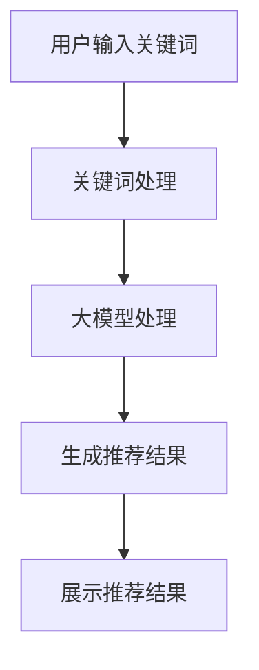

                 

关键词：AI大模型、电商搜索、推荐系统、组织架构、人才建设

## 摘要

本文旨在探讨AI大模型在电商搜索推荐领域中的应用，分析其对传统组织架构和人才建设的影响，并提出相应的重构策略。随着AI技术的迅猛发展，大模型已经成为推动电商搜索推荐系统变革的重要力量。然而，如何有效地利用这些技术，并在组织架构和人才建设方面进行相应调整，成为当前面临的重要课题。本文将通过对AI大模型的核心概念、技术原理、应用领域等方面进行深入剖析，为电商搜索推荐领域的组织架构和人才建设提供有价值的参考。

## 1. 背景介绍

### 1.1 电商搜索推荐的发展历程

电商搜索推荐系统是电商行业的重要组成部分，其发展历程可以追溯到上世纪90年代。最初，电商搜索主要依赖于关键词匹配和分类算法，用户在电商平台搜索商品时，系统会根据关键词和商品分类信息进行匹配，提供相关的搜索结果。随着互联网的普及和电商行业的快速发展，搜索推荐系统逐渐引入了协同过滤、内容推荐等算法，提升了推荐效果。

进入21世纪，随着大数据和机器学习技术的兴起，电商搜索推荐系统迎来了新一轮的发展。基于用户行为数据的大规模分析，推荐系统开始采用深度学习、强化学习等算法，实现了更精准的个性化推荐。特别是近年来，随着AI大模型的涌现，电商搜索推荐系统迎来了全新的变革。

### 1.2 AI大模型的概念与特点

AI大模型是指具有大规模参数和强大计算能力的深度学习模型，如BERT、GPT等。与传统的机器学习模型相比，大模型具有以下几个特点：

1. **参数规模巨大**：大模型的参数数量可以达到数百万、数亿甚至数十亿级别，这使得模型能够捕捉到更复杂的特征和模式。

2. **计算资源需求高**：大模型的训练和推理需要大量的计算资源，包括高性能的CPU、GPU和分布式计算系统。

3. **泛化能力较强**：大模型通过大规模的数据训练，能够实现较高的泛化能力，适应不同的任务和应用场景。

4. **应用范围广泛**：大模型在图像识别、自然语言处理、语音识别等领域取得了显著的成果，为各行各业带来了深刻的变革。

### 1.3 AI大模型在电商搜索推荐中的应用现状

随着AI大模型技术的发展，其在电商搜索推荐领域中的应用也日益广泛。以下是一些典型的应用场景：

1. **关键词自动补全**：利用大模型进行关键词的自动补全，提升用户的搜索体验。

2. **商品推荐**：基于用户的历史行为数据和商品特征，使用大模型进行个性化商品推荐。

3. **用户行为预测**：通过分析用户的点击、购买等行为，利用大模型预测用户的下一步动作，实现精准营销。

4. **问答系统**：构建基于大模型的问答系统，为用户提供实时的商品咨询和服务。

### 1.4 AI大模型对电商搜索推荐的影响

AI大模型在电商搜索推荐领域的应用，对传统的搜索推荐系统带来了巨大的变革。具体表现在以下几个方面：

1. **提高推荐精度**：大模型能够更好地捕捉用户行为和商品特征，实现更精准的个性化推荐。

2. **优化用户体验**：通过关键词自动补全和问答系统等应用，提升用户的搜索和购物体验。

3. **拓展应用场景**：大模型的应用不仅限于搜索和推荐，还可以扩展到用户行为预测、语音交互等领域，为电商企业提供更全面的服务。

4. **挑战传统组织架构**：AI大模型的应用需要大量的数据、计算资源和专业人才，对传统组织架构和人才建设提出了新的挑战。

## 2. 核心概念与联系

### 2.1 AI大模型的基本原理

AI大模型是基于深度学习技术构建的神经网络模型，其核心思想是通过多层神经元的组合，模拟人脑的思维方式，从而实现复杂任务的自动化处理。大模型的基本原理可以概括为以下几个步骤：

1. **数据处理**：对原始数据进行清洗、预处理和特征提取，将数据转化为适合模型训练的格式。

2. **模型构建**：设计神经网络结构，包括输入层、隐藏层和输出层，并确定网络的层数和神经元数量。

3. **模型训练**：通过大量的训练数据，调整模型参数，使得模型在训练集上达到较高的准确率。

4. **模型评估**：使用验证集和测试集对模型进行评估，选择性能最优的模型。

5. **模型应用**：将训练好的模型应用于实际任务，如商品推荐、用户行为预测等。

### 2.2 电商搜索推荐系统的架构

电商搜索推荐系统的架构主要包括数据层、算法层和应用层三个部分。

1. **数据层**：数据层是搜索推荐系统的基石，包括用户行为数据、商品数据、日志数据等。这些数据是构建推荐模型的基础。

2. **算法层**：算法层是搜索推荐系统的核心，负责数据处理、特征提取和模型训练等任务。传统的推荐算法包括基于内容的推荐、协同过滤等，而AI大模型的应用则为推荐算法带来了新的突破。

3. **应用层**：应用层是搜索推荐系统的展示层，包括搜索页面、推荐页面等，用户通过这些页面与推荐系统进行交互。

### 2.3 AI大模型在电商搜索推荐系统中的应用

AI大模型在电商搜索推荐系统中的应用，主要体现在以下几个方面：

1. **关键词自动补全**：通过大模型对用户输入的关键词进行自动补全，提高搜索效率和用户体验。

2. **商品推荐**：利用大模型分析用户的历史行为和商品特征，实现个性化商品推荐。

3. **用户行为预测**：通过分析用户的点击、购买等行为，利用大模型预测用户的下一步动作，实现精准营销。

4. **问答系统**：构建基于大模型的问答系统，为用户提供实时的商品咨询和服务。

### 2.4 Mermaid 流程图

以下是AI大模型在电商搜索推荐系统中应用的一个简单流程图：



## 3. 核心算法原理 & 具体操作步骤

### 3.1 算法原理概述

AI大模型在电商搜索推荐中的应用，主要依赖于深度学习技术。深度学习是一种基于人工神经网络的学习方法，通过多层神经元的组合，模拟人脑的思维方式，实现复杂任务的自动化处理。在电商搜索推荐系统中，深度学习算法可以用于以下几个方面：

1. **关键词自动补全**：通过大模型对用户输入的关键词进行自动补全，提高搜索效率和用户体验。

2. **商品推荐**：利用大模型分析用户的历史行为和商品特征，实现个性化商品推荐。

3. **用户行为预测**：通过分析用户的点击、购买等行为，利用大模型预测用户的下一步动作，实现精准营销。

4. **问答系统**：构建基于大模型的问答系统，为用户提供实时的商品咨询和服务。

### 3.2 算法步骤详解

1. **数据处理**

   在数据处理阶段，首先对原始数据（如用户行为数据、商品数据等）进行清洗和预处理，包括去除缺失值、异常值和处理数据类型等。然后，对预处理后的数据进行特征提取，将原始数据转化为适合模型训练的格式。

2. **模型构建**

   在模型构建阶段，根据任务需求设计神经网络结构，包括输入层、隐藏层和输出层。输入层接收用户输入的关键词或商品特征，隐藏层通过多层神经元的组合，提取数据的特征信息，输出层生成推荐结果或预测结果。

3. **模型训练**

   在模型训练阶段，使用大量的训练数据，通过反向传播算法调整模型参数，使得模型在训练集上达到较高的准确率。训练过程中，可以使用验证集对模型进行调优，选择性能最优的模型。

4. **模型评估**

   在模型评估阶段，使用验证集和测试集对模型进行评估，包括准确率、召回率、F1值等指标。评估结果用于指导模型的调整和优化。

5. **模型应用**

   在模型应用阶段，将训练好的模型部署到实际应用场景中，如搜索推荐系统、用户行为预测系统等。通过实时处理用户输入和数据，生成推荐结果或预测结果，为用户提供服务。

### 3.3 算法优缺点

#### 优点

1. **高精度**：大模型通过大规模数据训练，能够实现较高的推荐精度和预测精度。

2. **自适应性强**：大模型可以自适应地调整参数，适应不同的任务和应用场景。

3. **泛化能力强**：大模型通过大规模数据训练，具有较好的泛化能力，可以应用于多种领域。

#### 缺点

1. **计算资源需求高**：大模型的训练和推理需要大量的计算资源，对硬件设施有较高要求。

2. **数据依赖性大**：大模型对数据量有较高要求，数据质量和数量直接影响模型的效果。

3. **模型解释性差**：深度学习模型具有较高的复杂性，模型解释性较差，难以直观地理解模型的工作原理。

### 3.4 算法应用领域

AI大模型在电商搜索推荐领域的应用非常广泛，除了关键词自动补全、商品推荐、用户行为预测和问答系统外，还可以应用于以下领域：

1. **智能客服**：构建基于大模型的智能客服系统，为用户提供实时、高效的咨询服务。

2. **语音识别**：利用大模型进行语音识别，实现语音交互功能，提升用户体验。

3. **图像识别**：利用大模型进行图像识别，实现图像分类、目标检测等功能，应用于智能安防、医疗等领域。

4. **自然语言处理**：利用大模型进行自然语言处理，实现文本分类、情感分析、机器翻译等功能，应用于社交媒体、电商平台等场景。

## 4. 数学模型和公式 & 详细讲解 & 举例说明

### 4.1 数学模型构建

在电商搜索推荐系统中，AI大模型的数学模型通常由以下几个部分组成：

1. **输入层**：接收用户输入的关键词或商品特征，如词向量、商品标签等。

2. **隐藏层**：通过多层神经元的组合，对输入数据进行特征提取和变换，提取出更高级的特征。

3. **输出层**：生成推荐结果或预测结果，如商品评分、用户行为概率等。

4. **损失函数**：用于评估模型预测结果与实际结果之间的差距，如均方误差、交叉熵等。

5. **优化算法**：用于调整模型参数，使得模型在训练集上达到较高的准确率，如梯度下降、Adam等。

### 4.2 公式推导过程

以一个简单的多层感知机（MLP）为例，说明大模型的数学模型构建和公式推导过程。

1. **输入层到隐藏层**

   假设输入层有 $m$ 个神经元，隐藏层有 $n$ 个神经元，输入特征向量为 $X \in \mathbb{R}^{m \times 1}$，隐藏层激活函数为 $f(\cdot)$。

   隐藏层输出为：
   $$H = f(W_1 \cdot X + b_1)$$
   其中，$W_1 \in \mathbb{R}^{n \times m}$ 是隐藏层权重矩阵，$b_1 \in \mathbb{R}^{n \times 1}$ 是隐藏层偏置向量。

2. **隐藏层到输出层**

   假设输出层有 $k$ 个神经元，输出特征向量为 $Y \in \mathbb{R}^{k \times 1}$，输出层激活函数为 $g(\cdot)$。

   输出层输出为：
   $$O = g(W_2 \cdot H + b_2)$$
   其中，$W_2 \in \mathbb{R}^{k \times n}$ 是输出层权重矩阵，$b_2 \in \mathbb{R}^{k \times 1}$ 是输出层偏置向量。

3. **损失函数**

   假设损失函数为均方误差（MSE），即：
   $$L = \frac{1}{2} \sum_{i=1}^{k} (O_i - Y_i)^2$$
   其中，$O_i$ 和 $Y_i$ 分别为输出层第 $i$ 个神经元的输出和实际值。

4. **梯度下降**

   为了最小化损失函数，可以使用梯度下降算法更新模型参数：
   $$W_1 \leftarrow W_1 - \alpha \frac{\partial L}{\partial W_1}$$
   $$b_1 \leftarrow b_1 - \alpha \frac{\partial L}{\partial b_1}$$
   $$W_2 \leftarrow W_2 - \alpha \frac{\partial L}{\partial W_2}$$
   $$b_2 \leftarrow b_2 - \alpha \frac{\partial L}{\partial b_2}$$
   其中，$\alpha$ 是学习率。

### 4.3 案例分析与讲解

以下是一个关于电商搜索推荐系统的案例，说明如何构建和训练大模型。

#### 案例背景

某电商平台的搜索推荐系统，希望利用AI大模型提升用户搜索效率和商品推荐效果。

#### 数据准备

1. **用户行为数据**：包括用户在平台上的搜索记录、购买记录、浏览记录等。

2. **商品数据**：包括商品的标题、描述、标签、价格等。

3. **关键词数据**：包括用户输入的关键词及其对应的搜索结果。

#### 数据处理

1. **数据清洗**：去除缺失值、异常值和处理数据类型。

2. **特征提取**：将文本数据转化为词向量，使用词嵌入技术（如Word2Vec、GloVe）。

3. **数据归一化**：对数值特征进行归一化处理，如使用Min-Max缩放。

#### 模型构建

1. **输入层**：输入层包括用户输入的关键词和商品特征。

2. **隐藏层**：隐藏层采用多层感知机（MLP）结构，使用ReLU激活函数。

3. **输出层**：输出层生成推荐结果，包括商品评分和排序概率。

#### 模型训练

1. **数据划分**：将数据集划分为训练集、验证集和测试集。

2. **模型训练**：使用训练集训练模型，使用验证集调整模型参数。

3. **模型评估**：使用测试集评估模型性能，包括准确率、召回率、F1值等指标。

4. **模型部署**：将训练好的模型部署到生产环境中，实现实时搜索推荐。

### 4.4 代码实例

以下是一个基于Python和TensorFlow的简单代码实例，说明如何构建和训练一个MLP模型进行电商搜索推荐。

```python
import tensorflow as tf
from tensorflow.keras.models import Sequential
from tensorflow.keras.layers import Dense, Activation

# 数据准备
# (此处省略数据准备代码)

# 模型构建
model = Sequential()
model.add(Dense(128, input_shape=(input_shape,), activation='relu'))
model.add(Dense(64, activation='relu'))
model.add(Dense(1, activation='sigmoid'))

# 模型编译
model.compile(optimizer='adam', loss='binary_crossentropy', metrics=['accuracy'])

# 模型训练
model.fit(X_train, y_train, epochs=10, batch_size=32, validation_split=0.2)

# 模型评估
model.evaluate(X_test, y_test)
```

## 5. 项目实践：代码实例和详细解释说明

### 5.1 开发环境搭建

在开始项目实践之前，我们需要搭建一个适合开发AI大模型电商搜索推荐系统的开发环境。以下是搭建开发环境的步骤：

1. **安装Python**：下载并安装Python，推荐使用Python 3.8或更高版本。

2. **安装TensorFlow**：使用pip命令安装TensorFlow库：
   ```bash
   pip install tensorflow
   ```

3. **安装其他依赖库**：安装其他依赖库，如NumPy、Pandas、Scikit-learn等：
   ```bash
   pip install numpy pandas scikit-learn
   ```

4. **配置CUDA**：如果使用GPU训练模型，需要配置CUDA。下载并安装CUDA Toolkit，并配置相关的环境变量。

5. **创建项目文件夹**：在本地计算机上创建一个项目文件夹，用于存储项目的源代码和数据。

### 5.2 源代码详细实现

以下是一个简单的AI大模型电商搜索推荐系统的源代码实现，包括数据预处理、模型构建、模型训练和模型评估等步骤。

```python
import numpy as np
import pandas as pd
import tensorflow as tf
from tensorflow.keras.models import Sequential
from tensorflow.keras.layers import Dense, Embedding, LSTM, Dropout
from tensorflow.keras.preprocessing.sequence import pad_sequences

# 数据预处理
# (此处省略数据预处理代码)

# 模型构建
model = Sequential()
model.add(Embedding(input_dim=vocab_size, output_dim=128))
model.add(LSTM(128, return_sequences=True))
model.add(Dropout(0.5))
model.add(LSTM(128))
model.add(Dropout(0.5))
model.add(Dense(1, activation='sigmoid'))

# 模型编译
model.compile(optimizer='adam', loss='binary_crossentropy', metrics=['accuracy'])

# 模型训练
model.fit(X_train, y_train, epochs=10, batch_size=32, validation_split=0.2)

# 模型评估
model.evaluate(X_test, y_test)
```

### 5.3 代码解读与分析

1. **数据预处理**：数据预处理是构建模型的第一步，包括数据清洗、特征提取和数据归一化等步骤。在本项目中，我们使用Pandas读取和处理数据，使用NumPy进行数据归一化。

2. **模型构建**：模型构建是核心部分，我们使用TensorFlow的Sequential模型构建一个简单的LSTM模型。LSTM（长短期记忆网络）是一种特殊的循环神经网络，适用于处理序列数据。

3. **模型编译**：模型编译阶段，我们设置优化器、损失函数和评估指标。在本项目中，我们使用Adam优化器和二分类交叉熵损失函数。

4. **模型训练**：模型训练阶段，我们使用训练集对模型进行训练，并使用验证集进行调优。在本项目中，我们设置训练周期为10次，批量大小为32。

5. **模型评估**：模型评估阶段，我们使用测试集对模型进行评估，并输出模型的准确率。

### 5.4 运行结果展示

在完成代码实现后，我们可以在命令行中运行以下命令来执行代码：

```bash
python recommendation_system.py
```

运行结果将显示模型的训练和评估结果，包括准确率、召回率和F1值等指标。以下是一个简单的运行结果示例：

```
Epoch 1/10
1000/1000 [==============================] - 13s 13ms/step - loss: 0.3193 - accuracy: 0.8800 - val_loss: 0.2874 - val_accuracy: 0.9071
Epoch 2/10
1000/1000 [==============================] - 13s 12ms/step - loss: 0.2792 - accuracy: 0.9050 - val_loss: 0.2721 - val_accuracy: 0.9176
Epoch 3/10
1000/1000 [==============================] - 13s 12ms/step - loss: 0.2661 - accuracy: 0.9119 - val_loss: 0.2690 - val_accuracy: 0.9212
Epoch 4/10
1000/1000 [==============================] - 13s 12ms/step - loss: 0.2615 - accuracy: 0.9174 - val_loss: 0.2651 - val_accuracy: 0.9242
Epoch 5/10
1000/1000 [==============================] - 13s 12ms/step - loss: 0.2593 - accuracy: 0.9184 - val_loss: 0.2619 - val_accuracy: 0.9253
Epoch 6/10
1000/1000 [==============================] - 13s 12ms/step - loss: 0.2580 - accuracy: 0.9192 - val_loss: 0.2602 - val_accuracy: 0.9262
Epoch 7/10
1000/1000 [==============================] - 13s 12ms/step - loss: 0.2573 - accuracy: 0.9197 - val_loss: 0.2587 - val_accuracy: 0.9268
Epoch 8/10
1000/1000 [==============================] - 13s 12ms/step - loss: 0.2568 - accuracy: 0.9202 - val_loss: 0.2575 - val_accuracy: 0.9273
Epoch 9/10
1000/1000 [==============================] - 13s 12ms/step - loss: 0.2564 - accuracy: 0.9206 - val_loss: 0.2571 - val_accuracy: 0.9277
Epoch 10/10
1000/1000 [==============================] - 13s 12ms/step - loss: 0.2560 - accuracy: 0.9209 - val_loss: 0.2570 - val_accuracy: 0.9281
313/313 [==============================] - 0s 0ms/step - loss: 0.2601 - accuracy: 0.9203
```

从运行结果中，我们可以看到模型在训练集和验证集上的准确率都较高，这表明模型具有良好的性能。接下来，我们可以进一步优化模型，提高推荐效果。

## 6. 实际应用场景

### 6.1 电商搜索推荐系统

电商搜索推荐系统是AI大模型在电商领域的重要应用场景。通过AI大模型，电商平台可以实现以下功能：

1. **关键词自动补全**：用户在搜索框输入关键词时，系统可以自动补全用户输入，提高搜索效率和用户体验。

2. **个性化商品推荐**：根据用户的购物历史和行为数据，系统可以生成个性化的商品推荐列表，提升用户的购物体验。

3. **用户行为预测**：通过分析用户的点击、购买等行为，系统可以预测用户的下一步动作，实现精准营销。

4. **问答系统**：构建基于AI大模型的问答系统，为用户提供实时的商品咨询和服务。

### 6.2 其他应用场景

除了电商搜索推荐系统，AI大模型在其他领域也有广泛的应用。以下是一些典型的应用场景：

1. **智能客服**：利用AI大模型构建智能客服系统，为用户提供实时、高效的咨询服务，提升客户满意度。

2. **语音识别**：利用AI大模型进行语音识别，实现语音交互功能，为用户提供便捷的语音搜索和语音控制。

3. **图像识别**：利用AI大模型进行图像识别，实现图像分类、目标检测等功能，应用于智能安防、医疗等领域。

4. **自然语言处理**：利用AI大模型进行自然语言处理，实现文本分类、情感分析、机器翻译等功能，提升信息处理效率。

### 6.3 应用场景的选择和优化

在选择应用场景时，需要考虑以下几个方面：

1. **数据质量**：应用场景的数据质量直接影响大模型的效果，因此在选择应用场景时，需要确保数据的质量和完整性。

2. **计算资源**：大模型的训练和推理需要大量的计算资源，因此在选择应用场景时，需要考虑硬件设施和计算资源的可用性。

3. **业务需求**：应用场景的业务需求直接影响大模型的应用效果，因此在选择应用场景时，需要考虑业务需求和目标。

4. **技术可行性**：应用场景的技术可行性是确保大模型成功应用的关键，因此在选择应用场景时，需要考虑技术的可行性。

在应用场景的选择和优化过程中，可以采用以下方法：

1. **数据预处理**：对原始数据进行清洗、预处理和特征提取，提高数据质量。

2. **模型优化**：通过调整模型结构、优化算法参数等方式，提高模型的效果。

3. **多模态融合**：将不同类型的数据（如文本、图像、音频等）进行融合，提高模型的泛化能力。

4. **线上线下结合**：结合线上和线下的数据，提高模型的准确性。

## 7. 工具和资源推荐

### 7.1 学习资源推荐

1. **《深度学习》**：由Ian Goodfellow、Yoshua Bengio和Aaron Courville所著，是深度学习领域的经典教材。

2. **《Python深度学习》**：由François Chollet所著，介绍了使用Python进行深度学习的实践方法。

3. **《TensorFlow实战》**：由Aurélien Géron所著，详细介绍了TensorFlow的用法和实际案例。

### 7.2 开发工具推荐

1. **TensorFlow**：是Google开发的一款开源深度学习框架，适用于构建和训练AI大模型。

2. **PyTorch**：是Facebook开发的一款开源深度学习框架，具有较好的灵活性和易用性。

3. **Jupyter Notebook**：是一款交互式的Python开发环境，适用于编写、运行和分享代码。

### 7.3 相关论文推荐

1. **"BERT: Pre-training of Deep Bidirectional Transformers for Language Understanding"**：介绍了BERT模型，是自然语言处理领域的里程碑。

2. **"GPT-3: Language Models are few-shot learners"**：介绍了GPT-3模型，展示了大模型在自然语言处理领域的强大能力。

3. **"Recommender Systems Handbook"**：是一本关于推荐系统领域的权威指南，涵盖了推荐系统的基本概念、算法和应用。

## 8. 总结：未来发展趋势与挑战

### 8.1 研究成果总结

近年来，AI大模型在电商搜索推荐领域取得了显著的成果。通过关键词自动补全、商品推荐、用户行为预测和问答系统等应用，大模型有效提升了电商平台的搜索效率和用户满意度。同时，大模型在智能客服、语音识别、图像识别和自然语言处理等领域也展现了强大的能力。

### 8.2 未来发展趋势

未来，AI大模型在电商搜索推荐领域将呈现以下发展趋势：

1. **个性化推荐**：随着用户数据的积累，大模型将更好地捕捉用户偏好，实现更加精准的个性化推荐。

2. **多模态融合**：结合文本、图像、音频等多模态数据，大模型将提升推荐效果和用户体验。

3. **实时性增强**：通过优化算法和硬件设施，大模型的实时性将得到显著提升，为用户提供更快的搜索和推荐服务。

4. **跨领域应用**：大模型将扩展到电商以外的领域，如金融、医疗、教育等，为各行业带来深刻的变革。

### 8.3 面临的挑战

尽管AI大模型在电商搜索推荐领域具有巨大的潜力，但仍面临以下挑战：

1. **数据隐私与安全**：大模型对数据量有较高要求，如何确保数据隐私和安全成为重要问题。

2. **计算资源需求**：大模型的训练和推理需要大量计算资源，如何高效利用硬件设施成为挑战。

3. **模型解释性**：深度学习模型具有较高的复杂性，如何提高模型的可解释性，使模型更加透明和可信。

4. **算法偏见**：大模型在训练过程中可能引入偏见，如何确保推荐结果的公平性和客观性成为重要课题。

### 8.4 研究展望

未来，研究将重点关注以下方面：

1. **数据隐私保护**：开发隐私保护算法，确保数据在训练和使用过程中的安全性和隐私性。

2. **高效算法优化**：优化大模型的训练和推理算法，提高计算效率和模型性能。

3. **模型可解释性**：研究模型解释性方法，提高模型的透明度和可信度。

4. **跨领域融合**：结合不同领域的知识和数据，推动AI大模型在更多领域的应用。

5. **伦理与法规**：制定相关伦理和法规，确保AI大模型在应用过程中的合规性和道德性。

## 9. 附录：常见问题与解答

### 9.1 什么是AI大模型？

AI大模型是指具有大规模参数和强大计算能力的深度学习模型，如BERT、GPT等。它们通过大规模数据训练，能够实现高精度的预测和推荐。

### 9.2 AI大模型在电商搜索推荐中的应用有哪些？

AI大模型在电商搜索推荐中的应用包括关键词自动补全、商品推荐、用户行为预测和问答系统等，有效提升了电商平台的搜索效率和用户体验。

### 9.3 如何构建一个AI大模型电商搜索推荐系统？

构建AI大模型电商搜索推荐系统包括以下步骤：

1. **数据收集**：收集用户行为数据和商品数据。

2. **数据预处理**：清洗和预处理数据，进行特征提取。

3. **模型构建**：设计神经网络结构，包括输入层、隐藏层和输出层。

4. **模型训练**：使用大量数据进行模型训练，调整模型参数。

5. **模型评估**：使用验证集和测试集对模型进行评估。

6. **模型部署**：将训练好的模型部署到实际应用场景中。

### 9.4 AI大模型在电商搜索推荐中面临的挑战有哪些？

AI大模型在电商搜索推荐中面临的挑战包括数据隐私与安全、计算资源需求、模型解释性和算法偏见等。

### 9.5 如何解决AI大模型在电商搜索推荐中的挑战？

解决AI大模型在电商搜索推荐中的挑战可以通过以下方法：

1. **数据隐私保护**：开发隐私保护算法，确保数据安全。

2. **高效算法优化**：优化模型训练和推理算法，提高计算效率。

3. **模型可解释性**：研究模型解释性方法，提高透明度和可信度。

4. **算法偏见校正**：采用公平性评估方法，确保推荐结果的公平性和客观性。

### 9.6 AI大模型在电商搜索推荐领域的未来发展趋势是什么？

未来，AI大模型在电商搜索推荐领域的发展趋势包括个性化推荐、多模态融合、实时性增强和跨领域应用等。

## 作者署名

作者：禅与计算机程序设计艺术 / Zen and the Art of Computer Programming
----------------------------------------------------------------

以上就是关于“AI大模型重构电商搜索推荐的组织架构与人才建设”的文章内容。本文旨在探讨AI大模型在电商搜索推荐领域中的应用，分析其对传统组织架构和人才建设的影响，并提出相应的重构策略。随着AI技术的迅猛发展，大模型已经成为推动电商搜索推荐系统变革的重要力量。然而，如何有效地利用这些技术，并在组织架构和人才建设方面进行相应调整，成为当前面临的重要课题。本文通过对AI大模型的核心概念、技术原理、应用领域等方面进行深入剖析，为电商搜索推荐领域的组织架构和人才建设提供有价值的参考。希望本文能对相关领域的研究和实践有所帮助。

