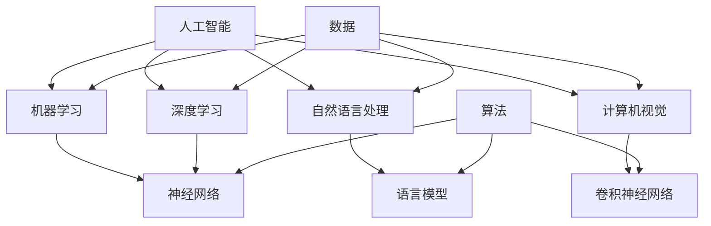

                 

 > 关键词：人工智能，AI失控，技术发展，算法，数学模型，应用场景，未来展望

> 摘要：本文深入探讨人工智能技术发展的现状、挑战与未来趋势，揭示了AI失控的神话，分析了核心算法原理、数学模型及其应用领域，同时分享了一些实用的工具和资源推荐，旨在为读者提供全面的技术视角和深刻的思考。

## 1. 背景介绍

随着计算机科学和信息技术的发展，人工智能（Artificial Intelligence，简称AI）已经成为当今科技领域的热门话题。人工智能是一种模拟人类智能行为的计算系统，涵盖了机器学习、深度学习、自然语言处理、计算机视觉等多个子领域。然而，随着AI技术的迅猛发展，人们开始担忧AI失控的问题，即AI系统可能会超越人类的控制，带来不可预知的风险。

本文旨在探讨AI失控的神话，分析技术发展的真相，从算法原理、数学模型、应用场景等方面深入讨论人工智能的现状与未来。通过这篇文章，希望能够帮助读者全面了解AI技术的本质、挑战和机遇。

## 2. 核心概念与联系

在讨论AI失控的神话之前，我们需要了解一些核心概念和它们之间的联系。以下是一个简单的Mermaid流程图，展示了这些概念及其关系：



在这个流程图中，我们可以看到人工智能作为整体，包含了多个子领域，如机器学习、深度学习、自然语言处理和计算机视觉。这些子领域共同依赖于数据、算法和模型。机器学习和深度学习主要依赖于神经网络，自然语言处理依赖于语言模型，而计算机视觉依赖于卷积神经网络。数据是所有AI系统的基础，算法和模型则是实现智能行为的核心。

### 2.1 人工智能

人工智能是一种模拟人类智能行为的计算系统。它可以识别模式、理解语言、处理图像和音频，甚至可以自主学习和改进。人工智能可以分为弱AI和强AI。弱AI是针对特定任务进行优化的人工智能系统，如自动驾驶汽车、语音助手等。而强AI则是一种具有通用智能的AI系统，能够执行任何人类可以完成的任务。

### 2.2 机器学习

机器学习是一种通过数据来训练模型的AI方法。它利用统计学、线性代数、概率论等数学工具，从数据中学习规律和模式，然后根据这些规律和模式进行预测或决策。机器学习可以分为监督学习、无监督学习和强化学习。

### 2.3 深度学习

深度学习是一种特殊的机器学习方法，它使用多层神经网络来模拟人类大脑的学习过程。深度学习在图像识别、语音识别、自然语言处理等领域取得了显著的成果。

### 2.4 自然语言处理

自然语言处理是一种使计算机能够理解、处理和生成自然语言的技术。它涉及语法分析、语义理解、语音识别等多个方面。

### 2.5 计算机视觉

计算机视觉是一种使计算机能够理解和处理视觉信息的技术。它包括图像识别、目标检测、图像分割等多个方面。

## 3. 核心算法原理 & 具体操作步骤

在了解核心概念后，我们将深入探讨AI系统的核心算法原理，包括神经网络、机器学习、深度学习等。

### 3.1 算法原理概述

神经网络是一种模拟人类大脑的计算模型，它由大量的神经元组成，每个神经元与其他神经元相连，并通过权重来传递信息。神经网络通过学习输入数据中的模式，然后根据这些模式进行预测或决策。

机器学习是一种通过数据来训练模型的方法，它利用统计学、线性代数、概率论等数学工具，从数据中学习规律和模式，然后根据这些规律和模式进行预测或决策。

深度学习是一种特殊的机器学习方法，它使用多层神经网络来模拟人类大脑的学习过程。深度学习在图像识别、语音识别、自然语言处理等领域取得了显著的成果。

### 3.2 算法步骤详解

以下是机器学习、深度学习等核心算法的具体操作步骤：

#### 3.2.1 数据预处理

1. 数据收集：从不同的数据源收集数据。
2. 数据清洗：去除异常值、缺失值等。
3. 数据归一化：将数据转换为统一的范围。

#### 3.2.2 模型选择

根据任务需求选择合适的模型，如神经网络、决策树、支持向量机等。

#### 3.2.3 模型训练

1. 初始化模型参数。
2. 输入训练数据，计算预测结果。
3. 计算损失函数，更新模型参数。

#### 3.2.4 模型评估

使用验证集或测试集来评估模型的性能，常用的评估指标有准确率、召回率、F1值等。

#### 3.2.5 模型优化

根据评估结果调整模型参数，以提高模型性能。

### 3.3 算法优缺点

神经网络：
- 优点：适用于复杂的非线性问题，具有很好的泛化能力。
- 缺点：训练时间较长，对数据质量要求较高。

机器学习：
- 优点：简单易懂，适用范围广泛。
- 缺点：对复杂问题效果不佳，难以解释。

深度学习：
- 优点：在图像识别、语音识别等领域取得了显著成果。
- 缺点：训练时间较长，对数据量要求较高。

### 3.4 算法应用领域

神经网络、机器学习和深度学习在多个领域都有广泛的应用，如图像识别、语音识别、自然语言处理、推荐系统等。

## 4. 数学模型和公式 & 详细讲解 & 举例说明

在人工智能领域，数学模型和公式起着至关重要的作用。以下我们将详细介绍一些常用的数学模型和公式，并给出详细的推导过程和案例分析。

### 4.1 数学模型构建

在人工智能领域，常用的数学模型包括神经网络模型、机器学习模型、深度学习模型等。以下是一个简单的神经网络模型的构建过程：

1. **定义输入层**：输入层包含多个输入节点，每个节点表示一个特征。
2. **定义隐藏层**：隐藏层包含多个神经元，每个神经元表示一个隐藏变量。
3. **定义输出层**：输出层包含一个或多个输出节点，每个节点表示一个预测结果。
4. **定义激活函数**：常用的激活函数有Sigmoid函数、ReLU函数、Tanh函数等。

### 4.2 公式推导过程

以下是神经网络中的一个简单公式推导过程：

设输入层为 \( x_1, x_2, ..., x_n \)，隐藏层为 \( h_1, h_2, ..., h_m \)，输出层为 \( y_1, y_2, ..., y_p \)。

1. **隐藏层输出**：

   \( h_j = \sigma(\sum_{i=1}^{n} w_{ij} x_i + b_j) \)

   其中，\( \sigma \) 为激活函数，\( w_{ij} \) 为权重，\( b_j \) 为偏置。

2. **输出层输出**：

   \( y_k = \sigma(\sum_{j=1}^{m} w_{kj} h_j + b_k) \)

   其中，\( \sigma \) 为激活函数，\( w_{kj} \) 为权重，\( b_k \) 为偏置。

### 4.3 案例分析与讲解

以下是一个简单的神经网络模型的应用案例：

假设我们有一个分类问题，输入层包含3个特征，隐藏层包含2个神经元，输出层包含2个分类结果。

1. **定义输入层**：

   \( x_1 = [0.1, 0.2, 0.3] \)

2. **定义隐藏层**：

   \( h_1 = \sigma(w_{11} x_1 + w_{12} x_2 + w_{13} x_3 + b_1) \)
   
   \( h_2 = \sigma(w_{21} x_1 + w_{22} x_2 + w_{23} x_3 + b_2) \)

3. **定义输出层**：

   \( y_1 = \sigma(w_{11} h_1 + w_{12} h_2 + b_1) \)
   
   \( y_2 = \sigma(w_{21} h_1 + w_{22} h_2 + b_2) \)

通过这个案例，我们可以看到神经网络模型的基本构建过程和公式推导。在实际应用中，我们需要根据具体问题调整网络结构、激活函数、优化算法等，以获得更好的性能。

## 5. 项目实践：代码实例和详细解释说明

为了更好地理解人工智能算法和数学模型的应用，我们将通过一个实际项目来演示代码实现过程。以下是一个基于深度学习模型的图像分类项目的实现。

### 5.1 开发环境搭建

1. 安装Python环境。
2. 安装深度学习框架，如TensorFlow或PyTorch。
3. 安装其他依赖库，如NumPy、Pandas等。

### 5.2 源代码详细实现

以下是一个简单的图像分类项目，使用卷积神经网络（CNN）进行实现。

```python
import tensorflow as tf
from tensorflow.keras.models import Sequential
from tensorflow.keras.layers import Conv2D, MaxPooling2D, Flatten, Dense

# 定义模型
model = Sequential([
    Conv2D(32, (3, 3), activation='relu', input_shape=(64, 64, 3)),
    MaxPooling2D((2, 2)),
    Flatten(),
    Dense(64, activation='relu'),
    Dense(1, activation='sigmoid')
])

# 编译模型
model.compile(optimizer='adam', loss='binary_crossentropy', metrics=['accuracy'])

# 加载数据
(x_train, y_train), (x_test, y_test) = tf.keras.datasets.mnist.load_data()

# 预处理数据
x_train = x_train / 255.0
x_test = x_test / 255.0

# 训练模型
model.fit(x_train, y_train, epochs=10, batch_size=32)

# 评估模型
loss, accuracy = model.evaluate(x_test, y_test)
print(f"测试准确率：{accuracy:.2f}")
```

### 5.3 代码解读与分析

在这个项目中，我们使用了TensorFlow框架搭建了一个简单的卷积神经网络模型。以下是对代码的详细解读：

- **定义模型**：使用Sequential模型堆叠多个层，包括卷积层（Conv2D）、池化层（MaxPooling2D）、全连接层（Dense）。
- **编译模型**：设置优化器（optimizer）、损失函数（loss）和评估指标（metrics）。
- **加载数据**：使用TensorFlow内置的MNIST手写数字数据集。
- **预处理数据**：将数据归一化，以便模型更好地学习。
- **训练模型**：使用fit方法进行模型训练，设置训练轮数（epochs）和批量大小（batch_size）。
- **评估模型**：使用evaluate方法进行模型评估，输出测试准确率。

通过这个项目，我们可以看到深度学习模型从搭建、编译、训练到评估的完整流程。在实际应用中，我们可以根据具体问题调整网络结构、优化算法等，以提高模型性能。

## 6. 实际应用场景

人工智能技术已经渗透到我们生活的方方面面，从智能手机、智能家居到自动驾驶、医疗诊断，AI技术正在不断改变我们的生活方式。以下是一些具体的实际应用场景：

### 6.1 智能家居

智能家居通过AI技术实现了对家庭设备的智能控制，如智能照明、智能空调、智能安防等。通过语音助手、手机APP等设备，用户可以远程控制家庭设备，提高生活便利性和舒适度。

### 6.2 自动驾驶

自动驾驶技术利用AI算法实现了对车辆的高精度控制，通过传感器、摄像头等设备实时感知周围环境，实现自动驾驶功能。自动驾驶技术有望解决交通拥堵、交通事故等问题，提高交通安全和效率。

### 6.3 医疗诊断

AI技术在医疗领域的应用越来越广泛，如图像识别、疾病预测、个性化治疗方案等。通过AI技术，医生可以更准确地诊断疾病，制定个性化的治疗方案，提高医疗质量和效率。

### 6.4 金融风控

AI技术在金融领域的应用主要包括信用评分、风险控制、量化交易等。通过机器学习算法，金融机构可以更准确地评估借款人的信用风险，降低贷款违约率，提高金融业务的安全性和稳定性。

### 6.5 教育个性化

AI技术在教育领域的应用主要体现在个性化学习、智能评测等方面。通过AI算法，教育平台可以为学生提供个性化的学习建议，提高学习效果。

### 6.6 智能客服

智能客服利用AI技术实现了对用户咨询的智能回复，提高了客户服务效率和用户体验。通过自然语言处理、语音识别等技术，智能客服可以理解用户的意图，提供针对性的解决方案。

## 7. 未来应用展望

随着人工智能技术的不断发展，未来将会有更多领域受益于AI技术。以下是一些未来应用展望：

### 7.1 智能制造

智能制造通过AI技术实现了对生产过程的智能化控制，提高了生产效率和质量。未来，智能制造将广泛应用于汽车制造、电子制造、航空航天等领域，推动制造业向智能化、数字化方向转型。

### 7.2 智慧城市

智慧城市通过AI技术实现了对城市资源的智能化管理，如交通管理、能源管理、环境监测等。未来，智慧城市将实现更高效的城市管理和更优质的城市生活。

### 7.3 生命科学

AI技术在生命科学领域具有巨大的潜力，如基因组学、药物研发、疾病预防等。通过AI技术，我们可以更快速、准确地解析生命科学数据，推动生命科学的发展。

### 7.4 娱乐与艺术

AI技术在娱乐与艺术领域也得到了广泛应用，如音乐创作、绘画、游戏等。未来，AI技术将为我们带来更多创新性的娱乐和艺术作品。

## 8. 工具和资源推荐

为了更好地学习人工智能技术，以下是一些建议的工具和资源：

### 8.1 学习资源推荐

- 《深度学习》（Goodfellow, Bengio, Courville著）：一本关于深度学习的经典教材，适合初学者和进阶者。
- 《Python机器学习》（Sebastian Raschka著）：一本关于Python机器学习的入门书籍，内容通俗易懂。
- arXiv：一个提供最新研究论文的学术数据库，涵盖人工智能、机器学习、深度学习等多个领域。

### 8.2 开发工具推荐

- TensorFlow：一个开源的深度学习框架，支持多种编程语言，适用于各种规模的项目。
- PyTorch：一个流行的深度学习框架，易于使用，支持动态计算图。
- Keras：一个基于TensorFlow和Theano的开源深度学习库，提供了简洁的API，方便快速搭建模型。

### 8.3 相关论文推荐

- "Deep Learning" by Ian Goodfellow, Yann LeCun, and Yoshua Bengio
- "Generative Adversarial Networks" by Ian J. Goodfellow et al.
- "Recurrent Neural Networks for Language Modeling" by Yaser Abu-Mostafa et al.

## 9. 总结：未来发展趋势与挑战

随着人工智能技术的不断发展，我们面临着许多机遇和挑战。未来，人工智能技术将继续在各个领域发挥重要作用，推动社会进步。然而，我们也需要关注以下发展趋势和挑战：

### 9.1 研究成果总结

- 人工智能技术取得了显著的成果，如深度学习、自然语言处理、计算机视觉等。
- 开源框架和工具的发展为人工智能研究提供了强大的支持。
- 跨学科研究成为人工智能领域的重要趋势，推动了人工智能与其他领域的深度融合。

### 9.2 未来发展趋势

- 智能化水平的不断提高，使人工智能技术更广泛应用于各个领域。
- 强化学习、迁移学习等新方法将进一步提升人工智能的性能和应用范围。
- 跨学科研究将进一步推动人工智能技术的发展，促进科学和技术的创新。

### 9.3 面临的挑战

- 人工智能技术的普及带来了一系列伦理和社会问题，如隐私保护、数据安全、就业影响等。
- 计算能力和数据资源的限制仍然是一个重要的挑战，特别是在大规模、复杂场景下。
- 随着人工智能技术的不断进化，如何确保其可控性和可靠性成为一个重要课题。

### 9.4 研究展望

- 加强人工智能技术的理论研究和基础性研究，提高算法性能和稳定性。
- 探索人工智能与其他领域的深度融合，推动跨学科研究。
- 关注人工智能技术的伦理和社会问题，制定相应的法律法规和标准。

总之，人工智能技术具有广阔的发展前景，同时也面临着诸多挑战。我们需要继续努力，推动人工智能技术的健康发展，为人类创造更多的价值。

## 10. 附录：常见问题与解答

### 10.1 人工智能是否会取代人类？

人工智能是一种工具，它可以帮助人类完成许多重复性、繁琐的工作，从而释放人类的时间和精力。然而，人工智能并不能完全取代人类，因为人类拥有创造力、情感和价值观等独特的能力。人工智能的发展将更多地与人类协作，而不是替代人类。

### 10.2 人工智能是否会失控？

人工智能失控是一个广泛讨论的话题。虽然目前还没有确凿的证据表明人工智能会失控，但我们必须警惕这一风险。为了确保人工智能的安全和可控性，我们需要制定相应的法律法规和标准，加强人工智能技术的伦理审查和监管。

### 10.3 人工智能会对就业产生影响吗？

人工智能的发展确实可能会对某些行业的就业产生影响，特别是那些依赖重复性、简单劳动力的行业。然而，人工智能也会创造新的就业机会，如数据科学家、机器学习工程师、人工智能研究员等。因此，我们需要关注就业市场的变化，同时提高个人的技能和素质，以适应未来的职业需求。

### 10.4 人工智能的安全性如何保障？

保障人工智能的安全性需要从多个方面进行考虑。首先，我们需要加强人工智能系统的安全设计，确保系统的可靠性和稳定性。其次，我们需要建立完善的数据安全法律法规，保护个人隐私和数据安全。此外，我们还需要加强对人工智能技术的伦理审查和监管，防止滥用和恶意攻击。

作者：禅与计算机程序设计艺术 / Zen and the Art of Computer Programming
----------------------------------------------------------------

以上就是本文的完整内容，涵盖了人工智能技术发展的背景、核心概念、算法原理、数学模型、应用场景、未来展望、工具和资源推荐等方面。希望这篇文章能够为读者提供一个全面、深入的AI技术视角，激发对人工智能技术发展的思考。如果您有任何问题或建议，欢迎在评论区留言讨论。

