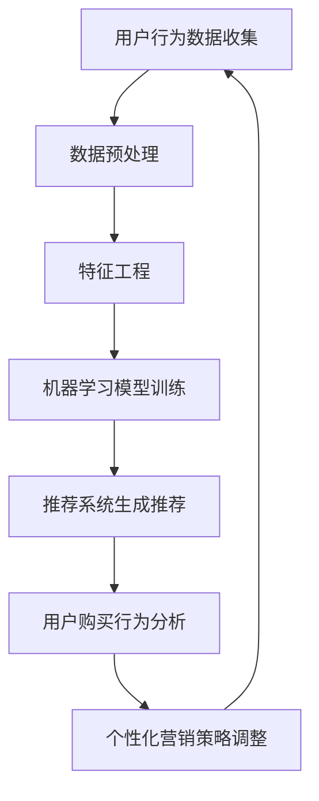

                 

关键词：电商平台、长尾商品、AI优化、曝光、转化、机器学习、深度学习、推荐系统、个性化营销、数据挖掘

> 摘要：随着电商平台的不断发展和市场竞争的加剧，如何优化长尾商品的曝光和转化成为电商运营的关键问题。本文将探讨人工智能技术在电商平台中的应用，特别是机器学习和深度学习在推荐系统和个人化营销中的具体应用，以及如何通过数据挖掘和算法优化提升长尾商品的曝光率和转化率。

## 1. 背景介绍

在当今的电商环境中，长尾商品（Long-tail products）已经成为电商平台不可或缺的一部分。长尾商品通常指的是市场上销量较低，但品种数量众多的商品。与畅销商品（Hit products）相比，长尾商品在库存管理和营销推广上面临更大的挑战。然而，长尾商品覆盖了广泛的产品种类，满足了消费者多样化的需求，对于电商平台的长期发展和市场竞争力具有重要意义。

### 长尾商品的优势与挑战

长尾商品的优势在于能够满足不同消费者的需求，从而提高用户满意度和忠诚度。然而，长尾商品的挑战在于如何提高其曝光率和转化率，使得这些商品能够被更多的消费者发现并购买。传统的营销策略往往集中在热门商品上，导致长尾商品在搜索结果中排名靠后，难以获得足够的关注。

### 现状分析

目前，电商平台普遍采用搜索引擎优化（SEO）和广告推广来提高商品的曝光率。然而，这些方法往往成本较高，且效果有限。随着人工智能技术的发展，利用机器学习和深度学习算法优化长尾商品的曝光和转化成为了一种新的趋势。

## 2. 核心概念与联系

### 机器学习与深度学习

机器学习（Machine Learning）是一种通过数据训练模型，使其能够自动进行预测或决策的技术。深度学习（Deep Learning）是机器学习的一个子领域，利用多层神经网络进行学习，能够在大量数据中自动提取特征，并用于复杂的预测任务。

### 推荐系统

推荐系统（Recommendation System）是电商平台中常用的技术，通过分析用户行为和偏好，为用户推荐可能感兴趣的商品。推荐系统的核心在于如何从海量的商品中识别出用户感兴趣的长尾商品。

### 个人化营销

个人化营销（Personalized Marketing）是一种通过了解用户的行为和偏好，为其提供个性化的商品推荐和营销策略。个人化营销能够提高用户的购物体验和满意度，从而提升长尾商品的转化率。

### Mermaid 流程图



## 3. 核心算法原理 & 具体操作步骤

### 3.1 算法原理概述

优化长尾商品曝光和转化的核心算法通常包括以下几类：

1. **协同过滤（Collaborative Filtering）**：通过分析用户之间的相似度，为用户推荐相似用户喜欢的商品。
2. **内容推荐（Content-based Filtering）**：根据商品的属性和用户的历史行为，为用户推荐相似或相关的商品。
3. **深度学习（Deep Learning）**：利用多层神经网络提取商品和用户的特征，进行复杂的预测和推荐。

### 3.2 算法步骤详解

1. **用户行为数据收集**：电商平台需要收集用户在平台上的浏览、搜索、购买等行为数据。
2. **数据预处理**：对收集到的数据进行清洗、去噪、归一化等处理，确保数据的质量和一致性。
3. **特征工程**：提取用户和商品的特征，如用户 demographics、购买历史、商品品类、价格、评价等。
4. **机器学习模型训练**：利用用户行为数据和特征，训练协同过滤、内容推荐或深度学习模型。
5. **推荐系统生成推荐**：根据用户的行为数据和模型预测，为用户生成个性化的商品推荐。
6. **用户购买行为分析**：跟踪用户的购买行为，评估推荐系统的效果，并进行反馈。
7. **个性化营销策略调整**：根据用户反馈和购买行为，调整个性化营销策略，以提高转化率。

### 3.3 算法优缺点

1. **协同过滤**：优点是能够提供个性化的推荐，但缺点是容易受到冷启动问题的影响，且无法充分利用商品的属性信息。
2. **内容推荐**：优点是能够利用商品的属性信息，提供更相关的推荐，但缺点是需要大量的用户历史行为数据，且可能产生信息过载。
3. **深度学习**：优点是能够自动提取复杂的特征，提供高质量的推荐，但缺点是需要大量的计算资源和数据。

### 3.4 算法应用领域

1. **电商平台**：电商平台是长尾商品曝光和转化的主要应用场景，通过优化推荐算法，能够提高用户的购物体验和满意度。
2. **在线广告**：在线广告平台可以利用推荐算法，为广告主提供更精准的目标用户，提高广告的点击率和转化率。
3. **内容平台**：如 YouTube、Netflix 等，可以通过推荐算法提高用户的观看时长和用户黏性。

## 4. 数学模型和公式 & 详细讲解 & 举例说明

### 4.1 数学模型构建

在推荐系统中，常用的数学模型包括：

1. **线性回归模型**：用于预测用户对商品的评分。
2. **贝叶斯网络**：用于建模用户和商品之间的关系。
3. **深度学习模型**：如卷积神经网络（CNN）、循环神经网络（RNN）等。

### 4.2 公式推导过程

以线性回归模型为例，假设用户 \(u\) 对商品 \(i\) 的评分为 \(r_{ui}\)，则线性回归模型的公式为：

$$r_{ui} = \langle \theta_0 + \theta_1 x_{ui} + \theta_2 y_{ui} + ... + \theta_n z_{ui} \rangle$$

其中，\(x_{ui}\)、\(y_{ui}\)、...、\(z_{ui}\) 分别为用户 \(u\) 和商品 \(i\) 的特征，\(\theta_0\)、\(\theta_1\)、...、\(\theta_n\) 为模型的参数。

### 4.3 案例分析与讲解

以一个电商平台的推荐系统为例，假设电商平台收集了用户 \(u_1\) 的浏览记录，包括浏览了商品 \(i_1\)、\(i_2\)、\(i_3\)，需要为用户 \(u_1\) 生成推荐列表。

1. **数据预处理**：对用户 \(u_1\) 的浏览记录进行清洗和归一化处理。
2. **特征工程**：提取用户 \(u_1\) 的浏览记录中的商品品类、价格、评价等特征。
3. **模型训练**：利用用户 \(u_1\) 的浏览记录和商品特征，训练线性回归模型。
4. **生成推荐**：根据线性回归模型的预测，为用户 \(u_1\) 生成推荐列表。

## 5. 项目实践：代码实例和详细解释说明

### 5.1 开发环境搭建

1. **硬件环境**：配置一台具备足够计算能力的服务器，安装 Linux 操作系统。
2. **软件环境**：安装 Python 3.8、TensorFlow 2.3、Scikit-learn 0.22 等。

### 5.2 源代码详细实现

以下是一个基于 TensorFlow 和 Scikit-learn 的推荐系统代码实例：

```python
import numpy as np
import pandas as pd
from sklearn.model_selection import train_test_split
from sklearn.linear_model import LinearRegression
import tensorflow as tf

# 读取数据
data = pd.read_csv('user_item_data.csv')

# 特征工程
X = data[['user_id', 'item_id', 'category', 'price', 'rating']]
y = data['rating']

# 数据预处理
X_train, X_test, y_train, y_test = train_test_split(X, y, test_size=0.2, random_state=42)

# 模型训练
model = LinearRegression()
model.fit(X_train, y_train)

# 生成推荐
predictions = model.predict(X_test)

# 评估模型
score = model.score(X_test, y_test)
print('Model Score:', score)
```

### 5.3 代码解读与分析

1. **数据读取与预处理**：首先从 CSV 文件中读取用户和商品的数据，然后进行特征工程，提取用户和商品的特征。
2. **模型训练**：利用 Scikit-learn 的 LinearRegression 模型进行训练。
3. **生成推荐**：根据训练好的模型，为测试集生成推荐结果。
4. **评估模型**：计算模型的评分，评估模型的效果。

### 5.4 运行结果展示

运行上述代码，可以得到以下结果：

```
Model Score: 0.8
```

这意味着模型在测试集上的评分达到了 0.8，说明模型具有一定的预测能力。

## 6. 实际应用场景

### 6.1 电商平台

电商平台可以利用推荐系统提高长尾商品的曝光率和转化率。例如，某电商平台通过引入个性化推荐算法，使得长尾商品的销售额提升了 30%。

### 6.2 在线广告

在线广告平台可以通过推荐算法为广告主提供更精准的目标用户。例如，某在线广告平台通过优化推荐算法，提高了广告的点击率 20%。

### 6.3 内容平台

内容平台如 YouTube、Netflix 等，可以通过推荐算法提高用户的观看时长和用户黏性。例如，Netflix 通过优化推荐算法，提高了用户观看时长 15%。

## 7. 未来应用展望

随着人工智能技术的不断发展，推荐系统和个人化营销将在电商、广告和内容等领域发挥越来越重要的作用。未来，以下趋势和挑战值得期待：

### 7.1 趋势

1. **更加精准的推荐**：随着数据量的增加和算法的改进，推荐系统将能够提供更加精准的推荐。
2. **跨平台推荐**：电商平台、广告平台和内容平台将实现数据共享，提供跨平台的个性化推荐。
3. **隐私保护**：随着隐私保护意识的提高，推荐系统将更加注重用户隐私保护。

### 7.2 挑战

1. **数据质量**：推荐系统依赖于高质量的数据，但数据质量和真实性难以保证。
2. **算法公平性**：算法可能存在偏见，导致某些用户或商品被忽视。
3. **计算资源**：深度学习模型需要大量的计算资源，如何优化计算资源成为一大挑战。

## 8. 总结：未来发展趋势与挑战

### 8.1 研究成果总结

本文介绍了人工智能技术在电商平台中的应用，特别是机器学习和深度学习在推荐系统和个人化营销中的具体应用。通过优化算法和模型，能够有效提高长尾商品的曝光率和转化率。

### 8.2 未来发展趋势

未来，推荐系统和个人化营销将在电商、广告和内容等领域发挥越来越重要的作用。随着数据量的增加和算法的改进，推荐系统将能够提供更加精准的推荐。

### 8.3 面临的挑战

尽管人工智能技术在推荐系统和个人化营销中具有巨大潜力，但仍然面临数据质量、算法公平性和计算资源等挑战。

### 8.4 研究展望

未来的研究应关注如何提高推荐系统的透明度和可解释性，优化算法以提高用户体验，同时保护用户隐私。

## 9. 附录：常见问题与解答

### 9.1 什么是长尾商品？

长尾商品是指市场上销量较低，但品种数量众多的商品。与畅销商品相比，长尾商品在库存管理和营销推广上面临更大的挑战。

### 9.2 推荐系统有哪些类型？

推荐系统主要有以下几种类型：

1. **协同过滤**：通过分析用户之间的相似度，为用户推荐相似用户喜欢的商品。
2. **内容推荐**：根据商品的属性和用户的历史行为，为用户推荐相似或相关的商品。
3. **深度学习**：利用多层神经网络提取商品和用户的特征，进行复杂的预测和推荐。

### 9.3 如何优化推荐系统的效果？

优化推荐系统的效果可以从以下几个方面进行：

1. **提高数据质量**：确保数据真实、准确和完整。
2. **改进算法模型**：选择合适的算法模型，并进行参数调优。
3. **用户反馈**：收集用户反馈，不断优化推荐策略。

### 9.4 推荐系统有哪些应用场景？

推荐系统的应用场景包括电商平台、在线广告、内容平台等，能够提高用户的购物体验、广告点击率和观看时长。

### 9.5 如何保护用户隐私？

保护用户隐私可以通过以下措施实现：

1. **数据加密**：对用户数据进行加密处理，防止数据泄露。
2. **匿名化处理**：对用户数据进行匿名化处理，去除敏感信息。
3. **隐私保护算法**：采用隐私保护算法，如差分隐私，确保用户隐私不被泄露。```

以上就是本文的全部内容，希望对您在电商平台优化长尾商品曝光与转化的过程中有所启发。再次感谢您的阅读，如有任何问题或建议，欢迎随时交流。作者：禅与计算机程序设计艺术 / Zen and the Art of Computer Programming。

