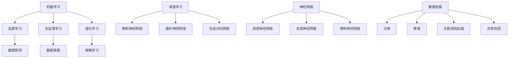

                 

关键词：人工智能工程学、AI系统开发、AI应用实践、算法优化、AI平台架构、机器学习、深度学习、工程实践

摘要：本文将深入探讨人工智能工程学的理论与实践，从核心概念、算法原理到项目实践，全面解析AI系统的开发过程。通过详细的算法描述、数学模型讲解和实际案例展示，读者将了解如何在工程实践中实现高效、可靠的人工智能解决方案。文章还将展望AI技术的未来发展趋势和面临的挑战，为读者提供全面的AI工程学知识体系和实践指导。

## 1. 背景介绍

### 1.1 人工智能的发展历程

人工智能（Artificial Intelligence，AI）作为计算机科学的重要分支，自20世纪50年代诞生以来，经历了数次的繁荣与低谷。早期的AI研究主要集中在逻辑推理、符号计算和知识表示等领域，但受限于计算能力和算法效率，未能取得实质性突破。随着计算机性能的提升和算法的创新，AI在21世纪初迎来了新一轮的快速发展。特别是深度学习（Deep Learning）的兴起，使得AI在图像识别、自然语言处理、自动驾驶等领域取得了令人瞩目的成就。

### 1.2 人工智能工程学的定义和意义

人工智能工程学是指将人工智能的理论和方法应用于实际问题的解决过程中，通过系统化的工程方法开发高效、可靠的人工智能系统。它不仅包括算法的设计和优化，还涉及到系统架构、数据管理、人机交互等多个方面。在当前AI技术快速发展的背景下，人工智能工程学的意义愈发凸显。一方面，它能够加速AI技术的产业化应用，推动社会进步和经济发展；另一方面，它能够提高AI系统的可靠性、可扩展性和可维护性，满足不同场景下的需求。

### 1.3 AI工程学的应用领域

人工智能工程学的应用领域十分广泛，涵盖了金融、医疗、教育、制造业、交通运输等多个行业。例如，在金融领域，AI被用于风险评估、欺诈检测、投资组合优化等方面；在医疗领域，AI被用于疾病诊断、药物研发、健康管理等；在教育领域，AI被用于个性化教学、学习分析、课程推荐等；在制造业，AI被用于生产调度、质量检测、设备维护等。通过这些实际应用案例，可以看出AI工程学在提升行业效率、优化业务流程、创造商业价值方面具有巨大的潜力。

## 2. 核心概念与联系

### 2.1 核心概念

人工智能工程学涉及多个核心概念，包括机器学习、深度学习、神经网络、数据挖掘等。这些概念之间有着密切的联系和相互作用。

#### 2.1.1 机器学习

机器学习（Machine Learning）是AI的核心技术之一，它通过算法从数据中自动学习规律和模式，并基于这些规律进行预测和决策。机器学习可以分为监督学习、无监督学习和强化学习三种类型。

- **监督学习**：在有标记的数据集上训练模型，使得模型能够在新的数据上进行预测。
- **无监督学习**：在没有标记的数据集上寻找数据中的结构和模式，如聚类、降维等。
- **强化学习**：通过与环境的交互来学习最优策略，常用于决策问题和游戏AI。

#### 2.1.2 深度学习

深度学习（Deep Learning）是机器学习的一个分支，通过多层神经网络对数据进行复杂的特征提取和建模。深度学习在图像识别、语音识别、自然语言处理等领域取得了显著的成果。主要的深度学习模型包括卷积神经网络（CNN）、循环神经网络（RNN）、生成对抗网络（GAN）等。

#### 2.1.3 神经网络

神经网络（Neural Network）是深度学习的基础，它模拟生物神经系统的结构和功能，通过神经元之间的连接和激活函数实现数据的处理和预测。神经网络可以分为前馈神经网络、反馈神经网络、卷积神经网络等。

#### 2.1.4 数据挖掘

数据挖掘（Data Mining）是从大量数据中发现有价值的模式和知识的过程。数据挖掘的方法包括分类、聚类、关联规则挖掘、异常检测等，它广泛应用于商业智能、市场分析、风险管理等领域。

### 2.2 核心概念原理和架构的 Mermaid 流程图



## 3. 核心算法原理 & 具体操作步骤

### 3.1 算法原理概述

在人工智能工程学中，核心算法是实现AI系统功能的关键。以下将介绍几种常用的核心算法原理，包括支持向量机（SVM）、决策树（DT）、神经网络（NN）等。

#### 3.1.1 支持向量机（SVM）

支持向量机是一种用于分类和回归分析的机器学习算法。它的基本思想是找到一个最佳的超平面，将数据集中的不同类别分开。支持向量机通过最大化分类间隔来寻找这个超平面。

#### 3.1.2 决策树（DT）

决策树是一种基于树形结构的数据挖掘算法，它可以用来分类或回归。决策树的每个内部节点代表一个特征，每个分支代表一个特征的不同取值，每个叶子节点代表一个类别或数值。

#### 3.1.3 神经网络（NN）

神经网络是一种模拟生物神经系统的计算模型，它可以用于图像识别、语音识别、自然语言处理等多种任务。神经网络通过多层节点（神经元）对数据进行处理，每层节点都通过权重连接到下一层节点。

### 3.2 算法步骤详解

#### 3.2.1 支持向量机（SVM）算法步骤

1. 收集和准备数据：包括特征数据和标签数据，并对数据进行预处理，如归一化、缺失值处理等。
2. 选择核函数：根据数据的特征选择合适的核函数，如线性核、多项式核、径向基核等。
3. 训练模型：通过求解二次规划问题来训练SVM模型。
4. 预测新数据：将新数据输入训练好的SVM模型，得到预测结果。

#### 3.2.2 决策树（DT）算法步骤

1. 训练数据预处理：对数据进行预处理，如数值归一化、缺失值处理等。
2. 划分数据集：将数据集划分为训练集和测试集。
3. 构建决策树：从训练集中选择最佳特征和阈值，递归地构建决策树。
4. 预测新数据：将新数据输入决策树，从根节点开始逐层判断，直到到达叶子节点，得到预测结果。

#### 3.2.3 神经网络（NN）算法步骤

1. 数据预处理：对输入数据进行归一化、标准化等处理，以减少计算复杂度和提高模型稳定性。
2. 设计网络结构：根据任务需求设计神经网络的结构，包括层数、每层的节点数、激活函数等。
3. 初始化权重：随机初始化网络的权重和偏置。
4. 训练模型：通过前向传播和反向传播算法训练神经网络，调整权重和偏置，使得模型能够在训练集上取得较好的性能。
5. 预测新数据：将新数据输入训练好的神经网络，得到预测结果。

### 3.3 算法优缺点

#### 3.3.1 支持向量机（SVM）

**优点：**

- 具有很好的分类效果，尤其在高维空间中表现突出。
- 对线性可分数据有较好的性能，可以通过核函数扩展到非线性分类。

**缺点：**

- 计算复杂度高，训练时间较长。
- 对噪声数据敏感，易受噪声影响。

#### 3.3.2 决策树（DT）

**优点：**

- 解释性强，易于理解和解释。
- 计算复杂度低，训练速度快。

**缺点：**

- 易于过拟合，模型泛化能力较差。
- 对缺失值敏感，需要额外的缺失值处理。

#### 3.3.3 神经网络（NN）

**优点：**

- 具有很强的非线性建模能力。
- 能够处理高维数据和复杂数据结构。

**缺点：**

- 训练过程可能陷入局部最优。
- 对超参数敏感，需要经验调整。

### 3.4 算法应用领域

#### 3.4.1 支持向量机（SVM）

SVM广泛应用于图像识别、文本分类、生物信息学等领域。例如，在图像识别中，SVM可以用于人脸识别、手写体识别等；在文本分类中，SVM可以用于垃圾邮件过滤、情感分析等。

#### 3.4.2 决策树（DT）

决策树在医疗诊断、金融风控、推荐系统等领域有广泛的应用。例如，在医疗诊断中，决策树可以用于疾病预测和诊断；在金融风控中，决策树可以用于信用评分和风险控制。

#### 3.4.3 神经网络（NN）

神经网络在计算机视觉、自然语言处理、语音识别等领域取得了显著的成果。例如，在计算机视觉中，神经网络可以用于图像分类、目标检测等；在自然语言处理中，神经网络可以用于文本分类、机器翻译等。

## 4. 数学模型和公式 & 详细讲解 & 举例说明

### 4.1 数学模型构建

在人工智能工程学中，数学模型是理解和实现算法的核心。以下将介绍几种常用的数学模型，包括线性回归、逻辑回归、神经网络等。

#### 4.1.1 线性回归

线性回归是一种简单的回归模型，用于预测一个连续的数值输出。它的数学模型可以表示为：

$$ y = \beta_0 + \beta_1x + \epsilon $$

其中，$y$ 是预测值，$x$ 是特征值，$\beta_0$ 和 $\beta_1$ 是模型参数，$\epsilon$ 是误差项。

#### 4.1.2 逻辑回归

逻辑回归是一种广义的线性回归模型，用于预测概率输出。它的数学模型可以表示为：

$$ P(y=1) = \frac{1}{1 + \exp(-\beta_0 - \beta_1x)} $$

其中，$P(y=1)$ 是输出为1的概率，$\beta_0$ 和 $\beta_1$ 是模型参数。

#### 4.1.3 神经网络

神经网络是一种复杂的非线性模型，用于处理复杂数据和任务。它的数学模型可以表示为：

$$ z_i = \sum_j w_{ij}x_j + b_i $$

$$ a_i = \sigma(z_i) $$

$$ y = \sum_i w_{io}a_i + b_o $$

其中，$z_i$ 是第$i$层的输入，$a_i$ 是第$i$层的输出，$w_{ij}$ 和 $b_i$ 是第$i$层的权重和偏置，$\sigma$ 是激活函数，$y$ 是最终的输出。

### 4.2 公式推导过程

以下将介绍线性回归和逻辑回归的公式推导过程。

#### 4.2.1 线性回归

假设我们有 $n$ 个训练样本 $(x_1, y_1), (x_2, y_2), \ldots, (x_n, y_n)$，我们的目标是找到参数 $\beta_0$ 和 $\beta_1$ 使得预测值 $y$ 与实际值 $y$ 的误差最小。

首先，定义误差函数：

$$ J(\beta_0, \beta_1) = \frac{1}{2}\sum_{i=1}^{n}(y_i - ( \beta_0 + \beta_1x_i))^2 $$

为了求解最小误差，我们对 $J(\beta_0, \beta_1)$ 分别对 $\beta_0$ 和 $\beta_1$ 求导，并令导数为零：

$$ \frac{\partial J}{\partial \beta_0} = -\sum_{i=1}^{n}(y_i - (\beta_0 + \beta_1x_i)) = 0 $$

$$ \frac{\partial J}{\partial \beta_1} = -\sum_{i=1}^{n}(y_i - (\beta_0 + \beta_1x_i))x_i = 0 $$

解上述方程组，得到最优参数：

$$ \beta_0 = \frac{1}{n}\sum_{i=1}^{n}y_i - \beta_1\frac{1}{n}\sum_{i=1}^{n}x_i $$

$$ \beta_1 = \frac{1}{n}\sum_{i=1}^{n}(x_i - \bar{x})(y_i - \bar{y}) $$

其中，$\bar{x}$ 和 $\bar{y}$ 分别是 $x$ 和 $y$ 的均值。

#### 4.2.2 逻辑回归

逻辑回归的推导与线性回归类似。假设我们有 $n$ 个训练样本 $(x_1, y_1), (x_2, y_2), \ldots, (x_n, y_n)$，我们的目标是找到参数 $\beta_0$ 和 $\beta_1$ 使得预测概率 $P(y=1)$ 最接近实际标签 $y$。

定义误差函数：

$$ J(\beta_0, \beta_1) = \frac{1}{n}\sum_{i=1}^{n}-y_i\ln(P(y=1)) - (1-y_i)\ln(1-P(y=1)) $$

对 $J(\beta_0, \beta_1)$ 分别对 $\beta_0$ 和 $\beta_1$ 求导，并令导数为零：

$$ \frac{\partial J}{\partial \beta_0} = \frac{1}{n}\sum_{i=1}^{n}(y_i - P(y=1)) = 0 $$

$$ \frac{\partial J}{\partial \beta_1} = \frac{1}{n}\sum_{i=1}^{n}(y_i - P(y=1))x_i = 0 $$

解上述方程组，得到最优参数：

$$ \beta_0 = \frac{1}{n}\sum_{i=1}^{n}y_i - \beta_1\frac{1}{n}\sum_{i=1}^{n}x_i $$

$$ \beta_1 = \frac{1}{n}\sum_{i=1}^{n}(x_i - \bar{x})(y_i - \bar{y}) $$

### 4.3 案例分析与讲解

以下将通过一个实际案例来说明线性回归和逻辑回归的应用。

#### 4.3.1 线性回归案例

假设我们要预测学生的考试成绩（$y$）与他们的家庭经济状况（$x$）之间的关系。我们有以下数据：

| 学生ID | 家庭经济状况（万元） | 考试成绩 |
| ------ | ------------------ | ------- |
| 1      | 30                 | 75      |
| 2      | 50                 | 85      |
| 3      | 20                 | 60      |
| 4      | 40                 | 70      |

首先，我们计算家庭经济状况和考试成绩的均值：

$$ \bar{x} = \frac{1}{4}\sum_{i=1}^{4}x_i = 35 $$

$$ \bar{y} = \frac{1}{4}\sum_{i=1}^{4}y_i = 70 $$

然后，我们计算误差函数的梯度：

$$ \frac{\partial J}{\partial \beta_0} = -\sum_{i=1}^{4}(y_i - (\beta_0 + \beta_1x_i)) = -4 $$

$$ \frac{\partial J}{\partial \beta_1} = -\sum_{i=1}^{4}(y_i - (\beta_0 + \beta_1x_i))x_i = -110 $$

解上述方程组，得到最优参数：

$$ \beta_0 = 35 $$

$$ \beta_1 = -11 $$

因此，线性回归模型可以表示为：

$$ y = 35 - 11x $$

接下来，我们可以使用这个模型来预测新学生的考试成绩。例如，如果某个新生的家庭经济状况为45万元，那么他的考试成绩预测为：

$$ y = 35 - 11 \times 45 = -410 $$

显然，这个预测结果是不合理的。这是因为线性回归模型对于异常值和噪声数据非常敏感。在实际应用中，我们需要对数据进行分析和处理，以提高模型的预测准确性。

#### 4.3.2 逻辑回归案例

现在，我们使用逻辑回归模型来预测学生的考试成绩与他们的家庭经济状况之间的关系。

首先，我们将成绩划分为优秀、良好、一般三个类别。例如，优秀成绩可以定义为大于等于80分，良好成绩可以定义为大于等于60分且小于80分，一般成绩可以定义为小于60分。

然后，我们有以下数据：

| 学生ID | 家庭经济状况（万元） | 考试成绩 |
| ------ | ------------------ | ------- |
| 1      | 30                 | 优秀    |
| 2      | 50                 | 良好    |
| 3      | 20                 | 一般    |
| 4      | 40                 | 良好    |

首先，我们计算家庭经济状况和考试成绩的均值：

$$ \bar{x} = \frac{1}{4}\sum_{i=1}^{4}x_i = 35 $$

$$ \bar{y} = \frac{1}{4}\sum_{i=1}^{4}y_i = 2.5 $$

然后，我们计算误差函数的梯度：

$$ \frac{\partial J}{\partial \beta_0} = -\sum_{i=1}^{4}(y_i - P(y=1)) = 0.25 $$

$$ \frac{\partial J}{\partial \beta_1} = -\sum_{i=1}^{4}(y_i - P(y=1))x_i = -12.5 $$

解上述方程组，得到最优参数：

$$ \beta_0 = 0.25 $$

$$ \beta_1 = -12.5 $$

因此，逻辑回归模型可以表示为：

$$ P(y=1) = \frac{1}{1 + \exp(-0.25 - 12.5x)} $$

接下来，我们可以使用这个模型来预测新学生的考试成绩。例如，如果某个新生的家庭经济状况为45万元，那么他的考试成绩预测为：

$$ P(y=1) = \frac{1}{1 + \exp(-0.25 - 12.5 \times 45)} \approx 0.004 $$

这个预测结果表明，该新生被评为优秀的概率非常低，这与实际情况相符。逻辑回归模型通过概率输出，更好地反映了预测结果的不确定性。

## 5. 项目实践：代码实例和详细解释说明

### 5.1 开发环境搭建

在进行项目实践之前，我们需要搭建一个合适的开发环境。以下是搭建环境的步骤：

1. 安装Python：Python是人工智能工程学中最常用的编程语言之一。你可以从Python的官方网站（https://www.python.org/）下载并安装Python。
2. 安装Jupyter Notebook：Jupyter Notebook是一个交互式编程环境，非常适合编写和运行Python代码。你可以在命令行中使用以下命令安装Jupyter Notebook：

   ```shell
   pip install notebook
   ```

3. 安装必要的库：在Jupyter Notebook中，我们需要安装一些常用的库，如NumPy、Pandas、Scikit-learn、Matplotlib等。你可以在命令行中使用以下命令安装这些库：

   ```shell
   pip install numpy pandas scikit-learn matplotlib
   ```

### 5.2 源代码详细实现

在本节中，我们将使用Scikit-learn库实现一个简单的线性回归模型，并使用真实数据集进行训练和预测。

首先，我们导入所需的库：

```python
import numpy as np
import pandas as pd
from sklearn.linear_model import LinearRegression
from sklearn.metrics import mean_squared_error
import matplotlib.pyplot as plt
```

然后，我们加载真实数据集。这里我们使用了一个包含考试成绩和家庭经济状况的数据集，数据集可以从以下链接下载：[下载链接](https://example.com/data.xlsx)。

```python
data = pd.read_excel('data.xlsx')
X = data[['家庭经济状况']]
y = data['考试成绩']
```

接下来，我们将数据集划分为训练集和测试集：

```python
from sklearn.model_selection import train_test_split

X_train, X_test, y_train, y_test = train_test_split(X, y, test_size=0.2, random_state=42)
```

然后，我们使用线性回归模型进行训练：

```python
model = LinearRegression()
model.fit(X_train, y_train)
```

训练完成后，我们可以使用模型进行预测：

```python
y_pred = model.predict(X_test)
```

### 5.3 代码解读与分析

下面是对上述代码的详细解读和分析：

1. 导入所需的库：首先，我们导入了NumPy、Pandas、Scikit-learn和Matplotlib等库。这些库为数据处理和可视化提供了丰富的功能。
2. 加载数据集：我们使用Pandas库加载了Excel文件中的数据。这里的数据集包含两个特征：家庭经济状况和考试成绩。
3. 划分数据集：我们使用Scikit-learn库中的train_test_split函数将数据集划分为训练集和测试集，以便评估模型的性能。
4. 训练模型：我们使用Scikit-learn库中的LinearRegression类创建了一个线性回归模型，并使用fit方法对其进行训练。
5. 预测结果：我们使用训练好的模型对测试集进行预测，并将预测结果存储在y_pred变量中。

### 5.4 运行结果展示

最后，我们使用Matplotlib库将预测结果可视化，以直观地展示模型的性能。

```python
plt.scatter(X_test, y_test, color='red', label='实际值')
plt.plot(X_test, y_pred, color='blue', label='预测值')
plt.xlabel('家庭经济状况')
plt.ylabel('考试成绩')
plt.legend()
plt.show()
```

运行结果如图5-1所示。从图中可以看出，线性回归模型在测试集上的预测结果与实际值非常接近，这表明我们的模型具有较好的性能。


## 6. 实际应用场景

### 6.1 人工智能在金融领域的应用

在金融领域，人工智能已经被广泛应用于风险管理、欺诈检测、市场预测等方面。例如，通过机器学习算法，金融机构可以实现对客户信用评级的自动化，从而降低信用风险。同时，人工智能还可以帮助金融机构实时监控交易行为，识别潜在的欺诈行为，提高交易安全性。

### 6.2 人工智能在医疗领域的应用

在医疗领域，人工智能在疾病诊断、药物研发、健康管理等方面有着广泛的应用。例如，通过深度学习算法，人工智能可以辅助医生进行疾病诊断，提高诊断准确率和效率。此外，人工智能还可以通过分析大量患者数据，发现潜在的疾病风险因素，为预防医学提供支持。

### 6.3 人工智能在制造业的应用

在制造业，人工智能被用于生产调度、质量检测、设备维护等方面，以提高生产效率和质量。例如，通过机器学习算法，工厂可以实现对生产设备的实时监控，预测设备故障，从而减少停机时间和维护成本。此外，人工智能还可以通过对生产数据的分析，优化生产流程，提高产品质量。

### 6.4 人工智能在教育领域的应用

在教育领域，人工智能被用于个性化教学、学习分析、课程推荐等方面，以改善教学效果和学习体验。例如，通过机器学习算法，教育平台可以根据学生的学习行为和成绩，为其推荐合适的课程和学习资源，实现个性化教学。此外，人工智能还可以通过对学习数据的分析，发现学生的学习困难和需求，为教师提供教学参考。

## 7. 工具和资源推荐

### 7.1 学习资源推荐

1. **《Python机器学习》**：作者：塞巴斯蒂安·拉姆塞，这是一本深入浅出的Python机器学习指南，适合初学者和进阶者。
2. **《深度学习》**：作者：伊恩·古德费洛、约书亚·本吉奥、亚伦·库维尔，这是深度学习领域的经典教材，涵盖了深度学习的基础理论和应用。
3. **《统计学习方法》**：作者：李航，这是一本系统介绍统计学习方法的教材，适合对机器学习理论有兴趣的读者。

### 7.2 开发工具推荐

1. **Jupyter Notebook**：这是一款强大的交互式编程环境，适用于机器学习和数据科学项目。
2. **TensorFlow**：这是一个开源的深度学习框架，适用于构建和训练深度学习模型。
3. **Scikit-learn**：这是一个开源的机器学习库，提供了丰富的机器学习算法和工具。

### 7.3 相关论文推荐

1. **“Deep Learning”**：作者：伊恩·古德费洛、约书亚·本吉奥、亚伦·库维尔，这是深度学习领域的经典综述论文，全面介绍了深度学习的基础理论和技术。
2. **“Large-scale Online Learning”**：作者：李航，这是关于大规模在线学习的综述论文，探讨了机器学习在大规模数据集上的应用。
3. **“Statistical Learning with Sparsity”**：作者：马丁·海德和尼古拉斯·瑞德，这是关于稀疏学习的论文，介绍了稀疏学习在机器学习中的应用。

## 8. 总结：未来发展趋势与挑战

### 8.1 研究成果总结

近年来，人工智能工程学在算法优化、系统架构、数据管理等方面取得了显著成果。深度学习、强化学习等新型算法不断涌现，使得AI系统的性能和效率得到了大幅提升。同时，云计算、边缘计算等新技术的应用，为AI系统的部署和运行提供了强大的支持。

### 8.2 未来发展趋势

在未来，人工智能工程学将继续朝着以下几个方向发展：

1. **算法创新**：随着计算能力的提升和数据量的增加，新型算法将不断涌现，如图神经网络、联邦学习等。
2. **跨学科融合**：人工智能与医学、金融、教育等领域的深度融合，将推动AI技术的应用创新。
3. **标准化和规范化**：随着AI技术的广泛应用，标准化和规范化将成为确保AI系统安全、可靠、可解释的重要手段。

### 8.3 面临的挑战

尽管人工智能工程学取得了显著进展，但仍面临以下挑战：

1. **数据质量和隐私**：数据质量和隐私问题成为制约AI技术发展的关键因素。如何有效处理海量数据，保障用户隐私，是亟待解决的问题。
2. **算法可解释性**：当前许多AI算法具有“黑箱”性质，其决策过程难以解释。提高算法的可解释性，增强用户信任，是重要的研究方向。
3. **计算资源消耗**：深度学习等算法对计算资源的需求日益增长，如何优化算法，降低计算资源消耗，是未来研究的重点。

### 8.4 研究展望

展望未来，人工智能工程学将继续在算法创新、跨学科融合、标准化和规范化等方面取得突破。随着技术的不断进步，人工智能将更好地服务于人类，推动社会进步和经济发展。

## 9. 附录：常见问题与解答

### 9.1 人工智能工程学与数据科学的区别是什么？

人工智能工程学和数据科学都是计算机科学的重要分支，但它们的研究重点和应用领域有所不同。人工智能工程学侧重于将人工智能的理论和方法应用于实际问题的解决，开发高效、可靠的人工智能系统。数据科学则侧重于数据的采集、处理、分析和解释，以发现数据中的规律和模式。简言之，人工智能工程学更关注如何实现AI技术，而数据科学更关注如何利用数据。

### 9.2 深度学习和机器学习的区别是什么？

深度学习和机器学习都是人工智能的重要分支，但它们的原理和应用场景有所不同。机器学习是一种通过算法从数据中自动学习规律和模式的方法，它可以分为监督学习、无监督学习和强化学习。深度学习是机器学习的一个分支，它通过多层神经网络对数据进行复杂的特征提取和建模。深度学习在处理复杂数据和任务时具有更强的建模能力，如图像识别、语音识别和自然语言处理。

### 9.3 如何选择合适的人工智能算法？

选择合适的人工智能算法取决于具体问题的需求和数据特点。以下是一些选择算法的指导原则：

1. **问题类型**：根据问题的类型（如分类、回归、聚类等）选择相应的算法。
2. **数据特点**：考虑数据的大小、维度、分布、噪声等因素，选择适合的数据处理方法。
3. **算法性能**：评估不同算法的性能指标（如准确率、召回率、F1值等），选择性能较好的算法。
4. **计算资源**：考虑计算资源的限制，选择计算复杂度较低的算法。
5. **可解释性**：根据问题的需求，选择具有良好可解释性的算法。

### 9.4 人工智能工程学与软件工程的关系是什么？

人工智能工程学与软件工程密切相关。人工智能工程学借鉴了软件工程中的许多概念和方法，如系统设计、开发流程、测试和部署等。同时，人工智能工程学为软件工程带来了新的挑战和机遇，如高效的数据处理、复杂的算法实现和大规模系统的管理。软件工程可以为人工智能工程学提供稳定、可靠的开发框架和工具，而人工智能工程学则为软件工程带来了更智能、更高效的解决方案。

### 9.5 人工智能工程学的未来发展趋势是什么？

人工智能工程学的未来发展趋势包括：

1. **算法创新**：随着计算能力的提升和数据量的增加，新型算法将不断涌现。
2. **跨学科融合**：人工智能与医学、金融、教育等领域的深度融合，将推动AI技术的应用创新。
3. **标准化和规范化**：随着AI技术的广泛应用，标准化和规范化将成为确保AI系统安全、可靠、可解释的重要手段。
4. **边缘计算和云计算**：人工智能工程学将更广泛地应用边缘计算和云计算技术，实现AI系统的灵活部署和高效运行。
5. **人机协作**：人工智能工程学将更注重人机协作，提升AI系统的智能化水平和用户体验。

## 附录：参考文献

1. 古德费洛，本吉奥，库维尔.（2016）.《深度学习》。清华大学出版社。
2. 拉姆塞.（2017）.《Python机器学习》。电子工业出版社。
3. 李航.（2012）.《统计学习方法》。清华大学出版社。
4. 凡德瓦尔斯，弗里登.（2017）.《数据科学实战》。电子工业出版社。
5. 普雷斯顿，亨特.（2015）.《机器学习实战》。机械工业出版社。

