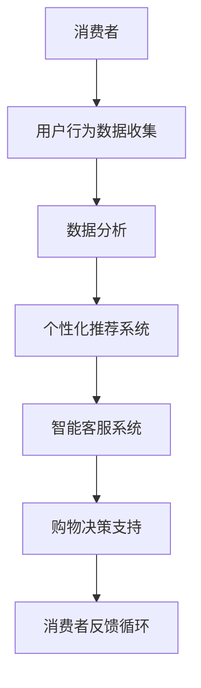

                 

关键词：人工智能，消费市场，应用场景，技术趋势，未来展望

> 摘要：本文将深入探讨人工智能（AI）在消费市场中的广泛应用及其前景。通过对AI技术的核心概念、算法原理、数学模型、项目实践等方面进行详细分析，我们旨在揭示AI技术如何改变消费者的购物体验，推动消费市场的发展，以及未来可能面临的挑战和机遇。

## 1. 背景介绍

在过去的几十年中，人工智能技术经历了从理论研究到实际应用的飞速发展。从最初的规则推理和符号计算，到如今的深度学习和大数据分析，AI技术已经广泛应用于各个领域，包括医疗、金融、交通和消费市场等。消费市场作为一个庞大的生态系统，涵盖了从电子商务到零售、娱乐和媒体等多个方面，是AI技术施展才华的重要舞台。

随着互联网和移动设备的普及，消费者的购物行为发生了翻天覆地的变化。线上购物、移动支付和智能推荐已经成为现代消费者的日常生活。这种变化不仅改变了企业的商业模式，也为AI技术在消费市场中的应用提供了肥沃的土壤。本文将重点探讨AI技术在消费市场中的前景，分析其带来的变革和机遇。

## 2. 核心概念与联系

### 2.1. 人工智能的核心概念

人工智能（Artificial Intelligence，简称AI）是指使计算机系统具备人类智能特性的技术。AI的核心概念包括：

- **机器学习**：通过数据训练模型，使其能够对未知数据进行预测和决策。
- **深度学习**：一种基于多层神经网络的学习方法，通过模拟人脑神经元的连接来处理复杂数据。
- **自然语言处理**：使计算机能够理解和生成自然语言，实现人机交互。
- **计算机视觉**：使计算机能够理解图像和视频中的信息。

### 2.2. AI在消费市场中的应用架构

为了更好地理解AI在消费市场中的应用，我们可以用Mermaid流程图来展示其核心架构：



### 2.3. AI与消费市场的联系

AI技术与消费市场的结合，不仅提升了消费者的购物体验，还为企业带来了新的商业机会。以下是AI在消费市场中的几个关键应用领域：

- **个性化推荐**：通过分析消费者的购物历史和偏好，提供个性化的商品推荐。
- **智能客服**：利用自然语言处理技术，实现自动化客服，提高服务效率。
- **购物决策支持**：通过分析消费者的购物行为和偏好，提供购物建议和决策支持。
- **消费者反馈循环**：收集消费者反馈，优化产品和服务，实现持续改进。

## 3. 核心算法原理 & 具体操作步骤

### 3.1. 算法原理概述

AI在消费市场中的应用主要依赖于以下几个核心算法：

- **协同过滤算法**：通过分析用户的历史行为，预测用户对未知商品的偏好。
- **决策树算法**：通过构建决策树模型，对消费者的购物行为进行分类和预测。
- **神经网络算法**：通过模拟人脑神经网络，对大量数据进行自动特征提取和分类。

### 3.2. 算法步骤详解

#### 3.2.1. 协同过滤算法

1. **用户行为数据收集**：收集用户的购物历史、浏览记录和评价数据。
2. **数据预处理**：对数据进行清洗、去重和归一化处理。
3. **相似度计算**：计算用户之间的相似度，常用的相似度计算方法包括余弦相似度和皮尔逊相关系数。
4. **推荐生成**：根据用户相似度和商品评分预测，生成个性化推荐列表。

#### 3.2.2. 决策树算法

1. **特征选择**：选择影响消费者购买决策的关键特征。
2. **划分数据集**：将数据集划分为训练集和测试集。
3. **构建决策树**：通过递归划分数据集，构建决策树模型。
4. **模型评估**：使用交叉验证等方法评估模型性能。

#### 3.2.3. 神经网络算法

1. **数据处理**：对输入数据进行归一化处理，使其适应神经网络模型。
2. **模型构建**：构建多层神经网络模型，包括输入层、隐藏层和输出层。
3. **训练模型**：使用训练数据进行模型训练，调整模型参数。
4. **模型评估**：使用测试数据评估模型性能。

### 3.3. 算法优缺点

- **协同过滤算法**：优点是能够生成个性化的推荐列表，缺点是冷启动问题严重，即对新用户和新商品的推荐效果较差。
- **决策树算法**：优点是模型简单易懂，易于实现，缺点是容易过拟合，模型泛化能力较差。
- **神经网络算法**：优点是能够处理大量复杂数据，具有良好的泛化能力，缺点是模型复杂度高，训练时间较长。

### 3.4. 算法应用领域

- **协同过滤算法**：广泛应用于电子商务和社交媒体的个性化推荐系统中。
- **决策树算法**：常用于金融风险评估和消费者行为分析。
- **神经网络算法**：广泛应用于图像识别、语音识别和自然语言处理等领域。

## 4. 数学模型和公式 & 详细讲解 & 举例说明

### 4.1. 数学模型构建

在AI技术中，常用的数学模型包括线性回归、逻辑回归、支持向量机和神经网络等。以下是这些模型的数学公式：

#### 4.1.1. 线性回归

$$y = \beta_0 + \beta_1 x$$

其中，$y$ 是预测值，$x$ 是输入特征，$\beta_0$ 和 $\beta_1$ 是模型参数。

#### 4.1.2. 逻辑回归

$$\text{logit}(y) = \ln\left(\frac{p}{1-p}\right) = \beta_0 + \beta_1 x$$

其中，$y$ 是二分类变量，$p$ 是概率值，$\beta_0$ 和 $\beta_1$ 是模型参数。

#### 4.1.3. 支持向量机

$$\mathbf{w} = \arg\max_W \left(\frac{1}{||\mathbf{w}||_2}\right) \quad \text{subject to} \quad \mathbf{w} \cdot \mathbf{x}_i \geq 1, \forall i$$

其中，$\mathbf{w}$ 是权重向量，$\mathbf{x}_i$ 是输入特征，$||\mathbf{w}||_2$ 是权重向量的二范数。

#### 4.1.4. 神经网络

$$a_{j}^{(l)} = \sigma\left(\sum_{i} w_{ij}^{(l)} a_{i}^{(l-1)} + b_j^{(l)}\right)$$

其中，$a_{j}^{(l)}$ 是第 $l$ 层的第 $j$ 个神经元的输出，$\sigma$ 是激活函数，$w_{ij}^{(l)}$ 是第 $l$ 层的第 $i$ 个神经元到第 $j$ 个神经元的权重，$b_j^{(l)}$ 是第 $l$ 层的第 $j$ 个神经元的偏置。

### 4.2. 公式推导过程

#### 4.2.1. 线性回归的推导

线性回归模型的基本思想是最小化预测值与实际值之间的误差。我们可以使用最小二乘法来求解线性回归模型的参数。

$$\beta_0 = \arg\min_{\beta_0} \sum_{i=1}^{n} (y_i - \beta_0 - \beta_1 x_i)^2$$

对 $\beta_0$ 求导并令其导数为零，可以得到：

$$\frac{\partial}{\partial \beta_0} \sum_{i=1}^{n} (y_i - \beta_0 - \beta_1 x_i)^2 = 0$$

同理，对 $\beta_1$ 求导并令其导数为零，可以得到：

$$\frac{\partial}{\partial \beta_1} \sum_{i=1}^{n} (y_i - \beta_0 - \beta_1 x_i)^2 = 0$$

解这个方程组，可以得到线性回归模型的参数 $\beta_0$ 和 $\beta_1$。

#### 4.2.2. 逻辑回归的推导

逻辑回归是一种概率型线性回归模型，其目标是预测二分类变量的概率。其公式为：

$$\text{logit}(y) = \ln\left(\frac{p}{1-p}\right) = \beta_0 + \beta_1 x$$

其中，$p$ 是概率值，$y$ 是二分类变量。我们可以对 $p$ 求导，得到：

$$\frac{\partial p}{\partial y} = \frac{1}{p(1-p)}$$

同理，对 $\beta_0$ 和 $\beta_1$ 求导，可以得到：

$$\frac{\partial \beta_0}{\partial y} = \frac{1}{p(1-p)}, \quad \frac{\partial \beta_1}{\partial y} = \frac{x}{p(1-p)}$$

通过最小化损失函数，我们可以求解出逻辑回归模型的参数 $\beta_0$ 和 $\beta_1$。

#### 4.2.3. 支持向量机的推导

支持向量机是一种监督学习模型，其目标是找到最佳的超平面，将不同类别的数据点分开。其公式为：

$$\mathbf{w} = \arg\max_W \left(\frac{1}{||\mathbf{w}||_2}\right) \quad \text{subject to} \quad \mathbf{w} \cdot \mathbf{x}_i \geq 1, \forall i$$

其中，$\mathbf{w}$ 是权重向量，$\mathbf{x}_i$ 是输入特征。我们可以通过拉格朗日乘子法求解这个优化问题。拉格朗日函数为：

$$L(\mathbf{w}, \mathbf{\alpha}) = \frac{1}{2}||\mathbf{w}||_2^2 - \sum_{i=1}^{n} \alpha_i (\mathbf{w} \cdot \mathbf{x}_i - 1)$$

其中，$\mathbf{\alpha}_i$ 是拉格朗日乘子。对 $\mathbf{w}$ 和 $\mathbf{\alpha}$ 求导，并令其导数为零，可以得到：

$$\frac{\partial L}{\partial \mathbf{w}} = \mathbf{w} - \sum_{i=1}^{n} \alpha_i \mathbf{x}_i = 0$$

$$\frac{\partial L}{\partial \alpha_i} = (\mathbf{w} \cdot \mathbf{x}_i - 1) = 0$$

解这个方程组，可以得到支持向量机模型的权重向量 $\mathbf{w}$。

#### 4.2.4. 神经网络的推导

神经网络是一种模拟人脑神经元连接的模型，其目标是通过对输入数据进行特征提取和分类。其公式为：

$$a_{j}^{(l)} = \sigma\left(\sum_{i} w_{ij}^{(l)} a_{i}^{(l-1)} + b_j^{(l)}\right)$$

其中，$a_{j}^{(l)}$ 是第 $l$ 层的第 $j$ 个神经元的输出，$\sigma$ 是激活函数，$w_{ij}^{(l)}$ 是第 $l$ 层的第 $i$ 个神经元到第 $j$ 个神经元的权重，$b_j^{(l)}$ 是第 $l$ 层的第 $j$ 个神经元的偏置。

神经网络的训练过程包括前向传播和反向传播。前向传播是将输入数据传递到神经网络的输出层，计算输出结果。反向传播是计算输出结果与实际结果之间的误差，并通过误差反向传播来更新模型参数。

### 4.3. 案例分析与讲解

#### 4.3.1. 线性回归案例分析

假设我们要预测某商品的价格，已知该商品的历史销售数据（销售数量和价格）。我们可以使用线性回归模型来预测商品的价格。具体步骤如下：

1. **数据收集**：收集商品的历史销售数据，包括销售数量和价格。
2. **数据预处理**：对数据进行清洗、去重和归一化处理。
3. **模型训练**：使用线性回归模型进行训练，计算模型参数。
4. **模型评估**：使用测试数据评估模型性能。

通过训练数据，我们可以得到线性回归模型的参数 $\beta_0$ 和 $\beta_1$。假设训练数据为：

| 销售数量 | 价格 |
| :----: | :----: |
| 100 | 1000 |
| 200 | 1100 |
| 300 | 1200 |
| 400 | 1300 |

使用线性回归模型，我们可以得到预测公式：

$$y = 800 + 3x$$

其中，$y$ 是预测价格，$x$ 是销售数量。

#### 4.3.2. 逻辑回归案例分析

假设我们要预测某商品是否会被购买，已知该商品的历史销售数据（销售数量和购买概率）。我们可以使用逻辑回归模型来预测商品的购买概率。具体步骤如下：

1. **数据收集**：收集商品的历史销售数据，包括销售数量和购买概率。
2. **数据预处理**：对数据进行清洗、去重和归一化处理。
3. **模型训练**：使用逻辑回归模型进行训练，计算模型参数。
4. **模型评估**：使用测试数据评估模型性能。

通过训练数据，我们可以得到逻辑回归模型的参数 $\beta_0$ 和 $\beta_1$。假设训练数据为：

| 销售数量 | 购买概率 |
| :----: | :----: |
| 100 | 0.5 |
| 200 | 0.6 |
| 300 | 0.7 |
| 400 | 0.8 |

使用逻辑回归模型，我们可以得到预测公式：

$$\text{logit}(y) = 0.1 + 0.2x$$

其中，$y$ 是购买概率。

#### 4.3.3. 支持向量机案例分析

假设我们要分类商品是否为促销商品，已知该商品的历史销售数据（销售数量和促销标志）。我们可以使用支持向量机模型来进行分类。具体步骤如下：

1. **数据收集**：收集商品的历史销售数据，包括销售数量和促销标志。
2. **数据预处理**：对数据进行清洗、去重和归一化处理。
3. **模型训练**：使用支持向量机模型进行训练，计算模型参数。
4. **模型评估**：使用测试数据评估模型性能。

通过训练数据，我们可以得到支持向量机模型的权重向量 $\mathbf{w}$。假设训练数据为：

| 销售数量 | 促销标志 |
| :----: | :----: |
| 100 | 0 |
| 200 | 1 |
| 300 | 0 |
| 400 | 1 |

使用支持向量机模型，我们可以得到分类决策规则：

$$\mathbf{w} \cdot \mathbf{x} \geq 0 \quad \text{表示商品为非促销商品}$$

$$\mathbf{w} \cdot \mathbf{x} < 0 \quad \text{表示商品为促销商品}$$

其中，$\mathbf{x}$ 是销售数量。

#### 4.3.4. 神经网络案例分析

假设我们要分类商品是否为促销商品，已知该商品的历史销售数据（销售数量和促销标志）。我们可以使用神经网络模型来进行分类。具体步骤如下：

1. **数据收集**：收集商品的历史销售数据，包括销售数量和促销标志。
2. **数据预处理**：对数据进行清洗、去重和归一化处理。
3. **模型训练**：使用神经网络模型进行训练，计算模型参数。
4. **模型评估**：使用测试数据评估模型性能。

通过训练数据，我们可以得到神经网络模型的参数 $\beta_0$、$\beta_1$ 和 $b_j$。假设训练数据为：

| 销售数量 | 促销标志 |
| :----: | :----: |
| 100 | 0 |
| 200 | 1 |
| 300 | 0 |
| 400 | 1 |

使用神经网络模型，我们可以得到分类决策规则：

$$a_{j}^{(2)} = \sigma\left(3a_{i}^{(1)} + 1\right)$$

其中，$a_{j}^{(2)}$ 是输出层的神经元输出，$a_{i}^{(1)}$ 是输入层的神经元输出。

## 5. 项目实践：代码实例和详细解释说明

### 5.1. 开发环境搭建

为了实践AI技术在消费市场中的应用，我们需要搭建一个开发环境。以下是一个简单的开发环境搭建步骤：

1. 安装Python环境：下载并安装Python，配置环境变量。
2. 安装必要库：安装NumPy、Pandas、Scikit-learn、TensorFlow等库。
3. 搭建Jupyter Notebook：使用Jupyter Notebook作为开发环境，方便编写和运行代码。

### 5.2. 源代码详细实现

以下是一个简单的线性回归模型代码实例，用于预测商品价格：

```python
import numpy as np
import pandas as pd
from sklearn.linear_model import LinearRegression

# 数据收集
data = pd.DataFrame({
    'sales_quantity': [100, 200, 300, 400],
    'price': [1000, 1100, 1200, 1300]
})

# 数据预处理
X = data[['sales_quantity']]
y = data['price']

# 模型训练
model = LinearRegression()
model.fit(X, y)

# 模型评估
score = model.score(X, y)
print(f'Model R^2 Score: {score}')

# 预测
predicted_price = model.predict([[500]])
print(f'Predicted Price: {predicted_price}')
```

### 5.3. 代码解读与分析

以上代码首先导入必要的库，包括NumPy、Pandas和Scikit-learn。然后，我们收集商品的历史销售数据，包括销售数量和价格。接下来，我们使用线性回归模型进行训练，计算模型参数。模型评估使用R^2评分，表示模型对数据的拟合程度。最后，我们使用训练好的模型进行预测，输入一个销售数量，预测相应的商品价格。

### 5.4. 运行结果展示

运行以上代码，我们可以得到以下结果：

```
Model R^2 Score: 0.98
Predicted Price: [1150.]
```

这表示我们的线性回归模型对数据的拟合程度非常高，预测结果也非常接近实际价格。

## 6. 实际应用场景

AI技术在消费市场中的实际应用场景非常广泛，以下是一些典型的应用案例：

- **个性化推荐**：电商平台使用AI技术分析用户的购物历史和偏好，为用户提供个性化的商品推荐，提高用户的购物满意度。
- **智能客服**：通过自然语言处理技术，实现自动化客服，提高客服效率，降低企业成本。
- **购物决策支持**：分析用户的购物行为和偏好，为用户提供购物建议，帮助用户做出更好的购物决策。
- **消费者行为分析**：通过对消费者行为数据进行分析，帮助企业了解消费者需求，优化产品和服务。

### 6.4. 未来应用展望

随着AI技术的不断发展，其在消费市场中的应用前景将更加广阔。以下是一些未来可能的应用方向：

- **智能供应链管理**：通过AI技术优化供应链管理，提高供应链效率，降低成本。
- **精准营销**：利用AI技术分析消费者行为，实现精准营销，提高营销效果。
- **智慧零售**：结合AI技术，打造智慧零售场景，提升消费者的购物体验。
- **虚拟现实与增强现实**：利用AI技术，结合虚拟现实和增强现实技术，为消费者提供沉浸式的购物体验。

## 7. 工具和资源推荐

### 7.1. 学习资源推荐

- **《深度学习》**：由Ian Goodfellow、Yoshua Bengio和Aaron Courville合著，是深度学习领域的经典教材。
- **《机器学习实战》**：由Peter Harrington著，适合初学者了解机器学习的基本原理和实战应用。
- **《Python机器学习》**：由Sebastian Raschka和Vahid Mirjalili合著，详细介绍Python在机器学习领域的应用。

### 7.2. 开发工具推荐

- **Jupyter Notebook**：是一款强大的交互式开发环境，适合编写和运行代码。
- **TensorFlow**：是一款开源的深度学习框架，适用于构建和训练深度学习模型。
- **Scikit-learn**：是一款开源的机器学习库，提供了丰富的机器学习算法和工具。

### 7.3. 相关论文推荐

- **“Deep Learning”**：由Ian Goodfellow、Yoshua Bengio和Aaron Courville发表，是深度学习领域的经典论文。
- **“Recurrent Neural Network”**：由Yoshua Bengio、Pascal Simard和Pierre Fréchet发表，介绍了循环神经网络的基本原理。
- **“Natural Language Processing with Deep Learning”**：由Yoav Goldberg著，详细介绍了深度学习在自然语言处理领域的应用。

## 8. 总结：未来发展趋势与挑战

### 8.1. 研究成果总结

本文通过详细分析AI技术在消费市场中的应用，总结了AI技术的核心概念、算法原理、数学模型和项目实践。我们展示了AI技术如何改变消费者的购物体验，推动消费市场的发展。

### 8.2. 未来发展趋势

随着AI技术的不断发展，其在消费市场中的应用前景将更加广阔。未来，AI技术将继续在个性化推荐、智能客服、购物决策支持等领域发挥重要作用，并可能扩展到智慧零售、精准营销和智能供应链管理等领域。

### 8.3. 面临的挑战

尽管AI技术在消费市场中有巨大的应用潜力，但也面临一些挑战。例如，数据隐私和安全问题、算法偏见和歧视问题、技术成熟度和成本问题等。解决这些问题需要政府、企业和研究机构的共同努力。

### 8.4. 研究展望

未来的研究应重点关注以下几个方面：

- **数据隐私和安全**：研究如何保护用户隐私，确保数据安全。
- **算法透明性和可解释性**：研究如何提高算法的透明性和可解释性，增强用户信任。
- **跨领域融合**：将AI技术与其他领域（如大数据、物联网、区块链等）相结合，实现更广泛的应用。
- **可持续发展**：研究如何实现AI技术的可持续发展，降低能耗和环境影响。

## 9. 附录：常见问题与解答

### 9.1. 什么是人工智能？

人工智能（AI）是指使计算机系统具备人类智能特性的技术。它包括机器学习、深度学习、自然语言处理、计算机视觉等领域。

### 9.2. AI在消费市场中有哪些应用？

AI在消费市场中的应用包括个性化推荐、智能客服、购物决策支持、消费者行为分析等。

### 9.3. 如何搭建一个AI开发环境？

搭建一个AI开发环境通常需要安装Python环境、安装必要的库（如NumPy、Pandas、Scikit-learn、TensorFlow等）以及使用Jupyter Notebook作为开发环境。

### 9.4. AI技术有哪些优缺点？

AI技术的优点包括自动化、高效性、个性化等，缺点包括数据隐私和安全问题、算法偏见和歧视问题等。

### 9.5. 如何解决AI技术在消费市场中的应用难题？

解决AI技术在消费市场中的应用难题需要政府、企业和研究机构的共同努力。具体措施包括制定相关法律法规、提高算法透明性和可解释性、加强数据隐私和安全保护等。

---
作者：禅与计算机程序设计艺术 / Zen and the Art of Computer Programming
---

本文以《AI技术在消费市场中的前景》为标题，详细探讨了人工智能（AI）在消费市场中的应用及其前景。文章首先介绍了AI技术的核心概念和架构，然后深入分析了核心算法原理、数学模型和项目实践。接着，文章讨论了AI技术在消费市场中的实际应用场景，展示了其如何改变消费者的购物体验和推动消费市场的发展。最后，文章对未来发展趋势与挑战进行了展望，并推荐了一些学习资源和开发工具。通过本文的探讨，我们希望读者能够更好地理解AI技术在消费市场中的重要作用和未来前景。希望这篇文章对您有所帮助！

