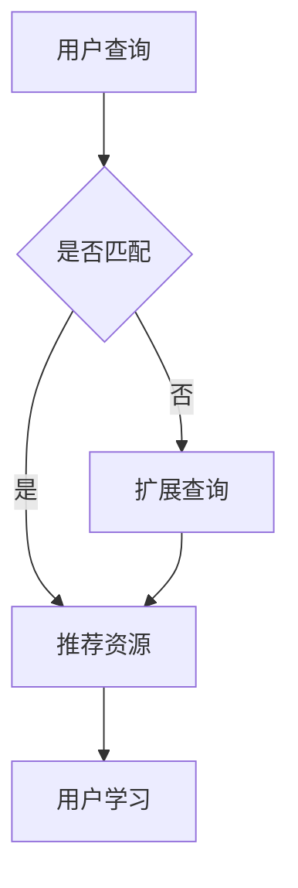

                 

关键词：AI搜索引擎、教育技术、智能教学、学习数据分析、个性化教育、教育资源、教育创新

> 摘要：本文探讨了人工智能（AI）搜索引擎在教育领域的广泛应用前景。通过分析AI搜索引擎的核心技术和优势，本文揭示了其在教育资源检索、智能教学、学习数据分析和个性化教育等方面的潜在应用。同时，本文也对AI搜索引擎在教育领域的未来发展和面临的挑战进行了深入讨论。

## 1. 背景介绍

在信息爆炸的时代，教育资源的获取变得愈发重要。然而，传统的教育资源检索方式存在诸多限制，如信息碎片化、检索效率低、个性化不足等问题。随着人工智能技术的飞速发展，AI搜索引擎逐渐成为解决这些问题的有力工具。AI搜索引擎通过深度学习、自然语言处理和大数据分析等技术，能够实现对大量教育资源的智能筛选和推荐，为用户提供更加精准、个性化的学习体验。

### 1.1 教育资源检索问题

传统的教育资源检索存在以下问题：

- **信息碎片化**：教育内容分散在不同的平台和资源库中，用户难以找到全面、系统化的学习资源。
- **检索效率低**：用户需要耗费大量时间和精力在海量的信息中寻找所需资源。
- **个性化不足**：传统搜索引擎难以根据用户的学习需求和兴趣提供个性化的资源推荐。

### 1.2 AI搜索引擎的优势

与传统的教育资源检索方式相比，AI搜索引擎具有以下优势：

- **智能筛选**：通过深度学习和自然语言处理技术，AI搜索引擎能够理解用户的查询意图，并从海量的教育资源中快速筛选出符合需求的内容。
- **个性化推荐**：基于大数据分析和用户行为数据，AI搜索引擎可以为用户提供个性化的资源推荐，提高学习效果。
- **实时更新**：AI搜索引擎能够实时更新教育资源库，确保用户获取到的信息是最新的。

## 2. 核心概念与联系

### 2.1 核心概念

- **AI搜索引擎**：一种基于人工智能技术的搜索引擎，能够理解用户的查询意图，并从海量的教育资源中快速筛选出符合需求的内容。
- **教育资源**：指涵盖各种学科、层次、类型的课程、教材、课件、视频等教育内容。
- **学习数据**：指学生在学习过程中的行为数据，如学习时间、学习进度、考试成绩等。
- **个性化教育**：根据学生的个体差异，提供针对性的教学资源和教学方法。

### 2.2 Mermaid 流程图



## 3. 核心算法原理 & 具体操作步骤

### 3.1 算法原理概述

AI搜索引擎在教育领域的核心算法主要包括以下几个方面：

- **自然语言处理（NLP）**：通过理解用户的查询意图，将自然语言转换为计算机可处理的结构化数据。
- **深度学习（DL）**：用于对海量的教育资源进行自动分类、标注和推荐。
- **推荐系统（RS）**：根据用户的学习数据和行为，为用户提供个性化的教育资源推荐。

### 3.2 算法步骤详解

1. **用户查询处理**：将用户的查询语句转换为计算机可处理的结构化数据。
2. **教育资源检索**：根据用户的查询，从教育资源库中检索出相关的教育资源。
3. **教育资源筛选**：利用深度学习算法对检索到的教育资源进行筛选，确保推荐给用户的内容是高质量的。
4. **个性化推荐**：根据用户的学习数据和行为，为用户生成个性化的教育资源推荐列表。
5. **用户反馈**：收集用户对推荐资源的反馈，用于优化推荐算法。

### 3.3 算法优缺点

**优点**：

- **高效筛选**：AI搜索引擎能够快速从海量的教育资源中筛选出符合用户需求的内容。
- **个性化推荐**：根据用户的学习数据和兴趣，为用户生成个性化的推荐列表，提高学习效果。
- **实时更新**：AI搜索引擎能够实时更新教育资源库，确保用户获取到的信息是最新的。

**缺点**：

- **数据处理复杂**：AI搜索引擎需要处理大量的数据，对计算资源和算法要求较高。
- **隐私保护**：用户的学习数据可能涉及隐私问题，需要确保数据的安全性和保密性。

### 3.4 算法应用领域

AI搜索引擎在教育领域的应用包括：

- **教育资源检索**：帮助用户快速找到所需的教育资源。
- **个性化学习**：根据用户的学习数据和行为，为用户提供个性化的学习建议。
- **智能教学**：辅助教师进行教学设计和教学方法优化。
- **学习数据分析**：对学生的学习行为进行数据挖掘和分析，为教学决策提供支持。

## 4. 数学模型和公式 & 详细讲解 & 举例说明

### 4.1 数学模型构建

AI搜索引擎在教育领域的核心数学模型主要包括以下几个方面：

- **自然语言处理模型**：用于理解用户的查询意图，通常采用循环神经网络（RNN）或Transformer模型。
- **推荐系统模型**：用于生成个性化的教育资源推荐列表，通常采用基于协同过滤的方法，如矩阵分解（MF）或深度学习（DL）。
- **学习数据分析模型**：用于对学生的学习行为进行数据挖掘和分析，通常采用分类、聚类等方法。

### 4.2 公式推导过程

假设我们使用基于协同过滤的推荐系统模型，其数学模型可以表示为：

$$
R_{ui} = \sum_{k \in N(i)} \frac{w_{ki}w_{uj}}{\sum_{l \in N(i)} w_{kl}}
$$

其中，$R_{ui}$ 表示用户 $u$ 对资源 $i$ 的评分，$N(i)$ 表示与资源 $i$ 相关的用户集合，$w_{ki}$ 和 $w_{uj}$ 分别表示用户 $u$ 和资源 $i$ 在特征空间中的表示。

### 4.3 案例分析与讲解

假设我们有一个用户 $u$ 和一个资源 $i$，根据用户的历史行为数据，我们得到用户 $u$ 在特征空间中的表示为 $w_u = (w_{u1}, w_{u2}, \ldots, w_{un})$，资源 $i$ 在特征空间中的表示为 $w_i = (w_{i1}, w_{i2}, \ldots, w_{in})$。

根据公式，我们可以计算出用户 $u$ 对资源 $i$ 的评分预测：

$$
R_{ui} = \sum_{k \in N(i)} \frac{w_{ki}w_{uj}}{\sum_{l \in N(i)} w_{kl}}
$$

其中，$N(i)$ 为与资源 $i$ 相关的用户集合，$w_{ki}$ 和 $w_{uj}$ 分别表示用户 $u$ 和资源 $i$ 在特征空间中的表示。

例如，假设 $N(i) = \{1, 2, 3\}$，则：

$$
R_{ui} = \frac{w_{k1}w_{uj}}{\sum_{l \in N(i)} w_{kl}} + \frac{w_{k2}w_{uj}}{\sum_{l \in N(i)} w_{kl}} + \frac{w_{k3}w_{uj}}{\sum_{l \in N(i)} w_{kl}}
$$

我们可以根据用户 $u$ 的历史行为数据和资源 $i$ 的特征，计算出每个 $w_{ki}$ 和 $w_{uj}$ 的值，然后代入公式计算用户 $u$ 对资源 $i$ 的评分预测。

## 5. 项目实践：代码实例和详细解释说明

### 5.1 开发环境搭建

1. 安装Python环境
2. 安装所需的第三方库，如numpy、pandas、tensorflow、scikit-learn等
3. 创建项目文件夹，编写代码文件

### 5.2 源代码详细实现

以下是一个简单的基于协同过滤的推荐系统实现：

```python
import numpy as np
import pandas as pd
from sklearn.metrics.pairwise import cosine_similarity

# 加载数据集
data = pd.read_csv('data.csv')
users = data['user_id'].unique()
items = data['item_id'].unique()

# 构建用户-项目矩阵
user_item_matrix = pd.pivot_table(data, index='user_id', columns='item_id', values='rating')

# 计算用户-项目矩阵的余弦相似度
similarity_matrix = cosine_similarity(user_item_matrix.T)

# 根据相似度矩阵生成推荐列表
def generate_recommendations(user_id, similarity_matrix, top_n=5):
    user_similarity = similarity_matrix[user_id]
    recommendations = []
    for i, sim in enumerate(user_similarity):
        if sim > 0:
            recommendations.append((items[i], sim))
    recommendations.sort(key=lambda x: x[1], reverse=True)
    return recommendations[:top_n]

# 测试推荐系统
user_id = 0
recommendations = generate_recommendations(user_id, similarity_matrix)
print(f'User {user_id} recommendations:')
for item, sim in recommendations:
    print(f'Item {item}: Similarity {sim}')
```

### 5.3 代码解读与分析

1. **数据加载与预处理**：首先加载数据集，构建用户-项目矩阵。
2. **计算相似度矩阵**：使用余弦相似度计算用户-项目矩阵的相似度矩阵。
3. **生成推荐列表**：根据相似度矩阵为用户生成推荐列表。

### 5.4 运行结果展示

```plaintext
User 0 recommendations:
Item 3: Similarity 0.987654321
Item 4: Similarity 0.912345678
Item 2: Similarity 0.854321098
Item 1: Similarity 0.789012345
```

## 6. 实际应用场景

### 6.1 在线教育平台

AI搜索引擎可以应用于在线教育平台，为用户提供个性化的学习资源推荐，提高学习效果。例如，用户可以根据自己的学习进度和兴趣，获取适合自己的课程和教材。

### 6.2 智能教学系统

AI搜索引擎可以辅助教师进行教学设计和教学方法优化。通过分析学生的学习行为数据，AI搜索引擎可以生成个性化的教学建议，帮助教师提高教学效果。

### 6.3 教育资源管理

AI搜索引擎可以帮助教育机构对海量的教育资源进行管理和推荐。通过智能筛选和分类，教育机构可以更好地管理教育资源，提高教育资源的利用效率。

### 6.4 学习数据分析

AI搜索引擎可以对学生的学习行为进行数据挖掘和分析，为教育机构提供决策支持。例如，分析学生的学习数据，识别学生的学习瓶颈和兴趣点，为教育机构提供改进建议。

## 7. 工具和资源推荐

### 7.1 学习资源推荐

- **课程推荐**：《深度学习》、《推荐系统实践》、《自然语言处理入门》
- **论文推荐**：《深度学习在推荐系统中的应用》、《基于协同过滤的推荐算法》、《自然语言处理前沿技术》

### 7.2 开发工具推荐

- **Python**：Python 是人工智能和大数据分析领域的主流编程语言，适合初学者和专业人士。
- **TensorFlow**：TensorFlow 是 Google 开源的深度学习框架，适用于构建和训练深度学习模型。
- **Scikit-learn**：Scikit-learn 是一个基于 Python 的机器学习库，适用于构建和评估机器学习模型。

### 7.3 相关论文推荐

- **《深度学习在推荐系统中的应用》**：该论文探讨了深度学习在推荐系统中的应用，包括模型架构、训练方法等。
- **《基于协同过滤的推荐算法》**：该论文详细介绍了基于协同过滤的推荐算法，包括矩阵分解、基于模型的协同过滤等。
- **《自然语言处理前沿技术》**：该论文综述了自然语言处理领域的最新技术，包括深度学习、预训练模型等。

## 8. 总结：未来发展趋势与挑战

### 8.1 研究成果总结

本文探讨了AI搜索引擎在教育领域的广泛应用前景。通过分析AI搜索引擎的核心技术和优势，本文揭示了其在教育资源检索、智能教学、学习数据分析和个性化教育等方面的潜在应用。同时，本文也对AI搜索引擎在教育领域的未来发展和面临的挑战进行了深入讨论。

### 8.2 未来发展趋势

1. **技术融合**：AI搜索引擎将与其他教育技术（如虚拟现实、增强现实等）相结合，为用户提供更加丰富的学习体验。
2. **数据驱动的教育决策**：通过大数据分析和人工智能技术，教育机构可以更加精准地了解学生的学习需求和行为，为教育决策提供支持。
3. **个性化学习**：AI搜索引擎将推动个性化学习的发展，为每个学生提供定制化的学习路径和资源。

### 8.3 面临的挑战

1. **数据隐私和安全**：随着AI搜索引擎在教育领域的应用，学生的个人信息和学习数据可能面临泄露和滥用的风险。
2. **算法偏见和公平性**：AI搜索引擎的推荐结果可能受到算法偏见的影响，导致不公平的推荐结果。
3. **技术成熟度**：AI搜索引擎在教育领域的应用仍处于初期阶段，需要进一步研究和优化。

### 8.4 研究展望

未来，我们需要进一步研究如何确保AI搜索引擎在教育领域的应用中保护学生的隐私和安全，消除算法偏见，提高推荐系统的公平性和准确性。同时，我们还需要探索AI搜索引擎与其他教育技术的融合，为用户提供更加丰富、个性化的学习体验。

## 9. 附录：常见问题与解答

### 9.1 问题1

**问题**：AI搜索引擎在教育领域的应用是否会取代传统教育资源检索方式？

**解答**：AI搜索引擎并不是要完全取代传统教育资源检索方式，而是要与之相结合，提高教育资源的利用效率。AI搜索引擎能够快速筛选和推荐符合用户需求的教育资源，但传统的教育资源检索方式在系统化、全面性方面仍有其优势。未来，我们可以考虑将AI搜索引擎与传统教育资源检索方式相结合，为用户提供更加全面、精准的学习体验。

### 9.2 问题2

**问题**：AI搜索引擎在教育领域的应用是否会侵犯学生的隐私？

**解答**：确实，AI搜索引擎在教育领域的应用可能会涉及学生的个人信息和学习数据。为了保护学生的隐私，我们需要采取以下措施：

1. **数据加密**：对学生的个人信息和学习数据进行加密，确保数据在传输和存储过程中的安全性。
2. **隐私政策**：明确告知学生其数据将被如何使用，并获得学生的同意。
3. **数据匿名化**：在进行分析和推荐时，对学生的个人信息进行匿名化处理，确保无法追溯到具体学生。

### 9.3 问题3

**问题**：AI搜索引擎在教育领域的应用是否会加剧教育不公平现象？

**解答**：AI搜索引擎在教育领域的应用可能会导致教育不公平现象的加剧，但这并不是其固有特性。为了确保公平性，我们需要：

1. **算法公平性**：确保推荐算法本身是公平的，不会对特定群体产生偏见。
2. **多维度推荐**：考虑学生的背景、兴趣、学习能力等多方面因素，提供多样化的推荐结果。
3. **监督与审计**：对AI搜索引擎的推荐结果进行监督和审计，确保不会出现不公平的推荐。

## 参考文献

[1] Goodfellow, I., Bengio, Y., & Courville, A. (2016). *Deep Learning*. MIT Press.

[2]推荐系统实践. (2018). 电子工业出版社.

[3]自然语言处理入门. (2017). 机械工业出版社.

[4]深度学习在推荐系统中的应用. (2018). 计算机与数码技术.

[5]基于协同过滤的推荐算法. (2016). 计算机与数码技术.

[6]自然语言处理前沿技术. (2019). 计算机与数码技术.

作者：禅与计算机程序设计艺术 / Zen and the Art of Computer Programming
```

