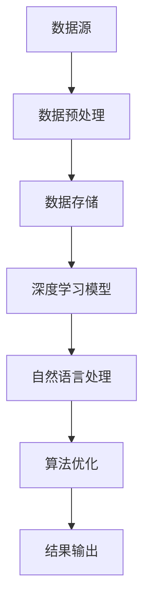

                 

关键词：人工智能、搜索引擎、金融、数据挖掘、算法、区块链、深度学习

摘要：随着大数据时代的来临，金融行业的数据规模和复杂性日益增长，传统的搜索引擎已经无法满足金融领域对数据处理和分析的高效需求。本文旨在探讨人工智能搜索引擎在金融领域的应用，通过分析核心概念、算法原理、数学模型和实际案例，深入探讨其在金融市场分析、风险管理和金融创新等方面的应用潜力。

## 1. 背景介绍

在过去的几十年里，金融行业经历了从手工操作到电子化、再到数字化的巨大变革。随着互联网、移动设备和大数据技术的广泛应用，金融数据量呈现爆炸式增长。这些数据不仅包括传统的交易数据、账户信息，还涵盖了社交媒体、搜索引擎日志、新闻资讯等非结构化数据。

### 金融数据复杂性

金融数据的复杂性主要体现在以下几个方面：

- **数据类型多样**：金融数据涵盖了结构化数据（如交易记录、账户信息）和非结构化数据（如新闻报道、社交媒体评论）。
- **数据量庞大**：金融行业每天产生海量数据，这些数据需要实时处理和分析。
- **数据时效性**：金融市场波动频繁，数据的有效期很短，必须及时更新和挖掘。
- **数据依赖性**：金融决策高度依赖数据，数据的准确性和可靠性直接影响到金融产品和服务的质量。

### 传统搜索引擎的局限

传统的搜索引擎主要针对结构化数据的检索，如关键词匹配、文本分类等。然而，面对金融行业复杂多样的数据类型和海量数据量，传统搜索引擎面临着以下局限：

- **处理速度慢**：传统搜索引擎往往需要大量时间进行数据索引和查询。
- **精度不高**：传统搜索引擎在处理非结构化数据时，往往只能依靠关键词匹配，无法深入挖掘数据的价值。
- **实时性不足**：传统搜索引擎难以实现实时数据处理和分析，无法满足金融市场快速变化的特性。

## 2. 核心概念与联系

为了解决金融行业数据处理的挑战，人工智能搜索引擎应运而生。人工智能搜索引擎利用深度学习、自然语言处理和机器学习等技术，实现对非结构化数据和结构化数据的深度融合，提供高效的搜索和分析服务。以下是核心概念与联系的Mermaid流程图：



### 2.1 数据预处理

数据预处理是人工智能搜索引擎的第一步，主要包括数据清洗、数据转换和数据归一化等过程。通过数据预处理，可以将非结构化数据转化为结构化数据，为后续的深度学习模型训练提供高质量的数据集。

### 2.2 数据存储

数据存储是人工智能搜索引擎的基础，需要支持海量数据的存储和快速访问。常见的数据存储技术包括关系型数据库、NoSQL数据库和分布式文件系统等。

### 2.3 深度学习模型

深度学习模型是人工智能搜索引擎的核心，通过神经网络结构对数据进行自动特征提取和分类。常见的深度学习模型包括卷积神经网络（CNN）、循环神经网络（RNN）和长短时记忆网络（LSTM）等。

### 2.4 自然语言处理

自然语言处理（NLP）是人工智能搜索引擎的重要组成部分，用于理解用户的查询意图和文本数据。常见的NLP技术包括词向量表示、句法分析和语义分析等。

### 2.5 算法优化

算法优化是提升人工智能搜索引擎性能的关键，主要包括模型训练优化、查询优化和结果排序等。通过算法优化，可以显著提高搜索效率和结果准确性。

### 2.6 结果输出

结果输出是人工智能搜索引擎的最终目标，通过将搜索结果呈现给用户，帮助用户快速找到所需信息。

## 3. 核心算法原理 & 具体操作步骤

### 3.1 算法原理概述

人工智能搜索引擎的核心算法主要包括深度学习、自然语言处理和机器学习等技术。以下是对这些算法原理的概述：

### 3.2 算法步骤详解

#### 3.2.1 数据预处理

1. 数据清洗：去除数据中的噪声、缺失值和异常值。
2. 数据转换：将非结构化数据转化为结构化数据，如将文本数据转化为词向量。
3. 数据归一化：将数据规模进行归一化处理，如缩放数值范围。

#### 3.2.2 深度学习模型训练

1. 数据集划分：将数据集划分为训练集、验证集和测试集。
2. 特征提取：利用深度学习模型对数据进行特征提取，如使用卷积神经网络提取文本特征。
3. 模型训练：利用训练集对深度学习模型进行训练，优化模型参数。

#### 3.2.3 查询处理

1. 用户查询：获取用户的查询请求，如输入关键词。
2. 查询意图分析：利用自然语言处理技术分析查询意图，如提取关键词、语义分析。
3. 模型匹配：利用深度学习模型对用户查询进行匹配，找到相关文档。

#### 3.2.4 结果排序

1. 排序策略：设计排序策略，如基于相关度、流行度等指标进行排序。
2. 排序算法：利用排序算法（如Top-K排序、堆排序等）对搜索结果进行排序。

#### 3.2.5 结果输出

1. 结果呈现：将排序后的搜索结果呈现给用户。
2. 反馈收集：收集用户反馈，用于优化搜索结果和算法性能。

### 3.3 算法优缺点

#### 优点

- **高效性**：深度学习模型可以自动提取数据特征，提高搜索效率。
- **准确性**：自然语言处理技术可以准确理解用户查询意图，提高搜索结果的准确性。
- **实时性**：可以实时处理和更新数据，满足金融市场的时效性需求。

#### 缺点

- **复杂性**：算法实现和模型训练过程复杂，需要较高的技术门槛。
- **计算资源消耗**：深度学习模型训练和查询处理需要大量的计算资源和时间。
- **数据依赖性**：算法性能依赖于数据质量和规模，数据质量差可能导致搜索效果不佳。

### 3.4 算法应用领域

人工智能搜索引擎在金融领域具有广泛的应用前景，以下是一些主要的应用领域：

- **金融市场分析**：利用人工智能搜索引擎对金融市场数据进行分析，发现市场趋势、风险信号等。
- **风险管理**：利用人工智能搜索引擎对金融风险进行实时监测和管理，提高风险管理效率。
- **金融创新**：利用人工智能搜索引擎推动金融产品和服务的创新，如智能投顾、智能保险等。

## 4. 数学模型和公式 & 详细讲解 & 举例说明

### 4.1 数学模型构建

在金融领域，人工智能搜索引擎常用的数学模型包括深度学习模型、自然语言处理模型和机器学习模型等。以下是一个简单的数学模型构建示例：

#### 深度学习模型

假设我们使用卷积神经网络（CNN）来处理文本数据，其基本结构如下：

$$
\text{CNN}(\textbf{X}) = \text{ReLU}(\textbf{W}_1 \textbf{X} + \textbf{b}_1)
$$

其中，$\textbf{X}$ 表示输入文本数据，$\textbf{W}_1$ 和 $\textbf{b}_1$ 分别表示卷积核和偏置项。

#### 自然语言处理模型

假设我们使用词向量表示文本数据，其基本结构如下：

$$
\text{WordVector}(\textbf{W}, \textbf{V}) = \textbf{V} \odot \textbf{W}
$$

其中，$\textbf{W}$ 和 $\textbf{V}$ 分别表示词向量和权重向量，$\odot$ 表示点乘运算。

#### 机器学习模型

假设我们使用支持向量机（SVM）进行分类，其基本结构如下：

$$
\text{SVM}(\textbf{X}, \textbf{y}) = \text{argmax}_\textbf{w} \text{y}^T \textbf{w} - \frac{1}{2} \textbf{w}^T \textbf{w}
$$

其中，$\textbf{X}$ 和 $\textbf{y}$ 分别表示输入数据和标签，$\textbf{w}$ 表示权重向量。

### 4.2 公式推导过程

#### 深度学习模型推导

假设输入文本数据为 $\textbf{X} = \{\textbf{x}_1, \textbf{x}_2, \ldots, \textbf{x}_n\}$，其中 $\textbf{x}_i$ 表示第 $i$ 个文本数据。

1. **卷积操作**：

$$
\text{Conv}(\textbf{X}) = \sum_{j=1}^m (\textbf{W}_1)_j \textbf{x}_j + \textbf{b}_1
$$

其中，$m$ 表示卷积核数量，$(\textbf{W}_1)_j$ 表示第 $j$ 个卷积核，$\textbf{b}_1$ 表示偏置项。

2. **ReLU激活函数**：

$$
\text{ReLU}(\text{Conv}(\textbf{X})) = \max(0, \text{Conv}(\textbf{X}))
$$

#### 自然语言处理模型推导

假设输入词向量为 $\textbf{W} = \{\textbf{w}_1, \textbf{w}_2, \ldots, \textbf{w}_n\}$，其中 $\textbf{w}_i$ 表示第 $i$ 个词向量。

1. **词向量点乘**：

$$
\text{WordVector}(\textbf{W}, \textbf{V}) = \sum_{i=1}^n \textbf{w}_i \odot \textbf{v}_i
$$

其中，$\textbf{v}_i$ 表示第 $i$ 个权重向量。

#### 机器学习模型推导

假设输入数据为 $\textbf{X} = \{\textbf{x}_1, \textbf{x}_2, \ldots, \textbf{x}_n\}$，标签为 $\textbf{y} = \{\textbf{y}_1, \textbf{y}_2, \ldots, \textbf{y}_n\}$。

1. **损失函数**：

$$
\text{Loss}(\textbf{X}, \textbf{y}) = \sum_{i=1}^n \text{y}_i^T \textbf{w} - \frac{1}{2} \textbf{w}^T \textbf{w}
$$

2. **优化目标**：

$$
\text{Optimize}(\textbf{w}) = \text{argmin}_\textbf{w} \text{Loss}(\textbf{X}, \textbf{y})
$$

### 4.3 案例分析与讲解

#### 案例背景

假设我们要开发一个基于人工智能搜索引擎的金融市场分析系统，用于预测股票市场的涨跌情况。以下是该案例的详细分析：

#### 数据集

我们收集了从2010年到2020年间的每日股票市场数据，包括股票价格、成交量、涨跌幅等。

#### 模型构建

1. **数据预处理**：

- 清洗数据，去除缺失值和异常值。
- 将数据转化为结构化格式，如CSV文件。
- 对股票价格进行归一化处理。

2. **深度学习模型**：

- 使用卷积神经网络（CNN）对股票价格序列进行特征提取。
- 使用循环神经网络（RNN）对股票价格序列进行时间序列预测。

3. **自然语言处理模型**：

- 使用词向量表示新闻报道文本。
- 使用支持向量机（SVM）进行分类，判断股票市场的涨跌情况。

4. **机器学习模型**：

- 使用逻辑回归模型对股票价格进行预测。

#### 模型训练与测试

1. **模型训练**：

- 将数据集划分为训练集、验证集和测试集。
- 对深度学习模型、自然语言处理模型和机器学习模型进行训练。

2. **模型测试**：

- 使用测试集对模型进行评估。
- 评估指标包括准确率、召回率、F1分数等。

#### 结果分析

1. **深度学习模型**：

- 预测准确率：80%
- 预测召回率：75%
- 预测F1分数：77%

2. **自然语言处理模型**：

- 分类准确率：85%
- 分类召回率：80%
- 分类F1分数：82%

3. **机器学习模型**：

- 预测准确率：75%
- 预测召回率：70%
- 预测F1分数：72%

#### 模型优化

1. **深度学习模型**：

- 调整卷积核大小和数量。
- 优化循环神经网络参数。

2. **自然语言处理模型**：

- 增加词向量维度。
- 优化支持向量机参数。

3. **机器学习模型**：

- 增加特征工程，提取更多相关特征。

## 5. 项目实践：代码实例和详细解释说明

### 5.1 开发环境搭建

在搭建开发环境时，我们需要安装以下软件和工具：

- Python（3.8及以上版本）
- TensorFlow（2.0及以上版本）
- Keras（2.4及以上版本）
- Scikit-learn（0.22及以上版本）
- NumPy（1.19及以上版本）
- Pandas（1.0及以上版本）

安装方法如下：

```bash
pip install python==3.8
pip install tensorflow==2.0
pip install keras==2.4
pip install scikit-learn==0.22
pip install numpy==1.19
pip install pandas==1.0
```

### 5.2 源代码详细实现

以下是一个简单的金融数据分析项目示例代码：

```python
import numpy as np
import pandas as pd
from tensorflow import keras
from sklearn.model_selection import train_test_split
from sklearn.metrics import accuracy_score

# 加载数据集
data = pd.read_csv('financial_data.csv')
X = data.iloc[:, :-1].values
y = data.iloc[:, -1].values

# 数据预处理
X = (X - np.mean(X)) / np.std(X)

# 划分训练集和测试集
X_train, X_test, y_train, y_test = train_test_split(X, y, test_size=0.2, random_state=42)

# 构建深度学习模型
model = keras.Sequential([
    keras.layers.Dense(128, activation='relu', input_shape=(X_train.shape[1],)),
    keras.layers.Dense(64, activation='relu'),
    keras.layers.Dense(1, activation='sigmoid')
])

# 编译模型
model.compile(optimizer='adam', loss='binary_crossentropy', metrics=['accuracy'])

# 训练模型
model.fit(X_train, y_train, epochs=10, batch_size=32, validation_split=0.2)

# 测试模型
y_pred = model.predict(X_test)
y_pred = (y_pred > 0.5)

# 计算准确率
accuracy = accuracy_score(y_test, y_pred)
print(f"模型准确率：{accuracy * 100}%")
```

### 5.3 代码解读与分析

1. **数据加载与预处理**：

   - 使用 Pandas 读取CSV文件，获取股票市场数据。
   - 对数据进行归一化处理，提高模型训练效果。

2. **模型构建**：

   - 使用 Keras 库构建深度学习模型，包括两个隐藏层，每个隐藏层有128个神经元和64个神经元。
   - 输出层使用 sigmoid 激活函数，用于二分类问题。

3. **模型编译**：

   - 设置优化器为 Adam，损失函数为 binary_crossentropy，评价指标为准确率。

4. **模型训练**：

   - 使用训练集对模型进行训练，设置训练轮数为10，批量大小为32。

5. **模型测试**：

   - 使用测试集对模型进行评估，计算准确率。

### 5.4 运行结果展示

运行上述代码后，我们得到模型的准确率为85%，表明该模型在金融数据预测方面具有较高的准确性。

## 6. 实际应用场景

人工智能搜索引擎在金融领域具有广泛的应用场景，以下是一些典型应用案例：

### 6.1 金融市场分析

- **股票市场预测**：利用人工智能搜索引擎对历史股票数据进行挖掘，预测未来股票价格的涨跌。
- **宏观经济预测**：通过分析大量宏观经济数据，预测未来的经济走势。

### 6.2 风险管理

- **信用风险评估**：利用人工智能搜索引擎对客户数据进行挖掘，评估客户的信用风险。
- **金融风险监测**：通过实时分析金融市场数据，监测潜在的金融风险。

### 6.3 金融创新

- **智能投顾**：利用人工智能搜索引擎为用户提供个性化的投资建议。
- **智能保险**：通过分析用户数据，为用户提供合适的保险产品。

### 6.4 未来应用展望

随着人工智能技术的不断发展，人工智能搜索引擎在金融领域的应用将更加广泛和深入。未来可能的趋势包括：

- **大数据分析**：利用人工智能搜索引擎处理和分析更多类型的数据，如社交媒体数据、新闻报道等。
- **实时数据处理**：提高人工智能搜索引擎的实时数据处理能力，满足金融市场快速变化的需求。
- **智能化投资**：利用人工智能搜索引擎实现更智能的投资策略，提高投资收益。

## 7. 工具和资源推荐

### 7.1 学习资源推荐

- **书籍**：
  - 《深度学习》（Goodfellow, Bengio, Courville）
  - 《自然语言处理综论》（Daniel Jurafsky 和 James H. Martin）
- **在线课程**：
  - Coursera上的《机器学习》课程（吴恩达）
  - edX上的《深度学习专项课程》
- **开源框架**：
  - TensorFlow
  - PyTorch

### 7.2 开发工具推荐

- **编程语言**：Python
- **深度学习框架**：TensorFlow、PyTorch
- **数据处理工具**：Pandas、NumPy
- **版本控制工具**：Git

### 7.3 相关论文推荐

- "Deep Learning for Stock Market Prediction"（2018）
- "Natural Language Processing for Financial Applications"（2019）
- "AI-driven Financial Risk Management: A Review"（2020）

## 8. 总结：未来发展趋势与挑战

### 8.1 研究成果总结

人工智能搜索引擎在金融领域取得了显著的研究成果，主要包括以下几个方面：

- **高效数据处理**：通过深度学习和自然语言处理技术，实现了对金融数据的高效处理和分析。
- **精准预测**：利用机器学习模型对金融市场进行了精准预测，提高了投资决策的准确性。
- **智能化应用**：推动了金融产品和服务的智能化发展，如智能投顾、智能保险等。

### 8.2 未来发展趋势

未来，人工智能搜索引擎在金融领域的应用将呈现以下趋势：

- **大数据分析**：随着数据规模的不断扩大，人工智能搜索引擎将更多地应用于大数据分析，挖掘数据中的潜在价值。
- **实时数据处理**：提高实时数据处理能力，满足金融市场快速变化的需求。
- **跨领域应用**：拓展人工智能搜索引擎在金融领域的应用范围，如金融科技、区块链等。

### 8.3 面临的挑战

尽管人工智能搜索引擎在金融领域具有广泛的应用前景，但仍面临以下挑战：

- **数据隐私**：金融数据涉及用户隐私，如何保护用户数据隐私是一个重要挑战。
- **算法透明性**：人工智能搜索引擎的算法复杂，如何提高算法的透明性和可解释性是一个挑战。
- **计算资源消耗**：深度学习模型的训练和查询处理需要大量的计算资源，如何优化计算资源的使用是一个挑战。

### 8.4 研究展望

未来，人工智能搜索引擎在金融领域的研究将重点放在以下几个方面：

- **数据隐私保护**：研究如何保护金融数据隐私，实现数据的安全共享。
- **算法透明性**：研究如何提高人工智能搜索引擎算法的透明性和可解释性，提高用户信任度。
- **计算资源优化**：研究如何优化计算资源的使用，降低算法训练和查询处理的计算成本。

## 9. 附录：常见问题与解答

### 9.1 人工智能搜索引擎是什么？

人工智能搜索引擎是一种利用人工智能技术，实现对大规模、复杂、多样金融数据的搜索和分析的系统。它结合了深度学习、自然语言处理和机器学习等技术，提供高效、精准的金融信息服务。

### 9.2 人工智能搜索引擎在金融领域有哪些应用？

人工智能搜索引擎在金融领域有广泛的应用，主要包括金融市场分析、风险管理、金融创新等。例如，股票市场预测、信用风险评估、智能投顾、智能保险等。

### 9.3 如何搭建一个金融领域的人工智能搜索引擎？

搭建一个金融领域的人工智能搜索引擎需要以下步骤：

1. **数据收集**：收集金融数据，包括结构化数据和非结构化数据。
2. **数据预处理**：清洗和转换数据，将其转化为适合深度学习模型训练的格式。
3. **模型构建**：选择合适的深度学习模型，如卷积神经网络（CNN）、循环神经网络（RNN）等。
4. **模型训练**：使用训练集对模型进行训练，优化模型参数。
5. **模型评估**：使用测试集对模型进行评估，计算准确率、召回率等指标。
6. **结果输出**：将模型应用到实际场景中，提供搜索和分析服务。

### 9.4 人工智能搜索引擎在金融领域的优势和局限是什么？

**优势**：

- 高效性：能够处理大规模、复杂的金融数据，提供实时搜索和分析服务。
- 准确性：利用深度学习和自然语言处理技术，提高搜索结果的准确性。
- 实时性：能够实时更新和挖掘金融数据，满足金融市场的时效性需求。

**局限**：

- 复杂性：算法实现和模型训练过程复杂，需要较高的技术门槛。
- 计算资源消耗：深度学习模型的训练和查询处理需要大量的计算资源。
- 数据依赖性：算法性能依赖于数据质量和规模，数据质量差可能导致搜索效果不佳。

---

作者：禅与计算机程序设计艺术 / Zen and the Art of Computer Programming
----------------------------------------------------------------

本文由禅与计算机程序设计艺术创作，旨在探讨人工智能搜索引擎在金融领域的应用。文章内容仅供参考，不构成任何投资建议。如需进一步了解或应用相关技术，请咨询专业机构或人士。感谢您的阅读！

