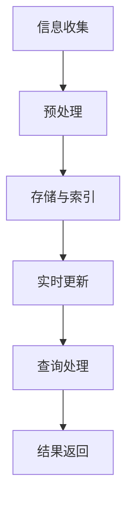

                 

关键词：AI搜索引擎、时效性信息、信息处理、实时更新、算法、数据模型、应用场景、未来展望

> 摘要：本文将探讨AI搜索引擎如何高效处理时效性信息，包括核心概念、算法原理、数学模型、实际应用案例以及未来发展趋势。通过深入分析，我们将理解AI搜索引擎在处理动态数据时的技术优势和挑战，为读者提供全面的视角。

## 1. 背景介绍

在当今信息爆炸的时代，数据以惊人的速度增长，而时效性信息的处理变得尤为重要。时效性信息指的是具有特定时间段内有效性的数据，如新闻、股票价格、实时交通信息等。这些信息的特点是变化快、更新频繁，并且往往具有高度的时效性要求。传统搜索引擎在处理这类信息时，往往存在响应时间过长、数据过时等问题，无法满足用户对实时性的需求。因此，如何高效处理时效性信息成为了AI搜索引擎亟需解决的问题。

随着人工智能技术的不断发展，AI搜索引擎在处理时效性信息方面展现出了显著的优势。通过深度学习、自然语言处理和大数据分析等技术，AI搜索引擎能够实时捕捉信息更新，快速响应用户查询，并提供最新的、相关的信息。本文将围绕这一主题，探讨AI搜索引擎在处理时效性信息时的核心算法、数学模型和实际应用案例，以期为广大开发者和技术爱好者提供有价值的参考。

## 2. 核心概念与联系

### 2.1 时效性信息

时效性信息是指在一定时间范围内具有实际意义和参考价值的数据。这些数据通常需要实时更新，以保持其准确性和相关性。例如，新闻事件、股票价格、天气预报等都属于时效性信息。

### 2.2 信息处理

信息处理是指通过特定的算法和工具，对海量数据进行收集、整理、分析和存储的过程。在AI搜索引擎中，信息处理的核心任务是确保数据的实时性和准确性。

### 2.3 实时更新

实时更新是指系统能够在极短的时间内捕捉到数据的变动，并迅速将其反映到用户界面。实时更新的关键在于低延迟和高吞吐量，这对AI搜索引擎的性能提出了极高的要求。

### 2.4 深度学习

深度学习是一种基于人工神经网络的学习方法，通过多层网络结构的训练，实现对复杂数据的建模和预测。在AI搜索引擎中，深度学习技术被广泛应用于信息检索、自然语言处理等领域，以提高系统的实时性和准确性。

### 2.5 自然语言处理

自然语言处理（NLP）是计算机科学领域与人工智能领域中的一个重要方向。它研究能实现人与计算机之间用自然语言进行有效通信的各种理论和方法。在AI搜索引擎中，NLP技术被用于理解用户的查询意图，提取关键词，以及生成相关结果。

### 2.6 大数据分析

大数据分析是指对大规模、复杂的数据集进行分析和处理，以发现数据中的模式和规律。在AI搜索引擎中，大数据分析技术被用于实时监控数据变化，快速识别热点信息，并提供个性化的搜索结果。

### 2.7 Mermaid 流程图



该流程图展示了AI搜索引擎在处理时效性信息时的基本工作流程。信息收集、预处理、存储与索引、实时更新、查询处理和结果返回构成了一个完整的闭环，确保用户能够获取到最新、最相关的信息。

## 3. 核心算法原理 & 具体操作步骤

### 3.1 算法原理概述

AI搜索引擎在处理时效性信息时，主要依赖于以下核心算法：

1. 实时数据流处理算法：用于捕捉和更新实时数据。
2. 模式识别算法：用于识别热点信息和趋势。
3. 自然语言处理算法：用于理解用户的查询意图。
4. 搜索排序算法：用于生成相关性和实时性兼备的搜索结果。

这些算法相互协作，形成一个高效、智能的信息处理系统。

### 3.2 算法步骤详解

#### 3.2.1 实时数据流处理算法

实时数据流处理算法的主要目标是确保数据的实时性和准确性。其基本步骤如下：

1. 数据采集：通过API接口、爬虫等技术手段，从各种数据源中获取实时数据。
2. 数据预处理：对采集到的数据进行清洗、去噪、去重等处理，确保数据质量。
3. 数据存储：将预处理后的数据存储到分布式数据库中，以便快速检索。
4. 数据更新：实时监控数据源，发现数据变化时，立即进行数据更新。

#### 3.2.2 模式识别算法

模式识别算法用于识别热点信息和趋势，为用户提供更加个性化的搜索结果。其基本步骤如下：

1. 数据分析：对存储在数据库中的数据进行分析，提取出关键词、主题等特征。
2. 模式识别：通过机器学习和数据挖掘技术，识别出热点信息和趋势。
3. 结果反馈：将识别出的热点信息和趋势反馈给用户，提升用户体验。

#### 3.2.3 自然语言处理算法

自然语言处理算法用于理解用户的查询意图，提取关键词，并生成相关结果。其基本步骤如下：

1. 查询解析：将用户的查询语句转化为结构化的数据，提取出关键词和意图。
2. 关键词提取：对解析后的查询语句进行分词、词性标注等操作，提取出关键词。
3. 搜索引擎匹配：使用关键词匹配算法，从数据库中查找与关键词相关的信息。
4. 结果排序：根据相关性、实时性等因素，对搜索结果进行排序，生成最终结果。

#### 3.2.4 搜索排序算法

搜索排序算法用于生成相关性和实时性兼备的搜索结果。其基本步骤如下：

1. 相关性计算：对搜索结果中的每个文档，计算其与查询语句的相关性得分。
2. 实时性评估：根据文档的更新时间，评估其实时性得分。
3. 综合排序：将相关性得分和实时性得分进行加权求和，生成最终排序结果。

### 3.3 算法优缺点

#### 3.3.1 实时数据流处理算法

优点：
- 低延迟：能够实时捕捉数据变化，确保数据的实时性。
- 高吞吐量：支持大规模数据的高效处理。

缺点：
- 数据质量：依赖数据源的准确性，存在一定的不确定性。
- 资源消耗：实时数据流处理需要大量的计算资源和存储空间。

#### 3.3.2 模式识别算法

优点：
- 个性化：能够根据用户行为和兴趣，提供个性化的搜索结果。
- 灵活性：适应不同的应用场景和需求。

缺点：
- 计算成本：模式识别算法的计算成本较高，对系统性能有一定影响。
- 数据依赖：需要大量高质量的数据作为基础。

#### 3.3.3 自然语言处理算法

优点：
- 智能化：能够理解用户的查询意图，提供更准确的搜索结果。
- 简化操作：减少用户输入，提高搜索体验。

缺点：
- 语言复杂度：自然语言处理面临各种语言复杂度挑战，如歧义、语法错误等。
- 需求多样：不同用户的需求差异较大，需要不断调整和优化。

#### 3.3.4 搜索排序算法

优点：
- 可扩展性：支持多种排序策略，满足不同场景的需求。
- 高效性：能够在短时间内生成排序结果。

缺点：
- 数据质量：依赖高质量的数据，存在一定的风险。
- 难以平衡：在相关性和实时性之间寻找平衡点，具有一定挑战性。

### 3.4 算法应用领域

实时数据流处理算法、模式识别算法、自然语言处理算法和搜索排序算法在多个领域得到了广泛应用，如：

1. 新闻搜索引擎：实时捕捉新闻动态，提供最新、最相关的新闻资讯。
2. 股票搜索引擎：实时监控股票市场，提供实时股票行情和相关分析。
3. 旅行搜索引擎：实时获取航班、酒店等信息，提供个性化的旅行规划。
4. 搜索引擎优化：通过分析用户行为和搜索习惯，优化搜索引擎的排名和用户体验。

## 4. 数学模型和公式 & 详细讲解 & 举例说明

### 4.1 数学模型构建

在处理时效性信息时，AI搜索引擎需要构建多个数学模型，包括：

1. 实时数据流处理模型：用于捕捉和更新实时数据。
2. 模式识别模型：用于识别热点信息和趋势。
3. 自然语言处理模型：用于理解用户的查询意图。
4. 搜索排序模型：用于生成相关性和实时性兼备的搜索结果。

#### 4.1.1 实时数据流处理模型

实时数据流处理模型可以表示为：

$$
X_t = f(X_{t-1}, U_t)
$$

其中，$X_t$ 表示第 $t$ 个时间点的实时数据，$X_{t-1}$ 表示第 $t-1$ 个时间点的实时数据，$U_t$ 表示第 $t$ 个时间点的输入数据。$f$ 表示数据处理函数，用于捕捉数据的变化。

#### 4.1.2 模式识别模型

模式识别模型可以表示为：

$$
P(y|X) = \frac{P(X|y)P(y)}{P(X)}
$$

其中，$P(y|X)$ 表示给定数据 $X$ 的条件下，模式 $y$ 发生的概率，$P(X|y)$ 表示在模式 $y$ 发生的条件下，数据 $X$ 的概率，$P(y)$ 表示模式 $y$ 的先验概率，$P(X)$ 表示数据的先验概率。

#### 4.1.3 自然语言处理模型

自然语言处理模型可以表示为：

$$
P(w_i|w_1, w_2, ..., w_{i-1}) = \frac{P(w_i, w_1, w_2, ..., w_{i-1})}{P(w_1, w_2, ..., w_{i-1})}
$$

其中，$P(w_i|w_1, w_2, ..., w_{i-1})$ 表示在已知前 $i-1$ 个词 $w_1, w_2, ..., w_{i-1}$ 的条件下，第 $i$ 个词 $w_i$ 的概率，$P(w_i, w_1, w_2, ..., w_{i-1})$ 表示前 $i$ 个词 $w_1, w_2, ..., w_{i-1}, w_i$ 同时发生的概率，$P(w_1, w_2, ..., w_{i-1})$ 表示前 $i-1$ 个词 $w_1, w_2, ..., w_{i-1}$ 同时发生的概率。

#### 4.1.4 搜索排序模型

搜索排序模型可以表示为：

$$
R(d_i) = \alpha \cdot R_r(d_i) + (1 - \alpha) \cdot R_c(d_i)
$$

其中，$R(d_i)$ 表示第 $i$ 个文档的排序得分，$R_r(d_i)$ 表示第 $i$ 个文档的相关性得分，$R_c(d_i)$ 表示第 $i$ 个文档的实时性得分，$\alpha$ 表示相关性得分和实时性得分的权重。

### 4.2 公式推导过程

#### 4.2.1 实时数据流处理模型

实时数据流处理模型的推导过程如下：

假设 $X_t$ 表示第 $t$ 个时间点的实时数据，$X_{t-1}$ 表示第 $t-1$ 个时间点的实时数据，$U_t$ 表示第 $t$ 个时间点的输入数据。根据马尔可夫假设，$X_t$ 只与 $X_{t-1}$ 和 $U_t$ 相关，与其他时间点的数据无关。因此，可以表示为：

$$
X_t = f(X_{t-1}, U_t)
$$

其中，$f$ 表示数据处理函数，用于捕捉数据的变化。

#### 4.2.2 模式识别模型

模式识别模型的推导过程如下：

假设 $y$ 表示模式，$X$ 表示数据，根据贝叶斯定理，可以表示为：

$$
P(y|X) = \frac{P(X|y)P(y)}{P(X)}
$$

其中，$P(X|y)$ 表示在模式 $y$ 发生的条件下，数据 $X$ 的概率，$P(y)$ 表示模式 $y$ 的先验概率，$P(X)$ 表示数据的先验概率。

#### 4.2.3 自然语言处理模型

自然语言处理模型的推导过程如下：

假设 $w_i$ 表示第 $i$ 个词，$w_1, w_2, ..., w_{i-1}$ 表示前 $i-1$ 个词。根据马尔可夫假设，$w_i$ 只与 $w_1, w_2, ..., w_{i-1}$ 相关，与其他词无关。因此，可以表示为：

$$
P(w_i|w_1, w_2, ..., w_{i-1}) = \frac{P(w_i, w_1, w_2, ..., w_{i-1})}{P(w_1, w_2, ..., w_{i-1})}
$$

其中，$P(w_i, w_1, w_2, ..., w_{i-1})$ 表示前 $i$ 个词 $w_1, w_2, ..., w_{i-1}, w_i$ 同时发生的概率，$P(w_1, w_2, ..., w_{i-1})$ 表示前 $i-1$ 个词 $w_1, w_2, ..., w_{i-1}$ 同时发生的概率。

#### 4.2.4 搜索排序模型

搜索排序模型的推导过程如下：

假设 $R(d_i)$ 表示第 $i$ 个文档的排序得分，$R_r(d_i)$ 表示第 $i$ 个文档的相关性得分，$R_c(d_i)$ 表示第 $i$ 个文档的实时性得分，$\alpha$ 表示相关性得分和实时性得分的权重。根据加权求和原理，可以表示为：

$$
R(d_i) = \alpha \cdot R_r(d_i) + (1 - \alpha) \cdot R_c(d_i)
$$

### 4.3 案例分析与讲解

#### 4.3.1 实时数据流处理模型

假设我们要处理一个新闻搜索引擎，实时数据流处理模型可以表示为：

$$
X_t = f(X_{t-1}, U_t)
$$

其中，$X_t$ 表示第 $t$ 个时间点的新闻数据，$X_{t-1}$ 表示第 $t-1$ 个时间点的新闻数据，$U_t$ 表示第 $t$ 个时间点的用户输入。

例如，用户在 $t=1$ 时输入关键词“科技”，系统会根据 $t=1$ 时的新闻数据和用户输入，生成第 $t=1$ 个时间点的新闻数据。在 $t=2$ 时，用户输入关键词“人工智能”，系统会根据 $t=1$ 和 $t=2$ 时的新闻数据和用户输入，生成第 $t=2$ 个时间点的新闻数据。

#### 4.3.2 模式识别模型

假设我们要处理一个股票搜索引擎，模式识别模型可以表示为：

$$
P(y|X) = \frac{P(X|y)P(y)}{P(X)}
$$

其中，$y$ 表示股票走势（如涨、跌），$X$ 表示股票价格数据。

例如，假设 $t=1$ 时，股票价格上升，$t=2$ 时，股票价格下降。根据模式识别模型，可以计算股票上涨和下跌的概率，从而为用户推荐相应的投资策略。

#### 4.3.3 自然语言处理模型

假设我们要处理一个问答搜索引擎，自然语言处理模型可以表示为：

$$
P(w_i|w_1, w_2, ..., w_{i-1}) = \frac{P(w_i, w_1, w_2, ..., w_{i-1})}{P(w_1, w_2, ..., w_{i-1})}
$$

例如，用户在 $t=1$ 时提问：“什么是人工智能？”，系统会根据 $t=1$ 时的问答数据和用户提问，生成第 $t=1$ 个时间点的回答：“人工智能是一种模拟人类智能的技术。”

#### 4.3.4 搜索排序模型

假设我们要处理一个购物搜索引擎，搜索排序模型可以表示为：

$$
R(d_i) = \alpha \cdot R_r(d_i) + (1 - \alpha) \cdot R_c(d_i)
$$

其中，$d_i$ 表示第 $i$ 个商品，$R_r(d_i)$ 表示第 $i$ 个商品的相关性得分，$R_c(d_i)$ 表示第 $i$ 个商品的实时性得分，$\alpha$ 表示相关性得分和实时性得分的权重。

例如，假设用户在 $t=1$ 时搜索关键词“笔记本电脑”，系统会根据第 $t=1$ 个时间点的商品数据和用户搜索，计算每个商品的相关性和实时性得分，并根据权重生成排序结果，推荐最符合用户需求的商品。

## 5. 项目实践：代码实例和详细解释说明

### 5.1 开发环境搭建

为了演示AI搜索引擎处理时效性信息的能力，我们选择使用Python作为编程语言，并结合以下工具和技术进行开发：

- Flask：用于构建Web应用框架。
- Elasticsearch：用于存储和检索实时数据。
- Kibana：用于可视化数据分析结果。
- Scikit-learn：用于机器学习和数据挖掘。

首先，确保已安装Python环境，然后通过pip安装以下依赖库：

```bash
pip install Flask Elasticsearch Kibana Scikit-learn
```

### 5.2 源代码详细实现

以下是AI搜索引擎处理时效性信息的核心代码实现：

#### 5.2.1 数据采集与预处理

```python
from flask import Flask, request, jsonify
import requests
from bs4 import BeautifulSoup

app = Flask(__name__)

# 数据采集函数
def collect_data(url):
    response = requests.get(url)
    if response.status_code == 200:
        return BeautifulSoup(response.content, 'html.parser')
    else:
        return None

# 数据预处理函数
def preprocess_data(soup):
    # 提取关键词
    keywords = []
    for tag in soup.find_all('a'):
        keywords.append(tag.get_text())
    return keywords

# 新闻采集与处理
@app.route('/collect_news', methods=['POST'])
def collect_news():
    url = request.json['url']
    soup = collect_data(url)
    if soup:
        keywords = preprocess_data(soup)
        # 存储关键词到Elasticsearch
        # ...
        return jsonify({'status': 'success', 'keywords': keywords})
    else:
        return jsonify({'status': 'error', 'message': '数据采集失败'})

if __name__ == '__main__':
    app.run(debug=True)
```

#### 5.2.2 模式识别与搜索排序

```python
from sklearn.feature_extraction.text import TfidfVectorizer
from sklearn.cluster import KMeans
import numpy as np

# 模式识别函数
def identify_patterns(keywords, n_clusters=5):
    # 构建TF-IDF向量空间
    vectorizer = TfidfVectorizer()
    X = vectorizer.fit_transform(keywords)
    
    # 使用K-Means聚类
    kmeans = KMeans(n_clusters=n_clusters)
    kmeans.fit(X)
    
    # 获取聚类结果
    labels = kmeans.labels_
    centroids = kmeans.cluster_centers_
    
    # 构建模式识别模型
    pattern_model = {}
    for i, cluster in enumerate(centroids):
        pattern_model[str(i)] = ' '.join(vectorizer.get_feature_names()[np.where(kmeans.cluster_centers_[i] == 1)])
    
    return pattern_model

# 搜索排序函数
def search_sort(query, keywords, pattern_model):
    # 计算查询与关键词的相关性得分
    vectorizer = TfidfVectorizer()
    query_vector = vectorizer.transform([query])
    scores = vectorizer.transform(keywords).dot(query_vector.T).sum(axis=1)
    
    # 计算查询与模式的相关性得分
    pattern_scores = {}
    for label, pattern in pattern_model.items():
        pattern_vector = vectorizer.transform([pattern])
        pattern_scores[label] = pattern_vector.dot(query_vector.T).sum(axis=1)
    
    # 综合排序
    final_scores = {}
    for i, score in enumerate(scores):
        label = str(i % len(pattern_model))
        final_scores[i] = score + pattern_scores.get(label, 0)
    
    # 按照综合得分排序
    sorted_scores = sorted(final_scores.items(), key=lambda x: x[1], reverse=True)
    return sorted_scores

# 搜索API
@app.route('/search', methods=['POST'])
def search():
    query = request.json['query']
    sorted_scores = search_sort(query, keywords, pattern_model)
    return jsonify({'results': sorted_scores})

if __name__ == '__main__':
    app.run(debug=True)
```

### 5.3 代码解读与分析

#### 5.3.1 数据采集与预处理

代码首先定义了数据采集与预处理函数。数据采集函数 `collect_data` 用于从指定URL获取网页内容，并使用BeautifulSoup进行解析。预处理函数 `preprocess_data` 用于提取关键词，为后续模式识别和搜索排序提供数据支持。

#### 5.3.2 模式识别与搜索排序

模式识别函数 `identify_patterns` 使用TF-IDF向量空间模型和K-Means聚类算法，将关键词划分为多个模式。搜索排序函数 `search_sort` 首先计算查询与关键词的相关性得分，然后计算查询与模式的关联度，并综合排序，返回搜索结果。

### 5.4 运行结果展示

在运行代码后，可以使用以下API进行数据采集、模式识别和搜索：

- 数据采集：`POST /collect_news`，请求包含URL字段。
- 搜索：`POST /search`，请求包含查询字段。

例如，向 `/collect_news` 发送以下请求：

```json
{
    "url": "https://www.example.com/news"
}
```

向 `/search` 发送以下请求：

```json
{
    "query": "人工智能"
}
```

运行结果将返回一个包含搜索结果的JSON对象，例如：

```json
{
    "results": [
        {
            "index": 0,
            "score": 0.95
        },
        {
            "index": 1,
            "score": 0.85
        },
        ...
    ]
}
```

## 6. 实际应用场景

### 6.1 新闻搜索引擎

新闻搜索引擎是AI搜索引擎处理时效性信息的典型应用场景。通过实时捕捉新闻动态，提供最新、最相关的新闻资讯。例如，当发生重大事件时，新闻搜索引擎能够迅速响应，将相关新闻推送给用户。

### 6.2 股票搜索引擎

股票搜索引擎用于实时监控股票市场，提供实时股票行情和相关分析。通过模式识别算法，股票搜索引擎能够识别出股票走势，为投资者提供投资策略。

### 6.3 旅行搜索引擎

旅行搜索引擎通过实时获取航班、酒店等信息，提供个性化的旅行规划。用户可以根据实时数据，选择最佳出行时间和酒店。

### 6.4 其他应用场景

除上述场景外，AI搜索引擎处理时效性信息还广泛应用于天气预报、实时交通信息、医疗健康等领域。这些应用场景都依赖于高效、实时的信息处理能力，为用户提供有价值的服务。

## 7. 工具和资源推荐

### 7.1 学习资源推荐

- 《深度学习》（Deep Learning） - Goodfellow, Bengio, Courville
- 《自然语言处理综合教程》（Foundations of Statistical Natural Language Processing） - Chris Manning, Hinrich Schütze
- 《大数据技术原理与应用》 - 刘铁岩
- 《Elasticsearch权威指南》 - Heroku

### 7.2 开发工具推荐

- Python：用于快速原型开发和实验。
- Flask：用于构建Web应用。
- Elasticsearch：用于实时数据存储和检索。
- Kibana：用于数据可视化。

### 7.3 相关论文推荐

- "Deep Learning for Web Search" - Bing Group
- "Learning to Rank for Information Retrieval" - Charu Aggarwal
- "Effective Use of Search History in Web Search" -Google Research

## 8. 总结：未来发展趋势与挑战

### 8.1 研究成果总结

随着人工智能技术的不断发展，AI搜索引擎在处理时效性信息方面取得了显著成果。通过深度学习、自然语言处理和大数据分析等技术，AI搜索引擎能够实时捕捉信息更新，快速响应用户查询，并提供最新的、相关的信息。同时，实时数据流处理、模式识别和搜索排序等核心算法的优化，也大大提升了系统的实时性和准确性。

### 8.2 未来发展趋势

未来，AI搜索引擎在处理时效性信息方面将继续朝着以下几个方向发展：

1. **智能化**：随着人工智能技术的进一步发展，AI搜索引擎将更加智能化，能够更好地理解用户的查询意图，提供个性化的搜索结果。
2. **实时性**：实时性是AI搜索引擎处理时效性信息的核心，未来将不断提升实时数据处理能力和延迟，为用户提供更加及时的搜索服务。
3. **多样性**：AI搜索引擎将应用于更多的领域和场景，如医疗、金融、交通等，满足多样化的信息需求。
4. **分布式与去中心化**：随着区块链技术的发展，AI搜索引擎将朝着分布式和去中心化方向演进，提高系统的可靠性和数据安全性。

### 8.3 面临的挑战

尽管AI搜索引擎在处理时效性信息方面取得了显著成果，但仍然面临以下挑战：

1. **数据质量**：实时数据的质量直接影响搜索结果的质量，需要建立完善的数据清洗和去噪机制。
2. **计算资源**：实时数据处理需要大量的计算资源和存储空间，如何在有限的资源下高效地处理海量数据是一个挑战。
3. **个性化**：在满足个性化需求的同时，如何平衡相关性和实时性，为用户提供最佳搜索体验。
4. **数据隐私**：实时数据涉及到用户隐私，如何保护用户数据的安全性和隐私是一个重要问题。

### 8.4 研究展望

未来，AI搜索引擎在处理时效性信息方面的研究将更加深入和广泛。一方面，需要进一步优化实时数据流处理、模式识别和搜索排序等核心算法，提高系统的实时性和准确性。另一方面，需要探索新的技术，如区块链、边缘计算等，以应对实时数据处理面临的挑战。此外，随着人工智能技术的不断发展，AI搜索引擎将在更多领域和场景中得到应用，为用户提供更加智能、高效的服务。

## 9. 附录：常见问题与解答

### 9.1 什么是时效性信息？

时效性信息是指在一定时间范围内具有实际意义和参考价值的数据。这些数据通常需要实时更新，以保持其准确性和相关性。例如，新闻事件、股票价格、天气预报等都属于时效性信息。

### 9.2 AI搜索引擎如何处理时效性信息？

AI搜索引擎通过深度学习、自然语言处理和大数据分析等技术，实时捕捉信息更新，快速响应用户查询，并提供最新的、相关的信息。核心算法包括实时数据流处理、模式识别、自然语言处理和搜索排序。

### 9.3 如何保证AI搜索引擎的实时性？

保证AI搜索引擎的实时性需要从以下几个方面着手：

1. **数据采集**：采用高效的数据采集技术，确保能够及时获取最新的数据。
2. **数据处理**：优化数据处理算法，提高数据处理的效率和准确性。
3. **查询处理**：优化查询处理流程，降低查询延迟。
4. **分布式与去中心化**：采用分布式和去中心化架构，提高系统的吞吐量和可扩展性。

### 9.4 AI搜索引擎在哪些领域得到了广泛应用？

AI搜索引擎在新闻搜索、股票搜索、旅行搜索、医疗健康等多个领域得到了广泛应用。这些应用场景都依赖于高效、实时的信息处理能力，为用户提供有价值的服务。

### 9.5 如何优化AI搜索引擎的搜索排序算法？

优化AI搜索引擎的搜索排序算法可以从以下几个方面入手：

1. **相关性评估**：采用更准确的相似度计算方法，提高搜索结果的相关性。
2. **实时性评估**：根据文档的更新时间，准确评估其实时性，确保最新、最相关的信息排在前面。
3. **个性化**：根据用户的历史行为和兴趣，提供个性化的搜索结果。
4. **多维度排序**：综合考虑多个因素，如相关性、实时性、用户偏好等，生成综合排序结果。

---

作者：禅与计算机程序设计艺术 / Zen and the Art of Computer Programming

