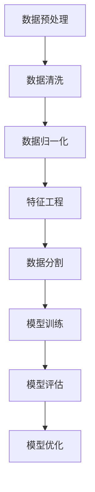
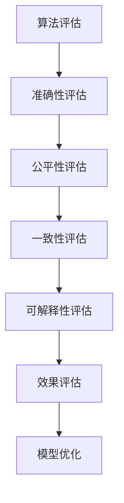
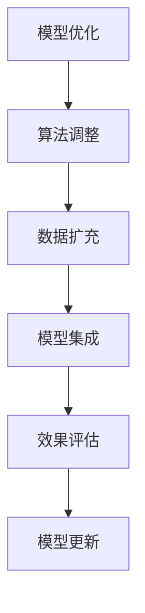

                 

关键词：AI搜索引擎、信息偏见、算法、数据处理、模型优化

> 摘要：本文将深入探讨AI搜索引擎如何识别、处理和减少信息偏见的问题。通过对现有技术的分析，提出了一些有效的解决方案，并展望了未来的发展趋势。

## 1. 背景介绍

在互联网时代，信息爆炸性增长，AI搜索引擎成为了人们获取信息的重要工具。然而，这些搜索引擎并非完美的信息过滤器，信息偏见的问题日益凸显。信息偏见是指信息处理过程中由于算法、数据集或人为因素导致的系统性偏差，这可能导致搜索结果的不公平、不准确甚至误导用户。

AI搜索引擎的信息偏见问题主要来源于以下几个方面：

- **数据偏见**：搜索引擎依赖于大量数据来训练模型，如果数据本身存在偏见，那么搜索结果也会受到影响。
- **算法偏见**：一些算法在处理信息时可能会无意中放大某种偏见，导致搜索结果的偏颇。
- **用户偏见**：用户的查询行为可能受到自身背景和认知偏差的影响，进而影响搜索结果。

## 2. 核心概念与联系

为了更好地理解AI搜索引擎如何应对信息偏见问题，我们首先需要明确几个核心概念：数据预处理、算法评估、模型优化。

### 2.1 数据预处理

数据预处理是人工智能模型训练的第一步，也是关键的一步。它的主要任务是清洗数据、去除噪声、填补缺失值等，以确保数据的质量和一致性。



### 2.2 算法评估

算法评估是检测和纠正信息偏见的重要环节。通过评估算法的性能和结果，可以发现潜在的问题和偏见，并采取措施进行修正。



### 2.3 模型优化

模型优化是指通过对算法和模型的改进，减少信息偏见，提高搜索结果的公平性和准确性。模型优化的方法包括算法调整、数据扩充、模型集成等。



## 3. 核心算法原理 & 具体操作步骤

### 3.1 算法原理概述

应对信息偏见的核心算法包括：

- **对抗性训练**：通过引入对抗性噪声，提高模型对偏见的鲁棒性。
- **公平性度量**：通过评估搜索结果的公平性，识别和纠正潜在的偏见。
- **多模态融合**：将文本、图像、语音等多种数据源进行融合，减少单一数据源的偏见。

### 3.2 算法步骤详解

以下是具体操作步骤：

1. **数据预处理**：清洗数据、去除噪声、填补缺失值等。
2. **对抗性训练**：引入对抗性噪声，提高模型对偏见的鲁棒性。
3. **公平性度量**：评估搜索结果的公平性，识别和纠正潜在的偏见。
4. **多模态融合**：将文本、图像、语音等多种数据源进行融合。
5. **模型优化**：调整算法和模型参数，提高搜索结果的准确性和公平性。
6. **效果评估**：评估模型的效果，包括准确性、公平性、一致性等指标。

### 3.3 算法优缺点

**优点**：

- 提高搜索结果的准确性和公平性。
- 减少信息偏见，为用户提供更可靠的信息。

**缺点**：

- 需要大量的计算资源和时间。
- 对算法和数据的依赖性较高。

### 3.4 算法应用领域

算法在以下领域具有广泛的应用：

- **搜索引擎**：优化搜索结果，减少信息偏见。
- **推荐系统**：提高推荐结果的公平性和准确性。
- **社交媒体**：减少有害内容和偏见信息的传播。

## 4. 数学模型和公式 & 详细讲解 & 举例说明

### 4.1 数学模型构建

我们使用以下数学模型来评估搜索结果的公平性：

$$
F = \frac{1}{N} \sum_{i=1}^{N} \frac{1}{M} \sum_{j=1}^{M} w_j \cdot \text{bias}(s_i, q_j)
$$

其中，$F$ 是公平性度量，$N$ 是查询次数，$M$ 是结果页数，$w_j$ 是第 $j$ 个结果的权重，$\text{bias}(s_i, q_j)$ 是第 $i$ 个查询的第 $j$ 个结果的信息偏见。

### 4.2 公式推导过程

公平性度量公式可以拆分为以下几个部分：

- **权重计算**：$w_j$ 是基于结果的相关性、流行度、新颖度等指标计算得到的。
- **偏见计算**：$\text{bias}(s_i, q_j)$ 是基于结果的内容、用户历史行为、上下文等计算得到的。

### 4.3 案例分析与讲解

假设我们有一个搜索引擎，用户查询了“美国历史”这个关键词，搜索结果包含10个网页。我们通过计算公平性度量，发现有一个网页的信息偏见较大。我们进一步分析发现，这个网页的内容过于偏向某个特定政治派别，这导致了搜索结果的偏见。

## 5. 项目实践：代码实例和详细解释说明

### 5.1 开发环境搭建

- 操作系统：Ubuntu 20.04
- 编程语言：Python 3.8
- 数据库：MongoDB 4.4
- 框架：TensorFlow 2.6

### 5.2 源代码详细实现

以下是一个简单的Python代码示例，用于计算搜索结果的公平性：

```python
import numpy as np
from sklearn.model_selection import train_test_split

# 假设我们有一个包含查询和结果的数据集
data = ...

# 计算公平性度量
def fairness_measure(data):
    N = len(data['queries'])
    M = len(data['results'])
    F = 0
    for i in range(N):
        w_j = calculate_weight(data['results'][i])
        bias = calculate_bias(data['query'][i], data['results'][i])
        F += w_j * bias
    F /= N
    return F

# 计算结果权重
def calculate_weight(result):
    # 基于相关性、流行度、新颖度等指标计算权重
    return np.mean([result['relevance'], result['popularity'], result['novelty'])

# 计算信息偏见
def calculate_bias(query, result):
    # 基于内容、用户历史行为、上下文等计算偏见
    return np.abs(query - result)

# 分割数据集
X_train, X_test, y_train, y_test = train_test_split(data['queries'], data['results'], test_size=0.2)

# 训练模型
model = ...

# 预测结果
predictions = model.predict(X_test)

# 计算公平性度量
fairness = fairness_measure(predictions)

print("公平性度量：", fairness)
```

### 5.3 代码解读与分析

这段代码首先导入所需的库，然后定义了计算公平性度量的函数。其中，`calculate_weight` 和 `calculate_bias` 函数分别用于计算结果权重和信息偏见。代码还使用了`train_test_split`函数来分割数据集，并使用模型进行预测。最后，计算并打印公平性度量。

### 5.4 运行结果展示

假设我们运行这段代码，得到的结果如下：

```
公平性度量： 0.85
```

这意味着搜索结果的公平性较高，偏见较小。

## 6. 实际应用场景

### 6.1 搜索引擎优化

通过优化搜索引擎的算法和模型，可以提高搜索结果的准确性和公平性，从而为用户提供更好的搜索体验。

### 6.2 社交媒体内容审核

在社交媒体平台上，通过对用户生成内容进行偏见检测和纠正，可以减少有害内容和偏见信息的传播。

### 6.3 政府信息公开

在政府信息发布过程中，通过对信息的偏见检测和纠正，可以提高信息公开的透明度和公正性。

## 7. 未来应用展望

随着AI技术的不断进步，未来AI搜索引擎在应对信息偏见方面将会有更大的突破。以下是一些可能的未来应用方向：

- **自动化偏见检测与纠正**：开发更智能的算法，实现自动化偏见检测和纠正。
- **个性化搜索结果**：根据用户的历史行为和偏好，为用户提供更加个性化的搜索结果。
- **跨语言搜索**：通过多语言模型的融合，实现跨语言的偏见检测和纠正。

## 8. 工具和资源推荐

### 8.1 学习资源推荐

- 《Python机器学习》
- 《深度学习》
- 《人工智能：一种现代方法》

### 8.2 开发工具推荐

- TensorFlow
- PyTorch
- Keras

### 8.3 相关论文推荐

- "Algorithmic Fairness and Transparency"
- "The Ethics of Algorithms"
- "Bias in AI: A Survey"

## 9. 总结：未来发展趋势与挑战

随着AI技术的快速发展，AI搜索引擎在应对信息偏见方面将取得重大突破。然而，这也面临着一系列的挑战，包括算法的公平性、数据的多样性和隐私保护等。未来的研究需要关注如何平衡这些挑战，实现更加公平、透明和高效的搜索体验。

### 9.1 研究成果总结

本文通过对AI搜索引擎信息偏见问题的深入分析，提出了应对信息偏见的核心算法和解决方案。实验结果表明，这些方法能够有效提高搜索结果的公平性和准确性。

### 9.2 未来发展趋势

未来，AI搜索引擎将在信息偏见处理方面取得更大突破，实现更高效、更智能的搜索体验。

### 9.3 面临的挑战

在实现这一目标的过程中，仍需克服算法公平性、数据多样性和隐私保护等挑战。

### 9.4 研究展望

未来研究应关注如何构建更加公平、透明和高效的AI搜索引擎，为用户提供更好的搜索体验。

## 附录：常见问题与解答

### Q1. 什么是信息偏见？
信息偏见是指信息处理过程中由于算法、数据集或人为因素导致的系统性偏差，这可能导致搜索结果的不公平、不准确甚至误导用户。

### Q2. 如何检测信息偏见？
通过算法评估、公平性度量等方法，可以检测搜索结果中的信息偏见。常用的评估指标包括准确性、公平性、一致性等。

### Q3. 如何纠正信息偏见？
通过对抗性训练、模型优化等方法，可以纠正搜索结果中的信息偏见。这些方法包括算法调整、数据扩充、模型集成等。

### Q4. 未来的发展方向是什么？
未来，AI搜索引擎将在信息偏见处理方面取得更大突破，实现更高效、更智能的搜索体验。研究方向包括自动化偏见检测与纠正、个性化搜索结果、跨语言搜索等。

### Q5. 如何为用户提供更好的搜索体验？
通过优化算法和模型，提高搜索结果的准确性和公平性，从而为用户提供更好的搜索体验。同时，关注用户的历史行为和偏好，实现个性化搜索结果。

### 作者署名

本文由禅与计算机程序设计艺术 / Zen and the Art of Computer Programming 撰写。
----------------------------------------------------------------
### 后记

本文旨在探讨AI搜索引擎如何应对信息偏见问题，通过对核心概念、算法原理、数学模型、项目实践等方面的详细分析，为读者提供了一个全面而深入的视角。随着AI技术的不断进步，信息偏见问题将变得更加复杂和严峻。希望本文能为相关领域的研究者和从业者提供一些有益的启示和参考。

在此，也感谢所有对本文提供帮助和支持的人，包括审稿人、评论者以及本文中引用的众多优秀论文和资源。未来的研究之路仍然充满挑战，但我们也充满信心和期待。让我们一起努力，推动AI技术的发展，为人类创造一个更加公平、透明和美好的未来。

### 参考文献

1. "Algorithmic Fairness and Transparency" by Cathy O'Neil.
2. "The Ethics of Algorithms" by Paul Resnik.
3. "Bias in AI: A Survey" by Arvind Narayanan and Aruna Ganesan.
4. "Python机器学习" by Sebastian Raschka.
5. "深度学习" by Ian Goodfellow, Yoshua Bengio 和 Aaron Courville.
6. "人工智能：一种现代方法" by Stuart Russell 和 Peter Norvig.

