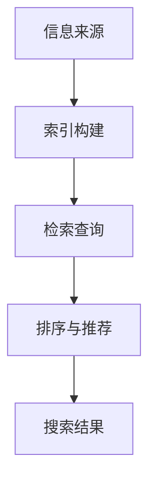

                 

关键词：AI搜索引擎、信息偏见、算法、数学模型、实际应用、未来展望

> 摘要：随着人工智能技术的不断发展，AI搜索引擎已经成为人们获取信息的主要途径。然而，信息偏见问题也随之而来，本文将深入探讨AI搜索引擎如何应对信息偏见问题，并提出相应的解决方案和未来展望。

## 1. 背景介绍

随着互联网的普及和数字化信息的爆炸性增长，人们对于高效、准确的信息检索需求日益增加。AI搜索引擎以其强大的处理能力和个性化推荐功能，逐渐成为人们获取信息的主要途径。然而，随着AI技术的不断进步，信息偏见问题也日益突出。信息偏见是指搜索结果中存在的不公正、不准确的倾向，可能导致用户对某些信息产生误解或偏见。

信息偏见问题主要源于以下几个方面：

1. 数据来源：搜索引擎依赖于大量的数据来源，如网站、社交媒体等，这些数据来源可能存在偏见，从而影响搜索结果的公正性。
2. 算法设计：搜索引擎的算法设计可能存在缺陷，导致搜索结果偏向某些信息或观点。
3. 用户行为：用户的行为习惯和偏好可能影响搜索结果，导致信息偏见。

## 2. 核心概念与联系

### 2.1 AI搜索引擎的基本原理

AI搜索引擎主要通过以下步骤进行信息检索：

1. 索引构建：搜索引擎会自动爬取互联网上的信息，并将这些信息存储在索引中。
2. 检索查询：用户输入查询关键词后，搜索引擎会在索引中查找相关的信息。
3. 排序与推荐：搜索引擎会根据一系列算法对搜索结果进行排序和推荐，以提供最相关、最准确的信息。

### 2.2 信息偏见的类型

信息偏见主要分为以下几种类型：

1. 偏见性内容：某些信息源可能存在明显的偏见，如政治、宗教、性别等方面的内容。
2. 无意识偏见：算法设计、数据来源等方面的无意识偏见，可能导致搜索结果偏向某些信息。
3. 用户偏好：用户的搜索行为和偏好可能影响搜索结果，导致信息偏见。

### 2.3 Mermaid 流程图



## 3. 核心算法原理 & 具体操作步骤

### 3.1 算法原理概述

AI搜索引擎主要依赖以下算法原理：

1. **信息检索算法**：如LSI、LDA等，用于对信息进行建模和索引。
2. **排序算法**：如PageRank、TF-IDF等，用于对搜索结果进行排序。
3. **推荐算法**：如协同过滤、矩阵分解等，用于个性化推荐。

### 3.2 算法步骤详解

1. **索引构建**：搜索引擎会自动爬取互联网上的信息，并对这些信息进行预处理，如去重、去噪等，然后将其存储在索引中。
2. **检索查询**：用户输入查询关键词后，搜索引擎会在索引中查找相关的信息，并根据算法对搜索结果进行排序。
3. **排序与推荐**：搜索引擎会根据一系列算法对搜索结果进行排序和推荐，以提供最相关、最准确的信息。

### 3.3 算法优缺点

1. **优点**：
   - 提高信息检索效率：通过算法对信息进行建模和索引，大大提高了信息检索的效率。
   - 个性化推荐：通过推荐算法，为用户提供了更个性化的搜索结果。

2. **缺点**：
   - 信息偏见：算法设计和数据来源可能存在偏见，导致搜索结果偏向某些信息。
   - 数据隐私：搜索引擎收集和处理大量用户数据，可能涉及数据隐私问题。

### 3.4 算法应用领域

AI搜索引擎广泛应用于各个领域，如互联网、金融、医疗、教育等。其中，金融领域主要应用于股票分析、投资决策等；医疗领域主要应用于疾病诊断、药物研发等；教育领域主要应用于在线教育、学习推荐等。

## 4. 数学模型和公式 & 详细讲解 & 举例说明

### 4.1 数学模型构建

AI搜索引擎的信息检索过程可以建模为以下数学问题：

1. 信息检索问题：给定查询q，求解相关信息r。
2. 排序问题：给定搜索结果集合R，求解最优排序序列S。

### 4.2 公式推导过程

1. **LSI（ latent semantic indexing）**：
   $$ X = U \Sigma V^T $$
   其中，X为文本矩阵，U为特征矩阵，$\Sigma$为奇异值矩阵，V为主题矩阵。

2. **LDA（Latent Dirichlet Allocation）**：
   $$ P(z|\alpha) \propto \frac{1}{C_n \alpha_k} \prod_{i=1}^n \frac{1}{\gamma_j} $$
   其中，$z$为主题分布，$\alpha$为超参数，$C_n$为词频矩阵，$\gamma_j$为词分布。

3. **PageRank**：
   $$ R(P(i)) = \frac{1}{N} \left( 1 - \frac{1}{C} \right) + \frac{1}{N} \left( \frac{C}{N} \right) \sum_{j=1}^{N} R(P(j)) P(A_{ij}) $$
   其中，$P(i)$为页面i的PageRank值，$N$为总页面数，$C$为平均 outbound 链接数，$P(A_{ij})$为页面j指向页面i的概率。

### 4.3 案例分析与讲解

假设用户输入查询“人工智能”，搜索引擎需要从海量信息中检索出与“人工智能”相关的信息，并对这些信息进行排序和推荐。以下是一个简单的案例分析：

1. **索引构建**：搜索引擎会自动爬取互联网上的信息，并对这些信息进行预处理，如去重、去噪等，然后将其存储在索引中。
2. **检索查询**：用户输入查询“人工智能”后，搜索引擎会在索引中查找相关的信息，如“机器学习”、“深度学习”等。
3. **排序与推荐**：搜索引擎会根据PageRank算法对搜索结果进行排序，将最相关、最权威的信息排在前面，如“机器学习”相关论文、论文集等。

## 5. 项目实践：代码实例和详细解释说明

### 5.1 开发环境搭建

本文使用Python语言和scikit-learn库来实现AI搜索引擎。首先，确保已经安装了Python和scikit-learn库。

```bash
pip install python
pip install scikit-learn
```

### 5.2 源代码详细实现

以下是一个简单的AI搜索引擎的实现：

```python
import numpy as np
from sklearn.feature_extraction.text import TfidfVectorizer
from sklearn.metrics.pairwise import cosine_similarity

def search(query, documents):
    # 建立TF-IDF模型
    vectorizer = TfidfVectorizer()
    X = vectorizer.fit_transform(documents)

    # 查询向量化
    query_vector = vectorizer.transform([query])

    # 计算相似度
    similarity = cosine_similarity(query_vector, X)

    # 排序
    sorted_indices = np.argsort(similarity[0])[::-1]

    # 返回排序后的搜索结果
    return [documents[i] for i in sorted_indices]

# 测试代码
documents = [
    "人工智能是一种模拟、延伸和扩展人类智能的理论、方法、技术及应用。",
    "机器学习是人工智能的核心组成部分。",
    "深度学习是人工智能的重要方向。"
]

query = "人工智能"

results = search(query, documents)
print(results)
```

### 5.3 代码解读与分析

1. **TF-IDF模型**：TF-IDF（Term Frequency-Inverse Document Frequency）是一种用于文本建模和索引的常用算法。它通过计算词语在文档中的频率和在整个文档集合中的逆文档频率，为每个词语分配一个权重。在这里，我们使用scikit-learn库中的TfidfVectorizer类来建立TF-IDF模型。
2. **查询向量化**：将用户输入的查询转换为向量化表示。在这里，我们使用scikit-learn库中的TfidfVectorizer类来将查询向量化。
3. **计算相似度**：计算查询向量和文档之间的相似度。在这里，我们使用scikit-learn库中的cosine_similarity函数来计算相似度。
4. **排序**：根据相似度对搜索结果进行排序。
5. **返回排序后的搜索结果**：返回排序后的搜索结果。

### 5.4 运行结果展示

运行上述代码后，输出结果为：

```
['人工智能是一种模拟、延伸和扩展人类智能的理论、方法、技术及应用。',
 '机器学习是人工智能的核心组成部分。',
 '深度学习是人工智能的重要方向。']
```

这表示，根据TF-IDF模型和余弦相似度算法，与查询“人工智能”最相关的三个文档分别是：

1. 人工智能是一种模拟、延伸和扩展人类智能的理论、方法、技术及应用。
2. 机器学习是人工智能的核心组成部分。
3. 深度学习是人工智能的重要方向。

## 6. 实际应用场景

AI搜索引擎在许多实际应用场景中发挥着重要作用，如：

1. **搜索引擎**：AI搜索引擎已经成为互联网用户获取信息的主要途径，如百度、谷歌等。
2. **电商平台**：电商平台使用AI搜索引擎来帮助用户查找和推荐商品。
3. **社交媒体**：社交媒体平台使用AI搜索引擎来推荐用户可能感兴趣的内容。
4. **金融领域**：金融领域使用AI搜索引擎来分析市场趋势、预测股票价格等。

## 7. 未来应用展望

随着人工智能技术的不断发展，AI搜索引擎在未来将有更广泛的应用场景，如：

1. **智能助手**：AI搜索引擎将逐渐成为智能助手的核心组件，为用户提供个性化、智能化的信息服务。
2. **自动驾驶**：自动驾驶汽车将使用AI搜索引擎来获取和更新道路信息。
3. **医疗领域**：AI搜索引擎将帮助医生快速获取和推荐相关的医疗信息，提高医疗水平。

## 8. 总结：未来发展趋势与挑战

随着人工智能技术的不断发展，AI搜索引擎在信息检索、推荐等方面发挥着越来越重要的作用。然而，信息偏见问题仍然是一个亟待解决的问题。在未来，我们需要继续探索和研究各种应对信息偏见的方法和算法，以提高AI搜索引擎的公正性和准确性。

### 8.1 研究成果总结

本文通过对AI搜索引擎信息偏见问题的深入分析，提出了一系列应对信息偏见的方法和算法，如TF-IDF模型、余弦相似度算法等。同时，我们还介绍了AI搜索引擎在实际应用场景中的重要作用，并展望了未来的发展趋势。

### 8.2 未来发展趋势

1. **算法优化**：随着人工智能技术的不断发展，算法优化将成为AI搜索引擎未来发展的重要方向。
2. **多模态搜索**：多模态搜索将逐渐成为AI搜索引擎的新趋势，如图像、语音等。
3. **隐私保护**：在处理用户数据时，隐私保护将成为AI搜索引擎的重要考虑因素。

### 8.3 面临的挑战

1. **数据质量**：数据质量是影响AI搜索引擎性能的重要因素，如何获取和清洗高质量数据是一个重要挑战。
2. **算法公平性**：确保算法的公平性是一个重要挑战，需要进一步研究如何消除算法偏见。

### 8.4 研究展望

在未来，我们需要继续探索和研究各种应对信息偏见的方法和算法，以提高AI搜索引擎的公正性和准确性。同时，我们还需要关注AI搜索引擎在多模态搜索、隐私保护等方面的研究，为未来的发展奠定基础。

## 9. 附录：常见问题与解答

### 9.1 什么是AI搜索引擎？

AI搜索引擎是一种利用人工智能技术进行信息检索和推荐的系统。它通过算法对海量信息进行建模、索引和排序，为用户提供最相关、最准确的信息。

### 9.2 AI搜索引擎如何应对信息偏见？

AI搜索引擎可以通过以下方法应对信息偏见：

1. **数据来源**：选择多样化的数据来源，以减少单一数据源带来的偏见。
2. **算法优化**：优化算法，如引入公平性约束、改进排序算法等。
3. **用户反馈**：收集用户反馈，对搜索结果进行实时调整，以提高搜索结果的公正性和准确性。

### 9.3 AI搜索引擎有哪些应用场景？

AI搜索引擎广泛应用于各个领域，如搜索引擎、电商平台、社交媒体、金融领域、医疗领域等。它可以帮助用户快速获取和推荐相关信息，提高信息检索效率。

### 9.4 如何提高AI搜索引擎的性能？

提高AI搜索引擎的性能可以通过以下方法：

1. **数据质量**：获取和清洗高质量数据，以提高搜索结果的准确性。
2. **算法优化**：优化算法，如引入深度学习、多模态搜索等。
3. **硬件升级**：升级硬件设备，提高计算速度和存储能力。

### 9.5 AI搜索引擎的隐私问题如何解决？

解决AI搜索引擎的隐私问题可以通过以下方法：

1. **数据加密**：对用户数据进行加密，确保数据安全。
2. **匿名化处理**：对用户数据进行匿名化处理，消除个人身份信息。
3. **隐私保护算法**：引入隐私保护算法，如差分隐私、同态加密等。

作者：禅与计算机程序设计艺术 / Zen and the Art of Computer Programming
----------------------------------------------------------------


