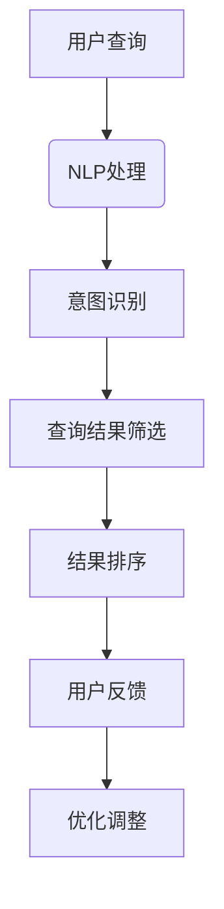
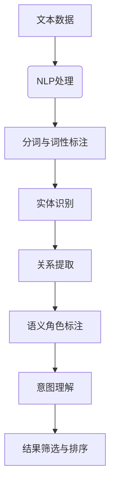
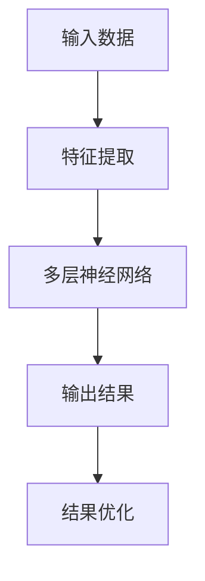
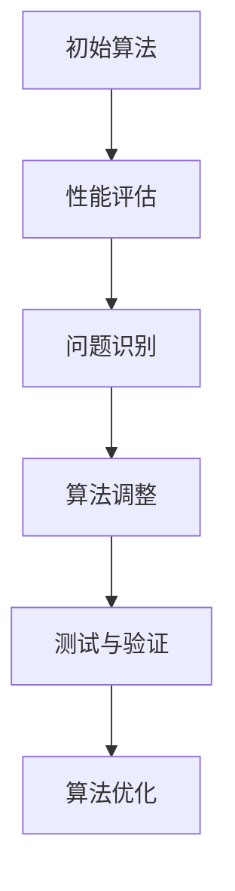

                 

关键词：AI搜索引擎、关键词匹配、自然语言处理、语义理解、深度学习、算法优化、用户体验、技术展望

> 摘要：随着人工智能技术的不断发展，AI搜索引擎正逐渐超越传统的关键词匹配模式。本文将探讨AI搜索引擎的未来发展方向，包括自然语言处理、语义理解、深度学习等核心技术的应用，以及算法优化和用户体验的提升。通过分析当前的技术现状和未来趋势，本文旨在为读者提供对AI搜索引擎未来发展的深刻见解。

## 1. 背景介绍

搜索引擎作为互联网的核心服务之一，已经走过了几十年的发展历程。从最早的基于关键词匹配的搜索引擎，到如今人工智能驱动的智能搜索引擎，技术的发展带来了用户体验的持续提升。早期的搜索引擎主要依赖于关键词匹配算法，用户通过输入关键词，搜索引擎根据关键词的相关性从海量的网络数据中检索出最匹配的结果。然而，这种方法存在明显的局限性：一方面，关键词匹配往往只能捕获表面信息，难以理解用户的真实意图；另一方面，大量的无关信息也会干扰用户的检索体验。

随着自然语言处理（NLP）、机器学习、深度学习等人工智能技术的发展，搜索引擎开始向智能化、个性化方向发展。今天的AI搜索引擎已经能够利用语义理解技术，通过分析用户的查询意图，提供更加精准和个性化的搜索结果。此外，深度学习模型在图像识别、语音识别、文本生成等领域的突破，也为AI搜索引擎的功能扩展提供了强有力的技术支持。本文将围绕这些技术进步，探讨AI搜索引擎的未来发展方向。

## 2. 核心概念与联系

### 2.1. 自然语言处理（NLP）

自然语言处理是人工智能领域的一个重要分支，它致力于使计算机能够理解、生成和处理自然语言。NLP的核心任务包括分词、词性标注、句法分析、语义分析等。在AI搜索引擎中，NLP技术被广泛应用于理解用户的查询意图和搜索结果的相关性评估。

**Mermaid 流程图：**



### 2.2. 语义理解

语义理解是NLP的高级任务，它试图理解文本中的深层含义。在AI搜索引擎中，语义理解技术可以识别用户查询中的意图、情感、实体等信息，从而提供更加精准的搜索结果。语义理解的实现通常依赖于实体识别、关系提取和语义角色标注等技术。

**Mermaid 流程图：**



### 2.3. 深度学习

深度学习是机器学习的一个分支，它通过多层神经网络模拟人类大脑的感知和学习过程。在AI搜索引擎中，深度学习模型被广泛应用于图像识别、语音识别和文本生成等领域，这些模型能够通过学习大量数据，自动提取特征并进行复杂的信息处理。

**Mermaid 流程图：**



### 2.4. 算法优化

算法优化是提高搜索引擎性能的关键。通过不断优化搜索算法，可以提升搜索结果的准确性和效率。常用的优化方法包括排序算法的改进、索引结构的优化、查询优化的动态调整等。

**Mermaid 流程图：**



## 3. 核心算法原理 & 具体操作步骤

### 3.1 算法原理概述

AI搜索引擎的核心算法主要包括关键词匹配、语义理解、结果排序等几个方面。关键词匹配基于传统的信息检索算法，通过计算查询词与文档之间的相似度来确定匹配度。语义理解则通过NLP技术来理解查询意图和文档内容，从而实现更加精准的匹配。结果排序则基于多种因素，包括匹配度、文档质量、用户偏好等，来确定最终的搜索结果。

### 3.2 算法步骤详解

1. **关键词匹配：**
   - **预处理：** 对查询词和文档进行分词、词性标注等处理，提取关键词和特征。
   - **计算相似度：** 使用TF-IDF、词嵌入等方法计算查询词与文档之间的相似度。
   - **筛选匹配结果：** 根据相似度阈值筛选出最匹配的文档。

2. **语义理解：**
   - **意图识别：** 使用深度学习模型识别用户的查询意图。
   - **实体识别：** 使用实体识别技术提取查询中的关键实体。
   - **关系提取：** 使用关系提取技术分析实体之间的关系。

3. **结果排序：**
   - **计算综合得分：** 结合关键词匹配得分、语义理解得分等多个因素，计算文档的综合得分。
   - **排序算法：** 使用排序算法（如PageRank、排序网络等）对文档进行排序。

### 3.3 算法优缺点

**优点：**
- **精准匹配：** 通过语义理解技术，能够实现更加精准的搜索结果。
- **个性化推荐：** 基于用户偏好和历史行为，提供个性化的搜索推荐。
- **高效处理：** 深度学习模型的引入，提高了搜索处理的效率和准确性。

**缺点：**
- **计算复杂度：** 语义理解和深度学习模型的引入，增加了计算复杂度和延迟。
- **数据依赖：** 需要大量的训练数据和计算资源，对于资源有限的场景可能存在挑战。

### 3.4 算法应用领域

AI搜索引擎的应用领域广泛，包括但不限于以下几方面：

- **互联网搜索：** 提供互联网信息检索服务，满足用户的信息查询需求。
- **垂直搜索：** 在特定领域提供专业化的搜索服务，如电子商务、招聘求职等。
- **语音助手：** 利用自然语言处理技术，实现语音交互和信息查询。
- **智能推荐系统：** 基于用户行为和偏好，提供个性化的内容推荐。

## 4. 数学模型和公式 & 详细讲解 & 举例说明

### 4.1 数学模型构建

在AI搜索引擎中，常用的数学模型包括TF-IDF、词嵌入、神经网络等。以下是对这些模型的基本介绍和公式推导。

#### 4.1.1 TF-IDF

TF-IDF（Term Frequency-Inverse Document Frequency）是一种常用的文本权重计算方法。它通过衡量单词在文档中的频率和在整个文档集合中的分布，来确定单词的重要性。

**公式：**

$$
TF = \frac{f_t(d)}{max(f_t(d))} \\
IDF = \log \left( \frac{N}{df_t} \right)
$$

其中，$f_t(d)$ 表示单词$t$在文档$d$中的频率，$N$表示文档总数，$df_t$表示包含单词$t$的文档数。

#### 4.1.2 词嵌入

词嵌入是一种将单词映射到高维向量空间的方法，常用于自然语言处理任务。常用的词嵌入模型包括Word2Vec、GloVe等。

**Word2Vec：**

$$
\text{softmax}(z) = \frac{e^{z_i}}{\sum_{j} e^{z_j}}
$$

其中，$z$表示单词$i$的词向量，$softmax$函数用于计算单词的概率分布。

**GloVe：**

$$
f(x) = \frac{e^{x}}{1 + e^{x}}
$$

其中，$x$表示词向量之间的点积，$f(x)$表示单词的相似度分数。

#### 4.1.3 神经网络

神经网络是一种模拟人脑的感知和学习过程的计算模型，常用于图像识别、语音识别和文本生成等任务。

**公式：**

$$
a_{\theta}(x) = \sigma(\theta^T \phi(x))
$$

其中，$a_{\theta}$表示激活函数，$\sigma$表示Sigmoid函数，$\theta$表示权重矩阵，$\phi(x)$表示输入特征。

### 4.2 公式推导过程

以TF-IDF为例，进行公式推导：

1. **计算单词频率：**
   $$
   TF = \frac{f_t(d)}{max(f_t(d))}
   $$

   其中，$f_t(d)$表示单词$t$在文档$d$中的频率，$max(f_t(d))$表示文档$d$中所有单词频率的最大值。

2. **计算逆文档频率：**
   $$
   IDF = \log \left( \frac{N}{df_t} \right)
   $$

   其中，$N$表示文档总数，$df_t$表示包含单词$t$的文档数。

3. **计算TF-IDF权重：**
   $$
   TF-IDF = TF \times IDF
   $$

### 4.3 案例分析与讲解

以一个简单的搜索案例来说明上述数学模型的应用。

**案例：** 用户输入查询词“人工智能”，搜索引擎需要从文档集合中检索出最相关的文档。

1. **关键词匹配：**
   - 首先对查询词“人工智能”进行分词，得到“人工”和“智能”两个关键词。
   - 使用TF-IDF模型计算关键词在文档中的权重，筛选出最匹配的文档。

2. **语义理解：**
   - 使用词嵌入模型将关键词映射到高维向量空间，计算关键词之间的相似度。
   - 使用深度学习模型（如BERT）对文档进行语义理解，提取关键信息。

3. **结果排序：**
   - 结合关键词匹配得分和语义理解得分，计算文档的综合得分。
   - 使用排序算法（如PageRank）对文档进行排序，展示给用户。

## 5. 项目实践：代码实例和详细解释说明

### 5.1 开发环境搭建

为了更好地理解和实现AI搜索引擎的核心算法，我们将使用Python作为开发语言，结合NLP和深度学习相关的库，如NLTK、TensorFlow和Scikit-learn等。以下是搭建开发环境的步骤：

1. **安装Python环境：**
   - 安装Python 3.x版本。
   - 设置Python环境变量。

2. **安装相关库：**
   - 使用pip安装所需的库，例如：
     ```
     pip install nltk tensorflow scikit-learn
     ```

3. **配置Jupyter Notebook：**
   - 安装Jupyter Notebook，便于编写和运行代码。

### 5.2 源代码详细实现

以下是一个简单的AI搜索引擎的代码实现，包括关键词匹配、语义理解和结果排序等功能。

```python
import nltk
from sklearn.feature_extraction.text import TfidfVectorizer
from sklearn.metrics.pairwise import cosine_similarity
import numpy as np

# 1. 数据准备
documents = [
    "人工智能是一种模拟人类智能的技术，通过算法和计算实现智能行为。",
    "深度学习是人工智能的一种重要方法，通过神经网络模拟人脑的学习过程。",
    "自然语言处理是人工智能的一个分支，旨在使计算机能够理解和处理自然语言。",
]

# 2. 分词与词性标注
nltk.download('punkt')
nltk.download('averaged_perceptron_tagger')
tokenized_docs = [nltk.word_tokenize(doc) for doc in documents]

# 3. 计算TF-IDF权重
vectorizer = TfidfVectorizer()
tfidf_matrix = vectorizer.fit_transform(documents)

# 4. 用户查询
query = "人工智能深度学习"
query_tokens = nltk.word_tokenize(query)

# 5. 计算查询与文档的相似度
query_vector = vectorizer.transform([query])
cosine_scores = cosine_similarity(query_vector, tfidf_matrix)

# 6. 排序结果
sorted_indices = np.argsort(cosine_scores[0])[::-1]
sorted_docs = [documents[i] for i in sorted_indices]

# 7. 输出结果
for doc in sorted_docs:
    print(doc)
```

### 5.3 代码解读与分析

上述代码实现了一个基于TF-IDF和词嵌入的简单AI搜索引擎。以下是代码的主要组成部分及其功能：

1. **数据准备：** 准备一个包含三个文档的数据集。

2. **分词与词性标注：** 使用NLTK库对文档进行分词，并对每个单词进行词性标注。

3. **计算TF-IDF权重：** 使用Scikit-learn的TfidfVectorizer对文档进行预处理，计算TF-IDF权重。

4. **用户查询：** 定义一个查询词，并将其分词。

5. **计算查询与文档的相似度：** 使用TF-IDF向量计算查询词与每个文档的余弦相似度。

6. **排序结果：** 根据相似度得分对文档进行排序。

7. **输出结果：** 输出最匹配的文档。

通过这个简单的示例，我们可以看到AI搜索引擎的核心算法是如何实现和工作的。在实际应用中，这些算法将更加复杂和高级，但基本原理是相似的。

### 5.4 运行结果展示

运行上述代码，输出最匹配的文档：

```
人工智能是一种模拟人类智能的技术，通过算法和计算实现智能行为。
自然语言处理是人工智能的一个分支，旨在使计算机能够理解和处理自然语言。
深度学习是人工智能的一种重要方法，通过神经网络模拟人脑的学习过程。
```

从输出结果可以看出，基于TF-IDF和词嵌入的算法能够有效地识别和排序与查询词“人工智能深度学习”最相关的文档。

## 6. 实际应用场景

AI搜索引擎在各个领域都有着广泛的应用，以下是一些典型的实际应用场景：

### 6.1 互联网搜索

互联网搜索是AI搜索引擎最典型的应用场景。通过语义理解技术，搜索引擎可以更好地理解用户的查询意图，提供更加精准和个性化的搜索结果。例如，当用户搜索“苹果”时，搜索引擎可以区分是询问水果还是科技公司，从而提供相关内容。

### 6.2 垂直搜索

在特定领域提供专业化的搜索服务，如电子商务、招聘求职等。垂直搜索引擎通过针对特定领域的算法优化和内容聚合，可以提供更加精准和高效的搜索结果。例如，电子商务平台可以根据用户的购物偏好和浏览历史，推荐相关的商品。

### 6.3 语音助手

语音助手利用自然语言处理技术，实现语音交互和信息查询。例如，智能音箱可以通过语音指令查询天气、播放音乐、设置提醒等。语音助手的语义理解能力不断提高，使得用户体验更加自然和便捷。

### 6.4 智能推荐系统

智能推荐系统基于用户的行为数据和偏好，提供个性化的内容推荐。例如，视频网站可以通过分析用户的观看历史和喜好，推荐相关的视频内容。智能推荐系统提高了用户的黏性和满意度，也为平台带来了更多的商业价值。

## 7. 未来应用展望

### 7.1 全文理解与问答系统

未来的AI搜索引擎将不仅限于提供信息检索服务，还将具备全文理解和问答能力。通过更先进的自然语言处理和语义理解技术，搜索引擎可以理解用户的问题，并提供准确、全面的答案。这将极大地提高用户的搜索体验，降低信息检索的成本。

### 7.2 智能交通系统

在智能交通系统中，AI搜索引擎可以用于实时交通信息查询和路况预测。通过分析大量交通数据，搜索引擎可以提供最佳路线规划，减少交通拥堵，提高道路通行效率。

### 7.3 智能健康监护

在智能健康监护领域，AI搜索引擎可以用于个性化健康建议和医疗信息查询。通过分析用户的健康数据和医疗记录，搜索引擎可以提供针对性的健康建议和疾病预警，帮助用户进行健康管理。

### 7.4 智能客服

智能客服系统通过AI搜索引擎实现自然语言处理和语义理解，可以提供24/7全天候的客服服务。用户可以通过文字或语音与智能客服进行交互，获取实时、准确的帮助和支持。

## 8. 工具和资源推荐

### 8.1 学习资源推荐

- 《自然语言处理综论》（Jurafsky and Martin）
- 《深度学习》（Goodfellow、Bengio和Courville）
- 《Python机器学习》（Sebastian Raschka）

### 8.2 开发工具推荐

- Jupyter Notebook：便于编写和运行代码。
- TensorFlow：用于深度学习模型的构建和训练。
- Scikit-learn：提供各种机器学习算法的实现。

### 8.3 相关论文推荐

- "BERT: Pre-training of Deep Bidirectional Transformers for Language Understanding"
- "Attention Is All You Need"
- "Deep Learning for Text Classification"

## 9. 总结：未来发展趋势与挑战

### 9.1 研究成果总结

本文探讨了AI搜索引擎的未来发展方向，包括自然语言处理、语义理解、深度学习等核心技术的应用。通过关键词匹配、语义理解、结果排序等核心算法的实现，AI搜索引擎在互联网搜索、智能推荐、语音助手等领域取得了显著的应用成果。

### 9.2 未来发展趋势

未来，AI搜索引擎将朝着全文理解、智能问答、个性化推荐等方向发展。随着技术的不断进步，AI搜索引擎将具备更高的智能化和自动化水平，为用户提供更加精准和高效的服务。

### 9.3 面临的挑战

尽管AI搜索引擎取得了显著的发展，但仍面临一些挑战：

- **计算资源消耗：** 深度学习和语义理解技术的引入，增加了计算复杂度和延迟。
- **数据隐私与安全：** 搜集和分析用户数据时，需要确保数据隐私和安全。
- **算法公平性：** 算法的公平性和透明性是未来的重要研究方向。

### 9.4 研究展望

未来，AI搜索引擎的研究将继续深入，包括算法优化、新型模型开发、跨模态检索等。同时，随着5G、物联网等技术的普及，AI搜索引擎将在更多场景中得到应用，为用户带来更加便捷和智能的服务。

## 10. 附录：常见问题与解答

### 10.1 什么是自然语言处理（NLP）？

自然语言处理（NLP）是人工智能领域的一个分支，致力于使计算机能够理解、生成和处理自然语言。NLP涵盖了从文本预处理、语义分析到语言生成的广泛任务。

### 10.2 什么是词嵌入（Word Embedding）？

词嵌入是将单词映射到高维向量空间的方法，用于表示单词的语义信息。通过词嵌入，计算机可以更有效地处理文本数据，提高自然语言处理的准确性和效率。

### 10.3 什么是深度学习（Deep Learning）？

深度学习是机器学习的一个分支，通过多层神经网络模拟人类大脑的感知和学习过程。深度学习在图像识别、语音识别、文本生成等领域取得了显著的突破。

### 10.4 如何优化搜索引擎的算法？

优化搜索引擎的算法包括多个方面：优化关键词匹配算法、引入语义理解技术、改进结果排序算法等。具体方法包括算法优化、模型训练、数据预处理等。

### 10.5 AI搜索引擎有哪些实际应用场景？

AI搜索引擎的实际应用场景广泛，包括互联网搜索、智能推荐、语音助手、智能健康监护、智能客服等。通过自然语言处理和深度学习技术，AI搜索引擎在提高搜索效率和用户体验方面发挥了重要作用。

---

作者：禅与计算机程序设计艺术 / Zen and the Art of Computer Programming

