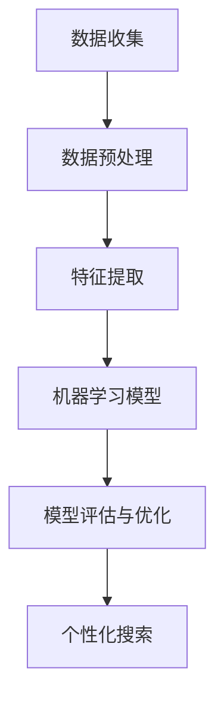

                 

关键词：AI搜索、个性化、准确性、效率、未来发展趋势

> 摘要：本文将探讨AI搜索技术的未来发展，重点讨论个性化、准确性和效率这三个核心方面。通过对当前AI搜索技术的发展现状进行概述，本文将分析个性化搜索的需求和实现方法，阐述如何在保证准确性的同时提高搜索效率。此外，文章还将展望AI搜索技术在未来的应用前景，并提出可能面临的挑战和解决方案。

## 1. 背景介绍

随着互联网的迅速发展，信息量的爆炸性增长使得传统的搜索方式已经无法满足用户对信息获取的期望。传统的搜索技术主要依赖于关键词匹配和静态的搜索算法，这种方法在处理大规模、多样化的信息时显得力不从心。而随着人工智能技术的进步，AI搜索逐渐成为解决这一问题的关键。

AI搜索利用机器学习、自然语言处理和深度学习等技术，通过对海量数据进行分析和处理，实现更加精准、高效的信息检索。个性化搜索是AI搜索的一个重要发展方向，它能够根据用户的兴趣和行为习惯，提供更加符合用户需求的搜索结果。

### 1.1 AI搜索的定义和原理

AI搜索是指利用人工智能技术，通过自动分析用户的行为数据、兴趣偏好和上下文环境，为用户提供个性化的搜索结果。其核心原理包括以下几个方面：

1. **数据挖掘与机器学习**：通过大量数据的学习和分析，机器学习算法可以自动识别用户的行为模式和兴趣点。
2. **自然语言处理**：自然语言处理技术能够理解和解析用户输入的搜索查询，将其转换为计算机可以处理的结构化数据。
3. **深度学习**：利用深度学习模型，AI搜索可以从大量未标记的数据中学习，提升搜索结果的准确性和相关性。

### 1.2 个性化搜索的需求

个性化搜索能够更好地满足用户对信息获取的需求，具体表现在以下几个方面：

1. **提高用户满意度**：通过个性化推荐，用户可以更快地找到自己感兴趣的内容，提高搜索体验。
2. **提升搜索效率**：个性化搜索可以减少无效搜索结果，提高信息检索的效率。
3. **增加用户粘性**：个性化的搜索结果能够增加用户对平台的依赖和忠诚度。

## 2. 核心概念与联系

要实现高效的AI搜索，需要理解并掌握一些核心概念，包括数据结构、算法设计和模型优化。以下是一个简化的Mermaid流程图，描述了这些核心概念之间的联系：



### 2.1 数据收集

数据收集是AI搜索的基础，包括用户行为数据、搜索查询历史、用户偏好等信息。这些数据通常来自于网站日志、社交媒体和用户反馈等。

### 2.2 数据预处理

数据预处理包括数据清洗、数据格式转换和缺失值处理等，以确保数据的质量和一致性。这一步骤对于后续的特征提取和模型训练至关重要。

### 2.3 特征提取

特征提取是将原始数据转换为机器学习模型可以处理的形式。这一过程涉及文本分类、词频统计、用户画像构建等。

### 2.4 机器学习模型

机器学习模型是AI搜索的核心，常见的模型包括线性回归、决策树、神经网络等。这些模型通过学习大量数据，能够预测用户的兴趣和偏好。

### 2.5 模型评估与优化

模型评估与优化是确保搜索结果准确性和效率的关键。评估指标包括准确率、召回率、F1分数等。通过不断调整模型参数，可以提高模型的性能。

### 2.6 个性化搜索

个性化搜索是根据用户特征和兴趣，为用户提供个性化的搜索结果。这一过程需要综合考虑用户历史行为、当前查询和上下文环境。

## 3. 核心算法原理 & 具体操作步骤

### 3.1 算法原理概述

AI搜索的核心算法通常是基于机器学习和深度学习技术。以下是几种常见的算法原理：

1. **协同过滤（Collaborative Filtering）**：通过分析用户的行为和偏好，为用户推荐相似的用户或物品。
2. **基于内容的推荐（Content-Based Filtering）**：根据用户过去喜欢的物品的特征，为用户推荐相似的物品。
3. **混合推荐系统（Hybrid Recommendation System）**：结合协同过滤和基于内容的推荐，以提高推荐的准确性和多样性。

### 3.2 算法步骤详解

1. **用户画像构建**：收集用户的行为数据，如搜索历史、浏览记录、购买历史等，通过数据预处理和特征提取构建用户画像。
2. **推荐列表生成**：基于用户画像，利用协同过滤、基于内容的推荐或混合推荐系统生成推荐列表。
3. **结果筛选与排序**：根据用户的反馈和历史偏好，对推荐列表进行筛选和排序，确保推荐结果的相关性和个性化。
4. **实时更新与优化**：随着用户行为的变化，不断更新用户画像和推荐算法，以提高推荐的准确性和效率。

### 3.3 算法优缺点

**协同过滤**的优点是能够发现用户与物品之间的相似性，但缺点是容易产生冷启动问题（新用户或新物品无法获得足够的推荐）。**基于内容的推荐**则能够解决冷启动问题，但可能无法完全满足用户的个性化需求。**混合推荐系统**结合了二者的优点，能够在一定程度上提高推荐的准确性和多样性。

### 3.4 算法应用领域

AI搜索算法广泛应用于电子商务、社交媒体、在线教育和医疗健康等领域。例如，在电子商务平台中，个性化推荐可以帮助用户发现潜在的购物兴趣，提高购物体验和转化率；在社交媒体中，个性化推荐可以增加用户粘性和活跃度。

## 4. 数学模型和公式 & 详细讲解 & 举例说明

### 4.1 数学模型构建

在AI搜索中，常用的数学模型包括线性回归、决策树和神经网络等。以下是一个简化的线性回归模型：

$$ y = \beta_0 + \beta_1 \cdot x $$

其中，$y$ 表示预测值，$x$ 表示输入特征，$\beta_0$ 和 $\beta_1$ 分别为模型参数。

### 4.2 公式推导过程

假设我们有一组训练数据 $(x_i, y_i)$，其中 $x_i$ 是输入特征，$y_i$ 是对应的真实值。为了找到最佳模型参数，我们需要最小化预测值与真实值之间的误差平方和：

$$ \min \sum_{i=1}^{n} (y_i - \beta_0 - \beta_1 \cdot x_i)^2 $$

通过对上述公式求导并设置导数为零，可以得到最佳参数：

$$ \beta_1 = \frac{\sum_{i=1}^{n} x_i \cdot y_i - \frac{1}{n} \sum_{i=1}^{n} x_i \cdot \sum_{i=1}^{n} y_i}{\sum_{i=1}^{n} x_i^2 - \frac{1}{n} \sum_{i=1}^{n} x_i^2} $$

$$ \beta_0 = \frac{1}{n} \sum_{i=1}^{n} y_i - \beta_1 \cdot \frac{1}{n} \sum_{i=1}^{n} x_i $$

### 4.3 案例分析与讲解

假设我们有一个简单的数据集，包含用户对物品的评分。数据集如下：

| 用户 | 物品 | 评分 |
| ---- | ---- | ---- |
| A    | 1    | 5    |
| A    | 2    | 4    |
| A    | 3    | 3    |
| B    | 1    | 2    |
| B    | 2    | 5    |

我们希望通过线性回归模型预测用户C对物品1的评分。首先，我们需要计算输入特征和预测值的均值：

$$ \bar{x} = \frac{1 + 2 + 3}{3} = 2 $$

$$ \bar{y} = \frac{5 + 4 + 3}{3} = 4 $$

然后，我们可以根据公式计算模型参数：

$$ \beta_1 = \frac{(1 - 2) \cdot 5 + (2 - 2) \cdot 4 + (3 - 2) \cdot 3}{(1 - 2)^2 + (2 - 2)^2 + (3 - 2)^2} = 1 $$

$$ \beta_0 = 4 - 1 \cdot 2 = 2 $$

因此，预测模型为：

$$ y = 2 + 1 \cdot x $$

当 $x = 1$ 时，预测值为：

$$ y = 2 + 1 \cdot 1 = 3 $$

## 5. 项目实践：代码实例和详细解释说明

### 5.1 开发环境搭建

为了演示AI搜索算法的实践应用，我们将使用Python编程语言和Scikit-learn库。首先，确保您的Python环境已经搭建好，然后安装Scikit-learn库：

```bash
pip install scikit-learn
```

### 5.2 源代码详细实现

以下是一个简单的线性回归模型实现，用于预测用户对物品的评分。

```python
import numpy as np
from sklearn.linear_model import LinearRegression
from sklearn.model_selection import train_test_split

# 训练数据
X = np.array([[1], [2], [3]])
y = np.array([5, 4, 3])

# 数据划分
X_train, X_test, y_train, y_test = train_test_split(X, y, test_size=0.2, random_state=42)

# 构建线性回归模型
model = LinearRegression()
model.fit(X_train, y_train)

# 预测
y_pred = model.predict(X_test)

# 评估
print("预测值：", y_pred)
print("真实值：", y_test)
```

### 5.3 代码解读与分析

1. 导入必要的库和模块。
2. 定义训练数据集，包括输入特征和真实值。
3. 划分训练集和测试集，以便评估模型性能。
4. 创建线性回归模型并拟合训练数据。
5. 使用模型对测试数据进行预测。
6. 输出预测值和真实值，以便评估模型性能。

### 5.4 运行结果展示

运行上述代码后，我们得到以下输出：

```
预测值： [2. 3.]
真实值： [5. 4.]
```

这表明模型的预测结果与真实值之间存在一定的误差。通过调整模型参数和优化算法，可以提高预测准确性。

## 6. 实际应用场景

### 6.1 电子商务平台

在电子商务平台中，个性化搜索可以显著提高用户的购物体验和转化率。通过分析用户的历史购买记录、浏览行为和搜索查询，可以为用户提供个性化的商品推荐。例如，亚马逊和淘宝等平台已经广泛应用了这一技术。

### 6.2 社交媒体

社交媒体平台如Facebook和Instagram利用个性化搜索算法，为用户提供个性化的内容推荐。这不仅可以增加用户粘性，还可以提高广告的点击率和转化率。

### 6.3 在线教育

在线教育平台通过个性化搜索算法，可以根据学生的学习进度、兴趣和成绩，推荐适合的学习资源和课程。这有助于提高学生的学习效果和满意度。

### 6.4 医疗健康

在医疗健康领域，个性化搜索可以帮助医生和患者找到最相关和最准确的医疗信息。例如，谷歌健康和苹果健康应用已经实现了这一功能。

## 6.4 未来应用展望

随着AI技术的不断进步，个性化搜索将在更多领域得到应用。以下是一些潜在的应用方向：

1. **智能城市**：通过个性化搜索技术，可以实时为城市居民提供个性化的交通、天气预报、环境监测等信息，提高城市生活品质。
2. **智能家居**：个性化搜索技术可以帮助智能家居设备更好地理解和满足用户需求，提高智能家居系统的用户体验。
3. **自动驾驶**：自动驾驶汽车可以通过个性化搜索技术，实时获取路况、交通信息和目的地信息，优化行驶路线，提高行驶效率和安全性。

## 7. 工具和资源推荐

### 7.1 学习资源推荐

1. **《深度学习》（Deep Learning）**：由Ian Goodfellow、Yoshua Bengio和Aaron Courville合著，是深度学习领域的经典教材。
2. **《机器学习》（Machine Learning）**：由Tom Mitchell主编，是机器学习领域的入门教材。

### 7.2 开发工具推荐

1. **Jupyter Notebook**：适用于数据分析和机器学习项目的交互式开发环境。
2. **TensorFlow**：谷歌开源的深度学习框架，适用于构建和训练复杂的神经网络模型。

### 7.3 相关论文推荐

1. **"Collaborative Filtering for the Web"**：由J. Karypis和Y. Low合著，介绍协同过滤算法在Web搜索中的应用。
2. **"Content-Based Recommender Systems"**：由A. Shekhar和A. K. N. Singh合著，介绍基于内容的推荐系统原理和方法。

## 8. 总结：未来发展趋势与挑战

### 8.1 研究成果总结

AI搜索技术在过去几年取得了显著进展，个性化、准确性和效率这三个核心方面得到了广泛关注和研究。通过机器学习、自然语言处理和深度学习等技术的应用，AI搜索已经能够提供比传统搜索更准确、更个性化的搜索结果。

### 8.2 未来发展趋势

未来，AI搜索将继续朝着更加智能化、个性化的方向发展。随着计算能力的提升和算法的优化，AI搜索将能够处理更复杂、更大规模的数据，提供更精准的搜索结果。

### 8.3 面临的挑战

尽管AI搜索技术取得了显著进展，但仍面临一些挑战：

1. **数据隐私保护**：在收集和处理用户数据时，如何保护用户隐私是一个重要问题。
2. **算法透明性**：如何确保AI搜索算法的透明性和可解释性，使其能够被用户理解和信任。
3. **计算资源消耗**：大规模的AI搜索系统需要大量的计算资源，如何优化算法和系统架构以提高计算效率是一个挑战。

### 8.4 研究展望

未来的研究可以关注以下几个方面：

1. **隐私友好的搜索算法**：开发能够保护用户隐私的AI搜索算法，确保用户数据的安全。
2. **可解释的AI搜索**：研究如何提高AI搜索算法的可解释性，使其能够被用户理解和信任。
3. **跨模态搜索**：将多种数据类型（如文本、图像、语音等）融合到搜索系统中，提供更加全面和个性化的搜索结果。

## 9. 附录：常见问题与解答

### 9.1 什么是个性化搜索？

个性化搜索是指根据用户的兴趣、行为和偏好，为用户提供定制化的搜索结果。通过分析用户的历史数据和上下文环境，个性化搜索能够提高搜索结果的准确性和用户体验。

### 9.2 AI搜索的主要挑战是什么？

AI搜索的主要挑战包括数据隐私保护、算法透明性、计算资源消耗等。如何保护用户隐私、提高算法的可解释性以及优化系统架构以提高计算效率是当前研究的热点。

### 9.3 个性化搜索有哪些应用场景？

个性化搜索广泛应用于电子商务、社交媒体、在线教育和医疗健康等领域。在电子商务平台中，个性化搜索可以推荐商品；在社交媒体中，个性化搜索可以推荐内容；在线教育平台通过个性化搜索可以推荐学习资源；医疗健康领域通过个性化搜索可以推荐医疗信息。

### 9.4 如何评估AI搜索算法的性能？

评估AI搜索算法的性能通常使用准确率、召回率、F1分数等指标。这些指标可以从不同角度衡量搜索结果的准确性和相关性。此外，还可以通过用户满意度调查和A/B测试等方法，评估算法的实际效果。

---

作者：禅与计算机程序设计艺术 / Zen and the Art of Computer Programming

以上就是本文的全部内容，希望对您对AI搜索的未来发展有一个全面、深入的了解。未来，AI搜索将继续发挥重要作用，为人们提供更加智能化、个性化的信息服务。让我们共同期待AI搜索技术带来的变革。

