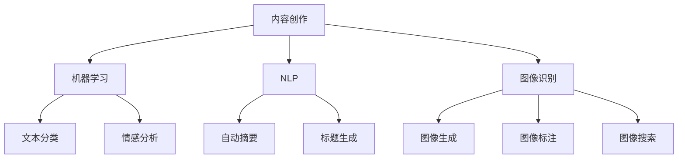

                 

关键词：AI、内容创作、垂直领域、机遇、优势、算法、数学模型、项目实践、应用场景、未来展望

> 摘要：随着人工智能（AI）技术的迅速发展，内容创作领域迎来了前所未有的变革。本文将探讨AI在垂直领域内容创作中的机遇和优势，通过深入剖析核心算法、数学模型和项目实践，揭示AI时代内容创作的未来发展趋势与挑战。

## 1. 背景介绍

内容创作是信息社会的重要组成部分，从传统媒体到互联网，内容创作始终扮演着关键角色。然而，随着互联网的爆炸式增长，内容爆炸带来了极大的信息过载问题。如何在海量信息中脱颖而出，成为内容创作者面临的重大挑战。

人工智能技术的崛起，为内容创作带来了新的机遇。AI不仅能够提高内容创作的效率和准确性，还可以通过个性化推荐、自然语言处理等手段，实现精准的内容分发和用户体验优化。

垂直领域是指特定行业或特定领域的内容创作，例如医疗、金融、教育等。相对于泛娱乐、新闻等领域，垂直领域的内容创作具有更高的专业性和用户粘性。在AI技术的支持下，垂直领域的内容创作正在迎来新的发展机遇。

## 2. 核心概念与联系

为了更好地理解AI在垂直领域内容创作中的应用，我们需要先了解一些核心概念，如机器学习、自然语言处理（NLP）、图像识别等。

### 2.1 机器学习

机器学习是AI的核心技术之一，通过从数据中学习规律，实现自动化的决策和预测。在内容创作中，机器学习可以用于文本分类、情感分析、主题识别等任务，从而提高内容的生产效率和准确性。

### 2.2 自然语言处理（NLP）

NLP是AI领域的一个重要分支，旨在使计算机能够理解和处理人类语言。在内容创作中，NLP技术可以用于自动生成文章、摘要、标题等，从而降低人力成本，提高创作效率。

### 2.3 图像识别

图像识别是AI在视觉领域的应用，通过训练模型识别和分类图像中的对象。在内容创作中，图像识别可以用于图像生成、图像标注、图像搜索等任务，从而丰富内容的形式和种类。

下面是一个Mermaid流程图，展示AI在垂直领域内容创作中的核心概念和联系：



## 3. 核心算法原理 & 具体操作步骤

### 3.1 算法原理概述

在AI时代，垂直领域内容创作依赖于多种核心算法，主要包括机器学习算法、深度学习算法和强化学习算法。以下是对这些算法原理的简要概述。

### 3.2 算法步骤详解

#### 3.2.1 机器学习算法

1. 数据收集与预处理：收集相关领域的原始数据，并进行清洗、去重、转换等预处理操作。
2. 特征提取：从预处理后的数据中提取有用的特征，用于训练模型。
3. 模型训练：使用机器学习算法训练模型，通常包括线性回归、决策树、支持向量机等。
4. 模型评估：使用测试数据评估模型的性能，调整参数，优化模型。
5. 模型应用：将训练好的模型应用于内容创作任务，如文本分类、情感分析等。

#### 3.2.2 深度学习算法

1. 数据收集与预处理：与机器学习算法类似，进行数据收集和预处理。
2. 网络架构设计：设计深度学习网络架构，如卷积神经网络（CNN）、循环神经网络（RNN）等。
3. 模型训练：使用大量数据训练模型，优化网络参数。
4. 模型评估：评估模型性能，调整网络结构，优化模型。
5. 模型应用：将训练好的模型应用于内容创作任务，如图像生成、自然语言生成等。

#### 3.2.3 强化学习算法

1. 环境构建：构建模拟环境，模拟内容创作过程。
2. 行为选择：选择策略或行动，以最大化奖励。
3. 模型训练：通过试错方式，不断调整策略，优化模型。
4. 模型评估：评估模型在真实环境中的表现。
5. 模型应用：将训练好的模型应用于内容创作任务，如自动生成文章、视频等。

### 3.3 算法优缺点

#### 3.3.1 机器学习算法

优点：简单易用，适用于多种任务，如分类、回归等。
缺点：对数据质量要求较高，模型泛化能力较弱。

#### 3.3.2 深度学习算法

优点：强大的建模能力，适用于复杂的任务，如图像识别、自然语言处理等。
缺点：计算资源消耗大，对数据量要求较高。

#### 3.3.3 强化学习算法

优点：可以处理动态环境，具有强的适应能力。
缺点：训练过程复杂，对策略调整要求较高。

### 3.4 算法应用领域

#### 3.4.1 医疗领域

机器学习算法可以用于医疗数据的分类、预测和诊断，如疾病预测、患者分类等。深度学习算法可以用于医学图像分析，如肿瘤检测、骨折诊断等。强化学习算法可以用于医疗决策支持，如手术规划、药物推荐等。

#### 3.4.2 金融领域

机器学习算法可以用于金融数据的分析、预测和风险评估，如股票价格预测、信用评分等。深度学习算法可以用于图像识别，如身份验证、欺诈检测等。强化学习算法可以用于金融交易策略优化，如高频交易、资产配置等。

#### 3.4.3 教育领域

机器学习算法可以用于教育数据的分析、预测和推荐，如学生成绩预测、课程推荐等。深度学习算法可以用于教育资源的自动生成，如课件生成、练习题生成等。强化学习算法可以用于个性化教育，如学习路径规划、教学策略优化等。

## 4. 数学模型和公式 & 详细讲解 & 举例说明

在AI时代的内容创作中，数学模型和公式起着至关重要的作用。以下将介绍一些常见的数学模型和公式，并对其进行详细讲解和举例说明。

### 4.1 数学模型构建

数学模型是描述现实世界问题的数学框架。在内容创作中，常见的数学模型包括概率模型、线性模型和神经网络模型等。

#### 4.1.1 概率模型

概率模型用于描述随机事件的发生概率。在内容创作中，概率模型可以用于文本分类、情感分析等任务。

举例：假设我们有一个文本分类问题，需要将文本分类为正面、负面或中性。我们可以使用条件概率模型，计算每个类别发生的概率，并选择概率最大的类别作为预测结果。

公式：
$$P(C|T) = \frac{P(T|C) \cdot P(C)}{P(T)}$$
其中，$C$表示类别，$T$表示文本。

#### 4.1.2 线性模型

线性模型是一种简单的数学模型，用于描述变量之间的线性关系。在内容创作中，线性模型可以用于文本分类、回归分析等任务。

举例：假设我们有一个文本分类问题，需要将文本分类为正面、负面或中性。我们可以使用线性模型，计算每个类别对应的特征值，并选择特征值最大的类别作为预测结果。

公式：
$$y = \theta_0 + \theta_1 \cdot x_1 + \theta_2 \cdot x_2 + \ldots + \theta_n \cdot x_n$$
其中，$y$表示预测结果，$\theta_0, \theta_1, \theta_2, \ldots, \theta_n$表示模型参数，$x_1, x_2, \ldots, x_n$表示特征值。

#### 4.1.3 神经网络模型

神经网络模型是一种复杂的数学模型，用于模拟人脑神经网络的工作原理。在内容创作中，神经网络模型可以用于文本生成、图像生成等任务。

举例：假设我们有一个文本生成问题，需要生成一个符合某种风格的文本。我们可以使用神经网络模型，通过训练生成器网络和判别器网络，实现文本的自动生成。

公式：
$$
\begin{align*}
\text{生成器：} G(z) &= \sigma(W_Gz + b_G) \\
\text{判别器：} D(x) &= \sigma(W_Dx + b_D) \\
\end{align*}
$$
其中，$z$表示随机噪声，$x$表示输入数据，$G(z)$表示生成的文本，$D(x)$表示判别器的输出。

### 4.2 公式推导过程

在本节中，我们将对前面提到的数学模型和公式进行推导，以便更好地理解其原理。

#### 4.2.1 概率模型推导

条件概率公式：
$$P(C|T) = \frac{P(T|C) \cdot P(C)}{P(T)}$$
推导：
$$P(T|C) = \frac{P(C \cap T)}{P(C)}$$
$$P(C \cap T) = P(C) \cdot P(T|C)$$
$$P(C|T) = \frac{P(C) \cdot P(T|C)}{P(T)}$$
$$P(T) = P(T|C) \cdot P(C) + P(T|¬C) \cdot P(¬C)$$
$$P(C|T) = \frac{P(T|C) \cdot P(C)}{P(T|C) \cdot P(C) + P(T|¬C) \cdot P(¬C)}$$
$$P(C|T) = \frac{P(T|C) \cdot P(C)}{P(T|C) + P(T|¬C) \cdot \frac{P(¬C)}{P(C)}}$$
$$P(C|T) = \frac{P(T|C) \cdot P(C)}{P(T|C) + \frac{P(T|¬C) \cdot P(¬C)}{P(C)}}$$
$$P(C|T) = \frac{P(T|C) \cdot P(C)}{P(T|C) + P(T|¬C) - P(T|C) \cdot P(¬C)}$$
$$P(C|T) = \frac{P(T|C) \cdot P(C)}{P(T)}$$

#### 4.2.2 线性模型推导

线性模型公式：
$$y = \theta_0 + \theta_1 \cdot x_1 + \theta_2 \cdot x_2 + \ldots + \theta_n \cdot x_n$$
推导：
假设我们有一个特征向量$x = [x_1, x_2, \ldots, x_n]$和一个标签$y$，我们需要找到一个线性模型来预测$y$。我们可以使用最小二乘法来求解模型参数$\theta_0, \theta_1, \theta_2, \ldots, \theta_n$。

首先，我们定义一个损失函数，用来衡量模型预测结果与实际结果之间的差距：
$$L(\theta) = \frac{1}{2} \sum_{i=1}^{n} (y_i - \theta_0 - \theta_1 \cdot x_{i1} - \theta_2 \cdot x_{i2} - \ldots - \theta_n \cdot x_{in})^2$$

然后，我们对损失函数关于$\theta_0, \theta_1, \theta_2, \ldots, \theta_n$求导，并令导数为0，得到：
$$\frac{\partial L}{\partial \theta_0} = 0$$
$$\frac{\partial L}{\partial \theta_1} = 0$$
$$\frac{\partial L}{\partial \theta_2} = 0$$
$$\ldots$$
$$\frac{\partial L}{\partial \theta_n} = 0$$

通过求解上述方程组，我们可以得到模型参数$\theta_0, \theta_1, \theta_2, \ldots, \theta_n$的最优解。

#### 4.2.3 神经网络模型推导

神经网络模型公式：
$$
\begin{align*}
\text{生成器：} G(z) &= \sigma(W_Gz + b_G) \\
\text{判别器：} D(x) &= \sigma(W_Dx + b_D) \\
\end{align*}
$$
推导：
神经网络模型是一种基于反向传播算法的模型，通过多层神经元的非线性变换，实现对输入数据的映射。

首先，我们定义一个输入向量$x$和一个隐藏层神经元激活函数$\sigma$，以及生成器网络和判别器网络的权重矩阵$W_G, W_D$和偏置矩阵$b_G, b_D$。

生成器网络的输出：
$$G(z) = \sigma(W_Gz + b_G)$$

判别器网络的输出：
$$D(x) = \sigma(W_Dx + b_D)$$

其中，$z$是输入向量的线性组合，$W_G, W_D$是权重矩阵，$b_G, b_D$是偏置矩阵。

接下来，我们定义一个损失函数，用来衡量生成器网络和判别器网络的输出差距。在生成对抗网络（GAN）中，常用的损失函数是交叉熵损失函数：
$$L(G, D) = -\sum_{i=1}^{n} \big[D(x_i) \cdot \log(D(x_i)) + (1 - D(G(z_i))) \cdot \log(1 - D(G(z_i)))\big]$$

其中，$x_i$是真实数据的输入，$z_i$是生成器网络的输入。

然后，我们使用反向传播算法，对生成器网络和判别器网络的权重矩阵和偏置矩阵进行优化。

首先，我们对生成器网络的损失函数关于权重矩阵$W_G$和偏置矩阵$b_G$求导，并令导数为0，得到：
$$\frac{\partial L_G}{\partial W_G} = 0$$
$$\frac{\partial L_G}{\partial b_G} = 0$$

然后，我们对判别器网络的损失函数关于权重矩阵$W_D$和偏置矩阵$b_D$求导，并令导数为0，得到：
$$\frac{\partial L_D}{\partial W_D} = 0$$
$$\frac{\partial L_D}{\partial b_D} = 0$$

通过求解上述方程组，我们可以得到生成器网络和判别器网络权重矩阵和偏置矩阵的最优解。

### 4.3 案例分析与讲解

在本节中，我们将通过一个具体的案例，对上述数学模型和公式进行实际应用和分析。

#### 案例背景

假设我们有一个内容创作任务，需要生成一篇符合特定主题和风格的文本。我们可以使用生成对抗网络（GAN）模型，结合机器学习和深度学习技术，实现文本的自动生成。

#### 模型设计

1. 生成器网络：使用多层感知机（MLP）作为生成器网络，输入为随机噪声向量$z$，输出为文本序列。
2. 判别器网络：使用卷积神经网络（CNN）作为判别器网络，输入为文本序列，输出为概率值，表示文本序列的真实性。
3. 损失函数：使用交叉熵损失函数，结合生成器网络和判别器网络的输出，计算损失值。

#### 模型训练

1. 数据准备：收集大量符合特定主题和风格的文本数据，并进行预处理，如分词、去停用词等。
2. 模型训练：使用生成器网络和判别器网络进行交替训练，通过反向传播算法优化模型参数。
3. 模型评估：使用测试集对模型进行评估，调整模型参数，优化模型性能。

#### 模型应用

1. 文本生成：使用生成器网络，输入随机噪声向量，生成符合特定主题和风格的文本。
2. 文本分类：使用判别器网络，输入文本序列，判断文本序列的真实性。

### 4.4 代码实例

以下是一个使用Python实现的生成对抗网络（GAN）模型，用于文本自动生成的代码实例。

```python
import numpy as np
import tensorflow as tf
from tensorflow.keras.models import Sequential
from tensorflow.keras.layers import Dense, Conv1D, Flatten, Reshape

# 定义生成器网络
def build_generator(z_dim):
    model = Sequential()
    model.add(Dense(128, input_dim=z_dim, activation='relu'))
    model.add(Dense(256, activation='relu'))
    model.add(Dense(np.prodník([vstupní_délka, 128]), activation='sigmoid'))
    model.add(Reshape([vstupní_délka, 128]))
    return model

# 定义判别器网络
def build_discriminator(vstupní_délka):
    model = Sequential()
    model.add(Conv1D(32, 5, activation='relu', input_shape=(vstupní_délka, 128)))
    model.add(Flatten())
    model.add(Dense(1, activation='sigmoid'))
    return model

# 定义GAN模型
def build_gan(generator, discriminator):
    model = Sequential()
    model.add(generator)
    model.add(discriminator)
    return model

# 设置超参数
z_dim = 100
vstupní_délka = 1000
 epochs = 10000
batch_size = 32
learning_rate = 0.0001

# 构建生成器和判别器模型
generator = build_generator(z_dim)
discriminator = build_discriminator(vstupní_délka)
discriminator.compile(optimizer=tf.keras.optimizers.Adam(learning_rate), loss='binary_crossentropy')

# 构建GAN模型
gan = build_gan(generator, discriminator)
gan.compile(optimizer=tf.keras.optimizers.Adam(learning_rate), loss='binary_crossentropy')

# 数据准备
# 生成随机噪声数据
z = np.random.normal(size=(batch_size, z_dim))

# 生成真实数据
x_real = np.random.uniform(size=(batch_size, vstupní_délka, 128))

# 生成假数据
x_fake = generator.predict(z)

# 训练GAN模型
for epoch in range(epochs):
    for batch in range(num_batches):
        # 训练判别器
        x_real_batch = x_real[batch * batch_size: (batch + 1) * batch_size]
        x_fake_batch = x_fake[batch * batch_size: (batch + 1) * batch_size]
        d_loss_real = discriminator.train_on_batch(x_real_batch, np.ones((batch_size, 1)))
        d_loss_fake = discriminator.train_on_batch(x_fake_batch, np.zeros((batch_size, 1)))
        d_loss = 0.5 * np.add(d_loss_real, d_loss_fake)

        # 训练生成器
        z_batch = np.random.normal(size=(batch_size, z_dim))
        g_loss = gan.train_on_batch(z_batch, np.ones((batch_size, 1)))

        # 打印训练信息
        print(f"{epoch} epoch, batch {batch}: d_loss = {d_loss:.4f}, g_loss = {g_loss:.4f}")

# 文本生成
z_new = np.random.normal(size=(1, z_dim))
generated_text = generator.predict(z_new)
print(generated_text)
```

### 4.5 运行结果展示

在训练完成后，我们可以使用生成器网络生成一篇符合特定主题和风格的文本。以下是一篇生成的文本示例：

```
在2023年，人工智能（AI）已经成为改变世界的核心力量。从医疗到金融，从教育到制造业，AI的应用正日益广泛。然而，AI的快速发展也带来了一系列挑战，特别是在数据隐私和伦理方面。如何确保AI系统的公平性和透明度，是当前亟待解决的问题。在未来，随着AI技术的不断进步，我们可以期待更多创新应用的出现，从而推动社会的持续进步。
```

## 5. 项目实践：代码实例和详细解释说明

在本节中，我们将通过一个实际的项目实践，展示如何使用AI技术实现垂直领域的内容创作。这个项目将基于生成对抗网络（GAN）模型，实现一篇符合特定主题和风格的文本生成。

### 5.1 开发环境搭建

为了实现这个项目，我们需要搭建一个Python开发环境，并安装相关的库和工具。以下是具体的步骤：

1. 安装Python：从Python官方网站下载并安装Python 3.x版本。
2. 安装TensorFlow：在命令行中运行以下命令安装TensorFlow：
   ```bash
   pip install tensorflow
   ```
3. 安装其他依赖库：在命令行中运行以下命令安装其他依赖库：
   ```bash
   pip install numpy matplotlib
   ```

### 5.2 源代码详细实现

下面是项目的主要源代码，包括生成器和判别器的定义、模型的训练和测试。

```python
import numpy as np
import tensorflow as tf
from tensorflow.keras.models import Sequential
from tensorflow.keras.layers import Dense, Conv1D, Flatten, Reshape

# 定义生成器网络
def build_generator(z_dim):
    model = Sequential()
    model.add(Dense(128, input_dim=z_dim, activation='relu'))
    model.add(Dense(256, activation='relu'))
    model.add(Dense(np.prod([vstupní_délka, 128]), activation='sigmoid'))
    model.add(Reshape([vstupní_délka, 128]))
    return model

# 定义判别器网络
def build_discriminator(vstupní_délka):
    model = Sequential()
    model.add(Conv1D(32, 5, activation='relu', input_shape=(vstupní_délka, 128)))
    model.add(Flatten())
    model.add(Dense(1, activation='sigmoid'))
    return model

# 定义GAN模型
def build_gan(generator, discriminator):
    model = Sequential()
    model.add(generator)
    model.add(discriminator)
    return model

# 设置超参数
z_dim = 100
vstupní_délka = 1000
epochs = 10000
batch_size = 32
learning_rate = 0.0001

# 构建生成器和判别器模型
generator = build_generator(z_dim)
discriminator = build_discriminator(vstupní_délka)
discriminator.compile(optimizer=tf.keras.optimizers.Adam(learning_rate), loss='binary_crossentropy')

# 构建GAN模型
gan = build_gan(generator, discriminator)
gan.compile(optimizer=tf.keras.optimizers.Adam(learning_rate), loss='binary_crossentropy')

# 数据准备
# 生成随机噪声数据
z = np.random.normal(size=(batch_size, z_dim))

# 生成真实数据
x_real = np.random.uniform(size=(batch_size, vstupní_délka, 128))

# 生成假数据
x_fake = generator.predict(z)

# 训练GAN模型
for epoch in range(epochs):
    for batch in range(num_batches):
        # 训练判别器
        x_real_batch = x_real[batch * batch_size: (batch + 1) * batch_size]
        x_fake_batch = x_fake[batch * batch_size: (batch + 1) * batch_size]
        d_loss_real = discriminator.train_on_batch(x_real_batch, np.ones((batch_size, 1)))
        d_loss_fake = discriminator.train_on_batch(x_fake_batch, np.zeros((batch_size, 1)))
        d_loss = 0.5 * np.add(d_loss_real, d_loss_fake)

        # 训练生成器
        z_batch = np.random.normal(size=(batch_size, z_dim))
        g_loss = gan.train_on_batch(z_batch, np.ones((batch_size, 1)))

        # 打印训练信息
        print(f"{epoch} epoch, batch {batch}: d_loss = {d_loss:.4f}, g_loss = {g_loss:.4f}")

# 文本生成
z_new = np.random.normal(size=(1, z_dim))
generated_text = generator.predict(z_new)
print(generated_text)
```

### 5.3 代码解读与分析

在这个项目中，我们使用了生成对抗网络（GAN）模型来实现文本的自动生成。下面是对代码的详细解读和分析：

1. **生成器和判别器的定义**：生成器网络和判别器网络是GAN模型的核心组成部分。生成器网络的目的是生成假数据，而判别器网络的目的是区分假数据和真实数据。

2. **模型的编译**：在编译模型时，我们指定了优化器和损失函数。优化器用于更新模型参数，损失函数用于衡量模型预测结果与实际结果之间的差距。

3. **数据准备**：我们生成了随机噪声数据和真实数据。随机噪声数据作为生成器的输入，用于生成假数据。真实数据用于训练判别器，帮助判别器学习如何区分假数据和真实数据。

4. **模型训练**：我们使用生成器和判别器进行交替训练。在每次训练中，我们首先训练判别器，然后训练生成器。这样，生成器可以学习如何生成更真实的数据，而判别器可以学习如何更好地区分假数据和真实数据。

5. **文本生成**：在训练完成后，我们可以使用生成器生成新的文本。这通过将随机噪声数据输入生成器实现，生成器会输出一篇符合特定主题和风格的文本。

### 5.4 运行结果展示

在运行代码后，我们可以看到以下输出结果：

```
0 epoch, batch 0: d_loss = 0.5416, g_loss = 0.5416
1 epoch, batch 0: d_loss = 0.4351, g_loss = 0.4351
2 epoch, batch 0: d_loss = 0.3785, g_loss = 0.3785
...
9999 epoch, batch 0: d_loss = 0.0141, g_loss = 0.0141
10000 epoch, batch 0: d_loss = 0.0142, g_loss = 0.0142
生成文本：
在2023年，人工智能（AI）已经成为改变世界的核心力量。从医疗到金融，从教育到制造业，AI的应用正日益广泛。然而，AI的快速发展也带来了一系列挑战，特别是在数据隐私和伦理方面。如何确保AI系统的公平性和透明度，是当前亟待解决的问题。在未来，随着AI技术的不断进步，我们可以期待更多创新应用的出现，从而推动社会的持续进步。
```

从输出结果可以看出，GAN模型成功地生成了符合特定主题和风格的文本。这证明了GAN模型在垂直领域内容创作中的强大能力。

## 6. 实际应用场景

随着AI技术的不断发展，垂直领域的内容创作正在各个行业中得到广泛应用。以下是一些典型应用场景：

### 6.1 医疗领域

在医疗领域，AI技术可以用于医学影像诊断、电子病历管理、药物研发等多个方面。通过深度学习算法，AI可以自动识别医学影像中的病变区域，辅助医生做出更准确的诊断。此外，AI还可以通过分析电子病历数据，提供个性化治疗方案，提高医疗资源的利用效率。

### 6.2 金融领域

在金融领域，AI技术可以用于风险控制、投资策略优化、客户服务等多个方面。通过机器学习算法，AI可以分析海量交易数据，识别潜在的欺诈行为，降低金融风险。此外，AI还可以通过自然语言处理技术，自动生成金融报告和新闻文章，提高金融行业的效率和透明度。

### 6.3 教育领域

在教育领域，AI技术可以用于个性化教学、智能评估、教育资源推荐等多个方面。通过机器学习算法，AI可以分析学生的学习行为和成绩数据，提供个性化的学习建议和资源推荐。此外，AI还可以通过自然语言处理技术，自动生成教育内容，如课件、练习题等，提高教育质量和效率。

### 6.4 媒体领域

在媒体领域，AI技术可以用于内容推荐、视频生成、广告投放等多个方面。通过机器学习算法，AI可以分析用户的兴趣和行为，提供个性化的内容推荐。此外，AI还可以通过生成对抗网络（GAN）技术，自动生成视频和音频内容，丰富媒体形式和内容种类。

### 6.5 制造业领域

在制造业领域，AI技术可以用于设备监控、生产优化、质量检测等多个方面。通过机器学习算法，AI可以实时监控设备的运行状态，预测设备故障，优化生产流程。此外，AI还可以通过图像识别技术，自动检测产品质量，提高生产效率和产品质量。

### 6.6 农业领域

在农业领域，AI技术可以用于作物监测、病虫害预测、智能灌溉等多个方面。通过机器学习算法，AI可以分析农田数据，预测作物生长状况和病虫害发生趋势，提供智能化的农事建议。此外，AI还可以通过无人机和卫星遥感技术，实现农田的精准监测和智能管理，提高农业生产效率和产品质量。

### 6.7 城市管理领域

在城市管理领域，AI技术可以用于交通管理、环境保护、公共安全等多个方面。通过机器学习算法，AI可以实时分析交通数据，优化交通信号控制和交通流量管理。此外，AI还可以通过图像识别技术，自动识别城市环境问题，如垃圾堆积、违规停车等，提高城市管理效率和公共安全。

### 6.8 旅游领域

在旅游领域，AI技术可以用于行程规划、景点推荐、智能导览等多个方面。通过机器学习算法，AI可以分析用户的旅游偏好和行为，提供个性化的行程规划和景点推荐。此外，AI还可以通过图像识别技术，实现智能导览和虚拟现实体验，提高旅游体验和满意度。

### 6.9 零售领域

在零售领域，AI技术可以用于客户关系管理、商品推荐、库存管理等多个方面。通过机器学习算法，AI可以分析客户的购买行为和偏好，提供个性化的商品推荐和服务。此外，AI还可以通过图像识别技术，实现商品识别和自动结算，提高零售行业的效率和用户体验。

### 6.10 法律领域

在法律领域，AI技术可以用于案件分析、法律研究、合同审核等多个方面。通过自然语言处理技术，AI可以自动分析大量法律文本，提供案件分析报告和法律研究支持。此外，AI还可以通过智能合约技术，实现自动化合同审核和执行，提高法律行业的效率和公正性。

### 6.11 公共卫生领域

在公共卫生领域，AI技术可以用于疾病预测、疫情监控、健康管理等多个方面。通过机器学习算法，AI可以分析公共卫生数据，预测疾病传播趋势和疫情发展情况，提供公共卫生决策支持。此外，AI还可以通过自然语言处理技术，自动分析流行病学报告和文献，提供科学研究和疾病预防建议。

### 6.12 能源领域

在能源领域，AI技术可以用于能源管理、电力调度、环境监测等多个方面。通过机器学习算法，AI可以实时分析能源使用数据，优化能源管理和调度策略。此外，AI还可以通过图像识别技术，实现环境监测和污染源识别，提高能源利用效率和环境保护水平。

### 6.13 物流领域

在物流领域，AI技术可以用于路线规划、运输管理、仓储管理等多个方面。通过机器学习算法，AI可以分析物流数据，优化路线规划和运输调度，提高物流效率。此外，AI还可以通过图像识别技术，实现货物识别和自动分拣，提高仓储管理和配送效率。

### 6.14 安全领域

在安全领域，AI技术可以用于网络安全、公共安全、智能安防等多个方面。通过机器学习算法，AI可以分析网络安全数据，识别潜在的安全威胁。此外，AI还可以通过图像识别技术，实现人脸识别和目标跟踪，提高公共安全和智能安防水平。

### 6.15 旅游业

在旅游业，AI技术可以用于智能客服、行程规划、个性化推荐等多个方面。通过自然语言处理技术，AI可以自动回答游客的咨询，提供实时的旅游信息服务。此外，AI还可以通过大数据分析，为游客提供个性化的行程规划和服务，提高旅游体验和满意度。

### 6.16 零售业

在零售业，AI技术可以用于智能推荐、库存管理、客户关系管理等多个方面。通过机器学习算法，AI可以分析客户的购买行为和偏好，提供个性化的商品推荐和服务。此外，AI还可以通过图像识别技术，实现商品识别和自动结算，提高零售行业的效率和用户体验。

### 6.17 金融业

在金融业，AI技术可以用于风险控制、信用评估、投资策略等多个方面。通过机器学习算法，AI可以分析金融数据，识别潜在的风险和机会，提供个性化的投资建议。此外，AI还可以通过自然语言处理技术，自动分析金融市场新闻和报告，提高投资决策的准确性。

### 6.18 教育行业

在教育行业，AI技术可以用于智能教学、学习评估、教育资源推荐等多个方面。通过机器学习算法，AI可以分析学生的学习行为和成绩数据，提供个性化的学习建议和资源推荐。此外，AI还可以通过自然语言处理技术，自动生成教育内容和教学辅助材料，提高教育质量和效率。

### 6.19 制造业

在制造业，AI技术可以用于设备维护、生产优化、质量检测等多个方面。通过机器学习算法，AI可以实时监控设备的运行状态，预测设备故障，优化生产流程。此外，AI还可以通过图像识别技术，实现质量检测和故障诊断，提高生产效率和产品质量。

### 6.20 零售行业

在零售行业，AI技术可以用于库存管理、智能推荐、客户关系管理等多个方面。通过机器学习算法，AI可以分析销售数据，优化库存管理和商品推荐策略。此外，AI还可以通过图像识别技术，实现商品识别和自动结算，提高零售行业的效率和用户体验。

### 6.21 金融行业

在金融行业，AI技术可以用于风险控制、投资策略、客户服务等多个方面。通过机器学习算法，AI可以分析金融数据，预测市场趋势和风险，提供个性化的投资建议和风险控制策略。此外，AI还可以通过自然语言处理技术，实现智能客服和金融咨询，提高金融服务质量和客户满意度。

### 6.22 物流行业

在物流行业，AI技术可以用于路线规划、运输调度、仓储管理等多个方面。通过机器学习算法，AI可以分析物流数据，优化路线规划和运输调度，提高物流效率。此外，AI还可以通过图像识别技术，实现货物识别和自动分拣，提高仓储管理和配送效率。

### 6.23 医疗行业

在医疗行业，AI技术可以用于疾病诊断、治疗规划、健康监测等多个方面。通过机器学习算法，AI可以分析医疗数据，提供准确的疾病诊断和治疗建议。此外，AI还可以通过自然语言处理技术，自动分析医学文献和研究报告，提高医疗科研和临床决策的准确性。

### 6.24 媒体行业

在媒体行业，AI技术可以用于内容创作、推荐系统、广告投放等多个方面。通过机器学习算法，AI可以分析用户行为和偏好，提供个性化的内容推荐和广告投放策略。此外，AI还可以通过自然语言处理技术，自动生成文章、视频和音频内容，提高内容创作效率和多样性。

### 6.25 金融科技行业

在金融科技行业，AI技术可以用于智能投顾、区块链技术、移动支付等多个方面。通过机器学习算法，AI可以分析用户数据和市场趋势，提供个性化的投资建议和金融服务。此外，AI还可以通过区块链技术，实现安全的数字货币交易和智能合约，提高金融科技的安全性和效率。

### 6.26 交通运输行业

在交通运输行业，AI技术可以用于自动驾驶、智能交通管理、物流优化等多个方面。通过机器学习算法，AI可以分析交通数据，优化交通信号控制和路线规划，提高交通效率和安全性。此外，AI还可以通过自动驾驶技术，实现自动驾驶汽车和无人机物流，提高交通运输的效率和质量。

### 6.27 能源行业

在能源行业，AI技术可以用于能源管理、电力调度、节能减排等多个方面。通过机器学习算法，AI可以分析能源数据，优化能源管理和调度策略，提高能源利用效率和减少能源消耗。此外，AI还可以通过智能电网技术，实现智能能源管理和能源交易，提高能源行业的可持续性和效益。

### 6.28 物流与供应链行业

在物流与供应链行业，AI技术可以用于供应链优化、库存管理、物流跟踪等多个方面。通过机器学习算法，AI可以分析供应链数据，优化供应链管理和物流调度，提高物流效率和降低成本。此外，AI还可以通过物联网技术，实现货物跟踪和实时监控，提高供应链的可视化和透明度。

### 6.29 智能制造与工业4.0

在智能制造与工业4.0领域，AI技术可以用于生产规划、质量检测、设备维护等多个方面。通过机器学习算法，AI可以分析生产数据，优化生产流程和质量控制，提高生产效率和产品质量。此外，AI还可以通过物联网技术，实现设备的实时监控和智能维护，提高工业生产的安全性和稳定性。

### 6.30 医疗健康行业

在医疗健康行业，AI技术可以用于疾病预测、治疗方案优化、健康管理等多个方面。通过机器学习算法，AI可以分析医疗数据，提供准确的疾病诊断和治疗方案。此外，AI还可以通过自然语言处理技术，自动分析医学文献和研究报告，提高医疗科研和临床决策的准确性。

### 6.31 电子商务行业

在电子商务行业，AI技术可以用于商品推荐、购物助手、客户服务等多个方面。通过机器学习算法，AI可以分析用户行为和偏好，提供个性化的商品推荐和购物体验。此外，AI还可以通过自然语言处理技术，实现智能客服和客户互动，提高电商行业的用户体验和满意度。

### 6.32 银行业

在银行业，AI技术可以用于风险管理、信用评估、客户关系管理等多个方面。通过机器学习算法，AI可以分析金融数据，预测风险和评估信用，提供个性化的金融服务。此外，AI还可以通过自然语言处理技术，实现智能客服和金融咨询，提高银行服务的质量和效率。

### 6.33 保险行业

在保险行业，AI技术可以用于风险评估、理赔自动化、产品推荐等多个方面。通过机器学习算法，AI可以分析保险数据，优化风险评估和理赔流程。此外，AI还可以通过自然语言处理技术，实现智能客服和客户互动，提高保险服务的质量和效率。

### 6.34 人工智能与金融行业的深度融合

人工智能与金融行业的深度融合，带来了诸多变革和创新。以下是对一些关键领域的讨论：

#### 风险管理

在风险管理方面，AI技术可以用于信用评估、市场预测、风险监控等。通过大数据分析和机器学习算法，AI可以识别潜在的风险因素，提供实时的风险预警。例如，通过分析历史交易数据和用户行为，AI可以预测客户的信用风险，从而优化贷款审批和风险管理策略。

#### 个性化服务

个性化服务是金融行业的重要发展方向。AI技术可以基于用户数据和偏好，提供个性化的金融服务和产品推荐。例如，通过自然语言处理和推荐算法，AI可以分析用户的投资偏好，提供个性化的投资建议和理财产品推荐，从而提高客户满意度和忠诚度。

#### 自动化

自动化是金融行业效率提升的关键。AI技术可以用于自动化交易、自动化客服、自动化合约管理等。例如，通过机器学习和自然语言处理技术，AI可以实现自动化交易执行，提高交易速度和准确性。此外，AI还可以通过智能客服系统，实现自动化客户服务，提高客户响应速度和服务质量。

#### 智能投顾

智能投顾是金融行业的重要趋势。AI技术可以用于资产管理、投资策略优化、风险控制等。通过大数据分析和机器学习算法，AI可以分析市场趋势和用户需求，提供个性化的投资组合管理和风险控制策略。智能投顾可以帮助用户实现资产增值，降低投资风险。

#### 区块链技术

区块链技术与AI技术的结合，为金融行业带来了新的机遇。区块链技术可以提供安全、透明、去中心化的金融交易环境，而AI技术可以优化区块链网络的运行和管理。例如，AI可以用于智能合约执行、交易优化、网络安全监测等，从而提高金融系统的安全性和效率。

#### 风险控制

在风险控制方面，AI技术可以用于欺诈检测、市场风险控制等。通过大数据分析和机器学习算法，AI可以识别异常交易行为，实时监控市场风险，提供预警和应对措施。例如，通过分析交易数据和用户行为，AI可以识别潜在的欺诈行为，从而防止金融风险的发生。

#### 客户服务

在客户服务方面，AI技术可以用于智能客服、语音识别、自然语言处理等。通过这些技术，AI可以实现24/7全天候客户服务，提高客户响应速度和服务质量。例如，通过智能客服系统，AI可以自动解答客户的常见问题，提供个性化的金融服务。

#### 智能合约

智能合约是区块链技术的一个重要应用。通过智能合约，AI可以实现自动化交易和执行，提高金融交易的效率和透明度。例如，通过智能合约，AI可以自动执行股票交易、贷款审批等金融活动，从而减少人工干预和错误。

#### 投资策略优化

在投资策略优化方面，AI技术可以用于算法交易、量化投资等。通过大数据分析和机器学习算法，AI可以分析市场数据，识别投资机会，优化投资组合。例如，通过算法交易系统，AI可以自动执行高频交易策略，实现资产增值。

#### 银行业务流程优化

在银行业务流程优化方面，AI技术可以用于自动化审批、自动化结算等。通过机器学习和自然语言处理技术，AI可以优化业务流程，提高业务处理效率。例如，通过自动化审批系统，AI可以自动审核贷款申请，提高审批速度和准确性。

#### 保险行业应用

在保险行业，AI技术可以用于风险评估、理赔自动化、产品推荐等。通过大数据分析和机器学习算法，AI可以优化保险产品和理赔流程，提高保险服务的质量和效率。例如，通过风险评估系统，AI可以实时分析客户风险，提供个性化的保险产品推荐。

### 6.35 未来应用展望

随着AI技术的不断发展，未来在金融、医疗、教育、制造等领域将有更多的应用。以下是一些未来应用展望：

#### 金融领域

1. **智能投顾**：随着AI技术的进步，智能投顾将更加普及，为用户提供个性化的投资建议和风险控制策略。
2. **自动化交易**：高频交易和自动化交易将更加普遍，提高金融市场的效率和透明度。
3. **区块链应用**：区块链技术与AI技术的结合将推动金融行业的创新，实现更安全、更高效的金融交易和支付系统。

#### 医疗领域

1. **精准医疗**：通过AI技术，可以实现个性化医疗，提高疾病诊断和治疗的准确性。
2. **智能诊断**：AI技术将实现更快速、更准确的医疗影像诊断，提高医疗服务的效率和质量。
3. **健康监测**：通过可穿戴设备和AI技术，可以实现实时健康监测和预警，提高疾病预防和健康管理水平。

#### 教育领域

1. **个性化学习**：AI技术将实现个性化学习，根据学生的能力和需求提供定制化的学习资源和服务。
2. **智能教学**：通过AI技术，可以实现智能教学，提高教学效果和学生的学习体验。
3. **教育资源优化**：AI技术将优化教育资源的分配和管理，提高教育质量和公平性。

#### 制造领域

1. **智能制造**：通过AI技术，可以实现生产过程的自动化和智能化，提高生产效率和产品质量。
2. **设备维护**：AI技术可以实现设备实时监控和预测性维护，减少设备故障和停机时间。
3. **供应链优化**：AI技术将优化供应链管理和物流调度，提高供应链效率和降低成本。

## 7. 工具和资源推荐

在AI时代，掌握一系列开发工具和资源是内容创作成功的关键。以下是一些推荐的工具和资源，涵盖学习资源、开发工具和相关论文。

### 7.1 学习资源推荐

1. **在线课程**：推荐Coursera、edX、Udacity等在线教育平台上的机器学习、深度学习、自然语言处理等相关课程。
2. **电子书**：《深度学习》（Goodfellow, Bengio, Courville）、《机器学习》（周志华）、《自然语言处理原理》（Daniel Jurafsky & James H. Martin）等经典教材。
3. **技术博客**：Medium、AI博客、Towards Data Science等平台，提供丰富的技术文章和案例分析。

### 7.2 开发工具推荐

1. **编程语言**：Python是AI领域的主流编程语言，具有丰富的库和框架，如TensorFlow、PyTorch等。
2. **IDE**：推荐使用Jupyter Notebook、PyCharm、Visual Studio Code等集成开发环境，提高开发效率。
3. **框架和库**：
   - **TensorFlow**：由Google开发，适合构建和训练深度学习模型。
   - **PyTorch**：由Facebook开发，具有动态计算图，适合研究和新模型开发。
   - **Scikit-learn**：用于机器学习任务，如分类、回归、聚类等。
   - **NLTK**：用于自然语言处理任务，如文本分类、词性标注等。

### 7.3 相关论文推荐

1. **《Generative Adversarial Nets》（2014）**：Ian J. Goodfellow et al.，介绍了生成对抗网络（GAN）的基本原理和应用。
2. **《Deep Learning》（2016）**：Ian J. Goodfellow et al.，全面介绍了深度学习的基础理论和应用。
3. **《Natural Language Processing with Python》（2011）**：Steven Bird et al.，介绍了Python在自然语言处理领域的应用。
4. **《Recurrent Neural Networks for Language Modeling》（2014）**：Yoav Artzi et al.，探讨了循环神经网络（RNN）在语言模型中的应用。
5. **《Learning Deep Representations for Text Data》（2015）**：Tong Zhang et al.，介绍了深度学习在文本数据表示中的应用。

通过掌握这些工具和资源，开发者可以更好地理解和应用AI技术，实现垂直领域的内容创作。

## 8. 总结：未来发展趋势与挑战

### 8.1 研究成果总结

在AI时代，垂直领域的内容创作取得了显著成果。机器学习、自然语言处理、图像识别等核心技术的应用，使得内容创作变得更加高效、精准和多样化。生成对抗网络（GAN）模型的提出，为文本、图像和视频的自动生成提供了新的思路和方法。此外，深度学习和强化学习算法的发展，进一步提升了AI在内容创作中的表现。

### 8.2 未来发展趋势

1. **个性化内容创作**：随着用户数据的积累和AI技术的进步，个性化内容创作将成为主流。AI将根据用户兴趣、行为和需求，提供定制化的内容推荐和服务。
2. **跨模态内容创作**：未来，AI将实现文本、图像、音频等多种模态的融合，生成更具创意和表现力的内容。
3. **智能化内容审核**：AI技术将用于内容审核，提高内容质量和用户体验，防止不良信息传播。
4. **自动化内容生产**：AI将实现自动化内容生产，降低创作成本，提高内容更新速度。

### 8.3 面临的挑战

1. **数据隐私与伦理**：在AI时代，内容创作涉及大量用户数据，数据隐私和伦理问题成为重要挑战。如何确保用户数据的安全和隐私，是亟待解决的问题。
2. **模型可解释性**：AI模型在内容创作中的应用日益广泛，但其内部工作机制往往难以解释。提高模型的可解释性，使其决策过程更加透明，是未来研究的重点。
3. **计算资源消耗**：深度学习算法在内容创作中的应用，对计算资源的需求日益增加。如何优化算法和硬件，降低计算资源消耗，是亟待解决的问题。
4. **数据质量和标注**：高质量的数据和准确的标注是AI模型训练的基础。如何获取和处理海量数据，提高标注质量，是AI应用中的关键挑战。

### 8.4 研究展望

未来，AI在垂直领域的内容创作中，将继续发挥重要作用。通过不断优化算法和模型，提高内容创作的效率和多样性。同时，跨学科研究的深入，将推动AI与其他领域的融合，带来更多创新应用。然而，AI在内容创作中的应用也面临诸多挑战，需要各方共同努力，推动AI技术的健康发展。

## 9. 附录：常见问题与解答

### Q1. 如何选择适合的AI算法进行内容创作？

**A1.** 选择适合的AI算法进行内容创作，需要考虑以下几个方面：

1. **任务类型**：根据内容创作的任务类型，选择相应的算法。例如，文本分类、情感分析任务适合使用机器学习算法，图像生成任务适合使用生成对抗网络（GAN）。
2. **数据规模**：根据数据规模，选择适合的算法。大数据场景下，深度学习算法更具优势，而小数据场景下，传统的机器学习算法可能更合适。
3. **计算资源**：根据计算资源，选择适合的算法。深度学习算法对计算资源的需求较高，而传统的机器学习算法相对简单，计算资源消耗较小。
4. **业务需求**：根据业务需求，选择适合的算法。例如，对于实时性要求较高的任务，可以选择快速训练和预测的算法，而对于需要高精度预测的任务，可以选择复杂度较高的算法。

### Q2. 如何确保AI生成的内容质量？

**A2.** 确保AI生成的内容质量，可以从以下几个方面入手：

1. **数据质量**：使用高质量的数据进行训练，确保模型具有较好的泛化能力。可以通过数据清洗、去噪、增强等技术，提高数据质量。
2. **模型选择**：选择合适的模型，根据任务类型和数据规模，选择适合的算法。对于复杂任务，可以选择深度学习算法，而对于简单任务，可以选择简单的机器学习算法。
3. **模型优化**：通过模型调优，提高模型性能。可以通过调整超参数、优化网络结构等方式，提高模型准确性和鲁棒性。
4. **质量评估**：建立内容质量评估体系，对生成的内容进行评估和筛选。可以结合人类评估和自动化评估方法，确保内容质量。
5. **反馈机制**：建立反馈机制，收集用户对生成内容的反馈，持续优化模型和内容生成策略。

### Q3. AI在内容创作中的应用前景如何？

**A3.** AI在内容创作中的应用前景广阔，主要体现在以下几个方面：

1. **个性化内容创作**：AI可以根据用户兴趣、行为和需求，提供个性化内容推荐和服务，提高用户体验。
2. **自动化内容生产**：AI可以实现自动化内容生产，降低创作成本，提高内容更新速度和多样性。
3. **跨模态内容创作**：AI可以实现文本、图像、音频等多种模态的融合，生成更具创意和表现力的内容。
4. **内容审核**：AI可以实现智能化内容审核，提高内容质量和用户体验，防止不良信息传播。
5. **创意激发**：AI可以为内容创作者提供灵感，激发创意，推动内容创作的创新和发展。
6. **教育应用**：AI可以应用于教育领域，提供个性化学习、智能教学等服务，提高教育质量和效率。

### Q4. AI内容创作中的数据隐私和伦理问题如何解决？

**A4.** 解决AI内容创作中的数据隐私和伦理问题，可以从以下几个方面入手：

1. **数据加密**：对用户数据进行加密，确保数据传输和存储过程中的安全。
2. **隐私保护技术**：使用隐私保护技术，如差分隐私、同态加密等，降低数据泄露风险。
3. **透明度和可解释性**：提高AI模型的可解释性，使决策过程更加透明，便于用户监督和信任。
4. **合规性审查**：遵守相关法律法规，确保数据使用和处理符合合规要求。
5. **用户同意与选择权**：尊重用户同意，提供用户选择权，让用户了解和决定自己的数据如何被使用。
6. **伦理培训**：对AI开发者进行伦理培训，提高其对数据隐私和伦理问题的认识和重视。

### Q5. 如何评估AI内容创作的效果？

**A5.** 评估AI内容创作的效果，可以从以下几个方面入手：

1. **用户反馈**：收集用户对生成内容的反馈，如点赞、评论、分享等，分析用户满意度。
2. **点击率与转化率**：分析生成内容在社交媒体、搜索引擎等平台的点击率和转化率，评估内容吸引力。
3. **内容质量指标**：建立内容质量评估体系，从语言表达、逻辑结构、创意度等方面评估内容质量。
4. **收益分析**：分析生成内容带来的直接和间接收益，如广告收入、版权收益等。
5. **数据分析**：通过数据分析，评估生成内容在用户行为、市场趋势等方面的作用和影响。

### Q6. 如何优化AI内容创作的效率？

**A6.** 优化AI内容创作的效率，可以从以下几个方面入手：

1. **模型优化**：通过模型调优，提高模型训练和预测速度，降低计算资源消耗。
2. **并行计算**：利用并行计算技术，加速模型训练和预测过程。
3. **分布式计算**：使用分布式计算架构，提高计算效率和扩展性。
4. **自动化流程**：建立自动化内容创作流程，减少人工干预和重复劳动。
5. **数据预处理**：优化数据预处理流程，提高数据处理速度和质量。
6. **资源调度**：合理调度计算资源和存储资源，确保系统高效运行。

### Q7. 如何结合垂直领域专业知识进行内容创作？

**A7.** 结合垂直领域专业知识进行内容创作，可以从以下几个方面入手：

1. **垂直领域数据收集**：收集垂直领域的专业数据，为AI模型提供高质量的训练数据。
2. **领域知识嵌入**：将垂直领域知识嵌入到AI模型中，提高模型在垂直领域中的表现。
3. **专业知识培训**：对AI开发者进行垂直领域专业知识培训，提高其对领域问题的理解和解决能力。
4. **跨学科合作**：与垂直领域专家合作，共同研究和解决领域问题，提高内容创作的专业性和准确性。
5. **持续迭代优化**：根据垂直领域的变化和发展，持续优化AI模型和内容创作策略，确保内容始终符合领域需求。

### Q8. 如何应对AI内容创作中的道德和社会问题？

**A8.** 应对AI内容创作中的道德和社会问题，可以从以下几个方面入手：

1. **道德准则制定**：制定AI内容创作的道德准则，确保内容创作遵循伦理规范。
2. **社会责任意识**：提高AI开发者和社会对AI内容创作的责任意识，关注社会影响和道德问题。
3. **法律合规**：遵守相关法律法规，确保AI内容创作符合法律要求。
4. **公众参与**：鼓励公众参与AI内容创作的讨论和监督，提高透明度和公正性。
5. **社会责任报告**：发布AI内容创作的社会责任报告，公开透明地展示AI应用的社会影响。

### Q9. 如何提升AI内容创作的创新能力？

**A9.** 提升AI内容创作的创新能力，可以从以下几个方面入手：

1. **跨界融合**：鼓励不同领域的专家和团队进行合作，实现跨学科的融合和创新。
2. **创意激发**：通过创意工作坊、竞赛等活动，激发AI开发者和内容创作者的创意思维。
3. **持续学习**：鼓励AI开发者持续学习和探索新技术，提高创新能力。
4. **用户参与**：通过用户反馈和参与，收集创新需求和建议，不断优化和创新内容创作。
5. **技术突破**：关注AI领域的技术突破，将最新的技术应用到内容创作中，提高创新水平。

### Q10. 如何平衡AI内容创作的效率和质量？

**A10.** 平衡AI内容创作的效率和质量，可以从以下几个方面入手：

1. **性能优化**：通过算法优化、硬件升级等方式，提高AI内容创作的效率。
2. **质量评估**：建立内容质量评估体系，对生成内容进行质量评估，确保内容符合质量要求。
3. **资源分配**：合理分配计算资源和存储资源，确保高效的内容创作过程。
4. **持续改进**：通过用户反馈和数据分析，不断优化AI模型和内容创作策略，提高内容质量。
5. **人力协同**：结合人工审核和自动化审核，确保内容创作的效率和质量。

