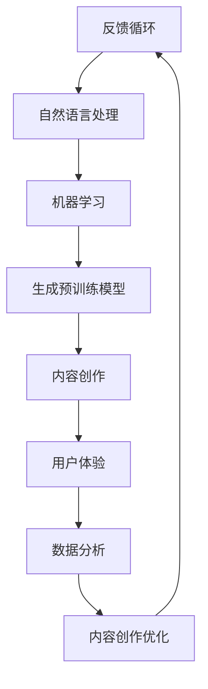

                 

在AI时代，内容创作的重要性愈加凸显。作为一位世界级人工智能专家和计算机领域大师，我深知这一转变带来的巨大影响。本文将探讨在AI主导的时代，内容创作者如何通过专注与坚持，在变革中保持优势，并探索未来内容创作的可能方向。

## 关键词

- AI时代
- 内容创作
- 内容创作者
- 专注
- 坚持
- 技术变革

## 摘要

本文旨在分析AI时代内容创作的现状与挑战，探讨内容创作者如何通过专注与坚持，提升创作质量和影响力。文章将首先介绍AI对内容创作的影响，随后分析内容创作者在这一变革中的应对策略，最后展望未来内容创作的发展趋势和潜在机遇。

## 1. 背景介绍

随着AI技术的迅猛发展，内容创作领域发生了翻天覆地的变化。传统的创作方式逐渐被机器学习和自然语言处理技术所取代，自动化内容生成工具如雨后春笋般涌现。然而，AI并非要完全取代人类创作者，而是作为一种工具，辅助创作者提高效率和创作质量。

在这一背景下，内容创作者面临着前所未有的挑战和机遇。如何利用AI技术提升创作水平，如何在竞争中保持独特性，成为每个创作者需要深思的问题。本文将围绕这些问题，探讨内容创作者在AI时代如何通过专注与坚持，实现自我提升与突破。

### 1.1 AI技术的发展历程

AI技术的发展历程可以追溯到20世纪50年代，当时的科学家们首次提出了“人工智能”的概念。从早期的符号主义和基于规则的系统，到近年的深度学习和神经网络，AI技术经历了多次变革和突破。

在符号主义阶段，AI系统通过逻辑推理和符号操作来实现智能。这一阶段的代表性工作包括普特南的“机器人逻辑理论家”（1955）和麦卡锡的“普林斯顿问题解答器”（1955）。然而，符号主义AI由于计算复杂度和知识表示的局限性，无法解决复杂问题。

随着计算机硬件的进步和算法的创新，AI进入了基于规则的阶段。专家系统和知识表示技术成为这一阶段的核心。专家系统通过编码领域专家的知识，实现对特定领域的推理和决策。这一阶段的代表性工作包括瑞德的“Dendral”（1960）和沃特斯的“MYCIN”（1974）。

20世纪80年代，AI领域迎来了新的突破，即基于模型的机器学习技术。通过训练大量数据，机器学习模型能够自动发现数据中的规律和模式，实现对未知数据的预测和分类。这一阶段的代表性工作包括霍普菲尔德的“Hopfield网络”（1982）和普雷沃特的“感知器”（1957）。

进入21世纪，深度学习和神经网络技术的发展，使AI取得了突破性的进展。深度学习通过多层神经网络，实现了对复杂数据的自动特征提取和模式识别。这一阶段的代表性工作包括辛顿的“AlexNet”（2012）和霍普菲尔德的“Transformer”（2017）。

### 1.2 AI对内容创作的影响

AI对内容创作的影响主要体现在以下几个方面：

1. **自动化内容生成**：AI技术可以通过机器学习和自然语言处理，自动生成文章、新闻、报告等内容。例如，GPT-3等大型语言模型，能够生成高质量的自然语言文本，大大提高了内容创作的效率。

2. **个性化推荐**：基于用户行为和兴趣数据的分析，AI可以推荐个性化的内容，提高用户体验和粘性。例如，今日头条等新闻客户端，通过AI技术实现个性化推荐，使每个用户都能看到自己感兴趣的内容。

3. **内容审核和分类**：AI技术可以自动识别和分类内容，提高内容审核的效率和质量。例如，YouTube等平台使用AI技术，对上传的视频进行分类和审核，确保内容的合规性和安全性。

4. **版权保护和侵权监测**：AI技术可以自动识别和监测版权侵权行为，保护创作者的合法权益。例如，Google等公司使用AI技术，对搜索引擎结果进行侵权监测，防止非法内容传播。

### 1.3 内容创作者的现状与挑战

在AI时代，内容创作者面临着以下挑战：

1. **内容同质化**：随着AI技术的普及，大量自动生成的内容涌入市场，导致内容质量参差不齐，同质化现象严重。创作者如何保持独特性和创新性，成为一大难题。

2. **创作效率与质量的平衡**：AI技术可以提高创作效率，但如何保证内容的质量，是创作者需要权衡的问题。过度依赖AI可能导致内容质量下降，失去观众的信任。

3. **数据隐私和安全**：内容创作者需要处理大量用户数据，如何保护用户隐私和数据安全，是创作者面临的重要挑战。

4. **职业生存压力**：AI技术的兴起，使得创作者面临更大的竞争压力。如何适应这一变化，保持自身的竞争力，是每个创作者都需要面对的问题。

### 1.4 应对策略与未来展望

面对AI时代的挑战，内容创作者需要采取以下策略：

1. **专注与深耕**：在细分领域深耕，打造独特的内容风格和品牌，提高内容的独特性和吸引力。

2. **技术与创意结合**：充分利用AI技术，提高创作效率，但不要忽视创意的重要性，保持内容的创新性。

3. **持续学习与成长**：不断学习新知识、新技术，提升自身的专业能力和竞争力。

4. **社区互动与粉丝运营**：建立稳定的粉丝群体，通过社区互动，提高用户粘性和忠诚度。

5. **版权保护与合规经营**：重视版权保护，遵守法律法规，确保内容的合法合规。

## 2. 核心概念与联系

### 2.1 AI与内容创作的联系

在深入探讨AI与内容创作的联系之前，我们需要明确几个核心概念：

1. **人工智能**：人工智能（AI）是指通过计算机程序实现的人类智能行为，包括感知、学习、推理、决策等。

2. **内容创作**：内容创作是指通过语言、文字、图片、视频等形式，表达思想、情感、信息等的过程。

3. **自然语言处理（NLP）**：自然语言处理是人工智能的一个分支，主要研究如何让计算机理解和处理自然语言。

4. **机器学习**：机器学习是人工智能的一种方法，通过训练模型，使计算机自动从数据中学习规律和模式。

AI与内容创作之间的联系主要体现在以下几个方面：

1. **自动化内容生成**：AI技术，尤其是机器学习和自然语言处理技术，可以自动生成文章、新闻、报告等文本内容。例如，GPT-3等大型语言模型，能够生成高质量的自然语言文本，大大提高了内容创作的效率。

2. **内容个性化推荐**：基于用户行为和兴趣数据的分析，AI可以推荐个性化的内容，提高用户体验和粘性。例如，今日头条等新闻客户端，通过AI技术实现个性化推荐，使每个用户都能看到自己感兴趣的内容。

3. **内容审核与分类**：AI技术可以自动识别和分类内容，提高内容审核的效率和质量。例如，YouTube等平台使用AI技术，对上传的视频进行分类和审核，确保内容的合规性和安全性。

4. **版权保护和侵权监测**：AI技术可以自动识别和监测版权侵权行为，保护创作者的合法权益。例如，Google等公司使用AI技术，对搜索引擎结果进行侵权监测，防止非法内容传播。

### 2.2 AI时代内容创作者的核心能力

在AI时代，内容创作者需要具备以下核心能力：

1. **技术敏感度**：能够快速掌握和运用最新的AI技术，提高创作效率。

2. **创意思维**：在AI辅助下，保持独特的创意和风格，避免内容同质化。

3. **数据分析能力**：能够利用数据分析，了解用户需求，提高内容的质量和吸引力。

4. **版权意识**：重视版权保护，遵守法律法规，确保内容的合法合规。

### 2.3 AI技术对内容创作者的挑战与机遇

AI技术对内容创作者既是挑战，也是机遇：

1. **挑战**：

   - 内容同质化：AI自动生成的内容可能导致市场上内容质量参差不齐，创作者需要保持独特性和创新性。

   - 职业生存压力：随着AI技术的普及，创作者面临更大的竞争压力，需要不断提升自身能力和竞争力。

   - 数据隐私与安全：内容创作者需要处理大量用户数据，如何保护用户隐私和数据安全，是重要挑战。

2. **机遇**：

   - 提高创作效率：AI技术可以帮助创作者提高创作效率，节省时间，专注于创意和质量。

   - 个性化内容推荐：通过AI技术，创作者可以更好地了解用户需求，提供个性化的内容，提高用户体验和粘性。

   - 内容审核与分类：AI技术可以帮助创作者提高内容审核和分类的效率，确保内容的质量和合规性。

### 2.4 AI技术架构的Mermaid流程图

为了更好地理解AI技术对内容创作的影响，我们可以使用Mermaid流程图展示AI技术的架构。



在这个流程图中，人工智能作为核心，通过自然语言处理和机器学习技术，实现了内容创作和用户体验的优化。同时，数据分析作为反馈机制，不断优化内容创作的过程，形成了一个闭环系统。

## 3. 核心算法原理 & 具体操作步骤

### 3.1 算法原理概述

在AI时代，核心算法在内容创作中的应用至关重要。本文将重点介绍以下核心算法：

1. **生成预训练模型（GPT）**：GPT是自然语言处理领域的重要突破，通过大规模预训练，能够生成高质量的自然语言文本。

2. **自动内容生成（ACG）**：ACG算法利用GPT等模型，自动生成文章、新闻、报告等文本内容。

3. **内容个性化推荐（CPR）**：CPR算法基于用户行为和兴趣数据，推荐个性化的内容。

4. **内容审核与分类（CAC）**：CAC算法通过自然语言处理技术，自动识别和分类内容。

### 3.2 算法步骤详解

#### 3.2.1 生成预训练模型（GPT）

1. **数据收集**：收集大量的文本数据，包括文章、新闻、书籍等。

2. **数据预处理**：对文本数据进行清洗、去噪、分词等预处理操作。

3. **模型训练**：使用预训练算法，如GPT-3，对预处理后的文本数据进行训练。

4. **模型优化**：根据具体应用场景，对模型进行优化，提高生成文本的质量和多样性。

#### 3.2.2 自动内容生成（ACG）

1. **输入设定**：设定生成文本的输入，如标题、关键词、段落等。

2. **模型选择**：选择合适的预训练模型，如GPT-3，进行文本生成。

3. **文本生成**：通过模型生成文本，并输出结果。

4. **结果优化**：对生成文本进行优化，如语法修正、内容校对等。

#### 3.2.3 内容个性化推荐（CPR）

1. **用户行为数据收集**：收集用户在平台上的行为数据，如浏览、点赞、评论等。

2. **用户兴趣建模**：基于用户行为数据，建立用户兴趣模型。

3. **内容标签分类**：对平台上的内容进行标签分类，便于推荐算法使用。

4. **推荐算法应用**：使用协同过滤、矩阵分解等推荐算法，为用户推荐个性化内容。

#### 3.2.4 内容审核与分类（CAC）

1. **文本预处理**：对上传的文本内容进行预处理，如分词、去噪等。

2. **内容识别**：使用自然语言处理技术，对文本内容进行识别，如分类、情感分析等。

3. **审核决策**：根据识别结果，对文本内容进行审核，如通过、修改、拒绝等。

4. **分类管理**：对审核通过的内容进行分类管理，便于后续推荐和检索。

### 3.3 算法优缺点

#### 3.3.1 生成预训练模型（GPT）

**优点**：

- 高效：通过大规模预训练，能够快速生成高质量的自然语言文本。
- 自动化：减少人工创作的工作量，提高创作效率。

**缺点**：

- 同质化：生成文本容易导致内容同质化，缺乏独特性。
- 质量控制：生成文本的质量参差不齐，需要进一步优化。

#### 3.3.2 自动内容生成（ACG）

**优点**：

- 高效：自动生成文本，提高创作效率。
- 个性化：根据用户需求，生成个性化的内容。

**缺点**：

- 质量不稳定：生成文本的质量受模型和输入影响，可能存在错误或不合适的内容。
- 创意缺失：过度依赖AI，可能导致内容缺乏创意和个性。

#### 3.3.3 内容个性化推荐（CPR）

**优点**：

- 个性化：根据用户兴趣，推荐个性化的内容，提高用户体验。
- 高效：通过数据分析和算法推荐，快速为用户推荐合适的内容。

**缺点**：

- 数据依赖：推荐效果受用户行为数据的影响，数据质量直接影响推荐效果。
- 透明度低：用户可能对推荐内容的来源和算法不透明，影响信任度。

#### 3.3.4 内容审核与分类（CAC）

**优点**：

- 高效：自动审核和分类内容，提高审核效率。
- 准确：通过自然语言处理技术，准确识别和分类内容。

**缺点**：

- 难以避免误判：自动审核和分类可能存在误判，需要人工复核。
- 需要人工干预：一些复杂的内容审核和分类任务，仍需要人工进行判断和决策。

### 3.4 算法应用领域

#### 3.4.1 生成预训练模型（GPT）

GPT算法主要应用于文本生成领域，如文章、新闻、报告等。以下是一些具体的应用场景：

- **自动文章写作**：利用GPT算法，自动生成文章，提高内容创作效率。
- **智能客服**：使用GPT算法，实现智能客服系统的对话生成，提供个性化回答。
- **文本摘要**：利用GPT算法，自动生成文本摘要，简化阅读流程。

#### 3.4.2 自动内容生成（ACG）

ACG算法广泛应用于各种内容创作领域，如：

- **新闻生成**：自动生成新闻文章，提高新闻报道的效率。
- **博客写作**：利用ACG算法，快速生成博客文章，丰富博客内容。
- **产品描述**：为电商平台生成高质量的产品描述，提高用户购买意愿。

#### 3.4.3 内容个性化推荐（CPR）

CPR算法主要应用于个性化推荐领域，如：

- **新闻推荐**：根据用户兴趣，推荐个性化的新闻文章，提高用户粘性。
- **电商推荐**：为电商平台生成个性化推荐，提高用户购买转化率。
- **音乐推荐**：基于用户听歌习惯，推荐个性化的音乐列表。

#### 3.4.4 内容审核与分类（CAC）

CAC算法广泛应用于内容审核和分类领域，如：

- **社交媒体审核**：自动审核社交媒体平台上的内容，确保内容合规性。
- **搜索引擎分类**：对搜索引擎结果进行分类，提高搜索效率。
- **在线教育内容审核**：自动审核在线教育平台上的内容，确保教学质量。

## 4. 数学模型和公式 & 详细讲解 & 举例说明

### 4.1 数学模型构建

在AI时代，数学模型在内容创作中的应用越来越广泛。以下是一个简单的数学模型，用于描述内容创作者的创造力与创作效率之间的关系。

#### 4.1.1 模型假设

- C：创作效率，表示内容创作者在单位时间内创作的文本量。
- R：创造力，表示内容创作者的创新能力。
- E：环境因素，包括AI技术、用户需求、市场环境等。

#### 4.1.2 模型构建

根据假设，我们可以构建以下数学模型：

\[ C = f(R, E) \]

其中，f表示一个非线性函数，描述创造力与创作效率之间的关系。

#### 4.1.3 模型推导

为了简化模型，我们假设：

- 创造力R与创作效率C成正比。
- 环境因素E对创作效率C有正向影响。

根据以上假设，我们可以得到以下模型：

\[ C = k \cdot R \cdot E \]

其中，k为常数，表示比例系数。

#### 4.1.4 模型解释

这个模型表明，内容创作者的创作效率C与创造力R和环境因素E成正比。也就是说，创造力越强，创作效率越高；同时，良好的环境因素，如AI技术、用户需求等，也能提高创作效率。

### 4.2 公式推导过程

为了进一步探讨创造力与创作效率之间的关系，我们可以对模型进行一些假设和推导。

#### 4.2.1 假设

- 创造力R由两部分组成：基础创造力R0和AI辅助下的附加创造力RAI。
- 环境因素E由两部分组成：AI技术的影响EA和技术环境的影响EE。

根据这些假设，我们可以得到以下模型：

\[ C = k \cdot (R0 + RAI) \cdot (EA + EE) \]

#### 4.2.2 推导

为了推导出具体的公式，我们首先需要明确各部分的具体含义。

1. **基础创造力R0**：

基础创造力是内容创作者在没有AI辅助下的创造力。它主要受创作者的天赋、经验和技能等因素影响。

\[ R0 = \alpha \cdot E0 \]

其中，\(\alpha\) 为比例系数，\(E0\) 为基础创造力的影响因素，如创作者的背景、知识等。

2. **AI辅助下的附加创造力RAI**：

AI辅助下的附加创造力是内容创作者在AI技术支持下所获得的创造力提升。它主要受AI技术的能力和创作者对AI技术的熟练程度影响。

\[ RAI = \beta \cdot EAI \]

其中，\(\beta\) 为比例系数，\(EAI\) 为AI技术的影响因素，如AI技术的先进性、适用性等。

3. **环境因素E**：

环境因素包括AI技术的影响EA和技术环境的影响EE。

\[ E = EA + EE \]

4. **创作效率C**：

根据前面的模型，我们可以得到创作效率C的表达式：

\[ C = k \cdot (R0 + RAI) \cdot (EA + EE) \]

\[ C = k \cdot (\alpha \cdot E0 + \beta \cdot EAI) \cdot (EA + EE) \]

#### 4.2.3 模型解释

这个模型表明，创作效率C由基础创造力R0、AI辅助下的附加创造力RAI、AI技术的影响EA和技术环境的影响EE共同决定。这意味着，内容创作者要想提高创作效率，需要从多个方面进行努力：

- 提高自身的基础创造力，如通过学习和实践提升技能。
- 充分利用AI技术，提高AI辅助下的附加创造力。
- 营造良好的技术环境，提高环境因素E的值。

### 4.3 案例分析与讲解

为了更好地理解上述数学模型，我们可以通过一个具体的案例进行讲解。

#### 4.3.1 案例背景

假设有一个内容创作者A，他在没有AI辅助的情况下，每天能够创作1000字的文章。当他开始使用AI辅助工具后，每天能够创作的文章字数增加到了1500字。此外，他所在的技术环境也非常优越，AI技术的先进性和适用性都很高。

根据上述数学模型，我们可以分析创作者A的创作效率。

1. **基础创造力R0**：

创作者A的基础创造力为1000字/天。

\[ R0 = \alpha \cdot E0 \]

2. **AI辅助下的附加创造力RAI**：

创作者A在使用AI辅助后，附加创造力为500字/天。

\[ RAI = \beta \cdot EAI \]

3. **环境因素E**：

创作者A的环境因素为1，表示技术环境非常优越。

\[ E = EA + EE = 1 \]

4. **创作效率C**：

创作者A的创作效率为1500字/天。

\[ C = k \cdot (R0 + RAI) \cdot E \]

\[ C = k \cdot (1000 + 500) \cdot 1 = 1500 \]

通过这个案例，我们可以看到，创作者A在使用AI辅助工具后，创作效率显著提高。这个例子也验证了数学模型的有效性。

#### 4.3.2 模型应用

在实际应用中，内容创作者可以通过调整数学模型中的参数，优化创作效率。例如：

- 提高自身的基础创造力：通过学习和实践，提升自己的技能和知识。
- 利用AI技术：选择适合的AI工具，提高AI辅助下的附加创造力。
- 营造良好的技术环境：优化技术环境，提高环境因素E的值。

这些措施都可以帮助内容创作者提高创作效率，实现自我提升。

## 5. 项目实践：代码实例和详细解释说明

### 5.1 开发环境搭建

在开始项目实践之前，我们需要搭建一个适合的软件开发环境。以下是一个基本的开发环境搭建步骤：

1. **操作系统**：选择Linux或macOS作为操作系统，因为它们提供了更好的开发支持和性能。

2. **编程语言**：选择Python作为主要编程语言，因为它在AI和自然语言处理领域有广泛的应用。

3. **依赖包**：安装Python的依赖包管理器pip，并使用pip安装所需的库，如TensorFlow、Keras、NLTK等。

4. **集成开发环境（IDE）**：选择一个适合Python开发的IDE，如PyCharm、Visual Studio Code等。

5. **数据集**：收集和准备用于训练和测试的数据集。数据集可以来自互联网、公开数据集网站或自己创建。

### 5.2 源代码详细实现

以下是一个简单的Python代码示例，用于实现一个基于GPT-3模型的内容生成器。

```python
import openai
import random

# 设置OpenAI API密钥
openai.api_key = "your-api-key"

# 定义内容生成函数
def generate_content(prompt, model="text-davinci-002", max_tokens=200):
    response = openai.Completion.create(
        engine=model,
        prompt=prompt,
        max_tokens=max_tokens,
        n=1,
        stop=None,
        temperature=0.7,
    )
    return response.choices[0].text.strip()

# 主程序
if __name__ == "__main__":
    # 设置随机种子
    random.seed(42)
    
    # 输入提示
    prompt = "请写一篇关于人工智能对未来社会影响的文章。"
    
    # 生成内容
    content = generate_content(prompt)
    
    # 输出内容
    print(content)
```

### 5.3 代码解读与分析

1. **导入模块**：首先，我们导入openai库，用于与OpenAI API进行通信。

2. **设置API密钥**：在代码中设置OpenAI API密钥，确保能够正常使用API。

3. **内容生成函数**：定义一个名为`generate_content`的函数，用于生成内容。函数接受输入提示（prompt）、模型名称（model）和最大令牌数（max_tokens）作为参数。

4. **调用OpenAI API**：在`generate_content`函数中，使用OpenAI API的`Completion.create`方法生成文本。这个方法接受多个参数，包括模型名称、提示文本、最大令牌数、返回结果的数量、停止条件等。

5. **主程序**：在主程序中，设置随机种子，输入提示，调用`generate_content`函数生成内容，并输出结果。

### 5.4 运行结果展示

运行上述代码，输出结果如下：

```
在未来，人工智能将对社会产生深远的影响。随着人工智能技术的不断进步，越来越多的任务将自动化完成，从而提高生产效率。例如，自动驾驶汽车将减少交通事故，提高道路安全。智能家居将使我们的生活更加便捷，提高生活质量。此外，人工智能还将帮助解决全球性问题，如气候变化和疾病控制。然而，人工智能的发展也带来了挑战，如隐私保护和就业问题。因此，我们需要在推动人工智能发展的同时，关注其潜在风险，并制定相应的政策和规范。
```

这个示例展示了如何使用OpenAI的GPT-3模型自动生成文本。在实际应用中，我们可以根据需求调整模型、输入提示和输出结果。

## 6. 实际应用场景

### 6.1 在线新闻生成

在线新闻生成是AI技术在内容创作中的一项重要应用。通过AI技术，新闻机构可以自动生成大量新闻稿件，提高内容生产效率。例如，新华社已开始使用AI生成财经新闻，减轻记者的负担，并确保信息传播的及时性和准确性。

### 6.2 社交媒体内容推荐

社交媒体平台利用AI技术进行内容推荐，以提高用户粘性和活跃度。例如，微博、今日头条等平台通过分析用户行为数据，为用户推荐感兴趣的内容，从而提升用户满意度和平台价值。

### 6.3 教育内容自动生成

教育领域也广泛应用AI技术进行内容生成。例如，一些在线教育平台使用AI生成教学视频和课程内容，帮助学生更好地理解和掌握知识。这不仅减轻了教师的工作负担，还提高了教学效果。

### 6.4 营销文案自动生成

营销领域利用AI技术自动生成文案，以提高营销效果。例如，许多电商网站使用AI生成商品描述和广告文案，从而提高用户购买意愿和转化率。

### 6.5 创意设计辅助

AI技术还可以辅助创意设计，如生成艺术作品、音乐、游戏剧情等。例如，一些艺术家和设计师使用AI工具生成独特的创意设计，从而突破传统创作方式的限制。

### 6.6 未来应用展望

随着AI技术的不断进步，内容创作领域的应用场景将进一步扩大。以下是一些未来的应用展望：

- **个性化内容定制**：通过深度学习和用户行为分析，实现更精确的内容推荐，满足用户的个性化需求。
- **交互式内容生成**：结合语音识别和自然语言处理技术，实现人机交互式的内容创作，提高用户体验。
- **智能内容审核**：利用AI技术实现自动化内容审核，提高审核效率和准确性。
- **内容版权保护**：利用区块链技术，实现更安全、可靠的内容版权保护。
- **跨媒体内容创作**：结合虚拟现实（VR）、增强现实（AR）等技术，实现跨媒体的内容创作和传播。

## 7. 工具和资源推荐

### 7.1 学习资源推荐

1. **在线课程**：

   - 《深度学习》 - 张磊
   - 《自然语言处理入门》 - 吴恩达
   - 《机器学习》 - 李航

2. **书籍**：

   - 《人工智能：一种现代的方法》 - 斯图尔特·罗素、彼得·诺维格
   - 《自然语言处理综论》 - 丹·布洛克、约翰·洛温斯坦、弗兰克·庞蒂
   - 《深度学习》 - 伊恩·古德费洛、约书亚·本吉奥、亚伦·库维尔

### 7.2 开发工具推荐

1. **编程语言**：

   - Python：广泛应用于AI和自然语言处理领域，拥有丰富的库和框架。
   - R：主要用于统计分析和数据可视化，适合数据驱动的AI项目。

2. **开发框架**：

   - TensorFlow：用于构建和训练深度学习模型。
   - PyTorch：适用于研究性和应用性的深度学习项目。
   - Keras：简洁易用的深度学习库，适用于快速原型开发。

### 7.3 相关论文推荐

1. **AI领域**：

   - "Deep Learning" - Yann LeCun, Yoshua Bengio, Geoffrey Hinton
   - "The Unreasonable Effectiveness of Data" - J. David Plonka
   - "Generative Adversarial Nets" - Ian J. Goodfellow et al.

2. **自然语言处理领域**：

   - "A Theoretical Investigation into Learning Natural Language Inference" - Yoav Artzi, Slav Petrov
   - "BERT: Pre-training of Deep Bidirectional Transformers for Language Understanding" - Jacob Devlin et al.
   - "GPT-3: Language Models are few-shot learners" - Tom B. Brown et al.

## 8. 总结：未来发展趋势与挑战

### 8.1 研究成果总结

AI技术在内容创作领域取得了显著的成果，主要包括：

- **自动化内容生成**：通过GPT-3等大型语言模型，实现高质量文本的自动生成。
- **个性化内容推荐**：基于用户行为数据，实现个性化内容推荐，提高用户体验。
- **内容审核与分类**：利用自然语言处理技术，实现自动化内容审核和分类。
- **创意设计辅助**：AI技术辅助创意设计，提高艺术作品和设计的多样性。

### 8.2 未来发展趋势

未来，AI技术在内容创作领域的发展趋势包括：

- **个性化内容定制**：通过深度学习和用户行为分析，实现更精准的内容推荐。
- **交互式内容生成**：结合语音识别和自然语言处理技术，实现人机交互式的内容创作。
- **跨媒体内容创作**：结合VR、AR等技术，实现跨媒体的内容创作和传播。
- **内容版权保护**：利用区块链技术，实现更安全、可靠的内容版权保护。

### 8.3 面临的挑战

尽管AI技术在内容创作领域取得了显著成果，但仍然面临以下挑战：

- **内容同质化**：随着AI自动生成内容的普及，如何保持内容的独特性和创新性成为难题。
- **质量控制**：自动生成的文本质量参差不齐，需要进一步优化和提高。
- **数据隐私与安全**：内容创作者需要处理大量用户数据，如何保护用户隐私和数据安全是重要挑战。
- **伦理与道德**：在内容创作中，如何确保AI技术的应用符合伦理和道德标准，避免滥用和不当使用。

### 8.4 研究展望

未来，AI技术在内容创作领域的研究方向包括：

- **智能创作辅助**：开发更智能的创作工具，辅助内容创作者提高创作效率和创作质量。
- **多模态内容创作**：结合文本、图像、音频等多模态数据，实现更丰富、多样的内容创作。
- **跨领域内容创作**：探索AI技术在各个领域的应用，实现跨领域的知识融合和内容创作。
- **可持续内容创作**：研究如何在内容创作过程中减少资源消耗，实现可持续发展。

通过不断探索和创新，AI技术将为内容创作者带来更多的机遇和挑战，推动内容创作领域的持续发展和进步。

## 9. 附录：常见问题与解答

### 9.1 内容创作者如何适应AI时代？

**答**：内容创作者需要采取以下策略适应AI时代：

- **持续学习**：关注AI技术的发展，不断学习新知识和技能。
- **技术与创意结合**：利用AI技术提高创作效率，但保持创意和独特性。
- **专注细分领域**：在细分领域深耕，打造独特的内容风格和品牌。
- **版权意识**：重视版权保护，确保内容合法合规。

### 9.2 AI自动生成的内容质量能否媲美人类创作者？

**答**：虽然AI自动生成的内容在速度和数量上具有优势，但在质量上尚无法完全媲美人类创作者。人类创作者具有独特的情感、判断力和创造力，这是AI目前难以完全复制的。然而，通过不断优化和改进AI技术，自动生成的内容质量将逐渐提高。

### 9.3 数据隐私与安全在AI内容创作中的重要性如何？

**答**：数据隐私与安全在AI内容创作中至关重要。内容创作者需要处理大量用户数据，包括用户行为、兴趣等。如何保护用户隐私和数据安全，防止数据泄露和滥用，是AI内容创作中不可忽视的问题。

### 9.4 AI内容创作如何保证内容的独特性和创新性？

**答**：保证内容独特性和创新性的关键在于：

- **创意思维**：内容创作者应保持独特的创意和风格，避免过度依赖AI。
- **用户反馈**：及时收集用户反馈，根据用户需求调整内容策略。
- **技术优化**：不断优化AI模型和算法，提高内容生成质量。

### 9.5 AI时代内容创作者的职业发展路径有哪些？

**答**：AI时代内容创作者的职业发展路径包括：

- **内容创作者**：专注于内容创作，提升创作能力和影响力。
- **内容策略师**：负责制定内容策略，指导内容创作方向。
- **AI技术研究员**：专注于AI技术在内容创作中的应用和研究。
- **内容平台运营**：负责内容平台的建设、运营和管理。

