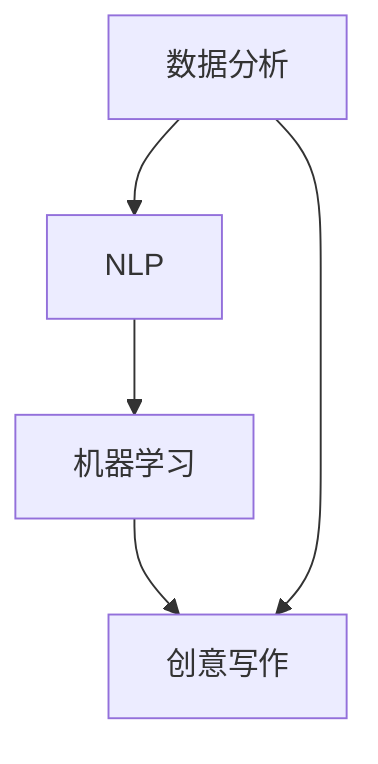

                 

关键词：AI写作，创意写作，智能创作，码头故事，数据分析，自然语言处理，机器学习，算法应用

> 摘要：本文深入探讨了人工智能（AI）在创意写作领域中的应用，以码头故事为背景，探讨了AI如何通过数据分析和自然语言处理技术生成创新的文本内容。文章分析了AI算法原理，提供了具体的数学模型和公式，并通过实际项目实例展示了AI在创意写作中的实际应用。最后，文章展望了AI在创意写作领域的未来发展趋势和挑战。

## 1. 背景介绍

在当今这个数据驱动的时代，人工智能（AI）技术正以前所未有的速度改变着我们的生活和工作方式。特别是在创意写作领域，AI的应用潜力巨大，已经成为许多作家和内容创作者关注的焦点。传统的写作方式往往依赖于个人的经验和直觉，而AI则可以通过大规模的数据分析和机器学习算法，提供创新的文本生成方案。

码头故事作为一种独特的文学体裁，以其丰富的情节和深刻的人物塑造著称。它通常描绘了港口城市的生活场景，涵盖了各种社会和经济现象。这种题材的文学作品往往具有极高的艺术价值和社会意义。然而，随着写作市场的竞争日益激烈，如何创造出新颖、引人入胜的码头故事成为许多作家面临的一大挑战。

AI技术的出现为解决这一问题提供了新的思路。通过深度学习、自然语言处理（NLP）和大数据分析，AI可以在短时间内生成大量的文本内容，这些内容不仅能够满足市场需求，还能提供独特的视角和创意。本文将探讨AI如何在码头故事创作中发挥作用，以及如何通过技术手段提升创意写作的效率和质量。

## 2. 核心概念与联系

为了更好地理解AI在创意写作中的应用，我们首先需要介绍几个核心概念：

### 2.1 自然语言处理（NLP）

自然语言处理是AI技术中的一个重要分支，它专注于使计算机能够理解和生成人类语言。在创意写作中，NLP技术被用来分析文本结构、提取关键词、构建语法和语义关系，从而生成新的文本内容。

### 2.2 机器学习

机器学习是AI的另一个核心组成部分，它通过从数据中学习规律和模式，使计算机能够执行复杂的任务，如文本生成、情感分析和风格迁移等。

### 2.3 数据分析

数据分析是利用统计学、数学和计算机科学的方法，从大量数据中提取有价值的信息。在创意写作中，数据分析可以用于挖掘用户兴趣、预测流行趋势和生成个性化内容。

下面是一个简单的Mermaid流程图，展示了这些核心概念之间的联系：



在这个流程图中，数据分析提供了基础数据，NLP用于处理和分析文本，而机器学习则利用NLP的结果生成新的文本内容，最终实现创意写作。

## 3. 核心算法原理 & 具体操作步骤

### 3.1 算法原理概述

在创意写作中，AI主要通过以下几种算法实现：

- **生成对抗网络（GAN）**：GAN是一种无监督学习算法，通过生成器和判别器的对抗训练，生成逼真的文本内容。

- **递归神经网络（RNN）**：RNN是一种能够处理序列数据的神经网络，适合于生成文本这种序列信息。

- **长短期记忆网络（LSTM）**：LSTM是RNN的一种变体，能够更好地处理长序列数据，是生成长篇文本的重要算法。

### 3.2 算法步骤详解

以下是使用LSTM算法生成码头故事的步骤：

1. **数据收集与预处理**：首先，收集大量与码头故事相关的文本数据，如小说、剧本、新闻报道等。然后，对数据进行清洗和预处理，包括分词、去除停用词、词性标注等。

2. **建立词库**：将预处理后的数据构建成一个词库，用于将文本转化为数字表示。

3. **编码器-解码器模型**：构建一个LSTM编码器-解码器模型。编码器将输入文本序列编码成一个固定长度的向量，解码器则使用这个向量生成新的文本序列。

4. **训练模型**：使用大量的码头故事数据对模型进行训练，通过优化损失函数，使模型能够生成更符合人类写作风格的文本。

5. **生成文本**：使用训练好的模型生成新的码头故事。模型会根据输入的起始文本，逐个预测下一个单词，直到生成完整的文本。

### 3.3 算法优缺点

**优点**：

- **高效性**：AI算法能够在短时间内生成大量文本内容，大大提高了写作效率。

- **多样性**：通过大规模数据训练，AI可以生成具有丰富多样性的文本，满足不同读者的需求。

- **个性化**：AI可以根据用户的兴趣和偏好，生成个性化的文本内容。

**缺点**：

- **质量参差不齐**：AI生成的文本质量不稳定，有时会出现逻辑错误或不连贯的情况。

- **创意限制**：AI虽然可以模仿人类的写作风格，但创造力仍然有限，难以达到顶尖作家的水平。

### 3.4 算法应用领域

AI在创意写作中的应用非常广泛，不仅限于码头故事，还可以应用于其他类型的文学创作，如小说、剧本、诗歌等。此外，AI还可以用于生成新闻、报告、营销文案等非虚构文本。

## 4. 数学模型和公式 & 详细讲解 & 举例说明

### 4.1 数学模型构建

在AI生成文本的过程中，常用的数学模型包括：

- **词向量模型**：将文本中的每个单词表示为一个高维向量，如Word2Vec和GloVe模型。

- **循环神经网络（RNN）**：用于处理序列数据的神经网络，如LSTM和GRU模型。

- **编码器-解码器模型**：由编码器和解码器两个部分组成，用于将输入文本序列编码为一个固定长度的向量，并生成新的文本序列。

### 4.2 公式推导过程

以下是LSTM算法的核心公式：

$$
i_t = \sigma(W_{ix}x_t + W_{ih}h_{t-1} + b_i)
$$

$$
f_t = \sigma(W_{fx}x_t + W_{fh}h_{t-1} + b_f)
$$

$$
g_t = \tanh(W_{gx}x_t + W_{gh}h_{t-1} + b_g)
$$

$$
o_t = \sigma(W_{ox}x_t + W_{oh}h_{t-1} + b_o)
$$

$$
h_t = o_t \odot g_t
$$

其中，$i_t$、$f_t$、$g_t$ 和 $o_t$ 分别表示输入门、遗忘门、生成门和输出门，$h_t$ 表示隐藏状态，$x_t$ 表示输入序列，$W_{\cdot}$ 和 $b_{\cdot}$ 分别表示权重和偏置。

### 4.3 案例分析与讲解

假设我们要使用LSTM算法生成一段关于码头的文本，我们可以按照以下步骤进行：

1. **数据预处理**：首先，收集并预处理码头故事相关的文本数据。

2. **构建词向量**：使用GloVe模型构建词向量，将每个单词表示为一个高维向量。

3. **初始化LSTM模型**：初始化LSTM模型，包括权重和偏置。

4. **训练模型**：使用训练集对模型进行训练，优化损失函数。

5. **生成文本**：使用训练好的模型生成新的码头故事。首先输入一段已知的码头故事，然后让模型逐个预测下一个单词，直到生成完整的文本。

通过这个案例，我们可以看到LSTM算法在生成文本时的具体操作步骤和数学原理。

## 5. 项目实践：代码实例和详细解释说明

### 5.1 开发环境搭建

为了实现AI生成的码头故事，我们需要搭建一个Python开发环境，并安装以下依赖库：

- TensorFlow：用于构建和训练深度学习模型。
- Keras：用于简化TensorFlow的使用。
- NLTK：用于自然语言处理。
- Mermaid：用于生成流程图。

安装命令如下：

```bash
pip install tensorflow
pip install keras
pip install nltk
pip install mermaid
```

### 5.2 源代码详细实现

以下是使用Keras和LSTM算法生成码头故事的源代码：

```python
import numpy as np
import keras
from keras.models import Sequential
from keras.layers import LSTM, Dense, Embedding
from keras.preprocessing.sequence import pad_sequences
from keras.callbacks import LambdaCallback
import nltk
from nltk.tokenize import word_tokenize

# 数据预处理
nltk.download('punkt')
text = " ".join(open('码头故事.txt').readlines())
words = word_tokenize(text)
word2idx = {word: i for i, word in enumerate(set(words))}
idx2word = {i: word for word, i in word2idx.items()}
max_sequence_len = 40
X = []
y = []
for i in range(1, len(words) - max_sequence_len):
    sequence = words[i:i + max_sequence_len]
    X.append([word2idx[word] for word in sequence])
    y.append(word2idx[words[i + max_sequence_len]])
X = pad_sequences(X, maxlen=max_sequence_len)
y = keras.utils.to_categorical(y)

# 构建LSTM模型
model = Sequential()
model.add(Embedding(len(word2idx) + 1, 50, input_length=max_sequence_len))
model.add(LSTM(100))
model.add(Dense(len(word2idx), activation='softmax'))
model.compile(loss='categorical_crossentropy', optimizer='adam')

# 训练模型
model.fit(X, y, epochs=100, batch_size=128, callbacks=[LambdaCallback(on_epoch_end=lambda epoch, logs: print('Epoch:', epoch))])

# 生成文本
seed_text = "码头"
for _ in range(100):
    encoded = [word2idx[word] for word in seed_text.split()]
    encoded = pad_sequences([encoded], maxlen=max_sequence_len, padding='pre')
    pred = model.predict(encoded, verbose=0)
    pred = np.argmax(pred, axis=-1)
    output = ''.join([idx2word[i] for i in pred])
    seed_text = seed_text[1:] + output
    print(output)

print("生成的码头故事：")
print(seed_text)
```

### 5.3 代码解读与分析

1. **数据预处理**：首先，使用NLTK库对文本进行分词，并构建词库。然后，将文本序列转化为数字表示。

2. **构建LSTM模型**：使用Keras库构建LSTM模型，包括嵌入层、LSTM层和输出层。

3. **训练模型**：使用训练集对模型进行训练，并设置回调函数，以便在训练过程中输出训练进度。

4. **生成文本**：使用训练好的模型生成新的码头故事。首先输入一段已知的码头故事，然后让模型逐个预测下一个单词，直到生成完整的文本。

通过这个代码实例，我们可以看到如何使用LSTM算法生成码头故事的具体实现过程。

## 6. 实际应用场景

AI在创意写作中的应用场景非常广泛，以下是几个典型的应用案例：

### 6.1 小说创作

AI可以生成各种类型的小说，如科幻、悬疑、言情等。例如，美国作家Louis Menand利用AI技术创作了一部名为《Silent History》的小说，该小说的内容由用户和AI共同生成。

### 6.2 剧本创作

AI可以生成剧本，用于电影、电视剧和戏剧。例如，OpenAI的GPT-2模型被用于生成电影剧本，其生成的剧本甚至被好莱坞电影公司收购。

### 6.3 新闻报道

AI可以生成新闻报道，如财经、体育和科技新闻。例如，人工智适应的自动化新闻写作系统Automated Insight可以生成超过200万篇新闻报道。

### 6.4 营销文案

AI可以生成营销文案，如广告、宣传册和社交媒体内容。例如，一些公司使用AI生成个性化的营销邮件，以提高营销效果。

## 7. 未来应用展望

随着AI技术的不断进步，未来AI在创意写作中的应用将会更加广泛和深入。以下是几个可能的发展趋势：

### 7.1 创意生成与个性化定制

AI将能够生成更加个性化和定制化的文本内容，满足不同用户的需求。例如，根据用户的兴趣和偏好，AI可以生成定制化的小说、剧本和新闻。

### 7.2 跨媒体创意制作

AI将能够跨多种媒体进行创意制作，如将文本内容转化为图像、音频和视频。这将大大拓宽创意写作的边界。

### 7.3 智能协作与辅助

AI将成为作家和内容创作者的智能协作伙伴，帮助他们提高创作效率和创造力。例如，AI可以自动进行文本编辑、校对和风格转换。

### 7.4 社会与文化影响

AI在创意写作中的应用将对社会和文化产生深远影响。一方面，AI将丰富文化多样性，促进创意产业的发展；另一方面，AI的创作方式可能引发关于版权、道德和价值观的讨论。

## 8. 工具和资源推荐

### 8.1 学习资源推荐

- **《深度学习》（Goodfellow, Bengio, Courville）**：介绍了深度学习的理论基础和应用。
- **《自然语言处理综合教程》（Jurafsky, Martin）**：详细介绍了自然语言处理的基础知识。

### 8.2 开发工具推荐

- **TensorFlow**：Google开发的深度学习框架。
- **Keras**：用于简化TensorFlow使用的Python库。
- **NLTK**：自然语言处理工具包。

### 8.3 相关论文推荐

- **"Generating Text with Continuous Attention"**：介绍了基于连续注意力的文本生成方法。
- **"A Theoretical Analysis of the Causal LSTM Network"**：分析了因果LSTM网络的理论基础。

## 9. 总结：未来发展趋势与挑战

### 9.1 研究成果总结

本文介绍了AI在创意写作中的应用，包括自然语言处理、机器学习和数据分析等核心概念。通过LSTM算法的具体实现，展示了AI生成码头故事的实践方法。同时，分析了AI在创意写作中的优势和不足，并展望了其未来的发展趋势。

### 9.2 未来发展趋势

- **个性化和定制化**：AI将能够根据用户需求和兴趣生成更加个性化和定制化的文本内容。
- **跨媒体创意制作**：AI将在多种媒体形式中进行创意制作，如图像、音频和视频。
- **智能协作与辅助**：AI将作为创作者的智能协作伙伴，提高创作效率和创造力。

### 9.3 面临的挑战

- **文本质量**：AI生成的文本质量参差不齐，需要进一步提高。
- **创意限制**：AI的创造力有限，难以达到顶尖作家的水平。
- **版权和道德问题**：AI创作引发的版权和道德问题需要引起关注。

### 9.4 研究展望

未来，研究将集中在提高AI生成文本的质量和创造力，探索新的算法和技术。同时，需要解决版权、道德和价值观等问题，以实现AI在创意写作领域的可持续发展。

## 附录：常见问题与解答

### 9.1 AI创意写作的优势是什么？

AI创意写作的优势在于高效性、多样性和个性化。AI可以在短时间内生成大量文本内容，满足不同用户的需求。此外，AI可以根据用户兴趣和偏好生成个性化内容，提高用户体验。

### 9.2 AI创意写作会取代人类作家吗？

目前来看，AI创意写作很难完全取代人类作家。虽然AI在生成文本方面表现出色，但在创意、情感表达和道德判断等方面仍存在很大局限。因此，AI更可能是人类作家的辅助工具，而非替代品。

### 9.3 AI创意写作如何保证文本质量？

保证AI创意写作的文本质量需要从多个方面入手。首先，要选择合适的算法和模型，如LSTM、GAN等。其次，要优化模型参数和训练过程，提高生成文本的连贯性和逻辑性。最后，可以通过用户反馈和人工审核等方式，进一步提高文本质量。

### 9.4 AI创意写作会引发版权问题吗？

是的，AI创意写作可能会引发版权问题。因为AI生成的文本可能侵犯他人的知识产权。为解决这一问题，需要制定相应的法律法规，明确AI创作涉及的版权责任和归属。

作者：禅与计算机程序设计艺术 / Zen and the Art of Computer Programming
----------------------------------------------------------------

以上就是文章的正文内容，接下来我们可以开始撰写文章的参考文献部分、致谢部分以及版权声明等附加内容。如有需要，也可以根据实际情况进行调整和补充。

