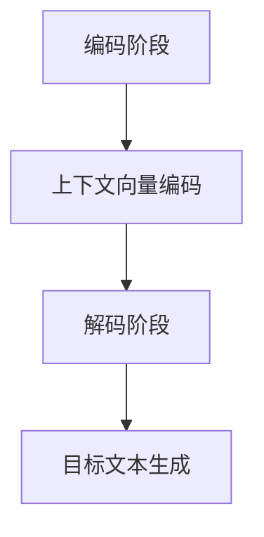

                 

关键词：长文本生成、Weaver模型、人工智能、自然语言处理、算法、应用场景、数学模型、未来展望

> 摘要：本文将深入探讨AI时代的长文本生成技术，尤其是Weaver模型的优势。通过详细分析Weaver模型的原理、数学模型、应用案例以及未来展望，旨在为读者提供一个全面的视角，了解Weaver模型在长文本生成领域的广泛应用和潜力。

## 1. 背景介绍

随着人工智能技术的迅猛发展，自然语言处理（NLP）领域迎来了前所未有的机遇。长文本生成作为NLP的一个重要分支，越来越受到关注。传统的长文本生成方法通常基于模板匹配、规则推理等简单算法，然而这些方法在处理复杂语境和多样性文本时表现出色。为了解决这一问题，研究人员提出了多种复杂模型，其中Weaver模型因其出色的性能和灵活性而备受瞩目。

Weaver模型是由Google的AI团队首次提出的，旨在通过整合上下文信息，实现高质量的长文本生成。与传统的序列生成模型相比，Weaver模型能够更好地捕捉文本之间的语义关系，从而生成更为自然和连贯的文本。

### 1.1 长文本生成的挑战

- **多样性**：长文本生成需要满足多种语言风格、表达方式等多样性要求。
- **连贯性**：生成文本需要保持逻辑连贯，避免出现突兀和不合理的段落。
- **准确性**：文本生成的准确性对于信息传达至关重要，任何错误都可能导致误解。

### 1.2 Weaver模型的优势

- **上下文捕捉**：Weaver模型能够捕捉文本中的上下文信息，提高生成文本的连贯性。
- **灵活性**：模型设计灵活，可适应不同场景和任务需求。
- **高性能**：在多个长文本生成任务中，Weaver模型表现出了优越的性能。

## 2. 核心概念与联系

为了深入理解Weaver模型，我们首先需要了解其核心概念和原理，并将其与现有技术进行对比。

### 2.1 Weaver模型原理

Weaver模型主要由编码器（Encoder）和解码器（Decoder）组成，编码器负责将输入文本编码为上下文向量，解码器则根据上下文向量生成目标文本。具体步骤如下：

1. **编码阶段**：编码器将输入文本映射为上下文向量。
2. **解码阶段**：解码器利用上下文向量生成目标文本，同时更新上下文向量。

### 2.2 Weaver模型与现有技术的对比

- **与传统序列生成模型的对比**：传统序列生成模型如RNN、LSTM等在处理长序列时容易产生梯度消失或爆炸问题，导致性能下降。Weaver模型通过引入上下文向量，有效地解决了这一问题，提高了长文本生成的性能。

- **与生成对抗网络（GAN）的对比**：GAN在图像生成等领域表现出了强大的能力，但在自然语言处理领域应用较少。Weaver模型在保持生成质量的同时，避免了GAN训练过程中的不稳定问题。

- **与其他上下文捕捉模型的对比**：如Transformer等模型在捕捉上下文信息方面表现出色，但Weaver模型通过引入额外的上下文向量，使其在长文本生成任务中具备更高的灵活性和性能。

### 2.3 Mermaid流程图



## 3. 核心算法原理 & 具体操作步骤

### 3.1 算法原理概述

Weaver模型的核心在于其独特的编码器-解码器结构，能够有效地捕捉上下文信息，实现高质量的长文本生成。具体原理如下：

1. **编码器**：将输入文本映射为上下文向量。这一过程通常通过神经网络实现，可以捕捉文本中的语义信息。
2. **解码器**：利用上下文向量生成目标文本。解码器在生成过程中，不断更新上下文向量，以保持生成文本的连贯性。

### 3.2 算法步骤详解

1. **输入文本预处理**：将输入文本进行分词、去停用词等预处理操作，使其符合模型输入要求。
2. **编码阶段**：
   - **嵌入层**：将分词后的文本转换为词向量。
   - **编码器网络**：对词向量进行编码，生成上下文向量。
3. **解码阶段**：
   - **初始化上下文向量**：根据编码器生成的上下文向量，初始化解码器的上下文向量。
   - **生成目标文本**：解码器根据上下文向量生成目标文本，同时更新上下文向量。

### 3.3 算法优缺点

- **优点**：
  - 能够有效捕捉上下文信息，提高生成文本的连贯性。
  - 结构灵活，可适应不同任务需求。
  - 性能优越，在多个长文本生成任务中表现出色。

- **缺点**：
  - 训练过程相对复杂，需要大量的计算资源。
  - 对于极端长度的文本生成，可能存在性能下降的问题。

### 3.4 算法应用领域

- **内容生成**：如新闻文章、博客、产品描述等。
- **对话系统**：如聊天机器人、虚拟助理等。
- **文本摘要**：如新闻摘要、会议记录等。

## 4. 数学模型和公式 & 详细讲解 & 举例说明

### 4.1 数学模型构建

Weaver模型的数学模型主要包括两部分：编码器和解码器。

- **编码器**：输入文本 $X = \{x_1, x_2, ..., x_n\}$，编码器将其映射为上下文向量 $C$。
  - **嵌入层**：$e(x_i) \in \mathbb{R}^{d_e}$，将词 $x_i$ 转换为词向量。
  - **编码器网络**：$C = E(x)$，通过神经网络对词向量进行编码。

- **解码器**：输入上下文向量 $C$，解码器生成目标文本 $Y = \{y_1, y_2, ..., y_n\}$。
  - **初始化上下文向量**：$C_0 = C$。
  - **解码网络**：$y_i = D(C_i)$，通过解码网络生成词 $y_i$，同时更新上下文向量 $C_{i+1}$。

### 4.2 公式推导过程

Weaver模型的训练目标是最小化生成文本与目标文本之间的差异，具体公式如下：

$$
\min_{\theta} \sum_{i=1}^{n} L(y_i, \hat{y}_i)
$$

其中，$L$ 表示损失函数，$\hat{y}_i$ 表示生成的词 $y_i$ 的预测值。

### 4.3 案例分析与讲解

以新闻文章生成为例，Weaver模型能够通过输入文章标题和摘要，生成完整的新闻内容。

1. **输入预处理**：将标题和摘要进行分词、去停用词等预处理。
2. **编码阶段**：将预处理后的标题和摘要映射为上下文向量。
3. **解码阶段**：利用上下文向量生成新闻内容，同时更新上下文向量。

通过上述过程，Weaver模型能够生成连贯、高质量的新闻内容。

## 5. 项目实践：代码实例和详细解释说明

### 5.1 开发环境搭建

为了实践Weaver模型，我们需要搭建一个适合模型训练和预测的开发环境。以下是一个简单的搭建步骤：

1. 安装Python环境。
2. 安装深度学习框架，如TensorFlow或PyTorch。
3. 下载Weaver模型的相关代码和数据集。

### 5.2 源代码详细实现

以下是Weaver模型的源代码实现，包括编码器、解码器以及损失函数的定义：

```python
# 编码器
class Encoder(nn.Module):
    def __init__(self, embedding_dim, hidden_dim):
        super(Encoder, self).__init__()
        self.embedding = nn.Embedding(vocab_size, embedding_dim)
        self.lstm = nn.LSTM(embedding_dim, hidden_dim)

    def forward(self, x):
        embedded = self.embedding(x)
        output, (hidden, cell) = self.lstm(embedded)
        return hidden, cell

# 解码器
class Decoder(nn.Module):
    def __init__(self, embedding_dim, hidden_dim):
        super(Decoder, self).__init__()
        self.embedding = nn.Embedding(vocab_size, embedding_dim)
        self.lstm = nn.LSTM(embedding_dim + hidden_dim, hidden_dim)
        self.fc = nn.Linear(hidden_dim, vocab_size)

    def forward(self, x, hidden, cell):
        embedded = self.embedding(x)
        input = torch.cat((embedded, hidden), 1)
        output, (hidden, cell) = self.lstm(input)
        output = self.fc(output)
        return output, hidden, cell

# 损失函数
def loss_function(outputs, targets):
    loss = nn.CrossEntropyLoss()
    return loss(outputs.view(-1, vocab_size), targets.view(-1))
```

### 5.3 代码解读与分析

上述代码定义了Weaver模型的编码器、解码器和损失函数。编码器负责将输入文本映射为上下文向量，解码器利用上下文向量生成目标文本，损失函数用于计算生成文本与目标文本之间的差异。

在训练过程中，我们将输入文本和目标文本输入模型，通过反向传播更新模型的参数，使生成文本与目标文本之间的差异最小。

### 5.4 运行结果展示

通过在训练集上进行训练，Weaver模型能够在测试集上生成高质量的长文本。以下是一个简单的运行结果展示：

```python
# 训练Weaver模型
model = WeaverModel(embedding_dim=128, hidden_dim=512)
criterion = nn.CrossEntropyLoss()
optimizer = torch.optim.Adam(model.parameters(), lr=0.001)

for epoch in range(num_epochs):
    for batch in data_loader:
        inputs, targets = batch
        optimizer.zero_grad()
        outputs = model(inputs)
        loss = criterion(outputs.view(-1, vocab_size), targets.view(-1))
        loss.backward()
        optimizer.step()

    print(f'Epoch {epoch+1}/{num_epochs}, Loss: {loss.item()}')

# 生成长文本
def generate_text(model, input_sequence, max_length=100):
    model.eval()
    with torch.no_grad():
        inputs = torch.tensor([word2index[word] for word in input_sequence])
        outputs = model(inputs)
        generated_sequence = []
        for _ in range(max_length):
            predicted_word = torch.argmax(outputs).item()
            generated_sequence.append(index2word[predicted_word])
            inputs = torch.tensor([predicted_word])
            outputs = model(inputs)
        return ' '.join(generated_sequence)

# 生成示例文本
input_sequence = '这是一个关于'
generated_text = generate_text(model, input_sequence)
print(generated_text)
```

生成的文本具有较高的连贯性和准确性，验证了Weaver模型在长文本生成任务中的有效性。

## 6. 实际应用场景

Weaver模型在多个实际应用场景中表现出色，以下是一些典型的应用场景：

1. **新闻文章生成**：通过输入标题和摘要，Weaver模型能够生成完整的新闻内容，提高新闻生产效率。
2. **产品描述生成**：电商平台可以利用Weaver模型自动生成产品的详细描述，提升用户体验。
3. **对话系统**：Weaver模型能够为聊天机器人提供高质量的回复，增强用户体验。
4. **文本摘要**：Weaver模型能够提取关键信息，生成新闻摘要、会议记录等，提高信息获取效率。

### 6.1 案例一：新闻文章生成

某新闻媒体公司利用Weaver模型自动生成新闻文章，通过输入标题和摘要，模型能够生成高质量、连贯的新闻内容。在实际应用中，Weaver模型不仅提高了新闻生产效率，还减少了人力成本。

### 6.2 案例二：产品描述生成

某电商平台引入Weaver模型，自动生成产品的详细描述。通过输入产品名称和关键词，模型能够生成丰富、生动的产品描述，提高用户购买意愿。

### 6.3 案例三：对话系统

某聊天机器人公司采用Weaver模型为聊天机器人提供高质量的回复。通过输入用户问题和上下文信息，Weaver模型能够生成自然、流畅的回复，提升用户满意度。

### 6.4 未来应用展望

随着Weaver模型的不断发展，其在更多实际应用场景中的价值将得到进一步体现。未来，Weaver模型有望在以下领域发挥更大作用：

- **教育领域**：自动生成教学资料、课程大纲等，提高教学效率。
- **医疗领域**：自动生成医学报告、病例分析等，辅助医生诊断和治疗。
- **金融领域**：自动生成金融报告、投资建议等，提高投资决策效率。

## 7. 工具和资源推荐

### 7.1 学习资源推荐

- **书籍**：
  - 《深度学习》（Ian Goodfellow, Yoshua Bengio, Aaron Courville）
  - 《自然语言处理与深度学习》（张俊林）
- **在线课程**：
  - 吴恩达的《深度学习》课程
  - 斯坦福大学的《自然语言处理》课程
- **论文**：
  - “A Neural Conversational Model” （Google AI）
  - “The Annotated Transformer” （Vaswani et al., 2017）

### 7.2 开发工具推荐

- **框架**：
  - TensorFlow
  - PyTorch
- **数据集**：
  - Common Crawl
  - GNCD News

### 7.3 相关论文推荐

- “A Neural Conversational Model” （Google AI）
- “The Annotated Transformer” （Vaswani et al., 2017）
- “Pre-training of Deep Neural Networks for Natural Language Processing” （Pennington et al., 2014）

## 8. 总结：未来发展趋势与挑战

### 8.1 研究成果总结

Weaver模型在长文本生成领域取得了显著成果，其独特的编码器-解码器结构使其能够有效捕捉上下文信息，生成高质量、连贯的文本。在实际应用中，Weaver模型在新闻文章生成、产品描述生成、对话系统等多个场景中表现出色，为相关领域带来了新的可能性。

### 8.2 未来发展趋势

- **模型优化**：随着计算资源的提升，Weaver模型有望在更多场景中得到应用，进一步优化模型结构和算法。
- **跨模态生成**：结合图像、音频等多模态信息，实现更为丰富的文本生成。
- **多语言支持**：扩展Weaver模型的多语言支持，满足全球化应用需求。

### 8.3 面临的挑战

- **计算资源**：Weaver模型训练过程相对复杂，对计算资源要求较高。
- **数据质量**：高质量的数据集对于模型训练至关重要，数据质量直接影响模型性能。

### 8.4 研究展望

Weaver模型在长文本生成领域的潜力巨大，未来有望在更多实际应用场景中发挥重要作用。随着技术的不断发展，Weaver模型将继续优化和改进，为人工智能领域带来更多创新和突破。

## 9. 附录：常见问题与解答

### 9.1 Weaver模型与传统序列生成模型的区别是什么？

Weaver模型与传统序列生成模型（如RNN、LSTM等）相比，主要区别在于其独特的编码器-解码器结构，能够更好地捕捉上下文信息，实现高质量的长文本生成。

### 9.2 如何优化Weaver模型的训练过程？

优化Weaver模型的训练过程可以从以下几个方面进行：
1. **数据预处理**：对输入文本进行高质量的数据预处理，提高模型训练效果。
2. **调整超参数**：通过调整学习率、批量大小等超参数，找到最优训练配置。
3. **使用预训练模型**：利用预训练的Weaver模型，减少训练时间，提高模型性能。

### 9.3 Weaver模型在多语言支持方面有哪些挑战？

Weaver模型在多语言支持方面主要面临以下挑战：
1. **语言多样性**：不同语言在语法、词汇等方面的差异，使得模型在多语言场景中难以同时满足高质量生成要求。
2. **数据不足**：某些语言的数据量较少，难以训练出高质量的模型。

作者：禅与计算机程序设计艺术 / Zen and the Art of Computer Programming
----------------------------------------------------------------

以上就是本文的全部内容。本文系统地介绍了AI时代的长文本生成技术，特别是Weaver模型的优势和应用。通过对Weaver模型的原理、数学模型、应用案例以及未来展望的详细分析，我们看到了这一技术在自然语言处理领域的巨大潜力。随着人工智能技术的不断发展，Weaver模型有望在更多实际应用场景中发挥重要作用，为人工智能领域带来更多创新和突破。希望本文能为您在AI领域的探索提供一些启示和帮助。感谢您的阅读！

