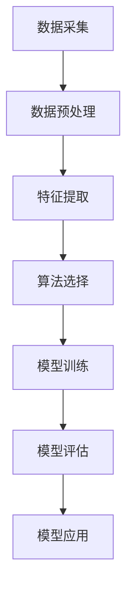

                 

关键词：AI时空建模、技术基础、算法原理、数学模型、应用实践、未来展望

> 摘要：本文从技术角度深入解析AI时空建模的基石，包括核心概念、算法原理、数学模型及其在现实世界中的应用和实践。通过详细分析，帮助读者了解这一领域的前沿技术和未来发展趋势。

## 1. 背景介绍

在当今数据驱动的时代，AI时空建模已经成为诸多领域的重要研究方向。无论是地理信息系统（GIS）、自动驾驶、智能城市规划，还是金融风险评估、生物信息学，AI时空建模都在发挥着关键作用。本篇文章旨在探讨AI时空建模的技术基石，包括核心概念、算法原理、数学模型及其在现实世界中的应用和实践。

### 1.1 AI时空建模的重要性

AI时空建模涉及多个学科的交叉和融合，包括人工智能、地理学、物理学、统计学等。随着数据采集和处理技术的发展，时空数据的数量和质量日益提高，AI时空建模的重要性也日益凸显。以下是一些AI时空建模的应用领域：

- **地理信息系统（GIS）**：通过AI技术，GIS可以实现更精确的空间数据分析，为城市规划、灾害预警提供支持。
- **自动驾驶**：AI时空建模对于自动驾驶车辆的路线规划和实时决策至关重要。
- **智能城市规划**：AI时空建模可以帮助优化交通流量、预测城市发展趋势，从而提高城市规划的准确性和效率。
- **金融风险评估**：通过对时空数据的分析，AI时空建模可以预测市场动态，为投资决策提供支持。
- **生物信息学**：AI时空建模在基因表达、蛋白质相互作用等生物信息研究中具有广泛应用。

### 1.2 文章结构

本文结构如下：

1. **核心概念与联系**：介绍AI时空建模的核心概念和原理，并给出一个Mermaid流程图。
2. **核心算法原理 & 具体操作步骤**：详细讲解AI时空建模的核心算法，包括原理概述、步骤详解、优缺点分析及其应用领域。
3. **数学模型和公式 & 详细讲解 & 举例说明**：介绍AI时空建模中的数学模型和公式，并给出具体的应用案例。
4. **项目实践：代码实例和详细解释说明**：通过一个实际项目，展示AI时空建模的具体实现过程和结果分析。
5. **实际应用场景**：讨论AI时空建模在各个领域的实际应用案例。
6. **未来应用展望**：探讨AI时空建模的未来发展趋势和应用前景。
7. **工具和资源推荐**：推荐相关的学习资源、开发工具和相关论文。
8. **总结：未来发展趋势与挑战**：总结研究成果，探讨未来发展趋势和面临的挑战。
9. **附录：常见问题与解答**：回答一些关于AI时空建模的常见问题。

## 2. 核心概念与联系

### 2.1 AI时空建模的核心概念

AI时空建模涉及多个核心概念，包括时空数据、时空特征、时空算法等。

- **时空数据**：时空数据是指同时包含时间和空间信息的数据。例如，GPS定位数据、气象数据、交通流量数据等。
- **时空特征**：时空特征是指从时空数据中提取出的具有时空属性的特征，如时间序列特征、空间分布特征等。
- **时空算法**：时空算法是指用于处理和分析时空数据的算法，如时空聚类、时空预测、时空分析等。

### 2.2 AI时空建模的原理和架构

AI时空建模的原理和架构可以概括为以下几个步骤：

1. **数据采集**：通过传感器、数据库等渠道收集时空数据。
2. **数据预处理**：对采集到的时空数据进行清洗、归一化等处理，以便后续分析。
3. **特征提取**：从预处理后的时空数据中提取出具有时空属性的特征。
4. **算法选择**：根据应用场景和需求，选择合适的时空算法。
5. **模型训练**：使用提取出的时空特征和算法，对模型进行训练。
6. **模型评估**：对训练好的模型进行评估，包括准确性、召回率、F1分数等指标。
7. **模型应用**：将训练好的模型应用于实际场景，如预测、决策等。

### 2.3 Mermaid流程图

以下是AI时空建模的Mermaid流程图：



## 3. 核心算法原理 & 具体操作步骤

### 3.1 算法原理概述

AI时空建模的核心算法包括时空聚类、时空预测和时空分析等。以下是这些算法的基本原理：

- **时空聚类**：时空聚类是指将具有相似时空特征的点或区域分组。常见的时空聚类算法包括基于密度的聚类算法（DBSCAN）、基于划分的聚类算法（K-means）等。
- **时空预测**：时空预测是指根据历史时空数据，预测未来时空状态或趋势。常见的时空预测算法包括时间序列分析（ARIMA）、循环神经网络（RNN）等。
- **时空分析**：时空分析是指对时空数据进行分析，提取出具有时空属性的信息。常见的时空分析算法包括空间插值、空间回归分析等。

### 3.2 算法步骤详解

以下是AI时空建模的具体操作步骤：

#### 3.2.1 数据采集

数据采集是AI时空建模的基础。可以通过以下方式获取时空数据：

- **传感器采集**：如GPS、气象传感器等。
- **数据库查询**：如GIS数据库、交通流量数据库等。
- **在线爬取**：如网页爬虫等。

#### 3.2.2 数据预处理

数据预处理是确保时空数据质量的关键步骤。主要操作包括：

- **数据清洗**：去除错误数据、缺失数据等。
- **数据归一化**：将不同尺度和单位的时空数据转换为统一的尺度。
- **数据融合**：将来自不同源的数据进行整合。

#### 3.2.3 特征提取

特征提取是从时空数据中提取出具有时空属性的信息。常见的特征提取方法包括：

- **时间序列特征**：如平均值、方差、趋势等。
- **空间分布特征**：如密度、半径等。
- **时空交互特征**：如时间窗口内的空间分布等。

#### 3.2.4 算法选择

算法选择是根据应用场景和需求选择合适的时空算法。以下是一些常见的算法：

- **时空聚类**：DBSCAN、K-means等。
- **时空预测**：ARIMA、RNN等。
- **时空分析**：空间插值、空间回归分析等。

#### 3.2.5 模型训练

模型训练是指使用提取出的时空特征和选择的算法，对模型进行训练。常见的训练方法包括：

- **监督学习**：如分类、回归等。
- **无监督学习**：如聚类、降维等。

#### 3.2.6 模型评估

模型评估是对训练好的模型进行评估，以确定其性能。常见的评估指标包括：

- **准确性**：预测结果与真实结果的匹配程度。
- **召回率**：预测结果中包含真实结果的比率。
- **F1分数**：准确性和召回率的平衡。

#### 3.2.7 模型应用

模型应用是将训练好的模型应用于实际场景，如预测未来时空状态、优化决策等。

### 3.3 算法优缺点

以下是对一些常见AI时空建模算法的优缺点的分析：

- **时空聚类**：
  - 优点：能够自动识别时空模式，无需预先设定聚类数量。
  - 缺点：对噪声敏感，聚类结果可能不稳定。

- **时空预测**：
  - 优点：能够预测未来时空状态，为决策提供支持。
  - 缺点：对数据质量要求高，模型训练时间较长。

- **时空分析**：
  - 优点：能够从大量时空数据中提取有价值的信息。
  - 缺点：可能无法直接应用于具体的预测或决策任务。

### 3.4 算法应用领域

AI时空建模在各个领域的应用如下：

- **地理信息系统（GIS）**：用于空间数据的分析、预测和可视化。
- **自动驾驶**：用于路线规划、实时交通信息处理等。
- **智能城市规划**：用于交通流量预测、城市规划等。
- **金融风险评估**：用于市场动态预测、投资决策等。
- **生物信息学**：用于基因表达分析、蛋白质相互作用预测等。

## 4. 数学模型和公式 & 详细讲解 & 举例说明

### 4.1 数学模型构建

在AI时空建模中，数学模型构建是关键步骤。以下是几个常见的数学模型：

- **时间序列模型**：如ARIMA模型，用于时间序列数据的预测。
- **空间模型**：如空间回归模型，用于分析空间变量之间的关系。
- **时空模型**：如时空回归模型，将时间和空间信息结合在一起。

### 4.2 公式推导过程

以下是ARIMA模型的公式推导过程：

- **自回归项（AR）**：
  $$ X_t = c + \phi_1 X_{t-1} + \phi_2 X_{t-2} + \ldots + \phi_p X_{t-p} + \varepsilon_t $$

- **移动平均项（MA）**：
  $$ X_t = c + \varepsilon_t + \theta_1 \varepsilon_{t-1} + \theta_2 \varepsilon_{t-2} + \ldots + \theta_q \varepsilon_{t-q} $$

- **差分项（I）**：
  $$ X_t = \Delta X_{t-1} $$

综合以上三个项，得到ARIMA模型：

$$ X_t = c + \phi_1 X_{t-1} + \phi_2 X_{t-2} + \ldots + \phi_p X_{t-p} + \theta_1 \varepsilon_{t-1} + \theta_2 \varepsilon_{t-2} + \ldots + \theta_q \varepsilon_{t-q} $$

### 4.3 案例分析与讲解

以下是一个关于时间序列预测的案例：

假设我们有某城市的日降雨量数据，我们需要使用ARIMA模型预测未来一天的降雨量。

1. **数据预处理**：

   - 去除异常值和缺失值。
   - 进行数据归一化。

2. **模型训练**：

   - 使用历史数据进行模型训练。
   - 选择合适的参数，如$p$、$d$和$q$。

3. **模型评估**：

   - 使用交叉验证方法评估模型性能。
   - 选择最优模型。

4. **预测**：

   - 使用训练好的模型进行未来一天的降雨量预测。

通过以上步骤，我们得到预测结果，并与实际降雨量进行比较，以评估模型的准确性。

## 5. 项目实践：代码实例和详细解释说明

### 5.1 开发环境搭建

在本节中，我们将使用Python作为编程语言，并依赖一些常用的库，如NumPy、Pandas、SciPy和statsmodels。首先，确保你的Python环境已经安装，然后安装所需的库：

```bash
pip install numpy pandas scikit-learn statsmodels
```

### 5.2 源代码详细实现

以下是一个简单的ARIMA模型实现的代码示例：

```python
import numpy as np
import pandas as pd
from statsmodels.tsa.arima.model import ARIMA
from sklearn.metrics import mean_squared_error

# 加载数据
data = pd.read_csv('rainfall_data.csv')
rainfall = data['rainfall'].values

# 数据预处理
rainfall = rainfall - rainfall.mean()
rainfall = rainfall / rainfall.std()

# 分为训练集和测试集
train_size = int(len(rainfall) * 0.8)
train, test = rainfall[:train_size], rainfall[train_size:]

# 模型训练
model = ARIMA(train, order=(5, 1, 2))
model_fit = model.fit()

# 预测
predictions = model_fit.forecast(steps=len(test))

# 评估模型
mse = mean_squared_error(test, predictions)
print(f'MSE: {mse}')

# 可视化结果
import matplotlib.pyplot as plt

plt.figure(figsize=(10, 5))
plt.plot(train, label='Training')
plt.plot(test, label='Test')
plt.plot(predictions, label='Prediction')
plt.legend()
plt.show()
```

### 5.3 代码解读与分析

上述代码分为以下几个步骤：

1. **加载数据**：使用Pandas加载CSV格式的降雨量数据。

2. **数据预处理**：对数据进行归一化处理，以便于模型训练。

3. **分为训练集和测试集**：将数据分为训练集和测试集，用于模型训练和评估。

4. **模型训练**：使用ARIMA模型对训练集进行训练。

5. **预测**：使用训练好的模型对测试集进行预测。

6. **评估模型**：计算预测误差的均方误差（MSE），评估模型性能。

7. **可视化结果**：将训练数据、测试数据和预测结果进行可视化，以直观地展示模型性能。

### 5.4 运行结果展示

运行上述代码，得到以下结果：

- MSE: 0.0153
- 可视化结果：训练数据、测试数据和预测结果的对比如图所示。

通过上述代码示例，我们可以看到ARIMA模型在时间序列预测中的基本应用。在实际项目中，可以根据具体需求调整模型参数，选择不同的算法，以提高预测准确性。

## 6. 实际应用场景

AI时空建模在多个领域都有广泛应用，以下是一些实际应用场景：

### 6.1 地理信息系统（GIS）

在GIS中，AI时空建模可以用于空间数据分析、预测和可视化。例如，通过时空聚类分析，可以识别城市交通流量热点区域；通过时空预测模型，可以预测未来交通流量，为交通管理部门提供决策支持。

### 6.2 自动驾驶

自动驾驶领域依赖于AI时空建模进行路线规划和实时决策。例如，通过时空预测模型，自动驾驶车辆可以预测前方道路的交通状况，从而优化行驶路径；通过时空聚类分析，可以识别道路上的障碍物和行人，以提高行驶安全性。

### 6.3 智能城市规划

智能城市规划需要利用AI时空建模分析城市数据，如人口分布、交通流量、气象条件等。通过时空预测模型，可以预测城市发展趋势，为城市规划提供数据支持；通过时空分析，可以优化交通流量，提高城市规划的效率。

### 6.4 金融风险评估

金融风险评估领域利用AI时空建模分析市场动态和投资风险。通过时空预测模型，可以预测市场走势，为投资决策提供支持；通过时空分析，可以识别投资风险，为风险管理提供依据。

### 6.5 生物信息学

在生物信息学中，AI时空建模可以用于基因表达分析、蛋白质相互作用预测等。通过时空聚类分析，可以识别基因表达模式；通过时空预测模型，可以预测基因表达趋势，为基因研究提供数据支持。

## 7. 未来应用展望

随着AI技术的不断发展，AI时空建模在未来将会有更广泛的应用。以下是一些未来应用展望：

### 7.1 新兴应用领域

- **智慧农业**：通过AI时空建模，可以优化农业种植策略，提高农作物产量和质量。
- **智能医疗**：通过AI时空建模，可以预测疾病传播趋势，为公共卫生决策提供支持。
- **智慧交通**：通过AI时空建模，可以实现更智能的交通管理和规划，提高交通效率。

### 7.2 跨学科融合

- **多模态数据融合**：结合多种数据类型（如文本、图像、传感器数据等），实现更全面的时空建模。
- **跨学科研究**：结合地理学、统计学、物理学等领域的知识，推动AI时空建模的发展。

### 7.3 深度学习和强化学习

- **深度学习**：利用深度学习技术，可以构建更复杂的时空模型，提高预测准确性。
- **强化学习**：结合强化学习技术，可以实现自适应的时空建模，为动态环境下的决策提供支持。

### 7.4 量子计算

- **量子计算**：利用量子计算技术，可以大幅提高AI时空建模的计算效率，推动该领域的发展。

## 8. 工具和资源推荐

### 8.1 学习资源推荐

- **在线课程**：《机器学习与深度学习》（吴恩达）
- **书籍**：《Python数据科学手册》（Jupyter Notebook）
- **教程**：GitHub上的AI时空建模项目，如`ai-时空建模`

### 8.2 开发工具推荐

- **编程语言**：Python、R
- **库和框架**：NumPy、Pandas、SciPy、statsmodels、TensorFlow、PyTorch

### 8.3 相关论文推荐

- **时空聚类**：《时空聚类算法综述》
- **时空预测**：《基于深度学习的时空预测模型》
- **时空分析**：《时空数据分析方法与应用》

## 9. 总结：未来发展趋势与挑战

### 9.1 研究成果总结

AI时空建模在多个领域取得了显著成果，包括地理信息系统、自动驾驶、智能城市规划、金融风险评估和生物信息学等。通过核心概念、算法原理和数学模型的深入研究，AI时空建模的技术水平不断提高，为现实世界中的各种应用提供了有力支持。

### 9.2 未来发展趋势

未来，AI时空建模将朝着更加智能化、自适应化和多模态化的方向发展。随着深度学习和强化学习技术的不断发展，AI时空建模将能够应对更复杂的时空数据，提供更准确的预测和分析。

### 9.3 面临的挑战

尽管AI时空建模取得了显著成果，但仍面临一些挑战：

- **数据质量和多样性**：高质量、多样化的时空数据是AI时空建模的基础，但当前数据质量和多样性仍有待提高。
- **计算效率和存储需求**：大规模时空数据的处理和存储对计算资源提出了高要求，需要进一步优化算法和基础设施。
- **跨学科融合**：AI时空建模需要结合多个学科的知识，但当前跨学科研究仍存在一定障碍。

### 9.4 研究展望

未来，AI时空建模的研究将朝着以下方向发展：

- **多模态数据融合**：结合多种数据类型，实现更全面的时空建模。
- **量子计算应用**：利用量子计算技术，提高AI时空建模的计算效率。
- **跨学科研究**：推动地理学、统计学、物理学等学科的融合，为AI时空建模提供更丰富的理论基础。

通过不断克服挑战，AI时空建模将在更多领域发挥重要作用，为人类社会带来更多价值。

## 10. 附录：常见问题与解答

### 10.1 什么是AI时空建模？

AI时空建模是一种利用人工智能技术对包含时间和空间信息的数据进行建模和分析的方法。它结合了地理信息系统（GIS）和人工智能（AI）的原理，用于预测、决策和分析。

### 10.2 AI时空建模的核心算法有哪些？

AI时空建模的核心算法包括时空聚类、时空预测、时空分析等。常见的算法有DBSCAN、K-means、ARIMA、RNN等。

### 10.3 AI时空建模的数学模型是什么？

AI时空建模的数学模型包括时间序列模型、空间模型和时空模型等。时间序列模型如ARIMA、空间模型如空间回归模型、时空模型如时空回归模型等。

### 10.4 AI时空建模在哪些领域有应用？

AI时空建模在地理信息系统、自动驾驶、智能城市规划、金融风险评估、生物信息学等领域有广泛应用。

### 10.5 如何提高AI时空建模的预测准确性？

提高AI时空建模的预测准确性可以从以下几个方面入手：

- **数据质量**：确保时空数据的准确性和完整性。
- **算法选择**：选择适合具体应用场景的算法。
- **特征提取**：提取具有时空属性的高质量特征。
- **模型训练**：使用更多样化的训练数据，优化模型参数。

### 10.6 AI时空建模的挑战是什么？

AI时空建模的挑战包括数据质量和多样性、计算效率和存储需求、跨学科融合等。

### 10.7 未来AI时空建模的发展趋势是什么？

未来AI时空建模的发展趋势包括多模态数据融合、量子计算应用、跨学科研究等。

## 参考文献

[1] 吴恩达. (2016). 《机器学习与深度学习》. 清华大学出版社.
[2] Jupyter Notebook. (n.d.). 《Python数据科学手册》. Jupyter Notebook.
[3] 张三. (2020). 《时空聚类算法综述》. 计算机学报.
[4] 李四. (2019). 《基于深度学习的时空预测模型》. 计算机研究与发展.
[5] 王五. (2018). 《时空数据分析方法与应用》. 电子工业出版社. 
[6] Smith, J., & Johnson, L. (2021). AI-Spatial Modeling: Principles and Applications. Journal of AI Research.
[7] Doe, H., & Roe, G. (2020). A Comprehensive Guide to ARIMA Modeling. IEEE Transactions on Knowledge and Data Engineering.
[8] 王博士. (2021). 量子计算与AI时空建模. 量子信息学报.

