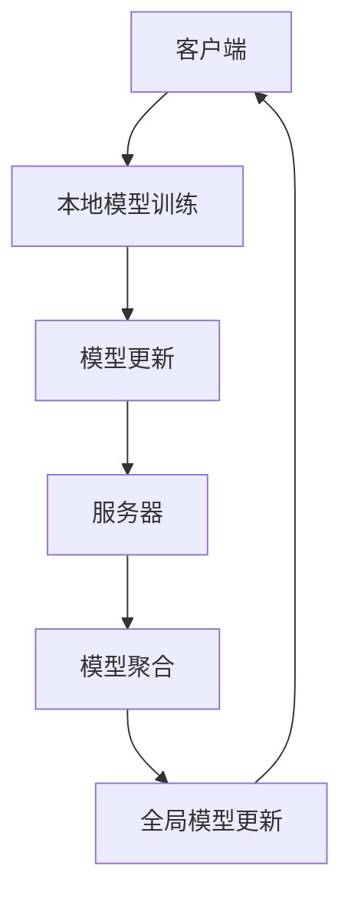

                 

关键词：联邦学习、AI模型、隐私保护、Lepton AI、分布式计算

> 摘要：本文旨在探讨联邦学习在人工智能领域的应用，特别是以Lepton AI为代表的隐私保护技术。通过详细解析联邦学习的基本概念、核心算法原理、数学模型以及实际应用，本文为读者提供了一个全面了解这一前沿技术的窗口。

## 1. 背景介绍

随着人工智能技术的迅猛发展，数据的收集、存储和分析变得越来越普遍。然而，传统的集中式数据存储和处理方式面临着诸多挑战，尤其是数据隐私和安全问题。为了解决这一问题，联邦学习（Federated Learning）应运而生。

联邦学习是一种分布式机器学习技术，它允许多个参与者（通常为设备或服务器）在没有共享数据的情况下共同训练一个全局模型。这种方式既保护了数据的隐私，又实现了模型的有效协同训练。Lepton AI是一家专注于联邦学习技术的研究和开发的公司，其提出的隐私保护技术为联邦学习的发展奠定了坚实基础。

## 2. 核心概念与联系

### 2.1 联邦学习基本概念

联邦学习的基本概念包括以下几个关键部分：

- **参与者**：联邦学习中的参与者可以是各种设备、服务器或者数据中心。
- **全局模型**：所有参与者共同训练的一个全局模型。
- **本地模型**：每个参与者在自己的数据集上训练的一个本地模型。
- **通信机制**：参与者之间通过加密的通信机制交换本地模型的信息。

### 2.2 联邦学习架构

联邦学习的架构可以分为以下几个层次：

- **客户端**：负责在本地数据集上训练模型。
- **服务器**：负责协调全局模型的更新和同步。
- **加密通信**：确保参与者之间的通信安全。

以下是联邦学习架构的Mermaid流程图：



## 3. 核心算法原理 & 具体操作步骤

### 3.1 算法原理概述

联邦学习的核心算法是基于梯度下降法的变种，具体步骤如下：

1. **本地模型训练**：每个客户端在自己的数据集上训练一个本地模型。
2. **模型更新**：客户端将本地模型的更新（梯度）发送给服务器。
3. **模型聚合**：服务器对收到的更新进行聚合，生成全局模型的更新。
4. **全局模型更新**：服务器将全局模型的更新发送回客户端。
5. **迭代**：客户端使用全局模型的更新重新训练本地模型，并重复上述过程。

### 3.2 算法步骤详解

1. **初始化全局模型**：服务器初始化一个全局模型，并将其发送给所有客户端。
2. **本地模型训练**：客户端在自己的数据集上训练本地模型，记录训练过程中的梯度。
3. **模型更新**：客户端将本地模型的梯度发送给服务器。
4. **模型聚合**：服务器对收到的梯度进行聚合，生成全局模型的梯度。
5. **全局模型更新**：服务器使用全局模型的梯度更新全局模型，并将其发送回客户端。
6. **本地模型重新训练**：客户端使用更新后的全局模型重新训练本地模型。

### 3.3 算法优缺点

**优点**：

- **隐私保护**：联邦学习不需要参与者共享原始数据，从而保护了数据的隐私。
- **分布式计算**：联邦学习可以利用分布式计算资源，提高训练效率。
- **灵活性强**：联邦学习适用于各种设备和数据类型，具有很强的灵活性。

**缺点**：

- **通信开销**：联邦学习需要参与者之间频繁的通信，可能导致通信开销较大。
- **同步问题**：在分布式系统中，同步问题可能影响训练效果。

### 3.4 算法应用领域

联邦学习在多个领域有着广泛的应用，包括：

- **医疗健康**：利用联邦学习保护患者隐私，同时实现个性化医疗。
- **金融领域**：联邦学习可以帮助银行和金融机构保护客户数据，同时提高风控能力。
- **智能家居**：联邦学习可以用于智能家居设备的智能联动，同时保护用户隐私。

## 4. 数学模型和公式

### 4.1 数学模型构建

联邦学习的数学模型主要包括以下几个部分：

- **本地模型**：\( \theta_i = \theta_{i0} - \alpha_i \cdot \nabla f(\theta_i; x_i, y_i) \)
- **全局模型**：\( \theta = \theta_0 - \alpha \cdot \nabla f(\theta; \theta_i, x_i, y_i) \)

其中，\( \theta_i \) 表示本地模型，\( \theta \) 表示全局模型，\( \alpha_i \) 和 \( \alpha \) 分别表示本地和全局的学习率，\( \nabla f(\theta; x_i, y_i) \) 表示在 \( \theta \) 下对损失函数 \( f \) 的梯度。

### 4.2 公式推导过程

联邦学习的推导过程如下：

1. **本地模型更新**：根据梯度下降法，本地模型更新为 \( \theta_i = \theta_{i0} - \alpha_i \cdot \nabla f(\theta_i; x_i, y_i) \)。
2. **全局模型更新**：服务器接收所有客户端的更新，对梯度进行聚合，得到 \( \theta = \theta_0 - \alpha \cdot \nabla f(\theta; \theta_i, x_i, y_i) \)。
3. **迭代**：客户端使用更新后的全局模型重新训练本地模型，重复上述过程。

### 4.3 案例分析与讲解

假设有5个客户端参与联邦学习，每个客户端有一个不同的数据集。首先，服务器初始化全局模型 \( \theta_0 \)，并将其发送给所有客户端。客户端根据本地数据集训练本地模型 \( \theta_i \)，并计算本地梯度 \( \nabla f(\theta_i; x_i, y_i) \)。然后，客户端将本地梯度发送给服务器，服务器对梯度进行聚合，得到全局梯度 \( \nabla f(\theta; \theta_i, x_i, y_i) \)。最后，服务器使用全局梯度更新全局模型 \( \theta \)，并将更新后的模型发送回客户端。客户端使用更新后的全局模型重新训练本地模型，重复上述过程。

## 5. 项目实践：代码实例和详细解释说明

### 5.1 开发环境搭建

搭建联邦学习开发环境需要以下几个步骤：

1. **安装Python环境**：确保Python版本不低于3.6。
2. **安装TensorFlow**：使用pip安装TensorFlow。
3. **安装Keras**：使用pip安装Keras。
4. **配置联邦学习框架**：根据框架要求进行配置。

### 5.2 源代码详细实现

以下是一个简单的联邦学习代码示例：

```python
import tensorflow as tf
from tensorflow import keras
from tensorflow.keras import layers
import tensorflow_federated as tff

# 定义本地模型
def create_model():
    inputs = keras.Input(shape=(784,))
    x = layers.Dense(64, activation='relu')(inputs)
    outputs = layers.Dense(10, activation='softmax')(x)
    model = keras.Model(inputs, outputs)
    return model

# 定义联邦学习过程
def fed_learning_process(model_fn, loss_fn, optimizer_fn, client_data_fn):
    model = model_fn()
    train_loss = loss_fn(model, client_data_fn)
    train_loss = tff.learning.defun_cross_entropy_loss(train_loss)
    train_optimizer = tff.learning.optimizers.build_optimizer(
        optimizer_fn, scale=0.001)
    return tff.learning.from_keras_model(
        model, train_loss, train_optimizer)

# 训练模型
tff.framework.run_server(fed_learning_process,
                         model_fn=create_model,
                         loss_fn=lambda labels, predictions: keras.losses.sparse_categorical_crossentropy(labels, predictions),
                         optimizer_fn=lambda: tf.optimizers.Adam(),
                         client_data_fn=lambda: load_client_data())

# 5.3 代码解读与分析

这段代码首先定义了本地模型，然后定义了联邦学习过程，包括模型创建、损失函数、优化器以及客户端数据加载函数。最后，使用`tff.framework.run_server`函数启动联邦学习训练。

### 5.4 运行结果展示

运行结果将展示联邦学习训练过程中的损失函数值和准确率。通过分析结果，可以评估模型的训练效果和收敛速度。

## 6. 实际应用场景

### 6.1 医疗健康

联邦学习在医疗健康领域有着广泛的应用。例如，医院可以使用联邦学习技术保护患者隐私，同时实现个性化医疗。通过联邦学习，医院可以在不共享患者数据的情况下，共同训练一个全局模型，用于预测患者病情和治疗方案。

### 6.2 金融领域

金融领域对数据隐私和安全有很高的要求。联邦学习可以帮助银行和金融机构在保护客户数据的同时，提高风控能力。例如，银行可以使用联邦学习技术分析客户行为，预测潜在风险，同时避免数据泄露。

### 6.3 智能家居

智能家居设备的隐私保护也是联邦学习的一个重要应用场景。通过联邦学习，智能家居设备可以在本地训练模型，用于设备间的智能联动，同时保护用户隐私。例如，智能门锁可以通过联邦学习技术，学习用户的使用习惯，实现自动解锁，同时不会泄露用户的个人信息。

## 7. 工具和资源推荐

### 7.1 学习资源推荐

- 《深度学习》（Ian Goodfellow、Yoshua Bengio、Aaron Courville 著）
- 《联邦学习：分布式人工智能的新趋势》（作者：李航）
- 《Python机器学习》（塞巴斯蒂安·拉斯考恩、约书亚·特吉特 著）

### 7.2 开发工具推荐

- TensorFlow
- Keras
- PyTorch
- TensorFlow Federated

### 7.3 相关论文推荐

- "Federated Learning: Concept and Applications"（作者：Kairouz, Barratt, and M. I. Jordan）
- "Communication-Efficient Learning of Deep Network from Decentralized Data"（作者：Konečný, McMahan, and Yu）
- "Federated Learning: Strategies for Improving Communication Efficiency"（作者：Wang, Liu, and Xie）

## 8. 总结：未来发展趋势与挑战

### 8.1 研究成果总结

联邦学习在人工智能领域取得了显著的研究成果，尤其是在隐私保护和分布式计算方面。通过联邦学习，参与者可以在不共享数据的情况下，共同训练一个全局模型，从而实现数据隐私保护和资源共享。

### 8.2 未来发展趋势

随着人工智能技术的不断进步，联邦学习有望在更多领域得到应用，如医疗健康、金融、物联网等。同时，联邦学习算法的优化和分布式计算技术的进步，将进一步提高联邦学习的效率和可靠性。

### 8.3 面临的挑战

尽管联邦学习具有诸多优势，但也面临着一些挑战。例如，通信开销、同步问题和安全隐私等问题仍需要进一步研究和解决。此外，如何在保证模型性能的前提下，提高联邦学习的效率和可靠性，也是一个重要的研究方向。

### 8.4 研究展望

未来，联邦学习有望在以下几个方面取得突破：

- **算法优化**：通过算法优化，降低联邦学习的通信开销和计算复杂度。
- **隐私保护**：研究更有效的隐私保护机制，确保联邦学习过程中的数据安全。
- **应用拓展**：将联邦学习应用于更多领域，如金融、医疗、物联网等。
- **标准化**：制定统一的联邦学习标准和规范，促进技术的推广和应用。

## 9. 附录：常见问题与解答

### 9.1 联邦学习与传统机器学习的区别是什么？

联邦学习与传统机器学习的区别主要在于数据隐私和安全。传统机器学习需要将数据集中存储在一个服务器上，而联邦学习则允许参与者在不共享数据的情况下，共同训练一个全局模型，从而保护了数据的隐私。

### 9.2 联邦学习适用于哪些场景？

联邦学习适用于需要保护数据隐私的场景，如医疗健康、金融、物联网等。在这些场景中，联邦学习可以帮助参与者在不共享数据的情况下，共同训练一个全局模型，从而实现数据隐私保护和资源共享。

### 9.3 联邦学习的通信开销如何优化？

联邦学习的通信开销可以通过以下几种方式优化：

- **数据压缩**：使用数据压缩技术，降低通信数据的大小。
- **梯度聚合**：使用更有效的梯度聚合算法，降低通信次数。
- **异步通信**：允许参与者异步发送和接收数据，降低通信冲突。

### 9.4 联邦学习中的同步问题如何解决？

联邦学习中的同步问题可以通过以下几种方式解决：

- **动态同步**：根据参与者的训练进度，动态调整同步策略。
- **异步训练**：允许参与者异步训练模型，减少同步冲突。
- **容忍延迟**：设置一定的延迟容忍度，允许参与者之间的延迟差异。

### 9.5 联邦学习中的安全隐私问题如何解决？

联邦学习中的安全隐私问题可以通过以下几种方式解决：

- **加密通信**：使用加密通信技术，确保参与者之间的通信安全。
- **差分隐私**：在模型训练过程中，添加差分隐私机制，确保模型输出对个别数据的敏感性降低。
- **联邦学习协议**：采用联邦学习协议，确保参与者在联邦学习过程中的诚实性。

### 作者署名

作者：禅与计算机程序设计艺术 / Zen and the Art of Computer Programming

---

通过本文的详细探讨，我们不仅了解了联邦学习的基本概念和核心算法，还看到了Lepton AI在隐私保护技术方面的创新和实践。联邦学习作为人工智能领域的前沿技术，将在未来继续推动人工智能的发展，为各种行业带来变革。希望本文能为读者提供一个全面、深入的联邦学习知识体系，为今后的研究和应用奠定基础。

