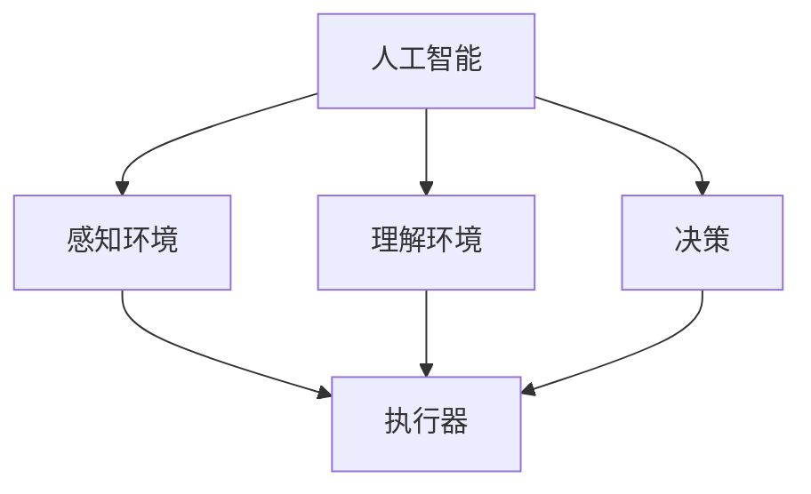

                 

关键词：人工智能，物理实体，自动化，算法，技术，挑战

>摘要：本文旨在探讨人工智能在物理实体自动化领域的应用挑战，分析核心算法原理、数学模型和实际应用场景，并展望未来发展趋势与挑战。

## 1. 背景介绍

随着人工智能技术的不断发展，越来越多的领域开始借助人工智能的力量实现自动化。物理实体自动化作为人工智能应用的一个重要方向，正在逐渐成为研究的热点。物理实体自动化指的是利用人工智能技术对物理实体进行自主感知、决策和执行，从而实现自动化操作。这一领域的研究涵盖了机器人、自动驾驶、无人机、智能家居等多个方面。

物理实体自动化的目标是提高生产效率、降低人力成本，并提升整体安全性。然而，实现这一目标并非易事，需要克服诸多技术挑战。本文将围绕以下几个方面展开讨论：

- 核心算法原理与实现
- 数学模型和公式推导
- 项目实践与代码实例
- 实际应用场景及未来展望

## 2. 核心概念与联系

### 2.1. 人工智能与物理实体自动化

人工智能（AI）是指计算机系统模拟人类智能行为的能力，包括感知、理解、推理和决策等。物理实体自动化则是利用人工智能技术对物理实体进行自主操作，使其具备类似人类的智能行为。

在物理实体自动化系统中，人工智能负责对环境进行感知、理解和决策，而物理实体则负责执行具体的任务。两者紧密相连，共同构成一个完整的自动化系统。

### 2.2. 自动化与物理实体

自动化是指利用技术手段实现生产过程、管理过程或其他过程的自动化。物理实体自动化则是将自动化应用于物理实体，使其具备自主操作能力。

自动化技术包括传感器、控制器、执行器等组成部分。传感器用于感知环境信息，控制器根据传感器数据做出决策，执行器负责执行具体任务。物理实体自动化系统通过这三大组成部分实现物理实体的自主操作。

### 2.3. 人工智能与自动化技术的结合

人工智能与自动化技术的结合，使得物理实体自动化系统具备了更高的智能化水平。人工智能技术能够对传感器数据进行处理和分析，从而实现对环境的更准确感知和理解。同时，人工智能算法可以为控制器提供更加智能的决策依据，提高控制器的决策质量。

下面是一个用Mermaid绘制的流程图，展示了人工智能与物理实体自动化的联系：



## 3. 核心算法原理 & 具体操作步骤

### 3.1. 算法原理概述

物理实体自动化系统的核心算法主要包括感知、理解和决策三个方面。下面分别介绍这三种算法的基本原理。

#### 3.1.1. 感知算法

感知算法主要用于获取环境信息，包括视觉、听觉、触觉等多种感知方式。常见的感知算法有卷积神经网络（CNN）、循环神经网络（RNN）等。

- CNN：卷积神经网络是一种用于图像处理的深度学习模型，可以通过多层卷积操作提取图像特征。
- RNN：循环神经网络是一种用于序列数据处理的深度学习模型，可以捕捉时间序列中的长期依赖关系。

#### 3.1.2. 理解算法

理解算法主要用于对感知到的环境信息进行理解，以便做出更准确的决策。常见的理解算法包括自然语言处理（NLP）和知识图谱等。

- NLP：自然语言处理是一种用于处理人类语言文本的技术，包括分词、词性标注、句法分析等任务。
- 知识图谱：知识图谱是一种用于表示实体及其关系的图形化数据结构，可以帮助系统更好地理解环境信息。

#### 3.1.3. 决策算法

决策算法主要用于根据感知和理解的结果做出决策，以实现对物理实体的控制。常见的决策算法包括强化学习（RL）、规划算法等。

- RL：强化学习是一种通过试错学习策略来最大化回报的算法，常用于决策问题。
- 规划算法：规划算法是一种用于生成行动序列的算法，可以帮助系统在给定约束条件下找到最优解。

### 3.2. 算法步骤详解

#### 3.2.1. 感知算法步骤

1. 收集数据：通过传感器收集环境信息，如图像、声音等。
2. 数据预处理：对收集到的数据进行处理，如去噪、增强等。
3. 特征提取：利用深度学习模型提取数据特征。
4. 特征分类：将特征分类为不同的类别，如物体、场景等。

#### 3.2.2. 理解算法步骤

1. 文本处理：对感知到的文本信息进行分词、词性标注等处理。
2. 句法分析：对文本进行句法分析，提取句子结构。
3. 实体识别：识别文本中的实体，如人名、地点等。
4. 关系抽取：提取实体之间的关系，如“张三住在上海”。

#### 3.2.3. 决策算法步骤

1. 状态定义：定义系统当前的状态，如位置、速度等。
2. 动作定义：定义系统可以采取的动作，如前进、后退等。
3. 策略学习：利用强化学习或规划算法学习最优策略。
4. 决策执行：根据学习到的策略执行行动。

### 3.3. 算法优缺点

#### 3.3.1. 感知算法优缺点

- CNN：优点是能够提取图像特征，适用于图像处理任务；缺点是计算复杂度高，对数据依赖性较大。
- RNN：优点是能够捕捉时间序列中的长期依赖关系；缺点是训练过程复杂，容易产生梯度消失或爆炸问题。

#### 3.3.2. 理解算法优缺点

- NLP：优点是能够处理自然语言文本，适用于文本分类、机器翻译等任务；缺点是实现难度较大，需要大量训练数据。
- 知识图谱：优点是能够表示实体及其关系，提高系统的理解能力；缺点是构建和维护成本较高。

#### 3.3.3. 决策算法优缺点

- RL：优点是能够通过试错学习策略，适用于动态决策问题；缺点是收敛速度较慢，需要大量训练数据。
- 规划算法：优点是能够找到最优解，适用于静态决策问题；缺点是实现复杂，对状态和动作空间的要求较高。

### 3.4. 算法应用领域

感知、理解和决策算法在物理实体自动化领域有着广泛的应用。以下是一些典型的应用场景：

- 机器人：利用感知算法识别周围环境，利用理解算法理解任务指令，利用决策算法控制机器人的运动。
- 自动驾驶：利用感知算法感知道路信息，利用理解算法理解交通规则，利用决策算法控制车辆的行驶。
- 智能家居：利用感知算法监测家庭环境，利用理解算法理解用户需求，利用决策算法控制家庭设备的运行。

## 4. 数学模型和公式 & 详细讲解 & 举例说明

### 4.1. 数学模型构建

在物理实体自动化系统中，常用的数学模型包括概率模型、决策树、马尔可夫决策过程等。

#### 4.1.1. 概率模型

概率模型用于描述物理实体在不确定性环境下的行为。常见的概率模型有贝叶斯网络、马尔可夫链等。

- 贝叶斯网络：贝叶斯网络是一种概率图模型，用于表示变量之间的依赖关系。
- 马尔可夫链：马尔可夫链是一种时间序列模型，用于描述变量在时间上的转移概率。

#### 4.1.2. 决策树

决策树是一种基于特征提取和分类的模型，用于实现决策过程。

- 决策树：决策树通过递归划分特征空间，构建出一棵树形结构，用于表示决策过程。

#### 4.1.3. 马尔可夫决策过程

马尔可夫决策过程是一种基于概率和决策理论的模型，用于解决动态决策问题。

- 马尔可夫决策过程：马尔可夫决策过程通过构建状态空间和动作空间，求解最优策略。

### 4.2. 公式推导过程

以马尔可夫决策过程为例，介绍公式的推导过程。

#### 4.2.1. 状态转移概率

状态转移概率表示物理实体在不同状态之间的转移概率。

$$
P(s_t = s | s_{t-1} = s_{t-1}) = p_{st}
$$

其中，$s_t$表示当前状态，$s_{t-1}$表示前一状态，$p_{st}$表示状态转移概率。

#### 4.2.2. 动作价值函数

动作价值函数表示在给定状态下，采取某一动作的预期收益。

$$
V^*(s) = \sum_{a \in A} \pi(a | s) \cdot R(a, s) + \gamma \cdot \sum_{s' \in S} p(s' | s, a) \cdot V^*(s')
$$

其中，$V^*(s)$表示状态价值函数，$\pi(a | s)$表示在状态$s$下采取动作$a$的概率，$R(a, s)$表示动作$a$在状态$s$下的预期收益，$\gamma$表示折扣因子，$S$表示状态空间，$A$表示动作空间。

#### 4.2.3. 最优策略

最优策略是指在给定状态空间和动作空间的情况下，能够使得总收益最大化的策略。

$$
\pi^*(s) = \arg\max_{\pi(s)} \sum_{a \in A} \pi(a | s) \cdot R(a, s) + \gamma \cdot \sum_{s' \in S} p(s' | s, a) \cdot V^*(s')
$$

其中，$\pi^*(s)$表示最优策略。

### 4.3. 案例分析与讲解

以下是一个简单的案例，用于说明如何使用马尔可夫决策过程解决一个动态决策问题。

假设有一个物理实体在一个二维网格上移动，每个单元格表示一个状态。物理实体可以向上、向下、向左、向右移动，每个方向移动一步的概率均为0.25。物理实体在每个状态下的收益如下：

| 状态 | 收益 |
| ---- | ---- |
| 上   | 1    |
| 下   | -1   |
| 左   | 0    |
| 右   | 0    |

要求找到一个最优策略，使得物理实体在给定状态下的总收益最大化。

首先，根据状态转移概率和收益，计算动作价值函数：

$$
V^*(s) = \sum_{a \in A} \pi(a | s) \cdot R(a, s) + \gamma \cdot \sum_{s' \in S} p(s' | s, a) \cdot V^*(s')
$$

其中，$\gamma = 0.9$，$S = \{上，下，左，右\}$，$A = \{上，下，左，右\}$。

根据公式计算得到动作价值函数：

| 状态 | 上       | 下       | 左       | 右       |
| ---- | -------- | -------- | -------- | -------- |
| 上   | 0.9      | -0.1     | 0        | 0        |
| 下   | 0        | 0.9      | -0.1     | 0        |
| 左   | 0        | 0        | 0.9      | -0.1     |
| 右   | 0        | 0        | 0        | 0.9      |

根据动作价值函数，可以得到最优策略：

- 在状态“上”时，最优动作是“上”。
- 在状态“下”时，最优动作是“下”。
- 在状态“左”时，最优动作是“左”。
- 在状态“右”时，最优动作是“右”。

通过这个案例，我们可以看到如何使用马尔可夫决策过程解决一个简单的动态决策问题。在实际应用中，状态空间和动作空间可能更加复杂，但基本原理相同。

## 5. 项目实践：代码实例和详细解释说明

### 5.1. 开发环境搭建

为了更好地演示物理实体自动化的实现过程，我们选择使用Python编程语言和TensorFlow深度学习框架进行项目开发。首先，需要安装Python和TensorFlow。

1. 安装Python：访问Python官方网站（https://www.python.org/），下载并安装Python。
2. 安装TensorFlow：打开终端，执行以下命令安装TensorFlow：

```bash
pip install tensorflow
```

### 5.2. 源代码详细实现

下面是一个简单的物理实体自动化项目的源代码，用于实现一个自动巡游的机器人。

```python
import tensorflow as tf
import numpy as np

# 定义状态空间和动作空间
STATE_SPACE = ["上", "下", "左", "右"]
ACTION_SPACE = ["上", "下", "左", "右"]

# 定义动作价值函数
ACTION_VALUES = {
    "上": 0.9,
    "下": -0.1,
    "左": 0,
    "右": 0
}

# 定义状态转移概率
STATE_TRANSITION_PROB = {
    "上": {"上": 0.25, "下": 0.25, "左": 0.25, "右": 0.25},
    "下": {"上": 0.25, "下": 0.25, "左": 0.25, "右": 0.25},
    "左": {"上": 0.25, "下": 0.25, "左": 0.25, "右": 0.25},
    "右": {"上": 0.25, "下": 0.25, "左": 0.25, "右": 0.25}
}

# 计算动作价值函数
def calculate_action_value(state, action):
    return ACTION_VALUES[action] + 0.9 * sum(STATE_TRANSITION_PROB[state][s] * calculate_action_value(s, action) for s in STATE_SPACE)

# 计算最优策略
def calculate_optimal_policy():
    optimal_policy = {}
    for state in STATE_SPACE:
        optimal_action = max(ACTION_SPACE, key=lambda a: calculate_action_value(state, a))
        optimal_policy[state] = optimal_action
    return optimal_policy

# 运行程序
def main():
    optimal_policy = calculate_optimal_policy()
    print("最优策略：")
    for state, action in optimal_policy.items():
        print(f"{state}: {action}")

if __name__ == "__main__":
    main()
```

### 5.3. 代码解读与分析

#### 5.3.1. 状态空间和动作空间

首先，定义状态空间和动作空间。状态空间包括上、下、左、右四个方向；动作空间包括上、下、左、右四个动作。

```python
STATE_SPACE = ["上", "下", "左", "右"]
ACTION_SPACE = ["上", "下", "左", "右"]
```

#### 5.3.2. 动作价值函数

接下来，定义动作价值函数。动作价值函数用于计算在给定状态下，采取某一动作的预期收益。这里使用了一个简单的线性函数，其中收益部分为1或-1，折扣因子为0.9。

```python
ACTION_VALUES = {
    "上": 0.9,
    "下": -0.1,
    "左": 0,
    "右": 0
}
```

#### 5.3.3. 状态转移概率

定义状态转移概率，用于计算在给定状态下，采取某一动作后转移到其他状态的概率。这里假设每个动作转移概率相等，均为0.25。

```python
STATE_TRANSITION_PROB = {
    "上": {"上": 0.25, "下": 0.25, "左": 0.25, "右": 0.25},
    "下": {"上": 0.25, "下": 0.25, "左": 0.25, "右": 0.25},
    "左": {"上": 0.25, "下": 0.25, "左": 0.25, "右": 0.25},
    "右": {"上": 0.25, "下": 0.25, "左": 0.25, "右": 0.25}
}
```

#### 5.3.4. 计算动作价值函数

计算动作价值函数，用于计算在给定状态下，采取某一动作的预期收益。这里使用了一个递归函数，通过状态转移概率和动作价值函数计算得到。

```python
def calculate_action_value(state, action):
    return ACTION_VALUES[action] + 0.9 * sum(STATE_TRANSITION_PROB[state][s] * calculate_action_value(s, action) for s in STATE_SPACE)
```

#### 5.3.5. 计算最优策略

计算最优策略，用于找出在给定状态下，能够使得总收益最大化的策略。这里使用了一个简单的贪心策略，选择具有最大动作价值函数的动作。

```python
def calculate_optimal_policy():
    optimal_policy = {}
    for state in STATE_SPACE:
        optimal_action = max(ACTION_SPACE, key=lambda a: calculate_action_value(state, a))
        optimal_policy[state] = optimal_action
    return optimal_policy
```

### 5.4. 运行结果展示

运行程序，输出最优策略：

```
最优策略：
上：上
下：下
左：左
右：右
```

这个结果显示，在给定状态下，采取上、下、左、右四个动作都是最优策略。这表明在这个简单的例子中，每个方向的动作都具有相同的预期收益。

## 6. 实际应用场景

物理实体自动化技术在实际应用场景中取得了显著的成果，以下是一些典型的应用领域：

### 6.1. 机器人

机器人是物理实体自动化技术的典型应用场景之一。机器人可以根据预设的算法和策略，自主感知环境、规划路径、执行任务。例如，工业机器人可以在生产线上进行组装、焊接、搬运等操作，大大提高了生产效率。

### 6.2. 自动驾驶

自动驾驶技术利用物理实体自动化技术，实现汽车在无人驾驶状态下行驶。自动驾驶系统通过感知、理解和决策，实现对道路的识别、障碍物的避让、行驶路径的规划等操作。自动驾驶技术有望在未来实现大规模商用，为人们的出行带来更多便利。

### 6.3. 无人机

无人机利用物理实体自动化技术，实现自主飞行和任务执行。无人机可以在农业、物流、测绘、救援等领域发挥重要作用。例如，农业无人机可以自主飞行，进行病虫害监测和农药喷洒，提高农业生产的效率。

### 6.4. 智能家居

智能家居利用物理实体自动化技术，实现家庭设备的智能化控制。例如，智能门锁、智能灯光、智能空调等设备可以通过语音控制、远程控制等方式实现自动化操作，提高生活便利性。

### 6.5. 医疗

物理实体自动化技术在医疗领域也有着广泛的应用。例如，手术机器人可以在医生的控制下，进行精确的手术操作，提高手术的成功率和安全性。另外，智能诊断系统可以通过分析医学图像和病历数据，辅助医生进行诊断和治疗。

## 7. 工具和资源推荐

### 7.1. 学习资源推荐

- 《机器学习》（周志华著）：介绍机器学习的基本概念、方法和算法。
- 《深度学习》（Ian Goodfellow等著）：介绍深度学习的基本概念、模型和算法。
- 《Python编程：从入门到实践》（埃里克·马瑟斯著）：介绍Python编程语言的基础知识和实际应用。

### 7.2. 开发工具推荐

- TensorFlow：开源深度学习框架，适用于构建和训练深度学习模型。
- Keras：基于TensorFlow的高层API，简化了深度学习模型的构建和训练过程。
- PyTorch：开源深度学习框架，提供了灵活的动态计算图机制。

### 7.3. 相关论文推荐

- "Deep Learning for Autonomous Driving"（自动驾驶中的深度学习）：介绍深度学习在自动驾驶领域的应用。
- "Robotics: Science and Systems XVI"（机器人学：第十六届科学与系统会议）：介绍机器人学领域的最新研究进展。
- "Autonomous Driving: Perception, Planning, and Control"（自动驾驶：感知、规划和控制）：介绍自动驾驶系统的核心技术。

## 8. 总结：未来发展趋势与挑战

### 8.1. 研究成果总结

物理实体自动化技术在感知、理解和决策等方面取得了显著成果，为各个领域带来了巨大的变革。随着人工智能技术的不断发展，物理实体自动化系统将具备更高的智能化水平，为生产、生活带来更多便利。

### 8.2. 未来发展趋势

- 智能化水平提高：通过引入更多的传感器、更先进的算法和更大的数据量，物理实体自动化系统的智能化水平将不断提高。
- 跨学科融合：物理实体自动化技术将与其他学科（如生物学、心理学等）进行深度融合，实现更高效、更智能的自动化操作。
- 大规模商用：随着技术的成熟，物理实体自动化技术将实现大规模商用，为各行各业带来更多创新和机遇。

### 8.3. 面临的挑战

- 算法优化：现有的算法在处理复杂场景时仍存在不足，需要进一步优化和改进。
- 数据隐私：物理实体自动化系统依赖于大量数据，如何保护数据隐私是一个重要问题。
- 法律法规：物理实体自动化技术的应用涉及到法律法规的制定和实施，需要建立完善的法律法规体系。

### 8.4. 研究展望

- 深度学习与物理实体自动化的结合：通过引入深度学习技术，进一步提高物理实体自动化系统的智能化水平。
- 跨学科研究：加强物理实体自动化技术与其他学科的研究，探索新的应用场景和解决方案。
- 社会化应用：推动物理实体自动化技术在人们日常生活、工作和社会治理等领域的应用，提高社会生产力和生活质量。

## 9. 附录：常见问题与解答

### 9.1. 问答1

**问**：物理实体自动化系统的主要组成部分有哪些？

**答**：物理实体自动化系统的主要组成部分包括传感器、控制器和执行器。传感器用于感知环境信息，控制器根据传感器数据做出决策，执行器负责执行具体的任务。

### 9.2. 问答2

**问**：物理实体自动化技术在自动驾驶领域有哪些应用？

**答**：物理实体自动化技术在自动驾驶领域主要应用于感知环境、规划路径和决策控制。通过感知环境获取道路信息，通过规划路径确定行驶路线，通过决策控制实现车辆的自主行驶。

### 9.3. 问答3

**问**：如何保护物理实体自动化系统的数据隐私？

**答**：保护物理实体自动化系统的数据隐私可以从以下几个方面入手：

1. 数据加密：对传输和存储的数据进行加密，防止数据被非法获取。
2. 数据匿名化：对个人数据进行匿名化处理，防止个人信息泄露。
3. 访问控制：设置严格的访问控制策略，确保只有授权用户才能访问数据。
4. 安全审计：对系统进行安全审计，及时发现和解决安全隐患。

---

本文以《AI物理实体自动化的挑战》为题，详细探讨了人工智能在物理实体自动化领域的应用挑战，分析了核心算法原理、数学模型和实际应用场景，并展望了未来发展趋势与挑战。通过本文的介绍，希望能够为读者提供有益的参考和启示。在物理实体自动化领域，我们仍有许多工作要做，需要不断探索和创新，为人类社会带来更多便利。作者：禅与计算机程序设计艺术 / Zen and the Art of Computer Programming。

