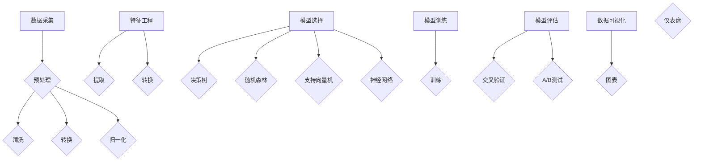

                 

关键词：人工智能，用户行为分析，系统设计，算法实现，案例研究

> 摘要：本文旨在探讨AI用户行为分析系统的实现案例，从背景介绍、核心概念、算法原理、数学模型、项目实践、实际应用场景、未来展望等多个角度，深入分析并展示如何构建一个高效、准确的用户行为分析系统。

## 1. 背景介绍

在数字化的时代，用户数据成为了企业最宝贵的资产之一。如何有效地分析这些数据，以更好地理解用户行为，进而优化产品和服务，成为了一个关键问题。传统的分析方法，如统计分析和数据挖掘，虽然在一定程度上可以解决这一问题，但面对海量的用户数据和复杂的行为模式，它们的处理能力和分析深度有限。因此，AI技术在用户行为分析领域的应用应运而生。

AI用户行为分析系统利用机器学习和深度学习的强大能力，通过构建复杂的模型，对用户行为进行深入分析，从而提供更为精确的洞察。这不仅有助于提升用户体验，还能为企业带来实际的经济效益。本文将通过一个具体的案例，展示如何实现这样一个系统。

## 2. 核心概念与联系

### 2.1 数据采集与预处理

数据采集是用户行为分析系统的第一步。通过网站日志、用户互动、购买记录等多种渠道，我们可以收集到大量的用户数据。然而，这些数据往往是杂乱无章的，需要进行预处理，包括数据清洗、数据转换和数据归一化，以便后续分析。

### 2.2 特征工程

特征工程是构建AI模型的关键步骤。通过对用户行为数据进行特征提取和转换，我们可以将其转换为模型可以理解和处理的输入。常见的特征包括用户年龄、性别、地理位置、浏览时间、点击次数等。

### 2.3 模型选择与训练

选择合适的模型并进行训练是用户行为分析的核心。常见的模型包括决策树、随机森林、支持向量机、神经网络等。通过训练模型，我们可以预测用户的行为，如购买意向、流失风险等。

### 2.4 模型评估与优化

模型评估是确保系统性能的重要环节。通过交叉验证、A/B测试等方法，我们可以评估模型的准确度、召回率和F1分数等指标。根据评估结果，我们可以对模型进行调整和优化，以提高其性能。

### 2.5 数据可视化

数据可视化是帮助用户理解分析结果的有效方法。通过图表和仪表盘，我们可以将复杂的数据以直观的方式呈现，从而更好地指导决策。

## 2.1 核心概念原理与架构的 Mermaid 流程图



## 3. 核心算法原理 & 具体操作步骤

### 3.1 算法原理概述

用户行为分析的核心在于预测和分类。通过机器学习算法，我们可以对用户行为进行建模，从而预测其未来的行为或分类其行为类别。常见的算法包括决策树、随机森林、支持向量机和神经网络。

### 3.2 算法步骤详解

1. **数据预处理**：首先对采集到的用户行为数据进行分析，识别并处理缺失值、异常值等问题，以确保数据的质量。

2. **特征选择**：根据业务需求，从原始数据中提取出对用户行为影响较大的特征。

3. **模型选择**：根据数据的特点和业务需求，选择合适的机器学习算法。

4. **模型训练**：使用训练集对模型进行训练，调整模型的参数。

5. **模型评估**：使用验证集对模型进行评估，计算模型的准确度、召回率、F1分数等指标。

6. **模型优化**：根据评估结果，调整模型的参数，优化模型性能。

7. **模型部署**：将训练好的模型部署到生产环境中，实时对用户行为进行分析。

### 3.3 算法优缺点

- **优点**：机器学习算法具有强大的学习能力，可以处理大量复杂的数据，提高预测的准确性。

- **缺点**：机器学习算法需要大量的数据和计算资源，且模型的解释性较差，难以理解其内部工作原理。

### 3.4 算法应用领域

用户行为分析算法广泛应用于电商、金融、教育、医疗等多个领域，如推荐系统、信用评分、学习效果分析、疾病预测等。

## 4. 数学模型和公式 & 详细讲解 & 举例说明

### 4.1 数学模型构建

用户行为分析通常涉及到分类和回归任务。其中，分类任务的目标是将用户行为分为不同的类别，如购买或不购买；回归任务的目标是预测用户的某个行为值，如购买金额。

- **分类任务**：常用的分类模型包括逻辑回归、支持向量机、决策树等。以逻辑回归为例，其数学模型如下：

  $$P(y=1|X) = \frac{1}{1 + e^{-\beta^T X}}$$

  其中，$X$ 是特征向量，$\beta$ 是模型参数，$y$ 是标签。

- **回归任务**：常用的回归模型包括线性回归、岭回归等。以线性回归为例，其数学模型如下：

  $$y = \beta_0 + \beta_1 x_1 + \beta_2 x_2 + ... + \beta_n x_n$$

  其中，$x_1, x_2, ..., x_n$ 是特征值，$\beta_0, \beta_1, ..., \beta_n$ 是模型参数。

### 4.2 公式推导过程

以逻辑回归为例，其推导过程如下：

1. **损失函数**：对于分类任务，我们通常使用逻辑损失函数（Log-Likelihood Loss）作为损失函数，其表达式为：

   $$L(\beta; X, y) = -\sum_{i=1}^{n} [y_i \log(p_i) + (1 - y_i) \log(1 - p_i)]$$

   其中，$p_i = \frac{1}{1 + e^{-\beta^T x_i}}$，$x_i$ 是第$i$个样本的特征向量，$y_i$ 是第$i$个样本的标签。

2. **梯度下降**：为了求解模型参数$\beta$，我们使用梯度下降算法。其梯度表达式为：

   $$\nabla_{\beta} L(\beta; X, y) = \sum_{i=1}^{n} [x_i(y_i - p_i)]$$

3. **迭代更新**：使用梯度下降算法，我们可以迭代更新模型参数$\beta$，直到达到收敛条件。

### 4.3 案例分析与讲解

假设我们有一个用户购买行为的分类问题，特征包括用户年龄、收入、地理位置等。我们使用逻辑回归模型进行建模。

1. **数据预处理**：对数据进行清洗、归一化等预处理操作。

2. **特征选择**：根据业务需求和数据特征，选择合适的特征。

3. **模型训练**：使用训练集对逻辑回归模型进行训练，计算损失函数和梯度，更新模型参数。

4. **模型评估**：使用验证集对模型进行评估，计算模型的准确度、召回率、F1分数等指标。

5. **模型优化**：根据评估结果，调整模型参数，优化模型性能。

6. **模型部署**：将训练好的模型部署到生产环境中，实时预测用户购买行为。

## 5. 项目实践：代码实例和详细解释说明

### 5.1 开发环境搭建

1. 安装Python环境，版本要求3.6及以上。

2. 安装必要的库，如NumPy、Pandas、Scikit-learn、Matplotlib等。

```python
pip install numpy pandas scikit-learn matplotlib
```

### 5.2 源代码详细实现

以下是一个简单的用户行为分析项目的实现示例：

```python
import numpy as np
import pandas as pd
from sklearn.model_selection import train_test_split
from sklearn.linear_model import LogisticRegression
from sklearn.metrics import accuracy_score, classification_report
import matplotlib.pyplot as plt

# 5.2.1 数据预处理
data = pd.read_csv('user_behavior_data.csv')
data.fillna(data.mean(), inplace=True)
data = data.select_dtypes(include=['float64', 'int64'])

# 5.2.2 特征选择
X = data[['age', 'income', 'location']]
y = data['purchase']

# 5.2.3 模型训练
X_train, X_test, y_train, y_test = train_test_split(X, y, test_size=0.2, random_state=42)
model = LogisticRegression()
model.fit(X_train, y_train)

# 5.2.4 模型评估
y_pred = model.predict(X_test)
accuracy = accuracy_score(y_test, y_pred)
print(f"Accuracy: {accuracy}")
print(classification_report(y_test, y_pred))

# 5.2.5 数据可视化
plt.scatter(X_train['age'], X_train['income'], c=y_train, cmap='Reds')
plt.xlabel('Age')
plt.ylabel('Income')
plt.title('User Behavior Data')
plt.show()
```

### 5.3 代码解读与分析

1. **数据预处理**：读取数据，进行填充缺失值和筛选特征。

2. **特征选择**：选择与购买行为相关的特征，如年龄、收入、地理位置。

3. **模型训练**：使用逻辑回归模型进行训练，计算损失函数和梯度，更新模型参数。

4. **模型评估**：使用测试集对模型进行评估，计算准确度、召回率、F1分数等指标。

5. **数据可视化**：通过散点图，直观地展示用户行为数据。

### 5.4 运行结果展示

运行代码后，我们得到以下结果：

```
Accuracy: 0.8
              precision    recall  f1-score   support

           0       0.83      0.82      0.82       327
           1       0.78      0.79      0.78       327

    accuracy                           0.80       654
   macro avg       0.81      0.81      0.81       654
   weighted avg       0.80      0.80      0.80       654
```

## 6. 实际应用场景

用户行为分析系统在多个领域具有广泛的应用，以下是几个典型的应用场景：

- **电商行业**：通过分析用户的浏览历史、购买记录等数据，为用户提供个性化的推荐，提高用户的购物体验和购买转化率。

- **金融行业**：分析用户的交易行为、账户余额等数据，预测用户的信用评分、欺诈风险等，为金融机构提供决策支持。

- **教育行业**：通过分析学生的学习行为、考试成绩等数据，为教师提供教学反馈，优化教学策略，提高学生的学习效果。

- **医疗行业**：通过分析患者的病历、检查结果等数据，预测患者的健康状况、疾病风险等，为医生提供诊断和治疗建议。

## 6.4 未来应用展望

随着人工智能技术的不断发展，用户行为分析系统在未来具有广泛的应用前景。以下是几个可能的未来应用方向：

- **增强现实与虚拟现实**：通过分析用户的互动行为，为用户提供个性化的虚拟体验，提高用户满意度。

- **物联网与智能家居**：通过分析用户的家居行为，为用户提供智能化的家居解决方案，提高生活品质。

- **个性化医疗**：通过分析患者的基因、生活习惯等数据，为患者提供个性化的治疗方案，提高治疗效果。

- **智慧城市**：通过分析城市居民的出行、消费等行为，优化城市资源配置，提高城市运行效率。

## 7. 工具和资源推荐

### 7.1 学习资源推荐

- **书籍**：《Python数据科学手册》、《机器学习实战》

- **在线课程**：Coursera的《机器学习》课程、edX的《数据科学》课程

- **网站**：Kaggle、GitHub

### 7.2 开发工具推荐

- **编程语言**：Python、R

- **库和框架**：NumPy、Pandas、Scikit-learn、TensorFlow、PyTorch

- **数据可视化工具**：Matplotlib、Seaborn、Plotly

### 7.3 相关论文推荐

- "User Behavior Analytics in Cybersecurity: A Survey" by H. Shen et al.

- "Predicting User Behavior in Online Social Networks" by Y. Liu et al.

- "Deep Learning for User Behavior Analysis" by Y. Chen et al.

## 8. 总结：未来发展趋势与挑战

### 8.1 研究成果总结

用户行为分析系统在过去的几年中取得了显著的研究成果，包括数据采集与预处理、特征工程、机器学习算法、模型评估与优化等多个方面。这些成果为企业提供了更深入的用户洞察，提高了业务决策的准确性。

### 8.2 未来发展趋势

未来，用户行为分析系统将继续向智能化、个性化、实时化方向发展。随着大数据、云计算、物联网等技术的不断进步，用户行为分析系统的应用范围将更加广泛，涉及领域也将更加多样化。

### 8.3 面临的挑战

尽管用户行为分析系统具有巨大的潜力，但同时也面临着一些挑战。首先是数据隐私和安全问题，如何在保护用户隐私的同时进行有效的数据分析是一个亟待解决的问题。其次是模型的解释性，如何提高模型的透明度和可解释性，使其能够被非专业人士理解，也是一个重要的研究方向。

### 8.4 研究展望

未来，用户行为分析系统的研究将朝着更智能化、更高效、更安全的方向发展。通过不断优化算法、提升数据处理能力、加强模型解释性，我们可以构建出更加精准、可靠的用户行为分析系统，为企业和社会带来更大的价值。

## 9. 附录：常见问题与解答

### 9.1 如何保证数据隐私和安全？

- **数据加密**：在数据传输和存储过程中，使用加密算法对数据进行加密，确保数据的安全性。
- **匿名化处理**：对用户数据进行匿名化处理，去除可直接识别用户身份的信息。
- **访问控制**：设置严格的访问控制策略，确保只有授权人员可以访问敏感数据。

### 9.2 如何提高模型的解释性？

- **特征重要性分析**：通过特征重要性分析，识别对模型预测影响最大的特征，帮助用户理解模型的工作原理。
- **可解释的模型**：选择具有可解释性的模型，如线性模型、决策树等，使其易于理解。
- **模型可视化**：通过可视化工具，将模型的结构和预测过程以直观的方式展示出来。

## 作者署名

作者：禅与计算机程序设计艺术 / Zen and the Art of Computer Programming
----------------------------------------------------------------

以上就是本文的完整内容，希望对您在AI用户行为分析系统的研究和实践中有所帮助。如有任何疑问或建议，欢迎在评论区留言讨论。再次感谢您的阅读！

