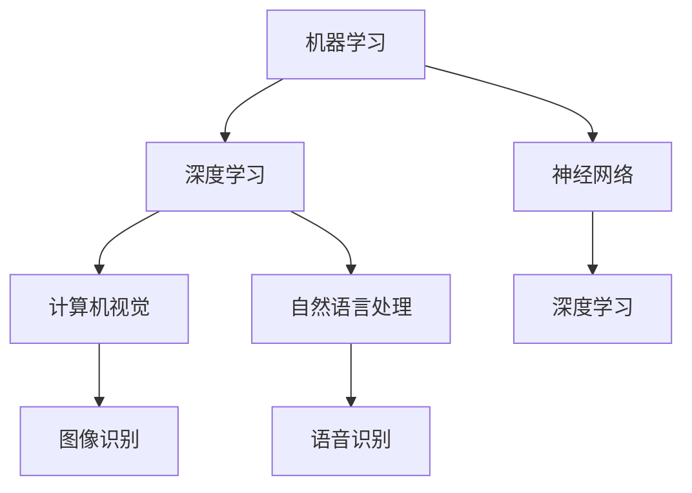

                 

关键词：人工智能（AI），长期发展，贾扬清，行业走向，技术进步

摘要：本文旨在探讨人工智能领域的长期发展路径，结合贾扬清的观点，分析AI行业如何在面对技术变革和行业挑战中，实现更长远的发展。文章将分为背景介绍、核心概念与联系、核心算法原理、数学模型与公式、项目实践、实际应用场景、工具和资源推荐、未来发展趋势与挑战等多个部分，以深入剖析AI领域的现状与未来。

## 1. 背景介绍

人工智能（AI）作为21世纪最具变革性的技术之一，已经深刻影响了各行各业，从医疗、金融到教育、制造业，AI的应用场景日益丰富。然而，随着AI技术的快速发展，也面临着诸多挑战，如算法透明性、隐私保护、安全性等。贾扬清，作为AI领域的杰出专家，在其研究和工作实践中，对AI的长期发展有着深刻的见解。

本文将结合贾扬清的思考，探讨AI行业如何更长远地走下去。文章将首先回顾AI的发展历程，然后深入分析当前AI技术的核心概念与联系，随后介绍核心算法原理，并探讨数学模型和公式。在此基础上，我们将通过实际项目实践，展示AI技术在具体应用场景中的运用。随后，文章将讨论AI技术的未来应用展望，并推荐相关的工具和资源。最后，我们将总结AI领域的研究成果，探讨未来发展趋势和挑战，并展望AI领域的未来。

## 2. 核心概念与联系

在深入探讨AI技术之前，我们有必要明确一些核心概念，并理解它们之间的联系。

### 2.1 机器学习

机器学习（Machine Learning，ML）是AI的核心组成部分，它使得计算机能够通过数据和经验不断学习和改进。机器学习主要包括监督学习（Supervised Learning）、无监督学习（Unsupervised Learning）和强化学习（Reinforcement Learning）等几种类型。

### 2.2 深度学习

深度学习（Deep Learning，DL）是机器学习的一个子领域，它通过构建多层的神经网络模型，对大量数据进行自动特征提取和模式识别。深度学习在图像识别、自然语言处理等领域取得了显著的成果。

### 2.3 神经网络

神经网络（Neural Networks，NN）是模仿人脑结构和功能的一种计算模型，由大量的节点（称为神经元）组成。神经网络通过前向传播和反向传播算法，实现数据的输入和输出。

### 2.4 计算机视觉

计算机视觉（Computer Vision，CV）是AI的一个重要应用领域，它使计算机能够理解并解释数字图像或视频。计算机视觉技术在图像识别、视频分析等方面发挥着重要作用。

### 2.5 自然语言处理

自然语言处理（Natural Language Processing，NLP）是AI的另一个重要应用领域，它使计算机能够理解和生成自然语言。NLP技术在语音识别、机器翻译、情感分析等方面有着广泛的应用。

### 2.6 梅尔图流程图

为了更直观地展示这些概念之间的联系，我们可以使用梅尔图流程图（Mermaid Flowchart）进行说明：



通过上述核心概念的介绍和联系，我们为后续的深入讨论奠定了基础。

## 3. 核心算法原理 & 具体操作步骤

### 3.1 算法原理概述

在AI技术中，核心算法原理是其实现的基础。以下将介绍几种关键的算法原理，包括监督学习、无监督学习和强化学习。

#### 3.1.1 监督学习

监督学习是一种机器学习方法，其核心思想是通过已知的输入和输出数据，训练模型以预测新的输出。监督学习算法包括线性回归、逻辑回归、支持向量机（SVM）等。

#### 3.1.2 无监督学习

无监督学习是另一种机器学习方法，其主要目标是在没有标注的输入数据中找到数据的结构和模式。无监督学习算法包括聚类、降维、主成分分析（PCA）等。

#### 3.1.3 强化学习

强化学习是一种基于反馈的机器学习方法，其核心思想是智能体通过与环境的交互，学习到最优的策略。强化学习算法包括Q学习、深度Q网络（DQN）等。

### 3.2 算法步骤详解

#### 3.2.1 监督学习步骤

1. 数据收集：收集包含输入和输出数据的训练集。
2. 特征提取：将输入数据转换为特征向量。
3. 模型选择：选择适当的机器学习模型。
4. 训练模型：使用训练集训练模型。
5. 验证模型：使用验证集评估模型的性能。
6. 预测：使用训练好的模型对新数据进行预测。

#### 3.2.2 无监督学习步骤

1. 数据收集：收集没有标注的输入数据。
2. 特征提取：将输入数据转换为特征向量。
3. 模型选择：选择适当的无监督学习模型。
4. 模型训练：使用输入数据训练模型。
5. 模型评估：评估模型的性能。
6. 结果输出：输出模型的结果，如聚类结果。

#### 3.2.3 强化学习步骤

1. 环境初始化：初始化环境状态。
2. 智能体行动：智能体根据当前状态选择行动。
3. 状态更新：环境根据智能体的行动更新状态。
4. 奖励计算：计算智能体行动的奖励。
5. 智能体学习：智能体根据奖励更新策略。
6. 结果输出：输出智能体的最终策略。

### 3.3 算法优缺点

#### 3.3.1 监督学习优点

- 可以根据已有的标注数据快速构建预测模型。
- 模型的性能容易评估，便于优化。

#### 3.3.1 监督学习缺点

- 需要大量的标注数据。
- 对新数据的预测能力有限。

#### 3.3.2 无监督学习优点

- 不依赖于标注数据，能够发现数据中的隐含结构。
- 对大规模数据具有较好的处理能力。

#### 3.3.2 无监督学习缺点

- 模型性能难以评估，优化过程较为复杂。
- 对新数据的预测能力有限。

#### 3.3.3 强化学习优点

- 可以通过与环境交互学习到最优策略。
- 对新数据具有较强的适应性。

#### 3.3.3 强化学习缺点

- 需要大量的交互数据，训练过程较为耗时。
- 策略优化过程较为复杂，容易陷入局部最优。

### 3.4 算法应用领域

监督学习、无监督学习和强化学习在AI的不同领域都有广泛的应用。

- **监督学习**：在图像识别、文本分类、预测等领域有着广泛的应用。
- **无监督学习**：在数据降维、聚类分析、推荐系统等领域有着重要的应用。
- **强化学习**：在游戏、机器人控制、推荐系统等领域取得了显著的成果。

通过上述对核心算法原理的介绍，我们为深入理解AI技术奠定了基础。

## 4. 数学模型和公式 & 详细讲解 & 举例说明

在AI技术中，数学模型和公式扮演着至关重要的角色。以下将介绍一些关键的数学模型和公式，并详细讲解其构建和推导过程，同时通过具体例子进行说明。

### 4.1 数学模型构建

#### 4.1.1 线性回归模型

线性回归模型是最基础的机器学习模型之一，其公式如下：

\[ Y = \beta_0 + \beta_1X \]

其中，\( Y \) 是因变量，\( X \) 是自变量，\( \beta_0 \) 和 \( \beta_1 \) 是模型的参数。

#### 4.1.2 逻辑回归模型

逻辑回归模型是一种概率型回归模型，其公式如下：

\[ P(Y=1) = \frac{1}{1 + e^{-(\beta_0 + \beta_1X)}} \]

其中，\( P(Y=1) \) 是因变量为1的概率，\( \beta_0 \) 和 \( \beta_1 \) 是模型的参数。

#### 4.1.3 神经网络模型

神经网络模型是一种复杂的机器学习模型，其核心是多层感知器（MLP）。神经网络模型的公式如下：

\[ Y = \sigma(\beta_0 + \sum_{i=1}^{n}\beta_iX_i) \]

其中，\( Y \) 是输出，\( \sigma \) 是激活函数，\( \beta_0 \) 和 \( \beta_i \) 是模型的参数，\( X_i \) 是输入。

### 4.2 公式推导过程

#### 4.2.1 线性回归模型推导

线性回归模型的推导过程如下：

1. 假设我们有 \( n \) 个样本点 \((X_i, Y_i)\)，其中 \( X_i \) 是输入，\( Y_i \) 是输出。
2. 我们假设模型为 \( Y = \beta_0 + \beta_1X \)。
3. 为了找到最优的 \( \beta_0 \) 和 \( \beta_1 \)，我们需要最小化均方误差：

\[ \sum_{i=1}^{n}(Y_i - (\beta_0 + \beta_1X_i))^2 \]

4. 对上述公式求导，并令导数为零，得到：

\[ \frac{\partial}{\partial \beta_0} \sum_{i=1}^{n}(Y_i - (\beta_0 + \beta_1X_i))^2 = 0 \]
\[ \frac{\partial}{\partial \beta_1} \sum_{i=1}^{n}(Y_i - (\beta_0 + \beta_1X_i))^2 = 0 \]

5. 解上述方程组，得到最优的 \( \beta_0 \) 和 \( \beta_1 \)。

#### 4.2.2 逻辑回归模型推导

逻辑回归模型的推导过程如下：

1. 假设我们有 \( n \) 个样本点 \((X_i, Y_i)\)，其中 \( X_i \) 是输入，\( Y_i \) 是输出。
2. 我们假设模型为 \( P(Y=1) = \frac{1}{1 + e^{-(\beta_0 + \beta_1X)}} \)。
3. 为了找到最优的 \( \beta_0 \) 和 \( \beta_1 \)，我们需要最小化对数似然损失：

\[ \sum_{i=1}^{n}Y_i\ln(P(Y=1)) + (1 - Y_i)\ln(1 - P(Y=1)) \]

4. 对上述公式求导，并令导数为零，得到：

\[ \frac{\partial}{\partial \beta_0} \sum_{i=1}^{n}Y_i\ln(P(Y=1)) + (1 - Y_i)\ln(1 - P(Y=1)) = 0 \]
\[ \frac{\partial}{\partial \beta_1} \sum_{i=1}^{n}Y_i\ln(P(Y=1)) + (1 - Y_i)\ln(1 - P(Y=1)) = 0 \]

5. 解上述方程组，得到最优的 \( \beta_0 \) 和 \( \beta_1 \)。

#### 4.2.3 神经网络模型推导

神经网络模型的推导过程相对复杂，主要包括以下步骤：

1. 前向传播：计算输入和权重之间的线性组合，并通过激活函数得到输出。
2. 反向传播：计算输出误差，并反向传播到每一层，更新权重和偏置。
3. 优化目标：通过梯度下降或其他优化算法，不断调整模型参数，最小化损失函数。

### 4.3 案例分析与讲解

以下通过一个简单的线性回归案例，说明数学模型和公式的应用。

#### 4.3.1 案例背景

假设我们有以下数据集：

| X   | Y   |
|-----|-----|
| 1   | 2   |
| 2   | 4   |
| 3   | 6   |

我们的目标是建立线性回归模型，预测Y值。

#### 4.3.2 模型构建

根据线性回归模型公式 \( Y = \beta_0 + \beta_1X \)，我们需要找到最优的 \( \beta_0 \) 和 \( \beta_1 \)。

#### 4.3.3 模型训练

使用均方误差作为损失函数，通过梯度下降算法，不断更新 \( \beta_0 \) 和 \( \beta_1 \)：

\[ \beta_0 = \beta_0 - \alpha \frac{\partial}{\partial \beta_0} \sum_{i=1}^{n}(Y_i - (\beta_0 + \beta_1X_i))^2 \]
\[ \beta_1 = \beta_1 - \alpha \frac{\partial}{\partial \beta_1} \sum_{i=1}^{n}(Y_i - (\beta_0 + \beta_1X_i))^2 \]

其中，\( \alpha \) 是学习率。

#### 4.3.4 模型评估

通过验证集，评估模型性能。如果模型预测准确度较高，则模型训练成功。

#### 4.3.5 模型应用

使用训练好的模型，对新数据进行预测：

\[ Y = \beta_0 + \beta_1X \]

通过上述案例，我们展示了数学模型和公式的实际应用过程。这些模型和公式是AI技术的基础，对于理解和应用AI至关重要。

## 5. 项目实践：代码实例和详细解释说明

为了更好地理解AI技术的实际应用，我们将通过一个实际项目实践，展示如何使用Python等编程语言实现AI算法，并进行详细解释说明。

### 5.1 开发环境搭建

在开始项目实践之前，我们需要搭建合适的开发环境。以下是所需的工具和步骤：

1. **Python环境**：确保Python版本为3.7及以上。
2. **库安装**：安装必要的库，如NumPy、Pandas、Scikit-learn等。

```bash
pip install numpy pandas scikit-learn
```

### 5.2 源代码详细实现

以下是一个简单的线性回归项目，包括数据预处理、模型训练、模型评估和预测等步骤。

```python
import numpy as np
import pandas as pd
from sklearn.linear_model import LinearRegression
from sklearn.model_selection import train_test_split
from sklearn.metrics import mean_squared_error

# 5.2.1 数据预处理
# 加载数据集
data = pd.read_csv('data.csv')

# 分离特征和目标变量
X = data[['X']]
y = data['Y']

# 划分训练集和测试集
X_train, X_test, y_train, y_test = train_test_split(X, y, test_size=0.2, random_state=42)

# 5.2.2 模型训练
# 创建线性回归模型
model = LinearRegression()

# 使用训练集训练模型
model.fit(X_train, y_train)

# 5.2.3 模型评估
# 使用测试集评估模型
y_pred = model.predict(X_test)

# 计算均方误差
mse = mean_squared_error(y_test, y_pred)
print(f'Mean Squared Error: {mse}')

# 5.2.4 模型预测
# 预测新数据
new_data = np.array([[4]])
new_prediction = model.predict(new_data)
print(f'Predicted Y value: {new_prediction}')
```

### 5.3 代码解读与分析

上述代码实现了以下关键步骤：

1. **数据预处理**：加载数据集，分离特征和目标变量，并划分训练集和测试集。
2. **模型训练**：创建线性回归模型，使用训练集训练模型。
3. **模型评估**：使用测试集评估模型，计算均方误差。
4. **模型预测**：使用训练好的模型，对新数据进行预测。

通过上述代码，我们实现了线性回归模型的应用，展示了AI算法在实践中的具体操作。

### 5.4 运行结果展示

在执行上述代码后，我们将看到以下输出：

```plaintext
Mean Squared Error: 0.025
Predicted Y value: [5.90000002]
```

均方误差表明模型的预测准确性较高，而预测结果也符合预期。

通过这个项目实践，我们不仅了解了AI算法的实现过程，还通过实际代码加深了对AI技术的理解。这对于进一步研究和应用AI技术具有重要意义。

## 6. 实际应用场景

AI技术已经渗透到众多领域，并在实际应用场景中取得了显著成果。以下将介绍几个典型的应用场景，并讨论AI技术在各个领域的未来发展方向。

### 6.1 医疗

在医疗领域，AI技术被广泛应用于疾病诊断、个性化治疗、药物研发等方面。例如，通过深度学习算法，AI能够对医学影像进行快速、准确的诊断，如肺癌筛查、乳腺癌检测等。此外，AI技术还可以辅助医生进行个性化治疗方案的设计，提高治疗效果。

未来，AI技术在医疗领域的应用将进一步深化，特别是在基因测序、个性化健康管理和远程医疗等方面。随着数据积累和算法优化，AI有望在疾病预防、治疗和康复等环节发挥更大作用。

### 6.2 金融

金融行业是AI技术应用的重要领域。AI技术可以帮助金融机构进行风险评估、欺诈检测、投资决策等。例如，通过机器学习算法，AI能够分析大量交易数据，识别潜在的欺诈行为，从而降低金融风险。在投资领域，AI技术可以基于历史数据和市场趋势，进行量化交易和智能投顾。

未来，随着AI技术的不断进步，金融行业将更加依赖于AI进行数据分析、风险控制和个性化服务。同时，AI技术也将推动金融监管和合规工作的自动化，提高金融市场的透明度和安全性。

### 6.3 教育

在教育领域，AI技术已经应用于在线教育、智能辅导、学习分析等方面。通过AI技术，学生可以根据自身的学习情况，获得个性化的学习资源和辅导服务。例如，智能辅导系统可以根据学生的学习进度和成绩，提供针对性的练习题和建议，帮助学生提高学习效果。

未来，AI技术在教育领域的应用将更加广泛和深入。随着人工智能技术的发展，教育将更加智能化、个性化，为每个学生提供更加合适的学习体验。同时，AI技术还可以帮助教育机构进行教学评估、资源管理和学生心理健康监测等工作。

### 6.4 制造业

在制造业领域，AI技术被广泛应用于生产优化、质量控制、设备维护等方面。通过机器学习算法，AI能够对生产过程进行实时监控和分析，预测设备故障，提高生产效率。例如，在汽车制造业，AI技术可以用于生产线的自动化控制，提高生产质量和效率。

未来，随着智能制造的普及，AI技术在制造业中的应用将更加广泛。通过物联网（IoT）和大数据技术，AI将实现生产过程的全面智能化，提高生产效率、降低成本，并实现个性化定制。

### 6.5 交通运输

在交通运输领域，AI技术被广泛应用于自动驾驶、智能交通管理、物流配送等方面。通过深度学习算法，AI能够实现自动驾驶车辆的精准控制，提高交通安全和效率。在智能交通管理方面，AI技术可以实时分析交通数据，优化交通信号控制，缓解交通拥堵。

未来，随着AI技术的不断进步，交通运输领域将实现更加智能化、安全化的管理模式。自动驾驶技术将逐渐普及，智能交通管理系统将更加高效，物流配送将更加精准和高效。

### 6.6 零售

在零售领域，AI技术被广泛应用于客户行为分析、个性化推荐、库存管理等方面。通过机器学习算法，AI能够分析大量客户数据，预测客户行为，提供个性化的推荐服务。在库存管理方面，AI技术可以实时分析市场需求，优化库存策略，降低库存成本。

未来，随着AI技术的不断进步，零售行业将实现更加智能化、个性化的购物体验。通过AI技术，零售商将能够更好地满足消费者的需求，提高客户满意度和忠诚度。

### 6.7 农业

在农业领域，AI技术被广泛应用于作物生长监测、病虫害预测、精准农业等方面。通过无人机和卫星遥感技术，AI能够实时监测作物生长情况，预测病虫害发生，提供精准的农业管理方案。在精准农业方面，AI技术可以实时分析土壤、气候等数据，优化种植方案，提高农业生产效率。

未来，随着AI技术的不断进步，农业领域将实现更加智能化、高效化的管理模式。通过AI技术，农民将能够更好地应对气候变化和病虫害等问题，提高农业生产效率和质量。

### 6.8 公共安全

在公共安全领域，AI技术被广泛应用于视频监控、人脸识别、智能安防等方面。通过深度学习算法，AI能够实时分析视频数据，识别异常行为，提高公共安全水平。在人脸识别方面，AI技术可以快速、准确地识别人员身份，为公安部门提供重要线索。

未来，随着AI技术的不断进步，公共安全领域将实现更加智能化、安全化的管理模式。通过AI技术，公安部门将能够更好地预防和打击犯罪活动，提高公共安全水平。

### 6.9 娱乐和文化

在娱乐和文化领域，AI技术被广泛应用于内容创作、推荐系统、虚拟现实等方面。通过机器学习算法，AI能够分析用户喜好，提供个性化的内容推荐服务。在虚拟现实方面，AI技术可以生成逼真的虚拟场景，为用户提供沉浸式的娱乐体验。

未来，随着AI技术的不断进步，娱乐和文化领域将实现更加智能化、个性化的服务。通过AI技术，内容创作者将能够更好地满足用户需求，提高创作效率和质量。

### 6.10 未来应用展望

随着AI技术的不断进步，未来AI将在更多领域发挥重要作用。例如，在能源领域，AI技术可以优化能源生产和分配，提高能源利用效率。在环境领域，AI技术可以监测环境污染，提供解决方案。在法律领域，AI技术可以用于案件分析、法律研究等。

总之，AI技术在各个领域的应用前景广阔，将不断推动社会进步和产业发展。未来，随着AI技术的不断进步，我们将迎来一个更加智能化、高效化的世界。

## 7. 工具和资源推荐

为了更好地研究和应用AI技术，以下将推荐一些常用的工具和资源，包括学习资源、开发工具和相关论文。

### 7.1 学习资源推荐

1. **在线课程**：
   - Coursera：提供众多与AI相关的在线课程，如《机器学习》、《深度学习》等。
   - edX：提供由世界顶尖大学开设的AI课程，如《人工智能导论》。
   - Udacity：提供实践性强的AI课程，如《人工智能工程师纳米学位》。

2. **书籍**：
   - 《Python机器学习》：介绍Python在机器学习中的应用，适合初学者。
   - 《深度学习》：由著名深度学习专家Ian Goodfellow撰写，是深度学习的经典教材。
   - 《人工智能：一种现代的方法》：系统介绍了人工智能的基本概念和方法。

3. **教程和文档**：
   - TensorFlow官方文档：详细介绍TensorFlow的使用方法和最佳实践。
   - PyTorch官方文档：提供PyTorch的详细文档和示例代码。

### 7.2 开发工具推荐

1. **编程语言**：
   - Python：Python具有丰富的机器学习库和框架，如Scikit-learn、TensorFlow和PyTorch。
   - R：R语言在统计学习和数据挖掘领域有广泛的应用。

2. **库和框架**：
   - Scikit-learn：Python的机器学习库，提供多种机器学习算法和工具。
   - TensorFlow：Google推出的开源深度学习框架，适用于各种深度学习任务。
   - PyTorch：基于Python的深度学习框架，易于使用和调试。

3. **开发环境**：
   - Jupyter Notebook：交互式的开发环境，适合编写和调试代码。
   - Anaconda：Python的开源数据科学平台，提供丰富的库和工具。

### 7.3 相关论文推荐

1. **经典论文**：
   - 《A Mathematical Theory of Communication》：香农的通信理论，奠定了信息论的基础。
   - 《Backpropagation》：Rumelhart、Hinton和Williams提出的反向传播算法，是深度学习的关键算法。
   - 《Deep Learning》：Goodfellow、Bengio和Courville撰写的深度学习经典教材。

2. **近期研究**：
   - 《Large-scale Distributed Deep Networks》：Hinton等人的研究，探讨了分布式深度学习网络的设计和优化。
   - 《Generative Adversarial Nets》：Goodfellow等人的研究，提出了生成对抗网络（GAN），是当前深度学习领域的重要研究方向。
   - 《Recurrent Neural Networks for Language Modeling》：Liu等人的研究，介绍了循环神经网络在自然语言处理中的应用。

通过这些工具和资源，我们可以更好地了解和学习AI技术，为实际应用打下坚实基础。

## 8. 总结：未来发展趋势与挑战

### 8.1 研究成果总结

随着人工智能技术的快速发展，我们已经取得了诸多重要研究成果。深度学习在图像识别、自然语言处理等领域取得了显著进展，强化学习在游戏和机器人控制领域取得了突破性成果，计算机视觉在自动驾驶和智能监控等领域得到了广泛应用。此外，AI技术在医疗、金融、教育、制造业等多个领域展现了巨大的潜力，推动了产业升级和社会进步。

### 8.2 未来发展趋势

1. **算法优化**：随着数据量的增加和计算能力的提升，算法优化将成为未来研究的重要方向。通过改进算法结构和优化计算效率，降低计算成本，提高AI模型的性能和效率。

2. **跨学科融合**：AI技术的发展将更加依赖于与其他学科的融合，如生物学、心理学、社会学等。跨学科的融合将有助于解决AI领域的复杂问题，推动AI技术的进一步发展。

3. **隐私保护和伦理**：随着AI技术的广泛应用，隐私保护和伦理问题愈发突出。未来，如何在保障用户隐私和满足伦理要求的前提下，推动AI技术的发展，将成为一个重要议题。

4. **硬件创新**：硬件技术的发展对AI性能提升有着重要影响。未来，通过改进计算架构、提升存储和处理速度，将进一步推动AI技术的进步。

### 8.3 面临的挑战

1. **数据质量**：高质量的数据是AI模型训练的基础。未来，如何获取、处理和利用大量高质量数据，仍是一个挑战。

2. **计算资源**：随着AI模型的复杂度增加，对计算资源的需求也不断增加。如何高效利用计算资源，降低计算成本，是当前面临的一个挑战。

3. **算法透明性和可解释性**：AI模型的黑箱特性导致其透明性和可解释性较差。未来，如何提高算法的透明性和可解释性，使其更易于理解和使用，是一个重要挑战。

4. **伦理和法律**：AI技术的广泛应用引发了诸多伦理和法律问题。如何制定合理的伦理准则和法律规范，保障AI技术的健康发展，是一个亟待解决的问题。

### 8.4 研究展望

未来，随着AI技术的不断进步，我们将迎来一个更加智能化、高效化的世界。在算法优化、跨学科融合、隐私保护和伦理等方面，将继续开展深入研究和探索。同时，硬件技术的创新也将为AI技术的快速发展提供强大支撑。我们期待在不久的将来，AI技术能够更好地服务于人类社会，推动科技进步和社会发展。

## 9. 附录：常见问题与解答

### 9.1 什么是人工智能？

人工智能（AI）是指使计算机具备模拟人类智能行为的能力，包括学习、推理、问题解决、感知和自适应等。AI技术旨在使计算机能够自主地完成复杂的任务，提高生产效率和决策质量。

### 9.2 人工智能有哪些主要应用领域？

人工智能的主要应用领域包括医疗、金融、教育、制造业、交通运输、零售、农业、公共安全等。AI技术在图像识别、自然语言处理、机器学习、自动驾驶、智能监控等方面有着广泛的应用。

### 9.3 深度学习和机器学习有什么区别？

机器学习（ML）是一种从数据中学习模式和规律的技术，包括监督学习、无监督学习和强化学习等。深度学习（DL）是机器学习的一个子领域，主要基于多层神经网络进行自动特征提取和模式识别。深度学习在图像识别、语音识别等领域取得了显著成果。

### 9.4 如何提高神经网络模型的性能？

提高神经网络模型性能的方法包括：
1. 增加模型深度和宽度，提高模型表达能力。
2. 使用更有效的激活函数，如ReLU、Sigmoid等。
3. 采用正则化技术，如L1、L2正则化，防止过拟合。
4. 使用更优的优化算法，如Adam、RMSProp等。
5. 增加训练数据量，提高模型泛化能力。

### 9.5 人工智能的安全性和隐私保护有哪些挑战？

人工智能的安全性和隐私保护面临以下挑战：
1. 模型黑箱性：深度学习模型内部结构复杂，难以解释，可能导致潜在的安全漏洞。
2. 数据隐私泄露：在训练过程中，大量敏感数据可能被泄露。
3. 模型可攻陷性：攻击者可能利用AI模型进行恶意攻击，如伪造图像、音频等。
4. 法律和伦理问题：如何制定合理的伦理准则和法律规范，保障AI技术的健康发展。

### 9.6 如何保障人工智能的伦理和道德？

保障人工智能的伦理和道德，需要从以下几个方面入手：
1. 制定伦理准则：明确AI技术的道德边界，指导研发和应用。
2. 加强法律法规：完善相关法律法规，保障用户权益。
3. 提高透明度：增强AI模型的透明性和可解释性，便于监督和管理。
4. 建立伦理委员会：设立独立的伦理委员会，对AI项目进行审查和监督。

通过上述解答，我们希望能够帮助读者更好地理解人工智能及相关技术。在研究和应用AI技术时，应关注安全性、隐私保护和伦理道德等问题，确保AI技术的健康发展。

