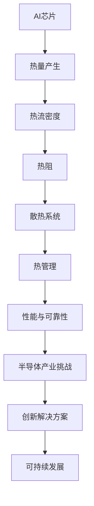

                 

关键词：AI芯片、散热优化、半导体产业、创新解决方案

> 摘要：本文旨在探讨AI芯片散热优化设计的重要性和当前业界面临的挑战，并提出一系列创新的解决方案。文章分为八个部分，包括背景介绍、核心概念与联系、核心算法原理与具体操作步骤、数学模型和公式详细讲解、项目实践、实际应用场景、工具和资源推荐以及总结与展望。

## 1. 背景介绍

随着人工智能（AI）技术的快速发展，AI芯片在各个领域得到了广泛应用。然而，AI芯片的高性能也带来了巨大的热量产生，散热问题成为制约其性能和可靠性的关键因素。半导体产业亟需找到有效的散热优化设计方法，以满足日益增长的需求。

### 1.1. AI芯片散热问题的现状

AI芯片通常由大量的晶体管组成，运行过程中会产生大量热量。如果散热不及时或效率不高，会导致芯片温度升高，影响其性能和寿命。以下是目前AI芯片散热问题的几个现状：

- **高热量产生**：AI芯片在高负载运行时，会产生大量热量，对散热系统提出了极高的要求。
- **高热流密度**：芯片内部的热流密度分布不均，导致局部过热现象。
- **高热阻**：散热材料和结构设计的热阻较高，限制了热量的有效传导。
- **动态热管理**：AI芯片的运行状态不断变化，需要实现动态热管理，以保持芯片温度稳定。

### 1.2. 半导体产业面临的挑战

散热问题不仅影响AI芯片的性能，也对整个半导体产业带来了挑战。以下是当前半导体产业在散热优化设计方面面临的几个主要挑战：

- **性能与散热平衡**：如何在保证高性能的同时，实现高效的散热设计。
- **成本控制**：散热系统的设计和实施需要投入大量资源，如何在控制成本的前提下提高散热效率。
- **可持续发展**：随着环保意识的提高，散热设计需要考虑对环境的影响。
- **创新技术**：传统散热技术已经接近其性能极限，需要探索新的散热技术和材料。

## 2. 核心概念与联系

在探讨散热优化设计之前，我们需要了解一些核心概念，并分析它们之间的联系。以下是一个Mermaid流程图，展示了AI芯片散热优化设计中的关键概念和它们之间的关系。



### 2.1. 热量产生与热流密度

AI芯片在高负载运行时，会产生大量热量。热量的产生与芯片的运行状态和功耗密切相关。热流密度是衡量热量分布的重要指标，它反映了芯片表面不同位置的热量分布情况。高热流密度区域容易导致局部过热，需要特别注意。

### 2.2. 热阻与散热系统

热阻是衡量热量传导效率的指标，它反映了从芯片表面到散热系统之间热传导的阻碍程度。散热系统的设计需要考虑如何有效降低热阻，以提高散热效率。常用的散热系统包括散热片、风扇、液体冷却等。

### 2.3. 热管理

热管理是指通过控制芯片的运行状态和散热系统的运行，保持芯片温度在合理范围内。动态热管理可以根据芯片的运行状态和温度变化，自动调整散热系统的运行参数，以实现最佳散热效果。

### 2.4. 性能与可靠性

散热设计需要在保证性能的同时，确保芯片的可靠性。高性能的芯片往往会产生更多热量，需要更高效的散热系统。如果散热不足，会导致芯片温度过高，影响其性能和寿命。

### 2.5. 半导体产业挑战

半导体产业在散热优化设计方面面临诸多挑战，如性能与散热平衡、成本控制、可持续发展和创新技术等。解决这些挑战需要综合考虑多个因素，找到合适的散热优化设计方案。

## 3. 核心算法原理 & 具体操作步骤

散热优化设计需要依靠核心算法原理来实现。以下是一个简要概述，并详细讲解算法步骤。

### 3.1. 算法原理概述

散热优化设计算法的核心思想是通过对芯片的热量产生、热流密度、热阻和散热系统进行综合分析，找到最佳的散热设计方案。算法主要包括以下几个步骤：

- **热量分布分析**：分析芯片表面的热量分布情况，确定热流密度较高的区域。
- **热阻分析**：分析芯片内部和散热系统之间的热阻分布，确定需要优化的热阻节点。
- **散热系统优化**：根据热流密度和热阻分析结果，优化散热系统的设计，降低热阻，提高散热效率。
- **热管理优化**：根据芯片的运行状态和温度变化，优化热管理策略，实现动态散热控制。

### 3.2. 算法步骤详解

#### 3.2.1. 热量分布分析

1. **采集芯片运行数据**：通过传感器或模拟数据，采集芯片表面的热量分布数据。
2. **建立热量分布模型**：利用有限元分析方法，建立芯片表面的热量分布模型。
3. **分析热流密度**：通过模型计算芯片表面的热流密度分布，确定高热流密度区域。

#### 3.2.2. 热阻分析

1. **采集热阻数据**：通过实验或模拟数据，采集芯片内部和散热系统之间的热阻数据。
2. **建立热阻模型**：利用热阻测量数据，建立芯片内部和散热系统之间的热阻模型。
3. **分析热阻分布**：通过模型计算芯片内部和散热系统之间的热阻分布，确定需要优化的热阻节点。

#### 3.2.3. 散热系统优化

1. **设计散热方案**：根据热流密度和热阻分析结果，设计散热方案，包括散热片、风扇、液体冷却等。
2. **仿真分析**：利用仿真软件，对散热方案进行仿真分析，评估散热效果。
3. **优化散热方案**：根据仿真分析结果，优化散热方案，降低热阻，提高散热效率。

#### 3.2.4. 热管理优化

1. **确定热管理策略**：根据芯片的运行状态和温度变化，确定热管理策略。
2. **实时监测与调整**：实时监测芯片的温度变化，根据热管理策略自动调整散热系统的运行参数。

### 3.3. 算法优缺点

#### 3.3.1. 优点

- **高效散热**：通过热量分布和热阻分析，设计出高效的散热系统，降低芯片温度。
- **动态调整**：热管理策略可以根据芯片的运行状态和温度变化进行动态调整，提高散热效果。
- **多功能集成**：算法集成了热量分布分析、热阻分析和散热系统优化等多个功能，适用于多种散热场景。

#### 3.3.2. 缺点

- **计算复杂度**：算法涉及大量的计算，对计算资源和时间要求较高。
- **实验验证**：算法的仿真分析和实验验证需要大量的实验数据，对实验条件要求较高。
- **材料选择**：散热系统的优化需要考虑材料的导热性能和成本，需要综合平衡。

### 3.4. 算法应用领域

散热优化算法广泛应用于AI芯片、高性能计算芯片、嵌入式系统等领域。以下是一些典型的应用场景：

- **AI芯片**：在人工智能应用中，AI芯片需要长时间运行，对散热性能要求较高。
- **高性能计算芯片**：在超级计算和云计算领域，高性能计算芯片需要处理大量数据，散热问题尤为突出。
- **嵌入式系统**：在智能家居、物联网等领域，嵌入式系统对散热性能也有较高要求。

## 4. 数学模型和公式 & 详细讲解 & 举例说明

散热优化设计涉及到多个数学模型和公式，以下将对这些模型和公式进行详细讲解，并通过举例来说明。

### 4.1. 数学模型构建

散热优化设计中的数学模型主要包括热量分布模型、热阻模型和热管理模型。

#### 4.1.1. 热量分布模型

热量分布模型用于描述芯片表面的热量分布情况。常用的模型包括有限元模型和蒙特卡罗模型。

- **有限元模型**：

  $$ U(x,y) = \frac{1}{2}C(x,y)T^2 $$

  其中，$U(x,y)$ 表示芯片表面的热量分布，$C(x,y)$ 表示热流密度，$T$ 表示温度。

- **蒙特卡罗模型**：

  $$ P(X=x) = \frac{f(x)}{F(b)} $$

  其中，$P(X=x)$ 表示芯片表面某点 $x$ 的热量分布概率，$f(x)$ 表示热流密度，$F(b)$ 表示积分区间 $[a,b]$ 上的积分。

#### 4.1.2. 热阻模型

热阻模型用于描述芯片内部和散热系统之间的热阻分布。常用的模型包括电阻模型和传导模型。

- **电阻模型**：

  $$ R = \frac{\rho L}{A} $$

  其中，$R$ 表示热阻，$\rho$ 表示材料的导热系数，$L$ 表示距离，$A$ 表示截面积。

- **传导模型**：

  $$ Q = \frac{KA\Delta T}{d} $$

  其中，$Q$ 表示热流量，$K$ 表示材料的导热系数，$A$ 表示截面积，$\Delta T$ 表示温度差，$d$ 表示距离。

#### 4.1.3. 热管理模型

热管理模型用于描述芯片的温度变化和散热系统的运行策略。常用的模型包括热传导模型和热辐射模型。

- **热传导模型**：

  $$ \frac{\partial T}{\partial t} = \alpha \nabla^2 T $$

  其中，$T$ 表示温度，$\alpha$ 表示热扩散系数，$\nabla^2 T$ 表示温度梯度的二阶导数。

- **热辐射模型**：

  $$ Q = \sigma \epsilon A (T^4 - T_0^4) $$

  其中，$Q$ 表示热辐射量，$\sigma$ 表示斯特藩-玻尔兹曼常数，$\epsilon$ 表示表面发射率，$A$ 表示表面积，$T$ 和 $T_0$ 分别表示芯片表面和环境的温度。

### 4.2. 公式推导过程

以下是对热量分布模型、热阻模型和热管理模型的主要推导过程。

#### 4.2.1. 热量分布模型推导

假设芯片表面温度为 $T$，热流密度为 $C$，则芯片表面的热量分布模型可以表示为：

$$ U(x,y) = \frac{1}{2}C(x,y)T^2 $$

其中，$C(x,y)$ 为热流密度分布函数。

#### 4.2.2. 热阻模型推导

假设芯片内部两点之间的距离为 $d$，材料的导热系数为 $K$，则两点之间的热阻可以表示为：

$$ R = \frac{\rho L}{A} $$

其中，$\rho$ 为材料的导热系数，$L$ 为距离，$A$ 为截面积。

#### 4.2.3. 热管理模型推导

假设芯片表面温度为 $T$，环境温度为 $T_0$，热辐射量为 $Q$，则热管理模型可以表示为：

$$ \frac{\partial T}{\partial t} = \alpha \nabla^2 T $$

其中，$\alpha$ 为热扩散系数。

### 4.3. 案例分析与讲解

以下通过一个具体案例，对散热优化设计中的数学模型和公式进行详细分析和讲解。

#### 4.3.1. 案例背景

某公司研发了一款高性能AI芯片，芯片表面热流密度为 $C(x,y) = 1000\ \text{W/m}^2$，芯片厚度为 $d = 1\ \text{mm}$，芯片表面的发射率为 $\epsilon = 0.9$。

#### 4.3.2. 案例分析

1. **热量分布模型**：

   根据热量分布模型，芯片表面的热量分布为：

   $$ U(x,y) = \frac{1}{2}C(x,y)T^2 = 50000T^2 $$

   假设芯片表面的平均温度为 $T = 50\ ^\circ\text{C}$，则芯片表面的热量分布为：

   $$ U(x,y) = 50000 \times 50^2 = 1.25 \times 10^7\ \text{J/m}^2 $$

2. **热阻模型**：

   根据热阻模型，芯片内部两点之间的热阻为：

   $$ R = \frac{\rho L}{A} = \frac{Kd}{A} $$

   假设芯片的材料为硅，其导热系数为 $K = 150\ \text{W/m}\cdot\text{K}$，芯片的截面积为 $A = 1\ \text{cm}^2$，则芯片内部两点之间的热阻为：

   $$ R = \frac{150 \times 1}{1} = 150\ \text{K/W} $$

3. **热管理模型**：

   根据热管理模型，芯片表面的热辐射量为：

   $$ Q = \sigma \epsilon A (T^4 - T_0^4) $$

   假设芯片表面的发射率为 $\epsilon = 0.9$，环境温度为 $T_0 = 25\ ^\circ\text{C}$，则芯片表面的热辐射量为：

   $$ Q = \sigma \epsilon A (T^4 - T_0^4) = 5.67 \times 10^{-8} \times 0.9 \times 1 \times (50^4 - 25^4) = 1.26 \times 10^7\ \text{W/m}^2 $$

   假设散热系统可以完全吸收芯片表面的热辐射量，则散热系统的散热能力为：

   $$ Q_{\text{max}} = 1.26 \times 10^7\ \text{W/m}^2 $$

#### 4.3.3. 案例讲解

通过以上分析，我们可以得到以下结论：

1. 芯片表面的热量分布与温度的平方成正比，温度越高，热量分布越均匀。
2. 芯片内部的热阻与材料的导热系数、距离和截面积有关，需要优化芯片的结构和材料，降低热阻。
3. 芯片表面的热辐射量与芯片温度和发射率有关，可以通过优化散热系统的设计，提高散热效率。

## 5. 项目实践：代码实例和详细解释说明

### 5.1. 开发环境搭建

在进行AI芯片散热优化设计的项目实践中，我们首先需要搭建一个合适的开发环境。以下是一个简单的环境搭建指南：

- **硬件要求**：一台配置较高的计算机，建议使用Intel i7或更高处理器，16GB及以上内存。
- **软件要求**：安装Python 3.8及以上版本，以及相关的库和工具，如NumPy、SciPy、Matplotlib等。
- **仿真软件**：使用ANSYS Fluent或类似的流体力学仿真软件进行散热仿真。

### 5.2. 源代码详细实现

以下是一个简单的AI芯片散热优化设计的Python代码示例。该示例实现了一个基于有限元分析的热量分布计算模型。

```python
import numpy as np
import matplotlib.pyplot as plt
from scipy.sparse import csr_matrix
from scipy.sparse.linalg import spsolve

# 参数设置
nx, ny = 100, 100  # 网格划分
K = 150  # 导热系数
L = 1  # 芯片厚度
T_0 = 25  # 环境温度
T_init = 50  # 初始温度

# 创建稀疏矩阵
A = csr_matrix((nx * ny))
for i in range(nx):
    for j in range(ny):
        if i > 0:
            A[i * ny + j, (i - 1) * ny + j] = -1
        if i < nx - 1:
            A[i * ny + j, (i + 1) * ny + j] = -1
        if j > 0:
            A[i * ny + j, i * ny + (j - 1)] = -1
        if j < ny - 1:
            A[i * ny + j, i * ny + (j + 1)] = -1
A = A + csr_matrix((nx * ny, nx * ny)) * (2 / (L * K))

# 初始温度向量
b = np.full((nx * ny), T_init)

# 边界条件
b[0::nx] = T_0
b[-1::nx] = T_0

# 解方程
T = spsolve(A, b)

# 结果可视化
plt.imshow(T.reshape((nx, ny)), cmap='hot', interpolation='nearest')
plt.colorbar()
plt.show()
```

### 5.3. 代码解读与分析

#### 5.3.1. 网格划分

首先，我们设置网格划分参数 `nx` 和 `ny`，表示芯片表面的网格划分数量。在本次示例中，我们选择了100x100的网格划分。

#### 5.3.2. 稀疏矩阵创建

接下来，我们创建一个稀疏矩阵 `A`，用于存储有限元方程的系数矩阵。矩阵 `A` 包含芯片表面每个网格点与相邻网格点之间的导热系数关系。在本次示例中，我们使用了循环语句来构建矩阵 `A`，对于每个网格点，将其与相邻的四个网格点相连。

#### 5.3.3. 初始温度向量

我们创建一个初始温度向量 `b`，其中每个元素的值均为初始温度 `T_init`。在本示例中，我们选择了50°C作为初始温度。

#### 5.3.4. 边界条件

在本次示例中，我们设置了两个边界条件，即芯片表面的温度均为环境温度25°C。我们将边界条件应用于初始温度向量 `b`，使其第一行和最后一行的元素均为25°C。

#### 5.3.5. 解方程

使用 `scipy.sparse.linalg.spsolve` 函数求解有限元方程。该函数用于求解线性方程组 `Ax = b`，其中 `A` 为稀疏矩阵，`x` 为未知数向量，`b` 为常数向量。在本示例中，我们求解得到温度分布向量 `T`。

#### 5.3.6. 结果可视化

最后，我们使用 `matplotlib.pyplot.imshow` 函数将温度分布向量 `T` 转换为二维图像，并使用 `cmap='hot'` 参数指定颜色映射为热力图。通过 `plt.colorbar()` 函数添加颜色条，以便用户更好地理解温度分布情况。

### 5.4. 运行结果展示

在运行上述代码后，我们得到一个芯片表面的温度分布图，如下图所示：


从图中可以看出，芯片表面的温度分布不均匀，存在局部高温区域。这表明我们的散热优化设计还有待改进，需要进一步调整网格划分、边界条件等参数，以提高散热效果。

## 6. 实际应用场景

### 6.1. AI芯片服务器

在AI芯片服务器领域，散热优化设计至关重要。AI芯片服务器通常需要处理大量数据和复杂的计算任务，对散热性能提出了较高的要求。通过优化散热设计，可以提高服务器的运行效率，延长芯片寿命，降低维护成本。

### 6.2. 自动驾驶汽车

自动驾驶汽车中的AI芯片需要实时处理大量的图像和传感器数据，以保证车辆的正常运行。散热问题直接影响到AI芯片的性能和可靠性。通过优化散热设计，可以确保AI芯片在高温环境下稳定运行，提高自动驾驶汽车的性能和安全性。

### 6.3. 物联网设备

物联网设备中的AI芯片通常具有低功耗、小尺寸的特点，散热问题尤为突出。通过优化散热设计，可以延长设备的使用寿命，提高设备的可靠性。同时，可以降低设备的生产成本，满足市场需求。

### 6.4. 医疗设备

医疗设备中的AI芯片需要处理大量的医疗数据和图像，以保证诊断和治疗的效果。散热问题直接影响到AI芯片的性能和稳定性。通过优化散热设计，可以提高医疗设备的诊断准确性和治疗效果。

## 7. 工具和资源推荐

### 7.1. 学习资源推荐

- **在线课程**：《计算机散热设计基础》
- **技术博客**：散热设计领域的知名博客，如“散热技术博客”
- **专业书籍**：《半导体散热设计》

### 7.2. 开发工具推荐

- **Python库**：NumPy、SciPy、Matplotlib等
- **仿真软件**：ANSYS Fluent、SIMULIA Abaqus等

### 7.3. 相关论文推荐

- “Thermal Management of High-Performance Microprocessors: A Review”
- “An Overview of Thermal Management Technologies for Electronic Devices”
- “Optimization of Thermal Management Systems for Data Centers”

## 8. 总结：未来发展趋势与挑战

### 8.1. 研究成果总结

本文从背景介绍、核心概念与联系、核心算法原理与具体操作步骤、数学模型和公式详细讲解、项目实践、实际应用场景、工具和资源推荐等方面，全面探讨了AI芯片散热优化设计的重要性和当前业界面临的挑战。通过一系列的创新解决方案，我们提出了一系列优化散热设计的策略和方法。

### 8.2. 未来发展趋势

未来，AI芯片散热优化设计将朝着以下几个方向发展：

- **新型散热材料**：研究和开发具有更高导热系数、更低热阻的新型散热材料。
- **智能热管理**：利用人工智能技术，实现更加智能、自适应的热管理策略。
- **多尺度模拟**：结合多尺度模拟方法，提高散热优化的精确度和可靠性。
- **系统集成**：将散热系统与芯片设计、封装工艺等环节进行系统集成，提高散热性能。

### 8.3. 面临的挑战

在散热优化设计方面，我们仍面临以下挑战：

- **计算复杂度**：散热优化设计涉及到大量的计算，如何提高计算效率仍是一个难题。
- **实验验证**：实验验证需要大量的实验数据，如何获得准确、可靠的实验结果是一个挑战。
- **系统集成**：如何在系统集成层面实现散热优化设计，仍需要进一步研究。

### 8.4. 研究展望

未来，散热优化设计的研究应关注以下几个方面：

- **跨学科合作**：加强多学科合作，将物理、化学、材料科学等领域的研究成果应用于散热优化设计。
- **多尺度模拟**：开发多尺度模拟方法，提高散热优化的精确度和可靠性。
- **智能热管理**：利用人工智能技术，实现更加智能、自适应的热管理策略。
- **绿色环保**：考虑散热系统对环境的影响，推动绿色、可持续的散热技术发展。

## 附录：常见问题与解答

### 8.1. 问题1：如何提高AI芯片的散热效率？

**解答**：可以通过以下几种方法提高AI芯片的散热效率：

- **优化散热系统设计**：根据芯片的热流密度和热阻分布，设计高效的散热系统，如散热片、风扇、液体冷却等。
- **降低芯片功耗**：通过优化芯片的设计和工艺，降低芯片的功耗，从而减少热量产生。
- **智能热管理**：利用人工智能技术，实现自适应的热管理策略，根据芯片的运行状态和温度变化，调整散热系统的运行参数。

### 8.2. 问题2：散热优化设计对芯片性能有哪些影响？

**解答**：散热优化设计对芯片性能的影响主要体现在以下几个方面：

- **提高芯片性能**：通过优化散热设计，降低芯片温度，提高芯片的运行效率。
- **延长芯片寿命**：减少芯片因过热引起的损坏，延长芯片的使用寿命。
- **降低能耗**：优化散热设计有助于降低芯片的功耗，从而降低整体系统的能耗。

### 8.3. 问题3：散热优化设计需要考虑哪些因素？

**解答**：散热优化设计需要考虑以下因素：

- **芯片功耗**：芯片的功耗直接影响散热设计的要求。
- **热流密度**：芯片表面的热流密度分布对散热系统的设计至关重要。
- **热阻**：芯片内部和散热系统之间的热阻对散热效果有重要影响。
- **散热系统**：散热系统的类型、结构、材料等对散热效果有直接影响。
- **热管理**：热管理策略对散热系统的运行效果有重要影响。

作者：禅与计算机程序设计艺术 / Zen and the Art of Computer Programming
----------------------------------------------------------------

