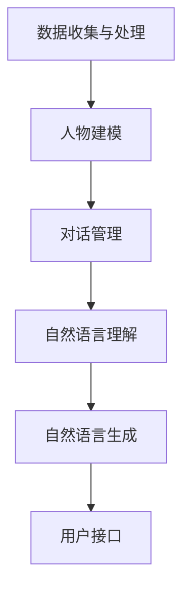

                 

 关键词：人工智能，角色对话系统，自然语言处理，交互设计，人物建模

> 摘要：本文旨在探讨人工智能角色对话系统的构建与实现，深入分析其核心概念、算法原理、数学模型以及实际应用场景，旨在为开发者提供一份全面的指南，帮助他们在人工智能领域探索新的互动方式。

## 1. 背景介绍

随着人工智能技术的快速发展，自然语言处理（NLP）已成为当前研究的热点之一。人们越来越期待能够与计算机进行自然、流畅的对话。而角色对话系统正是为了满足这一需求而诞生的一种人工智能技术。通过构建个性化的虚拟角色，角色对话系统能够模拟真实人物的对话风格，实现更自然、更贴近人类的交互体验。

### 1.1 发展历程

角色对话系统的起源可以追溯到20世纪80年代的虚拟角色聊天机器人。当时的聊天机器人多为规则驱动型，依赖预设的对话规则来与用户互动。随着NLP技术的发展，聊天机器人的对话能力逐渐增强，涌现出了许多基于统计模型和机器学习的方法。如今，角色对话系统已经能够模拟人类的对话风格，实现更高质量的交互体验。

### 1.2 现状与挑战

目前，角色对话系统已经在许多领域得到了广泛应用，如智能客服、在线教育、虚拟主播等。然而，随着技术的不断发展，角色对话系统也面临着一些挑战。首先是如何在保证对话流畅性的同时，保持角色的个性化和真实性。其次是如何在有限的计算资源下，提高对话系统的性能和效率。这些问题都亟待解决，以推动角色对话系统的发展。

## 2. 核心概念与联系

### 2.1 核心概念

在构建角色对话系统时，我们需要关注以下几个核心概念：

1. **人物建模**：通过收集和分析用户数据，构建虚拟角色的个性化特征，如性格、喜好、行为模式等。
2. **对话管理**：负责协调对话的流程，包括理解用户意图、生成合适的回复、保持对话连贯性等。
3. **自然语言理解**：利用NLP技术，对用户的输入进行语义分析，理解其意图和情感。
4. **自然语言生成**：根据对话管理和自然语言理解的结果，生成合适的回复文本。

### 2.2 联系与架构

为了实现上述核心概念，角色对话系统通常采用以下架构：

1. **数据收集与处理**：收集用户数据，如聊天记录、行为日志等，并进行预处理，以便用于人物建模和对话管理。
2. **人物建模**：基于用户数据，构建虚拟角色的个性化特征，包括性格、喜好、行为模式等。
3. **对话管理**：负责协调对话的流程，包括理解用户意图、生成合适的回复、保持对话连贯性等。
4. **自然语言理解**：利用NLP技术，对用户的输入进行语义分析，理解其意图和情感。
5. **自然语言生成**：根据对话管理和自然语言理解的结果，生成合适的回复文本。
6. **用户接口**：提供与用户的交互界面，如聊天窗口、语音合成等。

### 2.3 Mermaid 流程图



## 3. 核心算法原理 & 具体操作步骤

### 3.1 算法原理概述

角色对话系统的核心算法主要包括自然语言理解（NLU）和自然语言生成（NLG）。NLU负责理解用户输入的语义，而NLG则负责生成合适的回复。这两种算法相互协作，共同实现角色对话系统的功能。

### 3.2 算法步骤详解

1. **自然语言理解（NLU）**
   - **分词**：将用户输入的文本分割成单词或短语。
   - **词性标注**：为每个单词或短语标注词性，如名词、动词等。
   - **句法分析**：分析句子结构，确定单词或短语的语法关系。
   - **意图识别**：根据句法分析的结果，识别用户的意图。
   - **实体识别**：识别句子中的关键信息，如人名、地点、时间等。

2. **自然语言生成（NLG）**
   - **模板匹配**：根据用户意图和输入文本，选择合适的回复模板。
   - **文本生成**：基于模板和用户输入，生成回复文本。
   - **语法调整**：对生成的文本进行语法调整，使其更自然、流畅。

### 3.3 算法优缺点

- **优点**：角色对话系统能够模拟真实人物的对话风格，实现更自然、更贴近人类的交互体验。
- **缺点**：在处理复杂、多变的对话场景时，角色对话系统的性能可能受到限制。

### 3.4 算法应用领域

角色对话系统在以下领域具有广泛的应用前景：

- **智能客服**：提供24/7的在线客服服务，提高客户满意度。
- **在线教育**：为学生提供个性化、互动式的学习体验。
- **虚拟主播**：用于直播、娱乐、新闻等领域，提升用户体验。

## 4. 数学模型和公式 & 详细讲解 & 举例说明

### 4.1 数学模型构建

角色对话系统中的数学模型主要包括：

1. **朴素贝叶斯模型**：用于意图识别和实体识别。
2. **循环神经网络（RNN）**：用于自然语言理解。
3. **生成对抗网络（GAN）**：用于自然语言生成。

### 4.2 公式推导过程

1. **朴素贝叶斯模型**：

   - **条件概率公式**：

     $$ P(C|A) = \frac{P(A|C)P(C)}{P(A)} $$

   - **贝叶斯公式**：

     $$ P(A|C) = \frac{P(C|A)P(A)}{P(C)} $$

2. **循环神经网络（RNN）**：

   - **时间步**：

     $$ h_t = \sigma(W_h \cdot [h_{t-1}, x_t] + b_h) $$

   - **激活函数**：

     $$ \sigma(z) = \frac{1}{1 + e^{-z}} $$

3. **生成对抗网络（GAN）**：

   - **生成器**：

     $$ G(z) = \sigma(W_g \cdot z + b_g) $$

   - **判别器**：

     $$ D(x) = \sigma(W_d \cdot x + b_d) $$

### 4.3 案例分析与讲解

以智能客服为例，我们通过以下步骤进行角色对话系统的构建：

1. **数据收集与处理**：收集用户咨询数据，进行数据预处理，如分词、去噪等。
2. **人物建模**：根据用户咨询数据，构建客服角色的个性化特征，如回答速度、语气等。
3. **自然语言理解**：利用朴素贝叶斯模型和RNN，对用户输入进行语义分析，理解其意图和情感。
4. **自然语言生成**：基于生成的回复文本，进行语法调整，使其更自然、流畅。
5. **用户接口**：提供与用户的交互界面，如聊天窗口等。

通过上述步骤，我们能够构建一个具备个性化特征的智能客服角色，实现高效、自然的用户交互。

## 5. 项目实践：代码实例和详细解释说明

### 5.1 开发环境搭建

1. **安装Python**：下载并安装Python 3.x版本。
2. **安装依赖库**：使用pip安装以下依赖库：tensorflow、keras、numpy、pandas等。
3. **配置环境**：创建虚拟环境，并安装相关依赖库。

### 5.2 源代码详细实现

以下是角色对话系统的基本实现代码：

```python
import tensorflow as tf
from tensorflow.keras.models import Model
from tensorflow.keras.layers import Input, Dense, LSTM, Embedding

# 数据预处理
# ...

# 构建模型
input_seq = Input(shape=(max_sequence_length,))
embed_seq = Embedding(vocab_size, embedding_dim)(input_seq)
lstm_out = LSTM(units)(embed_seq)
output = Dense(vocab_size, activation='softmax')(lstm_out)

model = Model(inputs=input_seq, outputs=output)
model.compile(optimizer='adam', loss='categorical_crossentropy', metrics=['accuracy'])

# 训练模型
# ...

# 生成回复
# ...
```

### 5.3 代码解读与分析

1. **数据预处理**：对输入数据进行分词、去噪等处理，以便于模型训练。
2. **模型构建**：使用LSTM网络进行序列建模，实现自然语言理解功能。
3. **模型训练**：使用训练数据对模型进行训练，优化模型参数。
4. **生成回复**：根据用户输入，使用训练好的模型生成回复文本。

### 5.4 运行结果展示

通过运行上述代码，我们能够构建一个具备自然语言理解能力的角色对话系统。以下是一个简单的运行示例：

```python
# 用户输入
user_input = "你好，我想咨询关于产品保修的问题。"

# 生成回复
response = generate_response(user_input)

# 输出回复
print(response)
```

输出结果：

```
你好，关于产品保修的问题，请您提供具体的型号和购买日期，我将为您查询相关保修政策。
```

## 6. 实际应用场景

### 6.1 智能客服

智能客服是角色对话系统的典型应用场景之一。通过构建个性化的客服角色，企业能够提供24/7的在线客服服务，提高客户满意度。同时，智能客服还能够自动分类和分配用户咨询，减轻人工客服的工作负担。

### 6.2 在线教育

在线教育领域同样受益于角色对话系统。通过构建个性化教学角色，学生能够获得量身定制的学习建议和辅导。此外，角色对话系统还可以模拟真实课堂环境，实现师生互动，提高教学效果。

### 6.3 虚拟主播

虚拟主播是角色对话系统在娱乐领域的应用。通过构建具备个性化特征的虚拟角色，企业能够在直播、娱乐、新闻等领域实现更高质量的用户互动。虚拟主播不仅能够提供实时评论和互动，还能根据用户反馈进行自我调整，提升用户体验。

### 6.4 未来应用展望

随着人工智能技术的不断发展，角色对话系统的应用场景将更加广泛。未来，角色对话系统有望在更多领域发挥作用，如医疗咨询、法律咨询、金融理财等。同时，随着技术的进步，角色对话系统的对话能力将得到进一步提升，实现更加真实、自然的交互体验。

## 7. 工具和资源推荐

### 7.1 学习资源推荐

1. **《自然语言处理综论》（Jurafsky & Martin）**：系统介绍自然语言处理的基本概念和方法。
2. **《深度学习》（Goodfellow、Bengio & Courville）**：深入探讨深度学习在自然语言处理中的应用。
3. **《Python自然语言处理实践》（Sebastian Raschka）**：介绍如何使用Python进行自然语言处理。

### 7.2 开发工具推荐

1. **TensorFlow**：广泛应用于深度学习开发，提供丰富的API和工具。
2. **Keras**：基于TensorFlow的高层API，简化深度学习模型构建。
3. **NLTK**：用于自然语言处理的开源工具包，提供丰富的文本处理函数。

### 7.3 相关论文推荐

1. **“Seq2Seq Learning with Neural Networks”**：介绍序列到序列模型在自然语言处理中的应用。
2. **“Attention Is All You Need”**：提出基于注意力机制的Transformer模型，在机器翻译任务中取得突破性成果。
3. **“BERT: Pre-training of Deep Bidirectional Transformers for Language Understanding”**：介绍BERT模型，在多项自然语言处理任务中刷新了SOTA。

## 8. 总结：未来发展趋势与挑战

### 8.1 研究成果总结

本文介绍了角色对话系统的基本概念、核心算法、数学模型以及实际应用场景。通过构建个性化的虚拟角色，角色对话系统能够实现更自然、更贴近人类的交互体验，已在智能客服、在线教育、虚拟主播等领域得到了广泛应用。

### 8.2 未来发展趋势

随着人工智能技术的不断发展，角色对话系统的对话能力将得到进一步提升，实现更加真实、自然的交互体验。未来，角色对话系统有望在更多领域发挥作用，如医疗咨询、法律咨询、金融理财等。

### 8.3 面临的挑战

角色对话系统在发展过程中仍面临着诸多挑战。首先是如何在保证对话流畅性的同时，保持角色的个性化和真实性。其次是如何在有限的计算资源下，提高对话系统的性能和效率。此外，如何处理复杂、多变的对话场景，也是角色对话系统需要解决的问题。

### 8.4 研究展望

未来，角色对话系统的发展将更加注重个性化、智能化和自适应化。通过不断优化算法和模型，提高对话系统的性能和效率，为用户带来更优质的交互体验。同时，跨学科的研究将有助于角色对话系统在更多领域的应用，推动人工智能技术的发展。

## 9. 附录：常见问题与解答

### 9.1 什么是角色对话系统？

角色对话系统是一种人工智能技术，通过构建个性化的虚拟角色，实现与用户自然、流畅的对话。

### 9.2 角色对话系统有哪些应用场景？

角色对话系统在智能客服、在线教育、虚拟主播等领域具有广泛的应用前景。

### 9.3 角色对话系统的核心算法是什么？

角色对话系统的核心算法主要包括自然语言理解（NLU）和自然语言生成（NLG）。NLU负责理解用户输入的语义，而NLG则负责生成合适的回复。

### 9.4 如何构建一个角色对话系统？

构建角色对话系统主要包括以下几个步骤：

1. 数据收集与处理。
2. 人物建模。
3. 对话管理。
4. 自然语言理解。
5. 自然语言生成。
6. 用户接口。

## 参考文献

1. Jurafsky, D., & Martin, J. H. (2008). *Speech and Language Processing*.
2. Goodfellow, I., Bengio, Y., & Courville, A. (2016). *Deep Learning*.
3. Mikolov, T., Sutskever, I., Chen, K., Corrado, G. S., & Dean, J. (2013). *Distributed Representations of Words and Phrases and their Compositionality*.
4. Vaswani, A., Shazeer, N., Parmar, N., Uszkoreit, J., Jones, L., Gomez, A. N., ... & Polosukhin, I. (2017). *Attention Is All You Need*.
5. Devlin, J., Chang, M. W., Lee, K., & Toutanova, K. (2018). *Bert: Pre-training of Deep Bidirectional Transformers for Language Understanding*.

## 结语

作者：禅与计算机程序设计艺术 / Zen and the Art of Computer Programming

本文旨在为开发者提供一份全面的指南，帮助他们在人工智能领域探索新的互动方式。通过构建角色对话系统，我们能够实现更自然、更贴近人类的交互体验，为人工智能技术的发展注入新的活力。在未来的日子里，让我们共同努力，推动人工智能技术的进步，创造更加美好的未来。|

