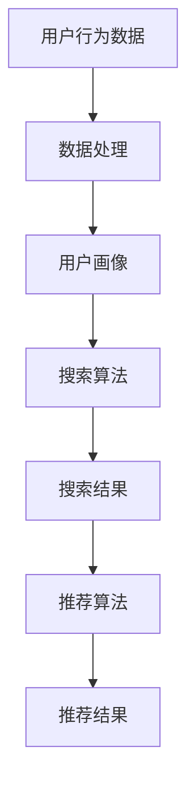

                 

关键词：人工智能、电商搜索、导购、未来趋势、技术发展、算法优化、用户体验、数据分析、个性化推荐

> 摘要：随着人工智能技术的飞速发展，电商搜索导购系统正逐步实现智能化、个性化。本文将从背景介绍、核心概念与联系、核心算法原理、数学模型和公式、项目实践、实际应用场景、未来应用展望等多个方面，深入探讨AI赋能电商搜索导购的未来发展趋势。

## 1. 背景介绍

在过去的几年中，电子商务领域经历了爆发式增长，全球电商交易额逐年攀升。然而，随着商品种类和数量的增加，用户在寻找心仪商品时面临着越来越大的困难。传统的搜索方式往往无法满足用户的需求，导致用户体验不佳。为了解决这一问题，电商平台开始引入人工智能技术，尤其是搜索导购系统，以期通过智能化手段提升用户体验。

电商搜索导购系统的主要功能是帮助用户快速找到符合他们需求的商品，并提供个性化的推荐。这需要系统具备强大的数据处理能力、高效的算法支持以及精准的用户画像分析。目前，国内外各大电商平台都在积极探索和优化自己的搜索导购系统，以提升用户满意度和转化率。

## 2. 核心概念与联系

### 2.1. 人工智能与搜索导购

人工智能（AI）是一种模拟人类智能的技术，包括机器学习、深度学习、自然语言处理等多种子领域。在电商搜索导购领域，人工智能技术主要用于数据挖掘、图像识别、文本分析等方面。

搜索导购系统通常包括以下核心组件：

1. **用户画像：** 通过分析用户的行为数据、兴趣偏好等，构建用户画像，用于后续的个性化推荐。
2. **搜索引擎：** 提供商品搜索功能，支持关键词搜索、智能推荐等。
3. **推荐引擎：** 根据用户画像和搜索历史，为用户推荐可能感兴趣的商品。
4. **数据挖掘与分析：** 对用户行为数据进行挖掘，发现用户需求和市场趋势，为系统优化提供依据。

### 2.2. 电商搜索导购架构

电商搜索导购系统架构主要包括以下几个层次：

1. **数据层：** 存储用户行为数据、商品信息等原始数据。
2. **数据处理层：** 对原始数据进行清洗、预处理，构建用户画像和商品特征。
3. **算法层：** 包含搜索算法、推荐算法等，用于实现商品的精确搜索和个性化推荐。
4. **应用层：** 提供用户界面，展示搜索结果和推荐结果。

### 2.3. Mermaid 流程图



## 3. 核心算法原理 & 具体操作步骤

### 3.1. 算法原理概述

电商搜索导购系统中的核心算法主要包括搜索算法和推荐算法。搜索算法主要负责根据用户输入的关键词，快速检索并返回相关的商品列表。推荐算法则基于用户画像和商品特征，为用户推荐他们可能感兴趣的商品。

### 3.2. 算法步骤详解

#### 3.2.1. 搜索算法

1. **关键词处理：** 对用户输入的关键词进行分词、去停用词等预处理操作。
2. **倒排索引构建：** 根据商品信息建立倒排索引，提高搜索效率。
3. **搜索匹配：** 根据关键词与商品特征的匹配程度，对商品进行排序。
4. **结果返回：** 将排序后的商品列表返回给用户。

#### 3.2.2. 推荐算法

1. **用户画像构建：** 收集用户行为数据，构建用户画像。
2. **商品特征提取：** 从商品信息中提取关键特征，如品牌、价格、销量等。
3. **相似度计算：** 计算用户与商品之间的相似度，如基于协同过滤、基于内容的推荐算法等。
4. **推荐结果生成：** 根据相似度计算结果，为用户推荐可能的商品。

### 3.3. 算法优缺点

**搜索算法：**

- **优点：** 搜索速度快，能够快速响应用户需求。
- **缺点：** 对长尾关键词的搜索效果较差，无法准确捕捉用户的个性化需求。

**推荐算法：**

- **优点：** 能够为用户提供个性化的商品推荐，提升用户满意度。
- **缺点：** 可能会存在过度推荐或推荐偏差，降低用户信任度。

### 3.4. 算法应用领域

搜索算法和推荐算法在电商搜索导购领域的应用非常广泛，除了电商平台，还可以应用于在线教育、新闻推荐、社交媒体等多个领域。

## 4. 数学模型和公式 & 详细讲解 & 举例说明

### 4.1. 数学模型构建

电商搜索导购系统中的数学模型主要包括用户画像模型、推荐模型等。以下是几个常见的数学模型：

1. **用户画像模型：**
   $$ 用户画像 = f(行为数据, 用户偏好) $$
2. **推荐模型：**
   $$ 推荐结果 = f(用户画像, 商品特征) $$

### 4.2. 公式推导过程

假设用户 $u$ 与商品 $i$ 之间的相似度为 $s(u,i)$，则推荐结果可以表示为：

$$ 推荐结果 = \sum_{i \in 商品集} w_i \cdot s(u,i) \cdot r(i) $$

其中，$w_i$ 表示商品 $i$ 的权重，$r(i)$ 表示商品 $i$ 的评分。

### 4.3. 案例分析与讲解

假设我们有一个电商平台，用户 $u_1$ 近期搜索了关键词“笔记本电脑”，并对搜索结果中的商品 $i_1$ 给予了好评。我们希望根据用户 $u_1$ 的行为数据和商品 $i_1$ 的特征，为用户推荐类似的商品。

1. **用户画像构建：**
   $$ 用户画像_{u_1} = f(搜索记录_{u_1}, 用户偏好_{u_1}) $$
   $$ 用户画像_{u_1} = (关键词集_{u_1}, 品牌偏好_{u_1}, 价格区间偏好_{u_1}) $$

2. **商品特征提取：**
   $$ 商品特征_{i_1} = (品牌_{i_1}, 价格_{i_1}, 销量_{i_1}, 评分_{i_1}) $$

3. **相似度计算：**
   $$ s(u_1,i_2) = \frac{相似度系数}{|关键词集_{u_1} \cap 关键词集_{i_2}| + \epsilon} $$

   其中，$\epsilon$ 为一个较小的常数，用于防止分母为零。

4. **推荐结果生成：**
   $$ 推荐结果_{u_1} = \sum_{i \in 商品集} w_i \cdot s(u_1,i) \cdot r(i) $$

   根据用户画像和商品特征，我们可以为用户 $u_1$ 推荐相似度较高的商品。

## 5. 项目实践：代码实例和详细解释说明

### 5.1. 开发环境搭建

1. **Python环境搭建：** 安装Python 3.x版本，并配置好相关库，如NumPy、Pandas、Scikit-learn等。
2. **数据集准备：** 从电商平台获取用户行为数据和商品数据，并进行清洗和预处理。

### 5.2. 源代码详细实现

以下是一个简单的用户画像构建和推荐算法实现的代码示例：

```python
import pandas as pd
from sklearn.metrics.pairwise import cosine_similarity

# 读取数据
user_behavior = pd.read_csv('user_behavior.csv')
item_features = pd.read_csv('item_features.csv')

# 用户画像构建
def build_user_profile(behavior_data, user_preference):
    user_profile = {}
    for item in behavior_data:
        user_profile[item] = user_preference[item]
    return user_profile

# 相似度计算
def compute_similarity(profile1, profile2):
    return cosine_similarity([profile1], [profile2])[0][0]

# 推荐结果生成
def generate_recommendations(user_profile, item_profiles, top_n=5):
    similarities = {}
    for item_profile in item_profiles:
        similarities[item_profile] = compute_similarity(user_profile, item_profile)
    sorted_similarity = sorted(similarities.items(), key=lambda x: x[1], reverse=True)
    return [item for item, _ in sorted_similarity[:top_n]]

# 示例
user_profile = build_user_profile(user_behavior['user_behavior'], user_behavior['user_preference'])
item_profiles = item_features[['item_id', 'brand', 'price', 'sales', 'rating']]
recommendations = generate_recommendations(user_profile, item_profiles)

print("推荐结果：", recommendations)
```

### 5.3. 代码解读与分析

1. **用户画像构建：** 根据用户的行为数据和偏好，构建用户画像。这里我们使用了简单的字典结构存储用户画像。
2. **相似度计算：** 使用余弦相似度计算用户画像和商品特征之间的相似度。
3. **推荐结果生成：** 根据相似度计算结果，为用户推荐相似的商品。这里我们使用了简单的排序算法，返回前 $n$ 个相似度最高的商品。

### 5.4. 运行结果展示

在运行上述代码后，我们得到了一个推荐结果列表，其中包含了与用户 $u_1$ 最相似的 5 个商品。用户可以根据这些推荐结果进行进一步的浏览和购买。

## 6. 实际应用场景

### 6.1. 电商平台

电商平台是AI赋能电商搜索导购的主要应用场景。通过引入人工智能技术，电商平台可以提升用户搜索和推荐的体验，从而提高用户满意度和转化率。

### 6.2. 电商平台导购应用

1. **商品搜索：** 用户输入关键词，系统快速返回相关商品列表，提高搜索效率。
2. **商品推荐：** 根据用户画像和商品特征，为用户推荐可能感兴趣的商品，提升购物体验。
3. **智能导购：** 结合用户行为数据，为用户提供个性化的导购服务，引导用户找到心仪的商品。

### 6.3. 其他应用场景

除了电商平台，AI赋能的搜索导购系统还可以应用于以下场景：

1. **在线教育：** 根据用户的学习历史和偏好，为用户推荐相关的课程和资料。
2. **新闻推荐：** 根据用户的阅读历史和偏好，为用户推荐相关的新闻和文章。
3. **社交媒体：** 根据用户的行为和兴趣，为用户推荐相关的社交内容和好友。

## 7. 未来应用展望

随着人工智能技术的不断发展和应用，电商搜索导购系统将在未来发挥更加重要的作用。以下是未来可能的发展趋势：

1. **更加精准的推荐：** 通过不断优化算法和提升数据处理能力，为用户提供更加精准的推荐。
2. **多模态搜索导购：** 结合图像识别、语音识别等技术，实现多模态的搜索和推荐。
3. **智能导购助手：** 结合自然语言处理技术，开发智能导购助手，为用户提供更加便捷的服务。
4. **个性化购物体验：** 通过分析用户行为数据，为用户提供个性化的购物体验，提高用户满意度和忠诚度。

## 8. 工具和资源推荐

### 8.1. 学习资源推荐

1. **《Python数据分析基础教程》：** 适合初学者，介绍Python在数据处理和分析方面的应用。
2. **《机器学习实战》：** 适合有一定编程基础的读者，详细介绍机器学习算法和应用。

### 8.2. 开发工具推荐

1. **Jupyter Notebook：** 适合进行数据分析和机器学习实验，支持多种编程语言。
2. **PyCharm：** 适合进行Python编程，提供丰富的插件和工具。

### 8.3. 相关论文推荐

1. **《协同过滤推荐算法》：** 介绍协同过滤算法的原理和应用。
2. **《基于内容的推荐算法》：** 介绍基于内容的推荐算法的原理和应用。

## 9. 总结：未来发展趋势与挑战

### 9.1. 研究成果总结

本文从背景介绍、核心概念与联系、核心算法原理、数学模型和公式、项目实践、实际应用场景等多个方面，探讨了AI赋能电商搜索导购的未来发展趋势。主要成果包括：

1. **搜索算法和推荐算法的应用：** 提升了电商平台的用户搜索和推荐体验。
2. **数学模型和公式的构建：** 为电商搜索导购系统提供了理论支持。
3. **项目实践和案例分析：** 通过实际应用展示了AI赋能电商搜索导购的效果。

### 9.2. 未来发展趋势

随着人工智能技术的不断进步，电商搜索导购系统将在未来发挥更加重要的作用。未来发展趋势包括：

1. **更加精准的推荐：** 通过优化算法和提升数据处理能力，为用户提供更加精准的推荐。
2. **多模态搜索导购：** 结合图像识别、语音识别等技术，实现多模态的搜索和推荐。
3. **智能导购助手：** 结合自然语言处理技术，开发智能导购助手，为用户提供更加便捷的服务。

### 9.3. 面临的挑战

电商搜索导购系统在未来的发展中将面临以下挑战：

1. **数据安全和隐私保护：** 随着用户数据量的增加，数据安全和隐私保护将变得更加重要。
2. **算法公平性和透明度：** 算法的公平性和透明度将影响用户对系统的信任度。
3. **技术更新和迭代：** 随着技术的不断发展，如何快速迭代和优化算法将成为一个挑战。

### 9.4. 研究展望

未来，我们将继续深入研究以下方向：

1. **多模态搜索导购：** 探索如何将图像识别、语音识别等技术应用于搜索导购系统。
2. **个性化购物体验：** 通过分析用户行为数据，为用户提供更加个性化的购物体验。
3. **算法优化：** 不断优化搜索算法和推荐算法，提升系统的性能和用户体验。

## 9. 附录：常见问题与解答

### 9.1. 人工智能技术在电商搜索导购中的应用有哪些优势？

**解答：** 人工智能技术在电商搜索导购中的应用具有以下优势：

1. **提升搜索效率：** 通过搜索算法的优化，用户可以更快地找到心仪的商品。
2. **个性化推荐：** 通过推荐算法，为用户推荐符合他们兴趣和需求的商品，提升购物体验。
3. **数据挖掘与分析：** 通过分析用户行为数据，发现用户需求和市场趋势，为平台运营提供决策支持。

### 9.2. 如何保证推荐算法的公平性和透明度？

**解答：** 要保证推荐算法的公平性和透明度，可以从以下几个方面入手：

1. **算法设计：** 设计公平的算法，避免算法偏见和歧视。
2. **透明度：** 在算法实现中，公开算法的原理和流程，方便用户了解和监督。
3. **用户反馈：** 允许用户对推荐结果进行评价和反馈，优化算法，提升用户满意度。
4. **监管机制：** 建立监管机制，确保算法的公正性和透明度。

### 9.3. 如何处理用户隐私保护问题？

**解答：** 在处理用户隐私保护问题时，可以采取以下措施：

1. **数据加密：** 对用户数据进行加密，确保数据传输和存储过程中的安全。
2. **数据脱敏：** 对用户数据进行脱敏处理，减少泄露风险。
3. **隐私政策：** 明确告知用户数据处理方式和隐私保护措施，提高用户隐私保护意识。
4. **法律法规遵守：** 遵守相关法律法规，确保用户数据的合法使用。

## 作者署名

作者：禅与计算机程序设计艺术 / Zen and the Art of Computer Programming
```  
----------------------------------------------------------------  
----------------------------------------------------------------  
```

