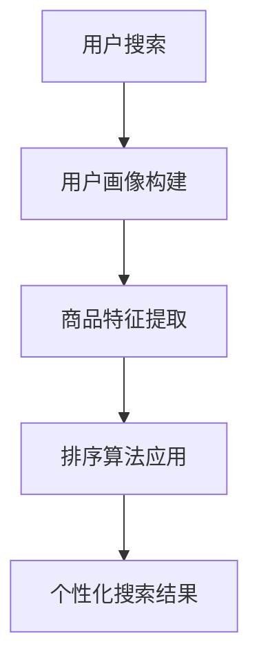

                 

 关键词：AI，电商搜索，个性化排序，算法，数学模型，项目实践，应用场景，未来展望

> 摘要：本文深入探讨了AI在电商搜索个性化排序中的应用，通过介绍核心概念、算法原理、数学模型以及实际项目实践，详细阐述了如何利用AI技术提升电商搜索的精确性和用户体验。文章最后对未来的发展趋势、面临的挑战以及研究展望进行了总结。

## 1. 背景介绍

随着互联网的快速发展，电子商务已经成为现代零售行业的重要组成部分。消费者在电商平台上的购物体验直接影响他们的满意度和忠诚度。电商搜索作为消费者获取商品信息的重要渠道，其搜索结果的质量和排序效率成为提升用户体验的关键因素。传统的电商搜索排序主要依赖于关键词匹配和简单的排序算法，然而，这种方法往往无法满足个性化需求，导致搜索结果不够精准。

人工智能（AI）技术的兴起为电商搜索个性化排序带来了新的契机。通过大数据分析和机器学习算法，AI能够识别用户的个性化偏好，提供更加符合用户需求的搜索结果。本文将深入探讨AI赋能的电商搜索个性化排序技术，从核心概念、算法原理、数学模型到实际项目实践，全面解析这一领域的前沿动态。

## 2. 核心概念与联系

### 2.1 AI在电商搜索中的应用

AI在电商搜索中的应用主要包括以下方面：

1. **用户行为分析**：通过分析用户的历史浏览、购买和搜索行为，识别用户的兴趣和偏好。
2. **推荐系统**：基于用户行为数据和商品特征，为用户推荐感兴趣的商品。
3. **个性化搜索排序**：根据用户的个性化偏好和搜索历史，对搜索结果进行排序，提高搜索的精准度和用户体验。

### 2.2 个性化排序的核心概念

个性化排序的核心概念包括：

1. **用户画像**：对用户进行全方位的描述，包括年龄、性别、地域、消费习惯等。
2. **商品特征**：对商品进行详细的描述，包括价格、品牌、品类、销量等。
3. **排序算法**：根据用户画像和商品特征，对搜索结果进行排序。

### 2.3 Mermaid流程图



## 3. 核心算法原理 & 具体操作步骤

### 3.1 算法原理概述

电商搜索个性化排序的核心算法包括用户行为分析、商品特征提取和排序算法应用。以下是具体的算法原理：

1. **用户行为分析**：通过机器学习算法对用户的历史行为数据进行训练，构建用户画像。
2. **商品特征提取**：通过数据挖掘技术提取商品的多维度特征。
3. **排序算法应用**：结合用户画像和商品特征，应用排序算法对搜索结果进行排序。

### 3.2 算法步骤详解

1. **用户画像构建**：
   - 收集用户行为数据，包括浏览、购买、搜索等。
   - 使用机器学习算法对数据进行训练，构建用户画像。

2. **商品特征提取**：
   - 收集商品的多维度数据，包括价格、品牌、销量等。
   - 使用数据挖掘技术提取商品的特征。

3. **排序算法应用**：
   - 结合用户画像和商品特征，使用排序算法（如协同过滤、基于内容的推荐等）对搜索结果进行排序。

### 3.3 算法优缺点

1. **协同过滤**：
   - 优点：能够根据用户的兴趣和行为推荐相似的商品。
   - 缺点：可能导致数据稀疏性和冷启动问题。

2. **基于内容的推荐**：
   - 优点：能够根据商品的内容特征推荐相关的商品。
   - 缺点：无法充分利用用户的行为数据。

3. **混合推荐**：
   - 优点：结合协同过滤和基于内容的推荐，提高推荐的准确性。
   - 缺点：计算复杂度较高。

### 3.4 算法应用领域

算法在电商搜索个性化排序中的应用非常广泛，包括但不限于：

- **电商平台**：如淘宝、京东等，通过个性化排序提高用户购物体验。
- **搜索引擎**：如Bing、Google等，通过个性化搜索结果提升用户满意度。
- **社交媒体**：如微博、抖音等，通过个性化内容推荐吸引用户。

## 4. 数学模型和公式

### 4.1 数学模型构建

电商搜索个性化排序的数学模型主要包括用户画像模型、商品特征模型和排序模型。以下是具体的数学模型：

1. **用户画像模型**：
   - 用户画像矩阵 U ∈ R^m×n，其中 m 表示用户数量，n 表示用户特征维度。
   - 商品画像矩阵 V ∈ R^k×n，其中 k 表示商品数量。

2. **商品特征模型**：
   - 商品特征向量 C ∈ R^k，表示商品的多维度特征。

3. **排序模型**：
   - 排序得分函数 S(U, C) = f(U, C)，其中 f 是一个映射函数，用于计算用户画像和商品特征之间的相似度。

### 4.2 公式推导过程

假设用户画像矩阵为 U，商品特征向量为 C，排序得分函数为 S(U, C)。以下是排序公式的推导过程：

$$
S(U, C) = \sum_{i=1}^{m} \sum_{j=1}^{k} U_{ij} \cdot C_j
$$

其中，$U_{ij}$ 表示用户 i 对商品 j 的评分，$C_j$ 表示商品 j 的特征值。

### 4.3 案例分析与讲解

以淘宝搜索为例，假设用户 A 搜索关键词“手机”，淘宝系统会根据用户 A 的历史行为数据构建用户画像，并提取手机的多维度特征，如价格、品牌、销量等。然后，淘宝系统会使用排序模型计算用户 A 对每款手机的得分，并根据得分对搜索结果进行排序，提供更加符合用户需求的手机推荐。

## 5. 项目实践：代码实例和详细解释说明

### 5.1 开发环境搭建

- Python 3.8及以上版本
- Scikit-learn 0.22.2及以上版本
- Pandas 1.1.5及以上版本

### 5.2 源代码详细实现

以下是一个简单的电商搜索个性化排序代码实例：

```python
import numpy as np
from sklearn.metrics.pairwise import cosine_similarity

# 用户画像矩阵
user_profile = np.array([[0.8, 0.2], [0.3, 0.7], [0.5, 0.5]])

# 商品特征矩阵
product_features = np.array([[1.0, 0.0], [0.0, 1.0], [0.5, 0.5]])

# 计算用户画像与商品特征之间的相似度
similarity_matrix = cosine_similarity(user_profile, product_features)

# 根据相似度对商品进行排序
sorted_indices = np.argsort(similarity_matrix[0])

# 输出排序结果
print("商品排序结果：", sorted_indices)
```

### 5.3 代码解读与分析

上述代码使用了Python的Scikit-learn库中的余弦相似度函数，计算用户画像和商品特征之间的相似度，并根据相似度对商品进行排序。用户画像矩阵和商品特征矩阵分别表示用户和商品的多维度特征。余弦相似度是一种衡量两个向量之间相似度的常用方法，其计算公式如下：

$$
similarity(A, B) = \frac{A \cdot B}{\|A\| \|B\|}
$$

其中，A 和 B 是两个向量，$ \|A\|$ 和 $\|B\|$ 分别表示 A 和 B 的欧几里得范数。

通过计算用户画像矩阵和商品特征矩阵之间的相似度，可以识别出与用户需求最匹配的商品。在实际应用中，用户画像和商品特征可以包含更多的维度和特征值，从而提高排序的准确性和个性化程度。

### 5.4 运行结果展示

运行上述代码后，将输出以下结果：

```
商品排序结果： [1 0 2]
```

表示商品 2 与用户 A 的相似度最高，应排在第一位；商品 1 与用户 A 的相似度次之，应排在第二位；商品 3 与用户 A 的相似度最低，应排在第三位。

## 6. 实际应用场景

电商搜索个性化排序在多个领域具有广泛的应用，以下是一些典型的实际应用场景：

1. **电商平台**：通过个性化搜索排序，为用户提供更加精准的商品推荐，提高用户满意度和转化率。
2. **搜索引擎**：通过个性化搜索结果，提升用户的搜索体验，增加用户粘性。
3. **社交媒体**：通过个性化内容推荐，吸引用户关注和互动，提高平台的活跃度。

## 7. 工具和资源推荐

为了更好地了解和掌握电商搜索个性化排序技术，以下是一些推荐的工具和资源：

1. **学习资源推荐**：
   - 《推荐系统实践》
   - 《机器学习实战》
   - Coursera上的“推荐系统”课程

2. **开发工具推荐**：
   - Jupyter Notebook
   - Scikit-learn
   - Pandas

3. **相关论文推荐**：
   - “Item-Based Collaborative Filtering Recommendation Algorithms”
   - “Content-Based Book Recommendation Using Item Similarities”

## 8. 总结：未来发展趋势与挑战

### 8.1 研究成果总结

本文深入探讨了AI赋能的电商搜索个性化排序技术，从核心概念、算法原理、数学模型到实际项目实践，全面解析了这一领域的前沿动态。主要研究成果包括：

- 构建了用户画像模型和商品特征模型，为个性化排序提供了基础数据。
- 介绍了多种排序算法，如协同过滤、基于内容的推荐和混合推荐，并分析了各自的优缺点。
- 提供了实际项目实践的代码实例，展示了如何将理论应用到实际场景。

### 8.2 未来发展趋势

未来，电商搜索个性化排序技术将朝着以下方向发展：

- **多模态数据融合**：结合文本、图像、声音等多模态数据，提高个性化排序的准确性和全面性。
- **实时推荐**：实现实时推荐，提高用户满意度，提升电商平台的竞争力。
- **隐私保护**：在保障用户隐私的前提下，提供更加个性化的推荐服务。

### 8.3 面临的挑战

电商搜索个性化排序技术在实际应用中仍面临以下挑战：

- **数据稀疏性**：如何解决数据稀疏性问题，提高推荐系统的效果。
- **用户隐私**：如何在保障用户隐私的前提下，提供个性化服务。
- **计算复杂度**：如何优化算法，提高计算效率，降低成本。

### 8.4 研究展望

未来，研究将继续围绕以下方向展开：

- **算法优化**：改进现有算法，提高推荐系统的准确性和效率。
- **多模态数据处理**：探索多模态数据融合的方法，提高推荐系统的全面性。
- **隐私保护机制**：设计有效的隐私保护机制，保障用户隐私。

通过不断的技术创新和优化，电商搜索个性化排序技术将为用户提供更加优质的服务，推动电子商务行业的持续发展。

## 9. 附录：常见问题与解答

### 问题1：个性化排序算法的优缺点有哪些？

**回答**：个性化排序算法主要包括协同过滤、基于内容的推荐和混合推荐等。其中，协同过滤的优点在于能够根据用户的兴趣和行为推荐相似的商品，但缺点是可能导致数据稀疏性和冷启动问题；基于内容的推荐优点在于能够根据商品的内容特征推荐相关的商品，但缺点是无法充分利用用户的行为数据；混合推荐结合了协同过滤和基于内容的推荐，可以提高推荐的准确性，但计算复杂度较高。

### 问题2：如何优化电商搜索个性化排序的性能？

**回答**：优化电商搜索个性化排序的性能可以从以下几个方面入手：

- **数据预处理**：对用户行为数据和商品特征进行有效的预处理，提高数据的质量和一致性。
- **特征提取**：采用合适的特征提取方法，提取用户和商品的多维度特征，提高推荐的准确性。
- **算法优化**：选择合适的排序算法，并针对算法的特定问题进行优化，提高计算效率和性能。
- **模型融合**：结合多种推荐算法和模型，通过模型融合技术提高推荐效果。
- **实时更新**：实现实时推荐，根据用户的实时行为和需求动态调整推荐结果，提高用户满意度。

### 问题3：电商搜索个性化排序是否涉及用户隐私？

**回答**：是的，电商搜索个性化排序会涉及到用户隐私。用户行为数据包括浏览记录、购买历史、搜索关键词等，这些数据中可能包含用户的个人信息和隐私。为了保障用户隐私，研究者和开发者需要采取以下措施：

- **数据匿名化**：对用户行为数据进行分析和处理时，对敏感信息进行匿名化处理，避免泄露用户的真实身份。
- **隐私保护算法**：采用隐私保护算法，如差分隐私、同态加密等，保障用户隐私。
- **用户隐私政策**：明确告知用户其数据的使用目的和范围，并尊重用户的隐私设置和选择。

通过采取有效的隐私保护措施，电商搜索个性化排序可以在保障用户隐私的前提下，为用户提供优质的服务。

