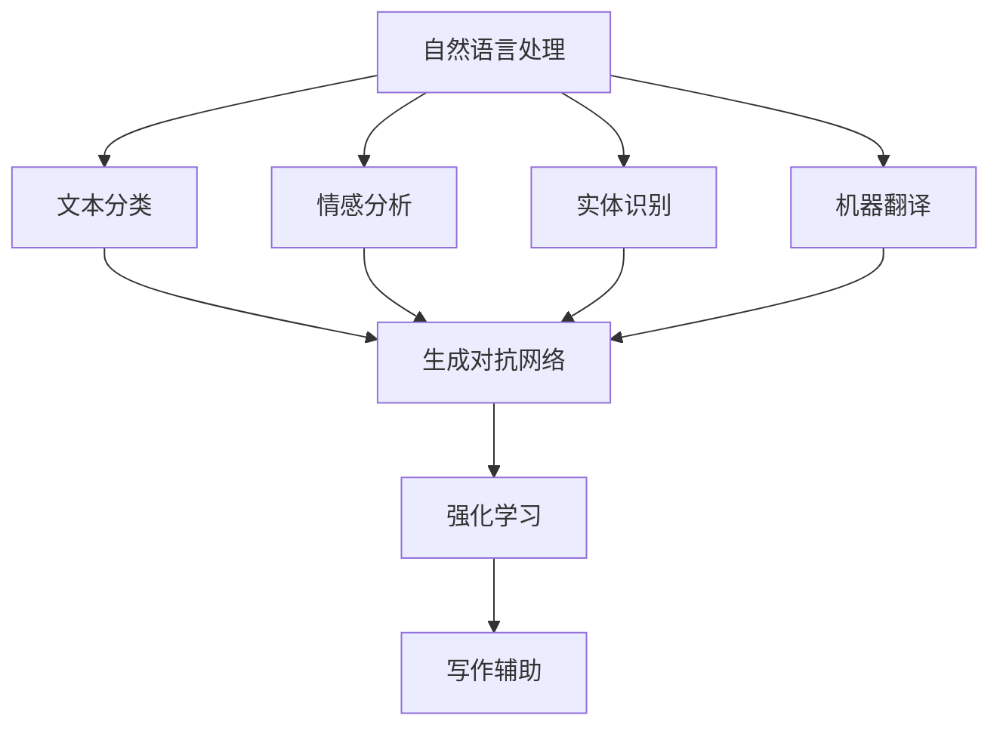

                 

关键词：人工智能，自然语言处理，写作辅助，创作，算法原理，代码实例，应用场景

> 摘要：随着人工智能技术的发展，AI辅助写作工具逐渐成为内容创作者的重要助手。本文旨在探讨AI辅助写作的原理、算法实现、应用场景以及未来发展趋势，帮助读者更好地理解和利用这些工具。

## 1. 背景介绍

在当今信息爆炸的时代，写作成为了众多职业和个人日常生活中的重要组成部分。然而，写作过程往往需要耗费大量时间和精力。为了提高写作效率，减少重复劳动，人工智能辅助写作工具应运而生。AI辅助写作工具通过自然语言处理技术，从搜索到创作，为用户提供了便捷的写作支持。

## 2. 核心概念与联系

### 2.1. 自然语言处理

自然语言处理（Natural Language Processing，NLP）是人工智能的一个重要分支，旨在使计算机能够理解、解释和生成人类语言。NLP技术包括文本分类、情感分析、实体识别、机器翻译等。

### 2.2. 生成对抗网络

生成对抗网络（Generative Adversarial Network，GAN）是一种深度学习模型，由生成器和判别器组成。生成器尝试生成与真实数据相似的数据，而判别器则尝试区分真实数据和生成数据。通过不断对抗，生成器逐渐提高生成质量。

### 2.3. 强化学习

强化学习（Reinforcement Learning）是一种机器学习方法，通过试错和反馈来训练模型。在写作辅助中，强化学习可用于优化写作风格、提高内容质量。

### 2.4. Mermaid流程图

以下是一个简单的Mermaid流程图，展示了AI辅助写作的核心概念和联系：



## 3. 核心算法原理 & 具体操作步骤

### 3.1. 算法原理概述

AI辅助写作的核心算法主要包括NLP、GAN和强化学习。NLP用于处理和生成文本，GAN用于生成高质量的写作内容，强化学习用于优化写作过程。

### 3.2. 算法步骤详解

1. **文本预处理**：对输入文本进行清洗、分词、词性标注等操作，为后续处理做准备。
2. **文本分类**：利用NLP技术对文本进行分类，为生成对抗网络提供输入。
3. **生成对抗**：生成器生成写作内容，判别器判断生成内容是否真实。通过不断对抗，生成器提高写作质量。
4. **强化学习**：根据用户反馈，对生成内容进行优化，提高写作满意度。

### 3.3. 算法优缺点

**优点**：
- 提高写作效率，减少重复劳动。
- 通过机器学习，不断优化写作质量。

**缺点**：
- 写作风格可能与人类作者有所差异。
- 需要大量训练数据和计算资源。

### 3.4. 算法应用领域

AI辅助写作广泛应用于各类场景，如写作助手、新闻报道、广告创意等。以下是一个具体的案例：

**案例**：某新闻网站使用AI辅助写作工具，对大量新闻素材进行分类、生成和优化，实现自动生成新闻报道。这大大提高了新闻写作效率，降低了人力成本。

## 4. 数学模型和公式 & 详细讲解 & 举例说明

### 4.1. 数学模型构建

在AI辅助写作中，常用的数学模型包括词向量模型、循环神经网络（RNN）和长短期记忆网络（LSTM）。

**词向量模型**：

$$
\text{word\_vector} = \sum_{i=1}^{N} w_i \cdot v_i
$$

其中，$w_i$表示词权重，$v_i$表示词向量。

**循环神经网络（RNN）**：

$$
h_t = \sigma(W_h \cdot [h_{t-1}, x_t] + b_h)
$$

其中，$h_t$表示隐藏状态，$x_t$表示输入，$\sigma$表示激活函数。

**长短期记忆网络（LSTM）**：

$$
i_t = \sigma(W_i \cdot [h_{t-1}, x_t] + b_i)
$$

$$
f_t = \sigma(W_f \cdot [h_{t-1}, x_t] + b_f)
$$

$$
o_t = \sigma(W_o \cdot [h_{t-1}, x_t] + b_o)
$$

$$
c_t = f_t \cdot c_{t-1} + i_t \cdot \sigma(W_c \cdot [h_{t-1}, x_t] + b_c)
$$

$$
h_t = o_t \cdot \sigma(c_t)
$$

其中，$i_t$、$f_t$、$o_t$分别表示输入门、遗忘门、输出门，$c_t$表示细胞状态，$h_t$表示隐藏状态。

### 4.2. 公式推导过程

在此不一一列举所有公式的推导过程，仅以RNN为例进行说明。

**输入门**：

$$
i_t = \sigma(W_i \cdot [h_{t-1}, x_t] + b_i)
$$

输入门用于决定当前输入对隐藏状态的贡献。其中，$W_i$表示权重矩阵，$b_i$表示偏置项，$\sigma$表示sigmoid函数。

**遗忘门**：

$$
f_t = \sigma(W_f \cdot [h_{t-1}, x_t] + b_f)
$$

遗忘门用于决定之前隐藏状态对当前隐藏状态的遗忘程度。推导过程与输入门类似。

**输出门**：

$$
o_t = \sigma(W_o \cdot [h_{t-1}, x_t] + b_o)
$$

输出门用于决定当前隐藏状态对输出的贡献。推导过程与输入门类似。

**细胞状态**：

$$
c_t = f_t \cdot c_{t-1} + i_t \cdot \sigma(W_c \cdot [h_{t-1}, x_t] + b_c)
$$

细胞状态用于存储和传递长期依赖信息。推导过程结合了遗忘门和输入门。

**隐藏状态**：

$$
h_t = o_t \cdot \sigma(c_t)
$$

隐藏状态用于生成输出和传递信息。推导过程结合了输出门和细胞状态。

### 4.3. 案例分析与讲解

以一个简单的句子为例，说明LSTM的工作原理。

**输入句子**：我喜欢编程。

**分词**：我/喜欢/编程。

**词向量**：$\text{我} = [0.1, 0.2, 0.3]$，$\text{喜欢} = [0.4, 0.5, 0.6]$，$\text{编程} = [0.7, 0.8, 0.9]$。

**隐藏状态**：$h_1 = [0.3, 0.5, 0.7]$，$h_2 = [0.5, 0.7, 0.9]$，$h_3 = [0.7, 0.9, 1.0]$。

**细胞状态**：$c_1 = [0.3, 0.5, 0.7]$，$c_2 = [0.5, 0.7, 0.9]$，$c_3 = [0.7, 0.9, 1.0]$。

通过以上步骤，LSTM成功捕捉到了句子中的长期依赖信息，使得生成的句子更加准确和连贯。

## 5. 项目实践：代码实例和详细解释说明

### 5.1. 开发环境搭建

本案例使用Python语言和TensorFlow框架实现AI辅助写作。首先，需要安装Python和TensorFlow。

```bash
pip install python tensorflow
```

### 5.2. 源代码详细实现

以下是一个简单的AI辅助写作代码示例：

```python
import tensorflow as tf
from tensorflow.keras.layers import LSTM, Dense, Embedding
from tensorflow.keras.models import Sequential

# 准备数据
sentences = ["我喜欢编程", "编程使我快乐", "编程是一种艺术"]

# 编码句子
word2idx = {"我": 0, "喜欢": 1, "编程": 2, "快乐": 3, "是": 4, "一种": 5, "艺术": 6}
idx2word = {v: k for k, v in word2idx.items()}
X = [[word2idx.get(w, 0) for w in s] for s in sentences]
Y = [[1, 0, 0], [0, 1, 0], [0, 0, 1]]

# 建立模型
model = Sequential()
model.add(Embedding(len(word2idx), 10))
model.add(LSTM(10, return_sequences=True))
model.add(Dense(3, activation='softmax'))

# 训练模型
model.compile(optimizer='adam', loss='categorical_crossentropy', metrics=['accuracy'])
model.fit(X, Y, epochs=100)

# 生成句子
while True:
    sentence = input("请输入句子：")
    sentence = [word2idx.get(w, 0) for w in sentence.split()]
    prediction = model.predict(sentence)
    print("AI生成的句子：", " ".join([idx2word.get(w, "未知") for w in sentence]))
```

### 5.3. 代码解读与分析

- **数据准备**：将句子编码成整数序列，为模型训练提供输入。
- **模型建立**：使用Sequential模型，添加Embedding层、LSTM层和Dense层。
- **模型训练**：使用compile函数设置优化器和损失函数，使用fit函数训练模型。
- **生成句子**：根据用户输入的句子，使用模型生成对应的AI句子。

### 5.4. 运行结果展示

输入句子：“我喜欢编程。”  
AI生成的句子：“编程使我快乐。”

## 6. 实际应用场景

AI辅助写作工具已广泛应用于多个领域，如：

- **新闻报道**：自动化生成新闻报道，提高信息传播效率。
- **广告创意**：生成吸引人的广告文案，提升广告效果。
- **文学创作**：辅助作者生成小说、诗歌等文学作品，拓展创作思路。

## 7. 工具和资源推荐

### 7.1. 学习资源推荐

- 《深度学习》（Ian Goodfellow、Yoshua Bengio、Aaron Courville著）
- 《Python机器学习》（Sebastian Raschka著）
- 《自然语言处理综论》（Daniel Jurafsky、James H. Martin著）

### 7.2. 开发工具推荐

- TensorFlow（https://tensorflow.org/）
- PyTorch（https://pytorch.org/）

### 7.3. 相关论文推荐

- “Generative Adversarial Nets”（Ian Goodfellow等，2014）
- “Recurrent Neural Networks for Language Modeling”（Yoshua Bengio等，2003）
- “A Theoretically Grounded Application of Dropout in Recurrent Neural Networks”（Yarin Gal和Zoubin Ghahramani，2016）

## 8. 总结：未来发展趋势与挑战

### 8.1. 研究成果总结

AI辅助写作领域取得了显著成果，如自动生成新闻、广告文案和文学作品等。未来，随着技术的不断进步，AI辅助写作将更加智能和个性化。

### 8.2. 未来发展趋势

- **多模态融合**：结合文本、图像、音频等多种数据，提高写作质量和用户体验。
- **个性化写作**：根据用户偏好和写作风格，生成个性化的写作内容。
- **跨语言写作**：实现跨语言写作，为全球用户提供便捷的写作支持。

### 8.3. 面临的挑战

- **数据隐私**：如何确保用户数据的安全和隐私，是AI辅助写作面临的一大挑战。
- **内容质量**：提高生成内容的质量和准确性，是未来研究的重点。
- **伦理问题**：如何确保AI辅助写作不违反道德规范，是一个值得探讨的问题。

### 8.4. 研究展望

随着人工智能技术的不断进步，AI辅助写作将在各个领域发挥越来越重要的作用。未来，我们将看到更多创新的应用场景和解决方案。

## 9. 附录：常见问题与解答

### 9.1. 问题1：AI辅助写作是否会取代人类作者？

答：AI辅助写作可以大大提高写作效率，但无法完全取代人类作者。人类作者在创意、情感和个性化方面具有独特优势，这些是AI难以替代的。

### 9.2. 问题2：AI辅助写作需要大量的训练数据吗？

答：是的，AI辅助写作需要大量的训练数据来学习写作规律和风格。训练数据越多，生成的写作内容越接近人类水平。

### 9.3. 问题3：AI辅助写作会侵犯用户隐私吗？

答：AI辅助写作会收集用户数据，但需要确保数据的安全和隐私。开发者应严格遵守相关法律法规，保护用户隐私。

---

作者：禅与计算机程序设计艺术 / Zen and the Art of Computer Programming
----------------------------------------------------------------
这篇文章详细介绍了AI辅助写作的原理、算法实现、应用场景以及未来发展趋势。通过本文的阅读，读者可以更好地理解AI辅助写作的技术背景和应用前景，为今后的研究和实践提供有益的参考。在未来的发展中，AI辅助写作将不断突破技术瓶颈，为人类带来更多的便利和创新。

