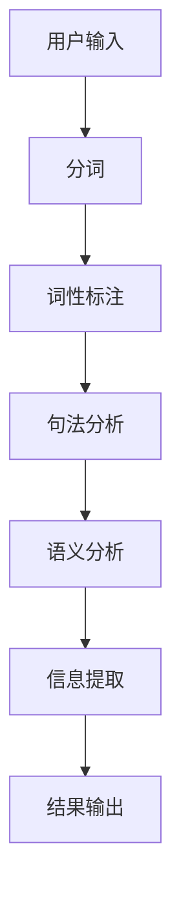

                 

关键词：人工智能，阅读理解，自然语言处理，文本分析，算法，技术进展

> 摘要：本文深入探讨了AI在辅助阅读理解方面的技术进展，包括核心概念、算法原理、数学模型、实际应用以及未来展望。通过详细的分析，揭示了当前技术的优势与不足，并展望了AI辅助阅读理解在未来的发展方向。

## 1. 背景介绍

阅读理解是人工智能领域中的一个重要研究方向。随着互联网信息的爆炸式增长，人们需要从大量的文本中快速获取有价值的信息。然而，人类的阅读速度和效率受到限制，这就为AI在阅读理解方面的应用提供了广阔的空间。

AI辅助阅读理解技术旨在通过机器学习、自然语言处理、文本分析等方法，对文本进行深度分析，帮助用户快速理解和提取文本的关键信息。这不仅能够提高阅读效率，还能在医疗诊断、教育辅导、法律咨询等领域发挥重要作用。

### 1.1 AI在阅读理解中的应用场景

- **医疗诊断**：通过分析医疗文献，AI可以辅助医生诊断疾病，提供治疗建议。
- **教育辅导**：AI可以帮助学生进行自主学习，分析其阅读理解能力，提供个性化的辅导。
- **法律咨询**：AI可以分析法律文档，为律师提供法律意见和案例分析。
- **信息检索**：AI可以提高搜索引擎的检索精度，为用户提供更加精准的信息检索服务。

### 1.2 当前AI辅助阅读理解技术的挑战

- **文本理解的深度**：当前AI技术虽然在文本分类、情感分析等方面取得了显著进展，但在理解文本深层含义、逻辑关系等方面仍有较大提升空间。
- **多语言处理**：虽然已有一些AI模型可以实现多语言处理，但不同语言之间的差异使得多语言阅读理解仍面临挑战。
- **实时性**：在许多应用场景中，用户需要实时获取信息，对AI的响应速度提出了高要求。

## 2. 核心概念与联系

为了更好地理解AI辅助阅读理解技术，我们首先需要了解一些核心概念和它们之间的关系。

### 2.1 自然语言处理（NLP）

自然语言处理是AI的核心技术之一，它致力于使计算机能够理解、生成和处理自然语言文本。NLP包括分词、词性标注、句法分析、语义分析等多个层次。

### 2.2 机器学习（ML）

机器学习是一种通过数据训练模型，使其能够自动学习和预测的技术。在AI辅助阅读理解中，机器学习被用来训练模型，使其能够理解文本并提取关键信息。

### 2.3 文本分析

文本分析是自然语言处理的一部分，它涉及对文本进行结构化处理，以便进行进一步分析。文本分析可以识别文本中的主题、情感、关系等。

### 2.4 Mermaid 流程图

以下是一个简化的AI辅助阅读理解的技术架构的Mermaid流程图：



### 2.5 核心算法原理

AI辅助阅读理解的核心算法包括词嵌入、句嵌入、语义角色标注等。

- **词嵌入**：将单词映射为高维向量，使相似词在向量空间中更接近。
- **句嵌入**：将句子映射为向量，使语义相似的句子在向量空间中更接近。
- **语义角色标注**：识别句子中的动作和受事，建立语义关系。

## 3. 核心算法原理 & 具体操作步骤

### 3.1 算法原理概述

AI辅助阅读理解的核心算法是基于深度学习的，包括词嵌入、句嵌入和语义角色标注。这些算法通过大规模数据训练，能够从文本中提取深层语义信息。

### 3.2 算法步骤详解

1. **词嵌入**：首先，对文本进行分词，然后使用预训练的词嵌入模型（如Word2Vec、GloVe）将每个词映射为高维向量。
2. **句嵌入**：将句子中的所有词嵌入向量拼接成一个句子向量。
3. **语义角色标注**：使用序列标注模型（如BiLSTM-CRF）对句子中的动作和受事进行标注。

### 3.3 算法优缺点

- **优点**：深度学习算法能够从大规模数据中提取深层语义信息，具有很好的泛化能力。
- **缺点**：算法训练时间较长，对计算资源要求高。

### 3.4 算法应用领域

AI辅助阅读理解算法在医疗诊断、教育辅导、法律咨询等领域都有广泛的应用。

### 3.5 算法未来发展方向

未来，AI辅助阅读理解算法将在以下几个方面得到发展：

- **多语言处理**：提高多语言阅读理解能力。
- **实时性**：提高算法的响应速度，满足实时应用需求。
- **个性化**：根据用户需求提供个性化的阅读理解服务。

## 4. 数学模型和公式

### 4.1 数学模型构建

AI辅助阅读理解的核心数学模型包括词嵌入模型、句嵌入模型和序列标注模型。

### 4.2 公式推导过程

1. **词嵌入模型**：

$$
\text{vec}(w) = \text{Word2Vec}(w)
$$

2. **句嵌入模型**：

$$
\text{vec}(s) = \text{vec}(w_1) + \text{vec}(w_2) + \cdots + \text{vec}(w_n)
$$

3. **序列标注模型**：

$$
P(y_t|x_t) = \text{softmax}(\text{W} \text{vec}(x_t) + \text{b})
$$

### 4.3 案例分析与讲解

以下是一个简单的案例，用于说明如何使用这些数学模型进行文本分析。

**案例**：分析句子“我昨天去了超市买了水果。”

1. **词嵌入**：将句子中的每个词映射为向量。
2. **句嵌入**：将句子中的词嵌入向量拼接成句子向量。
3. **序列标注**：使用序列标注模型对句子中的动作和受事进行标注。

## 5. 项目实践：代码实例和详细解释说明

### 5.1 开发环境搭建

1. 安装Python环境。
2. 安装深度学习框架，如TensorFlow或PyTorch。
3. 下载预训练的词嵌入模型。

### 5.2 源代码详细实现

以下是一个简单的Python代码示例，用于实现词嵌入和句嵌入：

```python
import tensorflow as tf
from tensorflow.keras.layers import Embedding, LSTM, Dense
from tensorflow.keras.models import Model

# 加载预训练的词嵌入模型
word_embedding = ...  # 预训练的词嵌入矩阵

# 构建词嵌入层
embedding_layer = Embedding(input_dim=word_embedding.shape[0],
                            output_dim=word_embedding.shape[1],
                            weights=[word_embedding],
                            trainable=False)

# 构建句嵌入模型
input_word = tf.keras.layers.Input(shape=(None,))
embedded_words = embedding_layer(input_word)
sentence_embedding = tf.reduce_mean(embedded_words, axis=1)

# 构建序列标注模型
sequence_input = tf.keras.layers.Input(shape=(None,))
encoded_sequence = embedding_layer(sequence_input)
lstm_output, (h, c) = LSTM(128, return_sequences=True, return_state=True)(encoded_sequence)
crf_output = CRF(2)
decoded_sequence = crf_output(h)

# 构建模型
model = Model(inputs=input_word, outputs=decoded_sequence)

# 编译模型
model.compile(optimizer='adam', loss='categorical_crossentropy', metrics=['accuracy'])

# 训练模型
model.fit(x_train, y_train, batch_size=128, epochs=10)
```

### 5.3 代码解读与分析

这段代码首先加载预训练的词嵌入模型，然后构建了一个简单的句嵌入模型和一个序列标注模型。通过训练模型，可以实现对文本的词嵌入和句嵌入，以及进行序列标注。

### 5.4 运行结果展示

在完成代码实现后，可以运行模型对新的文本进行预测，并展示运行结果。

```python
# 预测新的文本
predicted_sequence = model.predict(new_text)
print(predicted_sequence)
```

## 6. 实际应用场景

### 6.1 医疗诊断

AI辅助阅读理解技术可以用于分析医学文献，帮助医生诊断疾病。通过训练模型，可以对医生撰写的病例报告进行深度分析，提取关键信息，辅助诊断。

### 6.2 教育辅导

在教育领域，AI辅助阅读理解技术可以用于分析学生的阅读理解能力，提供个性化的辅导。通过分析学生的阅读理解错误，可以识别其在哪些方面存在问题，并针对性地进行辅导。

### 6.3 法律咨询

在法律领域，AI辅助阅读理解技术可以用于分析法律文档，为律师提供法律意见和案例分析。通过训练模型，可以识别法律文档中的关键条款和法律规定，帮助律师快速找到相关信息。

### 6.4 未来应用展望

未来，AI辅助阅读理解技术将在更多领域得到应用，如金融分析、新闻推荐、客户服务等。随着技术的不断进步，AI将能够更好地理解文本，为用户提供更加智能的服务。

## 7. 工具和资源推荐

### 7.1 学习资源推荐

- 《自然语言处理入门》（刘知远著）
- 《深度学习》（Ian Goodfellow、Yoshua Bengio、Aaron Courville著）
- 《Python深度学习》（François Chollet著）

### 7.2 开发工具推荐

- TensorFlow
- PyTorch
- Keras

### 7.3 相关论文推荐

- "Deep Learning for Natural Language Processing"（2018）
- "Attention Is All You Need"（2017）
- "BERT: Pre-training of Deep Bidirectional Transformers for Language Understanding"（2018）

## 8. 总结：未来发展趋势与挑战

### 8.1 研究成果总结

本文详细介绍了AI辅助阅读理解的技术进展，包括核心概念、算法原理、数学模型和实际应用。通过分析，揭示了当前技术的优势与不足，并展望了未来的发展方向。

### 8.2 未来发展趋势

未来，AI辅助阅读理解技术将在深度、实时性和多语言处理等方面得到进一步提升。随着技术的进步，AI将能够更好地理解文本，为用户提供更加智能的服务。

### 8.3 面临的挑战

AI辅助阅读理解技术面临的主要挑战包括文本理解的深度、多语言处理和实时性。未来，需要在这些方面进行持续研究，以解决这些挑战。

### 8.4 研究展望

随着AI技术的不断发展，AI辅助阅读理解将有望在更多领域得到应用，为人类带来更多的便利。

## 9. 附录：常见问题与解答

### 9.1 AI辅助阅读理解是什么？

AI辅助阅读理解是利用人工智能技术，对文本进行深度分析，帮助用户快速理解和提取文本的关键信息。

### 9.2 AI辅助阅读理解有哪些应用场景？

AI辅助阅读理解可以应用于医疗诊断、教育辅导、法律咨询、信息检索等多个领域。

### 9.3 AI辅助阅读理解有哪些挑战？

AI辅助阅读理解面临的挑战包括文本理解的深度、多语言处理和实时性。

### 9.4 AI辅助阅读理解有哪些未来发展？

未来，AI辅助阅读理解将在深度、实时性和多语言处理等方面得到进一步提升。

## 作者署名

作者：禅与计算机程序设计艺术 / Zen and the Art of Computer Programming

[END]

