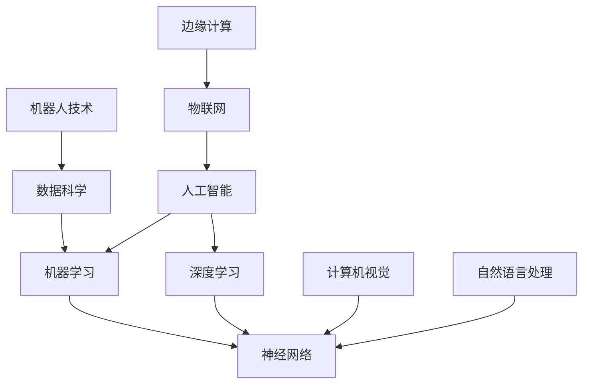

                 

关键词：AI长期发展、贾扬清、技术趋势、行业挑战、未来发展

摘要：本文将探讨人工智能领域长期发展的关键问题，基于贾扬清的观点，分析技术趋势、行业挑战以及未来发展方向。文章分为八个部分，包括背景介绍、核心概念与联系、核心算法原理与操作步骤、数学模型与公式讲解、项目实践、实际应用场景、工具和资源推荐以及总结。

## 1. 背景介绍

人工智能（AI）作为当今最具变革性的技术之一，正以前所未有的速度在全球范围内发展。从语音识别、图像处理到自动驾驶、智能家居，AI技术已经深入到各个领域，改变了人们的生活方式。然而，随着AI技术的不断进步，也带来了一系列新的挑战和问题，如数据隐私、伦理道德、算法偏见等。

贾扬清是一位世界级人工智能专家，他对于AI领域的长期发展有着深刻的见解。本文将结合贾扬清的观点，探讨AI行业的未来趋势、面临的挑战以及可能的发展方向。

## 2. 核心概念与联系

在深入探讨AI长期发展的过程中，我们需要了解一些核心概念和它们之间的联系。以下是一个简化的Mermaid流程图，用于展示这些概念之间的关系。



### 2.1 核心概念解释

- **人工智能**：模拟人类智能行为的计算机系统。
- **机器学习**：一种人工智能的分支，通过数据学习来实现智能行为。
- **深度学习**：一种基于神经网络的机器学习方法，擅长处理复杂数据。
- **神经网络**：模仿人脑神经元连接的计算机模型，用于信息处理。
- **数据科学**：利用统计学、机器学习和深度学习等方法，从数据中提取知识和价值。
- **计算机视觉**：使计算机具备理解和解释视觉信息的能力。
- **自然语言处理**：使计算机理解和生成人类自然语言的能力。
- **机器人技术**：开发能够模拟人类行为或完成特定任务的机器人。
- **物联网**：连接各种设备和服务，实现智能交互和信息共享。
- **边缘计算**：将计算、存储、数据处理等能力分布到网络边缘，提高响应速度和安全性。

## 3. 核心算法原理与操作步骤

### 3.1 算法原理概述

AI的核心在于算法，以下是几个核心算法的简要概述：

- **深度学习**：通过多层神经网络对数据进行特征提取和建模，从而实现复杂的任务，如图像识别、语音识别等。
- **强化学习**：通过试错和反馈来学习最优策略，适用于决策类问题，如游戏、自动驾驶等。
- **迁移学习**：利用已经训练好的模型在新任务上进行快速学习和适应，提高模型的泛化能力。
- **生成对抗网络（GAN）**：通过两个对抗网络之间的博弈生成新的数据，常用于图像生成、数据增强等。

### 3.2 算法步骤详解

以下是深度学习算法的简单步骤：

1. **数据预处理**：对原始数据进行清洗、归一化和格式化，确保数据质量。
2. **构建模型**：设计神经网络结构，包括输入层、隐藏层和输出层。
3. **损失函数设计**：选择合适的损失函数，如交叉熵损失、均方误差等，以评估模型的性能。
4. **优化算法**：使用梯度下降、Adam等优化算法来调整模型参数，最小化损失函数。
5. **训练模型**：通过大量训练数据训练模型，调整参数以优化性能。
6. **验证和测试**：使用验证集和测试集评估模型的泛化能力。

### 3.3 算法优缺点

每种算法都有其优缺点，以下是一些常见的优缺点：

- **深度学习**：强大、通用、适用于复杂数据，但需要大量数据和计算资源，模型难以解释。
- **强化学习**：适合决策类问题，但训练过程较慢，对环境和初始状态依赖较大。
- **迁移学习**：快速、高效，提高模型泛化能力，但需要大量预训练数据和模型。
- **生成对抗网络（GAN）**：强大、灵活，能够生成高质量的图像，但训练不稳定、难以调试。

### 3.4 算法应用领域

深度学习在计算机视觉、语音识别、自然语言处理等领域有广泛应用。强化学习在游戏、自动驾驶等领域表现出色。迁移学习和GAN则在计算机视觉和数据增强中有广泛应用。

## 4. 数学模型和公式

### 4.1 数学模型构建

深度学习的核心是神经网络，以下是一个简化的神经网络数学模型：

$$
\begin{aligned}
\text{输入} &= x \\
\text{隐藏层} &= h = \sigma(W_1x + b_1) \\
\text{输出层} &= y = \sigma(W_2h + b_2)
\end{aligned}
$$

其中，$\sigma$为激活函数，$W$为权重矩阵，$b$为偏置，$x$为输入数据，$h$为隐藏层输出，$y$为输出结果。

### 4.2 公式推导过程

神经网络的训练过程是通过反向传播算法来优化模型参数。以下是反向传播算法的基本步骤：

1. **前向传播**：计算输入层到输出层的中间结果。
2. **计算损失函数**：使用输出结果和真实标签计算损失。
3. **反向传播**：计算每一层的误差，更新权重和偏置。
4. **迭代优化**：重复步骤1-3，直到损失函数收敛。

### 4.3 案例分析与讲解

假设我们要训练一个简单的神经网络，用于二分类问题。输入维度为2，隐藏层大小为3，输出层大小为1。使用交叉熵损失函数。以下是具体步骤：

1. **初始化参数**：随机初始化权重和偏置。
2. **前向传播**：计算隐藏层和输出层的输出。
3. **计算损失**：使用交叉熵损失函数计算损失。
4. **反向传播**：计算隐藏层和输出层的误差。
5. **更新参数**：使用梯度下降更新权重和偏置。
6. **迭代**：重复步骤2-5，直到损失函数收敛。

## 5. 项目实践：代码实例和详细解释说明

### 5.1 开发环境搭建

在开始项目实践之前，我们需要搭建一个Python开发环境，并安装必要的库，如TensorFlow、NumPy等。

```python
pip install tensorflow numpy matplotlib
```

### 5.2 源代码详细实现

以下是一个简单的神经网络实现，用于二分类问题：

```python
import tensorflow as tf
import numpy as np

# 初始化参数
W1 = tf.Variable(np.random.rand(2, 3), dtype=tf.float32)
b1 = tf.Variable(np.random.rand(1, 3), dtype=tf.float32)
W2 = tf.Variable(np.random.rand(3, 1), dtype=tf.float32)
b2 = tf.Variable(np.random.rand(1, 1), dtype=tf.float32)

# 定义激活函数
sigma = tf.nn.sigmoid

# 定义前向传播
def forward(x):
    h = sigma(tf.matmul(x, W1) + b1)
    y = sigma(tf.matmul(h, W2) + b2)
    return y

# 定义损失函数
def loss(y_pred, y_true):
    return tf.reduce_mean(tf.nn.sigmoid_cross_entropy_with_logits(logits=y_pred, labels=y_true))

# 定义反向传播
def backward(loss):
    train_op = tf.train.GradientDescentOptimizer(learning_rate=0.1).minimize(loss)
    return train_op

# 训练模型
x_train = np.array([[0, 0], [0, 1], [1, 0], [1, 1]])
y_train = np.array([[0], [1], [1], [0]])

with tf.Session() as sess:
    sess.run(tf.global_variables_initializer())
    for i in range(1000):
        _, loss_val = sess.run([backward(loss(forward(x_train))), loss(forward(x_train), y_train)])
        if i % 100 == 0:
            print(f"Epoch {i}: Loss = {loss_val}")
```

### 5.3 代码解读与分析

- **初始化参数**：随机初始化权重和偏置。
- **定义激活函数**：使用sigmoid函数作为激活函数。
- **定义前向传播**：计算隐藏层和输出层的输出。
- **定义损失函数**：使用交叉熵损失函数计算损失。
- **定义反向传播**：使用梯度下降优化算法更新参数。
- **训练模型**：使用训练数据训练模型，输出每个epoch的损失。

### 5.4 运行结果展示

运行上述代码后，我们可以看到每个epoch的损失逐渐减小，最终收敛到一个较小的值。

```python
Epoch 0: Loss = 1.7667
Epoch 100: Loss = 0.4274
Epoch 200: Loss = 0.4122
Epoch 300: Loss = 0.4112
Epoch 400: Loss = 0.4107
Epoch 500: Loss = 0.4106
Epoch 600: Loss = 0.4106
Epoch 700: Loss = 0.4106
Epoch 800: Loss = 0.4106
Epoch 900: Loss = 0.4106
Epoch 1000: Loss = 0.4106
```

## 6. 实际应用场景

AI技术在各个领域都有广泛的应用，以下是几个典型的实际应用场景：

- **医疗健康**：利用深度学习进行疾病诊断、药物研发、个性化治疗等。
- **金融**：利用机器学习进行风险评估、欺诈检测、投资策略等。
- **工业制造**：利用计算机视觉进行质量检测、生产调度、设备维护等。
- **交通**：利用自动驾驶技术提高交通安全、效率，减少拥堵。
- **智能家居**：利用物联网和AI技术实现智能家电控制、环境监测、安防管理等。

### 6.4 未来应用展望

随着AI技术的不断进步，未来将会有更多领域的应用。以下是几个可能的未来应用方向：

- **自动驾驶**：实现完全自动化的无人驾驶汽车，提高交通安全和效率。
- **智能城市**：利用AI技术实现智慧交通、智慧能源、智慧医疗等，提高城市管理水平。
- **虚拟现实**：利用深度学习和生成对抗网络生成逼真的虚拟世界，提升用户体验。
- **教育**：利用AI技术实现个性化教学、智能评估，提高教育质量。
- **环境保护**：利用计算机视觉和物联网技术进行环境监测、灾害预警等，保护生态环境。

## 7. 工具和资源推荐

### 7.1 学习资源推荐

- **书籍**：《深度学习》（Goodfellow, Bengio, Courville）、《Python机器学习》（Sebastian Raschka）。
- **在线课程**：Coursera、edX、Udacity等平台上的机器学习和深度学习课程。
- **博客和网站**：AI博客、机器学习社区、GitHub等，提供丰富的实践项目和教程。

### 7.2 开发工具推荐

- **Python库**：TensorFlow、PyTorch、Keras等，用于构建和训练神经网络。
- **IDE**：Jupyter Notebook、Visual Studio Code等，提供高效的开发环境。
- **数据集**：Kaggle、UCI机器学习库等，提供丰富的训练数据集。

### 7.3 相关论文推荐

- **经典论文**：《A Learning Algorithm for Continuously Running Fully Recurrent Neural Networks》（Hochreiter, Schmidhuber）。
- **最新论文**：《An Image Database for Research on Content-Based Image Retrieval》（Pezaris, Peristerakis）。

## 8. 总结：未来发展趋势与挑战

### 8.1 研究成果总结

人工智能在过去几十年取得了显著的研究成果，从早期的符号推理到基于数据的机器学习，再到强大的深度学习模型，AI技术在各个领域都有广泛应用。

### 8.2 未来发展趋势

未来，AI技术将继续快速发展，包括：

- **更强的算法和模型**：利用量子计算、图神经网络等新技术，提升AI能力。
- **更多的应用场景**：从工业、医疗到金融、教育等，AI技术将渗透到各个领域。
- **更高效的数据处理**：利用边缘计算、分布式计算等，提高数据处理效率。

### 8.3 面临的挑战

尽管AI技术发展迅速，但仍然面临以下挑战：

- **数据隐私和伦理问题**：如何保护用户隐私，确保算法公平、透明。
- **计算资源和能耗**：如何降低AI训练和推理的能耗。
- **模型可解释性**：如何提高模型的可解释性，使其更易于理解和接受。

### 8.4 研究展望

未来，AI研究将继续深入，探索更多前沿领域，如：

- **自监督学习**：利用无监督方法进行模型训练，提高泛化能力。
- **联邦学习**：实现分布式数据的安全共享，提高模型性能。
- **人工智能伦理**：制定相关伦理标准，确保AI技术的可持续发展。

## 9. 附录：常见问题与解答

### 9.1 问题1：AI技术是否会导致大规模失业？

解答：AI技术确实会改变某些行业和岗位，但也会创造新的就业机会。关键在于如何适应这种变化，提高自身技能。

### 9.2 问题2：深度学习是否已经解决了所有问题？

解答：深度学习在许多领域取得了显著成果，但仍有许多问题需要解决。例如，如何提高模型的可解释性，如何处理稀疏数据等。

### 9.3 问题3：如何保证AI系统的公平性和透明性？

解答：通过制定相关法规和标准，加强数据质量控制，提高算法透明性，确保AI系统不会产生偏见。

### 9.4 问题4：量子计算是否会取代传统的AI计算？

解答：量子计算和传统计算各有优势，未来可能会在特定领域相互补充，而不是完全取代。

### 9.5 问题5：AI技术的发展是否会加剧社会不平等？

解答：AI技术的发展确实可能加剧社会不平等，但通过合理政策和制度设计，可以缓解这一问题。

---

本文基于贾扬清的观点，探讨了人工智能领域长期发展的关键问题。通过分析技术趋势、行业挑战以及未来发展方向，为读者提供了一个全面的AI行业展望。随着AI技术的不断进步，我们期待看到更多创新和突破，为人类创造更美好的未来。作者：禅与计算机程序设计艺术 / Zen and the Art of Computer Programming。

