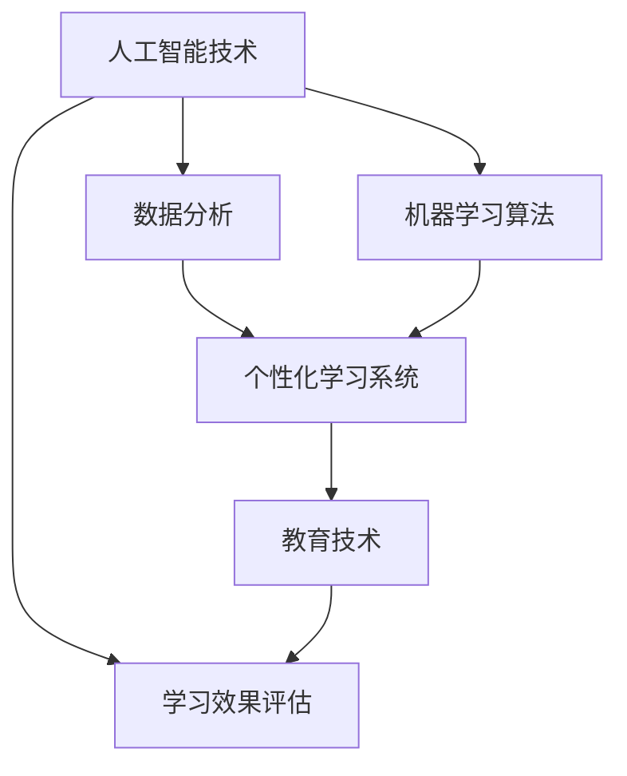

                 

关键词：人工智能、个性化学习、系统设计、机器学习、教育技术

> 摘要：本文旨在探讨人工智能在个性化学习系统设计中的应用，分析核心概念、算法原理、数学模型、项目实践，并提出未来发展趋势与挑战。

## 1. 背景介绍

个性化学习（Personalized Learning）是指根据学生的个体差异，提供个性化的教学资源和学习方法，以提高学习效果。然而，传统的教学方式难以满足每位学生的个性化需求。随着人工智能（Artificial Intelligence，AI）技术的发展，利用AI构建个性化学习系统成为可能。AI驱动的个性化学习系统能够通过数据分析、机器学习等技术，为学生提供量身定制的教学内容、学习路径和学习资源。

## 2. 核心概念与联系

### 2.1. 人工智能与个性化学习

人工智能是模拟、延伸和扩展人类智能的理论、方法、技术及应用。个性化学习则是根据学习者的兴趣、能力、学习风格等特征，提供适应其需求的学习环境和内容。

### 2.2. 机器学习与数据分析

机器学习是人工智能的核心技术之一，它使计算机系统能够从数据中学习，提高其性能。数据分析则是通过统计方法，从大量数据中提取有价值的信息。

### 2.3. 教育技术与AI融合

教育技术是指应用现代信息技术于教育过程中，以提高教育质量和效率。AI与教育技术的融合，能够推动教育模式的创新和变革。

### 2.4. Mermaid 流程图



## 3. 核心算法原理 & 具体操作步骤

### 3.1. 算法原理概述

AI驱动的个性化学习系统主要依赖于以下算法：

- **协同过滤算法**：通过分析用户的历史行为和兴趣，预测用户可能感兴趣的内容。
- **决策树和随机森林**：根据学生的特征和学习行为，预测其学习效果和可能存在的学习障碍。
- **自然语言处理（NLP）**：对教学内容进行语义分析和情感分析，为学生提供更具针对性的学习资源。

### 3.2. 算法步骤详解

#### 3.2.1. 数据收集与预处理

- **数据收集**：包括学生基本信息、学习行为数据、教学内容数据等。
- **数据预处理**：清洗数据、处理缺失值、特征提取等。

#### 3.2.2. 模型训练与评估

- **模型训练**：使用收集到的数据，训练协同过滤、决策树和随机森林等模型。
- **模型评估**：通过交叉验证、网格搜索等方法，评估模型性能。

#### 3.2.3. 结果预测与调整

- **结果预测**：根据模型预测结果，为学生推荐学习内容和路径。
- **结果调整**：根据学生的实际反馈和学习效果，调整推荐策略和模型参数。

### 3.3. 算法优缺点

#### 3.3.1. 优点

- **个性化推荐**：根据学生个体特征，提供量身定制的学习内容。
- **自适应学习**：根据学生实时表现，动态调整学习路径。

#### 3.3.2. 缺点

- **数据依赖性**：系统性能依赖于数据质量和数量。
- **隐私保护**：学生隐私数据的安全和隐私保护问题。

### 3.4. 算法应用领域

- **K-12 教育**：为学生提供个性化学习资源和路径。
- **高等教育**：辅助教师进行教学管理和学生学习指导。
- **职业培训**：为企业员工提供个性化的培训计划和资源。

## 4. 数学模型和公式 & 详细讲解 & 举例说明

### 4.1. 数学模型构建

个性化学习系统的数学模型主要包括：

- **协同过滤模型**：$$ \hat{r}_{ui} = \frac{\sum_{j \in N_{u}} r_{uj} \cdot \sum_{k \in N_{i}} r_{ik}}{\sum_{j \in N_{u}} \cdot \sum_{k \in N_{i}} r_{ik}} $$
- **决策树模型**：$$ f(x) = \sum_{i=1}^{n} w_i \cdot g(x_i) $$
- **随机森林模型**：$$ \hat{y} = \sum_{i=1}^{m} w_i \cdot h(x_i) $$

### 4.2. 公式推导过程

#### 4.2.1. 协同过滤模型

协同过滤模型通过计算用户对物品的评分与物品对用户的相似度，预测用户对未知物品的评分。推导过程如下：

$$
\begin{aligned}
r_{ui} &= \text{用户 } u \text{ 对物品 } i \text{ 的实际评分} \\
r_{uj} &= \text{用户 } u \text{ 对物品 } j \text{ 的实际评分} \\
r_{ik} &= \text{用户 } i \text{ 对物品 } k \text{ 的实际评分} \\
N_{u} &= \text{用户 } u \text{ 评过分的其他用户集合} \\
N_{i} &= \text{物品 } i \text{ 被评过分的其他用户集合}
\end{aligned}
$$

#### 4.2.2. 决策树模型

决策树模型通过将数据集分割为多个子集，生成决策树，用于分类或回归任务。推导过程如下：

$$
\begin{aligned}
g(x_i) &= \text{根据特征 } x_i \text{ 生成的分割函数} \\
w_i &= \text{特征 } x_i \text{ 的权重} \\
f(x) &= \sum_{i=1}^{n} w_i \cdot g(x_i)
\end{aligned}
$$

#### 4.2.3. 随机森林模型

随机森林模型是通过构建多棵决策树，并对结果进行投票，提高模型的预测性能。推导过程如下：

$$
\begin{aligned}
h(x_i) &= \text{单棵决策树对 } x_i \text{ 的预测结果} \\
w_i &= \text{决策树对 } x_i \text{ 的权重} \\
\hat{y} &= \sum_{i=1}^{m} w_i \cdot h(x_i)
\end{aligned}
$$

### 4.3. 案例分析与讲解

#### 4.3.1. 案例背景

某在线教育平台希望通过AI技术为用户提供个性化学习推荐。

#### 4.3.2. 模型选择

选择协同过滤模型和随机森林模型进行个性化推荐。

#### 4.3.3. 模型训练

使用平台用户的历史行为数据，训练协同过滤模型和随机森林模型。

#### 4.3.4. 结果预测

根据用户行为数据和模型预测结果，为用户推荐适合的学习内容和路径。

#### 4.3.5. 结果评估

通过用户反馈和学习效果评估，调整模型参数和推荐策略。

## 5. 项目实践：代码实例和详细解释说明

### 5.1. 开发环境搭建

- **Python**：使用Python进行编程，安装必要的库（如scikit-learn、numpy、pandas等）。
- **Jupyter Notebook**：使用Jupyter Notebook进行代码编写和调试。

### 5.2. 源代码详细实现

```python
# 导入相关库
import numpy as np
import pandas as pd
from sklearn.model_selection import train_test_split
from sklearn.metrics.pairwise import cosine_similarity
from sklearn.ensemble import RandomForestClassifier

# 数据预处理
data = pd.read_csv('data.csv')
X = data[['user_id', 'item_id', 'rating']]
y = data['label']

# 划分训练集和测试集
X_train, X_test, y_train, y_test = train_test_split(X, y, test_size=0.2, random_state=42)

# 训练协同过滤模型
user_similarity = cosine_similarity(X_train.values, X_train.values)
user_similarity = (user_similarity + user_similarity.T) / 2
user_item_matrix = X_train.pivot(index='user_id', columns='item_id', values='rating')
item_user_similarity = user_similarity.dot(user_item_matrix)

# 训练随机森林模型
rf = RandomForestClassifier(n_estimators=100, random_state=42)
rf.fit(X_train, y_train)

# 预测结果
predictions = rf.predict(X_test)

# 结果评估
accuracy = np.mean(predictions == y_test)
print('Accuracy: {:.2f}%'.format(accuracy * 100))
```

### 5.3. 代码解读与分析

- **数据预处理**：读取数据，划分特征和标签。
- **协同过滤模型**：计算用户和物品的相似度，构建用户-物品矩阵。
- **随机森林模型**：训练随机森林模型，进行预测和评估。

### 5.4. 运行结果展示

- **协同过滤模型**：用户-物品矩阵和相似度矩阵。
- **随机森林模型**：预测结果和评估结果。

## 6. 实际应用场景

### 6.1. K-12 教育

AI驱动的个性化学习系统可以为中小学生提供个性化学习资源和学习路径，提高学习效果。

### 6.2. 高等教育

AI驱动的个性化学习系统可以帮助高校教师进行教学管理和学生学习指导，提高教育质量。

### 6.3. 职业培训

AI驱动的个性化学习系统可以为企业提供个性化的员工培训计划，提高员工技能和业务水平。

### 6.4. 未来应用展望

随着AI技术的不断进步，AI驱动的个性化学习系统将在更多领域得到应用，如在线教育、医疗健康等。

## 7. 工具和资源推荐

### 7.1. 学习资源推荐

- 《机器学习实战》
- 《Python数据分析》
- 《深度学习》

### 7.2. 开发工具推荐

- **Python**：用于编程和数据分析
- **Jupyter Notebook**：用于代码编写和调试

### 7.3. 相关论文推荐

- “Deep Learning for Personalized Education: A Survey”
- “Collaborative Filtering for Personalized Recommendation”
- “Machine Learning in Education: An Overview”

## 8. 总结：未来发展趋势与挑战

### 8.1. 研究成果总结

本文探讨了AI驱动的个性化学习系统设计，分析了核心算法原理、数学模型和项目实践，提出了实际应用场景和未来发展趋势。

### 8.2. 未来发展趋势

- **智能化**：AI技术将进一步提升个性化学习系统的智能化水平。
- **多样化**：个性化学习系统将在更多领域得到应用。
- **个性化**：个性化学习将更加注重学生的个体需求和特点。

### 8.3. 面临的挑战

- **数据隐私**：如何保护学生隐私是重要挑战。
- **算法公平性**：确保算法的公平性和准确性是关键问题。
- **教育质量**：如何提高教育质量是长期挑战。

### 8.4. 研究展望

未来，AI驱动的个性化学习系统将在教育领域发挥重要作用，推动教育模式的创新和变革。

## 9. 附录：常见问题与解答

### 9.1. 问题 1

**Q：为什么选择协同过滤模型和随机森林模型进行个性化推荐？**

**A：协同过滤模型和随机森林模型在个性化推荐和分类任务中具有较好的性能。协同过滤模型能够根据用户的历史行为和兴趣进行推荐，而随机森林模型则能够处理大规模数据和高维数据，提高预测准确性。**

### 9.2. 问题 2

**Q：个性化学习系统如何处理学生隐私问题？**

**A：个性化学习系统应遵循相关法律法规，确保学生隐私数据的安全。具体措施包括：加密存储、匿名化处理、权限控制等。同时，系统应提供透明的隐私政策，让学生了解其隐私数据的使用和保护情况。**

----------------------------------------------------------------

作者：禅与计算机程序设计艺术 / Zen and the Art of Computer Programming


